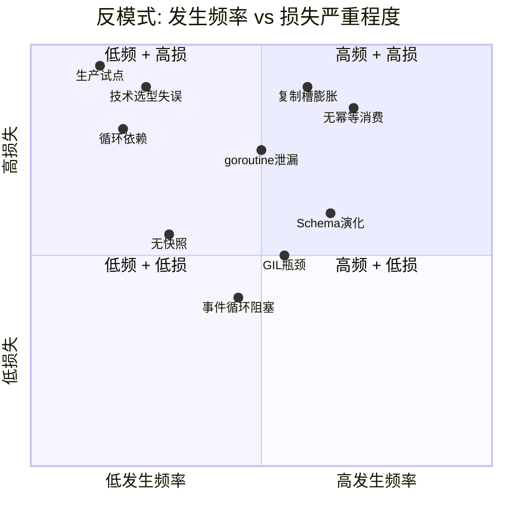
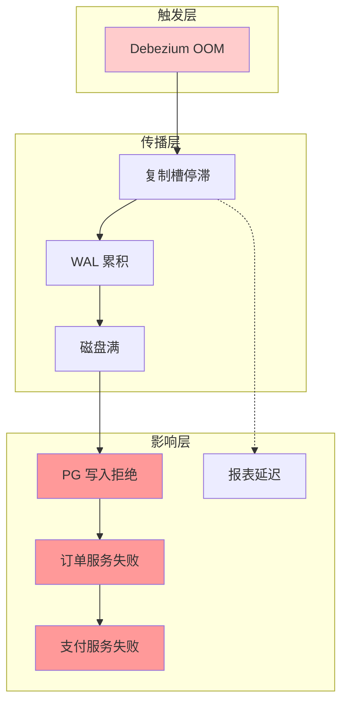

# 多语言流处理生产反例与失败模式

> 所属阶段: TECH-STACK | 前置依赖: [05.01-success-case-studies.md](./05.01-success-case-studies.md) | 形式化等级: L2

## 1. 概念定义 (Definitions)

**Def-TS-17-01** (生产反例)
生产反例定义为在真实业务环境中部署、因设计或运维失误导致重大损失（停机/数据丢失/成本超支）的流处理系统：
$$\mathcal{C}_{failure} \triangleq \langle \mathcal{O}_{org}, \mathcal{T}_{tech}, \mathcal{F}_{failure}, \mathcal{L}_{loss}, \mathcal{R}_{root} \rangle$$

**Def-TS-17-02** (反模式)
反模式 (Anti-pattern) 是一种看似合理、实践中导致负面后果的重复出现问题解决方案：
$$\mathcal{A}_{anti} \triangleq \langle \mathcal{N}_{name}, \mathcal{S}_{symptom}, \mathcal{C}_{consequence}, \mathcal{R}_{refactor} \rangle$$

**Def-TS-17-03** (技术债务临界点)
技术债务累积到导致系统不可维护的阈值：
$$D_{crit} \triangleq \{ d \mid MTTR(d) > SLA_{max} \lor Cost_{maint}(d) > Budget_{max} \}$$

**Def-TS-17-04** (级联故障)
级联故障定义为单个组件故障通过依赖链传播，导致系统大面积失效：
$$\mathcal{C}_{cascade} \triangleq \langle \mathcal{F}_{initial}, \mathcal{G}_{dep}, \mathcal{P}_{prop}, \mathcal{A}_{affected} \rangle$$

## 2. 属性推导 (Properties)

**Lemma-TS-17-01** (复杂度与故障率正相关)
系统组件数 $N$ 与故障率 $\lambda$ 正相关：
$$\lambda_{sys} = 1 - \prod_{i=1}^{N}(1 - \lambda_i) \approx \sum_{i=1}^{N}\lambda_i \quad (\lambda_i \ll 1)$$

**Lemma-TS-17-02** (监控盲区放大损失)
无监控的故障平均检测时间 (MTTD) 与有监控相比：
$$\frac{MTTD_{blind}}{MTTD_{observed}} \in [10, 1000]$$

## 3. 关系建立 (Relations)

### 失败模式与语言的关联

| 反模式 | 高发语言 | 根本原因 | 预防策略 |
|--------|---------|---------|---------|
| 内存泄漏 | Go | goroutine 泄漏/channel 未关闭 | pprof + context 取消 |
| 数据竞争 | Rust | unsafe 代码/RefCell 滥用 | Miri + 审计 unsafe |
| GIL 瓶颈 | Python | CPU 密集型流处理 | 多进程/Rust 核心 |
| 事件循环阻塞 | TypeScript | 同步 IO/cpu 计算 | Worker Threads |
| 复制槽膨胀 | 所有 | Debezium 停止消费 | 监控 slot lag |
| 无限重试风暴 | 所有 | 无退避策略 | 指数退避 + 死信队列 |

### 反模式与架构模式的关系

| 架构模式 | 常见反模式 | 后果 |
|---------|-----------|------|
| CDC + Kafka | Kafka Connect 单点 | CDC 中断，WAL 膨胀 |
| Outbox | Relay 进程单实例 | 事件发布延迟/丢失 |
| 事件溯源 | 无快照策略 | 恢复时间随事件增长 |
| 微服务事件驱动 | 循环依赖 | 级联故障 |

## 4. 论证过程 (Argumentation)

### 十大反模式深度分析

#### 反模式 1: "为技术而技术"选型

**症状**: Python 团队选择 Rust 因为"性能更好"，学习成本未计入

**案例**: 某初创公司（10 人工程团队，8 人精通 Python）选择 Rust + Fluvio 构建流平台

- 开发周期从预估 2 个月延长至 8 个月
- 编译错误消耗 30% 开发时间
- 最终回退到 Python + RisingWave，2 周完成

**损失**: 6 个月时间 + 2 名工程师离职

**重构策略**: 技术选型 = f(团队技能, 业务需求, 时间约束)，而非 f(技术先进性)

---

#### 反模式 2: 复制槽监控盲区

**症状**: Debezium 连接器停止，复制槽持续累积 WAL，磁盘撑爆

**案例**: 某电商平台 PG18 CDC → Kafka 管道

- Debezium Connect worker 因 OOM 重启失败
- 复制槽 `debezium_slot` 48 小时内累积 800GB WAL
- PG 主库磁盘满，写入拒绝，服务中断 4 小时

**根本原因**:

1. 未监控 `pg_replication_slots` 的 `confirmed_flush_lsn`
2. 未设置 `max_slot_wal_keep_size`
3. 无自动删除闲置复制槽的机制

**重构策略**:

```sql
-- 监控查询（应配置告警）
SELECT
    slot_name,
    pg_size_pretty(pg_wal_lsn_diff(pg_current_wal_lsn(), confirmed_flush_lsn)) as lag,
    active
FROM pg_replication_slots;

-- PG18 限制 WAL 保留
ALTER SYSTEM SET max_slot_wal_keep_size = '100GB';
```

---

#### 反模式 3: 无界 goroutine 泄漏

**症状**: Go 流处理服务内存持续增长，最终 OOM

**案例**: 某 Go + Watermill 服务处理 Kafka 消息

- 每条消息启动一个 goroutine 执行外部 HTTP 调用
- HTTP 客户端未设置超时，goroutine 无限等待
- 3 天后 goroutine 数达 500K，内存 16GB → OOM

**代码反例**:

```go
// 错误：每条消息一个新 goroutine，无超时
func handler(msg *message.Message) {
    go func() {
        resp, err := http.Post("...", "...", payload) // 无超时！
        // ...
    }()
}
```

**重构策略**:

```go
// 正确：使用有限 worker pool + 上下文超时
var workerPool = make(chan struct{}, 100)

func handler(msg *message.Message) {
    workerPool <- struct{}{} // 获取槽位
    defer func() { <-workerPool }() // 释放槽位

    ctx, cancel := context.WithTimeout(context.Background(), 30*time.Second)
    defer cancel()

    req, _ := http.NewRequestWithContext(ctx, "POST", "...", payload)
    resp, err := httpClient.Do(req)
    // ...
}
```

---

#### 反模式 4: Python GIL 盲区内建流处理

**症状**: Python 流处理服务 CPU 打满但吞吐量极低

**案例**: 某数据团队用纯 Python + asyncio 处理 50K/s 的传感器数据

- 每个事件需要 JSON 解析 + 数学计算
- asyncio 单事件循环无法利用多核
- 实际吞吐量仅 3K/s，CPU 100%

**根本原因**: 误将 asyncio 的 I/O 并发能力等同于计算并行能力

**重构策略**: CPU 密集型流处理应使用多进程（Bytewax）或 Rust 核心（Pathway）

---

#### 反模式 5: 事件循环阻塞（TypeScript）

**症状**: Node.js 流处理服务间歇性延迟 spike

**案例**: 某 TypeScript 服务使用 Node.js Streams 处理 PG CDC 事件

- 事件处理中包含同步 JSON Schema 验证（ajv compile）
- 大型消息（10MB JSON）导致事件循环阻塞 200ms+
- 后续消息延迟累积，P99 从 10ms 恶化至 2s

**重构策略**: 大计算量操作移至 Worker Threads 或预处理

---

#### 反模式 6: 无幂等设计的至少一次消费

**症状**: Kafka 消费者 rebalance 后数据重复处理

**案例**: 某金融系统 Kafka consumer 处理支付事件

- 消费者处理完成后、提交 offset 前崩溃
- 重启后重新消费同一批消息
- 支付状态机异常跳转（Pending → Paid → Paid）

**重构策略**: 所有消费者必须幂等，或实现 Exactly-once（事务性 offset 提交）

---

#### 反模式 7: 事件溯源无快照

**症状**: 聚合根恢复时间随事件数线性增长

**案例**: 某订单系统使用事件溯源，3 年积累 1000 万事件

- 订单聚合根恢复需重放全部事件
- 平均恢复时间 30s，高峰期超时

**重构策略**: 每 N 个事件或每 T 时间创建快照

---

#### 反模式 8: 循环事件依赖

**症状**: 微服务 A 发布事件触发 B，B 发布事件触发 A，形成循环

**案例**: 订单服务 → 库存服务 → 订单服务（补偿事件）

- 无循环检测机制
- 异常情况下无限循环，Kafka topic 消息堆积

**重构策略**: 事件携带 causality chain，检测到循环时丢弃或告警

---

#### 反模式 9: Schema 演化无兼容策略

**症状**: 生产者升级 schema 后，消费者解析失败

**案例**: 某团队修改事件 schema（重命名字段），未通知下游

- 5 个消费者服务同时崩溃
- 数据丢失 2 小时

**重构策略**: 强制使用 Schema Registry（Confluent/Apicurio），前向/后向兼容检查

---

#### 反模式 10: 生产环境直接试点新框架

**症状**: 在核心支付流上首次使用新框架

**案例**: 某团队在双十一前 2 周将核心支付管道从 Kafka Streams 迁移到自研 Rust 框架

- 负载测试中未发现内存碎片问题
- 双十一当天 4 小时后 OOM，自动重启循环
- 紧急回滚，损失订单 12 万笔

**重构策略**: 新框架必须经过影子流量 → 读侧 → 非核心流 → 核心流的渐进式验证

## 5. 形式证明 / 工程论证 (Proof / Engineering Argument)

**Thm-TS-17-01** (级联故障传播定理)

在有向依赖图 $G = (V, E)$ 中，若节点 $v_i$ 故障概率为 $p_i$，则系统整体故障概率：
$$P_{sys} = 1 - \prod_{v_i \in V}(1 - p_i)^{c_i}$$

其中 $c_i$ 为 $v_i$ 的拓扑重要性系数（如 PageRank）。

*推论*: 核心 broker（如 Kafka）的 $c_i$ 最高，其故障影响最大。因此 broker 必须高可用（多副本 + 多节点）。

**Thm-TS-17-02** (技术债务复利效应)

技术债务 $D$ 随时间增长满足：
$$D(t) = D_0 \cdot e^{rt}$$

其中 $r$ 为债务增长率（由团队规模和代码复杂度决定）。

当 $D(t) > D_{crit}$ 时，系统进入"重写是唯一选项"状态。

*工程教训*: 每月预留 20% 工程时间偿还技术债务，防止指数增长。

## 6. 实例验证 (Examples)

### 示例 1: 复制槽膨胀监控脚本

```bash
#!/bin/bash
# replication-slot-monitor.sh

LAG_BYTES=$(psql -t -c "
SELECT COALESCE(SUM(pg_wal_lsn_diff(pg_current_wal_lsn(), confirmed_flush_lsn)), 0)
FROM pg_replication_slots WHERE active = false;
")

if [ "$LAG_BYTES" -gt "$((100 * 1024 * 1024 * 1024))" ]; then
    # > 100GB
    echo "CRITICAL: Inactive replication slot lag = ${LAG_BYTES} bytes"
    # 自动删除闲置超过 24 小时的槽（谨慎使用）
    psql -c "
    SELECT pg_drop_replication_slot(slot_name)
    FROM pg_replication_slots
    WHERE active = false
      AND pg_wal_lsn_diff(pg_current_wal_lsn(), confirmed_flush_lsn) > 107374182400;
    "
fi
```

### 示例 2: Go goroutine 泄漏检测

```go
import "runtime"

func monitorGoroutines() {
    ticker := time.NewTicker(30 * time.Second)
    for range ticker.C {
        num := runtime.NumGoroutine()
        if num > 10000 {
            log.Printf("WARNING: goroutine count = %d, possible leak", num)
            // 导出 pprof 用于分析
            pprof.Lookup("goroutine").WriteTo(os.Stdout, 1)
        }
    }
}
```

### 示例 3: 幂等消费键设计

```sql
-- 幂等处理记录表
CREATE TABLE processed_events (
    event_id UUID PRIMARY KEY,
    processor_name VARCHAR(255) NOT NULL,
    processed_at TIMESTAMPTZ DEFAULT NOW(),
    result JSONB
);

-- 消费前检查
INSERT INTO processed_events (event_id, processor_name, result)
VALUES ($1, $2, $3)
ON CONFLICT (event_id) DO NOTHING
RETURNING event_id;
```

## 7. 可视化 (Visualizations)

### 十大反模式影响矩阵



### 级联故障传播图



### 技术债务增长曲线

```mermaid
xychart-beta
    title "技术债务随时间增长"
    x-axis [月1, 月3, 月6, 月12, 月18, 月24]
    y-axis "债务指数" 0 --> 100
    line [5, 10, 25, 55, 85, 98]
    line [5, 8, 15, 25, 35, 45]

    %% 无偿还策略 vs 20%偿还策略
```

## 8. 引用参考 (References)
