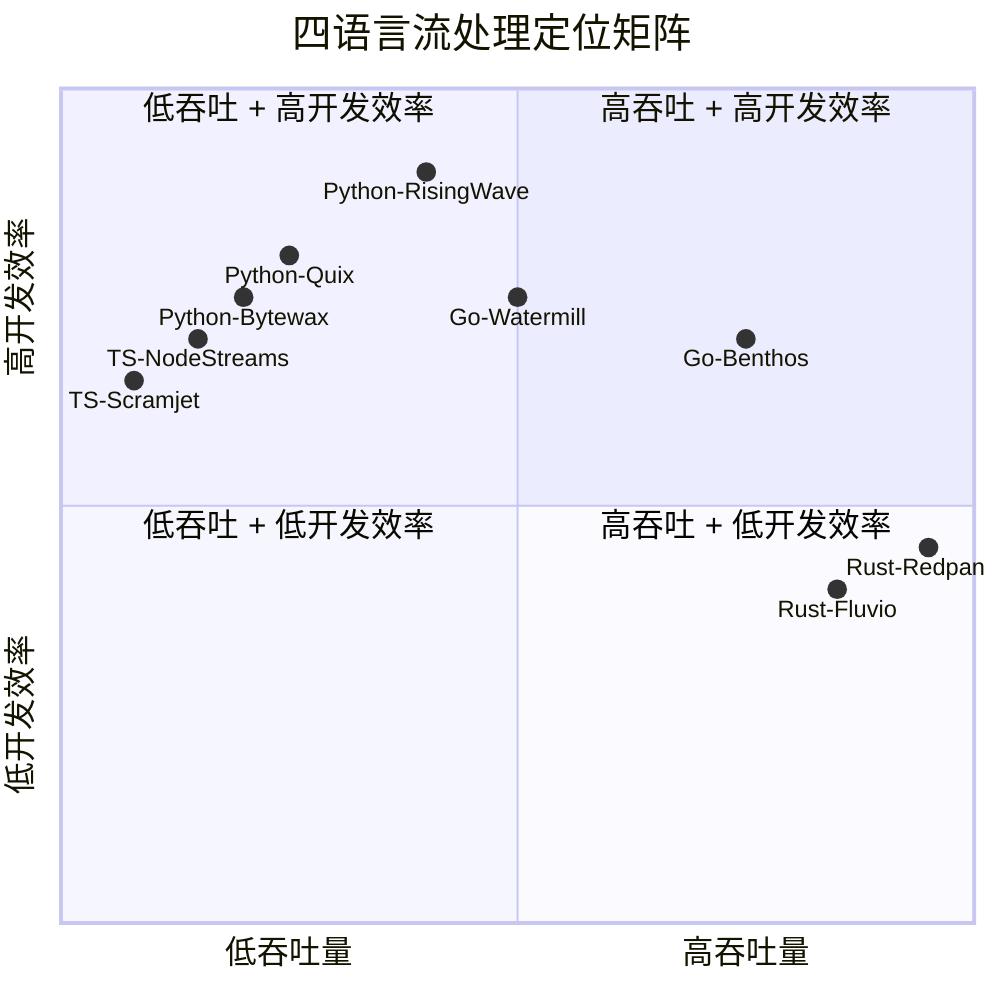
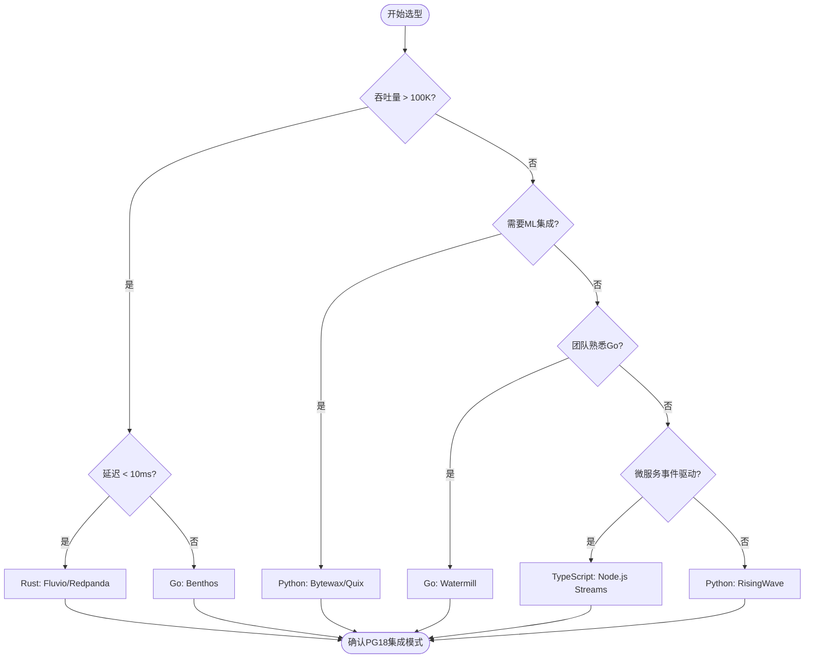
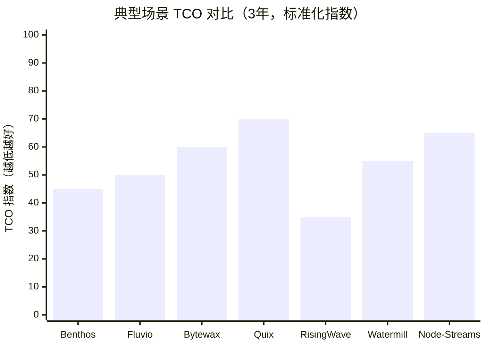

# 四语言流处理选型决策矩阵

> 所属阶段: TECH-STACK | 前置依赖: [02-language-ecosystems](../02-language-ecosystems/) | 形式化等级: L2

## 1. 概念定义 (Definitions)

**Def-TS-18-01** (选型决策空间)
流处理技术选型决策空间定义为五维向量：
$$\mathcal{D} \triangleq \langle L_{lang}, T_{throughput}, R_{reliability}, C_{complexity}, E_{ecosystem} \rangle$$
其中各维度归一化到 $[0, 1]$ 区间。

**Def-TS-18-02** (场景适配度)
框架 $f$ 对场景 $s$ 的适配度定义为加权余弦相似度：
$$\text{Fit}(f, s) \triangleq \frac{\sum_{i} w_i \cdot f_i \cdot s_i}{\sqrt{\sum_{i} w_i f_i^2} \cdot \sqrt{\sum_{i} w_i s_i^2}}$$
其中 $w_i$ 为维度权重，$\sum w_i = 1$。

**Def-TS-18-03** (技术债务风险)
技术债务风险 $R_{debt}$ 定义为框架成熟度、社区活跃度、维护状态的函数：
$$R_{debt} \triangleq \frac{1}{M_{maturity} \cdot A_{activity} \cdot S_{support}}$$

**Def-TS-18-04** (总拥有成本)
总拥有成本 (TCO) 包含显性成本与隐性成本：
$$TCO \triangleq C_{infra} + C_{ops} + C_{dev} + C_{risk}$$
其中 $C_{risk} = R_{failure} \cdot C_{downtime}$。

## 2. 属性推导 (Properties)

**Lemma-TS-18-01** (不存在万能框架)
对于任意两个场景 $s_1 \neq s_2$，不存在框架 $f$ 同时最大化两者的适配度：
$$\neg \exists f: \forall s_1 \neq s_2, \text{Fit}(f, s_1) = \text{Fit}(f, s_2) = 1$$

*证明*: 不同场景对吞吐量、延迟、复杂度的权衡不同，这些维度在归一化空间中呈帕累托前沿分布，单点无法同时覆盖所有极值。∎

**Lemma-TS-18-02** (语言生态锁定效应)
选择语言 $L$ 的框架会产生生态锁定：
$$P(switch\_L) \propto \frac{1}{E_{lib}^L \cdot D_{team}^L}$$
即团队对 $L$ 的熟练度 $D_{team}$ 和 $L$ 的库生态丰富度 $E_{lib}$ 越高，切换概率越低。

## 3. 关系建立 (Relations)

### 四语言 × 四场景适配矩阵

| 场景 | Go | Rust | Python | TypeScript |
|------|-----|------|--------|------------|
| **高吞吐消息路由** | ★★★★★ Benthos/Redpanda Connect | ★★★★★ Redpanda/Fluvio | ★★☆☆☆ 受GIL限制 | ★★☆☆☆ 事件循环瓶颈 |
| **微服务事件驱动** | ★★★★★ Watermill/Goka | ★★★★☆ 优秀但库较少 | ★★★☆☆ FastStream可用 | ★★★★☆ 事件驱动原生 |
| **实时分析/ML** | ★★☆☆☆ ML生态弱 | ★★★☆☆ Pathway桥接 | ★★★★★ 生态最强 | ★★★☆☆ 前端分析可用 |
| **边缘/IoT低资源** | ★★★★☆ 编译体积小 | ★★★★★ Fluvio 37MB | ★★☆☆☆ 运行时大 | ★★★☆☆ Deno可裁剪 |

### 与PG18 CDC的集成友好度

| 框架 | PG18 CDC集成难度 | 推荐模式 |
|------|-----------------|---------|
| Benthos | 低（内置PostgreSQL输入） | Pattern 1/4 |
| Watermill | 中（需自定义PG订阅） | Pattern 2/3 |
| Fluvio | 中（通过连接器） | Pattern 1/4 |
| Pathway | 低（内置PG CDC源） | Pattern 2 |
| Bytewax | 中（需Debezium桥接） | Pattern 1/4 |
| Quix Streams | 中（Kafka中间层） | Pattern 1/4 |
| FastStream | 低（内置PG支持） | Pattern 2/3 |
| Scramjet | 高（需自定义） | Pattern 3 |

## 4. 论证过程 (Argumentation)

### 决策树：如何选择语言与框架

```
你需要处理的吞吐量？
├── < 10K msg/s → 任何语言均可
│   └── 团队熟悉度优先
├── 10K-100K msg/s → Go/Rust/Python
│   ├── 需要ML集成 → Python (Bytewax/Quix)
│   ├── 需要微服务事件驱动 → Go (Watermill)
│   └── 需要极致性能 → Rust (Fluvio)
└── > 100K msg/s → Go/Rust
    ├── 声明式管道优先 → Go (Benthos)
    ├── Kafka兼容必要 → Rust (Redpanda)
    └── 边缘部署 → Rust (Fluvio)

你的延迟要求？
├── < 10ms P99 → Rust/Go
│   └── 避免Python/TS（GC/事件循环抖动）
├── 10-100ms P99 → Go/Rust/Python
└── > 100ms 可接受 → 任何语言

你的运维复杂度承受度？
├── 低（小团队）→ Benthos/Pathway/RisingWave
├── 中 → Watermill/Quix/Fluvio
└── 高（有平台团队）→ 自研/深度定制
```

### 常见选型误区

1. **过度追求吞吐量**: 多数场景实际吞吐量 < 10K msg/s，选择Rust的收益被开发效率抵消
2. **忽视团队技能**: Python团队强上Rust，开发速度下降3-5倍，bug率上升
3. **框架锁定风险**: Faust的维护停滞是前车之鉴，选择活跃社区至关重要
4. **忽略PG18特性**: 未利用PG18并行逻辑复制和生成列复制，造成不必要的Debezium负载

## 5. 形式证明 / 工程论证 (Proof / Engineering Argument)

**Thm-TS-18-01** (最优选型存在性定理)

对于给定场景 $s$ 和约束集 $C$，若满足：

1. 决策空间非空：$\exists f: f \in \mathcal{F}_{available}$
2. 目标函数连续
3. 约束集为闭凸集

则存在最优选型 $f^*$：
$$f^* = \arg\max_{f \in \mathcal{F}} \text{Fit}(f, s) \quad \text{s.t.} \quad C$$

*工程论证*: 实际工程中通过消除法缩小搜索空间：

- 硬约束过滤（如必须Kafka兼容 → 排除非兼容框架）
- 软约束排序（吞吐量 > 延迟 > 开发速度）
- 团队熟悉度加权

**Thm-TS-18-02** (技术债务累积定理)

设框架 $f$ 的社区活跃度为 $A(t)$（随时间递减），则技术债务累积速度：
$$\frac{dD_{debt}}{dt} = \frac{k}{A(t)}$$

当 $A(t) \to 0$ 时（项目废弃），$D_{debt} \to \infty$。

*推论*: 选择框架时应要求 $A(t) > A_{threshold}$，其中 $A_{threshold}$ 为组织可接受的最低活跃度。

## 6. 实例验证 (Examples)

### 示例 1: 电商订单流处理选型

**场景**: 处理 50K 订单事件/秒，需要实时库存更新，团队为Python为主

| 候选 | 评分 | 原因 |
|------|------|------|
| **Bytewax** | ★★★★☆ | Python API，团队零学习成本，50K在能力范围内 |
| Benthos | ★★★☆☆ | 吞吐足够，但团队需学YAML/bloblang |
| RisingWave | ★★★★★ | 无框架，SQL驱动，Python仅查询，最低TCO |

**推荐**: RisingWave + Python（ Pattern 2 嵌入式CDC）

### 示例 2: 金融风控实时检测选型

**场景**: 处理 200K 交易/秒，P99 < 5ms，需要极高可靠性，团队有Go经验

| 候选 | 评分 | 原因 |
|------|------|------|
| **Benthos + Redpanda** | ★★★★★ | Go生态，300K+吞吐，亚毫秒延迟 |
| Fluvio | ★★★★☆ | Rust性能更好，但团队学习成本高 |
| Watermill | ★★★☆☆ | 可靠但吞吐上限较低 |

**推荐**: Benthos → Redpanda → Go微服务（Pattern 1/4混合）

### 示例 3: IoT边缘流处理选型

**场景**: ARM64边缘设备，100M内存限制，处理 1K 传感器事件/秒

| 候选 | 评分 | 原因 |
|------|------|------|
| **Fluvio** | ★★★★★ | 37MB二进制，ARM64原生，纳秒延迟 |
| Benthos | ★★★★☆ | Go二进制也小，但边缘功能不如Fluvio |
| Node.js | ★★☆☆☆ | 运行时太大，V8内存 hungry |

**推荐**: Fluvio边缘部署 + Rust核心处理

## 7. 可视化 (Visualizations)

### 四语言适用场景雷达图（文字矩阵）



### 选型决策树



### TCO对比矩阵



## 8. 引用参考 (References)
