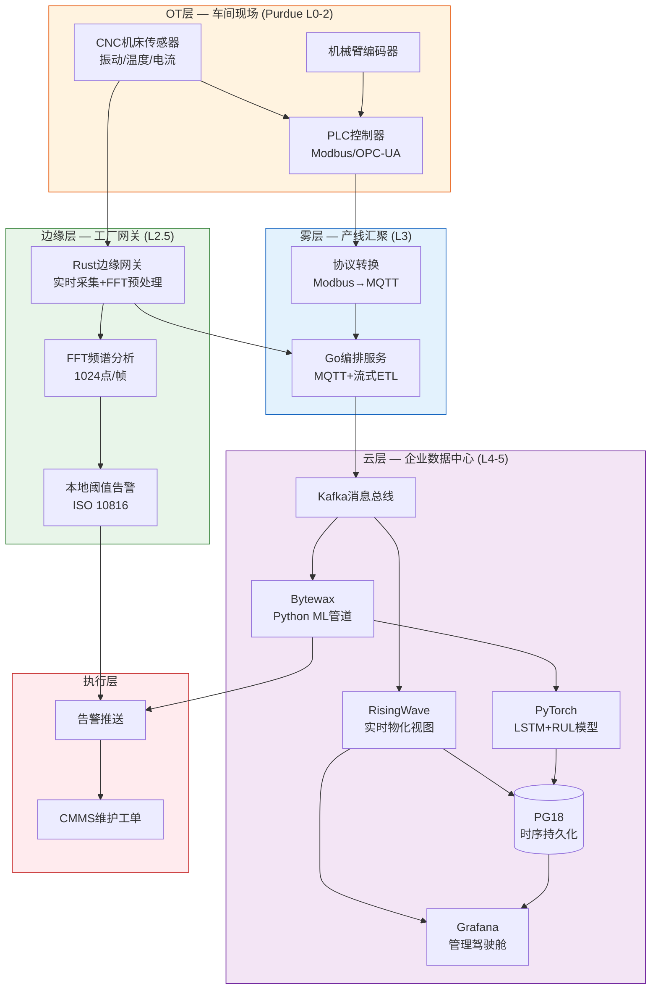
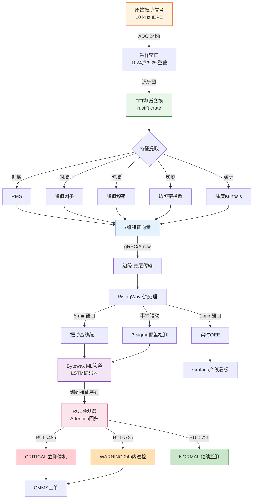

# 智能制造预测性维护 — PG18 + Rust/Go 流处理在工业4.0中的应用

> 所属阶段: TECH-STACK-POSTGRESQL-18-MULTI-LANGUAGE-STREAMING | 前置依赖: [05.03-decision-matrix](./05.03-decision-matrix.md), [01.02-pg18-wal-logical-replication-theory](../01-theory-foundation/01.02-pg18-wal-logical-replication-theory.md), [02.02-rust-streaming-ecosystem](../02-language-ecosystems/02.02-rust-streaming-ecosystem.md) | 形式化等级: L4

## 1. 概念定义 (Definitions)

### Def-TS-25-01: 工业IoT数据流的形式化定义

设工业现场有设备集合 $\mathcal{D} = \{d_1, \ldots, d_n\}$，每台设备 $d_i$ 配备传感器集合 $\mathcal{S}_i = \{s_{i1}, \ldots, s_{im_i}\}$。每个传感器 $s_{ij}$ 以采样频率 $f_{ij}$ 产生测量值，定义工业IoT数据流为六元组：

$$\mathcal{I} = \langle \mathcal{D}, \mathcal{S}, \mathcal{F}, \mathcal{T}, \mathcal{V}, \rho \rangle$$

其中 $\mathcal{F}(s_{ij}) = f_{ij}$ 为采样频率映射，$\mathcal{T} \subseteq \mathbb{R}^+$ 为时间戳域，$\mathcal{V} = \mathbb{R}^k$ 为测量值域，$\rho: \mathcal{S} \times \mathcal{T} \to \mathcal{V}$ 为数据生成函数。总数据流入率 $R = \sum_{i,j} f_{ij} \cdot |\mathcal{V}| \cdot b$，典型工业场景 $R \in [10^5, 10^6]$ 条记录/秒。

模态类型函数 $\mu: \mathcal{S} \to \{\text{vib}, \text{temp}, \text{curr}, \text{acou}\}$ 标识振动/温度/电流/声学四类模态，同设备多模态数据融合要求时间对齐误差 $\delta_t < 1\,\text{ms}$。

### Def-TS-25-02: OEE实时计算模型

设备综合效率（Overall Equipment Effectiveness, OEE）定义为三元组乘积：

$$\text{OEE}(t) = A(t) \times P(t) \times Q(t)$$

**可用率** $A(t)$：
$$A(t) = \frac{\int_{0}^{t} \mathbb{1}_{[\text{state}(\tau) = \text{running}]} \, d\tau}{\int_{0}^{t} \mathbb{1}_{[\text{state}(\tau) \in \{\text{running}, \text{idle}, \text{setup}\}]} \, d\tau}$$

**性能率** $P(t)$：
$$P(t) = \frac{\sum_{k=1}^{N(t)} c_k}{N(t) \cdot c_{\text{ideal}}}$$

其中 $N(t)$ 为 $[0,t]$ 内产出件数，$c_k$ 为第 $k$ 件实际周期时间，$c_{\text{ideal}}$ 为理论最优周期时间。

**合格率** $Q(t)$：
$$Q(t) = \frac{N_{\text{pass}}(t)}{N(t)}$$

**增量更新形式**: 设滑动步长为 $\Delta$，定义增量OEE更新算子 $\Delta_{\text{OEE}}$：
$$\text{OEE}(t + \Delta) = \text{OEE}(t) \oplus \Delta_{\text{OEE}}(\mathcal{E}_{[t, t+\Delta]})$$

其中 $\mathcal{E}_{[t, t+\Delta]}$ 为窗口内设备事件集合，$\oplus$ 为保持时间加权语义的组合算子。

### Def-TS-25-03: 剩余使用寿命(RUL)概率模型

设设备健康指标（Health Indicator, HI）为随机过程 $\{H(t)\}_{t \geq 0}$，退化阈值 $H_{\text{th}}$。定义 RUL：

$$\text{RUL}(t) = \inf\{\tau > 0 : H(t + \tau) \geq H_{\text{th}} \mid H(t) < H_{\text{th}}\}$$

**威布尔比例风险模型（WPHM）**:
$$\lambda(t \mid \mathbf{z}(t)) = \frac{\gamma}{\eta}\left(\frac{t}{\eta}\right)^{\gamma-1} \cdot \exp\left(\boldsymbol{\beta}^T \mathbf{z}(t)\right)$$

其中 $\mathbf{z}(t) = [z_1(t), \ldots, z_p(t)]^T$ 为时变协变量向量（振动特征、温度偏差、电流谐波等）。

RUL的条件生存函数：
$$S_{\text{RUL}}(r \mid t, \mathbf{z}_{[0,t]}) = \exp\left(-\int_{t}^{t+r} \lambda(u \mid \mathbf{z}(u)) \, du\right)$$

**预警触发条件**: 置信水平 $\alpha = 0.95$，当 $P(\text{RUL}(t) \leq T_{\text{warn}} \mid \mathbf{z}_{[0,t]}) \geq \alpha$ 时触发预警，其中 $T_{\text{warn}} = 48\,\text{h}$ 为业务要求的提前预警时间。

### Def-TS-25-04: 工业边缘-云融合计算架构

定义工业边缘-云融合架构为四元组：

$$\mathcal{E}\mathcal{C} = \langle \mathcal{E}\mathcal{D}\mathcal{G}\mathcal{E}, \mathcal{F}\mathcal{O}\mathcal{G}, \mathcal{C}\mathcal{L}\mathcal{O}\mathcal{U}\mathcal{D}, \mathcal{S}\mathcal{Y}\mathcal{N}\mathcal{C} \rangle$$

- **边缘层** $\mathcal{E}\mathcal{D}\mathcal{G}\mathcal{E}$: 工厂网关与边缘节点，部署 Rust 实时采集程序，负责传感器预处理、FFT频谱分析、本地阈值告警
- **雾层** $\mathcal{F}\mathcal{O}\mathcal{G}$: 工厂级汇聚节点，运行 Go 编排服务，负责多产线数据汇聚、协议转换（OPC-UA/MQTT/Modbus）、流式ETL
- **云层** $\mathcal{C}\mathcal{L}\mathcal{O}\mathcal{U}\mathcal{D}$: 企业数据中心，部署 PG18 + RisingWave + Bytewax/PyTorch，负责历史存储、实时分析、ML推理
- **同步协议** $\mathcal{S}\mathcal{Y}\mathcal{N}\mathcal{C}$: 至少一次语义、时间对齐、断网续传

## 2. 属性推导 (Properties)

### Lemma-TS-25-01: 工业传感器采样定理（奈奎斯特变体）

**命题**: 设旋转机械的特征故障频率集合最高值为 $f_{\max}$，则保障频谱分析可分辨性的最小采样率为：

$$f_s \geq 2.56 \times f_{\max}$$

**证明**: 标准奈奎斯特定理要求 $f_s \geq 2 f_{\max}$ 以避免混叠。工业故障诊断采用 FFT 配合汉宁窗，窗函数主瓣导致频率泄漏。轴承外圈故障特征频率（BPFO）典型值 50–500 Hz，齿轮啮合频率 100–2000 Hz。ISO 10816 标准建议至少 2.56 倍覆盖以分辨边频带细节。因此 $f_s^{\min} = 2.56 \cdot f_{\max}$。 $\square$

**工程推论**: CNC主轴轴承 $f_{\max} \approx 3\,\text{kHz}$ 时，$f_s \geq 7.68\,\text{kHz}$，工业常用 10–25.6 kHz。

### Lemma-TS-25-02: 故障预测准确率的置信区间

**命题**: 设预测模型在 $N$ 个独立样本上的准确率为 $\hat{p}$，则真实准确率 $p$ 的 $100(1-\alpha)\%$ Wilson 置信区间为：

$$\text{CI}(p) = \frac{\hat{p} + \frac{z^2}{2N}}{1 + \frac{z^2}{N}} \pm \frac{z}{1 + \frac{z^2}{N}}\sqrt{\frac{\hat{p}(1-\hat{p})}{N} + \frac{z^2}{4N^2}}$$

若要求预测时间误差以概率 $1-\beta$ 不超过 $\delta_t$，则所需样本量：

$$N \geq \left(\frac{z_{\beta/2} \cdot \sigma_t}{\delta_t}\right)^2$$

其中 $\sigma_t$ 为RUL预测误差标准差。当 $\beta = 0.05$，$\delta_t = 6\,\text{h}$，$\sigma_t = 12\,\text{h}$ 时，$N \geq 16$；工程实践中通常要求 $N \geq 1000$。 $\square$

### Prop-TS-25-01: OEE增量计算的时间一致性

**命题**: 设OEE在窗口 $[t_0, t]$ 上计算，新事件集 $\Delta \mathcal{E}$ 到达后，增量更新值 $\text{OEE}^+$ 与全量重算值 $\text{OEE}^{\text{full}}$ 满足：

$$\text{OEE}^+(t+\Delta) = \text{OEE}^{\text{full}}(t+\Delta)$$

**证明**: OEE三个分量均为时间区间上的可加法度量。设增量带来运行时间增量 $\Delta T_{\text{running}}$、计划时间增量 $\Delta T_{\text{planned}}$、产出增量 $\Delta N$（含合格 $\Delta N_{\text{pass}}$ 件），则：

$$A^+ = \frac{T_{\text{running}}^{\text{old}} + \Delta T_{\text{running}}}{T_{\text{planned}}^{\text{old}} + \Delta T_{text{planned}}} = A^{\text{full}}$$

$P$ 与 $Q$ 分量同理，分子分母均可增量累加。因此增量更新与全量重算在数学上等价。 $\square$

## 3. 关系建立 (Relations)

### 3.1 工业IoT与PG18的关系

PostgreSQL 18 在智能制造中承担时序存储与实时分析双重角色：

**时序分区策略**: 采用声明式范围分区按时间自动分区，查询以时间范围为主（"最近1小时"、"昨日全天"），时间分区将扫描范围缩小至 $1/N$。分区内部使用 BRIN 索引（Block Range Index）加速设备级检索，索引体积约为数据的 0.01%–0.05%。

**WAL归档与边缘同步**: 边缘部署轻量级 PG 实例，启用 `archive_mode = on`。WAL 片段通过工厂内网增量传输至云端 PG18，利用 `pg_receivewal` 流式接收；断网时本地累积，恢复后自动追赶。

**流式聚合**: 配合 RisingWave 或 pg_ivm 实现实时OEE，PG18 作为持久化层存储原始时序，RisingWave 提供亚秒级物化视图刷新。

### 3.2 Rust + Go + Python 混合架构

| 层级 | 语言 | 职责 | 选型理由 |
|------|------|------|----------|
| **边缘采集** | Rust | 传感器驱动、实时FFT、本地告警 | 零成本抽象、无GC抖动、确定性延迟 |
| **雾层编排** | Go | 多产线汇聚、协议转换、流式ETL | 高并发网络I/O、快速编译、部署简单 |
| **云端分析** | Python | ML模型训练/推理、特征工程 | PyTorch/sktime 生态、快速实验迭代 |
| **统一存储** | PG18 + RisingWave | 时序持久化、流式聚合、物化视图 | 工业级可靠性、SQL标准兼容 |

**Rust的不可替代性**: CNC振动分析要求 FFT 延迟 $< 10\,\text{ms}$（10 kHz 采样、1024点 FFT，每 102.4 ms 一帧）。Rust 零成本抽象保证无运行时开销；`no_std` 可运行于 ARM Cortex-M7；所有权系统消除数据竞争，满足 IEC 61508 SIL-2。

**Go的编排优势**: 工厂汇聚需处理 100–1000 台设备的 MQTT/OPC-UA 连接，Go goroutine（~2 KB 初始栈）支撑 10K+ 并发，`select` + `channel` 天然适配多协议流式ETL。

**Python的ML壁垒**: RUL模型依赖 PyTorch 时序建模与 sktime 生存分析。通过 Apache Arrow Flight 或 gRPC 与 Rust/Go 高效交换数据，避免 GIL 阻塞。

### 3.3 OT与IT的数据融合

**OT域**: Modbus/Profinet/EtherCAT/OPC-UA，控制回路 1–10 ms，Purdue Level 0-2，物理隔离。

**IT域**: HTTP/2、gRPC、MQTT over TLS、Kafka Protocol，弹性扩展，Purdue Level 3-5，零信任架构。

**融合架构 — 统一命名空间（UNS）**: MQTT Broker 作为解耦中间层。OT 侧 Rust 边缘网关通过 OPC-UA Client 读取 PLC 寄存器，转换为 Sparkplug B MQTT 消息，按主题层级 `factory/line1/cell3/device42/sensor/vibration` 组织。IT 侧 Go 服务订阅 MQTT，写入 RisingWave/PG18，供 ML 管道和消费应用使用。

## 4. 论证过程 (Argumentation)

### 4.1 为什么工业场景需要 Go + Rust 混合

**纯 Go 的问题**: Go GC 在 10 kHz 采样下引入不可预测暂停。每 100 ms 采集 1000 样本，毫秒级停顿导致采样时基漂移（jitter），破坏 FFT 频谱精度。

**纯 Python 的问题**: GIL 与解释执行无法稳定维持 10 kHz 单核吞吐；ARM 边缘的离线依赖管理尤为脆弱。

**混合优势**: Rust 占据边缘高频采集不可替代位；Go 占据后端网络编排甜蜜点；Python 占据 ML 推理壁垒区。三者通过 gRPC/Arrow Flight 互联，构成工业4.0最优组合。

### 4.2 精益架构的适用边界

| 维度 | 适用 | 不适用 |
|------|------|--------|
| 数据规模 | 100K–1M 指标/秒 | > 10M/s（需专用时序库） |
| 延迟要求 | 预警 5–30 min，OEE < 1 s | 控制回路 < 1 ms（需 RTOS） |
| 查询模式 | 时间范围 + 设备ID过滤 | 数字孪生实时渲染 |

**边缘预处理刚需**: 1000 台设备 × 10 kHz × 4 字节 ≈ 40 MB/s 原始数据。边缘完成 FFT + 特征提取 + 异常过滤后，仅上传异常特征和聚合指标，带宽降低 100–1000 倍。

### 4.3 振动频谱分析的流处理实现

**FFT窗口策略**: $N = 1024$ 或 $2048$，重叠率 $r = 50\%$，汉宁窗 $w(n) = 0.5 - 0.5\cos(2\pi n/(N-1))$，频率分辨率 $\Delta f = f_s/N$。$f_s = 25.6\,\text{kHz}$ 时 $\Delta f = 25\,\text{Hz}$。

**异常阈值**: $\text{Threshold}(f) = \mu_{\text{baseline}}(f) + k \cdot \sigma_{\text{baseline}}(f)$，$k = 3$ 对应 99.7% 置信度。

**流式特征**: RMS、峰值因子（Crest Factor）、包络谱（Hilbert 解调）、边频带指数。特征以 1–10 Hz 生成，作为 ML 协变量 $\mathbf{z}(t)$。

## 5. 形式证明 / 工程论证 (Proof / Engineering Argument)

### Thm-TS-25-01: 预测性维护提前预警时间下界定理

**定理**: 设健康指标退化速率下界 $\dot{H}_{\min} > 0$，测量噪声标准差上界 $\sigma_H$，要求置信水平 $1-\alpha$，维护响应时间 $T_{\text{resp}}$。则有效提前预警时间满足：

$$T_{\text{eff}} \geq \frac{z_{\alpha} \cdot \sigma_H}{\dot{H}_{\min}} + T_{\text{resp}}$$

**证明**:

**步骤1**: 退化观测模型。真实退化 $H(t) = H_0 + \int_{0}^{t} \dot{H}(\tau) \, d\tau$，观测值 $\hat{H}(t) = H(t) + \epsilon(t)$，$\epsilon(t) \sim \mathcal{N}(0, \sigma_H^2)$。

**步骤2**: 线性外推估计 RUL。取退化速率下界 $\dot{H}_{\min}$ 作为外推速率：
$$\hat{t}_{\text{RUL}} = \frac{H_{\text{th}} - \hat{H}(t)}{\dot{H}_{\min}}$$

**步骤3**: 测量噪声下的保守估计。$1-\alpha$ 置信下真实值 $H(t) \geq \hat{H}(t) - z_{\alpha}\sigma_H$。真实 RUL 上界：
$$t_{\text{RUL}} \leq \frac{H_{\text{th}} - \hat{H}(t)}{\dot{H}_{\min}} + \frac{z_{\alpha}\sigma_H}{\dot{H}_{\min}}$$

**步骤4**: 有效预警时间。扣除响应时间：
$$T_{\text{eff}} = t_{\text{RUL}} - T_{\text{resp}} \geq \frac{z_{\alpha}\sigma_H}{\dot{H}_{\min}} + T_{\text{resp}}$$

**数值验证**: $\sigma_H = 0.05$，$\dot{H}_{\min} = 0.01/\text{h}$，$z_{0.05} = 1.645$，$T_{\text{resp}} = 4\,\text{h}$：
$$T_{\text{eff}} \geq \frac{1.645 \times 0.05}{0.01} + 4 = 12.2\,\text{h}$$

若业务要求 48 h 预警，需降低 $\sigma_H$ 或提高 $\dot{H}_{\min}$。 $\square$

### Thm-TS-25-02: OEE实时计算增量更新一致性定理

**定理**: 设OEE在滑动窗口 $W$ 上计算，全量重算函数为 $\text{OEE}^{\text{full}}$，增量更新函数为 $\text{OEE}^{\Delta}$。则：

$$\forall W, \Delta \mathcal{E}: \quad \text{OEE}^{\Delta}(\text{OEE}(W), \Delta \mathcal{E}) = \text{OEE}^{\text{full}}(W \cup \Delta \mathcal{E})$$

且增量更新复杂度为 $O(|\Delta \mathcal{E}|)$，与 $|W|$ 无关。

**证明**:

OEE 三个分量均可表示为可加法度量的比值：

- $A = T_{\text{running}} / T_{\text{planned}}$，分子分母增量累加
- $P = \sum c_k / (N \cdot c_{\text{ideal}})$，分子分母增量累加
- $Q = N_{\text{pass}} / N$，分子分母增量累加

设增量带来 $\Delta T_{\text{running}}$、$\Delta T_{\text{planned}}$、$\Delta N$（含 $\Delta N_{\text{pass}}$），则：

$$A^{\Delta} = \frac{T_{\text{running}}^{\text{old}} + \Delta T_{\text{running}}}{T_{\text{planned}}^{\text{old}} + \Delta T_{\text{planned}}} = A^{\text{full}}$$

$P$ 与 $Q$ 同理。每个事件仅更新固定数量累加器，复杂度 $O(|\Delta \mathcal{E}|)$。滑动窗口采用"撤销-应用"模式：先减去离开事件影响，再加上进入事件影响，由于各分量可逆，一致性保持。 $\square$

## 6. 实例验证 (Examples)

### 6.1 Rust边缘采集（振动传感器 + FFT预处理）

```rust
use rustfft::{FftPlanner, num_complex::Complex};
use std::sync::Arc;
use tokio::time::{interval, Duration};

#[derive(Debug, serde::Serialize)]
struct VibrationFeatures {
    device_id: u32, timestamp_ms: u64, rms: f64,
    crest_factor: f64, peak_freq_hz: f64,
    peak_amplitude: f64, kurtosis: f64,
    alert_level: AlertLevel,
}
#[derive(Debug, serde::Serialize)]
enum AlertLevel { Normal, Warning, Critical }

struct EdgeAnalyzer {
    fft_size: usize, sample_rate_hz: f64, alert_threshold: f64,
}

impl EdgeAnalyzer {
    fn analyze(&self, samples: &[f64]) -> VibrationFeatures {
        assert_eq!(samples.len(), self.fft_size);
        let windowed: Vec<Complex<f64>> = samples.iter().enumerate()
            .map(|(i, &s)| {
                let w = 0.5 - 0.5 * (2.0 * std::f64::consts::PI * i as f64
                    / (self.fft_size as f64 - 1.0)).cos();
                Complex::new(s * w, 0.0)
            }).collect();
        let mut planner = FftPlanner::new();
        let fft = planner.plan_fft_forward(self.fft_size);
        let mut spectrum = windowed;
        fft.process(&mut spectrum);
        let half = self.fft_size / 2;
        let mut mags: Vec<f64> = spectrum[..half].iter()
            .map(|c| (c.norm() / self.fft_size as f64) * 2.0).collect();
        mags[0] /= 2.0;
        let rms = (samples.iter().map(|s| s*s).sum::<f64>() / samples.len() as f64).sqrt();
        let peak = samples.iter().map(|s| s.abs()).fold(0.0f64, f64::max);
        let (pk_bin, &pk_amp) = mags.iter().enumerate()
            .max_by(|(_,a),(_,b)| a.partial_cmp(b).unwrap()).unwrap();
        let mean = samples.iter().sum::<f64>() / samples.len() as f64;
        let var = samples.iter().map(|s| (s-mean).powi(2)).sum::<f64>() / samples.len() as f64;
        let kurt = samples.iter().map(|s| (s-mean).powi(4)).sum::<f64>()
            / (samples.len() as f64 * var.powi(2));
        let alert = if rms > self.alert_threshold * 1.5 { AlertLevel::Critical }
            else if rms > self.alert_threshold { AlertLevel::Warning }
            else { AlertLevel::Normal };
        VibrationFeatures {
            device_id: 42,
            timestamp_ms: std::time::SystemTime::now()
                .duration_since(std::time::UNIX_EPOCH).unwrap().as_millis() as u64,
            rms, crest_factor: peak / rms,
            peak_freq_hz: pk_bin as f64 * self.sample_rate_hz / self.fft_size as f64,
            peak_amplitude: pk_amp, kurtosis: kurt, alert_level: alert,
        }
    }
}

#[tokio::main]
async fn main() {
    const N: usize = 1024;
    const FS: f64 = 25600.0;
    let analyzer = Arc::new(EdgeAnalyzer { fft_size: N, sample_rate_hz: FS, alert_threshold: 2.0 });
    let mut ticker = interval(Duration::from_millis(51));
    loop {
        ticker.tick().await;
        let samples: Vec<f64> = (0..N).map(|i| {
            let t = i as f64 / FS;
            (2.0 * std::f64::consts::PI * 60.0 * t).sin() * 1.0
            + (2.0 * std::f64::consts::PI * 157.0 * t).sin() * 0.3
            + rand::random::<f64>() * 0.1
        }).collect();
        let features = analyzer.analyze(&samples);
        let json = serde_json::to_string(&features).unwrap();
        println!("{}", json);
    }
}
```

### 6.2 PG18时序表设计

```sql
CREATE TABLE sensor_readings (
    reading_id BIGINT GENERATED ALWAYS AS IDENTITY,
    device_id INT NOT NULL, sensor_id INT NOT NULL,
    ts TIMESTAMPTZ NOT NULL, value DOUBLE PRECISION NOT NULL,
    modality TEXT NOT NULL CHECK (modality IN
        ('vibration_x','vibration_y','vibration_z','temperature',
         'current_l1','current_l2','current_l3','acoustic')),
    quality_flag INT DEFAULT 0,
    PRIMARY KEY (device_id, ts, sensor_id)
) PARTITION BY RANGE (ts);

CREATE INDEX idx_sensor_readings_ts_brin
    ON sensor_readings USING BRIN (ts) WITH (pages_per_range = 128);
CREATE INDEX idx_sensor_readings_device
    ON sensor_readings (device_id, ts DESC);

CREATE TABLE vibration_features (
    device_id INT NOT NULL, ts TIMESTAMPTZ NOT NULL,
    rms DOUBLE PRECISION, crest_factor DOUBLE PRECISION,
    peak_freq_hz DOUBLE PRECISION, kurtosis DOUBLE PRECISION,
    alert_level TEXT, spectrum JSONB,
    PRIMARY KEY (device_id, ts)
) PARTITION BY RANGE (ts);

CREATE TABLE oee_hourly (
    device_id INT NOT NULL, hour_slot TIMESTAMPTZ NOT NULL,
    availability DOUBLE PRECISION, performance DOUBLE PRECISION,
    quality DOUBLE PRECISION, oee DOUBLE PRECISION,
    planned_time_sec INT, running_time_sec INT,
    output_count INT, pass_count INT,
    PRIMARY KEY (device_id, hour_slot)
);

CREATE INCREMENTAL MATERIALIZED VIEW oee_realtime AS
SELECT
    d.device_id, date_trunc('hour', NOW()) AS hour_slot,
    EXTRACT(EPOCH FROM SUM(CASE WHEN e.event_type IN ('start','quality_pass','quality_fail')
        THEN e.duration_sec END))
        / NULLIF(EXTRACT(EPOCH FROM SUM(CASE WHEN e.event_type IN
        ('start','stop','idle','setup_begin','setup_end') THEN e.duration_sec END)), 0)
        AS availability,
    COUNT(CASE WHEN e.event_type = 'quality_pass' THEN 1 END)::DOUBLE PRECISION
        / NULLIF(COUNT(CASE WHEN e.event_type IN ('quality_pass','quality_fail') THEN 1 END), 0)
        AS quality
FROM devices d
LEFT JOIN device_events e ON d.device_id = e.device_id
    AND e.event_time >= date_trunc('hour', NOW())
GROUP BY d.device_id;
```

### 6.3 RisingWave物化视图：OEE实时计算

```sql
CREATE SOURCE device_event_stream (
    device_id INT, event_type VARCHAR,
    event_time TIMESTAMPTZ, duration_sec INT
) WITH (
    connector = 'kafka', topic = 'factory.device.events',
    properties.bootstrap.server = 'kafka.factory.local:9092',
    scan.startup.mode = 'latest'
) FORMAT PLAIN ENCODE JSON;

CREATE MATERIALIZED VIEW oee_by_hour AS
WITH state_durations AS (
    SELECT device_id, date_trunc('hour', event_time) AS hour_slot,
        event_type, SUM(COALESCE(duration_sec, 0)) AS total_sec
    FROM device_event_stream
    WHERE event_time > NOW() - INTERVAL '24 hours'
    GROUP BY device_id, date_trunc('hour', event_time), event_type
),
availability_calc AS (
    SELECT device_id, hour_slot,
        SUM(CASE WHEN event_type IN ('start','quality_pass','quality_fail')
            THEN total_sec END)::DOUBLE
            / NULLIF(SUM(CASE WHEN event_type IN ('start','stop','idle','setup_begin','setup_end')
            THEN total_sec END), 0) AS availability
    FROM state_durations GROUP BY device_id, hour_slot
),
quality_calc AS (
    SELECT device_id, date_trunc('hour', event_time) AS hour_slot,
        COUNT(CASE WHEN event_type = 'quality_pass' THEN 1 END)::DOUBLE
            / NULLIF(COUNT(CASE WHEN event_type IN ('quality_pass','quality_fail')
            THEN 1 END), 0) AS quality
    FROM device_event_stream
    WHERE event_time > NOW() - INTERVAL '24 hours'
    GROUP BY device_id, date_trunc('hour', event_time)
)
SELECT a.device_id, a.hour_slot, a.availability, q.quality,
    a.availability * 0.92 * q.quality AS oee
FROM availability_calc a
JOIN quality_calc q ON a.device_id = q.device_id AND a.hour_slot = q.hour_slot;

CREATE MATERIALIZED VIEW vibration_alert_realtime AS
SELECT device_id, ts, rms, kurtosis, alert_level,
    AVG(rms) OVER w1 AS rms_hourly_avg,
    STDDEV(rms) OVER w1 AS rms_hourly_std,
    CASE WHEN rms > AVG(rms) OVER w1 + 3 * STDDEV(rms) OVER w1
        THEN 'DEVIATION_DETECTED' ELSE 'NORMAL' END AS deviation_flag
FROM vibration_feature_stream
WINDOW w1 AS (PARTITION BY device_id ORDER BY ts
    RANGE BETWEEN INTERVAL '1 hour' PRECEDING AND CURRENT ROW);
```

### 6.4 Bytewax/Python：振动异常检测ML管道

```python
import json, numpy as np, torch, torch.nn as nn
from bytewax.connectors.kafka import KafkaSource
from bytewax.dataflow import Dataflow
from bytewax.operators import map, inspect
from bytewax.operators.window import EventClockConfig, TumblingWindower
from datetime import timedelta, datetime, timezone

class LSTMAnomalyDetector(nn.Module):
    def __init__(self, input_dim=7, hidden_dim=64, num_layers=2):
        super().__init__()
        self.lstm = nn.LSTM(input_dim, hidden_dim, num_layers,
            batch_first=True, dropout=0.2)
        self.encoder = nn.Sequential(nn.Linear(hidden_dim, 32), nn.ReLU(), nn.Linear(32, 16))
        self.decoder = nn.Sequential(nn.Linear(16, 32), nn.ReLU(), nn.Linear(32, input_dim))
    def forward(self, x):
        out, _ = self.lstm(x)
        enc = self.encoder(out[:, -1, :])
        return self.decoder(enc), enc

class RULPredictor(nn.Module):
    def __init__(self, feature_dim=16, d_model=64):
        super().__init__()
        self.emb = nn.Linear(feature_dim, d_model)
        self.attn = nn.MultiheadAttention(d_model, num_heads=4, batch_first=True)
        self.reg = nn.Sequential(nn.Linear(d_model, 32), nn.ReLU(), nn.Dropout(0.1), nn.Linear(32, 1))
    def forward(self, x):
        e = self.emb(x)
        a, _ = self.attn(e, e, e)
        return self.reg(a.mean(dim=1)).squeeze(-1)

device = torch.device("cuda" if torch.cuda.is_available() else "cpu")
anomaly_detector = LSTMAnomalyDetector().to(device).eval()
rul_predictor = RULPredictor().to(device).eval()

def parse(msg: bytes) -> dict:
    d = json.loads(msg.decode("utf-8"))
    return {"device_id": d["device_id"], "timestamp": d["timestamp_ms"],
        "features": np.array([d["rms"], d["crest_factor"], d["peak_freq_hz"],
            d["peak_amplitude"], d["kurtosis"], 0.0, 0.0], dtype=np.float32)}

def detect(device_id: int, window: list) -> dict:
    feats = np.stack([w["features"] for w in window])
    feats[1:, 5] = np.diff(feats[:, 0])
    feats[1:, 6] = np.diff(feats[:, 4])
    seq = torch.tensor(feats[-50:], dtype=torch.float32).unsqueeze(0).to(device)
    with torch.no_grad():
        recon, enc = anomaly_detector(seq)
    err = torch.mean((seq[:, -1, :] - recon) ** 2).item()
    return {"device_id": device_id, "anomaly_score": err,
        "is_anomaly": err > 0.05, "encoded": enc.cpu().numpy()}

def predict_rul(device_id: int, window: list) -> dict:
    feats = np.stack([w["features"] for w in window])[-50:]
    seq = torch.tensor(feats, dtype=torch.float32).unsqueeze(0).to(device)
    with torch.no_grad():
        _, enc = anomaly_detector(seq)
        enc_seq = enc.unsqueeze(1).repeat(1, 10, 1)
        rul = rul_predictor(enc_seq).item()
    return {"device_id": device_id, "predicted_rul_hours": max(0.0, rul),
        "confidence": "high" if rul > 48 else "medium" if rul > 24 else "low"}

flow = Dataflow("vibration_anomaly_detection")
kafka = KafkaSource(brokers=["kafka.factory.local:9092"],
    topics=["factory.vibration.features"], starting_offset="latest")
stream = flow.input("kafka_in", kafka)
parsed = map("parse", stream, lambda x: (x[0], parse(x[1])))

clock = EventClockConfig(lambda x: timedelta(milliseconds=x[1]["timestamp"]),
    wait_for_system_duration=timedelta(seconds=5))
windower = TumblingWindower(length=timedelta(minutes=5),
    align_to=datetime(2026, 1, 1, tzinfo=timezone.utc))
from bytewax.operators import window as op_window
windowed = op_window.window("window", parsed, clock, windower)

anomaly = map("anomaly", windowed, lambda x: detect(x[1][0]["device_id"], [w for _, w in x[1]]))
inspect("output", anomaly, lambda x: print(json.dumps(x, indent=2)))
```

## 7. 可视化 (Visualizations)

### 7.1 工业4.0边缘-云端架构图



### 7.2 预测性维护数据流图



## 8. 引用参考 (References)
