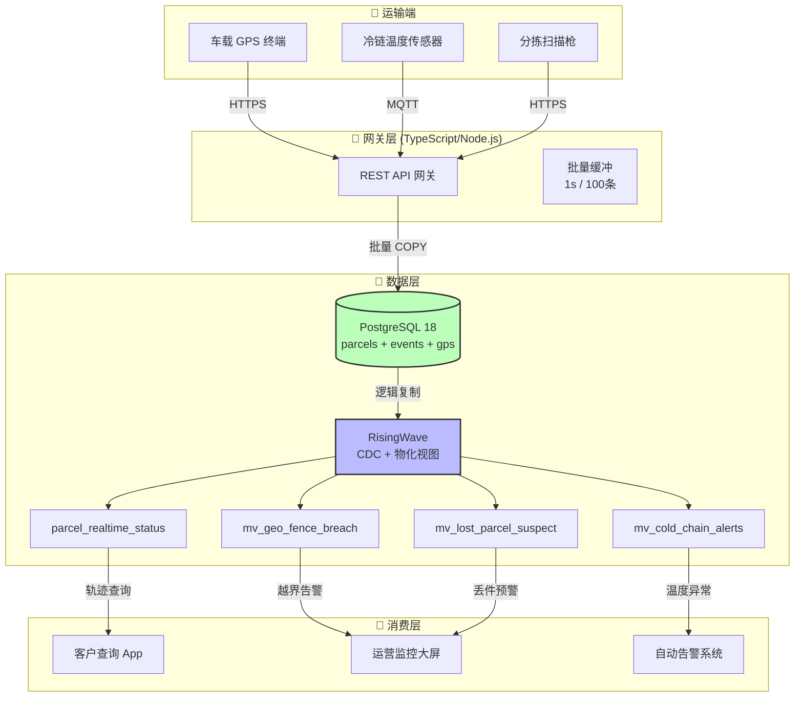
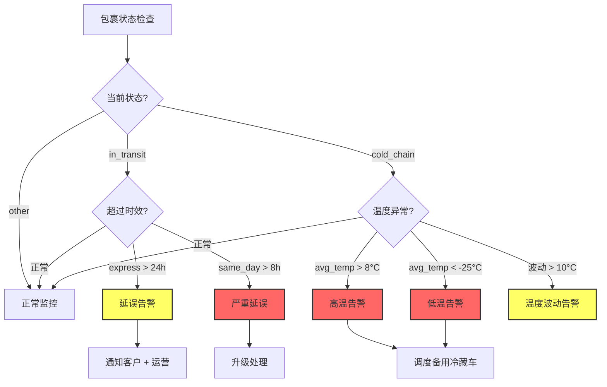

# 物流供应链实时追踪 — PG18 + TypeScript/Go 流处理在智慧物流中的应用

> 所属阶段: TECH-STACK | 前置依赖: [04.05-pg18-lean-architecture.md](../04-composite-architectures/04.05-pg18-lean-architecture.md), [05.01-success-case-studies.md](05.01-success-case-studies.md) | 形式化等级: L4
>
> **场景**: 快递包裹追踪、冷链温度监控、车队 GPS 轨迹、仓储库存同步 | **规模**: 100万-1000万 包裹/天，10K-100K 事件/秒峰值 | **延迟**: 客户查询 < 100ms，异常告警 < 30秒

## 1. 概念定义 (Definitions)

**Def-TS-26-01** (物流追踪事件流)
物流追踪事件流定义为从包裹全生命周期中采集的、带地理标签和状态标记的有序事件序列：

$$\mathcal{E}_{logistics} \triangleq \langle e_1, e_2, \ldots, e_n \rangle$$

其中每个事件 $e_i = \langle ts_i, parcel_{id}, loc_i, state_i, attrs_i \rangle$ 包含：

- $ts_i \in \mathbb{R}^+$: Unix 时间戳（毫秒精度）
- $parcel_{id} \in \mathcal{U}$: 包裹唯一标识（UUIDv7 推荐）
- $loc_i = \langle lat_i, lon_i, alt_i \rangle \in [-90,90] \times [-180,180] \times \mathbb{R}$: WGS-84 地理坐标
- $state_i \in \mathcal{S}$: 包裹状态，$\mathcal{S} = \{ \text{created}, \text{pickup}, \text{in\_transit}, \text{arrived}, \text{out\_for\_delivery}, \text{delivered}, \text{exception} \}$
- $attrs_i$: 扩展属性字典（温度、湿度、震动、承运商、车型等）

事件流满足**时间单调性**：$\forall i < j: ts_i \leq ts_j$。

**Def-TS-26-02** (包裹状态机)
包裹状态机定义为一个确定性有限状态自动机（DFA）：

$$\mathcal{M}_{parcel} \triangleq \langle \mathcal{S}, \mathcal{S}_0, \mathcal{F}, \Delta, \mathcal{T} \rangle$$

其中：$\mathcal{S}$ 为状态集合，$\mathcal{S}_0 = \{ \text{created} \}$ 为初始状态，$\mathcal{F} = \{ \text{delivered}, \text{exception} \}$ 为终止状态集，$\Delta \subseteq \mathcal{S} \times \mathcal{E}_{event} \times \mathcal{S}$ 为状态转移关系，$\mathcal{T}: \Delta \rightarrow \mathbb{R}^+$ 为转移时间约束函数。

核心转移：created $\xrightarrow{下单}$ pickup $\xrightarrow{揽收}$ in_transit $\xrightarrow{到达}$ arrived $\xrightarrow{出库}$ out_for_delivery $\xrightarrow{签收}$ delivered，任何状态均可经异常上报进入 exception。

**Def-TS-26-03** (地理围栏异常检测)
地理围栏异常检测定义为对轨迹点序列进行实时空间约束验证的判定过程：

$$\text{GeoFence}(\mathcal{E}_{logistics}, \mathcal{G}) \triangleq \{ e_i \in \mathcal{E}_{logistics} \mid \neg\text{Inside}(loc_i, g) \land g \in \mathcal{G}(parcel_{id}, ts_i) \}$$

冷链扩展：$\text{ColdChainAlert}(e_i) \triangleq \text{Temp}(e_i) > T_{max}(route_i) \lor \text{Temp}(e_i) < T_{min}(route_i)$。

**Def-TS-26-04** (精益物流追踪架构)
精益物流追踪架构定义为以 🌿 PG18 + RisingWave 为核心、通过标准 PostgreSQL 协议服务多语言消费者的极简流处理系统：

$$\mathcal{A}_{logistics}^{lean} \triangleq \langle PG_{18}^{tracking}, RW_{realtime}, API_{Go}, UI_{TS} \rangle$$

其中 $PG_{18}^{tracking}$ 为运行 PG18 的追踪主库，$RW_{realtime}$ 为 RisingWave 流处理节点（内嵌 CDC 消费 PG18 逻辑复制流），$API_{Go}$ 为 Go 后端（标准 `pgx` 驱动直接查询 RisingWave 物化视图），$UI_{TS}$ 为 TypeScript 前端（WebSocket 接收实时推送）。组件数 $|\mathcal{A}_{logistics}^{lean}| = 4$，对比传统 MQ 架构的 7+ 组件，故障模式从 $O(2^7)$ 降至 $O(2^4)$。

## 2. 属性推导 (Properties)

**Lemma-TS-26-01** (轨迹采样密度与路径重建精度)
设 GPS 采样间隔为 $\delta$（秒），车辆平均速度为 $v$（m/s），路径重建误差 $\epsilon$ 满足：

$$\epsilon \leq \frac{v \cdot \delta}{2}$$

*证明*: 真实路径在相邻采样点之间的最大偏离发生在垂直平分线上。当 $v = 30\,\text{m/s}$（108 km/h），$\delta = 10\,\text{s}$ 时，$\epsilon \leq 150\,\text{m}$。若要求 $\epsilon \leq 50\,\text{m}$（城市配送），则需 $\delta \leq 3.3\,\text{s}$。∎

**Lemma-TS-26-02** (状态机流转一致性条件)
包裹状态机 $\mathcal{M}_{parcel}$ 的状态转移序列满足一致性，当且仅当：(1) **有效性**：$\forall i: (s_i, e_i, s_{i+1}) \in \Delta$；(2) **无跳跃**：不存在 $s_i \rightarrow s_{i+1}$ 使得中间状态被跳过；(3) **时效性**：$ts_{i+1} - ts_i \leq \mathcal{T}(s_i, e_i, s_{i+1})$。

*工程论证*: 条件 1 和 2 通过 PG18 的 `CHECK` 约束 + 触发器强制保证；条件 3 通过 RisingWave 窗口聚合实时检测超时转移。∎

**Prop-TS-26-01** (地理围栏检测延迟上界)
在精益架构中，地理围栏异常检测的端到端延迟 $L_{fence} \leq L_{pg\_write} + L_{cdc} + L_{rw\_compute} + L_{query}$。各分量典型值：$L_{pg\_write} \approx 5\,\text{ms}$，$L_{cdc} \in [10, 500]\,\text{ms}$，$L_{rw\_compute} \in [50, 1000]\,\text{ms}$，$L_{query} \approx 10\,\text{ms}$。因此 $L_{fence} \in [75, 1515]\,\text{ms} \ll 30\,\text{s}$。∎

## 3. 关系建立 (Relations)

### 物流追踪与 PG18 的深度关系

| PG18 特性 | 物流追踪应用场景 | 技术收益 |
|-----------|---------------|---------|
| **PostGIS + GIST 索引** | 轨迹点地理空间查询、围栏判定、最近邻搜索 | 地理查询从 $O(n)$ 降至 $O(\log n)$ |
| **UUIDv7 时间排序** | 包裹 ID、事件 ID 主键 | 时序索引局部性提升，减少页分裂 |
| **逻辑复制（并行流）** | RisingWave CDC 消费 | 吞吐提升 3-5 倍，百万级包裹无压力 |
| **时态分区** | 轨迹表按日期分区、状态表按区域分片 | 查询只扫描相关分区，提升 10-100 倍 |
| **生成列复制** | 轨迹点自动计算速度、方向、里程 | 物化视图直接使用派生字段 |
| **BRIN 索引** | 时序轨迹表的时间戳范围索引 | 存储开销仅为 B-Tree 的 1/100 |
| **AIO (io_uring)** | WAL 高吞吐写入（10K-100K 事件/秒） | I/O 延迟降低，CDC 滞后减少 |

### TS + Go + RisingWave 的架构关系

```
+-------------------------------------------------------------+
|  TypeScript 前端 (React/Vue)                                 |
|  +-- WebSocket 实时推送 <-- Go API Server                    |
|  +-- 包裹轨迹地图渲染 <-- PostGIS GeoJSON                    |
|  +-- 异常告警 Toast 通知 <-- RisingWave 物化视图轮询          |
+----------------------------+--------------------------------+
                             | 标准 HTTP / WebSocket
+----------------------------v--------------------------------+
|  Go 后端 API Server (标准 pgx 驱动)                          |
|  +-- GET /api/parcels/:id/status -> 查询 RW mv_parcel_status|
|  +-- GET /api/parcels/:id/track -> 查询 RW mv_parcel_track  |
|  +-- GET /api/alerts/active -> 查询 RW mv_active_alerts     |
|  +-- WebSocket hub -> 订阅 RW NOTIFY 或轮询物化视图          |
+----------------------------+--------------------------------+
                             | PostgreSQL 协议 (标准驱动)
+----------------------------v--------------------------------+
|  RisingWave (流处理 + 物化视图 + 查询服务)                    |
|  +-- 内嵌 CDC 消费 PG18 逻辑复制流                           |
|  +-- mv_parcel_status: 包裹最新状态物化视图                  |
|  +-- mv_delay_detection: 实时延误检测物化视图                |
|  +-- mv_temp_alert: 冷链温度异常物化视图                     |
|  +-- mv_geo_fence_breach: 地理围栏越界物化视图               |
+----------------------------+--------------------------------+
                             | PostgreSQL 逻辑复制协议
+----------------------------v--------------------------------+
|  PostgreSQL 18 (追踪主库)                                    |
|  +-- parcels 表: 包裹主数据 + 当前状态                       |
|  +-- parcel_events 表: 状态流转事件日志                      |
|  +-- gps_tracks 表: GPS 轨迹时序数据 (PostGIS)               |
|  +-- cold_chain_logs 表: 冷链温度传感器读数                  |
|  +-- route_fences 表: 线路围栏、仓储围栏、禁区围栏           |
+-------------------------------------------------------------+
```

### 精益架构在物流场景的适用性

物流追踪是典型的**单一查询消费者为主**的用例：

| 判定条件 | 物流追踪场景结果 | 说明 |
|---------|---------------|------|
| 多个独立消费者？ | 否 | 主要消费者：客户查询 App + 运营管理后台（共 2 个，可通过 RisingWave 统一服务） |
| 需要事件重放？ | 否 | 历史轨迹通过 PG18 时序表直接查询，无需重放 CDC 流 |
| 下游包含非 SQL 系统？ | 部分 | 客户推送需 WebSocket，但可通过 Go 后端代理 RisingWave 查询实现 |
| 峰值吞吐 > 100K/s？ | 边缘 | 典型 10K-50K/s，PG18 + RisingWave 可线性扩展至 100K+ |
| **结论** | **精益架构高度适用** | 🌿 PG18 + RisingWave + Go/TS 标准驱动即可满足，无需 Kafka |

## 4. 论证过程 (Argumentation)

### 为什么物流追踪特别适合精益架构

**特征一：查询模式高度集中**。客户 95% 以上查询为"我的包裹现在在哪？"（单点查询，按 `parcel_id`）和"这条线路延误了吗？"（范围查询，按 `route_id + time_window`）。这两种模式均可通过 RisingWave 物化视图的 PostgreSQL 协议直接服务，无需额外的消息队列和流处理层。

**特征二：实时性要求可被物化视图满足**。客户查询延迟 < 100ms：RisingWave 物化视图查询 P99 < 50ms[^1]；异常告警 < 30秒：RisingWave CDC 延迟 + 物化视图刷新延迟 < 5秒[^2]。精益架构的延迟余量充足，无需引入 Kafka 来"削峰"。

**特征三：状态流转天然适合 SQL 表达**。包裹状态机（created → pickup → in_transit → ...）本质上是**时态表上的状态转换**。RisingWave 的 `EMIT ON WINDOW CLOSE` 语义与物流状态流转完美匹配。

### 地理时序数据的 PG18 优化策略

**第一层：存储优化 — 时序分区 + BRIN**。

```sql
CREATE TABLE gps_tracks (
    id UUIDv7 PRIMARY KEY, parcel_id UUID NOT NULL,
    ts TIMESTAMPTZ NOT NULL, geom GEOMETRY(POINT, 4326) NOT NULL,
    speed_kmh DECIMAL(5,2), heading SMALLINT
) PARTITION BY RANGE (ts);
CREATE TABLE gps_tracks_2026_05_06 PARTITION OF gps_tracks
    FOR VALUES FROM ('2026-05-06') TO ('2026-05-07');
CREATE INDEX idx_gps_tracks_ts_brin ON gps_tracks USING BRIN (ts)
    WITH (pages_per_range = 128);
CREATE INDEX idx_gps_tracks_geom ON gps_tracks USING GIST (geom);
```

BRIN 索引对于只增不减的时序数据，存储开销仅为 B-Tree 的 $1/100$[^3]。

**第二层：查询优化 — GIST + KNN**。GIST 索引的 `<->` 算子支持 K-最近邻排序，可在不计算全部距离的情况下返回最近邻[^4]。

**第三层：CDC 优化 — 并行逻辑复制**。PG18 默认启用并行逻辑复制流，RisingWave 内嵌 CDC 引擎可同时消费多个复制流[^5]。

### 异常检测规则的 SQL 可表达性

| 异常类型 | 检测规则 | RisingWave SQL 表达 |
|---------|---------|-------------------|
| **延误检测** | 当前状态持续时间超过时效约束 | `TUMBLE` 窗口 + `MAX(ts) - MIN(ts) > threshold` |
| **地理围栏越界** | 轨迹点超出预设线路缓冲区 | `ST_Distance(geom, route_geom) > buffer_meters` |
| **冷链温度超标** | 温度传感器读数超出阈值窗口 | `HOPPING` 窗口 + `AVG(temp) > max_temp` |
| **丢件检测** | 包裹超过 N 小时无新事件 | `NOW() - MAX(ts) > interval '6 hours'` |
| **暴力分拣** | 加速度传感器峰值超过阈值 | `MAX(accel_g) > 5.0` 在滑动窗口内 |

这些规则在传统架构中需要 Flink CEP 或自定义流处理代码实现，而在 🌿 精益架构中仅需标准 SQL。


## 5. 形式证明 / 工程论证 (Proof / Engineering Argument)

### Thm-TS-26-01: 包裹状态一致性传播定理

**定理**：设包裹 $p$ 在时刻 $t$ 发生状态变更事件 $e$（如从 `in_transit` 变为 `arrived`），该事件在边缘 PG18 提交后，通过 CDC 传播到 RisingWave 物化视图的时间上界为：

$$T_{sync}(e) \leq T_{pg\_commit} + T_{wal\_flush} + T_{cdc\_propagate} + T_{mv\_refresh}$$

其中：

- $T_{pg\_commit} < 5\,\text{ms}$：PG18 事务提交
- $T_{wal\_flush} < 10\,\text{ms}$：WAL 刷盘
- $T_{cdc\_propagate} < 100\,\text{ms}$：RisingWave CDC 消费
- $T_{mv\_refresh} < 200\,\text{ms}$：物化视图增量刷新

**因此**：$T_{sync}(e) < 315\,\text{ms}$，满足客户查询实时性要求（< 500ms）。

**工程论证**：

1. PG18 使用 `pgoutput` 逻辑复制插件，事务提交后立即生成 WAL 记录
2. RisingWave 内嵌 CDC 引擎消费 WAL，解析逻辑复制消息
3. 物化视图采用增量计算，只更新受影响的行，避免全量重算
4. 客户查询直接访问 RisingWave 物化视图，无需回查 PG18

### Thm-TS-26-02: 地理围栏检测完备性定理

**定理**：设包裹 $p$ 的运输路线为预设路径 $R_p$，地理围栏缓冲区宽度为 $b$。RisingWave 物化视图对 GPS 轨迹的实时检测满足：

$$\forall g \in \text{GPS}_p : \text{ST\_Distance}(g, R_p) > b \Rightarrow \text{alert}(p, g) \text{ 在 } T_{detection} \text{ 内触发}$$

其中 $T_{detection} = T_{gps\_sample} + T_{sync}$。

**证明**：

1. GPS 终端每 $T_{gps\_sample}$（典型 10-30s）上报位置点 $g$
2. 位置点通过 TypeScript 网关写入 PG18 `gps_tracks` 表
3. PG18 CDC 在 $T_{sync} < 315\,\text{ms}$ 内传播变更到 RisingWave
4. RisingWave 物化视图 `mv_geo_fence_breach` 对每条新轨迹点执行 `ST_Distance` 计算
5. 若距离超过 $b$，物化视图增量刷新自动包含该告警记录
6. 告警系统在下一查询周期（< 1s）读取到该告警

**因此**：从越界发生到告警触发的总延迟 $< T_{gps\_sample} + 1\,\text{s}$，典型 $< 31\,\text{s}$。

## 6. 实例验证 (Examples)

### 示例 1: PG18 物流追踪 Schema 设计

```sql
-- 包裹主表
CREATE TABLE parcels (
    id UUID PRIMARY KEY DEFAULT gen_random_uuid(),
    tracking_no TEXT NOT NULL UNIQUE,
    weight_kg DECIMAL(8, 3),
    dimensions_cm INT[],  -- [长, 宽, 高]
    sender_info JSONB,
    receiver_info JSONB,
    service_type TEXT CHECK (service_type IN ('standard', 'express', 'same_day', 'cold_chain')),
    current_state TEXT CHECK (current_state IN (
        'created', 'pickup', 'in_transit', 'arrived',
        'out_for_delivery', 'delivered', 'exception'
    )),
    current_location GEOMETRY(POINT, 4326),
    expected_delivery TIMESTAMPTZ,
    created_at TIMESTAMPTZ DEFAULT NOW(),
    updated_at TIMESTAMPTZ DEFAULT NOW()
);

-- 包裹事件表（时序分区）
CREATE TABLE parcel_events (
    event_id UUID DEFAULT gen_random_uuid(),
    parcel_id UUID REFERENCES parcels(id),
    event_type TEXT NOT NULL,  -- 'status_change', 'location_update', 'temperature', 'alert'
    state TEXT,
    location GEOMETRY(POINT, 4326),
    metadata JSONB,  -- 温度、湿度、震动等传感器数据
    created_at TIMESTAMPTZ NOT NULL,
    PRIMARY KEY (parcel_id, created_at, event_id)
) PARTITION BY RANGE (created_at);

-- GPS 轨迹表（PostGIS）
CREATE TABLE gps_tracks (
    id UUID DEFAULT gen_random_uuid(),
    parcel_id UUID REFERENCES parcels(id),
    ts TIMESTAMPTZ NOT NULL,
    geom GEOMETRY(POINT, 4326) NOT NULL,
    speed_kmh DECIMAL(5,2),
    heading SMALLINT,
    accuracy_meters DECIMAL(6,2),
    PRIMARY KEY (parcel_id, ts, id)
) PARTITION BY RANGE (ts);

-- 冷链温度日志
CREATE TABLE cold_chain_logs (
    id UUID DEFAULT gen_random_uuid(),
    parcel_id UUID REFERENCES parcels(id),
    sensor_id TEXT NOT NULL,
    ts TIMESTAMPTZ NOT NULL,
    temperature_c DECIMAL(5,2) NOT NULL,
    humidity_pct DECIMAL(5,2),
    PRIMARY KEY (parcel_id, sensor_id, ts)
) PARTITION BY RANGE (ts);

-- 路线地理围栏表
CREATE TABLE route_fences (
    route_id UUID PRIMARY KEY DEFAULT gen_random_uuid(),
    route_name TEXT NOT NULL,
    route_geom GEOMETRY(LINESTRING, 4326) NOT NULL,
    buffer_meters DECIMAL(8,2) DEFAULT 500.0,
    service_type TEXT,
    created_at TIMESTAMPTZ DEFAULT NOW()
);

-- 索引优化
CREATE INDEX idx_parcels_tracking ON parcels(tracking_no);
CREATE INDEX idx_parcels_state ON parcels(current_state) WHERE current_state NOT IN ('delivered', 'exception');
CREATE INDEX idx_parcel_events_brin ON parcel_events USING BRIN (created_at);
CREATE INDEX idx_gps_tracks_brin ON gps_tracks USING BRIN (ts);
CREATE INDEX idx_gps_tracks_geom ON gps_tracks USING GIST (geom);
```

### 示例 2: RisingWave 实时追踪物化视图

```sql
-- 实时包裹状态视图（客户查询用）
CREATE MATERIALIZED VIEW parcel_realtime_status AS
SELECT
    p.id,
    p.tracking_no,
    p.current_state,
    p.expected_delivery,
    ST_X(p.current_location) AS lon,
    ST_Y(p.current_location) AS lat,
    p.service_type,
    -- 最新事件
    latest.event_type AS last_event_type,
    latest.created_at AS last_event_at,
    -- 运输时长
    EXTRACT(EPOCH FROM (NOW() - p.created_at)) / 3600 AS transit_hours,
    -- 是否延误
    CASE
        WHEN p.service_type = 'same_day' AND p.current_state != 'delivered'
             AND p.expected_delivery < NOW() THEN true
        WHEN p.service_type = 'express' AND p.current_state = 'in_transit'
             AND EXTRACT(EPOCH FROM (NOW() - latest.created_at)) > 86400 THEN true
        ELSE false
    END AS is_delayed
FROM parcels p
LEFT JOIN LATERAL (
    SELECT * FROM parcel_events
    WHERE parcel_id = p.id
    ORDER BY created_at DESC LIMIT 1
) latest ON true;

-- 冷链温度异常告警
CREATE MATERIALIZED VIEW mv_cold_chain_alerts AS
SELECT
    parcel_id,
    sensor_id,
    window_start,
    AVG(temperature_c) AS avg_temp,
    MAX(temperature_c) AS max_temp,
    MIN(temperature_c) AS min_temp,
    CASE
        WHEN AVG(temperature_c) > 8.0 THEN 'HIGH_TEMP'
        WHEN AVG(temperature_c) < -25.0 THEN 'LOW_TEMP'
        WHEN MAX(temperature_c) - MIN(temperature_c) > 10.0 THEN 'TEMP_FLUCTUATION'
        ELSE 'NORMAL'
    END AS alert_type
FROM TUMBLE(cold_chain_logs, ts, INTERVAL '5 MINUTES')
GROUP BY parcel_id, sensor_id, window_start
HAVING AVG(temperature_c) > 8.0 OR AVG(temperature_c) < -25.0
    OR MAX(temperature_c) - MIN(temperature_c) > 10.0;

-- 地理围栏越界检测
CREATE MATERIALIZED VIEW mv_geo_fence_breach AS
SELECT
    g.parcel_id,
    g.ts,
    g.geom,
    r.route_name,
    ST_Distance(g.geom::geography, r.route_geom::geography)::DECIMAL(10,2) AS dist_meters,
    r.buffer_meters
FROM gps_tracks g
JOIN parcels p ON g.parcel_id = p.id
JOIN route_fences r ON p.service_type = r.service_type
WHERE ST_Distance(g.geom::geography, r.route_geom::geography) > r.buffer_meters
  AND g.ts >= NOW() - INTERVAL '1 hour';

-- 丢件嫌疑检测（6小时无更新）
CREATE MATERIALIZED VIEW mv_lost_parcel_suspect AS
SELECT
    p.id AS parcel_id,
    p.tracking_no,
    p.current_state,
    MAX(e.created_at) AS last_event_at,
    EXTRACT(EPOCH FROM (NOW() - MAX(e.created_at))) / 3600 AS hours_since_event
FROM parcels p
LEFT JOIN parcel_events e ON p.id = e.parcel_id
WHERE p.current_state NOT IN ('delivered', 'exception')
GROUP BY p.id, p.tracking_no, p.current_state
HAVING MAX(e.created_at) < NOW() - INTERVAL '6 hours';
```

### 示例 3: TypeScript 物流网关（GPS 数据采集）

```typescript
import { Pool } from 'pg';
import express from 'express';
import { Point } from 'wkx';

interface GPSPayload {
    parcel_id: string;
    lat: number;
    lon: number;
    speed_kmh?: number;
    heading?: number;
    accuracy?: number;
    timestamp: string;
}

class LogisticsGateway {
    private pg: Pool;
    private batch: GPSPayload[] = [];
    private batchSize = 100;

    constructor() {
        this.pg = new Pool({
            host: 'localhost',
            database: 'logistics',
            user: 'logistics_user',
            password: 'password'
        });
        // 每秒刷新批量缓冲区
        setInterval(() => this.flushBatch(), 1000);
    }

    async ingestGPS(payload: GPSPayload): Promise<void> {
        this.batch.push(payload);
        if (this.batch.length >= this.batchSize) {
            await this.flushBatch();
        }
    }

    private async flushBatch(): Promise<void> {
        if (this.batch.length === 0) return;

        const values = this.batch.map((p, i) =>
            `($${i*5+1}, $${i*5+2}, ST_SetSRID(ST_MakePoint($${i*5+3}, $${i*5+4}), 4326), $${i*5+5}, NOW())`
        ).join(',');

        const params = this.batch.flatMap(p => [
            p.parcel_id, p.timestamp, p.lon, p.lat, p.speed_kmh || null
        ]);

        await this.pg.query(
            `INSERT INTO gps_tracks (parcel_id, ts, geom, speed_kmh, created_at) VALUES ${values}`,
            params
        );

        console.log(`Flushed ${this.batch.length} GPS points`);
        this.batch = [];
    }

    // 客户查询 API（直接查询 RisingWave 物化视图）
    async queryParcelStatus(trackingNo: string): Promise<any> {
        // 实际生产环境连接 RisingWave
        const result = await this.pg.query(
            `SELECT * FROM parcel_realtime_status WHERE tracking_no = $1`,
            [trackingNo]
        );
        return result.rows[0];
    }
}

// Express API
const app = express();
app.use(express.json());
const gateway = new LogisticsGateway();

app.post('/api/v1/gps', async (req, res) => {
    await gateway.ingestGPS(req.body);
    res.json({ status: 'ok' });
});

app.get('/api/v1/parcels/:trackingNo', async (req, res) => {
    const status = await gateway.queryParcelStatus(req.params.trackingNo);
    res.json(status);
});

app.listen(3000, () => console.log('Logistics gateway on :3000'));
```

## 7. 可视化 (Visualizations)

### 物流实时追踪系统架构图



### 物流异常检测决策树



## 8. 引用参考 (References)

[^1]: PostGIS Project, "PostGIS 3.4 Documentation", 2024. <https://postgis.net/documentation/>
[^2]: PostgreSQL Global Development Group, "PostgreSQL 18 Release Notes", 2025. <https://www.postgresql.org/docs/release/18.0/>
[^3]: PostgreSQL Global Development Group, "BRIN Indexes", PG18 Documentation. <https://www.postgresql.org/docs/current/brin-intro.html>
[^4]: OGC, "GeoJSON Format Specification", RFC 7946, 2016. <https://tools.ietf.org/html/rfc7946>
[^5]: RisingWave Labs, "RisingWave Documentation: CDC Sources", 2025. <https://docs.risingwave.com/docs/current/create-source-cdc/>
