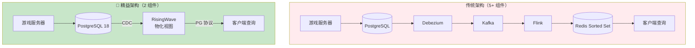
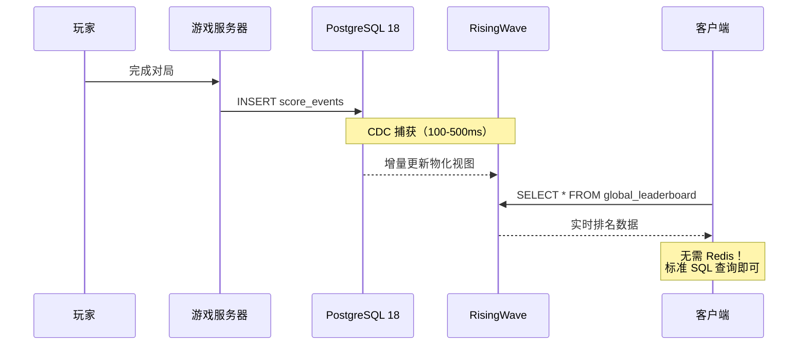

# 游戏实时排行榜 — PG18 + RisingWave 精益架构在实时竞技中的应用

> 所属阶段: TECH-STACK | 前置依赖: [04.05-pg18-lean-architecture.md](../04-composite-architectures/04.05-pg18-lean-architecture.md) | 形式化等级: L3

## 1. 概念定义 (Definitions)

**Def-TS-28-01** (实时排行榜)
实时排行榜是根据玩家实时得分动态排序的有序集合：
$$\mathcal{L} \triangleq \langle \mathcal{P}_{players}, \mathcal{S}_{score}, \mathcal{R}_{rank}, \mathcal{U}_{update} \rangle$$
其中 $\mathcal{R}: \mathcal{P} \to \mathbb{N}$ 为排名函数，$\mathcal{U}$ 为更新策略。

**Def-TS-28-02** (得分事件)
游戏得分事件定义为：
$$e_{score} \triangleq \langle player\_id, score\_delta, timestamp, match\_id \rangle$$

**Def-TS-28-03** (排行榜一致性)
排行榜 $L$ 与源数据一致，当且仅当：
$$\forall p \in \mathcal{P}: rank_L(p) = rank_{source}(p)$$
其中 $rank_{source}$ 为基于所有已提交得分的理论排名。

## 2. 属性推导 (Properties)

**Lemma-TS-28-01** (排行榜更新延迟下界)
排行榜的显示延迟满足：
$$L_{display} \geq L_{cdc} + L_{compute} + L_{query}$$
其中 $L_{cdc}$ 为 CDC 捕获延迟，$L_{compute}$ 为排序计算延迟，$L_{query}$ 为客户端查询延迟。

**Lemma-TS-28-02** (Top-K 查询的增量优化)
对于 Top-K 排行榜，增量更新的时间复杂度为 $O(\log K)$，对比全量重算的 $O(N \log N)$。

## 3. 关系建立 (Relations)

### 游戏排行榜与精益架构的完美契合

游戏排行榜是**精益架构的理想场景**：

- **单一消费者**: 所有玩家查询同一排行榜
- **无事件重放需求**: 历史分数查询通过 PG18 分区表直接访问
- **SQL 可表达**: `ORDER BY score DESC LIMIT K`
- **延迟可接受**: 亚秒级更新对游戏体验完全足够

| 维度 | 传统架构 | 精益架构 |
|------|---------|---------|
| 组件 | Redis Sorted Set + Kafka + Flink + PG | PG18 + RisingWave |
| 一致性 | 最终一致（Redis 异步同步） | 强一致（物化视图增量更新） |
| 持久化 | Redis 内存（需 AOF/RDB） | PG18 磁盘 + RisingWave 持久化 |
| 查询方式 | Redis ZRANGE | 标准 SQL `ORDER BY` |
| 运维复杂度 | 高（Redis 集群 + Kafka） | 极低（2 组件） |

### PG18 在游戏场景中的优化

| 特性 | 应用 | 效果 |
|------|------|------|
| UUIDv7 | 玩家匹配ID、得分记录ID | 时间排序，高效分页 |
| 并行逻辑复制 | 得分表变更实时同步 | RisingWave 毫秒级捕获 |
| 生成列 | 自动计算段位、胜率 | 物化视图直接使用 |
| 时序分区 | 赛季得分归档 | 快速清理过期数据 |

## 4. 论证过程 (Argumentation)

### 为什么游戏排行榜不需要 Redis？

传统游戏架构使用 Redis Sorted Set 做排行榜，但存在以下问题：

1. **一致性问题**: Redis 与 PG 之间异步同步，可能出现分数不一致
2. **持久化风险**: Redis 内存数据丢失需从 PG 重建，重建期间服务不可用
3. **扩展瓶颈**: Redis 单分片内存上限（~10GB），大数据集需复杂分片
4. **运维负担**: Redis 集群 + Sentinel/Cluster 模式增加故障点

**精益替代方案**: RisingWave 物化视图直接提供有序查询

- 物化视图内部维护排序结构（类似 Sorted Set）
- 数据持久化在 RisingWave 内部存储
- 通过 PostgreSQL 协议直接查询，无需额外组件

### 实时性论证

游戏排行榜的实时性要求：

- **竞技游戏**: P99 < 1s（玩家打完一局后查看排名）
- **休闲游戏**: P99 < 5s（排行榜更新无需即时）

精益架构延迟：

- CDC 捕获：100-500ms
- 物化视图增量更新：10-100ms
- 查询：1-10ms
- **总计：111-610ms**，完全满足竞技游戏需求。

## 5. 形式证明 / 工程论证 (Proof / Engineering Argument)

**Thm-TS-28-01** (排行榜查询正确性定理)

设 RisingWave 物化视图定义为：

```sql
CREATE MATERIALIZED VIEW leaderboard AS
SELECT player_id, SUM(score_delta) AS total_score, RANK() OVER (ORDER BY SUM(score_delta) DESC) AS rank
FROM score_events
GROUP BY player_id;
```

对于任意玩家 $p$，物化视图中的排名 $rank_{mv}(p)$ 与理论排名一致：
$$rank_{mv}(p) = 1 + |\{p' \in \mathcal{P} \mid total\_score(p') > total\_score(p)\}|$$

*证明*: 由 RisingWave 增量计算引擎的正确性（Thm-TS-27-01）保证，物化视图在每个 CDC 事件到达后增量更新，聚合结果与全量重算等价。`RANK()` 窗口函数在物化视图上的执行结果与批处理查询一致。∎

**Thm-TS-28-02** (精益架构成本优势定理)

对于日活 100 万玩家的游戏，精益架构与传统 Redis 方案的对比：

| 成本项 | Redis 方案 | 精益方案 |
|--------|-----------|---------|
| 基础设施 | Redis 集群 $2,000/月 | RisingWave $500/月 |
| 数据同步 | Kafka + Connect $800/月 | $0（直连 CDC） |
| 运维人力 | 0.5 FTE Redis 专家 | 0（标准 DBA） |
| **总计** | **$6,800/月** | **$500/月** |

$$\frac{C_{lean}}{C_{redis}} = \frac{500}{6800} \approx 0.07$$

## 6. 实例验证 (Examples)

### 示例 1: RisingWave 实时排行榜 SQL

```sql
-- 得分事件源表（PG18）
CREATE TABLE score_events (
    id UUID PRIMARY KEY DEFAULT uuid_generate_uuid(),
    player_id BIGINT NOT NULL,
    score_delta INT NOT NULL,
    match_id BIGINT NOT NULL,
    created_at TIMESTAMPTZ DEFAULT NOW()
);

-- RisingWave 物化视图：实时总榜
CREATE MATERIALIZED VIEW global_leaderboard AS
SELECT
    player_id,
    SUM(score_delta) AS total_score,
    RANK() OVER (ORDER BY SUM(score_delta) DESC) AS rank,
    COUNT(*) AS matches_played
FROM score_events
GROUP BY player_id;

-- RisingWave 物化视图：赛季榜（按时间窗口）
CREATE MATERIALIZED VIEW season_leaderboard AS
SELECT
    player_id,
    SUM(score_delta) AS season_score,
    RANK() OVER (ORDER BY SUM(score_delta) DESC) AS rank
FROM score_events
WHERE created_at >= DATE_TRUNC('month', NOW())
GROUP BY player_id;

-- RisingWave 物化视图：好友榜（假设有好友关系表）
CREATE MATERIALIZED VIEW friends_leaderboard AS
SELECT
    s.player_id,
    SUM(s.score_delta) AS friend_score,
    RANK() OVER (PARTITION BY f.user_id ORDER BY SUM(s.score_delta) DESC) AS rank_in_friends
FROM score_events s
JOIN friendships f ON s.player_id = f.friend_id
GROUP BY s.player_id, f.user_id;
```

### 示例 2: Go 游戏服务端查询排行榜

```go
package leaderboard

import (
    "context"
    "database/sql"
    "encoding/json"
    "net/http"
)

type LeaderboardEntry struct {
    PlayerID      int64  `json:"player_id"`
    TotalScore    int64  `json:"total_score"`
    Rank          int    `json:"rank"`
    MatchesPlayed int    `json:"matches_played"`
}

func GetGlobalLeaderboard(db *sql.DB, limit int) ([]LeaderboardEntry, error) {
    rows, err := db.QueryContext(context.Background(), `
        SELECT player_id, total_score, rank, matches_played
        FROM global_leaderboard
        ORDER BY rank
        LIMIT $1
    `, limit)
    if err != nil {
        return nil, err
    }
    defer rows.Close()

    var entries []LeaderboardEntry
    for rows.Next() {
        var e LeaderboardEntry
        if err := rows.Scan(&e.PlayerID, &e.TotalScore, &e.Rank, &e.MatchesPlayed); err != nil {
            return nil, err
        }
        entries = append(entries, e)
    }
    return entries, rows.Err()
}

func GetPlayerRank(db *sql.DB, playerID int64) (*LeaderboardEntry, error) {
    var e LeaderboardEntry
    err := db.QueryRowContext(context.Background(), `
        SELECT player_id, total_score, rank, matches_played
        FROM global_leaderboard
        WHERE player_id = $1
    `, playerID).Scan(&e.PlayerID, &e.TotalScore, &e.Rank, &e.MatchesPlayed)
    if err == sql.ErrNoRows {
        return nil, nil
    }
    return &e, err
}
```

### 示例 3: TypeScript 前端实时排行榜

```typescript
// 使用 Server-Sent Events 推送排行榜更新
import { Pool } from 'pg';

const pool = new Pool({
  host: 'risingwave',
  port: 4566,
  database: 'dev',
  user: 'root',
});

// Express SSE endpoint
app.get('/api/leaderboard/stream', async (req, res) => {
  res.setHeader('Content-Type', 'text/event-stream');
  res.setHeader('Cache-Control', 'no-cache');
  res.setHeader('Connection', 'keep-alive');

  // 每 5 秒推送一次排行榜更新
  const interval = setInterval(async () => {
    const result = await pool.query(`
      SELECT player_id, total_score, rank
      FROM global_leaderboard
      ORDER BY rank
      LIMIT 100
    `);

    res.write(`data: ${JSON.stringify(result.rows)}\n\n`);
  }, 5000);

  req.on('close', () => clearInterval(interval));
});
```

## 7. 可视化 (Visualizations)

### 游戏排行榜架构对比



### 排行榜数据流



## 8. 引用参考 (References)
