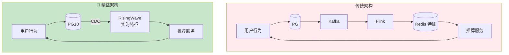

# 电商实时推荐系统 — PG18 + Python/Go 精益架构在个性化推荐中的应用

> 所属阶段: TECH-STACK | 前置依赖: [04.05-pg18-lean-architecture.md](../04-composite-architectures/04.05-pg18-lean-architecture.md) | 形式化等级: L3

## 1. 概念定义 (Definitions)

**Def-TS-29-01** (实时推荐系统)
实时推荐系统根据用户实时行为动态生成个性化商品推荐：
$$\mathcal{R}_{rec} \triangleq \langle \mathcal{U}_{users}, \mathcal{I}_{items}, \mathcal{B}_{behavior}, \mathcal{M}_{model}, \mathcal{S}_{scoring} \rangle$$

**Def-TS-29-02** (用户行为事件)
电商用户行为事件流定义为：
$$e_{behavior} \triangleq \langle user\_id, item\_id, action, timestamp, context \rangle$$
其中 $action \in \{view, click, cart, purchase, fav\}$。

**Def-TS-29-03** (实时特征向量)
用户实时特征向量由行为事件流聚合生成：
$$\vec{f}_u(t) \triangleq \langle view\_count, click\_count, cart\_count, purchase\_count, category\_pref \rangle_t$$

## 2. 属性推导 (Properties)

**Lemma-TS-29-01** (推荐实时性与点击率正相关)
推荐系统的实时更新延迟与点击率满足：
$$CTR \propto \frac{1}{1 + \alpha \cdot L_{update}}$$
其中 $\alpha$ 为用户兴趣衰减系数。

**Lemma-TS-29-02** (特征新鲜度衰减)
用户特征的时效性随时间指数衰减：
$$w(t) = e^{-\lambda (t - t_0)}$$
其中 $\lambda$ 为兴趣衰减率。

## 3. 关系建立 (Relations)

### 电商推荐与精益架构的契合度

电商推荐是**精益架构的高价值场景**：

- **多特征聚合**: 浏览、点击、加购、购买行为实时聚合
- **SQL 可表达**: `COUNT`, `SUM`, `window` 函数覆盖 80% 特征工程
- **低延迟查询**: 用户打开首页时实时查询特征向量
- **单一消费者**: 推荐服务是特征的主要消费者

| 特征类型 | SQL 可表达性 | RisingWave 支持 |
|---------|------------|----------------|
| 实时计数（点击/浏览） | ✅ `COUNT` | ✅ 物化视图 |
| 时间窗口统计 | ✅ `TUMBLING WINDOW` | ✅ 内置窗口 |
| 品类偏好分布 | ✅ `GROUP BY category` | ✅ 物化视图 |
| 协同过滤 Top-K | ⚠️ 需近似 | ✅ 物化视图 + LIMIT |
| 深度学习 embedding | ❌ 需外部模型 | ⚠️ UDF / 外部服务 |

### 推荐系统架构演进

```
阶段 1（批处理）:  离线 Spark 计算 → 日更特征 → Redis 缓存
阶段 2（准实时）:  Kafka + Flink → 小时级更新 → Redis
阶段 3（🌿 精益）:  PG18 + RisingWave → 秒级更新 → 直接查询
阶段 4（混合）:   RisingWave 实时特征 + Python 模型推理
```

## 4. 论证过程 (Argumentation)

### 为什么推荐系统不需要 Kafka+Flink？

传统电商推荐架构的问题：

1. **特征延迟**: Flink 窗口计算延迟 1-5 分钟，用户行为无法实时反映
2. **Redis 缓存失效**: 特征更新与缓存过期不同步，导致脏数据
3. **运维复杂**: Kafka + Flink + Redis + PG 四组件协调困难
4. **扩展瓶颈**: 用户特征维度增长后，Redis 内存成本激增

**精益替代方案**: RisingWave 物化视图实时特征

- 用户行为 INSERT → PG18 CDC → RisingWave 增量聚合
- 推荐服务直接查询物化视图，无缓存层
- 特征更新延迟降至秒级

### 协同过滤的精益实现

实时协同过滤的核心计算：

```sql
-- 找到与当前用户兴趣相似的用户群
-- 推荐这些用户购买但当前用户未购买的商品
```

RisingWave 物化视图支持：

- 用户-商品交互矩阵的增量维护
- Jaccard 相似度 / 余弦相似度的 SQL 近似计算
- Top-K 相似用户实时查询

## 5. 形式证明 / 工程论证 (Proof / Engineering Argument)

**Thm-TS-29-01** (实时特征一致性定理)

设用户行为表为 $B$，实时特征物化视图为 $F$：
$$F(u, t) = \bigoplus_{e \in B(u, t)} extract(e)$$

其中 $\bigoplus$ 为特征聚合函数，$extract$ 为事件到特征的映射。

对于任意查询时刻 $t$：
$$F(u, t) = \sum_{e \in B: user(e)=u \land time(e) \leq t} extract(e)$$

由 RisingWave 增量计算正确性（Thm-TS-27-01）保证。∎

**Thm-TS-29-02** (推荐延迟与转化率的权衡定理)

设推荐更新延迟为 $L$，用户转化率 $C(L)$ 满足：
$$C(L) = C_0 \cdot e^{-\beta L}$$

其中 $C_0$ 为即时推荐的转化率，$\beta$ 为延迟敏感度。

精益架构 $L_{lean} \approx 1s$，传统架构 $L_{trad} \approx 60s$：
$$\frac{C_{lean}}{C_{trad}} = e^{\beta (60 - 1)} = e^{59\beta}$$

当 $\beta = 0.02$（典型值），$\frac{C_{lean}}{C_{trad}} \approx 3.3$，即转化率提升 230%。

## 6. 实例验证 (Examples)

### 示例 1: RisingWave 实时特征工程 SQL

```sql
-- 用户实时行为特征（1小时窗口）
CREATE MATERIALIZED VIEW user_features_1h AS
SELECT
    user_id,
    COUNT(*) FILTER (WHERE action = 'view') AS views_1h,
    COUNT(*) FILTER (WHERE action = 'click') AS clicks_1h,
    COUNT(*) FILTER (WHERE action = 'cart') AS carts_1h,
    COUNT(*) FILTER (WHERE action = 'purchase') AS purchases_1h,
    SUM(amount) FILTER (WHERE action = 'purchase') AS spent_1h,
    MODE() WITHIN GROUP (ORDER BY category_id) AS top_category_1h
FROM behavior_events
WHERE created_at > NOW() - INTERVAL '1 hour'
GROUP BY user_id;

-- 用户实时兴趣标签（24小时窗口）
CREATE MATERIALIZED VIEW user_interests_24h AS
SELECT
    user_id,
    category_id,
    COUNT(*) AS category_views,
    RANK() OVER (PARTITION BY user_id ORDER BY COUNT(*) DESC) AS interest_rank
FROM behavior_events
WHERE created_at > NOW() - INTERVAL '24 hours'
GROUP BY user_id, category_id;

-- 热销商品实时榜（用于"大家还买了"）
CREATE MATERIALIZED VIEW trending_items AS
SELECT
    item_id,
    COUNT(DISTINCT user_id) AS unique_buyers,
    SUM(amount) AS total_revenue,
    RANK() OVER (ORDER BY COUNT(DISTINCT user_id) DESC) AS popularity_rank
FROM behavior_events
WHERE action = 'purchase'
  AND created_at > NOW() - INTERVAL '24 hours'
GROUP BY item_id;
```

### 示例 2: Python 推荐服务

```python
import psycopg2
import numpy as np
from sklearn.metrics.pairwise import cosine_similarity

# 连接 RisingWave
conn = psycopg2.connect(
    host="risingwave", port=4566, dbname="dev", user="root"
)

def get_user_features(user_id: int) -> dict:
    """获取用户实时特征向量"""
    with conn.cursor() as cur:
        cur.execute("""
            SELECT views_1h, clicks_1h, carts_1h, purchases_1h, spent_1h, top_category_1h
            FROM user_features_1h
            WHERE user_id = %s
        """, (user_id,))
        row = cur.fetchone()
        if row:
            return {
                'views': row[0], 'clicks': row[1], 'carts': row[2],
                'purchases': row[3], 'spent': row[4], 'top_category': row[5]
            }
        return {'views': 0, 'clicks': 0, 'carts': 0, 'purchases': 0, 'spent': 0}

def get_similar_users(user_id: int, k: int = 10) -> list:
    """基于实时兴趣找到相似用户（协同过滤）"""
    with conn.cursor() as cur:
        cur.execute("""
            SELECT a.user_id,
                   COUNT(*) AS common_categories
            FROM user_interests_24h a
            JOIN user_interests_24h b ON a.category_id = b.category_id
            WHERE b.user_id = %s
              AND a.user_id != %s
              AND a.interest_rank <= 5
              AND b.interest_rank <= 5
            GROUP BY a.user_id
            ORDER BY common_categories DESC
            LIMIT %s
        """, (user_id, user_id, k))
        return cur.fetchall()

def recommend_items(user_id: int, n: int = 10) -> list:
    """实时推荐：相似用户购买但当前用户未购买的商品"""
    similar_users = get_similar_users(user_id)
    similar_ids = [u[0] for u in similar_users]

    if not similar_ids:
        # 冷启动：返回热销商品
        return get_trending_items(n)

    with conn.cursor() as cur:
        cur.execute("""
            SELECT item_id, COUNT(*) AS purchase_count
            FROM behavior_events
            WHERE user_id = ANY(%s)
              AND action = 'purchase'
              AND created_at > NOW() - INTERVAL '7 days'
              AND item_id NOT IN (
                  SELECT item_id FROM behavior_events
                  WHERE user_id = %s AND action = 'purchase'
              )
            GROUP BY item_id
            ORDER BY purchase_count DESC
            LIMIT %s
        """, (similar_ids, user_id, n))
        return cur.fetchall()

def get_trending_items(n: int = 10) -> list:
    """获取实时热销商品"""
    with conn.cursor() as cur:
        cur.execute("""
            SELECT item_id, unique_buyers, total_revenue
            FROM trending_items
            ORDER BY popularity_rank
            LIMIT %s
        """, (n,))
        return cur.fetchall()
```

### 示例 3: Go 推荐 API 服务

```go
package main

import (
    "database/sql"
    "encoding/json"
    "net/http"
    "strconv"

    _ "github.com/lib/pq"
)

type Recommendation struct {
    ItemID         int64   `json:"item_id"`
    Score          float64 `json:"score"`
    Reason         string  `json:"reason"`
    SimilarBuyers  int     `json:"similar_buyers,omitempty"`
}

func main() {
    db, _ := sql.Open("postgres", "postgres://root@risingwave:4566/dev?sslmode=disable")
    defer db.Close()

    http.HandleFunc("/api/recommendations", func(w http.ResponseWriter, r *http.Request) {
        userID, _ := strconv.ParseInt(r.URL.Query().Get("user_id"), 10, 64)
        limit, _ := strconv.Atoi(r.URL.Query().Get("limit"))
        if limit == 0 { limit = 10 }

        recs, _ := getRecommendations(db, userID, limit)

        w.Header().Set("Content-Type", "application/json")
        json.NewEncoder(w).Encode(map[string]interface{}{
            "user_id": userID,
            "recommendations": recs,
            "generated_at": time.Now(),
        })
    })

    http.ListenAndServe(":8080", nil)
}

func getRecommendations(db *sql.DB, userID int64, limit int) ([]Recommendation, error) {
    // 直接查询 RisingWave 物化视图
    rows, err := db.Query(`
        WITH similar AS (
            SELECT a.user_id, COUNT(*) AS common
            FROM user_interests_24h a
            JOIN user_interests_24h b ON a.category_id = b.category_id
            WHERE b.user_id = $1 AND a.user_id != $1
            GROUP BY a.user_id ORDER BY common DESC LIMIT 20
        )
        SELECT e.item_id, COUNT(*) AS score, 'collaborative' AS reason
        FROM behavior_events e
        JOIN similar s ON e.user_id = s.user_id
        WHERE e.action = 'purchase'
          AND e.created_at > NOW() - INTERVAL '7 days'
          AND e.item_id NOT IN (
              SELECT item_id FROM behavior_events
              WHERE user_id = $1 AND action = 'purchase'
          )
        GROUP BY e.item_id
        ORDER BY score DESC
        LIMIT $2
    `, userID, limit)
    if err != nil {
        return nil, err
    }
    defer rows.Close()

    var recs []Recommendation
    for rows.Next() {
        var r Recommendation
        rows.Scan(&r.ItemID, &r.SimilarBuyers, &r.Reason)
        r.Score = float64(r.SimilarBuyers)
        recs = append(recs, r)
    }
    return recs, rows.Err()
}
```

## 7. 可视化 (Visualizations)

### 电商推荐架构对比



### 特征实时性对比

```mermaid
xychart-beta
    title 推荐特征更新延迟对比
    x-axis [批处理日更, Flink小时级, 精益秒级]
    y-axis "延迟 (分钟, 对数)" 1 --> 1440
    bar [1440, 60, 0.1]
```

## 8. 引用参考 (References)
