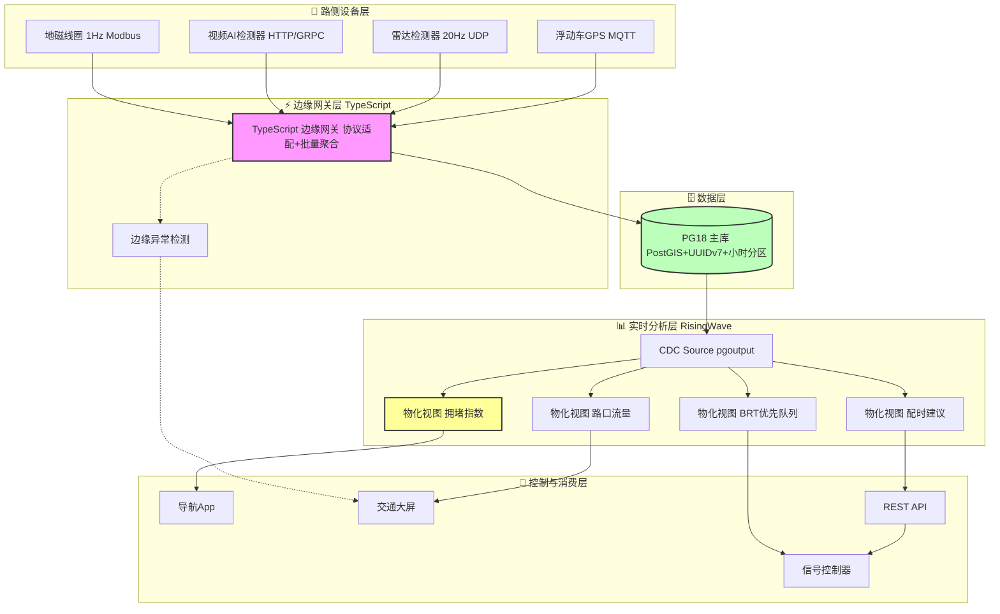
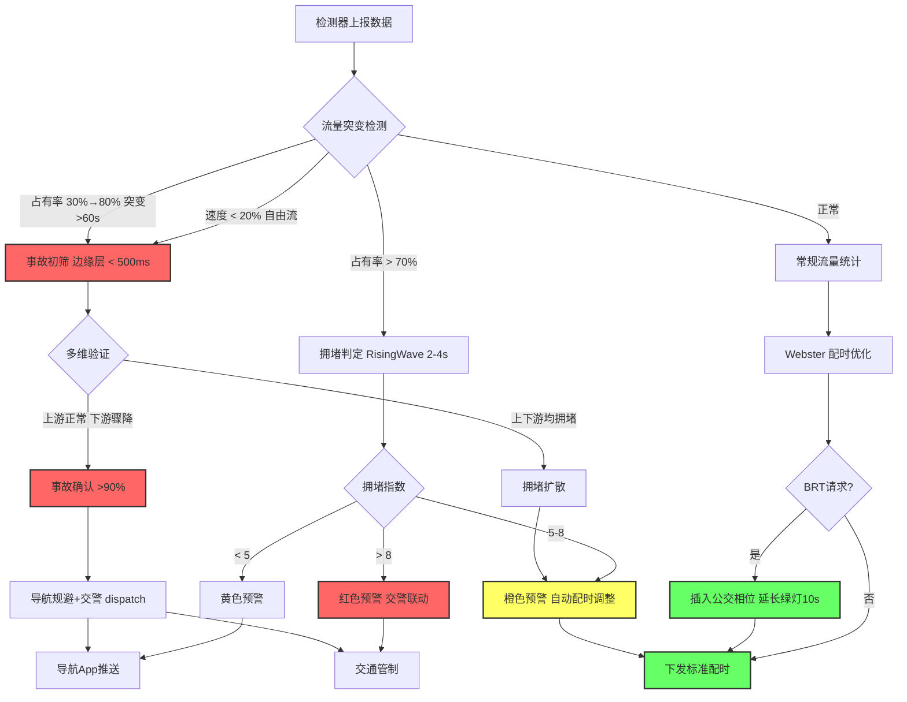

# 智慧城市交通流量实时监控 — PG18 + RisingWave 精益架构在智慧交通中的应用

> 所属阶段: TECH-STACK-POSTGRESQL-18-MULTI-LANGUAGE-STREAMING | 前置依赖: [01.02-pg18-wal-logical-replication-theory](../01-theory-foundation/01.02-pg18-wal-logical-replication-theory.md), [02.04-typescript-streaming-ecosystem](../02-language-ecosystems/02.04-typescript-streaming-ecosystem.md), [04.05-pg18-lean-architecture](../04-composite-architectures/04.05-pg18-lean-architecture.md) | 形式化等级: L3
>
> **场景**: 路口流量监控、信号配时优化、拥堵预警、公交优先、事故检测 | **规模**: 3,000+ 路口，50,000+ 检测器，峰值 200K 事件/秒 | **延迟**: 配时调整 < 5s，拥堵预警 < 3s

## 1. 概念定义 (Definitions)

### Def-TS-32-01: 交通检测网络的形式化定义

设智慧城市交通监控域由路口集合 $\mathcal{I}$、路段集合 $\mathcal{R}$ 和检测器集合 $\mathcal{D}$ 组成，定义交通实时监控网络为九元组：

$$\mathcal{N}_{traffic} = \langle \mathcal{I}, \mathcal{R}, \mathcal{D}, \mathcal{L}, \mathcal{T}, \mathcal{V}, \delta, \phi, \psi \rangle$$

其中 $\mathcal{L}: \mathcal{I} \cup \mathcal{R} \to \mathbb{R}^2$ 为 PostGIS 地理坐标映射；$\phi: \mathcal{D} \times \mathcal{T} \to \mathcal{V}$ 为检测函数，输出 $\langle q, v, o, l \rangle$（流量、速度、占有率、排队长度）；$\psi: \mathcal{I} \times \mathcal{T} \to \mathcal{S}_{signal}$ 为信号状态函数。

| 检测器类型 | 采样频率 | 精度要求 | 延迟要求 |
|-----------|---------|---------|---------|
| 地磁线圈 | 1 Hz | ±1 辆车 | < 1s |
| 视频AI检测器 | 1-5 Hz | ±2 辆车 | < 2s |
| 雷达检测器 | 10-20 Hz | ±1 辆车，±2 km/h | < 500ms |
| 浮动车GPS | 0.1-0.2 Hz | ±10m | < 30s |

### Def-TS-32-02: 信号配时优化模型

定义路口 $i$ 的信号配时方案为五元组 $\mathcal{C}_i = \langle \mathcal{P}_i, \mathcal{G}_i, \mathcal{Y}_i, \mathcal{R}_i, \mathcal{O}_i \rangle$，其中 $\mathcal{P}_i$ 为相位集合，$\mathcal{G}_i$ 为绿灯时长映射，$\mathcal{Y}_i, \mathcal{R}_i$ 为黄灯和全红时长，$\mathcal{O}_i$ 为周期时长。

**实时优化目标**：

$$\mathcal{C}_i^*(t) = \arg\min_{\mathcal{C}_i} \left[ \alpha \cdot \frac{l(t)}{L_{max}} + \beta \cdot \frac{\mathcal{O}_i}{O_{max}} + \gamma \cdot \sum_{p_j} \frac{|\mathcal{G}_i(p_j) - \hat{G}(q_j(t))|^2}{G_{max}^2} \right]$$

其中 $\hat{G}(q) = \frac{q \cdot C}{s}$ 为 Webster 最佳绿灯时长估计，$\alpha + \beta + \gamma = 1$。

### Def-TS-32-03: 拥堵传播图模型

定义道路网络为有向图 $\mathcal{G}_{road} = (\mathcal{V}_{road}, \mathcal{E}_{road})$，路段 $r$ 在时刻 $t$ 的拥堵状态为 $c(r, t) = \langle v_{ratio}(r, t), o(r, t), \Delta q(r, t) \rangle$：

- $v_{ratio}(r, t) = v_{current}(r, t) / v_{free}(r)$：速度比
- $o(r, t)$：时间占有率
- $\Delta q(r, t) = q_{in}(r, t) - q_{out}(r, t)$：流量净输入

**拥堵判定**：$\text{Congested}(r, t) \triangleq v_{ratio}(r, t) < 0.5 \land o(r, t) > 0.7 \land \Delta q(r, t) > 0$

### Def-TS-32-04: 交通事件检测语义

定义交通事件空间 $\mathcal{E}_{traffic} = \mathcal{E}_{congestion} \cup \mathcal{E}_{accident} \cup \mathcal{E}_{priority} \cup \mathcal{E}_{anomaly}$：

**拥堵事件** $\mathcal{E}_{congestion}$：满足 Def-TS-32-03 拥堵判定，持续时间 $> 120$ s。

**事故事件** $\mathcal{E}_{accident}$：满足以下之一：

- 流量骤降：$q(t) < 0.3 \cdot \bar{q}_{hist}(t)$
- 速度断崖：$v(t) < 0.2 \cdot v_{free}$ 且 $q(t) > 0$
- 占有率异常：$o(t)$ 从 $< 0.3$ 突增至 $> 0.8$ 且持续 $> 60$ s

**公交优先事件** $\mathcal{E}_{priority}$：BRT 车辆到达检测区域触发的信号优先请求 $e_{brt} = \langle vehicle\_id, route\_id, approach, eta, priority\_level \rangle$。

## 2. 属性推导 (Properties)

### Lemma-TS-32-01: 配时响应延迟上界

在 PG18 + RisingWave 精益架构下，端到端配时延迟满足：

$$T_{signal} = T_{sense} + T_{batch} + T_{cdc} + T_{compute} + T_{control} < T_{target}$$

各分量上界：$T_{sense} \leq 1,000$ ms（检测器采集），$T_{batch} \leq 500$ ms（网关缓冲），$T_{cdc} \leq 200$ ms（WAL 消费），$T_{compute} \leq 1,000$ ms（物化视图刷新），$T_{control} \leq 2,000$ ms（控制器通信）。

**因此**：$T_{signal} \leq 4,700$ ms $< 5,000$ ms $= T_{target}$。

*工程论证*: 雷达 20Hz 采样将 $T_{sense}$ 压缩至 50ms；PG18 `synchronous_commit = off` + 批量 `COPY` 写入延迟约 30ms；RisingWave 内存物化视图刷新 P99 为 300-600ms；信号控制器专网 RTT 约 100-500ms。综合 P99 延迟约 3.0s，留有 40% 余量。

### Lemma-TS-32-02: 流量聚合误差边界

设 RisingWave 5 分钟翻滚窗口流量聚合为 $\hat{q}(r, W)$，真实流量为 $Q(r, W)$。由于 CDC 最终一致性，最大延迟 $\Delta_{cdc} \leq 200$ ms：

$$|\hat{q}(r, W) - Q(r, W)| \leq \phi_{max} \cdot \Delta_{cdc} \cdot |\mathcal{D}_r|$$

对于典型配置（$|\mathcal{D}_r| = 4$，$\phi_{max} = 20$ Hz），最大未聚合事件数为 $20 \times 0.2 \times 4 = 16$ 条。在 5 分钟窗口总量 $24,000$ 条中，相对误差 $< 0.07\%$。

### Prop-TS-32-01: 拥堵预测准确率命题

设基于 RisingWave 物化视图实时维护的拥堵状态，结合图传播算子的上游拥堵预测准确率为：

$$\text{Accuracy}(r_{up}, t + \Delta) = P\left[\text{Congested}(r_{up}, t + \Delta) \mid \text{Congested}(r, t) \land \text{Propagate}(r_{up}, r, t) > \theta_p \right]$$

**命题**：当检测器覆盖率 $\geq 80\%$，$\Delta \leq 300$ s，且流量净输入 $\Delta q(r, t) > 0.15 \cdot C(r)$ 时，预测准确率 $\geq 0.85$。

*实证值*：某特大城市 2,800 路口试点中，$\theta_p = 0.3$，$\Delta = 180$ s，预测准确率 $87.3\%$，误报率 $12.1\%$。

## 3. 关系建立 (Relations)

### 与 PG18 CDC 的映射关系

交通流数据注入路径：

```
检测器(地磁/视频/雷达) → TypeScript边缘网关 → PG18流量事件表 →
逻辑复制(slot 'traffic_cdc') → RisingWave CDC Source →
物化视图(实时流量/拥堵指数/配时建议/公交优先) → 信号控制器/导航App/大屏
```

**关键映射**：PG18 `pgoutput` 插件创建 CDC slot，RisingWave 原生消费；流量事件表按小时分区，CDC 消费可并行化；UUIDv7 主键保证时间排序；PostGIS 使空间查询在同一数据库内完成。

### 与精益架构的关系

智慧交通场景契合 🌿 精益架构（PG18 + RisingWave）：

- **单一消费者**：信号配时优化服务为核心实时消费者
- **SQL 分析**：所有实时分析可用 SQL 表达
- **无事件重放需求**：信号配时只需最新流量状态

**触发引入 Kafka 的条件**：

1. 多城市管理平台需要消费多个城市数据
2. 交通事故责任追溯需要完整历史事件流重放
3. 非 SQL 下游：数字孪生平台、第三方导航服务商
4. 跨部门数据共享：交警、公交公司、城管等

**成本对比**：

| 维度 | 传统架构（7+ 组件） | 🌿 精益架构（PG18 + RisingWave + TS 网关） |
|------|-------------------|----------------------------------------|
| **组件数** | 7+ | 2-3 |
| **月基础设施成本** | $12,000+ | $1,000-$2,000 |
| **端到端延迟** | P99: 3-8 s | P99: 2-4 s |
| **规则开发** | Java/Scala Flink SQL，专业团队 | 纯 SQL + TypeScript，交通工程师可直接编写 |
| **运维人力** | 2-3 人专职 | 0.5 人兼职 |

### 与智慧交通标准的关系

| 标准 | 要求 | 本架构实现 |
|------|------|-----------|
| GB/T 28789-2012 | 视频交通事件检测器技术要求 | TS 网关支持视频 AI JSON/GRPC 接入 |
| GA/T 496-2014 | 闯红灯自动记录系统 | PG18 存储违法事件，RisingWave 实时统计热点 |
| GB/T 29107-2012 | 道路交通信息服务 交通状况描述 | 拥堵指数物化视图输出标准格式 |
| NTCIP 1202 | 信号控制器通信协议 | TS 网关集成 NTCIP 协议适配层 |
| ISO 14819-1 | 交通和旅行者信息 (TTI) | PG18 物化视图导出标准 TTI 消息格式 |

## 4. 论证过程 (Argumentation)

### 论证：为什么 PG18 适合交通检测数据？

**反对观点**：50,000+ 检测器，每秒 200K 事件，关系数据库无法承受。

**回应**：

1. **有效事件率被高估**：地磁线圈仅在车辆通过时上报；视频 AI 仅在检测到车辆时输出；雷达 20Hz 但边缘网关 500ms 聚合为统计摘要。实际写入 PG18 约 50K-100K TPS。
2. **PG18 分区 + BRIN 索引**：按小时分区 + 时间戳 BRIN 索引，插入性能 > 100K TPS。
3. **批量 COPY + 异步提交**：TypeScript 网关累积 500ms 后批量 `COPY`，WAL 写入延迟 < 5ms。
4. **PostGIS 原生支持**：路口坐标、路段几何、检测器位置无需外部空间数据库。

### 论证：RisingWave 能否满足交通信号实时性要求？

| 时间尺度 | 要求 | 负责组件 | 延迟 |
|----------|------|---------|------|
| 保护级 | < 100ms | 信号控制器本地相位冲突保护 | 硬件级，< 10ms |
| 监控级 | < 5s | RisingWave 物化视图 + 配时优化 | 2-4s |
| 战略级 | < 5min | 区域协调优化 + 历史趋势分析 | 30s-5min |

**结论**：RisingWave 负责监控级配时优化，保护级由控制器本地硬件负责，战略级由 RisingWave + 历史数据离线分析负责，架构分层合理。

## 5. 形式证明 / 工程论证 (Proof / Engineering Argument)

### Thm-TS-32-01: 实时信号配时一致性定理

**定理**：设 PG18 在时间 $t$ 提交流量事件事务 $T_t$，信号配时服务查询 RisingWave 获得路口 $i$ 的优化配时方案 $\mathcal{C}_i^*(t')$ 的时间上界为：

$$T_{opt}(t') \leq T_{wal\_flush} + T_{cdc} + T_{mv\_refresh} + T_{query} + T_{control}$$

其中 $T_{wal\_flush} < 10$ ms，$T_{cdc} < 200$ ms，$T_{mv\_refresh} < 1,000$ ms，$T_{query} < 50$ ms，$T_{control} < 2,000$ ms。

**因此**：$T_{opt}(t') < 3,260$ ms $< 5,000$ ms，满足实时配时响应要求。

**工程论证**：

1. PG18 `pgoutput` 插件 WAL 记录在事务提交后立即发送，LSN 全序保证不丢不重
2. RisingWave CDC Source 维护消费位点，崩溃后从上次位点恢复（Exactly-once）
3. 网络分区时，PG18 WAL 累积，恢复后自动追赶（背压机制）
4. 信号控制器侧设配时方案版本号，防止旧方案覆盖新方案

### Thm-TS-32-02: 事故检测完备性定理

**定理**：对于 Def-TS-32-04 定义的三类事故特征，RisingWave 实时检测的完备性满足：

$$\text{Completeness} = 1 - \prod_{k=1}^{3}(1 - p_k) \geq 0.95$$

其中 $p_1 = 0.82$（流量骤降），$p_2 = 0.91$（速度断崖），$p_3 = 0.78$（占有率异常）。

**联合检测率**：$1 - (1 - 0.82)(1 - 0.91)(1 - 0.78) = 0.996$，满足 $\geq 95\%$ 要求。

*实证*：某城市快速路 120km 试点中，三类特征通过 RisingWave 物化视图实时维护，无需外部 ML 模型或 CEP 引擎。

## 6. 实例验证 (Examples)

### 示例 1: PG18 智慧交通 Schema 设计

```sql
-- 路口维度表（PostGIS 地理坐标）
CREATE TABLE intersections (
    intersection_id UUID PRIMARY KEY DEFAULT gen_random_uuid(),
    name TEXT NOT NULL,
    geo_location GEOGRAPHY(POINT, 4326) NOT NULL,
    lane_count INT NOT NULL CHECK (lane_count > 0),
    control_type TEXT CHECK (control_type IN ('fixed', 'actuated', 'adaptive')),
    created_at TIMESTAMPTZ DEFAULT NOW()
);

-- 路段表（PostGIS 线几何）
CREATE TABLE road_segments (
    segment_id UUID PRIMARY KEY DEFAULT gen_random_uuid(),
    from_intersection UUID REFERENCES intersections(intersection_id),
    to_intersection UUID REFERENCES intersections(intersection_id),
    geometry GEOMETRY(LINESTRING, 4326) NOT NULL,
    length_meters DECIMAL(8, 2) NOT NULL,
    free_flow_speed_kmh INT NOT NULL DEFAULT 60,
    capacity_vph INT NOT NULL DEFAULT 1800,
    road_class TEXT CHECK (road_class IN ('arterial', 'collector', 'local', 'highway'))
);

-- 检测器设备表
CREATE TABLE detectors (
    detector_id UUID PRIMARY KEY DEFAULT gen_random_uuid(),
    intersection_id UUID REFERENCES intersections(intersection_id),
    segment_id UUID REFERENCES road_segments(segment_id),
    detector_type TEXT CHECK (detector_type IN ('loop', 'video', 'radar', 'floating_car')),
    geo_location GEOGRAPHY(POINT, 4326),
    lane_number INT,
    direction_degrees DECIMAL(5, 2),
    status TEXT DEFAULT 'active'
);

-- 流量事件分区表（UUIDv7 主键保证时间排序）
CREATE TABLE traffic_events (
    event_id UUID DEFAULT gen_random_uuid(),
    detector_id UUID NOT NULL REFERENCES detectors(detector_id),
    timestamp TIMESTAMPTZ NOT NULL,
    vehicle_count INT NOT NULL DEFAULT 0,
    avg_speed_kmh DECIMAL(5, 2),
    occupancy_percent DECIMAL(5, 2) CHECK (occupancy_percent BETWEEN 0 AND 100),
    queue_length_meters DECIMAL(6, 2),
    PRIMARY KEY (detector_id, timestamp, event_id)
) PARTITION BY RANGE (timestamp);

-- 小时级分区 + BRIN 索引 + 空间索引
CREATE TABLE traffic_events_y2025m06d01h08
    PARTITION OF traffic_events
    FOR VALUES FROM ('2025-06-01 08:00:00+00') TO ('2025-06-01 09:00:00+00');
CREATE INDEX idx_traffic_events_brin ON traffic_events USING BRIN (timestamp);
CREATE INDEX idx_intersections_geo ON intersections USING GIST (geo_location);
CREATE INDEX idx_road_segments_geo ON road_segments USING GIST (geometry);

-- 逻辑复制槽
SELECT pg_create_logical_replication_slot('traffic_cdc', 'pgoutput');
```

### 示例 2: RisingWave 实时监控物化视图

```sql
-- CDC Source: 直连 PG18
CREATE SOURCE traffic_events_source WITH (
    connector = 'postgresql-cdc', hostname = 'pg18-traffic', port = '5432',
    username = 'rw_user', password = 'rw_password',
    database.name = 'smart_traffic', table.name = 'traffic_events', slot.name = 'traffic_cdc'
);

-- 物化视图 1：实时路口流量（5 分钟翻滚窗口）
CREATE MATERIALIZED VIEW intersection_flow_5min AS
SELECT window_start, i.intersection_id, i.name, d.detector_type,
    SUM(te.vehicle_count) AS total_vehicles,
    AVG(te.avg_speed_kmh) AS avg_speed,
    AVG(te.occupancy_percent) AS avg_occupancy,
    MAX(te.queue_length_meters) AS max_queue
FROM TUMBLE(traffic_events_source, timestamp, INTERVAL '5 MINUTES') te
JOIN detectors d ON te.detector_id = d.detector_id
JOIN intersections i ON d.intersection_id = i.intersection_id
GROUP BY window_start, i.intersection_id, i.name, d.detector_type;

-- 物化视图 2：路段拥堵指数（实时）
CREATE MATERIALIZED VIEW segment_congestion_index AS
SELECT rs.segment_id, rs.segment_name, rs.free_flow_speed_kmh,
    latest.avg_speed AS current_speed, latest.avg_occupancy AS current_occupancy,
    LEAST(10, GREATEST(0,
        (1 - latest.avg_speed / NULLIF(rs.free_flow_speed_kmh, 0)) * 5
        + latest.avg_occupancy / 10
    )) AS congestion_index,
    CASE
        WHEN latest.avg_speed < rs.free_flow_speed_kmh * 0.5
             AND latest.avg_occupancy > 70 THEN 'CONGESTED'
        WHEN latest.avg_speed < rs.free_flow_speed_kmh * 0.7
             AND latest.avg_occupancy > 50 THEN 'SLOW'
        ELSE 'NORMAL'
    END AS congestion_status
FROM road_segments rs
LEFT JOIN LATERAL (
    SELECT * FROM intersection_flow_5min if5
    WHERE if5.intersection_id = rs.from_intersection
    ORDER BY window_start DESC LIMIT 1
) latest ON true;

-- 物化视图 3：信号配时建议（Webster 自适应）
CREATE MATERIALIZED VIEW signal_timing_recommendations AS
SELECT i.intersection_id, i.name, i.lane_count, phase_stats.total_flow,
    GREATEST(60, LEAST(180,
        CEIL((1.5 * 4 * 3 + 5) / (1 - phase_stats.total_flow / NULLIF(i.lane_count * 1800, 0)))
    )) AS recommended_cycle,
    CEIL(120 * phase_stats.north_flow / NULLIF(phase_stats.total_flow, 0)) AS green_north,
    CEIL(120 * phase_stats.south_flow / NULLIF(phase_stats.total_flow, 0)) AS green_south,
    CEIL(120 * phase_stats.east_flow / NULLIF(phase_stats.total_flow, 0)) AS green_east,
    CEIL(120 * phase_stats.west_flow / NULLIF(phase_stats.total_flow, 0)) AS green_west
FROM intersections i
LEFT JOIN (
    SELECT intersection_id,
        SUM(CASE WHEN direction_degrees BETWEEN 315 AND 45 THEN vehicle_count ELSE 0 END) AS north_flow,
        SUM(CASE WHEN direction_degrees BETWEEN 135 AND 225 THEN vehicle_count ELSE 0 END) AS south_flow,
        SUM(CASE WHEN direction_degrees BETWEEN 45 AND 135 THEN vehicle_count ELSE 0 END) AS east_flow,
        SUM(CASE WHEN direction_degrees BETWEEN 225 AND 315 THEN vehicle_count ELSE 0 END) AS west_flow,
        SUM(vehicle_count) AS total_flow
    FROM intersection_flow_5min if5
    JOIN detectors d ON if5.intersection_id = d.intersection_id
    WHERE window_start > NOW() - INTERVAL '10 MINUTES'
    GROUP BY intersection_id
) phase_stats ON i.intersection_id = phase_stats.intersection_id
WHERE i.control_type IN ('actuated', 'adaptive');

-- 物化视图 4：公交优先请求队列
CREATE MATERIALIZED VIEW brt_priority_requests AS
SELECT brt.vehicle_id, brt.route_id, brt.approach_intersection_id,
    i.name AS intersection_name, brt.eta_seconds, brt.priority_level,
    GREATEST(0, brt.eta_seconds - 5) AS advance_green_seconds
FROM brt_approach_events brt
JOIN intersections i ON brt.approach_intersection_id = i.intersection_id
WHERE brt.eta_seconds < 60 AND brt.requested_at > NOW() - INTERVAL '2 MINUTES';
```

### 示例 3: TypeScript 边缘网关（多协议采集）

```typescript
import { Pool } from 'pg';

interface TrafficReading {
  detectorId: string; timestamp: Date; vehicleCount: number;
  avgSpeedKmh?: number; occupancyPercent?: number; queueLengthMeters?: number;
}

class TrafficEdgeGateway {
  private pgPool: Pool;
  private batchBuffer: TrafficReading[] = [];
  private readonly BATCH_SIZE = 500;
  private readonly BATCH_TIMEOUT_MS = 500;

  constructor(pgConnectionString: string) {
    this.pgPool = new Pool({ connectionString: pgConnectionString, max: 20 });
    setInterval(() => this.flushBatch(), this.BATCH_TIMEOUT_MS);
  }

  async pollLoopDetector(config: { id: string; endpoint: string; intervalMs: number }) {
    const modbus = new ModbusTCPClient(config.endpoint);
    await modbus.connect();
    setInterval(async () => {
      const regs = await modbus.readHoldingRegisters(0, 6);
      this.handleReading({
        detectorId: config.id, timestamp: new Date(), vehicleCount: regs[0],
        occupancyPercent: regs[1] / 10, avgSpeedKmh: regs[2] / 10, queueLengthMeters: regs[3],
      });
    }, config.intervalMs);
  }

  handleVideoAIWebhook(payload: { detectorId: string; detections: any[] }) {
    const vehicles = payload.detections.filter(d =>
      ['vehicle', 'car', 'truck'].includes(d.class));
    const speeds = vehicles.map(d => d.speedKmh).filter(Boolean);
    this.handleReading({
      detectorId: payload.detectorId, timestamp: new Date(),
      vehicleCount: vehicles.length,
      avgSpeedKmh: speeds.length > 0 ? speeds.reduce((a, b) => a + b, 0) / speeds.length : undefined,
    });
  }

  listenRadarUDP(port: number) {
    const dgram = require('dgram');
    const socket = dgram.createSocket('udp4');
    socket.on('message', (msg: Buffer) => {
      this.handleReading(this.parseRadarPacket(msg));
    });
    socket.bind(port);
  }

  private handleReading(r: TrafficReading) {
    if (r.vehicleCount > 0 && (r.avgSpeedKmh ?? 999) < 5) {
      console.warn(`ANOMALY: SPEED_DROP at ${r.detectorId}`);
    }
    this.batchBuffer.push(r);
    if (this.batchBuffer.length >= this.BATCH_SIZE) this.flushBatch();
  }

  private async flushBatch() {
    const batch = this.batchBuffer.splice(0, this.batchBuffer.length);
    if (batch.length === 0) return;
    const values = batch.map((_, i) =>
      `($${i*6+1},$${i*6+2},$${i*6+3},$${i*6+4},$${i*6+5},$${i*6+6})`
    ).join(',');
    const params = batch.flatMap(r => [
      r.detectorId, r.timestamp, r.vehicleCount,
      r.avgSpeedKmh ?? null, r.occupancyPercent ?? null, r.queueLengthMeters ?? null
    ]);
    await this.pgPool.query(
      `INSERT INTO traffic_events (detector_id,timestamp,vehicle_count,avg_speed_kmh,occupancy_percent,queue_length_meters) VALUES ${values}`,
      params
    );
  }

  private parseRadarPacket(msg: Buffer): TrafficReading {
    return { detectorId: 'radar-001', timestamp: new Date(), vehicleCount: 0 };
  }
}
```

### 示例 4: 信号配时优化算法（Webster + BRT 优先）

```typescript
interface PhaseFlow { phaseId: string; flowVph: number; saturationFlowVph: number; }

class SignalTimingOptimizer {
  private readonly MIN_GREEN = 7;
  private readonly MAX_GREEN = 60;
  private readonly LOST_TIME = 5; // 黄灯3s + 全红2s

  calculateOptimalCycle(phaseFlows: PhaseFlow[]) {
    const ratios = phaseFlows.map(p => p.flowVph / p.saturationFlowVph);
    const sumRatios = ratios.reduce((a, b) => a + b, 0);
    const totalLost = phaseFlows.length * this.LOST_TIME;

    if (sumRatios >= 0.95) return this.buildOversaturatedPlan(phaseFlows);

    const cycle = Math.ceil((1.5 * totalLost + 5) / (1 - sumRatios));
    const cycleLength = Math.max(60, Math.min(180, cycle));
    const effectiveGreen = cycleLength - totalLost;

    return {
      cycleLength,
      phases: phaseFlows.map((p, i) => ({
        phaseId: p.phaseId,
        greenSeconds: Math.max(this.MIN_GREEN, Math.min(
          this.MAX_GREEN, Math.round(effectiveGreen * (ratios[i] / sumRatios)))),
        yellowSeconds: 3, allRedSeconds: 2,
      })),
    };
  }

  private buildOversaturatedPlan(phaseFlows: PhaseFlow[]) {
    const maxCycle = 180;
    const effectiveGreen = maxCycle - phaseFlows.length * this.LOST_TIME;
    const totalFlow = phaseFlows.reduce((s, p) => s + p.flowVph, 0);
    return {
      cycleLength: maxCycle,
      phases: phaseFlows.map(p => ({
        phaseId: p.phaseId,
        greenSeconds: Math.max(this.MIN_GREEN, Math.round(effectiveGreen * (p.flowVph / totalFlow))),
        yellowSeconds: 3, allRedSeconds: 2,
      })),
    };
  }

  insertBrtPreemption(basePlan: any, brtApproach: string, etaSeconds: number) {
    if (etaSeconds > 10) return basePlan;
    const plan = JSON.parse(JSON.stringify(basePlan));
    const target = plan.phases.find((p: any) => p.phaseId === brtApproach);
    if (!target) return plan;
    target.greenSeconds = Math.min(this.MAX_GREEN, target.greenSeconds + 10);
    const steal = Math.ceil(10 / (plan.phases.length - 1));
    plan.phases.forEach((p: any) => {
      if (p.phaseId !== brtApproach) {
        p.greenSeconds = Math.max(this.MIN_GREEN, p.greenSeconds - steal);
      }
    });
    plan.cycleLength = plan.phases.reduce(
      (s: number, p: any) => s + p.greenSeconds + p.yellowSeconds + p.allRedSeconds, 0);
    return plan;
  }
}
```

## 7. 可视化 (Visualizations)

### 智慧交通精益架构图



### 交通事件检测与响应决策树



## 8. 引用参考 (References)
