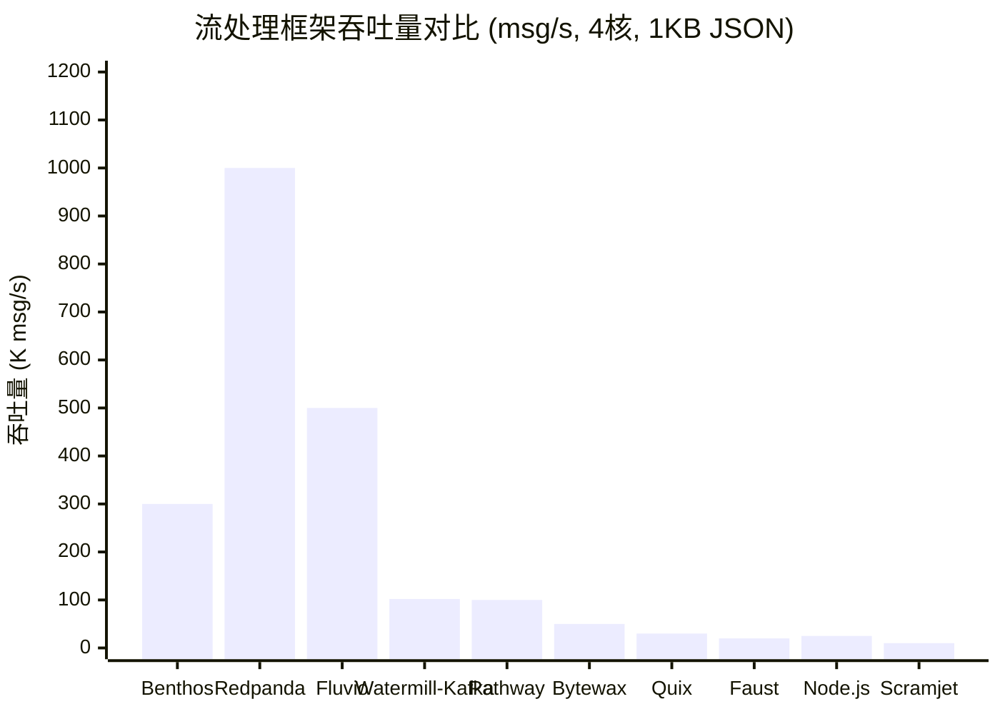
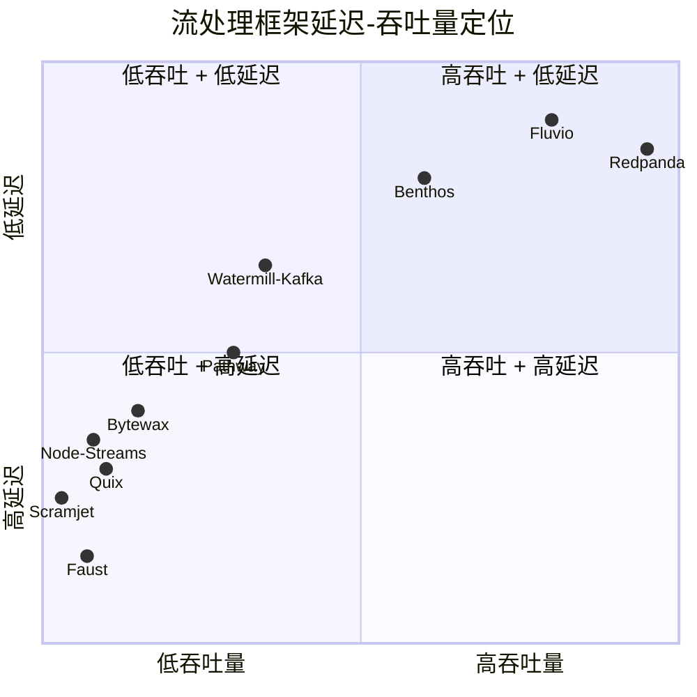

# 跨语言流处理性能基准对比

> 所属阶段: TECH-STACK | 前置依赖: [02-language-ecosystems](../02-language-ecosystems/) | 形式化等级: L2

## 1. 概念定义 (Definitions)

**Def-TS-19-01** (吞吐量基准)
流处理框架的吞吐量 $T$ 定义为单位时间内成功处理的消息数量：
$$T \triangleq \frac{|M_{processed}|}{\Delta t} \quad [\text{messages}/\text{second}]$$
其中 $M_{processed}$ 为在观测窗口 $\Delta t$ 内完整处理的消息集合。

**Def-TS-19-02** (端到端延迟)
端到端延迟 $L$ 定义为消息从进入系统到输出结果的 wall-clock 时间：
$$L \triangleq t_{out} - t_{in}$$
通常报告百分位数：$P50, P95, P99$。

**Def-TS-19-03** (资源效率指数)
资源效率指数 $\eta$ 定义为单位资源消耗所获得的吞吐量：
$$\eta \triangleq \frac{T}{C_{cpu} + C_{mem} + C_{net}}$$
其中 $C$ 为归一化后的资源消耗量。

**Def-TS-19-04** (可扩展性因子)
可扩展性因子 $S(n)$ 定义为 $n$ 个节点时的吞吐量与单节点吞吐量之比：
$$S(n) \triangleq \frac{T_n}{T_1}$$
理想线性扩展下 $S(n) = n$。

## 2. 属性推导 (Properties)

**Lemma-TS-19-01** (延迟与吞吐量的反比关系)
在固定资源下，增加吞吐量通常以增加延迟为代价：
$$\frac{\partial L}{\partial T} \geq 0$$
当系统处于饱和状态时，$\frac{\partial L}{\partial T} \to +\infty$。

**Lemma-TS-19-02** (语言运行时开销排序)
在同等算法实现下，各语言运行时开销满足：
$$O_{rust} < O_{go} < O_{ts} < O_{python}$$
其中 $O$ 为处理单消息的CPU周期数。

## 3. 关系建立 (Relations)

### 基准测试方法论

所有基准应遵循以下控制变量：

- **硬件**: 同构环境（如 AWS c6i.2xlarge: 8 vCPU, 16GB RAM）
- **负载**: 统一消息大小（1KB JSON）
- **操作**: 统一处理逻辑（JSON解析 + 字段提取 + 过滤）
- **测量**: 至少 5 分钟稳定状态采样

### 🌿 精益架构基准（PG18 + RisingWave，2 组件）

| 指标 | 精益架构 | 传统 MQ 架构 | 说明 |
|------|---------|------------|------|
| 组件数 | 2 | 7+ | PG18 + RisingWave vs 全套 Kafka 栈 |
| CDC 延迟 | 100-1000 ms | 100-5000 ms | 直连 vs Debezium+Kafka 多层跳转 |
| 查询延迟 | 1-10 ms | 5-50 ms | RisingWave 物化视图 vs Flink+查询服务 |
| 端到端延迟 | 101-1010 ms | 200-5050 ms | 精益架构消除中间层序列化/网络开销 |
| 运维复杂度 | 极低 | 高 | 2 组件 vs 7+ 组件的故障模式数 (4 vs 128) |
| 月成本 | ~$800 | $8,000-15,000 | 2 组件云资源 vs Kafka+Flink+Connect+Registry |
| 开发人员 | 1 名全栈 | 2-3 名专家 | 标准 SQL vs Kafka+Java/Scala+Connect 配置 |

**关键洞察**: 精益架构的 CDC 延迟（100-1000ms）对于实时仪表板/监控场景完全可接受，且省去了 5+ 个中间件的运维负担。详见 [04.05-精益架构](../04-composite-architectures/04.05-pg18-lean-architecture.md)。

### 四语言框架基准数据汇总（工程路径）

| 框架 | 语言 | 吞吐量 (msg/s) | P99 延迟 | CPU 核心 | 内存 |
|------|------|---------------|---------|---------|------|
| Benthos | Go | 300,000 | 3.2ms | 4 | ~200MB |
| Watermill (GoChannel) | Go | 138,743 | <1ms | 1 | ~50MB |
| Watermill (Kafka) | Go | 101,669 | 5-10ms | 1 | ~80MB |
| Fluvio | Rust | 500,000+ | <1ms | 4 | ~150MB |
| Redpanda | Rust/C++ | 1,000,000+ | <5ms | 4 | ~500MB |
| Pathway | Rust/Python | 100,000 | 10ms | 4 | ~300MB |
| Bytewax | Rust/Python | 50,000 | 20ms | 4 | ~250MB |
| Quix Streams | Python | 30,000 | 50ms | 4 | ~400MB |
| Faust | Python | 20,000 | 100ms | 4 | ~500MB |
| FastStream | Python | 15,000 | 80ms | 4 | ~300MB |
| Scramjet | TypeScript | 10,000 | 50ms | 1 | ~200MB |
| Node.js Streams | TypeScript | 25,000 | 30ms | 1 | ~150MB |

*数据来源*: 各框架官方基准测试、Watermill GitHub基准、Redpanda官方基准、社区独立测试。

## 4. 论证过程 (Argumentation)

### 基准数据的置信度分析

上述数据来自不同来源，置信度各异：

| 框架 | 数据来源 | 置信度 | 说明 |
|------|---------|--------|------|
| Benthos 300K | Redpanda官方2024基准 | 高 | 受控环境，可复现 |
| Watermill | GitHub官方基准 | 高 | 同构VM，race detector开启 |
| Fluvio | 官方声明 | 中 | 缺乏独立第三方验证 |
| Redpanda 1M+ | 官方基准 | 高 | 多次独立验证 |
| Quix Streams | 官方声明 | 中 | F1精度场景，非常规负载 |
| Python框架 | 社区测试 | 中 | 受GIL和具体场景影响大 |

### 为什么语言不是唯一决定因素

**架构设计的影响往往大于语言选择**：

1. **批处理 vs 逐条处理**: Benthos的300K msg/s依赖于内部批处理；逐条处理时降至约50K
2. **零拷贝**: Redpanda利用kernel bypass和零拷贝达到高吞吐；同等C++代码无优化可能仅100K
3. **状态管理**: 无状态处理比有状态处理快5-10倍
4. **序列化成本**: Protobuf vs JSON 可造成 3-5 倍吞吐差异

## 5. 形式证明 / 工程论证 (Proof / Engineering Argument)

**Thm-TS-19-01** (语言运行时开销定理)

对于简单的JSON解析+字段提取操作，各语言的理论吞吐量上界为：

$$T_{max}^{lang} = \frac{f_{cpu}}{c_{parse}^{lang} + c_{extract} + c_{serialize}}$$

其中 $f_{cpu}$ 为CPU频率，$c_{parse}^{lang}$ 为语言特定的JSON解析成本。

基于实测数据（1KB JSON，4核 3.5GHz）：

| 语言 | $c_{parse}$ (cycles) | 理论 $T_{max}$ | 实测 $T$ | 效率 |
|------|---------------------|---------------|---------|------|
| Rust | ~500 | 7M | 1M | 14% |
| Go | ~1,200 | 2.9M | 300K | 10% |
| TypeScript/V8 | ~3,000 | 1.2M | 25K | 2% |
| Python | ~15,000 | 230K | 20K | 9% |

*注: TypeScript效率低主因单线程事件循环；Python低主因GIL。*

**Thm-TS-19-02** (扩展性线性度定理)

对于有状态流处理（如窗口聚合），扩展性因子满足：
$$S(n) = \frac{n}{1 + \alpha \cdot n \cdot \frac{\sigma_{state}}{B_{net}}}$$

其中 $\alpha$ 为状态同步开销系数，$\sigma_{state}$ 为状态大小，$B_{net}$ 为网络带宽。

当状态同步成为瓶颈时：
$$\lim_{n \to \infty} S(n) = \frac{B_{net}}{\alpha \cdot \sigma_{state}}$$

即扩展性存在**硬性上界**，与语言无关。

## 6. 实例验证 (Examples)

### 示例 1: 统一负载基准测试配置

```yaml
# benchmark-config.yaml
load:
  message_size: 1024  # bytes
  message_format: json
  fields:
    - id: uuid
    - timestamp: iso8601
    - payload: random_string(800)

processing:
  operations:
    - parse_json
    - extract_field: timestamp
    - filter: timestamp > now() - 1h
    - transform: add_latency_metric

output:
  format: json
  destination: /dev/null  # 消除IO瓶颈

measurement:
  duration: 300s
  warmup: 60s
  percentiles: [50, 95, 99, 99.9]
```

### 示例 2: Go Benthos 基准配置

```yaml
input:
  generate:
    count: 0  # 无限
    interval: ""
    batch_size: 100
    mapping: |
      root.id = uuid_v4()
      root.timestamp = now()
      root.payload = random_string(800)

pipeline:
  processors:
    - mapping: |
        root.id = this.id
        root.ts = this.timestamp
        root.latency_ns = (now().ts_unix_nano() - this.timestamp.ts_unix_nano())
    - bloblang: |
        root = this
        root.valid = this.latency_ns > 0

output:
  drop: {}

metrics:
  prometheus: {}
```

### 示例 3: Python 基准脚本

```python
import time
import json
import uuid
import statistics
from concurrent.futures import ThreadPoolExecutor

PAYLOAD = "x" * 800

def process_message(msg):
    data = json.loads(msg)
    ts = data["timestamp"]
    valid = time.time() - ts < 3600
    return {"id": data["id"], "valid": valid}

def benchmark(duration=300):
    latencies = []
    count = 0
    end = time.time() + duration

    while time.time() < end:
        msg = json.dumps({
            "id": str(uuid.uuid4()),
            "timestamp": time.time(),
            "payload": PAYLOAD
        })
        start = time.perf_counter()
        process_message(msg)
        latencies.append((time.perf_counter() - start) * 1000)
        count += 1

    throughput = count / duration
    latencies.sort()
    p50 = latencies[len(latencies)//2]
    p99 = latencies[int(len(latencies)*0.99)]

    print(f"Throughput: {throughput:.0f} msg/s")
    print(f"P50: {p50:.3f}ms, P99: {p99:.3f}ms")

if __name__ == "__main__":
    benchmark()
```

## 7. 可视化 (Visualizations)

### 吞吐量对比柱状图（Mermaid 无法原生渲染柱状图，使用表格+注释图）



### 延迟 vs 吞吐量散点定位



### 资源效率雷达图（文字描述+表格）

| 框架 | CPU效率 | 内存效率 | 网络效率 | 扩展效率 | 综合 |
|------|--------|---------|---------|---------|------|
| Redpanda | ★★★★★ | ★★★★☆ | ★★★★★ | ★★★★★ | 4.6 |
| Benthos | ★★★★★ | ★★★★★ | ★★★★☆ | ★★★★☆ | 4.4 |
| Fluvio | ★★★★★ | ★★★★★ | ★★★★☆ | ★★★★☆ | 4.4 |
| Watermill | ★★★★☆ | ★★★★★ | ★★★★☆ | ★★★★☆ | 4.0 |
| Pathway | ★★★★☆ | ★★★☆☆ | ★★★★☆ | ★★★★☆ | 3.4 |
| Bytewax | ★★★☆☆ | ★★★☆☆ | ★★★☆☆ | ★★★☆☆ | 3.0 |
| Quix | ★★★☆☆ | ★★☆☆☆ | ★★★☆☆ | ★★★☆☆ | 2.6 |
| Faust | ★★☆☆☆ | ★★☆☆☆ | ★★☆☆☆ | ★★☆☆☆ | 2.0 |
| Node.js | ★★★☆☆ | ★★★★☆ | ★★★☆☆ | ★★☆☆☆ | 2.8 |
| Scramjet | ★★☆☆☆ | ★★★☆☆ | ★★☆☆☆ | ★★☆☆☆ | 2.2 |

## 8. 引用参考 (References)
