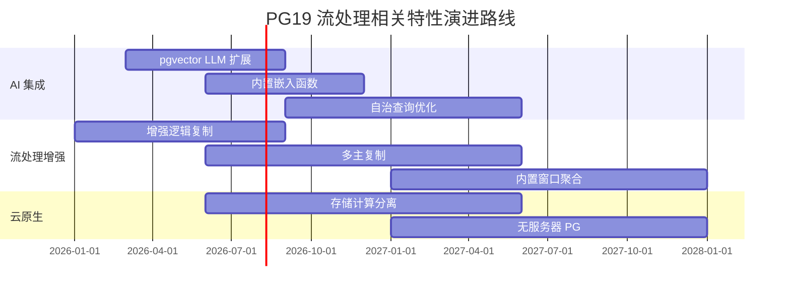
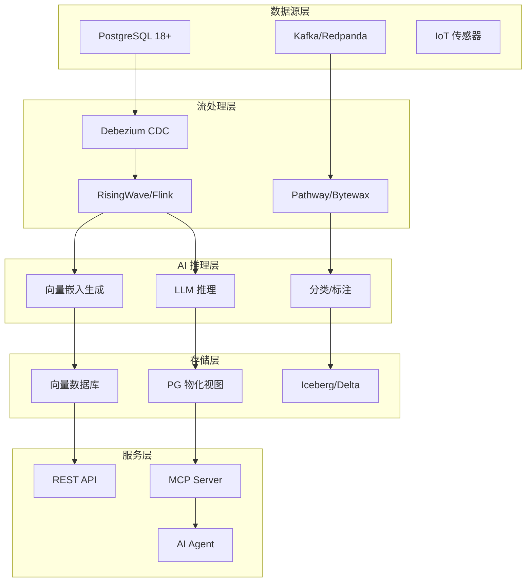
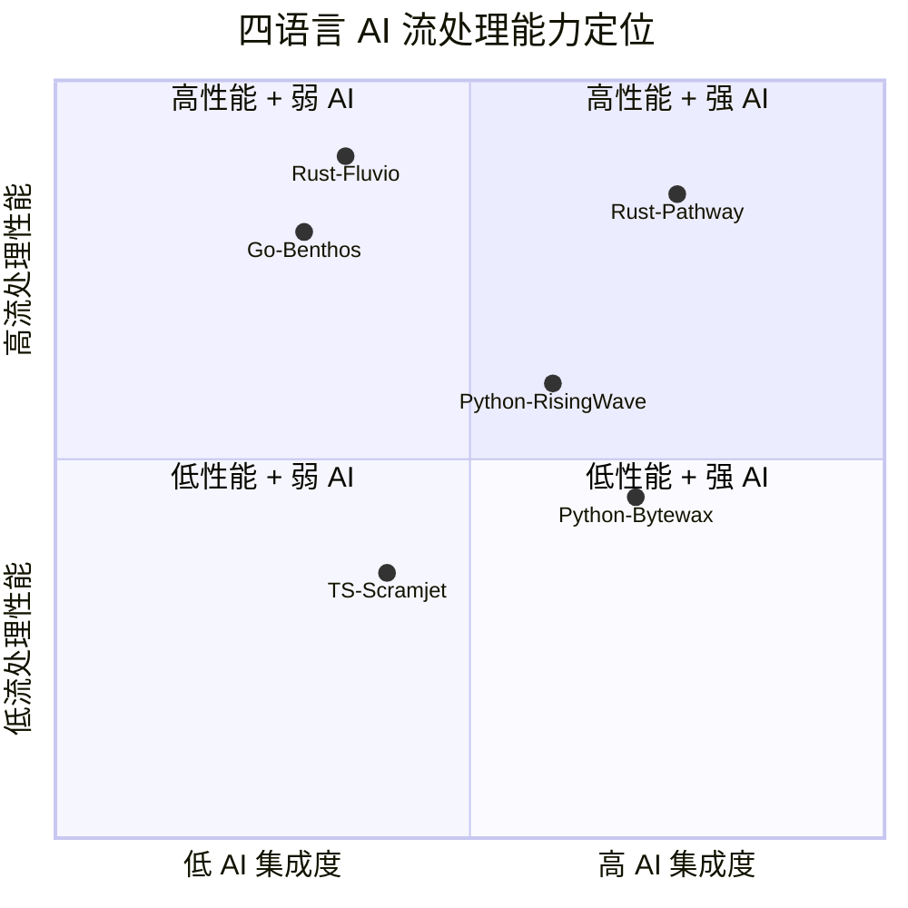

# PG19 前瞻与 AI 流处理演进路线

> 所属阶段: TECH-STACK | 前置依赖: [01.02-pg18-wal-logical-replication-theory.md](../01-theory-foundation/01.02-pg18-wal-logical-replication-theory.md) | 形式化等级: L3

## 1. 概念定义 (Definitions)

**Def-TS-20-01** (PG19 演进方向集合)
PostgreSQL 19 的已公开演进方向集合定义为：
$$\mathcal{R}_{pg19} \triangleq \{ \text{AI原生查询}, \text{向量存储集成}, \text{自动化调优}, \text{云原生弹性}, \text{流处理原生} \}$$

**Def-TS-20-02** (AI 原生流处理)
AI 原生流处理指流处理系统内嵌大语言模型 (LLM) 推理能力，使得流管道可直接执行：
$$\mathcal{P}_{ai} \triangleq \langle \mathcal{S}_{stream}, \mathcal{M}_{llm}, \mathcal{E}_{embed}, \mathcal{T}_{trigger} \rangle$$
其中 $\mathcal{S}_{stream}$ 为事件流，$\mathcal{M}_{llm}$ 为模型推理算子，$\mathcal{E}_{embed}$ 为向量嵌入生成，$\mathcal{T}_{trigger}$ 为推理结果触发器。

**Def-TS-20-03** (流处理与向量数据库融合)
流处理与向量数据库的融合架构定义为：
$$\mathcal{F}_{sv} \triangleq \langle \mathcal{C}_{cdc}, \mathcal{V}_{vec-db}, \mathcal{Q}_{similarity}, \mathcal{U}_{realtime} \rangle$$
CDC 变更事件实时生成向量嵌入并写入向量数据库，支持近似最近邻 (ANN) 实时查询。

**Def-TS-20-04** (自治数据库流管道)
自治数据库流管道指数据库自动识别变更模式并生成相应的流处理配置：
$$\mathcal{A}_{auto} \triangleq \langle \mathcal{D}_{schema}, \mathcal{H}_{history}, \mathcal{G}_{config}, \mathcal{M}_{monitor} \rangle$$

## 2. 属性推导 (Properties)

**Lemma-TS-20-01** (AI 流处理延迟下界)
AI 原生流处理的端到端延迟满足：
$$L_{ai} \geq L_{network} + L_{queue} + L_{inference} + L_{emit}$$
其中 $L_{inference}$ 为 LLM 推理延迟（通常 50-500ms），成为系统瓶颈。

**Lemma-TS-20-02** (向量嵌入实时性)
向量嵌入的实时更新延迟与 CDC 延迟同阶：
$$\Delta_{embed} = \Delta_{cdc} + \Delta_{encode} + \Delta_{insert}$$
其中 $\Delta_{encode}$ 为嵌入生成时间（典型 10-100ms）。

## 3. 关系建立 (Relations)

### PG19 与流计算的关系演进

| PG19 方向 | 流计算影响 | 预期时间 |
|-----------|-----------|---------|
| AI 原生查询 (pgvector + LLM) | 流事件可直接触发向量相似度搜索 | 2026-2027 |
| 自动化分区管理 | 时序流数据自动分区，减少手动维护 | 2026 |
| 增强逻辑复制 | 多主复制、跨区域流同步 | 2026-2027 |
| 云原生存储分离 | 计算存储分离，流处理弹性扩展 | 2027+ |
| 内置流处理算子 | PG 原生窗口函数/流聚合 | 2028+ |

### 与现有技术栈的映射

- **Confluent Streaming Agents**: 已证明 SQL + ML 函数 + MCP 工具调用的可行性
- **RisingWave**: 流数据库 + 向量搜索已发布，与 PG19 方向高度一致
- **Pathway**: Rust 核心 + Python API 的 AI 流处理已可用于生产

## 4. 论证过程 (Argumentation)

### 自治流管道的可行性边界

自治数据库流管道的核心挑战在于**配置生成的正确性保证**。自动生成的流配置必须满足：

1. **语义等价性**: 自动生成的管道与原业务逻辑等价
2. **性能可预测性**: 生成的配置在目标 SLA 内运行
3. **故障可恢复性**: 自动配置支持故障恢复而不丢数据

这三条性质在一般图灵完备语言中不可判定，因此自治流管道的适用范围应限制在**模式化模板**（如 CDC → 变换 → _sink_ 的标准管道）。

### PG 内置流处理算子的必要性论证

当前 PG18 通过逻辑复制 + 外部流处理器实现流处理，存在以下开销：

| 开销项 | 当前架构 | PG 内置流处理 |
|--------|---------|-------------|
| 序列化/反序列化 | WAL → 逻辑事件 → JSON/Avro → 内存对象 | WAL → 内存对象（零拷贝） |
| 网络跳转 | PG → Debezium → Kafka → 处理器 | PG 内部算子执行 |
| 事务协调 | 两阶段提交跨系统 | 单系统内 ACID |
| 运维复杂度 | 4+ 组件 | 1 组件 |

PG 内置流处理算子可将延迟从 100ms-5s 降低至毫秒级，但会显著增加数据库核心复杂度。

## 5. 形式证明 / 工程论证 (Proof / Engineering Argument)

**Thm-TS-20-01** (流数据库与向量数据库融合的一致性定理)

在流数据库与向量数据库融合架构中，若满足：

1. CDC 事件按提交顺序处理（$\prec_{commit}$ 保持）
2. 向量嵌入生成是确定性的（$\forall e: embed(e) = v$）
3. 向量数据库写入是线性一致的

则向量查询结果与源数据库状态最终一致：
$$\lim_{t \to \infty} \{ v \in V_{vec} \mid v \text{ corresponds to } r \in R_{pg} \} = R_{pg}$$

_工程论证_: RisingWave 已证明该架构可行。其物化视图通过增量计算保持一致性，向量索引通过定期刷新或实时更新保持同步。

**Thm-TS-20-02** (AI 流处理成本下界定理)

对于吞吐量 $T$（事件/秒）的流，若每事件触发一次 LLM 推理，则最小计算成本为：
$$C_{min} = T \times c_{inference}$$
其中 $c_{inference}$ 为单次推理成本（OpenAI GPT-4o 约 $0.005/1K tokens$）。

当 $T = 10K$ 事件/秒，每事件 500 tokens 时：
$$C_{min} = 10000 \times 0.0025 = \$25/\text{秒} = \$2.16M/\text{天}$$

因此生产级 AI 流处理必须采用**批处理推理**或**本地小模型**（如 Llama 3.1 8B）降本。

## 6. 实例验证 (Examples)

### 示例 1: PG19 AI 原生查询概念验证

```sql
-- 假设 PG19 支持 AI 原生函数
CREATE STREAM user_queries AS
SELECT
    user_id,
    query_text,
    ai_embedding(query_text) AS query_vec,  -- 假设的内置函数
    ai_classify(query_text, ['tech', 'finance', 'sports']) AS category
FROM user_activity_stream;

-- 实时相似度搜索
SELECT * FROM user_queries
WHERE query_vec <-> target_vec < 0.3
ORDER BY query_vec <-> target_vec;
```

### 示例 2: 本地模型 AI 流处理（Python + llama.cpp）

```python
import pathway as pw
from pathway.xpacks.llm import llms

# 使用本地 Llama 模型进行流处理
model = llms.LLMLiteLLM(model="llama3.1:8b", temperature=0.1)

class InputSchema(pw.Schema):
    text: str
    timestamp: datetime

# 从 PG18 CDC 读取
input_stream = pw.io.postgres.read(
    rds_settings={...},
    table_name="events",
    schema=InputSchema,
)

# 流式推理
results = input_stream.select(
    text=input_stream.text,
    sentiment=model(input_stream.text + "\n分类:正面/负面/中性"),
)

pw.io.jsonlines.write(results, "sentiment_output.jsonl")
pw.run()
```

### 示例 3: 向量嵌入实时同步架构

```
PG18 → Debezium CDC → Kafka → Embedding Service → Pinecone/Milvus
                                    ↓
                              Application Query
```

## 7. 可视化 (Visualizations)

### PG19 演进路线图（Gantt 图）



### AI 流处理架构层次图



### 四语言 AI 流处理能力矩阵



## 8. 引用参考 (References)
