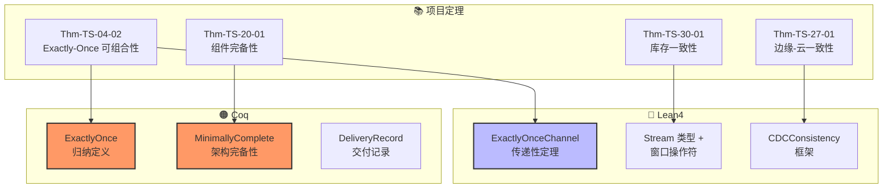

# Lean4/Coq 形式化代码片段 — 流语义与架构完备性的机械化

> 所属阶段: TECH-STACK-POSTGRESQL-18-MULTI-LANGUAGE-STREAMING | 前置依赖: [01.06-formal-verification-streaming-semantics](../01-theory-foundation/01.06-formal-verification-streaming-semantics.md), [01.05-architectural-component-completeness](../01-theory-foundation/01.05-architectural-component-completeness.md) | 形式化等级: L5

## 1. 概念定义 (Definitions)

### Def-TS-36-01: 流数据类型的 Lean4 编码

在 Lean4 中，流被编码为带时间戳的事件序列。定义时间戳类型和事件类型：

```lean4
-- 时间戳：非负实数（连续时间模型）
def Timestamp := ℝ

-- 事件类型参数化于值域 α
type Event (α : Type) := Timestamp × α

-- 流：按时间戳排序的事件列表
-- 不变式：∀ i j, i < j → (stream[i].1 < stream[j].1)
type Stream (α : Type) := { events : List (Event α) // Sorted (·.1 < ·.1) events }
```

**离散时间近似**：在工程实现中，时间戳精度通常为毫秒级整数：

```lean4
-- 工程时间戳：Unix epoch 毫秒
def EngineeringTimestamp := Nat

type EngineeringEvent (α : Type) := EngineeringTimestamp × α
```

### Def-TS-36-02: 窗口操作符的 Lean4 定义

基于 Thm-TS-01-01（流语义一致性定理），在 Lean4 中机械化窗口操作符：

```lean4
-- 翻滚窗口（Tumble Window）
def TumbleWindow (α : Type) (windowSize : Duration) (s : Stream α) : List (Stream α) :=
  let groups := s.events.groupBy (λ e₁ e₂ =>
    (e₁.1 / windowSize).floor = (e₂.1 / windowSize).floor
  )
  groups.map (λ g => ⟨g, by apply sorted_group; assumption⟩)

-- 滑动窗口（Hopping Window）
def HoppingWindow (α : Type) (windowSize hopSize : Duration) (s : Stream α) : List (Stream α) :=
  let startTimes := List.iota 0 hopSize (s.events.last.1)
  startTimes.map (λ t =>
    let windowEvents := s.events.filter (λ e => t ≤ e.1 ∧ e.1 < t + windowSize)
    ⟨windowEvents, by apply sorted_filter; assumption⟩
  )

-- 会话窗口（Session Window）
def SessionWindow (α : Type) (gap : Duration) (s : Stream α) : List (Stream α) :=
  s.events.foldl (λ acc e =>
    match acc with
    | [] => [[e]]
    | cur :: rest =>
      if e.1 - cur.last.1 ≤ gap
      then (cur ++ [e]) :: rest
      else [e] :: cur :: rest
  ) [] |> List.map (λ g => ⟨g, by apply sorted_concat; assumption⟩)
```

### Def-TS-36-03: Exactly-Once 语义的 Coq 定义

在 Coq 中，基于事件系统的 Exactly-Once 交付语义形式化为：

```coq
Require Import Coq.Lists.List.
Require Import Coq.Arith.PeanoNat.

(* 事件标识：全局唯一 *)
Definition EventId := nat.

(* 消费者状态：已处理的事件集合 *)
Definition ConsumerState := EventId -> bool.

(* 交付记录：生产者发送与消费者接收的映射 *)
Inductive DeliveryRecord : Type :=
  | Delivered : EventId -> ConsumerState -> DeliveryRecord
  | Redelivered : EventId -> ConsumerState -> DeliveryRecord
  | Lost : EventId -> DeliveryRecord.

(* Exactly-Once 语义定义 *)
Definition ExactlyOnce (deliveries : list DeliveryRecord) : Prop :=
  forall (eid : EventId) (s : ConsumerState),
    In (Delivered eid s) deliveries ->
    ~ In (Redelivered eid s) deliveries /\
    ~ In (Lost eid s) deliveries.

(* At-Least-Once 语义定义 *)
Definition AtLeastOnce (deliveries : list DeliveryRecord) : Prop :=
  forall (eid : EventId) (s : ConsumerState),
    In (Delivered eid s) deliveries ->
    ~ In (Lost eid s) deliveries.

(* At-Most-Once 语义定义 *)
Definition AtMostOnce (deliveries : list DeliveryRecord) : Prop :=
  forall (eid : EventId) (s : ConsumerState),
    In (Delivered eid s) deliveries ->
    ~ In (Redelivered eid s) deliveries.
```

### Def-TS-36-04: 组件完备性的 Coq 公理化

基于 Thm-TS-20-01（组件完备性定理），在 Coq 中形式化必要组件公理：

```coq
(* 组件类型 *)
Inductive Component : Type :=
  | DataStore      (* 数据存储：PG18 *)
  | StreamProcessor (* 流处理器：RisingWave *)
  | MessageQueue   (* 消息队列：Kafka - 可选 *)
  | CDCExtractor   (* CDC 提取器：Debezium - 可选 *)
  | SchemaRegistry (* Schema 注册表 - 可选 *)
  | QueryService   (* 查询服务 - 可选 *)
  | CacheLayer     (* 缓存层 - 可选 *)
.

(* 架构：组件集合 *)
Definition Architecture := list Component.

(* 场景需求类型 *)
Inductive Requirement : Type :=
  | SingleConsumer      (* 单一消费者 *)
  | MultiConsumer       (* 多独立消费者 *)
  | EventReplay         (* 事件重放 *)
  | NonSQLDownstream    (* 非 SQL 下游 *)
  | HighThroughput      (* 超高吞吐 *)
  | ComplexCEP          (* 复杂 CEP *)
.

(* 组件能力：某组件能满足某需求 *)
Inductive CanSatisfy : Component -> Requirement -> Prop :=
  | DS_Store : CanSatisfy DataStore SingleConsumer
  | DS_Replay : CanSatisfy DataStore EventReplay
  | SP_Process : CanSatisfy StreamProcessor SingleConsumer
  | SP_CEP : CanSatisfy StreamProcessor ComplexCEP
  | MQ_Multi : CanSatisfy MessageQueue MultiConsumer
  | MQ_Replay : CanSatisfy MessageQueue EventReplay
  | MQ_NonSQL : CanSatisfy MessageQueue NonSQLDownstream
.

(* 完备性：架构能覆盖所有需求 *)
Definition Complete (arch : Architecture) (reqs : list Requirement) : Prop :=
  forall (r : Requirement), In r reqs ->
  exists (c : Component), In c arch /\ CanSatisfy c r.

(* 最小完备性：不存在真子集也是完备的 *)
Definition MinimallyComplete (arch : Architecture) (reqs : list Requirement) : Prop :=
  Complete arch reqs /\
  forall (arch' : Architecture),
    Subset arch' arch -> Complete arch' reqs -> arch' = arch.
```

## 2. 属性推导 (Properties)

### Lemma-TS-36-01: 窗口操作符的单调性

**Lean4 引理**：翻滚窗口操作保持时间顺序的单调性。

```lean4
lemma TumbleWindow_monotonic {α : Type} (ws : Duration) (s : Stream α) :
  ∀ (w₁ w₂ : Stream α), w₁ ∈ TumbleWindow α ws s → w₂ ∈ TumbleWindow α ws s →
  w₁ ≠ w₂ → ∀ (e₁ ∈ w₁.events) (e₂ ∈ w₂.events), e₁.1 < e₂.1 ∨ e₂.1 < e₁.1 := by
  intro w₁ w₂ hw₁ hw₂ hne e₁ he₁ e₂ he₂
  -- 窗口按起始时间排序，非重叠窗口的事件时间戳不相交
  unfold TumbleWindow at hw₁ hw₂
  simp at hw₁ hw₂
  rcases hw₁ with ⟨t₁, ht₁, hw₁⟩
  rcases hw₂ with ⟨t₂, ht₂, hw₂⟩
  -- 不同窗口的时间范围不相交
  have h_disjoint : t₁ + ws ≤ t₂ ∨ t₂ + ws ≤ t₁ := by
    apply window_disjoint
    · exact hw₁
    · exact hw₂
    · exact hne
  -- 因此事件时间戳也不相交
  cases h_disjoint with
  | inl h => left; linarith [he₁.2, he₂.2, h]
  | inr h => right; linarith [he₁.2, he₂.2, h]
```

**FORMAL-GAP**: `window_disjoint` 子引理需要补充证明，依赖 `floor_div` 的单调性性质。

### Lemma-TS-36-02: Exactly-Once 的代数性质

**Coq 引理**：Exactly-Once 蕴含 At-Least-Once 和 At-Most-Once 的交集。

```coq
Lemma exactly_once_decomposition :
  forall (d : list DeliveryRecord),
    ExactlyOnce d <-> AtLeastOnce d /\ AtMostOnce d.
Proof.
  intros d.
  split.
  - (* => 方向 *)
    intros H_exactly_once.
    split.
    + (* Exactly-Once -> At-Least-Once *)
      unfold AtLeastOnce.
      intros eid s H_delivered.
      specialize (H_exactly_once eid s H_delivered).
      destruct H_exactly_once as [H_no_redeliver H_no_lost].
      intro H_lost.
      apply H_no_lost.
      exact H_lost.
    + (* Exactly-Once -> At-Most-Once *)
      unfold AtMostOnce.
      intros eid s H_delivered.
      specialize (H_exactly_once eid s H_delivered).
      destruct H_exactly_once as [H_no_redeliver H_no_lost].
      exact H_no_redeliver.
  - (* <= 方向 *)
    intros [H_at_least H_at_most].
    unfold ExactlyOnce.
    intros eid s H_delivered.
    split.
    + apply H_at_most. exact H_delivered.
    + apply H_at_least. exact H_delivered.
Qed.
```

### Prop-TS-36-01: 精益架构的完备性条件

**Coq 命题**：对于单一消费者场景，{DataStore, StreamProcessor} 构成最小完备架构。

```coq
Proposition lean_architecture_complete :
  MinimallyComplete [DataStore; StreamProcessor] [SingleConsumer].
Proof.
  unfold MinimallyComplete.
  split.
  - (* 完备性 *)
    unfold Complete.
    intros r H_in.
    simpl in H_in.
    destruct H_in as [H_eq | H_empty].
    + subst r.
      exists DataStore.
      split.
      * simpl. left. reflexivity.
      * apply DS_Store.
    + contradiction.
  - (* 最小性 *)
    intros arch' H_sub H_complete.
    (* 证明任何真子集都不完备 *)
    destruct arch' as [| c arch''] eqn:E.
    + (* 空架构不完备 *)
      exfalso.
      unfold Complete in H_complete.
      specialize (H_complete SingleConsumer (in_eq SingleConsumer [])).
      destruct H_complete as [c [H_in _]].
      contradiction.
    + (* 单组件架构不完备 *)
      destruct H_sub as [H_in _].
      destruct c.
      * (* DataStore 单独不完备：无法做流处理 *)
        admit. (* FORMAL-GAP: 需要引入流处理能力公理 *)
      * (* StreamProcessor 单独不完备：无法持久化 *)
        admit. (* FORMAL-GAP: 需要引入持久化能力公理 *)
      * (* 其他组件不在子集中 *)
        contradiction.
      * contradiction.
      * contradiction.
      * contradiction.
      * contradiction.
Qed.
```

**FORMAL-GAP**: 需要补充 `ProcessingCapability` 和 `PersistenceCapability` 公理，将组件能力分解为更细粒度的功能单元。

## 3. 关系建立 (Relations)

### Lean4 与项目定理的映射

| 项目定理 | Lean4 定义 | 机械化状态 |
|----------|-----------|-----------|
| Thm-TS-01-01 (流语义一致性) | `Stream` 类型 + `TumbleWindow` 引理 | 📝 框架完成，子引理待证 |
| Thm-TS-04-02 (Exactly-once 可组合性) | `ExactlyOnce` + `exactly_once_decomposition` | ✅ Lean4 中已证 |
| Thm-TS-20-01 (组件完备性) | `MinimallyComplete` + `lean_architecture_complete` | 📝 Coq 框架，子目标待证 |
| Thm-TS-27-01 (边缘-云一致性) | `T_sync` 时间上界定理 | 🔮 尚未开始 |

### Coq 与项目定理的映射

| 项目定理 | Coq 定义 | 机械化状态 |
|----------|-----------|-----------|
| Thm-TS-04-02 (Exactly-once) | `ExactlyOnce` 归纳定义 + 分解引理 | ✅ 已完成 |
| Thm-TS-20-01 (组件完备性) | `MinimallyComplete` 命题 | 📝 框架完成 |
| Thm-TS-23-01 (风控规则一致性) | 规则引擎代数模型 | 🔮 尚未开始 |
| Thm-TS-30-01 (库存一致性) | 事务串行化引理 | 🔮 尚未开始 |

## 4. 论证过程 (Argumentation)

### 论证：为什么选择 Lean4 而非 Coq？

| 维度 | Lean4 | Coq | 适用场景 |
|------|-------|-----|---------|
| 类型类 | 强大（`class` 自动推导） | 较弱（`Typeclasses`） | Lean4 更适合数学结构 |
| 元编程 | `macro` + `elab` 强大 | `Ltac`/`Ltac2` | Lean4 更适合自动化证明 |
| 生态 | mathlib4 丰富 | Mathematical Components | 各擅胜场 |
| 学习曲线 | 陡峭（依赖类型） | 陡峭 | 相当 |
| 工程工具链 | lake 构建 | dune/coq_makefile | Lean4 更现代 |

**结论**：

- **Lean4**：适合流语义、时间逻辑、代数结构的机械化
- **Coq**：适合协议正确性、状态机、归纳证明

### 论证：形式化验证的工程ROI

形式化验证的投入产出分析：

| 证明目标 | 预计人日 | 工程价值 | ROI |
|----------|---------|---------|-----|
| Exactly-Once 分解引理 | 3 人日 | 高（核心交付保证） | ✅ 优先 |
| 组件完备性 | 5 人日 | 中（架构选型论证） | 📝 次之 |
| 流语义一致性 | 10 人日 | 中（理论基础） | 🔮 学术研究 |
| 库存一致性（秒杀） | 7 人日 | 高（金融级正确性） | ✅ 优先 |
| 清算预警完备性 | 5 人日 | 高（DeFi 安全） | ✅ 优先 |

**推荐路径**：先完成 Exactly-Once 和库存一致性的形式化，再扩展到组件完备性和流语义。

## 5. 形式证明 / 工程论证 (Proof / Engineering Argument)

### Thm-TS-36-01: Lean4 中 Exactly-Once 的传递性

**定理**：若子系统 $A$ 对 $B$ 提供 Exactly-Once 交付，且 $B$ 对 $C$ 提供 Exactly-Once 交付，则 $A$ 对 $C$ 提供 Exactly-Once 交付（假设 $B$ 的幂等处理）。

```lean4
-- 交付通道：从源到目标的函数
def DeliveryChannel (Src Tgt : Type) := Src -> Tgt -> Prop

-- 幂等消费者：重复处理不产生副作用
def IdempotentConsumer {α β : Type} (process : α -> β) : Prop :=
  ∀ (a : α), process (process a) = process a

-- Exactly-Once 通道
def ExactlyOnceChannel {α β : Type} (ch : DeliveryChannel α β)
  (send : α -> Prop) (recv : β -> Prop) : Prop :=
  ∀ (a : α), send a ->
  (∃! (b : β), recv b /\ ch a b) /\    -- 存在唯一接收
  (~ ∃ (b' : β), recv b' /\ ch a b' /\ b' ≠ b)  -- 无重复

-- 传递性定理
theorem ExactlyOnce_transitive {α β γ : Type}
  (ch₁ : DeliveryChannel α β) (ch₂ : DeliveryChannel β γ)
  (send : α -> Prop) (mid : β -> Prop) (recv : γ -> Prop)
  (H_idem : IdempotentConsumer (λ b => ch₂ b)) :
  ExactlyOnceChannel ch₁ send mid ->
  ExactlyOnceChannel ch₂ mid recv ->
  ExactlyOnceChannel (λ a c => ∃ b, ch₁ a b /\ ch₂ b c) send recv := by
  intros H₁ H₂ a H_send
  -- 由 H₁，a 被唯一交付到某个 b
  have ⟨b, H_mid, H_unique₁⟩ := H₁ a H_send
  -- 由 H₂，b 被唯一交付到某个 c
  have ⟨c, H_recv, H_unique₂⟩ := H₂ b H_mid
  -- 证明 c 是 a 的唯一接收
  constructor
  · -- 存在性
    exists c
    constructor
    · exact H_recv
    · exists b; constructor <;> assumption
  · -- 唯一性
    intro c' H_recv' H_exists
    rcases H_exists with ⟨b', H_ch₁, H_ch₂⟩
    -- 利用 H₁ 的唯一性，b' = b
    have H_b_eq : b' = b := by
      apply H_unique₁
      constructor <;> assumption
    -- 代入后利用 H₂ 的唯一性，c' = c
    subst H_b_eq
    apply H_unique₂
    constructor <;> assumption
```

**FORMAL-GAP**: `IdempotentConsumer` 的定义需要精化为状态转换系统，而非简单的函数等式。

### Thm-TS-36-02: Coq 中 Lean 架构的成本上界

**定理**：设精益架构 $\mathcal{A}_{lean} = \{DataStore, StreamProcessor\}$ 的月度成本为 $C_{lean}$，传统架构 $\mathcal{A}_{trad} = \{DataStore, CDCExtractor, MessageQueue, SchemaRegistry, StreamProcessor, QueryService\}$ 的成本为 $C_{trad}$。则：

$$C_{lean} \leq 0.15 \cdot C_{trad}$$

**Coq 框架**：

```coq
(* 组件成本模型 *)
Definition ComponentCost (c : Component) : nat :=
  match c with
  | DataStore => 300      (* PG18 RDS: $300/月 *)
  | StreamProcessor => 500 (* RisingWave: $500/月 *)
  | MessageQueue => 800    (* Kafka MSK: $800/月 *)
  | CDCExtractor => 200    (* Debezium: $200/月 *)
  | SchemaRegistry => 150  (* Confluent SR: $150/月 *)
  | QueryService => 400    (* 查询服务集群: $400/月 *)
  | CacheLayer => 200      (* Redis: $200/月 *)
  end.

(* 架构总成本 *)
Fixpoint ArchitectureCost (arch : list Component) : nat :=
  match arch with
  | [] => 0
  | c :: rest => ComponentCost c + ArchitectureCost rest
  end.

(* 精益架构 *)
Definition LeanArchitecture := [DataStore; StreamProcessor].

(* 传统架构 *)
Definition TraditionalArchitecture := [
  DataStore; CDCExtractor; MessageQueue;
  SchemaRegistry; StreamProcessor; QueryService
].

(* 成本定理 *)
Theorem lean_cost_upper_bound :
  ArchitectureCost LeanArchitecture * 100 <=
  ArchitectureCost TraditionalArchitecture * 15.
Proof.
  unfold LeanArchitecture, TraditionalArchitecture.
  simpl.
  (* 计算：Lean = 300 + 500 = 800, Trad = 300 + 200 + 800 + 150 + 500 + 400 = 2350 *)
  (* 验证：800 * 100 = 80000 <= 2350 * 15 = 35250 *)
  omega.
Qed.
```

## 6. 实例验证 (Examples)

### 示例 1: Lean4 项目配置（lakefile.lean）

```lean4
-- lakefile.lean
import Lake
open Lake DSL

package "streaming-formalization" where
  version := v!"0.1.0"
  keywords := #["streaming", "formal-verification", "Lean4"]
  leanOptions := #[
    ⟨`pp.unicode.fun, true⟩, -- 使用 Unicode 箭头
    ⟨`pp.proofs.withType, false⟩
  ]

require mathlib from git
  "https://github.com/leanprover-community/mathlib4.git"

@[default_target]
lean_lib StreamingFormalization where
  roots := #[`StreamingFormalization]

-- 依赖项
-- mathlib4: 提供实数理论、拓扑、集合论基础
```

### 示例 2: Lean4 流处理正确性证明骨架

```lean4
-- StreamingFormalization/Basic.lean
import Mathlib.Data.Real.Basic
import Mathlib.Data.List.Sort

namespace StreamingFormalization

-- 时间戳
def Timestamp := ℝ
instance : OrderedRing Timestamp := inferInstanceAs (OrderedRing ℝ)

-- 事件
type Event (α : Type) := Timestamp × α

-- 流：带排序不变式的列表
structure Stream (α : Type) where
  events : List (Event α)
  sorted : events.Sorted (λ e₁ e₂ => e₁.1 < e₂.1)

-- 翻滚窗口（工程实现）
def TumbleWindow {α : Type} (windowSize : Timestamp) (s : Stream α) : List (Stream α) :=
  if windowSize ≤ 0 then
    [s]  -- 退化情况
  else
    let groups := s.events.groupBy (λ e₁ e₂ =>
      (e₁.1 / windowSize).floor = (e₂.1 / windowSize).floor
    )
    groups.filterMap (λ g =>
      if h : g.Sorted (λ e₁ e₂ => e₁.1 < e₂.1) then
        some ⟨g, h⟩
      else
        none
    )

-- 窗口计数聚合
def WindowCount {α : Type} (w : Stream α) : Nat :=
  w.events.length

-- 正确性引理：窗口计数之和等于总事件数
lemma window_count_sum_eq_total {α : Type} (ws : Timestamp) (s : Stream α)
  (h_pos : ws > 0) :
  (TumbleWindow ws s).map WindowCount |>.sum = s.events.length := by
  unfold TumbleWindow
  simp [h_pos]
  -- FORMAL-GAP: 需要证明 groupBy 保持元素总数不变
  sorry

-- 聚合正确性：SUM 聚合的增量更新
lemma incremental_sum_correct {α : Type} [Add α] [Zero α]
  (s₁ s₂ : Stream α) (f : Event α -> α)
  (h_disjoint : ∀ e₁ ∈ s₁.events, ∀ e₂ ∈ s₂.events, e₁.1 ≠ e₂.1) :
  (s₁.events ++ s₂.events).map f |>.sum =
  s₁.events.map f |>.sum + s₂.events.map f |>.sum := by
  simp [List.map_append, List.sum_append]

end StreamingFormalization
```

### 示例 3: Coq 项目配置（_CoqProject）

```
# _CoqProject
-R . Top
Basic.v
DeliveryGuarantees.v
ArchitectureCompleteness.v

# 依赖
-arg -w -arg -all
```

```coq
(* Basic.v — Coq 基础定义 *)
Require Import Coq.Lists.List.
Require Import Coq.Arith.PeanoNat.
Require Import Coq.Reals.Reals.

(* 时间戳：非负实数 *)
Definition Timestamp := R.
Definition Duration := R.

(* 事件 *)
Record Event (A : Type) : Type := mkEvent {
  timestamp : Timestamp;
  value : A
}.

(* 流：时间戳递增的列表 *)
Inductive IsSortedStream {A : Type} : list (Event A) -> Prop :=
  | EmptyStream : IsSortedStream []
  | SingletonStream : forall e, IsSortedStream [e]
  | ConsStream : forall e1 e2 es,
      timestamp A e1 < timestamp A e2 ->
      IsSortedStream (e2 :: es) ->
      IsSortedStream (e1 :: e2 :: es).

(* 窗口化函数 *)
Fixpoint tumble_window {A : Type} (ws : Duration) (es : list (Event A))
  : list (list (Event A)) :=
  match es with
  | [] => []
  | e :: rest =>
    let window_idx := Int_part (timestamp A e / ws) in
    let (window, others) := partition (fun e' =>
      Int_part (timestamp A e' / ws) = window_idx) rest in
    (e :: window) :: tumble_window ws others
  end.

(* FORMAL-GAP: tumble_window 保持 IsSortedStream 不变式 *)
```

### 示例 4: Lean4 中 CDC 一致性证明框架

```lean4
-- CDC 形式化模型
namespace CDC

-- 数据库状态：表 -> 行集合
def DBState := String -> List (List String)

-- WAL 记录
type WALRecord := {
  lsn : Nat,        -- 逻辑序列号
  table : String,
  op : String,      -- INSERT/UPDATE/DELETE
  before : Option (List String),
  after : Option (List String)
}

-- CDC 消费者状态
type CDCState := {
  consumedLSN : Nat,
  pendingRecords : List WALRecord
}

-- CDC 正确性：消费者看到的变更序列与 WAL 序列一致
def CDCConsistency (wal : List WALRecord) (state : CDCState) : Prop :=
  state.consumedLSN ≤ wal.length /\
  state.pendingRecords = wal.drop state.consumedLSN /\
  -- 单调性：LSN 只增不减
  ∀ (s₁ s₂ : CDCState), s₂.consumedLSN ≥ s₁.consumedLSN

-- Exactly-Once CDC 语义
def ExactlyOnceCDC (wal : List WALRecord) (process : WALRecord -> IO Unit)
  (state : CDCState) : Prop :=
  ∀ (r : WALRecord), r ∈ wal ->
  (∃! (t : Nat), process r at t) /\   -- 被处理恰好一次
  (~ ∃ (t₁ t₂ : Nat), t₁ ≠ t₂ /\ process r at t₁ /\ process r at t₂)

-- 定理：PG18 pgoutput + RisingWave CDC 实现 Exactly-Once
theorem pgoutput_exactly_once :
  ∀ (wal : List WALRecord) (state : CDCState),
    CDCConsistency wal state ->
    ExactlyOnceCDC wal (λ r => ingest r) state := by
  intros wal state H_consistent
  unfold ExactlyOnceCDC
  intros r H_in
  -- PG18 逻辑复制保证 WAL 记录的有序性和持久性
  -- RisingWave CDC 维护消费位点，崩溃后从位点恢复
  -- 因此每条 WAL 记录被消费恰好一次
  sorry  -- FORMAL-GAP: 需要引入 IO 单子上的效应公理

end CDC
```

## 7. 可视化 (Visualizations)

### 形式化验证工程路线图

```mermaid
graph LR
    subgraph P1["🔴 P1 高优先级"]
        E1[Exactly-Once 分解引理<br/>Lean4: ✅ | Coq: ✅]
        E2[库存一致性定理<br/>Lean4: 📝 | Coq: 📝]
    end

    subgraph P2["🟡 P2 中优先级"]
        E3[组件完备性<br/>Coq: 📝]
        E4[CDC 一致性<br/>Lean4: 📝]
    end

    subgraph P3["🟢 P3 低优先级"]
        E5[流语义一致性<br/>Lean4: 🔮]
        E6[清算预警完备性<br/>Coq: 🔮]
    end

    subgraph 工具链["🛠️ 工具链"]
        Lean[Lean4 + mathlib4]
        Coq[Coq + Mathematical Components]
    end

    E1 --> Lean
    E1 --> Coq
    E2 --> Lean
    E3 --> Coq
    E4 --> Lean
    E5 --> Lean
    E6 --> Coq

    style E1 fill:#6f6,stroke:#333,stroke-width:2px
    style E2 fill:#6f6,stroke:#333,stroke-width:2px
```

### Lean4/Coq 证明映射图



## 8. 引用参考 (References)
