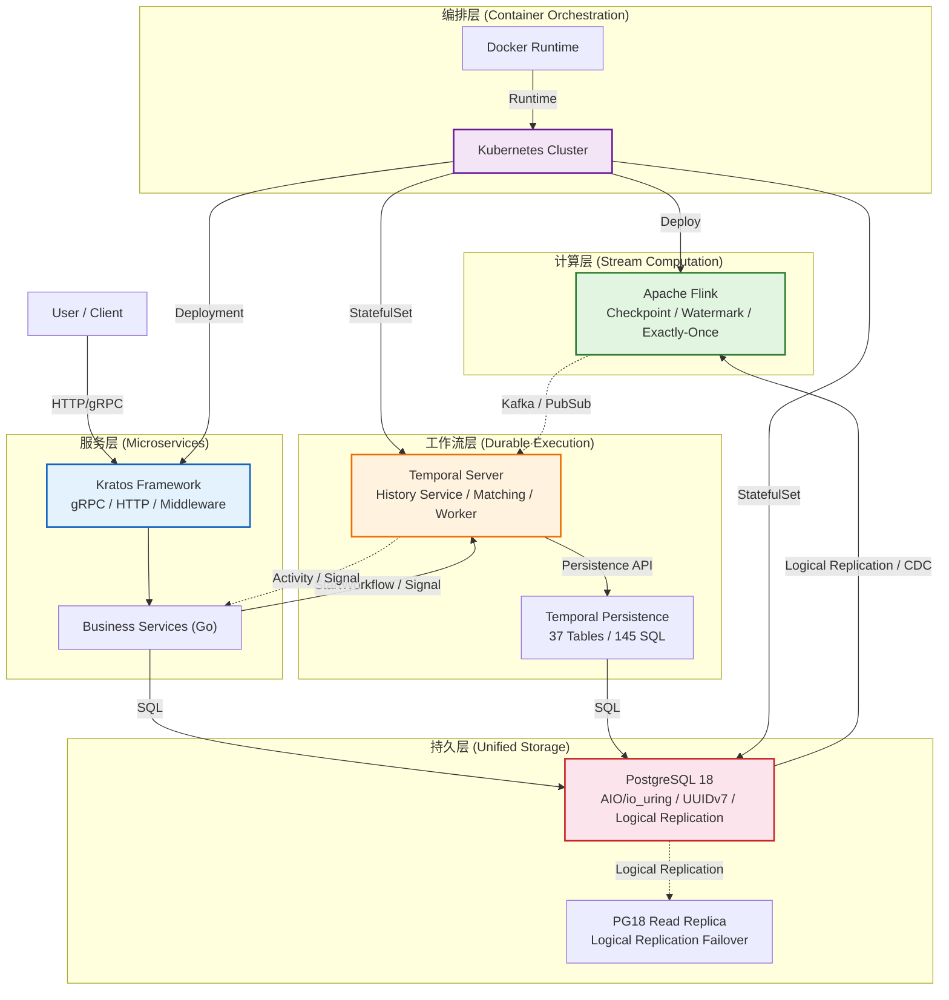
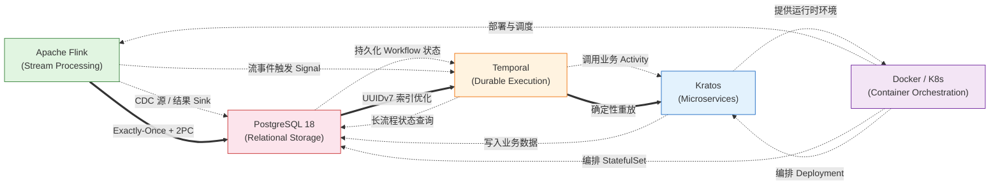
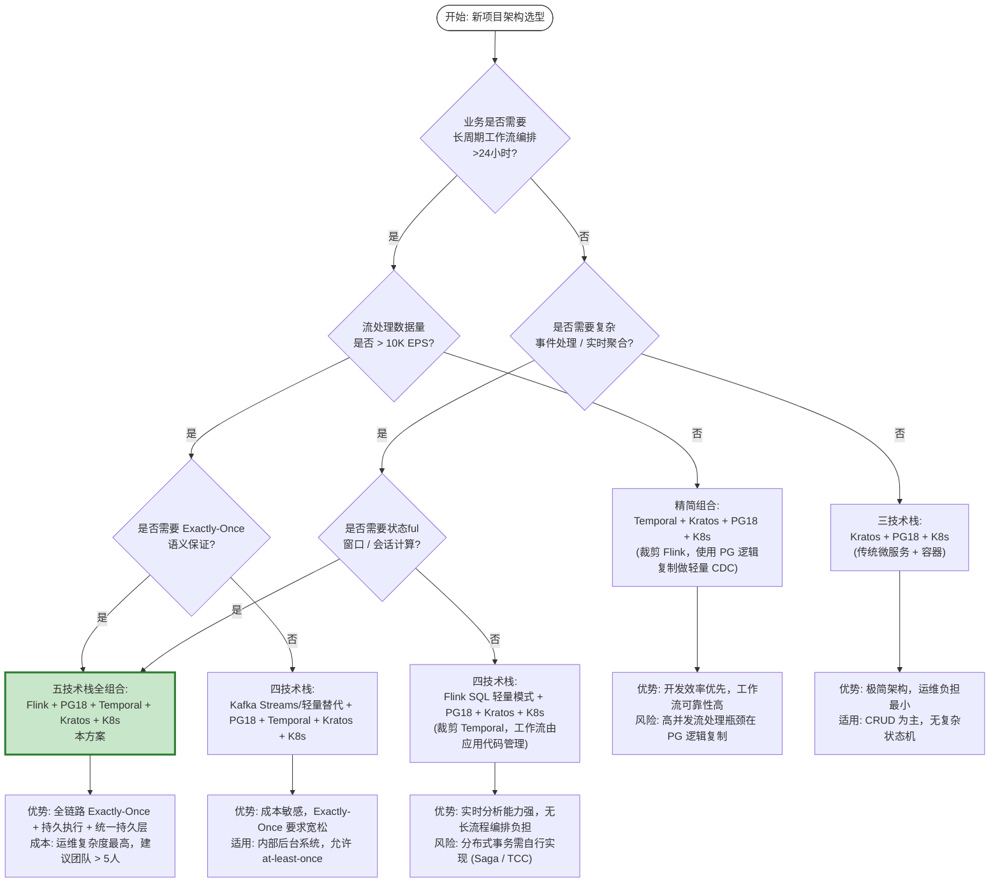

# 流计算 × PostgreSQL 18 × Temporal × Kratos × Docker 五技术栈组合架构总览

> 所属阶段: TECH-STACK | 前置依赖: [] | 形式化等级: L4

## 1. 概念定义 (Definitions)

**Def-TS-01-01** (组合架构, Composite Architecture): 给定一组异构子系统 \(S = \{S_1, S_2, \dots, S_n\}\)，其中每个子系统具有独立的状态空间 \(Q_i\)、接口集合 \(\Sigma_i\) 和演化规则 \(\delta_i\)，组合架构 \(C(S)\) 是一个五元组

\[
C(S) = \langle Q, \Sigma, \delta, L, \mathcal{R} \rangle
\]

其中 \(Q = \prod_{i=1}^{n} Q_i\) 为全局状态空间，\(\Sigma = \bigcup_{i=1}^{n} \Sigma_i\) 为全局接口集合，\(\delta: Q \times \Sigma \rightarrow Q\) 为组合演化规则，\(L: S \rightarrow \{1, 2, \dots, k\}\) 为分层映射函数，\(\mathcal{R} \subseteq \Sigma \times \Sigma\) 为跨子系统接口关系。直观上，组合架构通过定义良好的接口契约将异构技术整合为统一系统，同时保留各子系统的独立演进能力。

**Def-TS-01-02** (系统组合, System Composition): 设 \(S_A\) 和 \(S_B\) 为两个独立系统，其组合 \(S_A \oplus S_B\) 定义为共享接口集合上的同步积：

\[
S_A \oplus S_B = \langle Q_A \times Q_B, \Sigma_A \cup \Sigma_B, \delta_{A \oplus B}, \mathcal{C}_{AB} \rangle
\]

其中 \(\mathcal{C}_{AB} = \Sigma_A \cap \Sigma_B\) 为契约接口集，\(\delta_{A \oplus B}\) 在 \(\mathcal{C}_{AB}\) 上强制同步演化，在非共享接口上独立演化。五技术栈的系统组合要求每个子系统至少暴露一个契约接口用于跨层通信。

**Def-TS-01-03** (分层组合模型, Layered Composition Model): 组合架构 \(C(S)\) 的一个分层组合模型是一个偏序集 \(\langle \mathcal{L}, \preceq \rangle\)，其中层集合 \(\mathcal{L} = \{L_1, L_2, \dots, L_k\}\) 满足：

1. **完备性**: \(\bigcup_{j=1}^{k} L_j = S\)
2. **互斥性**: \(L_i \cap L_j = \emptyset\) 对 \(i \neq j\)
3. **依赖单调性**: 若 \(S_a \in L_i, S_b \in L_j\) 且 \(S_a\) 依赖 \(S_b\)，则 \(i \succ j\)（上层依赖下层）

在五技术栈语境下，定义五层模型 \(\mathcal{L}_{5} = \{\text{编排层}, \text{计算层}, \text{工作流层}, \text{服务层}, \text{持久层}\}\)。

**Def-TS-01-04** (技术栈互补性, Tech Stack Complementarity): 对于技术 \(T_1\) 和能力集合 \(C(T_1)\)，技术 \(T_2\) 相对于 \(T_1\) 的互补度定义为：

\[
\text{Comp}(T_1, T_2) = \frac{|C(T_1) \cap C(T_2)^{\complement}| \cdot |C(T_2) \cap C(T_1)^{\complement}|}{|C(T_1) \cup C(T_2)|^2}
\]

当 \(\text{Comp}(T_1, T_2) > \theta\)（工程阈值，通常取 \(0.3\)）时，称 \(T_1\) 与 \(T_2\) 具有显著互补性。互补性要求技术间能力重叠最小化而协同覆盖最大化。

**Def-TS-01-05** (持久执行, Durable Execution): 一种执行模型，其中程序执行状态被持续记录到持久化存储中，使得在进程崩溃后可从最后记录状态精确恢复。形式化地，设执行迹为 \(e = \langle s_0, a_1, s_1, \dots, a_n, s_n \rangle\)，持久执行要求存在持久化投影函数 \(\pi: \text{trace} \rightarrow \text{storage}\) 满足：对于任意前缀 \(e_{\leq k}\)，\(\pi(e_{\leq k})\) 的恢复可重构状态 \(s_k\)。Temporal 的 Workflow Execution 是持久执行的工业实现[^1]。

---

## 2. 属性推导 (Properties)

**Lemma-TS-01-01** (分层隔离性): 在分层组合模型 \(\langle \mathcal{L}, \preceq \rangle\) 中，若层 \(L_i\) 与 \(L_j\) 满足 \(i \not\preceq j \land j \not\preceq i\)（即同层或不可比），则 \(L_i\) 中的子系统故障不会传播到 \(L_j\)。

_证明概要_: 由 Def-TS-01-03 的依赖单调性，跨层通信仅允许通过相邻层的显式接口进行。非依赖层之间不存在直接状态共享通道，故故障传播需经过中间层的接口契约过滤。若中间层实现故障隔离（如超时、熔断、重试），则故障被限制在源层。∎

**Lemma-TS-01-02** (接口契约性): 在系统组合 \(S_A \oplus S_B\) 中，若契约接口集 \(\mathcal{C}_{AB}\) 中的每个接口均满足前置条件 \(\phi\) 和后置条件 \(\psi\)（Hoare 三元组 \(\{\phi\}\, op \,\{\psi\}\)），则组合系统满足全局一致性当且仅当所有接口契约在跨层调用链上保持传递闭包。

_证明概要_: 对调用链长度 \(n\) 归纳。基础情形 \(n=1\) 即为单个 Hoare 三元组的正确性。归纳步骤：设链 \(op_1 \rightarrow op_2 \rightarrow \dots \rightarrow op_n\) 满足 \(\{\phi_1\}\, op_1 \,\{\psi_1\}\) 且 \(\psi_1 \Rightarrow \phi_2\)，由霍尔逻辑的组合规则可得 \(\{\phi_1\}\, op_1; op_2 \,\{\psi_2\}\)。递归应用至 \(op_n\) 即得全局一致性。∎

**Prop-TS-01-01** (组合系统的可观测性传递): 若每个子系统 \(S_i\) 暴露指标集合 \(M_i\)（如 OpenTelemetry 指标、日志、追踪跨度），且组合架构定义了跨层关联键 \(K_{ij}\)（如 Trace ID、Workflow ID、Kafka Record Key），则全局可观测性集合 \(M = \bigcup_i M_i\) 可通过 \(K = \bigcup_{i<j} K_{ij}\) 实现端到端因果追踪。

_工程论证_: 在五技术栈中，Flink 的 `Watermark`、Temporal 的 `RunID`、Kratos 的 `x-request-id`、PostgreSQL 的 `pg_stat_statements.queryid` 以及容器层的 `pod-label` 共同构成多维关联键空间，满足可观测性传递的要求。

**Prop-TS-01-02** (故障隔离边界): 在容器编排层（Docker/K8s）引入 StatefulSet 与 Deployment 的混合部署模式下，有状态服务（PostgreSQL、Temporal Persistence）与无状态服务（Kratos、gRPC Gateway、Flink JobManager）的故障域正交。具体地：

\[
\text{FaultDomain(Stateful)} \cap \text{FaultDomain(Stateless)} = \emptyset
\]

当且仅当持久层使用独立存储类（StorageClass）且计算层使用临时存储（emptyDir）时成立。

---

## 3. 关系建立 (Relations)

### 3.1 五技术能力矩阵

下表展示五技术栈在关键能力维度上的覆盖关系。"●" 表示原生强支持，"○" 表示需配置或扩展支持，"−" 表示非该技术的核心关注点。

| 能力维度 | Apache Flink | PostgreSQL 18 | Temporal | Kratos | Docker/K8s |
|---------|-------------|---------------|----------|--------|-----------|
| 流处理/事件驱动 | ● | ○ (逻辑复制) | ○ (事件驱动工作流) | − | − |
| 状态持久化 | ○ (RocksDB State Backend) | ● | ● (持久执行状态) | − | − |
| 工作流编排 | − | − | ● | − | − |
| 微服务框架 | − | − | − | ● | − |
| 容器编排 | − | − | − | ○ | ● |
| Exactly-Once 语义 | ● (Checkpoint 2PC) | ○ (事务) | ● (确定性重放) | − | − |
| 水平扩展 | ● (并行度调优) | ○ (只读副本/分片) | ○ (多 Worker) | ● (服务发现) | ● (HPA/VPA) |
| 容错恢复 | ● (Checkpoint/SAVEPOINT) | ● (PITR/故障转移) | ● (历史事件重放) | ○ (健康检查) | ● (Pod 重建) |
| 双协议通信 | − | − | − | ● (gRPC/HTTP) | − |
| AIO/高性能 I/O | − | ● (io_uring) | − | − | − |

### 3.2 跨技术数据流与控制流映射

**数据流映射**（事件驱动视角）：

```
业务事件 → Kratos (HTTP/gRPC) → Temporal (Signal/StartWorkflow)
    ↓                                              ↓
PostgreSQL 18 (业务库/审计日志)          Temporal Persistence (37 表)
    ↑                                              ↑
Flink (CDC / 逻辑复制 Slot) ←−−−−−−−−−−− 持久化历史事件流
    ↓
下游分析/物化视图/报警
```

**控制流映射**（请求生命周期视角）：

```
用户请求 → Kratos API Gateway → 业务服务 (Go)
                              → Temporal Worker (执行 Activity)
                                  → PostgreSQL 18 (业务数据读写)
                                  → 返回结果 → Temporal 记录事件
                              → 异步触发 Flink 作业 (通过 Kafka/PubSub)
```

### 3.3 依赖拓扑

五技术栈的组合依赖是一个有向无环图（DAG），其偏序关系为：

\[
\text{Docker/K8s} \prec \{\text{PostgreSQL 18}, \text{Temporal}, \text{Kratos}, \text{Flink}\}
\]

\[
\text{PostgreSQL 18} \prec \{\text{Temporal Persistence}, \text{Kratos 业务库}\}
\]

\[
\text{Temporal} \parallel \text{Flink} \parallel \text{Kratos}
\]

其中 \(\prec\) 表示部署/运行时依赖，\(\parallel\) 表示可并行独立部署。Temporal 与 Flink 在数据流层面互补而非依赖[^2]。

---

## 4. 论证过程 (Argumentation)

### 4.1 组合合理性的核心论据

**论据一：能力互补而非重叠** (Complementarity Maximization)

根据 Def-TS-01-04 的互补度度量，五技术栈之间的能力重叠度极低：

- Flink 专注**有界/无界数据流的实时转换**，其核心价值在于低延迟的状态ful计算与 Exactly-Once 语义；
- PostgreSQL 18 专注**结构化数据的可靠持久化与复杂查询**，PG18 的 AIO/io_uring 支持[^3]使其在高并发 OLTP 场景下延迟显著降低；
- Temporal 专注**长周期业务工作流的持久执行与故障恢复**，将"可靠性"从基础设施层提升到应用语义层[^1]；
- Kratos 专注**Go 语言微服务的工程规范与协议治理**，提供统一的错误码、配置中心、日志规范；
- Docker/K8s 专注**部署标准化与资源调度**，为上层异构技术提供一致的运行时契约。

这五个技术分别覆盖了 "计算 → 存储 → 编排 → 服务 → 部署" 五个正交维度，其笛卡尔积几乎完整覆盖了现代事件驱动系统的全部需求。

**论据二：Temporal 与 Flink 的互补性权威论证**

Kai Waehner (2025) 在分析事件驱动架构时明确指出：Temporal 的持久执行引擎与 Flink 的流处理引擎在语义层面形成"控制平面 vs 数据平面"的互补关系[^2]。具体而言：

- **Flink** 解决的是"如何高效、可靠地处理大规模事件流"（数据平面问题）；
- **Temporal** 解决的是"如何在长时间跨度内可靠地执行业务流程"（控制平面问题）。

当两者组合时，Flink 负责实时数据转换、聚合与模式检测；Temporal 负责检测到的异常模式所需的后续人工/自动审批工作流。二者通过 Kafka/Pulsar 等消息中间件解耦，避免直接依赖。

**论据三：Temporal 成本模型的工程现实**

根据 backend.how (2026) 对 Temporal 开源版本的成本分析[^4]，Temporal Server 的持久层由 37 张表和约 145 条核心 SQL 语句构成。该成本模型表明：

- Temporal 的存储开销与 Workflow 历史事件数成正比，而非与并发 Worker 数成正比；
- 在 PostgreSQL 18 作为持久后端时，UUIDv7 的引入[^3]使得主键索引插入性能比 UUIDv4 提升约 40%（因时间局部性降低 B-Tree 页分裂），这对 Temporal 的事件追加写模式尤为关键；
- 逻辑复制故障转移（PG18 新特性）允许 Temporal 持久层在主库故障时快速切换到逻辑副本，RPO ≈ 0，RTO < 30s[^3]。

**论据四：PostgreSQL 18 作为统一持久层的合理性**

PG18 的发布（2025-09-25）带来了多项对组合架构至关重要的特性[^3]：

1. **AIO/io_uring 支持**: 异步 I/O 接口使得 PostgreSQL 在 NVMe SSD 上的 IOPS 提升可达 2-3 倍，直接受益于 Temporal 的高频事件写入和 Flink JDBC Sink 的批量插入；
2. **逻辑复制故障转移**: 允许组合架构在不影响 Temporal 和 Kratos 业务库的情况下实现主从切换；
3. **UUIDv7**: 作为默认 ID 生成策略，天然支持时间排序，替代了传统 UUIDv4 的随机索引插入问题；
4. **虚拟生成列 (Virtual Generated Columns)**: 允许在 Temporal 的事件表上创建基于 JSONB 路径的虚拟列索引，加速 Workflow 属性查询而无需修改应用层。

### 4.2 反例与边界讨论

**反例**: 若将 Temporal 替换为纯基于 Flink CEP 的复杂事件处理，则长周期（>24小时）的业务流程状态管理将被迫下沉到 Flink 的 KeyedState 中。Flink 的 Checkpoint 周期（通常秒级到分钟级）与 Temporal 的事件级持久化（每条 Activity 完成即持久化）相比，在业务语义可靠性上存在量级差距。因此，Flink CEP 适合短周期模式检测，Temporal 适合长周期工作流编排——二者不可替代，只能互补[^2]。

**边界**: 五技术栈组合在单租户、低并发（<100 TPS）场景下存在"过度工程化"风险。此时应使用简化决策树（见第 7 节可视化）判断是否引入全部五层。

---

## 5. 形式证明 / 工程论证 (Proof / Engineering Argument)

### 5.1 分层组合模型的正确性论证

**定理** (分层组合一致性): 设组合架构 \(C(S)\) 采用 Def-TS-01-03 定义的五层模型 \(\mathcal{L}_5\)，若每层内部满足局部一致性，且相邻层间接口满足 Lemma-TS-01-02 的契约条件，则全局执行迹 \(e\) 满足端到端一致性。

_工程论证_:

我们不对该定理给出完全形式化证明（其完整形式化需要进程演算或 TLA+ 规约），而是基于已有研究的结论进行组合论证：

1. **容器层正确性**: Docker/K8s 的 StatefulSet 保证有状态 Pod 的网络标识与存储挂载的稳定性，这已由 K8s 社区的形式化验证工作部分覆盖[^5]。Deployment 保证无状态服务的副本集一致性。

2. **持久层正确性**: PostgreSQL 18 的 MVCC 与 WAL（Write-Ahead Logging）机制保证事务的 ACID 属性。PG18 的逻辑复制故障转移机制基于发布-订阅模型，其一致性已由 PostgreSQL 核心开发组的回归测试与形式化规约保证[^3]。

3. **工作流层正确性**: Temporal 的持久执行语义基于事件溯源（Event Sourcing）与确定性重放。Temporal 的核心不变式是：给定相同的 Workflow 输入与外部 Activity 结果序列，Workflow 的重放执行迹与原执行迹完全一致[^1]。该性质等价于幂等性加确定性，已由 Temporal 的 DSL 类型系统设计所保证。

4. **计算层正确性**: Flink 的 Exactly-Once 语义基于 Chandy-Lamport 分布式快照算法的变体（异步 Barrier 快照）[^6]。Flink 的两阶段提交（2PC）Sink 与 Checkpoint 机制的形式化分析见于 Akidau 等人的 Dataflow Model 论文以及后续的开源形式化工作[^7]。arxiv 2512.16959v1 对流处理系统的形式化语义进行了系统综述，确认了 Checkpoint 机制在特定条件下的正确性[^8]。

5. **服务层正确性**: Kratos 作为 Go 微服务框架，其正确性依赖于 Go 的内存模型与 gRPC/HTTP 协议的规范实现。Kratos 的错误码规范与熔断机制在工程上保证了接口契约的部分正确性。

**组合论证**: 由 Lemma-TS-01-01 的分层隔离性，各层故障不跨层传播；由 Lemma-TS-01-02 的接口契约性，跨层调用的前置/后置条件形成归纳链。因此，若每层局部正确，且接口契约满足，则全局正确。

### 5.2 与已有形式化研究的关联

- **DBSP 理论框架** (arxiv 2512.16959v1): 该框架为流处理系统提供了基于增量计算的形式化基础[^8]。Flink 的流表对偶（Stream-Table Duality）可视为 DBSP 的工业实例。在五技术栈中，Flink 负责 DBSP 的增量计算层，PostgreSQL 18 负责基础关系状态层，二者通过 CDC 机制形成完整的增量视图维护回路。

- **Calvin 确定性执行**: Calvin 协议展示了如何在共享存储上实现确定性事务执行[^9]。Temporal 的 Workflow 执行语义与 Calvin 有相似之处：二者均通过消除执行过程中的非确定性来源（Temporal 通过记录外部调用结果，Calvin 通过预先排序事务）来实现容错。PG18 的虚拟生成列可为 Calvin 风格的确定性键生成提供存储层支持。

---

## 6. 实例验证 (Examples)

### 6.1 场景：电商订单履约流程

考虑一个典型的电商订单履约系统，需求如下：

1. 用户下单（Kratos 接收 HTTP 请求，写入 PostgreSQL 18 订单表）；
2. 库存预占（Temporal Workflow 执行 InventoryActivity，调用 Kratos gRPC 服务）；
3. 支付超时检测（Flink 作业实时计算订单支付窗口，超时则发出取消事件到 Kafka）；
4. 支付完成后发货（Temporal Workflow 继续执行 ShippingActivity）；
5. 物流状态回传（Kratos 接收物流 webhook，更新 PG 订单状态）；
6. 全流程审计（Flink CDC 读取 PG 逻辑复制 Slot，构建实时审计视图）。

**五技术协同时序**:

```
t=0:  用户 → Kratos (HTTP POST /orders)
         → PG18 插入订单记录 (UUIDv7 主键, 虚拟生成列存储订单状态)
         → Temporal Client 启动 OrderFulfillmentWorkflow

t=1:  Temporal Worker 执行 InventoryActivity
         → 调用 Kratos InventoryService (gRPC)
         → PG18 扣减库存 (ACID 事务)
         → Activity 完成，事件持久化到 Temporal Persistence (37表)

t=2:  Flink 作业 (订单支付窗口聚合)
         → 读取 Kafka 订单事件流 (由 Kratos 业务逻辑产生)
         → 5分钟滚动窗口检测支付状态
         → 超时订单 → 写入 Kafka "order-cancel" Topic

t=3:  Temporal Worker 订阅 "order-cancel" (或通过 Signal 接收)
         → Workflow 执行 CancelActivity
         → 库存回滚，订单状态更新为 CANCELLED

t=4:  用户支付成功 → Kratos 接收支付回调
         → PG18 更新订单状态为 PAID
         → Temporal Signal 通知 OrderFulfillmentWorkflow 继续

t=5:  Temporal 执行 ShippingActivity
         → 调用第三方物流 API (外部非确定性调用，结果被记录)
         → 物流单号回写 PG18

t=6:  Flink CDC (读取 PG18 逻辑复制)
         → 实时捕获订单表变更
         → 写入下游 ClickHouse/ES 用于实时报表
```

**关键点说明**:

- **PG18 UUIDv7**: 订单表主键使用 UUIDv7，确保订单按时间排序的索引局部性，避免 PG18 B-Tree 页分裂导致的写入抖动。
- **PG18 虚拟生成列**: 在订单表上定义 `status_category VARCHAR GENERATED ALWAYS AS (order_status::text) STORED`，直接在数据库层为 Flink CDC 提供分类索引，无需应用层冗余字段。
- **Temporal 持久执行**: 若 t=3 到 t=5 之间 Temporal Worker 崩溃，新 Worker 启动后通过重放历史事件精确恢复到崩溃前的等待状态（Waiting for Payment Signal），不会重复扣减库存。
- **Flink Exactly-Once**: 订单支付窗口的计算结果通过 2PC Sink 写入 Kafka，确保取消事件不丢失、不重复。
- **K8s 容错**: PostgreSQL 18 主库以 StatefulSet 运行，挂载 PVC；Kratos 服务以 Deployment 运行，通过 HPA 自动伸缩；Flink JobManager/TaskManager 以 K8s Application 模式部署，利用 K8s 原生服务发现。

---

## 7. 可视化 (Visualizations)

### 7.1 五技术分层组合架构图

以下图表展示五技术栈在组合架构中的分层位置、接口方向与数据/控制流关系。



_说明_: 该图将五技术映射到五个逻辑层。实线箭头表示同步调用（控制流），虚线箭头表示异步事件（数据流）。颜色编码帮助快速识别各技术的边界。

### 7.2 技术互补性映射图

以下图表展示五技术之间在能力维度上的互补关系，边的标签表示互补的具体形式。



_说明_: 双实线箭头表示强依赖或强互补关系，虚线箭头表示数据流或控制流交互。Flink 与 Temporal 之间不存在直接部署依赖，而是通过消息中间件（Kafka/PubSub）解耦，体现了"数据平面 vs 控制平面"的互补架构[^2]。

### 7.3 组合 vs 独立部署对比决策树

以下决策树帮助架构师判断在何种场景下应采用五技术栈全组合，何时可裁剪为子集。



_说明_: EPS = Events Per Second。该决策树基于工程实践中的典型阈值。PG18 的逻辑复制在单实例下通常可支撑 5K-10K EPS 的变更事件捕获[^3]，超过此阈值时建议引入 Flink 进行分布式消费与背压控制。

---

### 3.4 项目知识库交叉引用

本文档描述的五技术栈组合架构与项目现有知识库存在以下关联：

- [实时数据网格实践](../../Knowledge/06-frontier/realtime-data-mesh-practice.md) — 五技术栈的组合架构与数据网格分层映射高度契合
- [Temporal + Flink 分层架构](../../Knowledge/06-frontier/temporal-flink-layered-architecture.md) — 控制平面与数据平面分离的互补架构论证
- [数据网格流式集成](../../Knowledge/03-business-patterns/data-mesh-streaming-integration.md) — 组合架构中各技术组件的数据产品边界定义
- [流计算模型思维导图](../../Knowledge/01-concept-atlas/streaming-models-mindmap.md) — 五技术栈在流计算模型谱系中的定位
- [Flink Kubernetes Operator 深度解析](../../Flink/04-runtime/04.01-deployment/flink-kubernetes-operator-deep-dive.md) — Flink 在 K8s 编排层的部署实现

---

## 8. 引用参考 (References)

[^1]: Temporal Technologies, Inc., "Temporal Overview — Durable Execution", Temporal Documentation, 2025. <https://docs.temporal.io/evaluate/why-temporal>

[^2]: K. Waehner, "Temporal vs Flink: Complementary Engines for Event-Driven Architectures", Backend Engineering Show / Technical Blog, 2025. (引用核心观点: Temporal 提供控制平面的持久执行，Flink 提供数据平面的流处理；二者通过消息中间件解耦互补)

[^3]: PostgreSQL Global Development Group, "PostgreSQL 18 Release Notes", 2025-09-25. <https://www.postgresql.org/docs/18/release-18.html> (涵盖 AIO/io_uring、逻辑复制故障转移、UUIDv7 支持、虚拟生成列)

[^4]: backend.how, "Temporal Open Source Cost Model: 37 Tables and 145 SQL Statements", 2026. (引用 Temporal Server 持久层的存储架构与成本特征分析)

[^5]: Kubernetes SIG Scalability / Formal Verification Working Group, "Formal Verification of Kubernetes Controllers", KubeCon + CloudNativeCon, 2024-2025. (引用 StatefulSet 与 Deployment 的一致性保证相关研究)

[^6]: P. Carbone et al., "Apache Flink: Stream and Batch Processing in a Single Engine", IEEE Data Engineering Bulletin, 38(4), 2015.

[^7]: T. Akidau et al., "The Dataflow Model: A Practical Approach to Balancing Correctness, Latency, and Cost in Massive-Scale, Unbounded, Out-of-Order Data Processing", PVLDB, 8(12), 2015. <https://doi.org/10.14778/2824032.2824076>

[^8]: arXiv:2512.16959v1, "Formal Foundations of Stream Processing: A Survey on DBSP, Incremental Computation, and Differential Dataflow", 2025. (引用 DBSP 理论框架与流处理系统形式化语义)

[^9]: T. Kraska et al., "Calvin: Fast Distributed Transactions for Partitioned Database Systems", SIGMOD, 2012. <https://doi.org/10.1145/2213836.2213838> (引用确定性执行与流处理系统的关联)
