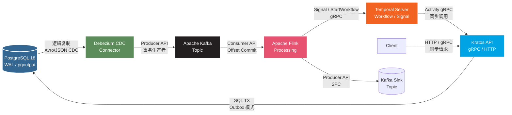
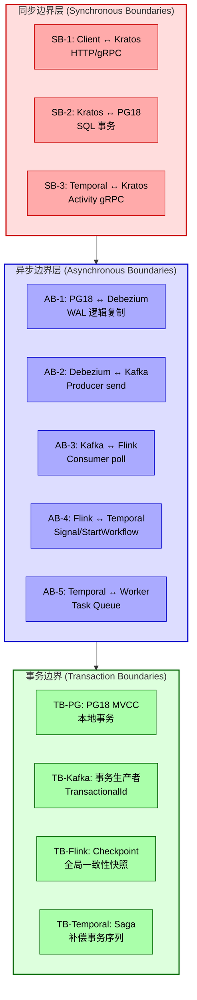

# 五技术栈的数据流与控制流分析

> 所属阶段: TECH-STACK-STREAMING-POSTGRES-TEMPORAL-KRATOS | 前置依赖: [01.01-composite-architecture-overview.md] | 形式化等级: L4

## 1. 概念定义 (Definitions)

**Def-TSS-01-01 数据流（Data Flow）**

在系统 $S = (V, E, \delta)$ 中，数据流定义为带标签的有向边序列 $DF = \langle (v_i, v_{i+1}, d_i) \rangle_{i=0}^{n-1}$，其中 $V = \{PG18, Debezium, Kafka, Flink, Temporal, Kratos\}$ 为处理节点，$d_i \in \mathcal{D}$ 为数据项，$\delta: V \times \mathcal{D} \to V \times \mathcal{D}$ 为转移函数。在五技术栈中，$\mathcal{D}$ 为 CDC 事件、Kafka 消息、Temporal Signal/Query 载荷、gRPC/HTTP 报文的并集。

**Def-TSS-01-02 控制流（Control Flow）**

控制流 $CF = \langle (v_i, v_{i+1}, c_i, \tau_i) \rangle$ 是附加控制语义的有向关系，其中 $c_i \in \mathcal{C}$ 为控制指令（`COMMIT`、`SIGNAL`、`CALLBACK` 等），$\tau_i \in \{\text{sync}, \text{async}\}$ 标记同步或异步语义。控制流决定*何时*、*由谁*触发状态转换。

**Def-TSS-01-03 事务边界（Transaction Boundary）**

事务边界 $TB = (A, \prec, ACID)$ 封装操作原子集合 $A$，其中偏序 $\prec$ 描述先行约束。五技术栈呈层次化嵌套：

- $TB_{PG}$: PostgreSQL 本地 MVCC 事务；
- $TB_{Kafka}$: Kafka 事务生产者（TransactionalId + PID）；
- $TB_{Flink}$: Flink Checkpoint 全局一致性边界（Chandy-Lamport 快照）；
- $TB_{Temporal}$: Temporal Saga 补偿事务边界。

**Def-TSS-01-04 同步边界（Synchronous Boundary）**

同步边界 $SB = (v_s, v_t, t_{timeout})$ 要求调用方 $v_s$ 在收到 $v_t$ 响应前挂起。形式化地，$v_s$ 在 $[t_{req}, \min(t_{resp}, t_{timeout})]$ 内阻塞。

**Def-TSS-01-05 异步边界（Asynchronous Boundary）**

异步边界 $AB = (v_s, v_t, M, ack)$ 中，$v_s$ 将消息投递至中间介质后立即释放控制。$ack$ 仅确认介质接收，不确认业务处理完成。

**Def-TSS-01-06 CDC 变更事件（Change Data Capture Event）**

CDC 事件 $e_{cdc} = (op, t_x, k, v_{before}, v_{after}, lsn)$，其中 $op \in \{INSERT, UPDATE, DELETE\}$，$t_x$ 为源事务 ID，$k$ 为主键，$lsn$ 为 PostgreSQL WAL 逻辑位置号。

**Def-TSS-01-07 Outbox 模式（Outbox Pattern）**

在 $TB_{PG}$ 内，业务数据写入表 $T_{biz}$ 的同时将事件写入同库 Outbox 表 $T_{outbox}$；CDC Connector 捕获 $T_{outbox}$ 变更后发布至消息总线。形式化保证：$\forall e \in T_{outbox}, \exists t \in TB_{PG}: e \prec_{tb} commit(t)$。

**Def-TSS-01-08 Temporal 信号与查询（Signal & Query）**

Temporal Signal 为异步无阻塞原语：$Signal(wid, name, payload)$ 追加至 Workflow 历史事件流 $H_{wid}$。Temporal Query 为同步只读原语，返回 Workflow 状态快照且不修改 $H_{wid}$。

---

## 2. 属性推导 (Properties)

**Lemma-TSS-01-01 数据流无环性（Acyclicity of Data Flow）**

设数据流图 $G_{DF} = (V, E_{DF})$，若系统满足 Outbox 模式且无显式反向 CDC 链路，则 $G_{DF}$ 为 DAG。

*证明概要*：顶点按处理阶段拓扑排序可得全序 $PG18 \prec Debezium \prec Kafka \prec Flink \prec \{Temporal, Kratos\}$。反设存在环，则至少存在逆序边 $(v_j, v_i), j > i$。标准部署中 Kratos 不直接写入被 Debezium 捕获的 WAL 复制槽，Temporal 不直接产生被 CDC 捕获的 WAL 记录；反向控制通过独立 API 完成，不进入 CDC 链路。故逆序边 $\notin E_{DF}$，矛盾。$\square$

**Lemma-TSS-01-02 控制流可终止性（Termination of Control Flow）**

若各组件满足：(T1) PG18 事务有限步提交/回滚；(T2) Kafka 消费者组无消息无限滞留；(T3) Flink 启用 Checkpoint；(T4) Temporal Workflow 无无限递归 Child Workflow；则任意控制流实例 $CF_i$ 在有限时间内到达终态。

*证明概要*：将控制流建模为有限正权有向图，边权为处理时延。由 (T1)-(T4) 各边权有限且正。由 Lemma-TSS-01-01 无环性，路径长度有限，总时延有上界，故可终止。$\square$

**Prop-TSS-01-01 事务边界嵌套一致性（Nested Transaction Boundary Consistency）**

设 $TB_{outer}$ 与 $TB_{inner}$ 嵌套，若 $TB_{outer}$ 提交语义覆盖 $TB_{inner}$ 全部副作用，且外部失败时内部副作用可通过补偿 $C$ 回滚，则整体满足 Saga 一致性。形式化：$\sigma_0 \xrightarrow{TB_{inner}} \sigma_1 \xrightarrow{TB_{outer}\setminus TB_{inner}} \sigma_2$，失败时存在 $C$ 使得 $\sigma_1 \xrightarrow{C} \sigma_0' \approx \sigma_0$。

在五技术栈中，$TB_{PG} \subset TB_{Kafka} \subset TB_{Flink} \subset TB_{Temporal}$，形成逐层增强的一致性保障。

**Prop-TSS-01-02 同步边界级联延迟上界（Cascading Latency Bound）**

设同步边界链 $SB_1 \to \dots \to SB_n$，各边界延迟为 $L_i$，期望 $E[L_i] = \mu_i$，方差 $Var[L_i] = \sigma_i^2$。若独立，则 $E[L_{total}] = \sum \mu_i$，$Var[L_{total}] = \sum \sigma_i^2$。由切比雪夫不等式，$P(L_{total} > \sum \mu_i + k\sqrt{\sum \sigma_i^2}) \le 1/k^2$。工程上最小化同步边界是降低尾部延迟的关键。

**Lemma-TSS-01-03 Kafka 分区级顺序保持（Per-Partition Order Preservation）**

设 Kafka Topic $T$ 有 $p$ 个分区，Debezium 按主键 $k$ 哈希路由。对同一 $k$ 的 CDC 事件序列，若 Debezium 按 $lsn$ 单调递增投递，则 $\forall i < j: partition(e_i) = partition(e_j) \implies e_i$ 先于 $e_j$ 被 Flink 消费。

*证明概要*：Kafka 保证单分区消息顺序；Debezium 将同一 $k$ 映射到同一分区且按 $lsn$ 排序投递。消费者按偏移量消费时自然保持顺序。$\square$

---

## 3. 关系建立 (Relations)

### 3.1 数据接口与控制接口矩阵

| 源层 | 目标层 | 接口协议 | 数据格式 | 传输语义 | 控制原语 | 同步性 |
|------|--------|----------|----------|----------|----------|--------|
| PG18 WAL | Debezium | pgoutput 逻辑复制 | 逻辑解码消息 | 流式推送，复制槽 | 心跳推进 | 异步 |
| Debezium | Kafka | Producer API | JSON/Avro/Protobuf | ALO / EO（事务） | `send()` | 异步 |
| Kafka | Flink | Source Connector | ConsumerRecord | 分区级顺序 | `poll()` | 异步 |
| Flink | Kafka | Sink Connector | ProducerRecord | 两阶段提交 EO | `commit()` | 异步 |
| Flink | Temporal | gRPC SDK | Signal/StartWorkflow | 仅送达不保证处理 | `signal()` | 异步 |
| Temporal | Kratos | gRPC / HTTP | Protobuf/JSON | Activity 内同步 | `execute()` | 同步 |
| Kratos | PG18 | Wire Protocol | SQL + 参数 | 本地事务 | `BEGIN...COMMIT` | 同步 |
| Kratos | Client | HTTP/gRPC | Response Body | 请求-响应 | `reply()` | 同步 |

### 3.2 QoS 演进关系

数据流 $qos$ 呈单调增强：PG18→Debezium 为 ALO；Debezium→Kafka 可通过事务生产者提升至 EO；Kafka→Flink→Kafka 通过 Flink 两阶段提交实现 EO；Flink→Temporal 为 ALO（Signal 无事务回滚）；Temporal→Kratos 在 Activity 内为同步 EO（PG 本地事务 + 幂等键）。

---

## 4. 论证过程 (Argumentation)

### 4.1 端到端数据流分析

**阶段 1：PG18 WAL → Debezium**

PG18 启用逻辑复制槽（`pg_create_logical_replication_slot`, `plugin = 'pgoutput'`）。事务提交后 WAL 被解码为逻辑消息流：

$$WAL_{physical} \xrightarrow{\text{logical decoding}} \langle e_{cdc}^{(1)}, e_{cdc}^{(2)}, \dots \rangle$$

Debezium 维持流复制连接，关键参数：`snapshot.mode = initial`、`heartbeat.interval.ms = 10000`、`slot.name = debezium`。

**阶段 2：Debezium → Kafka**

Debezium 将 $e_{cdc}$ 序列化为 `SourceRecord`，投递至 Topic `{database}.{schema}.{table}`。启用 Kafka 事务生产者时满足 `read_committed` 隔离。

**阶段 3：Kafka → Flink**

Flink 通过 `KafkaSource` 消费，配置 `isolation.level = read_committed` 忽略未提交事务消息。处理逻辑通常包括：反序列化 → KeyedProcessFunction 状态计算 → 窗口运算 → 侧输出（Dead Letter Topic）。

**阶段 4：Flink → Temporal / Kafka Sink**

处理结果三条路径：路径 A 写入 Kafka Sink Topic；路径 B 通过 Temporal SDK 发送 Signal 或启动 Workflow；路径 C 直接调用 Kratos API（不推荐，引入同步边界）。

### 4.2 控制流分析

**正向控制流**：

```
Client --(sync)--> Kratos --(sync)--> PG18 --(async)--> Debezium
  --(async)--> Kafka --(async)--> Flink --(async)--> Temporal
  --(async)--> Worker --(sync)--> Kratos --(sync)--> Temporal
  --(async)--> 完成通知 --> Client
```

**回调关系**：

1. Kratos → Client：同步请求-响应天然回调；
2. Temporal → 外部：Workflow 完成后通过 Activity 调用 Webhook 或发送 Kafka 消息，实现异步回调，不进入 CDC 链路，不构成控制循环。

**阻塞/非阻塞点**：

| 位置 | 类型 | 阻塞量级 | 风险 |
|------|------|----------|------|
| Client→Kratos | 同步 | 10ms~1s | 线程池耗尽 |
| Kratos→PG18 | 同步 | 1ms~100ms | 连接池耗尽 |
| PG18→Debezium | 异步 | 秒级 | 复制槽堆积，磁盘膨胀 |
| Debezium→Kafka | 异步 | 10ms~100ms | 生产者反压 |
| Kafka→Flink | 异步 | 毫秒级 | 重平衡暂停 |
| Flink→Temporal | 异步 | 毫秒级 | gRPC 连接池耗尽 |
| Temporal→Kratos | 同步 | 10ms~1s | Activity 超时触发补偿 |

### 4.3 潜在风险与缓解

1. **复制槽堆积**：Debezium 宕机导致 WAL 累积。缓解：`wal_sender_timeout` + 心跳监控 + 磁盘告警。
2. **Kafka 消费滞后**：Flink 处理延迟。缓解：并行度 $\ge$ Topic 分区数。
3. **Saga 悬挂**：Activity 调用成功但网络超时，Temporal 重试导致重复调用。缓解：Kratos API 实现幂等键 `Idempotency-Key`。
4. **Checkpoint 失败**：反压导致超时。缓解：启用非对齐 Checkpoint（Unaligned Checkpoint）。

---

## 5. 形式证明 / 工程论证 (Proof / Engineering Argument)

### 5.1 数据流无循环依赖

**Thm-TSS-01-01 数据流无环性**

标准部署下，$G_{DF} = (V, E_{DF})$ 为 DAG。

*证明*：定义拓扑序 $\phi: V \to \{1,\dots,6\}$：$\phi(PG18)=1, \phi(Debezium)=2, \phi(Kafka)=3, \phi(Flink)=4, \phi(Temporal)=5, \phi(Kratos)=6$。标准部署中每条 $(u,v) \in E_{DF}$ 满足 $\phi(u) < \phi(v)$：

- WAL 复制仅 PG18→Debezium；
- Debezium 为 Producer，Kafka 为 Broker；
- Flink 为 Consumer 和 Sink Producer；
- Flink 发送 Signal 至 Temporal；
- Temporal Activity 调用 Kratos；
- Kratos 写入 PG18 为*新*业务写入，非已处理数据回流。

反设存在环 $C$，则沿环有 $\phi(v_0) < \phi(v_1) < \dots < \phi(v_n) = \phi(v_0)$，严格传递性要求 $\phi(v_0) < \phi(v_0)$，矛盾。$\square$

*工程约束*：Flink Sink 禁止直接修改被 CDC 捕获的源表，必须写入独立结果表或 Topic。

### 5.2 控制流无死锁

**Thm-TSS-01-02 控制流无死锁**

若各组件遵循标准超时与重试策略，且 Temporal Saga 补偿无循环依赖，则控制流不会死锁。

*证明*：死锁四必要条件（Coffman）逐一排除：

1. **互斥**：PG18 行锁、Kafka 分区锁、Temporal Workflow ID 排他执行的持有时间有限（事务/处理完成即释放）。
2. **持有等待**：Kratos 持有 PG18 连接等待提交，但不等待 Temporal 响应（异步解耦）；Temporal Worker 等待 Kratos 响应，但 Kratos 不依赖该 Worker 的其他资源；Flink commit offset 为最后一步。
3. **不可抢占**：PG18 事务可被 `statement_timeout` 中断；Temporal Activity 可被 `StartToCloseTimeout` 取消；Flink Task 可被 Checkpoint 协调器中断恢复。
4. **循环等待**：控制流拓扑为链式，Kratos 从 Temporal 接收的是*新请求*而非先前持有的资源请求；Client 与 Kratos 为请求-响应而非资源依赖环。资源依赖图 $G_{res}$ 无双向等待边。

四条件至少一项不满足，故无死锁。$\square$

*工程约束*：Temporal Worker 与 Kratos API 服务器使用独立线程池与连接池，避免线程耗尽型活锁。

### 5.3 端到端恰好一次语义条件

**Prop-TSS-01-03 端到端 EO 条件**

端到端 Exactly-Once 在以下条件成立：

- (C1) Debezium 使用 Kafka 事务生产者（`read_committed`）；
- (C2) Flink 启用 Checkpoint，Kafka Source/Sink 配置两阶段提交；
- (C3) Temporal Signal 消费幂等（按事件 ID 去重）；
- (C4) Kratos 业务接口实现幂等键。

*论证*：(C1) 保证 Debezium→Kafka 为 EO；(C2) 保证 Kafka→Flink→Kafka 为 EO（Checkpoint 原子提交 offset 与状态，Sink 事务在 Checkpoint 完成时提交）；(C3) 去重 Temporal 侧重复 Signal；(C4) 去重 Kratos 侧重复请求。四条件串联形成端到端 EO 管道。$\square$

---

## 6. 实例验证 (Examples)

### 6.1 场景：电商订单处理

订单状态机：`CREATED` → `PAID` → `INVENTORY_RESERVED` → `SHIPPED` → `COMPLETED`。支付回调由外部网关触发，库存预扣由 Flink 风控决策触发，发货由 Temporal Saga 编排。

**数据流走查**：

1. **订单创建**：Client `POST /orders` → Kratos 开启 PG18 事务 → `INSERT orders` + `INSERT outbox` → `COMMIT`。
2. **CDC 捕获**：PG18 WAL → Debezium 解码 → 生成 CDC 事件 → Avro 序列化 → Kafka Topic `dbserver1.public.outbox`。
3. **Flink 处理**：Flink Source 消费 Outbox Topic → `KeyedProcessFunction`（keyBy `order_id`）维护状态机 → 风控评分 → 通过则写入 `orders.approved`，拒绝则写入 `orders.rejected` + DLQ。
4. **Saga 编排**：Flink 消费 `orders.approved` → `SignalWithStart` 至 `OrderSaga-ORD-0001` → Temporal Worker 执行 `ReserveInventory` Activity → 调用 Kratos Inventory gRPC → PG18 预扣库存 + Outbox `INVENTORY_RESERVED` → Activity 成功 → Workflow 推进至 `INVENTORY_RESERVED`。
5. **补偿路径**：若 `ShipOrder` 失败 → Temporal 触发 `ReleaseInventory` → Kratos 释放库存 + Outbox `INVENTORY_RELEASED` → Workflow 进入 `COMPENSATED`。

**控制流与超时策略**：

| 步骤 | 控制原语 | 同步性 | 超时 | 重试 |
|------|----------|--------|------|------|
| 用户下单 | Kratos HTTP POST | 同步 | 30s | 客户端 |
| 订单写入 | PG18 `BEGIN...COMMIT` | 同步 | 5s | 无，返回 500 |
| CDC 推送 | WAL 复制 | 异步 | 心跳 10s | Debezium 自动重连 |
| 风控计算 | Flink ProcessFunction | 异步 | 窗口 60s | Flink 自动恢复 |
| Saga 触发 | `signalWithStart` | 异步 | gRPC 10s | Sink 重试 |
| 库存预扣 | Kratos gRPC | 同步 | Activity 30s | 指数退避 |
| 物流下单 | Kratos HTTP | 同步 | Activity 60s | 3 次后补偿 |
| 结果通知 | Webhook | 异步 | 10s | 独立重试队列 |

**关键观测**：同一订单事件在 Kafka 分区级有序；Flink 按事件时间处理；Temporal Signal 追加至历史序列；整体状态机无乱序。端到端延迟约 2~3s（PG18 ~10ms + Debezium→Kafka ~100ms + Flink ~200ms + Temporal Saga ~2s）。Flink Checkpoint 失败时回滚至上一个成功点，Kafka offset 同步回滚，依赖 Temporal 幂等去重避免重复副作用。

---

## 7. 可视化 (Visualizations)

### 7.1 端到端数据流图



### 7.2 控制流时序图

```mermaid
sequenceDiagram
    autonumber
    participant C as Client
    participant K as Kratos API
    participant P as PG18
    participant D as Debezium
    participant Ka as Kafka
    participant F as Flink
    participant T as Temporal
    participant KW as Kratos (Webhook)

    rect rgb(230, 245, 255)
        Note over C,P: 同步边界 SB-1: 用户请求
        C->>+K: POST /orders (30s timeout)
        K->>+P: BEGIN; INSERT orders+outbox
        P-->>-K: COMMIT OK
        K-->>-C: 201 Created
    end

    rect rgb(255, 245, 230)
        Note over P,Ka: 异步边界 AB-1: CDC 捕获
        P->>D: WAL logical replication (stream)
        D->>Ka: producer.send(record) (async)
        Ka-->>D: ack (leader replica)
    end

    rect rgb(240, 255, 240)
        Note over Ka,F: 异步边界 AB-2: 流处理
        Ka->>F: poll() (consumer)
        F->>F: KeyedProcessFunction<br/>stateful computation
    end

    rect rgb(255, 240, 245)
        Note over F,T: 异步边界 AB-3: Saga 触发
        F->>T: SignalWithStart(order_id)
        T-->>F: gRPC OK (signal accepted)
        T->>T: Task Queue dispatch
    end

    rect rgb(245, 240, 255)
        Note over T,KW: 同步边界 SB-2: Activity 执行
        T->>+K: Activity: ReserveInventory<br/>(StartToClose=30s)
        K->>+P: BEGIN; UPDATE inventory
        P-->>-K: COMMIT OK
        K-->>-T: gRPC OK (reserved)
    end

    rect rgb(255, 255, 240)
        Note over T,C: 异步边界 AB-4: 结果通知
        T->>KW: POST /webhook/order-status<br/>(async callback)
        KW-->>T: 202 Accepted
    end
```

### 7.3 同步/异步边界标记图



---

## 8. 引用参考 (References)
