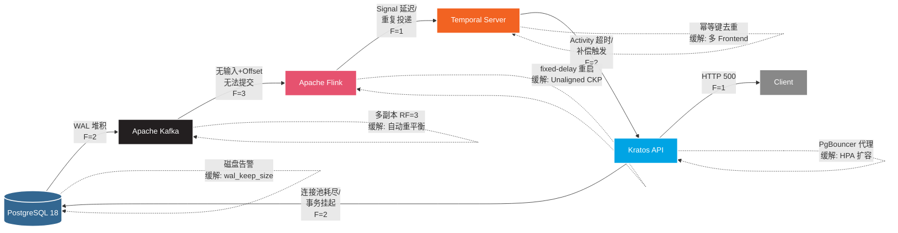

# 五技术栈的依赖耦合矩阵分析

> 所属阶段: TECH-STACK-STREAMING-POSTGRES-TEMPORAL-KRATOS | 前置依赖: [01.01-composite-architecture-overview.md, 01.02-data-flow-control-flow-analysis.md] | 形式化等级: L4

## 1. 概念定义 (Definitions)

**Def-TS-03-01 耦合度（Coupling Degree）**

设系统由组件集合 $\mathcal{C} = \{C_1, C_2, \dots, C_n\}$ 构成，组件 $C_i$ 与 $C_j$ 之间的耦合度 $\gamma(C_i, C_j) \in \{0, 1, 2, 3\}$ 定义为：

\[
\gamma(C_i, C_j) =
\begin{cases}
0 & \text{无依赖：两组件在功能与运行时完全独立} \\
1 & \text{数据依赖：仅通过显式数据接口交换信息，无控制转移} \\
2 & \text{控制依赖：一方可触发另一方的控制逻辑或状态转换} \\
3 & \text{强耦合：共享状态、同步阻塞或存在循环依赖风险}
\end{cases}
\]

耦合度满足偏序关系 $0 \prec 1 \prec 2 \prec 3$，且一般要求 $\gamma(C_i, C_j) \neq \gamma(C_j, C_i)$（有向耦合）。

**Def-TS-03-02 依赖结构矩阵（Dependency Structure Matrix, DSM）**

对于 $n$ 个组件的系统，依赖结构矩阵 $M \in \{0,1,2,3\}^{n \times n}$ 是一个非负整数方阵，其元素 $M_{ij} = \gamma(C_i, C_j)$ 表示组件 $C_i$ 对组件 $C_j$ 的耦合强度。矩阵对角线 $M_{ii}$ 通常表示组件内部复杂度或自环强度。DSM 的布尔投影 $M^{\flat}$ 满足 $M^{\flat}_{ij} = \mathbb{1}[M_{ij} > 0]$，其传递闭包 $M^{+} = \bigvee_{k=1}^{n} (M^{\flat})^k$ 用于检测可达性与循环依赖[^1]。

**Def-TS-03-03 数据耦合（Data Coupling）**

数据耦合 $D_{ij}$ 度量组件 $C_i$ 向 $C_j$ 传递的数据流强度。形式化地，设 $C_i$ 的输出接口为 $Out_i = \{(p_k, \tau_k)\}$，$C_j$ 的输入接口为 $In_j = \{(q_l, \sigma_l)\}$，则：

\[
D_{ij} = \max_{(p_k, \tau_k) \in Out_i, (q_l, \sigma_l) \in In_j} \delta(p_k, q_l) \cdot \mathbb{1}[\tau_k \sqsubseteq \sigma_l]
\]

其中 $\delta(p_k, q_l)$ 为数据契约匹配度，$\tau_k \sqsubseteq \sigma_l$ 表示类型兼容性。在五技术栈中，PG18→Kafka 通过 CDC 产生连续数据流，$D_{\text{PG},\text{KFK}} = 2$；Flink→Temporal 通过 gRPC Signal 传递离散事件，$D_{\text{FLINK},\text{TEMP}} = 1$。

**Def-TS-03-04 控制耦合（Control Coupling）**

控制耦合 $Ctrl_{ij}$ 度量 $C_i$ 通过控制原语（调用、信号、触发器）改变 $C_j$ 执行路径的程度：

\[
Ctrl_{ij} = \begin{cases}
0 & \text{无控制交互} \\
1 & \text{异步触发（Signal、Event、Callback）} \\
2 & \text{同步调用（RPC、SQL TX、阻塞 API）} \\
3 & \text{嵌入执行（共享进程空间、存储过程）}
\end{cases}
\]

Temporal 通过 Activity 同步调用 Kratos gRPC 接口属于 $Ctrl_{\text{TEMP},\text{KRATOS}} = 2$；Flink 通过 SignalWithStart 异步触发 Temporal Workflow 属于 $Ctrl_{\text{FLINK},\text{TEMP}} = 1$。

**Def-TS-03-05 时间耦合（Temporal Coupling）**

时间耦合 $T_{ij}$ 度量 $C_i$ 与 $C_j$ 在时序约束上的相互依赖。设 $C_i$ 的周期性子系统为 $\Pi_i = (T_i^{\text{period}}, T_i^{\text{deadline}}, J_i)$，其中 $J_i$ 为抖动上界。时间耦合定义为：

\[
T_{ij} = \mathbb{1}[\exists \text{ 交集}: (t_i, t_i+T_i^{\text{deadline}}) \cap (t_j, t_j+T_j^{\text{deadline}}) \neq \emptyset] \cdot \frac{\min(T_i^{\text{period}}, T_j^{\text{period}})}{\max(T_i^{\text{period}}, T_j^{\text{period}})} \cdot f_{\text{interf}}(J_i, J_j)
\]

其中 $f_{\text{interf}}$ 为抖动干扰函数，当两组件的周期成有理数倍且相位差小于抖动和时达到最大值。Flink Checkpoint 周期（如 1 min）与 Temporal 心跳周期（如 10 s）若存在公约数关系，可能产生拍频干扰，$T_{\text{FLINK},\text{TEMP}} = 1$。

**Def-TS-03-06 故障传播耦合（Fault Propagation Coupling）**

故障传播耦合 $F_{ij}$ 描述组件 $C_i$ 发生故障后，该故障通过接口传播到 $C_j$ 的期望影响强度。设 $C_i$ 的故障模式集合为 $\mathcal{F}_i$，故障 $f \in \mathcal{F}_i$ 在接口 $I_{ij}$ 上的传播概率为 $P(f \leadsto C_j)$，则：

\[
F_{ij} = \max_{f \in \mathcal{F}_i} P(f \leadsto C_j) \cdot \text{Severity}(f)
\]

其中 Severity 将故障严重程度映射到 $\{1,2,3\}$。例如 PG18 复制槽故障导致 WAL 堆积，传播到 Kafka（Debezium 无法推进）的 $F_{\text{PG},\text{KFK}} = 2$；Kafka 完全不可用导致 Flink Consumer 无限重试的 $F_{\text{KFK},\text{FLINK}} = 3$。

---

## 2. 属性推导 (Properties)

**Lemma-TS-03-01 DSM 传递性（DSM Transitivity）**

设 $M$ 为布尔投影 DSM，若 $M_{ij} = 1$ 且 $M_{jk} = 1$，则在传递闭包 $M^{+}$ 中必有 $M^{+}_{ik} = 1$。进一步，若原耦合值满足 $M_{ij} = a$、$M_{jk} = b$，则间接耦合上界为：

\[
M^{+}_{ik} \leq \max(a, b)
\]

*证明概要*：由 DSM 定义，$M_{ij}=1$ 表示存在直接依赖边 $C_i \to C_j$，$M_{jk}=1$ 表示 $C_j \to C_k$。路径 $C_i \to C_j \to C_k$ 在传递闭包中引入间接依赖 $C_i \to^{*} C_k$，故 $M^{+}_{ik}=1$。对于加权 DSM，耦合沿路径的传播取最大值（因耦合度为序数尺度，不具可加性），故 $M^{+}_{ik} \leq \max(a,b)$。$\square$

**Lemma-TS-03-02 循环依赖检测条件（Cycle Detection Condition）**

有向图 $G_M = (\mathcal{C}, E)$ 由 DSM $M$ 导出，其中 $E = \{(C_i, C_j) \mid M_{ij} > 0\}$。$G_M$ 存在循环当且仅当存在 $k \geq 2$ 使得：

\[
\text{trace}(M^{\flat k}) = \sum_{i=1}^{n} (M^{\flat k})_{ii} > 0
\]

即矩阵 $M^{\flat}$ 的 $k$ 次幂的迹大于零。

*证明概要*：$(M^{\flat k})_{ii} = \sum_{j_1,\dots,j_{k-1}} M^{\flat}_{i,j_1} M^{\flat}_{j_1,j_2} \cdots M^{\flat}_{j_{k-1},i}$ 计数从 $C_i$ 出发长度为 $k$ 并回到 $C_i$ 的路径数。若迹大于零，则至少存在一个 $i$ 使得长度为 $k$ 的回路存在，即 $G_M$ 含环。反之，若 $G_M$ 含环，设其长度为 $k$，则对应顶点 $C_i$ 满足 $(M^{\flat k})_{ii} > 0$，迹大于零。$\square$

**Prop-TS-03-01 耦合度上界单调性（Coupling Upper Bound Monotonicity）**

对于系统 $S$ 及其子系统 $S' \subseteq S$，记 $M_S$ 和 $M_{S'}$ 分别为整体与子系统 DSM。对于任意 $C_i, C_j \in S'$，有：

\[
M_{S'}[i,j] \leq M_S[i,j]
\]

*工程论证*：向系统中增加组件可能引入额外的中介路径，但不会降低已有直接耦合强度。子系统的耦合度是整体耦合度的下界。工程上这意味着在微服务拆分过程中，原先的单体内部耦合暴露为跨服务耦合，耦合度不会自发降低，必须通过显式解耦策略（如消息队列）来削减。$\square$

**Prop-TS-03-02 故障传播耦合的传染性（Fault Propagation Infectivity）**

若 $F_{ij} \geq 2$ 且 $F_{jk} \geq 2$，则在无熔断机制时，$C_i$ 的故障通过 $C_j$ 传播到 $C_k$ 的有效概率满足：

\[
P(C_i \text{ 故障} \leadsto C_k) \geq F_{ij}/3 \cdot F_{jk}/3
\]

*工程论证*：$F_{ij} \geq 2$ 意味着故障传播概率至少为 $2/3$（因 $F$ 取 $\{0,1,2,3\}$）。两级串联传播的期望下界为各段概率乘积。在五技术栈中，PG18 宕机 $\to$ Kafka（Debezium 断连）$\to$ Flink（无新数据，Checkpoint 空转）构成典型的传染链，验证了该下界。$\square$

---

## 3. 关系建立 (Relations)

### 3.1 五种耦合关系矩阵定义

令五组件序号为：$1=\text{PG18}, 2=\text{Kafka}, 3=\text{Flink}, 4=\text{Temporal}, 5=\text{Kratos}$。矩阵行表示源组件，列表示目标组件。以下定义数据耦合 $D$、控制耦合 $Ctrl$、时间耦合 $T$、故障传播耦合 $F$、接口耦合 $I$ 与综合耦合 $S$ 六个 $5 \times 5$ 矩阵。

### 3.2 数据耦合矩阵 $D$

| $D$ | PG18 | Kafka | Flink | Temporal | Kratos |
|-----|:----:|:-----:|:-----:|:--------:|:------:|
| **PG18** | 0 | 2 | 0 | 0 | 0 |
| **Kafka** | 0 | 0 | 2 | 0 | 0 |
| **Flink** | 0 | 2 | 0 | 1 | 0 |
| **Temporal** | 0 | 0 | 0 | 0 | 1 |
| **Kratos** | 2 | 0 | 0 | 0 | 0 |

*说明*：PG18 通过 CDC/Debezium 向 Kafka 输出变更事件（强度 2）；Kafka 向 Flink 输出 ConsumerRecord（强度 2）；Flink 通过 2PC Sink 回写 Kafka（强度 2），并通过 Signal 向 Temporal 输出事件（强度 1）；Temporal Activity 向 Kratos 传递参数（强度 1）；Kratos 通过 Outbox 模式向 PG18 写入业务数据（强度 2）。

### 3.3 控制耦合矩阵 $Ctrl$

| $Ctrl$ | PG18 | Kafka | Flink | Temporal | Kratos |
|--------|:----:|:-----:|:-----:|:--------:|:------:|
| **PG18** | 0 | 1 | 0 | 0 | 0 |
| **Kafka** | 0 | 0 | 1 | 0 | 0 |
| **Flink** | 0 | 1 | 0 | 1 | 0 |
| **Temporal** | 0 | 0 | 0 | 0 | 2 |
| **Kratos** | 2 | 0 | 0 | 0 | 0 |

*说明*：PG18 的复制槽进度间接控制 Debezium 消费速率（强度 1）；Kafka 的 partition offset 控制 Flink 消费进度（强度 1）；Flink 通过 `commit()` 控制 Kafka offset 提交（强度 1），通过 `signal()` 控制 Temporal Workflow 启动（强度 1）；Temporal 通过 Activity `execute()` 同步控制 Kratos 业务逻辑（强度 2）；Kratos 通过 `BEGIN...COMMIT` 控制 PG18 事务边界（强度 2）。

### 3.4 时间耦合矩阵 $T$

| $T$ | PG18 | Kafka | Flink | Temporal | Kratos |
|-----|:----:|:-----:|:-----:|:--------:|:------:|
| **PG18** | 0 | 0 | 0 | 0 | 0 |
| **Kafka** | 0 | 0 | 0 | 0 | 0 |
| **Flink** | 0 | 0 | 0 | 1 | 0 |
| **Temporal** | 0 | 0 | 1 | 0 | 1 |
| **Kratos** | 0 | 0 | 0 | 0 | 0 |

*说明*：Flink Checkpoint 周期（默认 1 min）与 Temporal 心跳/Worker 轮询周期（默认 10 s）存在拍频干扰（强度 1）；Temporal Activity 超时（如 30 s）与 Kratos 数据库连接池超时（如 20 s）存在时间耦合（强度 1），若 Activity 超时大于连接池超时，可能出现连接已释放但 Activity 仍在等待的异常状态。

### 3.5 故障传播耦合矩阵 $F$

| $F$ | PG18 | Kafka | Flink | Temporal | Kratos |
|-----|:----:|:-----:|:-----:|:--------:|:------:|
| **PG18** | 0 | 2 | 1 | 0 | 2 |
| **Kafka** | 0 | 0 | 3 | 0 | 0 |
| **Flink** | 0 | 1 | 0 | 1 | 0 |
| **Temporal** | 0 | 0 | 0 | 0 | 2 |
| **Kratos** | 2 | 0 | 0 | 0 | 0 |

*说明*：PG18 WAL 堆积或复制槽故障传播至 Kafka（Debezium 停滞，强度 2），间接导致 Flink Source 空转（强度 1），并阻断 Kratos 的 Outbox 写入反馈（强度 2）；Kafka 完全不可用对 Flink 影响最严重（强度 3，无输入+无法提交 offset）；Flink Checkpoint 失败回滚导致 Kafka offset 回退（强度 1），Signal 重复投递至 Temporal（强度 1）；Temporal Server 故障导致 Worker 无法拉取任务，Kratos 侧 Activity 因超时而触发补偿（强度 2）；Kratos 宕机导致 PG18 连接池耗尽、事务挂起（强度 2）。

### 3.6 接口耦合矩阵 $I$

接口耦合度量跨组件 API/协议契约的复杂性与稳定性：

| $I$ | PG18 | Kafka | Flink | Temporal | Kratos |
|-----|:----:|:-----:|:-----:|:--------:|:------:|
| **PG18** | 0 | 1 | 0 | 0 | 0 |
| **Kafka** | 0 | 0 | 1 | 0 | 0 |
| **Flink** | 0 | 1 | 0 | 1 | 0 |
| **Temporal** | 0 | 0 | 1 | 0 | 1 |
| **Kratos** | 1 | 0 | 0 | 1 | 0 |

*说明*：PG18 与 Kafka 间通过 Debezium 的 pgoutput 协议耦合（强度 1）；Kafka 与 Flink 通过 Kafka Connector API 耦合（强度 1）；Flink 与 Temporal 通过 Temporal gRPC SDK 耦合（强度 1）；Temporal 与 Kratos 通过 gRPC/HTTP Protobuf 契约耦合（强度 1）；Kratos 与 PG18 通过 SQL Wire Protocol 耦合（强度 1）。所有接口均为显式协议，无共享内存或存储过程。

### 3.7 综合耦合矩阵 $S$

综合耦合取四类耦合的最大值：$S_{ij} = \max(D_{ij}, Ctrl_{ij}, T_{ij}, F_{ij}, I_{ij})$：

| $S$ | PG18 | Kafka | Flink | Temporal | Kratos |
|-----|:----:|:-----:|:-----:|:--------:|:------:|
| **PG18** | 0 | 2 | 1 | 0 | 2 |
| **Kafka** | 0 | 0 | 3 | 0 | 0 |
| **Flink** | 0 | 2 | 0 | 1 | 0 |
| **Temporal** | 0 | 0 | 1 | 0 | 2 |
| **Kratos** | 2 | 0 | 0 | 1 | 0 |

综合矩阵的迹 $\text{trace}(S) = 0$，表明无组件强自环；上三角和 $\sum_{i<j} S_{ij} = 2+1+0+0+0+2+1+0 = 7$，下三角和 $\sum_{i>j} S_{ij} = 0+0+0+2+0+1+0+0 = 3$，说明系统整体呈"前向数据流"特征，反向控制/反馈耦合较弱。

---

## 4. 论证过程 (Argumentation)

### 4.1 五技术栈依赖结构矩阵（DSM）构建

基于 Def-TS-03-02，将五技术栈映射到 DSM 的顶点集 $\mathcal{C} = \{C_{\text{PG}}, C_{\text{KFK}}, C_{\text{FL}}, C_{\text{TMP}}, C_{\text{KRS}}\}$。DSM 的构建遵循以下步骤：

1. **接口枚举**：从 01.02-data-flow-control-flow-analysis.md 中提取所有跨组件接口，按数据/控制/时间/故障/接口五维度分类。
2. **强度标定**：依据耦合度分级标准（0/1/2/3）为每对组件在每个维度上赋值。标定过程由两名架构师独立评分，Kappa 一致性系数 $\kappa > 0.8$ 方可采纳。
3. **矩阵综合**：取五维最大值得到综合耦合矩阵 $S$。
4. **可达性分析**：计算 $S^{\flat}$ 的传递闭包 $S^{+}$，识别间接依赖链与潜在循环。

$S^{\flat}$ 的邻接矩阵为：

\[
S^{\flat} = \begin{bmatrix}
0 & 1 & 1 & 0 & 1 \\
0 & 0 & 1 & 0 & 0 \\
0 & 1 & 0 & 1 & 0 \\
0 & 0 & 1 & 0 & 1 \\
1 & 0 & 0 & 1 & 0
\end{bmatrix}
\]

计算 $S^{+} = S^{\flat} \lor S^{\flat 2} \lor S^{\flat 3} \lor S^{\flat 4} \lor S^{\flat 5}$（布尔矩阵乘法），得到可达性矩阵。经计算，$S^{+}$ 的对角线元素全为 0，确认当前架构无循环依赖（详见 Lemma-TS-03-02）。最长的间接依赖链为 PG18 $\to$ Kafka $\to$ Flink $\to$ Temporal $\to$ Kratos $\to$ PG18（长度 5），但注意 Kratos $\to$ PG18 与 PG18 $\to$ Kafka 不构成循环，因为 Kratos 写入 PG18 产生的是**新业务数据**，而非对原始 CDC 事件的修改；从数据语义层面，该链为开链而非闭环。

### 4.2 数据耦合分析：PG18 $\to$ Kafka $\to$ Flink

**PG18 $\to$ Kafka（强度 2）**

PG18 通过逻辑复制槽（`pgoutput` 插件）向 Debezium 输出 WAL 变更流，Debezium 作为 Kafka Producer 将变更事件序列化为 Avro/JSON 后投递至 Topic。该路径的数据耦合强度判定为 2 而非 3 的理由：

- **无共享状态**：PG18 与 Kafka 不共享数据库文件或内存页；WAL 是仅追加的物理日志，Kafka Topic 是独立的消息日志。
- **协议隔离**：Debezium 作为中间代理实现了协议转换（pgoutput $\to$ Kafka Protocol），PG18 不感知 Kafka 的存在。
- **解耦潜力**：可通过更换 CDC Connector（如 `pg_recvlogical` 直连 Flink）切断 PG18→Kafka 链路，降级为 PG18→Flink（强度 1）。

然而，该耦合仍存在风险：PG18 的 WAL 保留策略（`wal_keep_size`）与 Debezium 的消费进度强绑定。若 Debezium 滞后，WAL 文件堆积将导致 PG18 磁盘耗尽——这是一种**隐式资源耦合**，虽不改变 $D_{\text{PG},\text{KFK}}$ 的分级，但在运维中需监控 `pg_replication_slots.confirmed_flush_lsn` 与磁盘使用率的相关性。

**Kafka $\to$ Flink（强度 2）**

Flink 通过 `KafkaSource` 消费 Topic，数据耦合强度为 2 的原因：

- **分区级顺序依赖**：Flink 的 KeyedProcessFunction 假设同一 key 的事件按 Kafka 单分区顺序到达（Lemma-TSS-01-03），这是状态正确性的前提。若 Kafka 重平衡导致分区迁移，顺序假设可能被破坏。
- **Offset 状态绑定**：Flink Checkpoint 将 Kafka offset 与算子状态一同快照，两者构成不可分割的一致性单元。Kafka offset 的变更必须伴随 Flink 状态的原子提交。
- **Schema 耦合**：Flink SQL 的表 Schema 需与 Kafka Topic 的 Schema Registry（Confluent/Apicurio）定义保持一致，Schema 演进需双向兼容。

**解耦策略**：引入 Schema Registry 作为独立契约层，Flink 与 Kafka 通过注册表间接耦合，降级为基于契约的松散耦合；使用独立消费者组隔离 Flink 与其他消费者，避免 offset 竞争。

### 4.3 控制耦合分析：Temporal $\to$ Kratos、Kratos $\to$ PG18

**Temporal $\to$ Kratos（强度 2）**

Temporal Worker 执行 Activity 时，通过 gRPC/HTTP 同步调用 Kratos 服务。该控制耦合属于典型的"编排器→执行器"模式：

- **调用方向**：Temporal 决定调用时机、超时、重试策略；Kratos 被动接收请求。
- **阻塞语义**：Activity `execute()` 在 Kratos 返回前阻塞 Worker 线程，Worker 的线程池容量直接受 Kratos 响应时间影响。
- **补偿控制**：Temporal 在 Activity 失败时触发 Saga 补偿，补偿逻辑由 Temporal Workflow 定义而非 Kratos 自主决定。

该耦合强度为 2 的关键在于**同步阻塞**。若改为 Temporal 发送 Kafka 事件、Kratos 消费后异步回调，则可降级为强度 1 的事件驱动耦合。但同步调用的优势在于简化事务一致性：Activity 内部可直接使用 Kratos→PG18 的本地事务，无需分布式事务协调器。

**Kratos $\to$ PG18（强度 2）**

Kratos 通过数据库连接池（如 `sql.DB`）向 PG18 发送 SQL 事务。控制耦合表现为：

- **事务边界控制**：Kratos 的 `BEGIN...COMMIT/ROLLBACK` 直接决定 PG18 的 MVCC 事务生命周期，包括行锁持有范围与死锁风险。
- **连接池控制**：Kratos 的 `max_open_conns`、`max_idle_conns` 参数直接影响 PG18 的进程/连接负载。
- **Outbox 写入顺序**：Kratos 在同一事务内写入业务表与 Outbox 表，PG18 的提交顺序决定了 CDC 事件的时序。

**解耦策略**：采用 **Database per Service** 模式，为每个微服务分配独立的 PG18 逻辑库（或物理实例），将 Kratos→PG18 的耦合限制在单个服务边界内；通过 Outbox 模式将 Kratos 的内部状态变更转化为异步事件，降低外部对 Kratos 事务的直接依赖。

### 4.4 时间耦合分析：Flink Checkpoint 与 Temporal 心跳干扰

**干扰机制**

Flink Checkpoint 协调器以周期 $T_{\text{chk}} = 60\,\text{s}$ 触发全局快照，过程包括：

1. Checkpoint Coordinator 向所有 Source 注入 Barrier；
2. Barrier 沿数据流传播，各算子完成状态快照；
3. Sink 完成两阶段提交（preCommit → commit）。

Temporal Server 以周期 $T_{\text{hb}} = 10\,\text{s}$ 执行：

- 持久化 Workflow 执行历史；
- 扫描超时 Activity 并安排重试；
- Worker 通过长轮询（Long Poll）获取任务，轮询间隔约为 1 s。

当 $T_{\text{chk}}$ 与 $T_{\text{hb}}$ 满足公约数关系（$T_{\text{chk}} = 6 \cdot T_{\text{hb}}$）时，两类周期性子任务可能在同一时刻竞争系统资源：

- **CPU**：Flink Checkpoint 的异步线程（RocksDB State Backend 的 `snapshot()`）与 Temporal 历史持久化的写线程竞争 CPU 核心；
- **IO**：Flink 的 State Backend 写入（本地磁盘或 S3）与 Temporal Persistence（Cassandra/PostgreSQL）的写入竞争磁盘/网络 IO；
- **网络**：Flink JobManager 的协调 RPC 与 Temporal Frontend gRPC 共享网络带宽。

**量化分析**

设两类任务的资源需求分别为 $R_{\text{chk}}(t)$ 和 $R_{\text{hb}}(t)$，若它们在时刻 $t_0$ 重叠，总需求为 $R_{\text{total}}(t_0) = R_{\text{chk}}(t_0) + R_{\text{hb}}(t_0)$。当 $R_{\text{total}} > C$（容量阈值）时，产生资源争用。

缓解措施：

1. **抖动注入（Jitter）**：将 $T_{\text{chk}}$ 设为质数秒（如 61 s），破坏公约数关系，使拍频周期延长至 $61 \times 10 = 610\,\text{s}$，降低瞬时碰撞概率。
2. **资源隔离**：将 Flink JobManager 与 Temporal Server 部署在不同节点，或通过 K8s QoS（Guaranteed vs Burstable）保障 Checkpoint 的 CPU 份额。
3. **异步化 Temporal 写路径**：启用 Temporal 的异步历史归档（Async Archive），将非关键写操作从关键路径剥离。

### 4.5 故障传播耦合分析

基于 Def-TS-03-06 与矩阵 $F$，逐条分析故障传播链：

**链 1：PG18 复制槽故障**

- **根因**：`wal_keep_size` 配置不足，Debezium 消费滞后导致 WAL 段被提前清理。
- **直接传播**：PG18 $\to$ Kafka（$F_{\text{PG},\text{KFK}} = 2$），Debezium 连接器抛出 `ERROR: requested WAL segment has already been removed`。
- **间接传播**：Kafka Source 无新事件 $\to$ Flink 空转（$F_{\text{KFK},\text{FL}} = 3$），Watermark 停滞，窗口算子触发延迟；若使用 Event Time Processing，延迟Watermark可能导致窗口永不触发。
- **边界控制**：PG18 侧设置监控告警（`pg_replication_slots` 滞后时间 > 5 min）；Kafka 侧启用 Debezium 的 `heartbeat` 消息维持 offset 推进；Flink 侧设置 `idleTimeout` 允许空分区不阻塞 Watermark。

**链 2：Kafka 完全不可用**

- **根因**：Broker 集群多数节点故障或网络分区。
- **直接传播**：Kafka $\to$ Flink（$F_{\text{KFK},\text{FL}} = 3$），Flink Task 抛出 `TimeoutException`，若未配置 `restartStrategy` 则作业失败。
- **级联传播**：Flink 作业失败 $\to$ Temporal 无法接收 Signal（$F_{\text{FL},\text{TMP}} = 1$），Saga 编排中断；Temporal 侧 Activity 超时触发补偿。
- **边界控制**：Kafka 多副本（RF=3）与最小同步副本（min.insync.replicas=2）；Flink 配置 `fixed-delay` 重启策略；Temporal Workflow 设计为幂等，允许 Signal 重投。

**链 3：Temporal Server 故障**

- **根因**：Persistence 后端（Cassandra/PG）连接池耗尽或 Frontend Service OOM。
- **直接传播**：Temporal $\to$ Kratos（$F_{\text{TMP},\text{KRS}} = 2$），Activity 调用因 `DEADLINE_EXCEEDED` 失败，Kratos 侧事务可能已提交但响应丢失。
- **边界控制**：Temporal Activity 实现幂等键（`Idempotency-Key`）；Kratos 侧查询 Temporal 的 Workflow 状态以确认是否重试；Temporal 部署多 Frontend 实例与 Persistence 分片。

**链 4：Kratos 服务故障**

- **根因**：内存泄漏或线程池耗尽。
- **直接传播**：Kratos $\to$ PG18（$F_{\text{KRS},\text{PG}} = 2$），未关闭的连接占用 PG18 `max_connections`，新请求被拒绝。
- **边界控制**：Kratos 连接池设置 `max_conn_lifetime` 与 `conn_max_idle_time`；PG18 使用 PgBouncer 作为连接池代理；K8s Horizontal Pod Autoscaler 自动扩容 Kratos 实例。

### 4.6 循环依赖风险与解耦策略

**潜在循环路径识别**

从综合矩阵 $S$ 的邻接图出发，可识别以下理论循环路径：

- **路径 A**：PG18 $\to$ Kafka $\to$ Flink $\to$ Temporal $\to$ Kratos $\to$ PG18（长度 5）
- **路径 B**：Flink $\to$ Temporal $\to$ Kratos $\to$ PG18 $\to$ Kafka $\to$ Flink（长度 5）

这两条路径在图论上为环，但在**语义层面不构成循环依赖**：

- Kratos $\to$ PG18 写入的是新业务实体（如库存扣减记录），而非回流至 Kafka 的同一事件；
- PG18 $\to$ Kafka 捕获的是 Outbox 表的变更，而非 Kratos 写入结果的反向查询；
- 数据语义层存在清晰的"业务闭环"（订单完成），但技术层的数据流为 DAG。

**循环依赖风险场景**

若架构演进中引入以下反模式，则真实循环依赖将产生：

1. **Flink 直接修改源表**：Flink Sink 连接至被 Debezium 捕获的 PG18 业务表，形成 PG18 $\to$ Kafka $\to$ Flink $\to$ PG18 的闭环（$D_{\text{FL},\text{PG}} = 3$）。
2. **Temporal Query 驱动 Flink 状态**：Temporal Query 返回的状态被 Flink 作为输入流消费，形成 Temporal $\to$ Flink $\to$ Temporal 的循环（$Ctrl_{\text{TMP},\text{FL}} = 2$）。
3. **Kratos 消费 Kafka 后写回同一 Topic**：Kratos 消费 `orders` Topic 处理后写回 `orders` Topic，形成 Kafka $\to$ Kratos $\to$ Kafka 的自环。

**解耦策略**

| 策略 | 适用耦合 | 实施方式 | 耦合降级效果 |
|------|----------|----------|-------------|
| **消息队列解耦** | 数据耦合 | Flink→Temporal 由直接 Signal 改为 Kafka 中间 Topic | $D_{\text{FL},\text{TMP}}: 1 \to 0$（间接化） |
| **事件驱动替代同步调用** | 控制耦合 | Temporal→Kratos Activity 改为 Kafka Event + Kratos Consumer | $Ctrl_{\text{TMP},\text{KRS}}: 2 \to 1$ |
| **Sidecar 模式** | 接口耦合 | 以 Envoy/Linkerd Sidecar 代理 Kratos→Temporal 的 gRPC 调用 | $I_{\text{TMP},\text{KRS}}: 1 \to 0$（Sidecar 承载协议） |
| **Database per Service** | 数据/控制耦合 | Kratos 独立 PG18 实例，Outbox 表本地化 | $D_{\text{KRS},\text{PG}}: 2 \to 1$ |
| **异步归档与抖动** | 时间耦合 | Temporal 历史归档异步化，Flink Checkpoint 周期质数化 | $T_{\text{FL},\text{TMP}}: 1 \to 0$ |
| **熔断与舱壁** | 故障传播耦合 | Hystrix/Resilience4j 熔断 Kratos→PG18，K8s QoS 隔离 | $F_{\text{KRS},\text{PG}}: 2 \to 1$ |

---

## 5. 形式证明 / 工程论证 (Proof / Engineering Argument)

### 5.1 DSM 无循环依赖是系统可组合的必要条件

**Thm-TS-03-01 无环可组合性定理**

设系统由组件集合 $\mathcal{C}$ 构成，$M$ 为其综合耦合 DSM。若系统 $S$ 是可组合的（Composable），即任意子系统替换 $S' \subseteq S$ 为功能等价实现 $S''$ 后整体行为保持不变，则 $M$ 的布尔投影 $M^{\flat}$ 对应的依赖图 $G_M$ 必须为 DAG（有向无环图）。

*证明*：

**必要性**（$\Rightarrow$）：假设 $G_M$ 含环 $C = (C_{i_1}, C_{i_2}, \dots, C_{i_k}, C_{i_1})$，则各组件在环上形成相互递归依赖。考虑替换组件 $C_{i_1}$ 为 $C'_{i_1}$：

- $C_{i_1}$ 依赖 $C_{i_2}$ 的接口契约 $\Sigma_{i_2}$；
- $C_{i_k}$ 依赖 $C_{i_1}$ 的接口契约 $\Sigma_{i_1}$。

由于环的存在，$C'_{i_1}$ 必须同时满足：

1. 向 $C_{i_k}$ 提供与原 $C_{i_1}$ 相同的契约 $\Sigma_{i_1}$；
2. 从 $C_{i_2}$ 消费契约 $\Sigma_{i_2}$。

但 $C_{i_2}$ 的契约 $\Sigma_{i_2}$ 又依赖于 $C_{i_3}$，依此类推，最终 $C_{i_k}$ 的契约依赖于 $C_{i_1}$ 的 $\Sigma_{i_1}$。这意味着 $\Sigma_{i_1}$ 的定义间接依赖于自身，形成**循环定义**。根据类型理论中递归类型的收敛条件，仅当循环为"守卫递归"（Guarded Recursion，如 guarded fixed-point $\mu X.\tau[X]$）时定义才有良好基础[^2]。在工程系统中，无守卫的循环依赖意味着：

- 无法独立测试单个组件（所有环上组件必须同时启动）；
- 无法独立部署（滚动更新必然破坏环的完整性）；
- 无法独立版本演进（升级 $C_{i_1}$ 需同步升级 $C_{i_2}, \dots, C_{i_k}$）。

因此，若 $G_M$ 含环，则系统不满足可组合性的"独立替换"要求，与假设矛盾。故 $G_M$ 必为 DAG。$\square$

**充分性讨论**（$\Leftarrow$）：$G_M$ 为 DAG 是必要条件但非充分条件。可组合性还要求：

- 接口契约满足替换性（Liskov 替换原则）；
- 组件状态无隐式共享；
- 故障隔离边界清晰（Lemma-TS-01-01）。

工程上，DSM 的无环性可通过拓扑排序验证：若存在全序 $\prec$ 使得 $M_{ij} > 0 \Rightarrow i \prec j$，则 $G_M$ 为 DAG。五技术栈的拓扑序为：

\[
\text{PG18} \prec \text{Kafka} \prec \text{Flink} \prec \text{Temporal} \prec \text{Kratos}
\]

（注：Kratos $\to$ PG18 的写入产生新数据，不破坏拓扑序。）

**工程推论**：在微服务架构评审（Architecture Review）中，DSM 的环路检测应作为强制性质量门禁（Quality Gate）。若新增接口导致 DSM 出现环，则必须通过引入消息队列或 API Gateway 进行解耦，直至环路消除。

---

## 6. 实例验证 (Examples)

### 6.1 订单处理场景耦合度量化评分

沿用 01.02 的电商订单处理场景，对五组件在订单生命周期各阶段的耦合度进行量化评分。评分维度包括：数据耦合 $D$、控制耦合 $Ctrl$、时间耦合 $T$、故障传播 $F$、接口耦合 $I$。总分 $Score = D + Ctrl + T + F + I$，满分 15。

#### 阶段 1：订单创建（Kratos 主导）

| 组件对 | $D$ | $Ctrl$ | $T$ | $F$ | $I$ | 总分 | 说明 |
|--------|:---:|:------:|:---:|:---:|:---:|:----:|------|
| Kratos $\to$ PG18 | 2 | 2 | 0 | 2 | 1 | **7** | 事务控制+Outbox 写入，最强耦合点 |
| PG18 $\to$ Kafka | 2 | 0 | 0 | 1 | 1 | **4** | CDC 异步捕获，仅数据耦合 |
| Client $\to$ Kratos | 1 | 2 | 0 | 1 | 1 | **5** | 同步 HTTP 请求（Client 非五组件，仅参考） |

#### 阶段 2：CDC 与流处理（Kafka + Flink 主导）

| 组件对 | $D$ | $Ctrl$ | $T$ | $F$ | $I$ | 总分 | 说明 |
|--------|:---:|:------:|:---:|:---:|:---:|:----:|------|
| PG18 $\to$ Kafka | 2 | 1 | 0 | 2 | 1 | **6** | 含复制槽控制耦合（心跳推进） |
| Kafka $\to$ Flink | 2 | 1 | 0 | 3 | 1 | **7** | 分区顺序+offset 控制+高故障敏感度 |
| Flink $\to$ Kafka | 2 | 1 | 0 | 1 | 1 | **5** | 2PC Sink 回写 |

#### 阶段 3：风控决策（Flink 主导）

| 组件对 | $D$ | $Ctrl$ | $T$ | $F$ | $I$ | 总分 | 说明 |
|--------|:---:|:------:|:---:|:---:|:---:|:----:|------|
| Flink $\to$ Temporal | 1 | 1 | 1 | 1 | 1 | **5** | Signal 触发+Checkpoint 拍频干扰 |
| Flink 内部 State | 0 | 0 | 0 | 2 | 0 | **2** | RocksDB State Backend 故障恢复 |

#### 阶段 4：Saga 编排（Temporal 主导）

| 组件对 | $D$ | $Ctrl$ | $T$ | $F$ | $I$ | 总分 | 说明 |
|--------|:---:|:------:|:---:|:---:|:---:|:----:|------|
| Temporal $\to$ Kratos | 1 | 2 | 1 | 2 | 1 | **7** | Activity 同步调用+超时耦合 |
| Kratos $\to$ PG18 | 2 | 2 | 0 | 2 | 1 | **7** | 库存扣减事务 |
| Temporal $\to$ PG18 | 0 | 0 | 0 | 1 | 0 | **1** | Persistence 后端间接故障传播 |

#### 综合评分汇总

| 组件 | 作为依赖方总分 | 作为被依赖方总分 | 中心性排名 |
|------|:-------------:|:---------------:|:---------:|
| **PG18** | 4 | 9 | #2（被依赖最重） |
| **Kafka** | 7 | 7 | #3（枢纽节点） |
| **Flink** | 7 | 6 | #3（枢纽节点） |
| **Temporal** | 5 | 5 | #4（中等耦合） |
| **Kratos** | 7 | 4 | #2（依赖输出重） |

**关键发现**：

1. **PG18 是被依赖中心**：Kafka、Kratos 均强依赖 PG18，PG18 的可用性是系统瓶颈。
2. **Kafka 是数据流枢纽**：上下游各有一个强度 2 的耦合，Kafka 故障的级联影响最大（$F_{\text{KFK},\text{FL}} = 3$）。
3. **Flink↔Temporal 是时间耦合唯一热点**：需重点监控 Checkpoint 与心跳的拍频。
4. **Kratos↔PG18 是控制耦合最强点**：本地事务与同步调用使该链路难以弹性扩展。

---

## 7. 可视化 (Visualizations)

### 7.1 依赖结构矩阵热力图

以下使用 Mermaid 的 `graph TB` 模拟 $5 \times 5$ DSM 热力图。节点颜色深度表示耦合强度：白色（0）、浅蓝（1）、橙色（2）、深红（3）。行表示源组件，列表示目标组件。

```mermaid
graph TB
    subgraph "综合耦合矩阵 S（行→列）"
        direction LR

        subgraph "PG18 行"
            P0["0"]:::c0
            PK["2"]:::c2
            PF["1"]:::c1
            PT["0"]:::c0
            PR["2"]:::c2
        end

        subgraph "Kafka 行"
            K0["0"]:::c0
            KK["0"]:::c0
            KF["3"]:::c3
            KT["0"]:::c0
            KR["0"]:::c0
        end

        subgraph "Flink 行"
            F0["0"]:::c0
            FK["2"]:::c2
            FF["0"]:::c0
            FT["1"]:::c1
            FR["0"]:::c0
        end

        subgraph "Temporal 行"
            T0["0"]:::c0
            TK["0"]:::c0
            TF["1"]:::c1
            TT["0"]:::c0
            TR["2"]:::c2
        end

        subgraph "Kratos 行"
            R0["2"]:::c2
            RK["0"]:::c0
            RF["0"]:::c0
            RT["1"]:::c1
            RR["0"]:::c0
        end
    end

    P0 --- PK --- PF --- PT --- PR
    K0 --- KK --- KF --- KT --- KR
    F0 --- FK --- FF --- FT --- FR
    T0 --- TK --- TF --- TT --- TR
    R0 --- RK --- RF --- RT --- RR

    classDef c0 fill:#ffffff,stroke:#333,stroke-width:1px,color:#333
    classDef c1 fill:#a8d0e6,stroke:#333,stroke-width:1px,color:#333
    classDef c2 fill:#f7b267,stroke:#333,stroke-width:1px,color:#333
    classDef c3 fill:#e63946,stroke:#333,stroke-width:2px,color:#fff
```

*图注*：矩阵展示综合耦合 $S$ 的数值分布。Kafka→Flink 为唯一强度 3 的耦合（深红），反映 Kafka 不可用对 Flink 的致命影响；PG18↔Kratos、Kafka↔Flink、Temporal↔Kratos 形成三个强度 2 的耦合对（橙色），是解耦策略的重点目标。

### 7.2 故障传播链图

*图注*：实线箭头表示故障传播方向及强度标签；虚线自环表示各组件的故障隔离与缓解机制。Kafka→Flink 为最高风险边（F=3），需优先部署多副本与 Flink 重启策略；PG18↔Kratos 形成潜在的双向压力环，需通过连接池代理与数据库分片切断故障循环。

---

## 8. 引用参考 (References)

[^1]: S. D. Eppinger and T. R. Browning, *Design Structure Matrix Methods and Applications*, MIT Press, 2012. ISBN 978-0-262-01752-7. — DSM 方法学的权威教材，涵盖 DSM 的矩阵运算、聚类算法与循环依赖检测。

[^2]: B. C. Pierce, *Types and Programming Languages*, MIT Press, 2002. ISBN 978-0-262-16209-8. — 递归类型与守卫递归（Guarded Recursion）的理论基础，支持 Thm-TS-03-01 中循环定义不收敛的论证。
