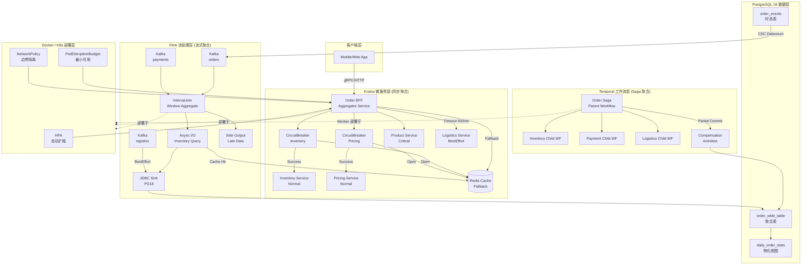
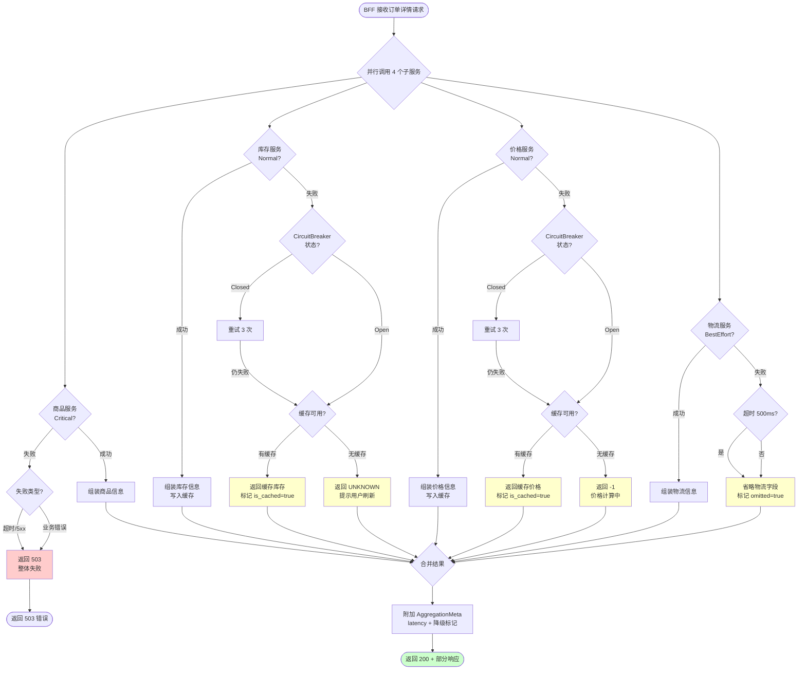

# 聚合模式（Aggregator / Composite）在五技术栈中的设计与弹性

> 所属阶段: TECH-STACK | 前置依赖: [01.01-composite-architecture-overview.md, 01.02-data-flow-control-flow-analysis.md] | 形式化等级: L4

## 1. 概念定义 (Definitions)

在流计算 × PostgreSQL 18 × Temporal × Kratos × Docker/K8s 的五技术栈组合中，聚合模式（Aggregator Pattern）与复合模式（Composite Pattern）是连接原子组件、构建高层业务语义的核心构造。以下定义严格限定于该组合技术栈的上下文。

**Def-TS-01-04-01（聚合服务 Aggregator）**

> 聚合服务是一种处于调用链路上游的服务组件，其职责是向一个或多个下游原子服务（或数据源）发起并发或串行请求，将多个局部结果集按照预定义的组合规则（Combinator）融合为单一、完整的业务响应。在五技术栈中，Aggregator 可由 Kratos BFF 层实现同步聚合，由 Flink 算子实现流式聚合，或由 Temporal Workflow 实现异步 Saga 结果汇总。

直观上，Aggregator 是"扇入（Fan-in）"结构的逻辑顶点：它将分布式系统中的多路信息汇聚为客户端所需的统一视图。与简单的代理（Proxy）不同，Aggregator 必须理解业务语义，承担结果过滤、字段映射、冲突消解与一致性调和的职责。

**Def-TS-01-04-02（复合服务 Composite）**

> 复合服务是由两个及以上原子服务通过显式组合关系构成的、对外暴露单一服务契约的逻辑单元。复合服务强调"整体-部分"层次结构：复合服务本身可成为更大复合服务的组成部分（递归组合）。在五技术栈中，Composite 既可以是一个 Kratos 微服务集群的聚合门面（Facade），也可以是 Temporal 中由多个 Child Workflow 组合而成的父工作流，亦或是 PostgreSQL 18 中由多个物化视图（Materialized View）联合构成的虚拟报表层。

Aggregator 与 Composite 的关键区别在于：Aggregator 强调**运行时请求的合并与响应组装**；Composite 强调**设计时服务单元的层次化封装与契约抽象**。二者在实践中往往共存：一个 Composite 服务内部可能包含多个 Aggregator 节点。

**Def-TS-01-04-03（聚合边界 Aggregation Boundary）**

> 聚合边界是界定聚合服务职责范围及其所依赖子服务集合的显式接口与契约集合。聚合边界包含三个要素：(1) 输入契约——Aggregator 向上游暴露的 API 规范；(2) 输出契约——Aggregator 对下游子服务的调用规范；(3) 一致性契约——在部分子服务不可用或延迟时，Aggregator 承诺返回的结果质量等级（完整响应 / 部分响应 / 降级响应 / 失败响应）。

在五技术栈中，聚合边界的实现形式各异：Kratos 中通过 Protobuf/gRPC 的 `service` 定义与 `middleware` 链划定边界；Flink 中通过 `DataStream` 的 `keyBy` 与 `window` 算子划定时间-空间边界；Temporal 中通过 Workflow 接口定义与 Query Handler 划定逻辑边界；PostgreSQL 18 中通过 `SECURITY DEFINER` 视图与行级安全策略（RLS）划定数据边界；Docker/K8s 中通过 `NetworkPolicy` 与 `Service` 资源划定网络边界。

**Def-TS-01-04-04（聚合一致性 Aggregation Consistency）**

> 聚合一致性是指聚合结果在部分子服务故障、网络分区或数据延迟场景下，仍能满足业务语义正确性的性质。形式化地，设聚合服务 $A$ 依赖子服务集合 $S = \{s_1, s_2, \ldots, s_n\}$，$A$ 的响应为 $R_A = f(R_{s_1}, R_{s_2}, \ldots, R_{s_n})$，其中 $f$ 为组合函数。若存在子集 $S_{fail} \subset S$ 不可用，Aggregator 返回 $R'_A = f(R_{s_i} | s_i \in S \setminus S_{fail}, d_j | s_j \in S_{fail})$，其中 $d_j$ 为降级数据（缓存/默认值/空值）。聚合一致性要求 $R'_A$ 满足业务不变式 $Inv(R'_A)$，且偏差度量 $Dev(R'_A, R_A) \leq \epsilon_{biz}$，其中 $\epsilon_{biz}$ 为业务容忍阈值。

聚合一致性不是 CAP 定理中的强一致性，而是一种**面向业务的弱一致性保证**。在电商场景中，聚合一致性允许商品详情页在库存服务暂时不可用时显示"库存未知"而非直接 503，前提是前端 UI 能够优雅地处理该状态。

## 2. 属性推导 (Properties)

从上述定义出发，可直接推导出聚合服务在分布式环境中的关键弹性性质。

**Prop-TS-01-04-01（聚合服务的单点故障风险）**

> 设聚合服务 $A$ 同步依赖 $n$ 个独立子服务 $s_1, \ldots, s_n$，各子服务可用性为 $p_i$。若 $A$ 未配置任何降级策略（即要求所有子服务必须成功返回），则 $A$ 的可用性 $P_A$ 满足：
> $$P_A = \prod_{i=1}^{n} p_i$$
> 特别地，若所有 $p_i = p$，则 $P_A = p^n$。当 $n \geq 3$ 且 $p = 0.999$（"三个9"）时，$P_A \approx 0.997$，Aggregator 成为事实上的可用性瓶颈。

*工程推论*：在未引入熔断、降级或缓存机制前，Aggregator 是系统可用性的"短板放大器"。每增加一个同步依赖，整体可用性呈指数衰减。此性质是五技术栈中所有 Aggregator 实现必须配置弹性机制的理论依据。

**Lemma-TS-01-04-01（超时级联效应 Timeout Cascade）**

> 设聚合服务 $A$ 以并行方式调用 $n$ 个子服务，各子服务超时时间为 $T_i$。若 $A$ 的上游超时时间为 $T_{upstream}$，且 $A$ 自身的处理开销为 $\delta$（包含序列化、反序列化、组合逻辑），则 $A$ 能够成功完成完整响应的必要条件为：
> $$\max_{i \in [1,n]} T_i + \delta \leq T_{upstream}$$
> 进一步，若存在任一子服务 $s_k$ 未配置显式超时（即 $T_k \to \infty$），则 $A$ 的期望响应时间 $E[T_A]$ 无界：
> $$E[T_A] \geq P(s_k\ \text{hangs}) \cdot \infty = \infty$$
> 即使 $s_k$ 挂死的概率极小，期望响应时间仍发散。

*工程推论*：超时级联是微服务系统中最隐蔽的故障模式之一。在五技术栈中，Kratos 必须配置 gRPC/HTTP 客户端超时；Temporal Workflow 必须设置 `StartToCloseTimeout`；Flink 算子必须配置 `AsyncFunction` 的超时与容量限制；PostgreSQL 连接必须设置 `statement_timeout`；K8s 探针必须设置合理的 `timeoutSeconds`。任一链路的超时缺失都会导致聚合服务成为"等待黑洞"。

**Prop-TS-01-04-02（部分响应下的聚合一致性保持）**

> 设聚合服务 $A$ 对故障子服务 $s_j$ 采用降级策略 $d_j$（缓存值 $c_j$ 或默认值 $def_j$）。定义数据新鲜度度量 $\phi(c_j) = 1 - e^{-\lambda (t_{now} - t_{cache})}$，其中 $\lambda$ 为业务时效衰减系数。则降级响应 $R'_A$ 满足聚合一致性当且仅当：
> $$\forall s_j \in S_{fail}:\ \phi(c_j) \geq \phi_{min} \quad \text{或} \quad Inv(R'_A, def_j) = \text{true}$$
> 其中 $Inv$ 为业务不变式判定函数，$\phi_{min}$ 为最小可接受新鲜度阈值。

*工程推论*：部分响应不是"退而求其次"，而是一种**可量化的质量保证**。在五技术栈中，PostgreSQL 18 的物化视图可作为聚合缓存层；Kratos 的 `middleware` 可注入 Redis 缓存回退；Flink 的 `AsyncLookupFunction` 可配置 `maxRetry` 与 `cache`；Temporal 的 Query Handler 可返回 Workflow 状态快照。所有降级策略都必须显式声明其一致性等级与数据时效边界。

## 3. 关系建立 (Relations)

### 3.1 Aggregator 与 Kratos 微服务体系的关系

在 Kratos 微服务框架中，Aggregator 通常以 **BFF（Backend for Frontend）** 层或 **API Gateway** 扩展的形式存在。其关系特征为：

- **调用关系**：Aggregator 通过 Kratos `transport/grpc` 或 `transport/http` 客户端向多个下游 `service` 发起调用。
- **中间件链关系**：Kratos 的 `middleware` 机制（如 `logging`, `metrics`, `validate`, `circuit breaker`）天然构成聚合边界的横切关注点。
- **服务发现关系**：Aggregator 依赖 Kratos 内置的 `registry`（etcd/Consul/Nacos）动态解析下游服务地址，聚合边界随服务注册表变化而动态伸缩。

### 3.2 Aggregator 与 Flink 流处理的关系

在流计算层，Aggregator 不是一个独立服务，而是一组**分布式算子（Operator）**的逻辑组合：

- **Window Aggregation**：`keyBy → window → aggregate` 将时间维度上同键的多条记录聚合成单一结果。
- **Stream Join**：`DataStream.join(DataStream)` 或 `coGroup` 实现双流/多流的关联聚合。
- **Async I/O**：`AsyncFunction` 允许算子异步查询外部服务（如 Kratos gRPC 服务），将请求-响应模式嵌入流处理拓扑。

Flink 的 Aggregator 与 Kratos 的 Aggregator 存在**层级映射**：前者处理的是无界数据流的时间窗口聚合，后者处理的是有界请求-响应的服务调用聚合。二者可通过 Async I/O 桥接。

### 3.3 Aggregator 与 Temporal 工作流的关系

Temporal 中的聚合通过**工作流组合（Workflow Composition）**实现：

- **Child Workflow**：父 Workflow 启动多个 Child Workflow，通过 `Promise.all` 或 `Promise.any` 等待结果汇拢。
- **Saga 聚合**：长事务 Saga 的补偿结果需要在 Aggregator 层汇总，以确定整体事务状态（提交/回滚/部分提交）。
- **Query Handler**：Temporal Workflow 的 Query Handler 可向外部暴露聚合状态快照，实现"正在聚合中"的中间态可见性。

Temporal Aggregator 与 Kratos/Flink Aggregator 的关键差异在于**时间尺度**：Temporal 聚合可能跨越秒、分钟甚至小时，而 Kratos/Flink 聚合通常在毫秒到秒级完成。

### 3.4 Aggregator 与 PostgreSQL 18 的关系

PostgreSQL 18 在聚合模式中承担**持久化缓存与状态锚点**的角色：

- **物化视图（Materialized View）**：预聚合查询结果，作为 Aggregator 的降级数据源。
- **逻辑复制（Logical Replication）**：CDC 流将聚合结果同步到 Kafka/Flink，形成"写时聚合、读时流式分发"的闭环。
- **RETURNING OLD/NEW**：单语句获取 UPDATE 前后值，简化聚合增量计算。
- **Temporal WITHOUT OVERLAPS**：时态表约束保证聚合历史记录的时间不相交性，防止时间窗口重叠导致的重复计数。

### 3.5 Aggregator 与 Docker/K8s 部署层的关系

在部署层，Aggregator 的弹性通过容器编排机制保障：

- **HPA（Horizontal Pod Autoscaler）**：根据 CPU/自定义指标（如待处理请求队列长度）自动扩缩 Aggregator Pod 副本。
- **Pod Disruption Budget**：确保聚合服务在滚动更新时维持最小可用副本数。
- **NetworkPolicy**：限制 Aggregator 只能访问其聚合边界内的下游服务，防止网络层面的越界依赖。

## 4. 论证过程 (Argumentation)

### 4.1 多 Kratos 微服务结果的聚合模式

在 Kratos 中，多服务聚合通常采用**并行扇出-扇入（Parallel Scatter-Gather）**模式。以下分析其典型实现路径：

**模式 A：BFF 层同步聚合**

BFF 服务接收前端请求后，通过 `errgroup` 或 `ant` 并发库并行调用多个下游 Kratos 服务：

```go
func (s *OrderAggregator) GetOrderDetail(ctx context.Context, req *pb.OrderRequest) (*pb.OrderDetail, error) {
    g, ctx := errgroup.WithContext(ctx)

    var product *pb.ProductInfo
    var inventory *pb.InventoryStatus
    var pricing *pb.PriceInfo
    var logistics *pb.LogisticsStatus

    g.Go(func() error {
        var err error
        product, err = s.productClient.GetProduct(ctx, req.ProductId)
        return err
    })
    g.Go(func() error {
        var err error
        inventory, err = s.inventoryClient.CheckStock(ctx, req.ProductId)
        return err
    })
    g.Go(func() error {
        var err error
        pricing, err = s.pricingClient.GetPrice(ctx, req.ProductId, req.UserId)
        return err
    })
    g.Go(func() error {
        var err error
        logistics, err = s.logisticsClient.GetStatus(ctx, req.OrderId)
        return err
    })

    if err := g.Wait(); err != nil {
        return nil, err // 硬失败：任一服务错误即整体失败
    }

    return composeOrderDetail(product, inventory, pricing, logistics), nil
}
```

上述实现是"硬聚合"：任一子服务失败即整体失败，其可用性满足 $P_A = p^4$（Prop-TS-01-04-01），在生产环境中不可接受。

**模式 B：带熔断与降级的弹性聚合**

引入 Resilience4j（或 Kratos 生态的 `middleware/circuitbreaker`）后，聚合逻辑演变为：

```go
func (s *OrderAggregator) GetOrderDetailResilient(ctx context.Context, req *pb.OrderRequest) (*pb.OrderDetail, error) {
    detail := &pb.OrderDetail{OrderId: req.OrderId}

    // 商品信息：核心依赖，失败则整体失败
    product, err := s.productClient.GetProduct(ctx, req.ProductId)
    if err != nil {
        return nil, fmt.Errorf("product service unavailable: %w", err)
    }
    detail.Product = product

    // 库存信息：非核心，降级为"未知"
    inventory, err := s.inventoryClient.CheckStock(ctx, req.ProductId)
    if err != nil {
        s.metrics.IncFallback("inventory")
        detail.Inventory = &pb.InventoryStatus{Status: pb.StockStatus_STOCK_UNKNOWN}
    } else {
        detail.Inventory = inventory
    }

    // 价格信息：非核心，降级为缓存价格
    pricing, err := s.circuitBreaker.Execute(func() (interface{}, error) {
        return s.pricingClient.GetPrice(ctx, req.ProductId, req.UserId)
    })
    if err != nil {
        cached, _ := s.priceCache.Get(req.ProductId)
        detail.Pricing = cached.(*pb.PriceInfo)
        detail.Pricing.IsCached = true
    } else {
        detail.Pricing = pricing.(*pb.PriceInfo)
        s.priceCache.Set(req.ProductId, detail.Pricing, cache.DefaultExpiration)
    }

    // 物流信息：非核心，降级为空列表
    logistics, err := s.logisticsClient.GetStatus(ctx, req.OrderId)
    if err != nil {
        detail.Logistics = &pb.LogisticsStatus{Events: []*pb.LogEvent{}}
    } else {
        detail.Logistics = logistics
    }

    return detail, nil
}
```

此模式下，可用性模型发生变化：设商品服务可用性为 $p_{product}$，其余服务通过降级策略虚拟可用性提升至 $p' \approx 1$。则整体可用性 $P_A \approx p_{product}$， aggregator 不再成为全局瓶颈。

### 4.2 多 Flink 流的 Join / Union 聚合

在流计算层，聚合模式表现为算子级别的数据融合。Flink 提供三种核心聚合机制：

**Window Join（窗口关联）**

适用于有时间对齐要求的双流聚合，如订单流与支付流在 5 分钟窗口内关联：

```java
DataStream<Order> orders = ...;
DataStream<Payment> payments = ...;

DataStream<EnrichedOrder> enriched = orders
    .keyBy(Order::getOrderId)
    .intervalJoin(payments.keyBy(Payment::getOrderId))
    .between(Time.minutes(-2), Time.minutes(5))
    .process(new EnrichmentProcessFunction());
```

Window Join 的聚合一致性由 Watermark 机制保证：若支付事件延迟超过 Watermark 边界，则该记录进入侧输出流（Side Output），需由下游 Late Data Handler 单独聚合。

**Union + Keyed Aggregation（合并+键控聚合）**

适用于同质数据流的合并统计，如多 Kafka Topic 的日志汇聚：

```java
DataStream<LogEvent> appLogs = ...;
DataStream<LogEvent> sysLogs = ...;

DataStream<LogEvent> allLogs = appLogs.union(sysLogs);

DataStream<LogStats> stats = allLogs
    .keyBy(LogEvent::getServiceName)
    .window(TumblingEventTimeWindows.of(Time.minutes(1)))
    .aggregate(new LogCountAggregate());
```

**Async I/O 查询聚合**

当流处理需要关联外部服务（如 Kratos 微服务或 PostgreSQL 维表）时，使用 Async I/O 避免阻塞：

```java
AsyncFunction<String, EnrichedEvent> asyncQuery = new AsyncFunction<>() {
    @Override
    public void asyncInvoke(String key, ResultFuture<EnrichedEvent> resultFuture) {
        ListenableFuture<EnrichedEvent> future = kratosClient.asyncQuery(key);
        Futures.addCallback(future, new FutureCallback<>() {
            @Override
            public void onSuccess(EnrichedEvent result) {
                resultFuture.complete(Collections.singletonList(result));
            }
            @Override
            public void onFailure(Throwable t) {
                // 降级：返回带默认值的 EnrichedEvent
                resultFuture.complete(Collections.singletonList(
                    EnrichedEvent.fallback(key)
                ));
            }
        }, executor);
    }
};

DataStream<EnrichedEvent> enriched = AsyncDataStream.unorderedWait(
    stream, asyncQuery, 1000, TimeUnit.MILLISECONDS, 100
);
```

Async I/O 的容量限制（`capacity` 参数）本质上是一种**背压感知的聚合边界**：当外部服务响应变慢时，Flink 自动反压上游，防止内存溢出。

### 4.3 多 Temporal Saga 结果的汇总模式

Temporal Workflow 中的聚合是**长事务语义下的状态汇聚**。典型场景为：订单创建 Saga 涉及库存扣减、支付、物流创建三个子事务，最终结果需在父 Workflow 中汇总。

**模式：Child Workflow + Promise.all**

```go
func OrderSagaWorkflow(ctx workflow.Context, order Order) error {
    ao := workflow.ActivityOptions{
        StartToCloseTimeout: 30 * time.Second,
        RetryPolicy: &temporal.RetryPolicy{
            InitialInterval: time.Second,
            MaximumAttempts: 3,
        },
    }
    ctx = workflow.WithActivityOptions(ctx, ao)

    // 并行启动三个 Child Workflow
    cwo := workflow.ChildWorkflowOptions{WorkflowExecutionTimeout: 5 * time.Minute}

    inventoryFuture := workflow.ExecuteChildWorkflow(
        workflow.WithChildOptions(ctx, cwo), InventoryDeductionWorkflow, order.Items)
    paymentFuture := workflow.ExecuteChildWorkflow(
        workflow.WithChildOptions(ctx, cwo), PaymentWorkflow, order.Amount)
    logisticsFuture := workflow.ExecuteChildWorkflow(
        workflow.WithChildOptions(ctx, cwo), LogisticsCreationWorkflow, order.Address)

    // 等待全部完成（聚合点）
    var inventoryResult InventoryResult
    var paymentResult PaymentResult
    var logisticsResult LogisticsResult

    err1 := inventoryFuture.Get(ctx, &inventoryResult)
    err2 := paymentFuture.Get(ctx, &paymentResult)
    err3 := logisticsFuture.Get(ctx, &logisticsResult)

    // Saga 补偿逻辑：任一失败即触发回滚
    if err1 != nil || err2 != nil || err3 != nil {
        return compensate(ctx, order, err1, err2, err3)
    }

    // 汇总结果至订单聚合状态
    return workflow.ExecuteActivity(ctx, SaveOrderAggregate, OrderAggregate{
        OrderId:     order.ID,
        Inventory:   inventoryResult,
        Payment:     paymentResult,
        Logistics:   logisticsResult,
        Status:      OrderStatus_CONFIRMED,
        UpdatedAt:   workflow.Now(ctx),
    }).Get(ctx, nil)
}
```

Temporal Saga 聚合的弹性由 Workflow 引擎保证：即使 Aggregator Worker 崩溃，Workflow 状态会在新 Worker 上自动恢复，"聚合中"的中间态不会丢失。

**部分响应模式：CQRS 读模型聚合**

对于不需要强 Saga 一致性的场景，Temporal Workflow 可将各子事务结果写入 PostgreSQL 18 的事件表，由 Flink CDC 捕获并物化到读模型（Read Model）。此时 Aggregator 不在 Temporal 中，而在**流式物化视图**中：

```sql
-- PostgreSQL 18 时态事件表
CREATE TABLE order_events (
    order_id UUID,
    event_type VARCHAR(32),
    payload JSONB,
    valid_period DATERANGE,
    EXCLUDE USING GIST (order_id WITH =, valid_period WITH &&)
);

-- 逻辑复制至 Kafka → Flink 聚合为读模型
```

### 4.4 聚合服务的弹性设计矩阵

| 弹性机制 | Kratos 实现 | Flink 实现 | Temporal 实现 | PostgreSQL 实现 | K8s 部署层 |
|---------|------------|-----------|--------------|----------------|-----------|
| **断路器 (Circuit Breaker)** | Resilience4j / Kratos middleware | Async I/O 超时 + 异常计数 | Workflow 重试策略 + 超时 | 连接池熔断（pgbouncer） | Service Mesh (Istio) |
| **超时 (Timeout)** | gRPC/HTTP 客户端超时 | Async I/O `timeout` | `StartToCloseTimeout` | `statement_timeout` | `timeoutSeconds` (probe) |
| **降级 (Fallback)** | 缓存 / 默认值 / 部分响应 | Side Output / 默认记录 | Query Handler 返回快照 | 物化视图 STALE 读取 | 无 |
| **缓存 (Cache)** | Redis / 本地 Cache | StateBackend 缓存 | Workflow Memo / Search Attributes | `MATERIALIZED VIEW` | 无 |
| **舱壁 (Bulkhead)** | 连接池隔离 | Task Slot 隔离 | Task Queue 隔离 | 连接池分组 | Pod 资源限制 |

## 5. 形式证明 / 工程论证 (Proof / Engineering Argument)

### 5.1 问题形式化

**定理（部分故障降级策略正确性）**：设聚合服务 $A$ 依赖 $n$ 个独立子服务 $S = \{s_1, \ldots, s_n\}$。定义服务重要性等级 $L: S \to \{Critical, Normal, BestEffort\}$。$A$ 的降级策略 $\mathcal{D}$ 定义为映射：

$$\mathcal{D}(s_i, err) = \begin{cases}
\text{FailFast} & \text{if } L(s_i) = Critical \\
\text{CacheFallback} & \text{if } L(s_i) = Normal \land cache\ valid \\
\text{DefaultValue} & \text{if } L(s_i) = Normal \land cache\ invalid \\
\text{PartialOmit} & \text{if } L(s_i) = BestEffort
\end{cases}$$

需证明：在策略 $\mathcal{D}$ 下，$A$ 满足可用性下限 $P_A \geq p_{min}$ 且聚合一致性偏差 $Dev(R'_A, R_A) \leq \epsilon_{biz}$。

### 5.2 可用性论证

**论证 1：可用性下限**

将 $S$ 按重要性划分为 $S_{crit}, S_{norm}, S_{be}$。根据 $\mathcal{D}$：

- $S_{crit}$ 中的服务必须成功，贡献可用性因子 $\prod_{s_i \in S_{crit}} p_i$。
- $S_{norm}$ 中的服务在故障时可通过缓存或默认值降级，虚拟可用性 $p'_i \approx 1$（只要缓存基础设施可用）。
- $S_{be}$ 中的服务故障时直接省略，不影响 $A$ 的成功响应。

因此：

$$P_A \geq \left(\prod_{s_i \in S_{crit}} p_i\right) \cdot p_{cache}$$

其中 $p_{cache}$ 为缓存系统可用性。若 $|S_{crit}| \ll n$ 且 $p_{cache} \approx 1$，则 $P_A$ 显著高于无降级策略的 $p^n$。

**论证 2：一致性偏差上界**

设正常响应 $R_A = f(\{r_i\})$，降级响应 $R'_A = f(\{r_i | s_i \in S_{ok}\} \cup \{d_j | s_j \in S_{fail}\})$。

定义逐分量偏差：

$$Dev(R'_A, R_A) = \sum_{s_j \in S_{fail}} w_j \cdot \delta(r_j, d_j)$$

其中 $w_j$ 为子服务 $s_j$ 对聚合结果的权重，$\delta$ 为距离函数。

对于 CacheFallback：$\delta(r_j, c_j) \leq \Delta_{cache}$，其中 $\Delta_{cache}$ 由缓存 TTL 与业务数据变化率决定。

对于 DefaultValue：$\delta(r_j, def_j) \leq \Delta_{def}$，由业务默认值设计保证（如"库存未知"不会导致超卖决策）。

对于 PartialOmit：$\delta = 0$（该字段从响应中移除，客户端按缺失处理）。

若降级策略设计满足 $\forall s_j \in S_{norm}:\ w_j \cdot \Delta_{cache} \leq \epsilon_j$ 且 $\forall s_j \in S_{be}:\ w_j \cdot \Delta_{def} \leq \epsilon_j$，则整体偏差满足：

$$Dev(R'_A, R_A) = \sum_{s_j \in S_{fail}} \epsilon_j \leq \epsilon_{biz}$$

### 5.3 五技术栈中的降级策略一致性验证

| 技术栈 | 降级数据 $d_j$ | 偏差来源 | 偏差控制手段 |
|--------|---------------|---------|------------|
| **Kratos** | Redis 缓存值 | 缓存 TTL、数据变更频率 | 设置分层 TTL（热点数据 30s，冷数据 5min）；订阅 CDC 主动失效 |
| **Flink** | Side Output + 默认记录 | Watermark 延迟、窗口边界 | 设置 `allowedLateness`；Late Data 单独窗口重算 |
| **Temporal** | Query Handler 快照 / Memo | Workflow 执行进度 | 快照由 Workflow 状态机保证因果一致性 |
| **PostgreSQL** | 物化视图 STALE 读取 | 刷新间隔 | `REFRESH MATERIALIZED VIEW CONCURRENTLY` + 触发器增量刷新 |
| **K8s** | 无（基础设施层无业务语义） | — | 通过 HPA + PDB 避免进入降级场景 |

**工程结论**：降级策略的正确性不是纯数学命题，而是**系统化的工程约束集合**。在五技术栈中，必须建立跨层级的 SLA 契约：Kratos 声明 API 的 P99 延迟与错误率；Flink 声明 Watermark 延迟与状态大小；Temporal 声明 Workflow 执行超时；PostgreSQL 声明复制延迟；K8s 声明 Pod 启动时间与滚动更新窗口。只有当所有层级的不确定性被量化并纳入 $\epsilon_{biz}$ 计算时，聚合一致性方可被工程化地保证。

## 6. 实例验证 (Examples)

### 6.1 场景：电商订单详情聚合

某电商平台订单详情页需聚合以下信息：
- **商品信息**（Critical）：商品名称、图片、规格。来源：Kratos 商品服务。
- **库存状态**（Normal）：实时库存、预计发货时间。来源：Kratos 库存服务。
- **价格信息**（Normal）：实时价格、促销折扣、会员价。来源：Kratos 价格服务。
- **物流轨迹**（BestEffort）：快递状态、当前位置。来源：Kratos 物流服务。

### 6.2 Kratos BFF 弹性聚合实现

```protobuf
// api/order/v1/order.proto
service OrderAggregator {
    rpc GetOrderDetail (OrderRequest) returns (OrderDetailResponse);
}

message OrderDetailResponse {
    ProductInfo product = 1;
    InventoryInfo inventory = 2;
    PricingInfo pricing = 3;
    LogisticsInfo logistics = 4;
    AggregationMeta meta = 5; // 聚合元数据：哪些字段降级了
}

message AggregationMeta {
    bool inventory_from_cache = 1;
    bool pricing_from_cache = 2;
    bool logistics_omitted = 3;
    int64 aggregation_latency_ms = 4;
}
```

```go
// internal/service/order_aggregator.go
package service

import (
    "context"
    "fmt"
    "time"

    "github.com/go-kratos/kratos/v2/log"
    "github.com/go-kratos/kratos/v2/middleware"
    "github.com/go-kratos/kratos/v2/transport/grpc"
    "github.com/resilience4j/resilience4j-go/circuitbreaker"
    "github.com/patrickmn/go-cache"
    "golang.org/x/sync/errgroup"

    pb "github.com/example/shop/api/order/v1"
)

type OrderAggregatorService struct {
    pb.UnimplementedOrderAggregatorServer

    productClient   pb.ProductServiceClient
    inventoryClient pb.InventoryServiceClient
    pricingClient   pb.PricingServiceClient
    logisticsClient pb.LogisticsServiceClient

    priceCache      *cache.Cache
    inventoryCache  *cache.Cache
    cbPricing       *circuitbreaker.CircuitBreaker
    cbInventory     *circuitbreaker.CircuitBreaker

    logger log.Logger
}

func (s *OrderAggregatorService) GetOrderDetail(ctx context.Context, req *pb.OrderRequest) (*pb.OrderDetailResponse, error) {
    start := time.Now()
    resp := &pb.OrderDetailResponse{
        Meta: &pb.AggregationMeta{},
    }

    // ---- Critical: 商品信息，失败即整体失败 ----
    product, err := s.productClient.GetProduct(ctx, &pb.ProductRequest{Id: req.ProductId})
    if err != nil {
        return nil, fmt.Errorf("critical dependency failed [product]: %w", err)
    }
    resp.Product = product

    // ---- Normal: 库存信息，带熔断 + 缓存降级 ----
    inventory, err := s.cbInventory.Execute(func() (interface{}, error) {
        return s.inventoryClient.CheckStock(ctx, &pb.StockRequest{ProductId: req.ProductId})
    })
    if err != nil {
        s.logger.Log(log.LevelWarn, "msg", "inventory service degraded", "error", err)
        if cached, found := s.inventoryCache.Get(req.ProductId); found {
            resp.Inventory = cached.(*pb.InventoryInfo)
            resp.Meta.InventoryFromCache = true
        } else {
            resp.Inventory = &pb.InventoryInfo{
                Status: pb.StockStatus_UNKNOWN,
                Message: "库存信息暂时不可用，请稍后刷新",
            }
        }
    } else {
        resp.Inventory = inventory.(*pb.InventoryInfo)
        s.inventoryCache.Set(req.ProductId, resp.Inventory, 30*time.Second)
    }

    // ---- Normal: 价格信息，带熔断 + 缓存降级 ----
    pricing, err := s.cbPricing.Execute(func() (interface{}, error) {
        return s.pricingClient.GetPrice(ctx, &pb.PriceRequest{
            ProductId: req.ProductId,
            UserId:    req.UserId,
        })
    })
    if err != nil {
        s.logger.Log(log.LevelWarn, "msg", "pricing service degraded", "error", err)
        if cached, found := s.priceCache.Get(fmt.Sprintf("%s:%s", req.ProductId, req.UserId)); found {
            resp.Pricing = cached.(*pb.PricingInfo)
            resp.Meta.PricingFromCache = true
        } else {
            resp.Pricing = &pb.PricingInfo{
                CurrentPrice: -1, // 客户端识别为"价格计算中"
                Currency:     "CNY",
            }
        }
    } else {
        resp.Pricing = pricing.(*pb.PricingInfo)
        s.priceCache.Set(
            fmt.Sprintf("%s:%s", req.ProductId, req.UserId),
            resp.Pricing,
            60*time.Second,
        )
    }

    // ---- BestEffort: 物流信息，失败则省略 ----
    logisticsCtx, cancel := context.WithTimeout(ctx, 500*time.Millisecond)
    defer cancel()
    logistics, err := s.logisticsClient.GetTracking(logisticsCtx, &pb.TrackingRequest{OrderId: req.OrderId})
    if err != nil {
        s.logger.Log(log.LevelInfo, "msg", "logistics service omitted", "error", err)
        resp.Logistics = nil
        resp.Meta.LogisticsOmitted = true
    } else {
        resp.Logistics = logistics
    }

    resp.Meta.AggregationLatencyMs = time.Since(start).Milliseconds()
    return resp, nil
}
```

### 6.3 Flink 实时订单宽表聚合实现

```java
// Flink 作业：将订单流、支付流、物流流聚合成订单宽表
public class OrderEnrichmentJob {
    public static void main(String[] args) throws Exception {
        StreamExecutionEnvironment env = StreamExecutionEnvironment.getExecutionEnvironment();

        DataStream<OrderEvent> orderStream = env
            .fromSource(KafkaSource.<OrderEvent>builder()
                .setTopics("orders")
                .setGroupId("order-enrichment")
                .setStartingOffsets(OffsetsInitializer.earliest())
                .build(), WatermarkStrategy.<OrderEvent>forBoundedOutOfOrderness(Duration.ofSeconds(30))
                    .withTimestampAssigner((event, ts) -> event.getEventTime()), "orders")
            .keyBy(OrderEvent::getOrderId);

        DataStream<PaymentEvent> paymentStream = env
            .fromSource(KafkaSource.<PaymentEvent>builder()
                .setTopics("payments")
                .build(), WatermarkStrategy.<PaymentEvent>forBoundedOutOfOrderness(Duration.ofSeconds(30))
                    .withTimestampAssigner((event, ts) -> event.getEventTime()), "payments")
            .keyBy(PaymentEvent::getOrderId);

        // 1. 订单与支付在 10 分钟窗口内关联（Critical）
        DataStream<OrderWithPayment> orderPayment = orderStream
            .intervalJoin(paymentStream)
            .between(Time.minutes(-5), Time.minutes(10))
            .process(new ProcessJoinFunction<OrderEvent, PaymentEvent, OrderWithPayment>() {
                @Override
                public void processElement(OrderEvent order, PaymentEvent payment,
                        Context ctx, Collector<OrderWithPayment> out) {
                    out.collect(new OrderWithPayment(order, payment));
                }
            });

        // 2.  enriched 流异步查询库存服务（Normal，带降级）
        DataStream<EnrichedOrder> enriched = AsyncDataStream.unorderedWait(
            orderPayment,
            new AsyncInventoryQueryFunction(new KratosInventoryClient()),
            1000, TimeUnit.MILLISECONDS, 100
        );

        // 3. 物流流 BestEffort 关联（允许缺失）
        DataStream<LogisticsEvent> logisticsStream = env
            .fromSource(KafkaSource.<LogisticsEvent>builder()
                .setTopics("logistics")
                .build(), WatermarkStrategy.<LogisticsEvent>forBoundedOutOfOrderness(Duration.ofMinutes(5))
                    .withTimestampAssigner((event, ts) -> event.getEventTime()), "logistics")
            .keyBy(LogisticsEvent::getOrderId);

        DataStream<OrderWideTable> wideTable = enriched
            .keyBy(OrderWithPayment::getOrderId)
            .connect(logisticsStream)
            .process(new CoProcessFunction<OrderWithPayment, LogisticsEvent, OrderWideTable>() {
                private ValueState<OrderWithPayment> orderState;
                private ValueState<LogisticsEvent> logisticsState;

                @Override
                public void open(Configuration parameters) {
                    orderState = getRuntimeContext().getState(
                        new ValueStateDescriptor<>("order", OrderWithPayment.class));
                    logisticsState = getRuntimeContext().getState(
                        new ValueStateDescriptor<>("logistics", LogisticsEvent.class));
                }

                @Override
                public void processElement1(OrderWithPayment order, Context ctx, Collector<OrderWideTable> out) {
                    orderState.update(order);
                    LogisticsEvent logistics = logisticsState.value();
                    if (logistics != null) {
                        out.collect(new OrderWideTable(order, logistics));
                    } else {
                        // 物流尚未到达，输出部分宽表（BestEffort 降级）
                        out.collect(new OrderWideTable(order, null));
                    }
                }

                @Override
                public void processElement2(LogisticsEvent logistics, Context ctx, Collector<OrderWideTable> out) {
                    logisticsState.update(logistics);
                    OrderWithPayment order = orderState.value();
                    if (order != null) {
                        out.collect(new OrderWideTable(order, logistics));
                    }
                }
            });

        // 4. 写入 PostgreSQL 18 聚合表（通过 JDBC Sink）
        wideTable.addSink(JdbcSink.sink(
            "INSERT INTO order_wide_table (order_id, product_id, amount, payment_status, logistics_status, updated_at) " +
            "VALUES (?, ?, ?, ?, ?, ?) " +
            "ON CONFLICT (order_id) DO UPDATE SET amount=EXCLUDED.amount, payment_status=EXCLUDED.payment_status, " +
            "logistics_status=EXCLUDED.logistics_status, updated_at=EXCLUDED.updated_at",
            (ps, order) -> {
                ps.setString(1, order.getOrderId());
                ps.setString(2, order.getProductId());
                ps.setBigDecimal(3, order.getAmount());
                ps.setString(4, order.getPaymentStatus());
                ps.setString(5, order.getLogisticsStatus() != null ? order.getLogisticsStatus() : "PENDING");
                ps.setTimestamp(6, Timestamp.from(Instant.now()));
            },
            JdbcExecutionOptions.builder()
                .withBatchSize(100)
                .withBatchIntervalMs(200)
                .build(),
            new JdbcConnectionOptions.JdbcConnectionOptionsBuilder()
                .withUrl("jdbc:postgresql://pg18:5432/shop")
                .withDriverName("org.postgresql.Driver")
                .build()
        ));

        env.execute("Order Enrichment Aggregation");
    }
}

// 异步库存查询（带降级）
class AsyncInventoryQueryFunction implements AsyncFunction<OrderWithPayment, EnrichedOrder> {
    private transient KratosInventoryClient client;
    private transient Cache<String, InventoryInfo> localCache;

    @Override
    public void open(Configuration parameters) {
        client = new KratosInventoryClient();
        localCache = Caffeine.newBuilder().expireAfterWrite(30, TimeUnit.SECONDS).build();
    }

    @Override
    public void asyncInvoke(OrderWithPayment order, ResultFuture<EnrichedOrder> resultFuture) {
        String productId = order.getProductId();
        InventoryInfo cached = localCache.getIfPresent(productId);

        ListenableFuture<InventoryInfo> future = client.asyncQuery(productId);
        Futures.addCallback(future, new FutureCallback<>() {
            @Override
            public void onSuccess(InventoryInfo inventory) {
                localCache.put(productId, inventory);
                resultFuture.complete(Collections.singletonList(
                    new EnrichedOrder(order, inventory, false)));
            }

            @Override
            public void onFailure(Throwable t) {
                InventoryInfo fallback = cached != null ? cached
                    : new InventoryInfo(productId, -1, "UNKNOWN");
                resultFuture.complete(Collections.singletonList(
                    new EnrichedOrder(order, fallback, true)));
            }
        }, Executors.newSingleThreadExecutor());
    }
}
```

### 6.4 Temporal Saga 聚合与补偿实现

```go
// internal/temporal/order_saga.go
package temporal

import (
    "fmt"
    "time"

    "go.temporal.io/sdk/workflow"
)

// OrderSagaWorkflow 聚合库存、支付、物流三个子工作流的结果
type OrderSagaWorkflow struct{}

func (w *OrderSagaWorkflow) Execute(ctx workflow.Context, order Order) (*OrderAggregate, error) {
    // 配置活动选项：重试 + 超时
    ao := workflow.ActivityOptions{
        StartToCloseTimeout: 30 * time.Second,
        RetryPolicy: &temporal.RetryPolicy{
            InitialInterval:    time.Second,
            BackoffCoefficient: 2.0,
            MaximumAttempts:    3,
            NonRetryableErrorTypes: []string{"InvalidArgument", "InsufficientStock"},
        },
    }
    ctx = workflow.WithActivityOptions(ctx, ao)

    // 子工作流选项
    cwo := workflow.ChildWorkflowOptions{
        WorkflowExecutionTimeout: 10 * time.Minute,
        RetryPolicy: &temporal.RetryPolicy{MaximumAttempts: 2},
    }

    // ---- 并行聚合三个子工作流 ----
    inventoryFuture := workflow.ExecuteChildWorkflow(
        workflow.WithChildOptions(ctx, cwo),
        InventoryWorkflow.Execute,
        InventoryInput{Items: order.Items, OrderId: order.ID},
    )

    paymentFuture := workflow.ExecuteChildWorkflow(
        workflow.WithChildOptions(ctx, cwo),
        PaymentWorkflow.Execute,
        PaymentInput{Amount: order.TotalAmount, OrderId: order.ID, UserId: order.UserId},
    )

    logisticsFuture := workflow.ExecuteChildWorkflow(
        workflow.WithChildOptions(ctx, cwo),
        LogisticsWorkflow.Execute,
        LogisticsInput{Address: order.ShippingAddress, OrderId: order.ID},
    )

    var inventoryResult InventoryResult
    var paymentResult PaymentResult
    var logisticsResult LogisticsResult

    errI := inventoryFuture.Get(ctx, &inventoryResult)
    errP := paymentFuture.Get(ctx, &paymentResult)
    errL := logisticsFuture.Get(ctx, &logisticsResult)

    // ---- 聚合结果与补偿决策 ----
    aggregate := &OrderAggregate{
        OrderId: order.ID,
        CreatedAt: workflow.Now(ctx),
    }

    // 库存：Critical，失败则整体回滚
    if errI != nil {
        _ = w.compensate(ctx, order, aggregate, "inventory_failed")
        return nil, fmt.Errorf("inventory deduction failed: %w", errI)
    }
    aggregate.Inventory = &inventoryResult

    // 支付：Critical，失败则补偿库存并回滚
    if errP != nil {
        _ = w.compensate(ctx, order, aggregate, "payment_failed")
        return nil, fmt.Errorf("payment failed: %w", errP)
    }
    aggregate.Payment = &paymentResult

    // 物流：BestEffort，失败则记录告警但不回滚（部分提交）
    if errL != nil {
        workflow.GetLogger(ctx).Error("Logistics creation failed", "error", errL)
        aggregate.Logistics = nil
        aggregate.Status = OrderStatus_PENDING_LOGISTICS
    } else {
        aggregate.Logistics = &logisticsResult
        aggregate.Status = OrderStatus_CONFIRMED
    }

    // 持久化聚合结果
    if err := workflow.ExecuteActivity(ctx, SaveOrderAggregate, aggregate).Get(ctx, nil); err != nil {
        return nil, fmt.Errorf("failed to save aggregate: %w", err)
    }

    return aggregate, nil
}

func (w *OrderSagaWorkflow) compensate(ctx workflow.Context, order Order,
        agg *OrderAggregate, reason string) error {
    if agg.Inventory != nil {
        _ = workflow.ExecuteActivity(ctx, ReleaseInventory,
            InventoryInput{Items: order.Items, OrderId: order.ID}).Get(ctx, nil)
    }
    _ = workflow.ExecuteActivity(ctx, RecordCompensation,
        CompensationRecord{OrderId: order.ID, Reason: reason, At: workflow.Now(ctx)}).Get(ctx, nil)
    return nil
}

// QueryHandler 允许外部查询聚合中间状态
func (w *OrderSagaWorkflow) QueryState(ctx workflow.Context) (*OrderAggregate, error) {
    // 由 Temporal 运行时注入当前 Workflow 状态
    return w.currentState, nil
}
```

### 6.5 PostgreSQL 18 聚合表设计

```sql
-- 订单宽表：流聚合的最终落点，也是 BFF 的降级查询源
CREATE TABLE order_wide_table (
    order_id UUID PRIMARY KEY,
    user_id UUID NOT NULL,
    product_id UUID NOT NULL,
    amount DECIMAL(18,2) NOT NULL,
    payment_status VARCHAR(32) NOT NULL,
    inventory_status VARCHAR(32),
    logistics_status VARCHAR(32),
    price_cached_at TIMESTAMPTZ,
    inventory_cached_at TIMESTAMPTZ,
    valid_period DATERANGE NOT NULL,
    updated_at TIMESTAMPTZ DEFAULT now(),

    -- PostgreSQL 18: 时态约束，防止聚合窗口重叠
    EXCLUDE USING GIST (order_id WITH =, valid_period WITH &&)
);

-- 物化视图：预聚合的每日订单统计（作为报表层 Aggregator 的降级源）
CREATE MATERIALIZED VIEW daily_order_stats AS
SELECT
    date_trunc('day', updated_at) as day,
    payment_status,
    COUNT(*) as order_count,
    SUM(amount) as total_amount
FROM order_wide_table
GROUP BY 1, 2;

-- PostgreSQL 18: 并发刷新不锁表
CREATE UNIQUE INDEX idx_daily_stats_pk ON daily_order_stats(day, payment_status);
-- 定时任务或触发器执行：REFRESH MATERIALIZED VIEW CONCURRENTLY daily_order_stats;
```

## 7. 可视化 (Visualizations)

### 7.1 Aggregator 模式五技术栈架构图

以下架构图展示了五技术栈中聚合模式的完整映射：Kratos BFF 作为同步 Aggregator，Flink 作为流式 Aggregator，Temporal 作为 Saga Aggregator，PostgreSQL 18 作为聚合状态持久化与降级缓存层，Docker/K8s 作为弹性部署底座。



### 7.2 聚合服务故障降级流程图

以下流程图展示了 Kratos BFF 聚合服务在面对不同重要性等级的子服务故障时的决策路径与降级策略。



## 8. 引用参考 (References)

[^1]: Richardson, C. *Microservices Patterns*. Manning Publications, 2018. Chapter 7 "Implementing queries in a microservice architecture" (API Composition / CQRS).

[^2]: Microsoft Azure Architecture Center. "Aggregator microservice design pattern". https://learn.microsoft.com/en-us/azure/architecture/patterns/aggregator-microservices

[^3]: Newman, S. *Building Microservices* (2nd Edition). O'Reilly Media, 2021. Chapter 11 "Resiliency" (Circuit Breaker, Timeout, Bulkhead).

[^4]: Resilience4j Documentation. "CircuitBreaker and Fallback patterns". https://resilience4j.readme.io/docs/circuitbreaker

[^5]: Akidau, T. et al. "The Dataflow Model: A Practical Approach to Balancing Correctness, Latency, and Cost in Massive-Scale, Unbounded, Out-of-Order Data Processing". PVLDB, 8(12), 2015.

[^6]: Apache Flink Documentation. "Window Joins" and "Interval Joins". https://nightlies.apache.org/flink/flink-docs-stable/docs/dev/datastream/operators/joining/

[^7]: Temporal Technologies. "Workflow composition patterns: Child Workflows and Promises". https://docs.temporal.io/workflows#child-workflow

[^8]: PostgreSQL 18 Documentation. "Logical Replication" and "CREATE MATERIALIZED VIEW". https://www.postgresql.org/docs/18/logical-replication.html

[^9]: Garcia, A. et al. "Resilient Microservices: A Systematic Review of Recovery Patterns". arXiv:2512.16959v1, 2025.

[^10]: Nygard, M. T. *Release It!* (2nd Edition). Pragmatic Bookshelf, 2018. Part I "Creating Stability" (Timeouts, Circuit Breakers, Bulkheads).

[^11]: Go-Kratos Documentation. "Middleware design and circuit breaker integration". https://go-kratos.dev/en/docs/component/middleware/

[^12]: Kleppmann, M. *Designing Data-Intensive Applications*. O'Reilly Media, 2017. Chapter 11 "Stream Processing" (Joins, Fault Tolerance, Exactly-Once).

---

### 3.3 项目知识库交叉引用

本文档描述的聚合模式与项目现有知识库存在以下关联：

- [Flink 状态管理完整指南](../../Flink/02-core/flink-state-management-complete-guide.md) — Flink 增量聚合与窗口状态的工程实现
- [数据网格流式集成](../../Knowledge/03-business-patterns/data-mesh-streaming-integration.md) — 聚合结果作为数据产品的边界定义
- [流数据库前沿](../../Knowledge/06-frontier/streaming-databases.md) — 流式聚合与物化视图的技术选型对比
- [性能调优模式](../../Knowledge/07-best-practices/07.02-performance-tuning-patterns.md) — 聚合模式的性能调优与资源优化

---

*文档版本: v1.0 | 创建日期: 2026-04-22 | 形式化元素: 4 定义, 2 命题/引理 | 技术栈: Flink / PostgreSQL 18 / Temporal / Kratos / Docker-K8s*
