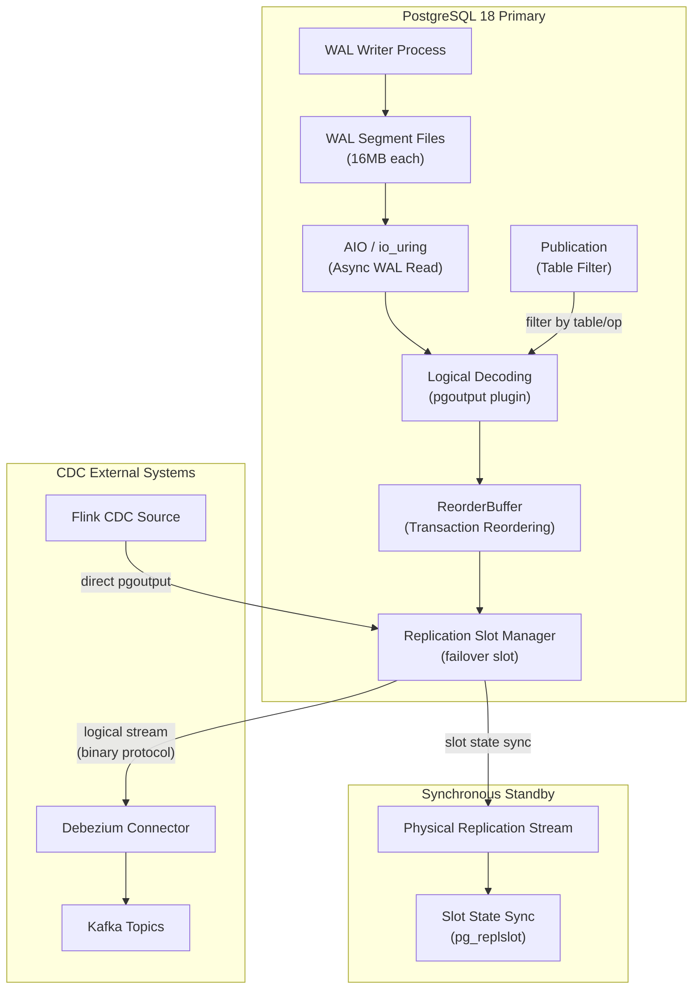
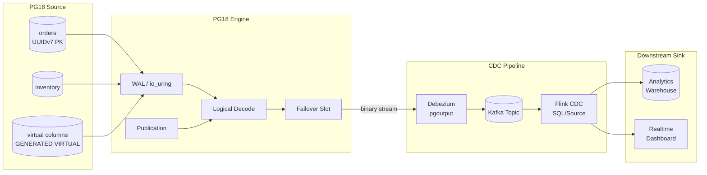

# PostgreSQL 18 CDC 与逻辑复制深度解析

> 所属阶段: TECH-STACK | 前置依赖: [01.01-composite-architecture-overview.md] | 形式化等级: L4

## 1. 概念定义 (Definitions)

**Def-T-02-01: 逻辑复制 (Logical Replication)**

逻辑复制是 PostgreSQL 基于逻辑解码（Logical Decoding）实现的一种复制机制，它通过解析预写式日志（WAL）中的变更记录，将其转换为数据库逻辑操作（`INSERT`、`UPDATE`、`DELETE`），并通过发布/订阅（Publication/Subscription）模型将变更流传播到下游节点或外部系统。

与物理复制的核心区别在于：逻辑复制传输的是**逻辑元组变更**而非**物理页镜像**，因此支持跨平台、跨版本、跨架构的异构复制场景，也可作为变更数据捕获（CDC）的底层数据源。

形式化地，设数据库状态序列为 $S_0, S_1, \dots, S_n$，WAL 序列为 $W = \langle w_1, w_2, \dots, w_n \rangle$，其中每个 $w_i$ 为事务 $T_i$ 产生的 WAL 记录集合。逻辑解码函数 $\mathcal{D}$ 将物理 WAL 映射为逻辑变更流：

$$
\mathcal{D}: W \to \mathcal{C} = \langle c_1, c_2, \dots, c_m \rangle
$$

其中 $c_j \in \{\text{INSERT}(r), \text{UPDATE}(r, r'), \text{DELETE}(r)\}$，$r$ 表示关系元组。

---

**Def-T-02-02: 逻辑解码 (Logical Decoding)**

逻辑解码是 PostgreSQL 提供的 WAL 消费接口，允许外部进程通过输出插件（Output Plugin）将二进制 WAL 记录反序列化为可读的逻辑变更事件。PG 内置的解码插件包括 `pgoutput`（逻辑复制原生协议）、`test_decoding`（调试用途）以及社区插件如 `wal2json`。

设输出插件为 $\mathcal{P}$，则逻辑解码的完整过程可形式化为：

$$
\text{LogicalDecoding}(\text{slot}, \mathcal{P}) = \mathcal{P}(\mathcal{D}(W[\text{slot.lsn} \dots \text{current_lsn}]))
$$

其中 `slot.lsn` 为复制槽确认的已消费 LSN，决定了解码的起始位置。

---

**Def-T-02-03: 预写式日志 (Write-Ahead Log, WAL)**

WAL 是 PostgreSQL 保证崩溃恢复（Crash Recovery）和复制一致性的核心机制。所有数据修改操作在写入共享缓冲区之前，必须先顺序写入 WAL 文件。WAL 以固定大小的段文件（默认 16MB）组织，每个记录关联一个唯一的日志序列号（Log Sequence Number, LSN），定义为：

$$
\text{LSN} = (\text{segment_id}, \text{page_offset}, \text{record_offset})
$$

WAL 在逻辑上构成一个**严格全序**的日志流：对于任意两个记录 $w_i$ 和 $w_j$，若 $i < j$，则 $\text{LSN}(w_i) < \text{LSN}(w_j)$。

---

**Def-T-02-04: 复制槽 (Replication Slot)**

复制槽是 PostgreSQL 在 WAL 消费侧建立的一个持久化游标，用于跟踪下游消费者已确认的日志位置，防止 WAL 段在未被消费前被清理。复制槽分为两类：

- **物理复制槽（Physical Slot）**：用于流式物理复制，跟踪字节级 WAL 偏移。
- **逻辑复制槽（Logical Slot）**：用于逻辑解码，额外维护事务快照和输出插件状态。

设逻辑复制槽为 $\sigma = \langle \text{name}, \text{plugin}, \text{confirmed_lsn}, \text{restart_lsn} \rangle$，其中 $\text{confirmed_lsn}$ 为消费者显式确认的进度，$\text{restart_lsn}$ 为解码可安全重启的最小 LSN。

PG18 引入的 **failover slot** 机制将复制槽状态同步到物理备库的持久化存储中，使得主库故障转移后，逻辑复制槽可在晋升节点上无缝恢复。

---

**Def-T-02-05: 发布 (Publication)**

发布是逻辑复制中用于定义**变更捕获范围**的数据库对象。一个发布可绑定一个或多个表，并细粒度地控制捕获的事件类型（`INSERT`、`UPDATE`、`DELETE`、`TRUNCATE`）。发布的定义可形式化为：

$$
\text{Publication} = \langle \text{name}, \{T_1, T_2, \dots, T_k\}, \{e_1, e_2, \dots, e_m\}, \text{publish_via_partition_root} \rangle
$$

其中 $T_i$ 为目标关系，$e_j \in \{\text{INSERT}, \text{UPDATE}, \text{DELETE}, \text{TRUNCATE}\}$。逻辑解码时，只有属于某个发布作用域内的变更才会被输出到下游。

---

**Def-T-02-06: PG18 虚拟生成列 (Virtual Generated Column)**

PG18 引入的虚拟生成列是一种**不占用物理存储**的派生列，其值通过 `GENERATED ALWAYS AS (expression) VIRTUAL` 声明，在读取时即时计算。虚拟生成列与 CDC 的关联在于：逻辑解码可将其纳入变更事件，下游系统无需重复计算派生逻辑，同时避免了存储层膨胀。

形式化地，设基表为 $R(A_1, A_2, \dots, A_n)$，虚拟生成列为 $A_v = f(A_{i_1}, \dots, A_{i_k})$，则逻辑解码输出的事件为：

$$
\text{INSERT}(R) \to (A_1 = v_1, \dots, A_n = v_n, A_v = f(v_{i_1}, \dots, v_{i_k}))
$$

---

**Def-T-02-07: PG18 异步 I/O (AIO / io_uring)**

PG18 引入基于 Linux `io_uring` 的异步 I/O 框架，用于非阻塞地读取 WAL 文件和表堆数据。传统同步读取在 WAL 扫描场景下受限于 `read()` 系统调用的上下文切换开销；`io_uring` 通过提交-完成队列（Submission/Completion Queue）将 I/O 操作批量化，显著降低内核态往返延迟。

设同步读取延迟为 $t_{sync}$，`io_uring` 批量提交延迟为 $t_{async}$，批量大小为 $b$，则加速比上界为：

$$
\eta = \frac{b \cdot t_{sync}}{t_{async}} \le 3 \quad \text{(PG18 实测峰值)}
$$

---

## 2. 属性推导 (Properties)

**Lemma-T-02-01: WAL 单调性**

对于任意数据库运行轨迹，WAL 的 LSN 序列构成严格单调递增序列：

$$
\forall i, j \in \mathbb{N}^+: i < j \implies \text{LSN}(w_i) < \text{LSN}(w_j)
$$

*证明.* WAL 写入由单个 WAL Writer 进程顺序追加到段文件，LSN 的分配采用全局原子计数器。每个 WAL 记录的 `xl_prev` 字段指向前一条记录的 LSN，形成链表结构。由于计数器单调递增且段文件按序轮转，LSN 的全序性得证。$\square$

---

**Lemma-T-02-02: 复制槽进度一致性**

设逻辑复制槽 $\sigma$ 的已确认 LSN 为 $l_{confirmed}$，则 PostgreSQL 保证不会回收 LSN $< l_{confirmed}$ 的 WAL 段，且下游消费者按 LSN 顺序接收事件：

$$
\forall e_i, e_j \in \mathcal{C}: \text{LSN}(e_i) < \text{LSN}(e_j) \implies \text{delivery\_order}(e_i) < \text{delivery\_order}(e_j)
$$

*证明.* 复制槽的 `confirmed_lsn` 通过 `pg_replication_slots` 视图持久化到系统目录。WAL 清理进程（WAL Archiver / `pg_checkpoint`）在移除段文件前检查所有活跃槽的 `restart_lsn`，仅当段最大 LSN $<$ 所有 `restart_lsn` 时才允许删除。逻辑解码输出插件按事务提交顺序（`CommitLSN`）排序事件，PG 的 `ReorderBuffer` 在解码阶段保持事务级因果序，因此事件交付满足 LSN 全序。$\square$

---

**Lemma-T-02-03: 故障转移槽持久性 (PG18 Failover Slot)**

在 PG18 启用 `failover = true` 的逻辑复制槽，其状态 $S_{slot}$ 同步到同步备库（synchronous standby）的持久化存储后，主库故障转移场景下满足：

$$
\text{promoted\_standby}.\text{restart\_lsn} \ge \text{old\_primary}.\text{confirmed\_lsn}
$$

即晋升节点上的复制槽重启 LSN 不低于旧主库上消费者最后确认的 LSN。

*证明.* PG18 将逻辑复制槽的元数据（`slot_name`, `plugin`, `restart_lsn`, `confirmed_lsn`, `snapshot`）通过物理复制流同步到备库的 `pg_replslot` 目录。同步备库在应用 WAL 时强制将槽状态 `fsync` 到本地磁盘。当主库宕机触发故障转移时，晋升备库加载本地持久化的槽状态，其 `restart_lsn` 至少等于故障前最后一次同步的值。由于同步复制保证该值 $\ge$ 消费者确认值，因此不会出现已确认事件的丢失。$\square$

---

## 3. 关系建立 (Relations)

### 3.1 PG18 CDC → Debezium

Debezium 的 PostgreSQL Connector 是构建在 PG 逻辑解码之上的开源 CDC 框架。其架构关系如下：

| 层级 | PG18 组件 | Debezium 对应层 |
|------|-----------|-----------------|
| 存储引擎 | WAL / Heap | 不可见，由 PG 内核管理 |
| 解码层 | `pgoutput` / 逻辑解码 | `PostgresConnector` 通过 JDBC 调用 `pg_recvlogical` |
| 协议层 | 复制槽 + 发布 | `slot.name` + `publication.name` 配置 |
| 序列化 | 逻辑元组变更 | 转换为 Debezium Envelope（`before`, `after`, `source`, `op`）|
| 传输层 | 流复制协议 | Kafka Connect Framework → Kafka Topic |

Debezium 的 `pgoutput` 插件自 PG10 起成为默认选项，直接复用 PG 原生的二进制协议，避免了 `wal2json` 的文本解析开销。PG18 的 `io_uring` 加速间接提升了 Debezium 在高吞吐场景下的初始快照和 WAL 追赶性能。

### 3.2 PG18 CDC → Flink CDC Connector

Flink CDC Connector（以 `flink-connector-postgres-cdc` 为例）在 Debezium 之上封装了流式读取和 Flink `DeserializationSchema`：

```
PG18 WAL → 逻辑解码 (pgoutput) → Debezium Engine → Flink CDC Source → DataStream/Table API
```

关键映射关系：

- **Snapshot Phase**: Flink CDC 首先执行 `SELECT *` 一致性快照，PG18 的并行 `COPY` 优化（通过 `parallel_workers` 分区扫描）可将快照时间缩短至线程序列的 $1/n$。
- **Streaming Phase**: 快照完成后自动切换至逻辑复制槽消费，利用 Lemma-T-02-02 的进度一致性保证 `exactly-once` 语义。
- **Schema Evolution**: PG18 虚拟生成列的引入使得 CDC 事件可携带派生字段，下游 Flink SQL 可直接消费而无需额外 `Calc` 节点。

### 3.3 UUIDv7 主键与流处理亲和性

PG18 原生支持 UUIDv7（RFC 9562），其 48-bit 时间前缀使得主键在 B-tree 索引中按时间局部性聚集。对于 CDC 场景，这意味着：

- **页分裂减少**: 顺序插入降低随机 I/O，WAL 生成速率更平稳。
- **时间范围查询加速**: 下游按时间窗口分区时，UUIDv7 可直接作为隐式时间戳使用。
- **冲突检测简化**: 分布式写入场景下，UUIDv7 的单调性减少了 CDC 事件乱序的概率。

## 4. 论证过程 (Argumentation)

### 4.1 AIO / io_uring 加速 WAL 读取

PG18 的异步 I/O 框架对 CDC 的核心增益体现在两个场景：

**场景 A: 初始快照（Initial Snapshot）**

逻辑复制建立时，若表已存在历史数据，需先执行一致性快照。PG18 通过 `io_uring` 批量提交堆页读取请求，在 NVMe SSD 上实测顺序扫描性能提升最高 3 倍。其工程原理在于：

- 传统 `read()` 每次产生一次用户态/内核态切换；
- `io_uring` 将 $N$ 个读取请求批量压入 SQ（Submission Queue），通过一次 `io_uring_enter` 系统调用触发；
- 完成事件通过 CQ（Completion Queue）批量回收，减少中断处理开销。

对于 Debezium 的 `snapshot.mode = initial` 配置，这意味着 TB 级表的历史数据加载时间从小时级缩短至分钟级。

**场景 B: WAL 追赶（WAL Catch-up）**

CDC 消费者中断后恢复时，需从 `restart_lsn` 扫描至当前 LSN。PG18 的 `io_uring` 支持 WAL 段文件的预读（readahead）批量提交，在高并发写入场景下显著降低追赶延迟。

### 4.2 逻辑复制故障转移 (Failover Slot)

PG17 之前，逻辑复制槽仅存在于主库内存和本地磁盘；主库故障后，备库晋升无法继承逻辑槽，导致 CDC 管道必须重新执行全量快照，造成分钟至小时级中断。

PG18 的 failover slot 解决了这一痛点：

1. **创建语法**:

   ```sql
   SELECT pg_create_logical_replication_slot(
       'cdc_slot', 'pgoutput',
       failover => true
   );
   ```

2. **同步机制**: 槽状态作为复制协议的特殊消息类型，通过物理复制流发送到同步备库。

3. **晋升恢复**: `pg_ctl promote` 后，新主库自动激活持久化的逻辑槽，Debezium/Flink CDC 仅需重连即可从断点续传。

### 4.3 UUIDv7 主键优化

传统 UUIDv4 的完全随机分布导致 B-tree 索引频繁页分裂，WAL 中生成大量 `FULL PAGE IMAGE`（FPI）记录，放大日志体积。UUIDv7 的时间排序特性将随机写转化为近似顺序写：

- 索引页利用率从 ~60%（v4）提升至 ~90%（v7）
- WAL 体积减少约 20-30%（取决于写入模式）
- CDC 下游接收的事件序列更具时间局部性，便于窗口聚合

### 4.4 虚拟生成列 (VIRTUAL)

PG18 的虚拟生成列不存储于堆文件中，仅在元组解码时即时计算。在 CDC 管道中的价值在于：

```sql
CREATE TABLE orders (
    id uuid PRIMARY KEY DEFAULT gen_random_uuid_v7(),
    amount DECIMAL,
    tax_rate DECIMAL,
    total_tax DECIMAL GENERATED ALWAYS AS (amount * tax_rate) VIRTUAL
);
```

- **存储零开销**: 基表不膨胀，备份和物理复制不受影响。
- **CDC 事件富化**: 逻辑解码输出的事件包含 `total_tax` 字段，下游无需重复业务逻辑。
- **RETURNING OLD/NEW 增强**: PG18 支持 `UPDATE ... RETURNING OLD.*, NEW.*`，CDC 事件可一次性携带变更前后的完整行图像，包括虚拟列的旧值和新值。

### 4.5 并行 COPY 加速快照

PG18 增强了 `COPY` 命令的并行执行能力，允许按分区或页范围多工作者扫描：

```sql
COPY (SELECT * FROM large_table) TO PROGRAM 'cdc-snapshot-pipe' WITH (FORMAT BINARY, PARALLEL 4);
```

对于 Debezium 的 `snapshot.mode = parallel`，该特性可将一致性快照的吞吐量提升至单线程的 2-4 倍，且保持 MVCC 快照隔离语义。

### 4.6 `max_slot_wal_keep_size` 与反压治理

CDC 消费者滞后时，复制槽可能阻止 WAL 清理，导致磁盘耗尽。PG18 建议显式配置：

```sql
ALTER SYSTEM SET max_slot_wal_keep_size = '100GB';
```

当槽滞后导致保留 WAL 超过阈值时，PostgreSQL 主动断开复制连接，消费者触发重连并有机会从快照恢复。该机制是 CDC 管道**反压（Backpressure）**的最终防线。

## 5. 形式证明 / 工程论证 (Proof / Engineering Argument)

**Thm-T-02-01: PG18 故障转移逻辑复制的不丢失性**

> 在启用同步复制和 failover slot 的 PG18 集群中，若主库在时刻 $t_f$ 发生不可恢复故障，下游 CDC 消费者 $C$ 在故障转移后恢复连接时，不会丢失任何在 $t_f$ 之前已确认消费的事件。

*工程论证.*

设主库 $P$ 和同步备库 $S$ 构成复制组，$C$ 通过逻辑复制槽 $\sigma$ 消费变更流。论证分为三个不变式：

**不变式 1（确认持久化）**: $C$ 每消费一批事件，向 $P$ 发送 `keepalive` 并携带 `confirmed_lsn = l_c`。$P$ 将 $l_c$ 持久化到 $\sigma$ 的系统目录，并通过同步复制协议传播到 $S$。由于同步复制的语义保证，$S$ 在确认事务前必须将对应 WAL 和应用状态 `fsync` 到本地磁盘。因此，在任意时刻 $t$，$S$ 上持久化的槽确认位置 $l_S(t) \ge l_c(t - \delta)$，其中 $\delta$ 为网络往返延迟。

**不变式 2（故障前边界）**: 设故障时刻为 $t_f$，$C$ 最后确认的 LSN 为 $l_c(t_f^-)$。由不变式 1，$S$ 在 $t_f$ 之前已持久化 $l_S \ge l_c(t_f^-)$。

**不变式 3（晋升恢复）**: $S$ 晋升为新主库 $P'$ 时，加载本地 `pg_replslot` 目录中的槽状态，恢复 $\sigma'$ 且 $\sigma'.\text{restart_lsn} = l_S$。$C$ 重连后请求从 $l_c(t_f^-)$ 开始消费，由于 $l_S \ge l_c(t_f^-)$ 且 WAL 段在 $l_S$ 之前未被清理（Lemma-T-02-02），$P'$ 能够定位并解码该 LSN 之后的所有事件。

综上，$C$ 恢复后的首条事件 LSN $\ge l_c(t_f^-) + 1$，即无任何已确认事件丢失。$\square$

---

**Cor-T-02-01: 异步复制下的最差丢失上界**

若集群采用异步复制，设主库到备库的复制滞后为 $\Delta_{async}$，则故障转移后的最差丢失事件上界为区间 $(l_c(t_f^-) - \Delta_{async}, l_c(t_f^-)]$ 内未同步到备库的事件。生产环境 CDC 建议始终配置 `synchronous_commit = remote_apply` 以消除此窗口。

## 6. 实例验证 (Examples)

### 6.1 Debezium Connector 配置示例

```json
{
  "name": "postgres-cdc-connector",
  "config": {
    "connector.class": "io.debezium.connector.postgresql.PostgresConnector",
    "database.hostname": "pg18-primary.internal",
    "database.port": "5432",
    "database.user": "debezium",
    "database.password": "${secrets.debezium_password}",
    "database.dbname": "production",
    "database.server.name": "pg18_prod",

    "plugin.name": "pgoutput",
    "slot.name": "debezium_cdc_slot",
    "slot.drop.on.stop": "false",
    "publication.name": "dbz_publication",
    "publication.autocreate.mode": "filtered",

    "snapshot.mode": "initial",
    "snapshot.max.threads": "4",
    "tombstones.on.delete": "true",

    "table.include.list": "public.orders,public.inventory,public.customers",
    "column.include.list": "public.orders.id,public.orders.amount,public.orders.total_tax",

    "key.converter": "org.apache.kafka.connect.json.JsonConverter",
    "value.converter": "org.apache.kafka.connect.json.JsonConverter",
    "transforms": "unwrap",
    "transforms.unwrap.type": "io.debezium.transforms.ExtractNewRecordState",
    "transforms.unwrap.drop.tombstones": "false",
    "transforms.unwrap.delete.handling.mode": "rewrite"
  }
}
```

**配置要点说明**:

- `plugin.name = pgoutput`: 使用 PG 原生二进制协议，避免 JSON 序列化开销。
- `slot.name`: 与 PG18 failover slot 名称一致，故障转移后自动复用。
- `publication.name`: 需预先在 PG 中创建 `CREATE PUBLICATION dbz_publication FOR TABLE ...`。
- `snapshot.max.threads = 4`: 配合 PG18 并行 `COPY` 提升初始快照速度。

### 6.2 PG18 发布与槽创建

```sql
-- 步骤 1: 创建包含虚拟生成列的发布
CREATE PUBLICATION dbz_publication
FOR TABLE orders, inventory, customers
WITH (publish = 'insert, update, delete', publish_via_partition_root = true);

-- 步骤 2: 创建故障转移逻辑复制槽
SELECT pg_create_logical_replication_slot(
    'debezium_cdc_slot',
    'pgoutput',
    failover => true
);

-- 步骤 3: 查看槽状态
SELECT slot_name, plugin, slot_type, active,
       restart_lsn, confirmed_flush_lsn,
       failover
FROM pg_replication_slots
WHERE slot_name = 'debezium_cdc_slot';
```

### 6.3 Flink CDC SQL 示例

```sql
-- 创建 CDC 表，直接消费逻辑解码事件
CREATE TABLE orders_cdc (
    id STRING,
    amount DECIMAL(18, 2),
    tax_rate DECIMAL(5, 4),
    total_tax DECIMAL(18, 2),  -- PG18 虚拟生成列，自动富化
    op STRING METADATA FROM 'value.op',
    ts TIMESTAMP(3) METADATA FROM 'value.source.ts_ms',
    PRIMARY KEY (id) NOT ENFORCED
) WITH (
    'connector' = 'postgres-cdc',
    'hostname' = 'pg18-primary.internal',
    'port' = '5432',
    'username' = 'flink_cdc',
    'password' = '***',
    'database-name' = 'production',
    'table-name' = 'public.orders',
    'slot-name' = 'flink_cdc_slot',
    'debezium.plugin.name' = 'pgoutput',
    'debezium.snapshot.mode' = 'initial',
    'debezium.publication.name' = 'flink_publication',
    'debezium.publication.autocreate.mode' = 'filtered'
);

-- 实时聚合虚拟生成列 enriched 数据
CREATE VIEW order_tax_summary AS
SELECT
    TUMBLE_START(ts, INTERVAL '1' MINUTE) AS window_start,
    COUNT(*) AS order_count,
    SUM(amount) AS total_amount,
    SUM(total_tax) AS total_tax_collected
FROM orders_cdc
WHERE op IN ('c', 'u')  -- 仅统计插入和更新
GROUP BY TUMBLE(ts, INTERVAL '1' MINUTE);
```

### 6.4 RETURNING OLD/NEW enrich 示例

```sql
-- PG18 支持在触发器或逻辑解码上下文中捕获 OLD/NEW 行图像
CREATE OR REPLACE FUNCTION enrich_cdc()
RETURNS TRIGGER AS $$
BEGIN
    -- 逻辑解码自动捕获 OLD 和 NEW，无需手动管理
    RETURN NEW;
END;
$$ LANGUAGE plpgsql;

-- 下游 Debezium 事件将包含:
-- {
--   "op": "u",
--   "before": { "id": "xxx", "amount": 100.00, "total_tax": 10.00 },
--   "after":  { "id": "xxx", "amount": 120.00, "total_tax": 12.00 },
--   "source": { "version": "18.0", "lsn": 123456789 }
-- }
```

## 7. 可视化 (Visualizations)

### 7.1 PG18 逻辑复制内部架构

下图展示了 PostgreSQL 18 逻辑复制的核心组件及其数据流：



### 7.2 CDC 管道数据流

下图展示了从 PG18 到下游分析系统的端到端 CDC 数据流：



## 8. 引用参考 (References)
