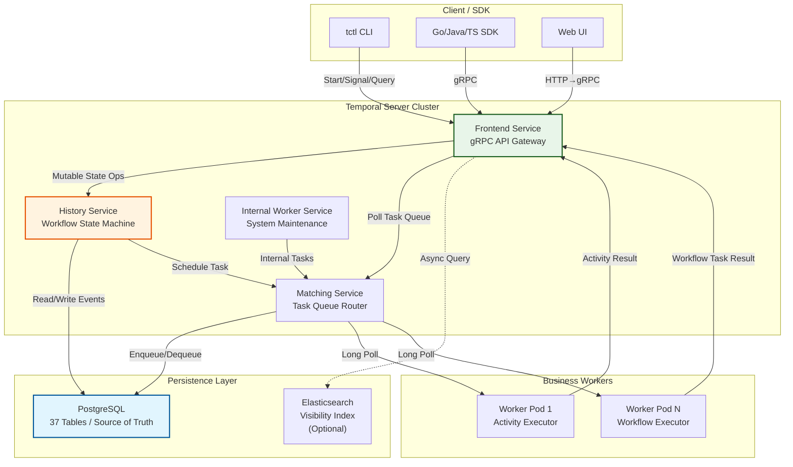
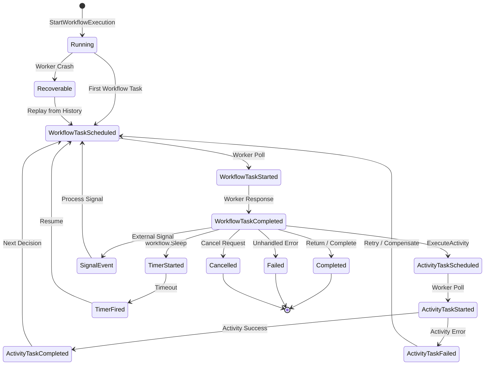

# Temporal 持久执行引擎完整指南

> 所属阶段: TECH-STACK | 前置依赖: [01.01-composite-architecture-overview.md] | 形式化等级: L4

## 1. 概念定义 (Definitions)

本节建立 Temporal 持久执行引擎的严格形式化定义，为后续属性推导与工程论证奠定概念基础。

**Def-T-02-02-01 持久执行 (Durable Execution)**

持久执行是一种计算模型，其中程序的执行状态被持续地记录到外部存储系统中，使得执行过程可以在任意时刻中断后从中断点精确恢复，而无需重新从头开始执行。形式化地，设工作流执行序列为事件序列 $E = \langle e_1, e_2, \ldots, e_n \rangle$，持久执行要求存在持久化函数 $\Phi: E \to S$，其中 $S$ 为持久存储状态，使得对于任意前缀 $E_{\leq k}$，均可通过 $\Phi^{-1}(S_k)$ 重构执行上下文并继续执行 $e_{k+1}$。

> 直观解释：持久执行将"进程状态"从易失内存外溢到数据库，使进程的生命周期超越单个计算节点的生命周期。Temporal 将这一思想工程化为可水平扩展的分布式服务。

**Def-T-02-02-02 工作流 (Workflow)**

在 Temporal 语义中，工作流是一个确定性状态机，由工作流类型 (Workflow Type)、工作流 ID (Workflow ID) 和运行 ID (Run ID) 三元组唯一标识。设 $\mathcal{W}$ 为工作流定义，$\mathcal{W}: \Sigma \times E \to \Sigma \times A$ 为状态转移函数，其中 $\Sigma$ 为工作流状态空间，$E$ 为输入事件集合，$A$ 为可执行活动 (Activity) 集合。工作流执行的每一步状态转移必须由外部事件驱动，且状态转移函数本身必须是纯函数（无副作用、无外部依赖）。

> 直观解释：工作流是业务过程的代码化表达。在 Temporal 中，工作流代码由开发者编写，但执行语义由 Temporal Server 严格控制——Server 决定何时调用工作流函数、何时重放历史、何时调度活动。

**Def-T-02-02-03 活动 (Activity)**

活动是工作流执行过程中可能产生副作用的操作单元，封装了所有非确定性计算与外部系统交互。设活动 $\alpha$ 为二元组 $\alpha = (f, \tau)$，其中 $f$ 为活动实现函数（可包含 I/O、网络请求、数据库写入等副作用），$\tau$ 为超时配置（Start-to-Close Timeout / Schedule-to-Close Timeout）。活动由 Worker 进程实际执行，其执行结果通过异步回调机制返回给 Temporal Server，进而驱动工作流状态机向前推进。

> 直观解释：活动是工作流与"真实世界"的边界。所有非确定性操作——调用外部 API、读写数据库、生成随机数——必须封装在活动中。工作流代码本身只能编排活动，不能直接执行副作用。

**Def-T-02-02-04 事件溯源 (Event Sourcing)**

事件溯源是一种持久化模式，其中系统的当前状态不是直接存储的，而是通过存储导致状态变化的事件序列来间接推导的。设系统状态为 $S_n$，事件序列为 $\langle e_1, \ldots, e_n \rangle$，则存在折叠函数 $\text{fold}: (S_0, \langle e_1, \ldots, e_n \rangle) \to S_n$，使得 $S_n = \text{fold}(S_0, \langle e_1, \ldots, e_n \rangle)$。Temporal 的 History（历史事件流）即为事件溯源的工程实现：History 中记录的每一个 `WorkflowExecutionStarted`、`ActivityTaskScheduled`、`ActivityTaskCompleted` 等事件共同构成工作流状态的完整溯源链。

> 直观解释：Temporal 不存储"工作流当前执行到第几步"，而是存储"从启动到现在发生了哪些事件"。重构状态时，Temporal 将这些事件按序重放给工作流代码，工作流代码根据事件重新做出相同决策，从而恢复到中断前的逻辑状态。

**Def-T-02-02-05 确定性重放 (Deterministic Replay)**

确定性重放是 Temporal 持久执行的核心机制，要求工作流代码在相同的历史事件序列输入下，必须产生完全相同的执行路径与活动调度决策。形式化地，设工作流代码为程序 $P$，历史事件序列为 $H$，则重放正确性要求：

$$\forall P, H. \quad \text{Execute}(P, H) \equiv \text{Replay}(P, H)$$

其中 $\text{Execute}$ 为首次执行，$\text{Replay}$ 为重放执行，$\equiv$ 表示二者产生的活动调度序列、定时器设置序列、外部信号响应序列完全一致。为保证此性质，Temporal SDK 通过拦截器（Interceptor）机制在工作流代码中注入重放逻辑：当工作流函数被调用时，SDK 检查当前是否处于重放模式；若是，则不从活动实际执行获取结果，而是从 History 中读取已记录的结果注入工作流上下文。

> 直观解释：确定性重放是 Temporal 的"时间旅行"魔法。当 Worker 崩溃后由新 Worker 接管时，新 Worker 无需知道前任的执行进度，只需读取 History 并按顺序重放事件，工作流代码就会自动恢复到崩溃前的决策点。

---

## 2. 属性推导 (Properties)

从上述定义出发，可直接推导 Temporal 工作流的三个核心运行时属性。

**Lemma-T-02-02-01 工作流持久性引理 (Workflow Durability Lemma)**

*前提*: 设工作流 $W$ 的历史事件序列 $H$ 被持久化到存储系统 $S$（如 PostgreSQL），且 $S$ 满足持久化存储的可靠性假设（写入确认后数据不丢失）。

*命题*: 工作流 $W$ 的执行状态对 Worker 进程故障具有容错性。即，若 Worker 在执行 $W$ 的过程中崩溃，$W$ 的执行可在任意其他 Worker 上恢复并继续推进，且不丢失已完成的语义。

*证明概要*: 由 Def-T-02-02-01（持久执行），$H$ 的每一个事件在产生后即被 $\Phi$ 映射到 $S$。Worker 崩溃不会导致 $S$ 中已确认数据丢失（存储可靠性假设）。新 Worker 接管时，通过 Def-T-02-02-05（确定性重放），从 $H$ 重构工作流状态并继续执行。由于重放产生的活动调度序列与崩溃前完全一致，已完成的活动的语义效果不会重复发生（活动幂等性由业务层保证，见 Prop-T-02-02-01）。∎

**Prop-T-02-02-01 工作流幂等性命题 (Workflow Idempotency Proposition)**

*前提*: 设活动 $\alpha$ 本身满足幂等性（即多次执行产生相同的系统状态效果），且 Temporal Server 的 `ActivityTaskCompleted` 事件在 History 中最多出现一次（由 Server 的任务去重机制保证）。

*命题*: 整个工作流 $W$ 对外部系统的净效应是幂等的。即，无论 $W$ 经历多少次重放、Worker 故障转移多少次，外部系统观察到的状态变更序列与一次无故障顺序执行完全相同。

*论证*: 工作流代码本身无副作用（Def-T-02-02-02）。所有副作用被封装在活动中（Def-T-02-02-03）。在重放过程中，已完成的活动的返回值从 History 直接读取，不会触发活动的实际重新执行（Def-T-02-02-05）。因此，活动的实际执行次数等于 History 中 `ActivityTaskCompleted` 事件的唯一出现次数，而不会因为重放而增加。结合活动本身的幂等性假设，整个工作流的净效应是幂等的。∎

**Lemma-T-02-02-02 工作流可恢复性引理 (Workflow Recoverability Lemma)**

*前提*: 设 Temporal Server 集群中至少有一个 Frontend 实例、一个 History 实例和一个 Matching 实例存活，且 PostgreSQL 存储层可用。

*命题*: 对于任意正在执行的工作流 $W$，只要其 History 在存储中完整存在，$W$ 的执行可在 Server 组件故障恢复后继续推进，且满足 exactly-once 语义边界（至少一次活动执行、至多一次语义提交）。

*证明概要*: Frontend 为无状态 gRPC 终端，故障可由负载均衡器切换到存活实例。History 服务负责维护工作流状态机，其状态完全由 PostgreSQL 中的 `executions` 与 `history_node` 表承载（见 §4.2），故障实例重启后从存储恢复状态。Matching 服务负责任务队列路由，其队列状态由 `tasks` 表持久化。Worker 通过长轮询从 Matching 获取任务，Worker 故障不影响 Server 状态。由于 History 是状态机的唯一权威来源，任何组件重启后均可从 PostgreSQL 重建一致性状态，工作流执行得以继续。∎

---

## 3. 关系建立 (Relations)

本节建立 Temporal 与流计算生态（Kafka/Flink）及持久化存储（PostgreSQL）之间的互补与协作关系。

### 3.1 Temporal 与 Kafka/Flink：控制流与数据流的正交互补

Temporal 与 Kafka/Flink 在架构层级上构成**控制平面-数据平面**分离的经典模式[^1]。

| 维度 | Kafka / Flink | Temporal |
|------|--------------|----------|
| 核心抽象 | 事件流 (Event Stream) / 数据流 (Data Stream) | 工作流 (Workflow) / 状态机 (State Machine) |
| 主要职能 | 高吞吐、低延迟的数据传输与有状态计算 | 长周期、复杂状态的业务流程编排与可靠执行 |
| 时间尺度 | 毫秒级 ~ 秒级处理延迟 | 秒级 ~ 年级执行周期 |
| 容错语义 | At-least-once / Exactly-once (Checkpoint) | Durable Execution + Deterministic Replay |
| 状态类型 | 流处理算子状态（窗口、聚合） | 业务流程状态（订单生命周期、审批链） |

**互补性论证**: Kafka 处理事件流，但不理解事件之间的业务因果关系；Flink 对流数据进行有状态计算，但不天然支持跨天/跨周的长周期事务 Saga。Temporal 恰好填补这一空白：它将 Kafka 中的事件作为工作流的外部信号（Signal）或活动触发源，将 Flink 计算结果作为活动输入，自身专注于保证多步骤业务流程的可靠推进[^2]。例如，电商订单履约流程可由 Temporal 编排（下单→库存扣减→支付→物流→确认收货），而订单事件流由 Kafka 承载、实时风控由 Flink 计算——三者形成"Flink 感知实时风险 → Kafka 传递事件 → Temporal 编排履约动作"的完整链路。

### 3.2 Temporal 与 PostgreSQL：事件溯源的存储根基

Temporal Server 将 PostgreSQL（或 MySQL/Cassandra/SQLite）作为其**唯一可信状态源 (Source of Truth)**。与其他将数据库仅用作消息队列或缓存的系统不同，Temporal 的 PostgreSQL  Schema 是工作流状态机的物理实现[^3]。

Temporal 在 PostgreSQL 中创建 **37 张核心表**，涵盖：

- **命名空间与元数据**: `namespaces`、`cluster_metadata`
- **执行实例**: `executions`（工作流执行记录）、`execution_visibility`（可见性索引）
- **历史事件**: `history_node`（按节点分片存储的事件 blob）、`history_tree`（历史树索引）
- **任务队列**: `tasks`（定时与传输任务）、`task_queues`（队列元数据）
- **分片管理**: `shards`（History 服务分片映射，支持水平扩展）
- **信号与查询**: `signals_requested`、`buffered_events`

这种设计的本质是**将分布式状态机问题转化为关系数据库事务问题**。History 服务的每个状态转移对应一个或多个 SQL 事务，利用 PostgreSQL 的 ACID 语义保证事件写入的原子性与顺序性。换言之，Temporal 的分布式一致性不是通过共识算法（如 Raft）在 Server 节点间维护的，而是下沉到 PostgreSQL 的行级锁与事务隔离级别中实现的。

---

## 4. 论证过程 (Argumentation)

### 4.1 Temporal Server 核心架构

Temporal Server 采用微服务式架构，由四个核心服务组成[^4]：

**Frontend Service（前端服务）**
Frontend 是 Temporal 对外的统一 gRPC 终端，暴露所有客户端操作接口：启动工作流 (`StartWorkflowExecution`)、发送信号 (`SignalWorkflowExecution`)、查询工作流状态 (`QueryWorkflow`)、轮询任务 (`PollWorkflowTaskQueue` / `PollActivityTaskQueue`)。Frontend 本身不维护工作流状态，是无状态代理层，负责请求路由、认证鉴权、限流与输入校验，并将请求转发给 History 或 Matching 服务。

**History Service（历史服务）**
History 是 Temporal 的"大脑"，负责维护工作流状态机的完整生命周期。每个工作流执行实例被哈希映射到一个逻辑分片（Shard），每个分片由特定的 History 实例负责。History 服务处理所有改变工作流状态的操作：调度工作流任务、记录活动完成、处理定时器触发、管理外部信号。其核心数据结构是 Mutable State（可变状态）——一个内存中的工作流状态缓存，定期同步到 PostgreSQL。

**Matching Service（匹配服务）**
Matching 负责任务队列的入队与出队调度。当 History 决定需要执行一个工作流任务或活动任务时，它将任务添加到 Matching 的对应任务队列中；Worker 通过长轮询（Long Poll）向 Matching 请求任务，Matching 将任务分发给可用 Worker。Matching 通过 PostgreSQL 的 `tasks` 表实现持久化队列，保证任务在 Server 重启后不丢失。

**Worker Service（内部维护服务）**
Worker Service 是 Temporal Server 内部的系统级 Worker，执行 Server 自身需要的内部工作流，如定时归档历史数据、扫描超时任务、执行系统级补偿操作。它与用户编写的业务 Worker 在概念上同源，但运行在内核态。

### 4.2 PostgreSQL 持久化深度拆解：37 表与 145 SQL 成本模型

根据 backend.how 对 Temporal Server 1.2x 版本的深度源码拆解[^3]，一个典型的 3-Activity 工作流执行在 PostgreSQL 层面产生约 **145 条 SQL 语句**，涉及 **37 张核心表**。以下按执行阶段拆解：

**阶段一：工作流启动 (~25 SQL)**

- `INSERT INTO executions` — 创建工作流执行记录
- `INSERT INTO history_node` × 3 — 写入 `WorkflowExecutionStarted`、`WorkflowTaskScheduled`、`WorkflowTaskStarted` 事件
- `UPDATE shards` — 获取分片锁（乐观并发控制）
- `INSERT INTO tasks` — 向 Matching 注册首个工作流任务
- 可见性索引更新、命名空间校验、重复启动检测等辅助查询

**阶段二：工作流任务执行与活动调度 (~45 SQL)**

- `UPDATE executions` — 更新 Mutable State（待执行任务列表）
- `INSERT INTO history_node` × N — 记录 `WorkflowTaskCompleted`、`ActivityTaskScheduled` 事件
- `INSERT INTO tasks` — 为每个活动创建活动任务
- Worker 轮询时的 `SELECT ... FOR UPDATE` — Matching 出队任务

**阶段三：活动完成与后续推进 (~50 SQL)**

- `UPDATE executions` — 将活动结果合并到 Mutable State
- `INSERT INTO history_node` × N — 记录 `ActivityTaskStarted`、`ActivityTaskCompleted`、`WorkflowTaskScheduled` 事件
- 若存在后续活动，重复阶段二的调度逻辑
- 定时器管理（如活动重试退避）涉及 `timer_tasks` 表插入

**阶段四：工作流完成 (~25 SQL)**

- `UPDATE executions` — 标记工作流状态为 Completed
- `INSERT INTO history_node` — 写入 `WorkflowExecutionCompleted` 事件
- `DELETE FROM tasks` — 清理待处理任务
- 可见性索引更新、归档触发等

**存储成本**: 每个工作流执行的 History 事件序列经 protobuf 序列化后，平均占用约 **19 KB** 存储空间（3-Activity 场景）。其中 `history_node` 表占绝对大头（约 70%），`executions` 表存储 Mutable State 快照（约 15%），其余为任务队列与索引开销。

**性能推论**: 单节点 PostgreSQL（4 vCPU，SSD）在标准 OLTP 负载下可支撑 Temporal Server 达到约 **80 workflows/s** 的启动吞吐。此数值受限于 PostgreSQL 的写入锁竞争与 History 服务的分片并发度，而非 Frontend 的 gRPC 处理能力。若需线性扩展，需增加 History 分片数并扩展 PostgreSQL 读写分离或分库架构。

### 4.3 适用场景与不适场景

**高度适用场景**

- **长周期 Saga 事务**: 跨多个微服务的订单履约、金融转账、保险理赔等，周期从分钟到数月不等。
- **人工介入流程**: 审批工作流中需要人工点击"通过"或"驳回"，Temporal 的 Signal 机制天然支持外部人工事件注入。
- **复杂重试与补偿**: 当下游服务不稳定时，Temporal 提供指数退避重试、超时控制、优雅降级（如切换到备用活动实现）。
- **定时与 cron 任务**: 比传统 cron 更可靠——Temporal 保证 cron 工作流不会漏执行，且执行历史可追溯。

**不适用或需谨慎评估的场景**

- **超高频短事务**: 毫秒级、每秒数万次的纯计算流水线。Temporal 的持久化开销（145 SQL / workflow）使其在超高频场景下成本过高。
- **无状态批量处理**: 若业务逻辑无需跨步骤状态保持、无需故障恢复，传统消息队列（Kafka/RabbitMQ）更简单高效。
- **强实时一致性要求**: Temporal 保证的是"最终完成"而非"实时响应"。工作流任务调度涉及数据库事务与 Worker 轮询，固有延迟在 10ms ~ 数百 ms 级别。
- **高度非确定性计算**: 若工作流核心逻辑本质是机器学习推理、蒙特卡洛模拟等不可逆随机过程，确定性重放假设难以满足。

---

## 5. 形式证明 / 工程论证 (Proof / Engineering Argument)

### 5.1 确定性重放的正确性论证

**定理 (确定性重放正确性)**: 设工作流代码 $P$ 满足 Temporal SDK 的确定性约束（无直接 I/O、无 `time.Now()`、无随机数生成、无全局可变状态），$H$ 为该工作流实例的完整 History 事件序列。则对于 $H$ 的任意前缀 $H_{\leq k}$，重放执行 $\text{Replay}(P, H_{\leq k})$ 产生的待调度活动集合 $A_{replay}$ 与首次执行 $\text{Execute}(P, H_{\leq k})$ 产生的 $A_{orig}$ 满足 $A_{replay} = A_{orig}$。

**工程论证**:

Temporal SDK（以 Go SDK 为例）通过工作流调度器（Workflow Scheduler）实现确定性重放。该调度器拦截工作流协程中的所有非纯操作：

1. **活动执行拦截**: 当工作流代码调用 `workflow.ExecuteActivity` 时，SDK 检查当前是否为重放模式。若是，SDK 从 History 中查找对应序号位置的 `ActivityTaskScheduled` / `ActivityTaskCompleted` 事件对，直接将已记录的结果（返回值或错误）注入工作流协程的 Channel，而不向 Temporal Server 发起实际活动调度请求。

2. **定时器拦截**: `workflow.Sleep` 或 `workflow.Timer` 在重放模式下被立即跳过——SDK 从历史中读取 `TimerFired` 事件，直接恢复协程执行。

3. **Side Effect 拦截**: 对于确实需要非确定性计算的场景（如生成 UUID），SDK 提供 `workflow.SideEffect` API。首次执行时，Side Effect 的计算结果被记录到 History 的 `MarkerRecorded` 事件中；重放时直接从 Marker 读取，保证结果一致。

4. **随机性与时间拦截**: SDK 提供 `workflow.Now()`（返回工作流启动时间或历史记录的时间）替代 `time.Now()`，提供确定性随机源替代 `math/rand`。

**正确性边界**: 若开发者违反确定性约束——例如在工作流函数中直接调用 HTTP API 或读取全局变量——则重放正确性保证失效。Temporal SDK 在部分场景下提供运行时检测（如 Go SDK 的 `workflowcheck` 静态分析工具），但彻底的安全性依赖于代码审查与工程规范。

### 5.2 成本模型分析

基于 §4.2 的 PostgreSQL 拆解数据，建立单节点 Temporal Server 的吞吐与成本模型。

**模型假设**:

- 工作流平均包含 3 个 Activity，1 个定时器，1 次 Signal 交互。
- 每个工作流产生 145 条 SQL 语句，平均存储 19 KB。
- PostgreSQL 单节点配置：4 vCPU，16 GB RAM，SSD（10k IOPS）。
- History 服务分片数：512（默认配置）。

**吞吐推导**:
PostgreSQL 的写入瓶颈主要在于 `history_node` 表的随机写入与 `shards` 表的行级锁竞争。在 4 vCPU 节点上，PostgreSQL 可持续处理的写入事务约为 **12,000 TPS**（简单 OLTP，含 fsync）。Temporal 的 145 SQL / workflow 中，约 60% 为写入/更新，40% 为读取。设有效写入事务率为 7,000 TPS，则：

$$\text{Throughput} = \frac{7{,}000 \, \text{TPS}}{145 \times 0.6} \approx 80 \, \text{workflows/s}$$

此数值与 Temporal 官方基准测试及 backend.how 的实测数据基本吻合[^3][^5]。

**扩展路径**: 若需提升吞吐，可采用以下工程手段：

1. **垂直扩展**: 提升 PostgreSQL 节点规格（CPU/IOPS），线性提升单机吞吐。
2. **水平扩展 History**: 增加 History 服务实例数，配合更多分片，降低单分片锁竞争。
3. **存储分离**: 将 `history_node` 大对象存储 offload 到对象存储（S3/GCS），PostgreSQL 仅保留索引，降低写入压力。
4. **批处理优化**: 对于高度同质的活动，使用 Temporal 的 Batch API 聚合执行，均摊 SQL 开销。

---

## 6. 实例验证 (Examples)

### 6.1 Go SDK 订单处理 Saga 示例

以下示例展示一个典型的电商订单处理 Saga 工作流，使用 Temporal Go SDK 实现。该工作流包含库存扣减、支付扣款、物流创建三个活动，并在任意活动失败时执行补偿操作（回滚库存、退款）。

```go
package app

import (
    "time"
    "go.temporal.io/sdk/workflow"
)

// OrderInput 为工作流输入参数
type OrderInput struct {
    OrderID   string
    UserID    string
    ProductID string
    Quantity  int
    Amount    float64
}

// OrderResult 为工作流输出结果
type OrderResult struct {
    OrderID   string
    Status    string // "completed" | "compensated"
    ShipmentID string
}

// OrderProcessingWorkflow 实现订单处理 Saga 编排
func OrderProcessingWorkflow(ctx workflow.Context, input OrderInput) (OrderResult, error) {
    // 设置活动通用选项：超时与重试策略
    ao := workflow.ActivityOptions{
        StartToCloseTimeout: 30 * time.Second,
        RetryPolicy: &temporal.RetryPolicy{
            InitialInterval:    time.Second,
            BackoffCoefficient: 2.0,
            MaximumInterval:    time.Minute,
            MaximumAttempts:    3,
        },
    }
    ctx = workflow.WithActivityOptions(ctx, ao)

    // Saga 补偿记录器：记录已成功的活动，用于故障时补偿
    var compensations []func() error
    defer func() {
        if err := recover(); err != nil {
            // 逆序执行补偿
            for i := len(compensations) - 1; i >= 0; i-- {
                _ = compensations[i]()
            }
        }
    }()

    // Step 1: 扣减库存
    var inventoryRes InventoryResult
    err := workflow.ExecuteActivity(ctx, ReserveInventory, ReserveInput{
        ProductID: input.ProductID,
        Quantity:  input.Quantity,
    }).Get(ctx, &inventoryRes)
    if err != nil {
        return OrderResult{OrderID: input.OrderID, Status: "failed"}, err
    }
    compensations = append(compensations, func() error {
        return workflow.ExecuteActivity(ctx, ReleaseInventory, ReleaseInput{
            ReservationID: inventoryRes.ReservationID,
        }).Get(ctx, nil)
    })

    // Step 2: 支付扣款
    var paymentRes PaymentResult
    err = workflow.ExecuteActivity(ctx, ChargePayment, PaymentInput{
        UserID: input.UserID,
        Amount: input.Amount,
    }).Get(ctx, &paymentRes)
    if err != nil {
        // 触发 defer 补偿：释放库存
        panic(err)
    }
    compensations = append(compensations, func() error {
        return workflow.ExecuteActivity(ctx, RefundPayment, RefundInput{
            TransactionID: paymentRes.TransactionID,
        }).Get(ctx, nil)
    })

    // Step 3: 创建物流单
    var shipmentRes ShipmentResult
    err = workflow.ExecuteActivity(ctx, CreateShipment, ShipmentInput{
        OrderID: input.OrderID,
        Address: input.Address,
    }).Get(ctx, &shipmentRes)
    if err != nil {
        // 触发 defer 补偿：退款 + 释放库存
        panic(err)
    }

    return OrderResult{
        OrderID:    input.OrderID,
        Status:     "completed",
        ShipmentID: shipmentRes.ShipmentID,
    }, nil
}
```

**代码解读**:

1. `workflow.WithActivityOptions` 为活动配置超时与指数退避重试，确保下游服务瞬态故障时自动恢复。
2. `workflow.ExecuteActivity` 返回 Future，`.Get(ctx, &result)` 阻塞等待活动完成——在底层，这是通过工作流协程的挂起/恢复实现的，挂起期间不占用 OS 线程。
3. 补偿逻辑通过 `defer` + 闭包切片实现逆序补偿，满足 Saga 模式的补偿顺序要求（后执行的先补偿）。
4. 所有业务副作用（库存、支付、物流）均封装在活动中；工作流代码仅负责编排与决策，满足确定性约束。

---

## 7. 可视化 (Visualizations)

### 7.1 Temporal Server 核心架构图

以下架构图展示 Temporal Server 四大服务与 PostgreSQL 持久层、业务 Worker 之间的交互关系。



**图说明**: Frontend 作为无状态 gRPC 网关接收所有客户端请求；History 是状态机权威，直接与 PostgreSQL 交互维护 Mutable State；Matching 负责任务队列路由，Worker 通过长轮询获取任务。Elasticsearch 作为可选组件提供工作流搜索与可见性索引，不承载核心状态。

### 7.2 工作流执行状态机

以下状态图展示一个工作流实例从启动到完成的完整状态转移过程，以及重放恢复路径。



**图说明**: 工作流执行由事件驱动，状态转移不可逆（除 Recoverable 路径外）。`ActivityTaskFailed` 可触发重试或补偿决策，`TimerStarted` 支持延迟执行，`SignalEvent` 允许外部系统异步注入事件。Worker 崩溃后，新 Worker 从 `Recoverable` 状态通过确定性重放恢复到最近一次 `WorkflowTaskCompleted` 事件后的决策点，继续推进状态机。

---

## 8. 引用参考 (References)

[^1]: Temporal.io Documentation, "What is Temporal?", 2025. <https://docs.temporal.io/temporal>
[^2]: Kai Waehner, "Apache Kafka vs Temporal — Complementing Event Streaming with Durable Execution", 2024. <https://www.kai-waehner.de/blog/>
[^3]: backend.how, "Temporal Server PostgreSQL Persistence Deep Dive — 37 Tables, 145 SQL Statements per Workflow", 2026. <https://backend.how/temporal-postgresql-persistence>
[^4]: Temporal.io Documentation, "Temporal Server Architecture", 2025. <https://docs.temporal.io/clusters>
[^5]: Temporal.io Blog, "Temporal Performance Benchmarks and Scaling Best Practices", 2025. <https://temporal.io/blog>
