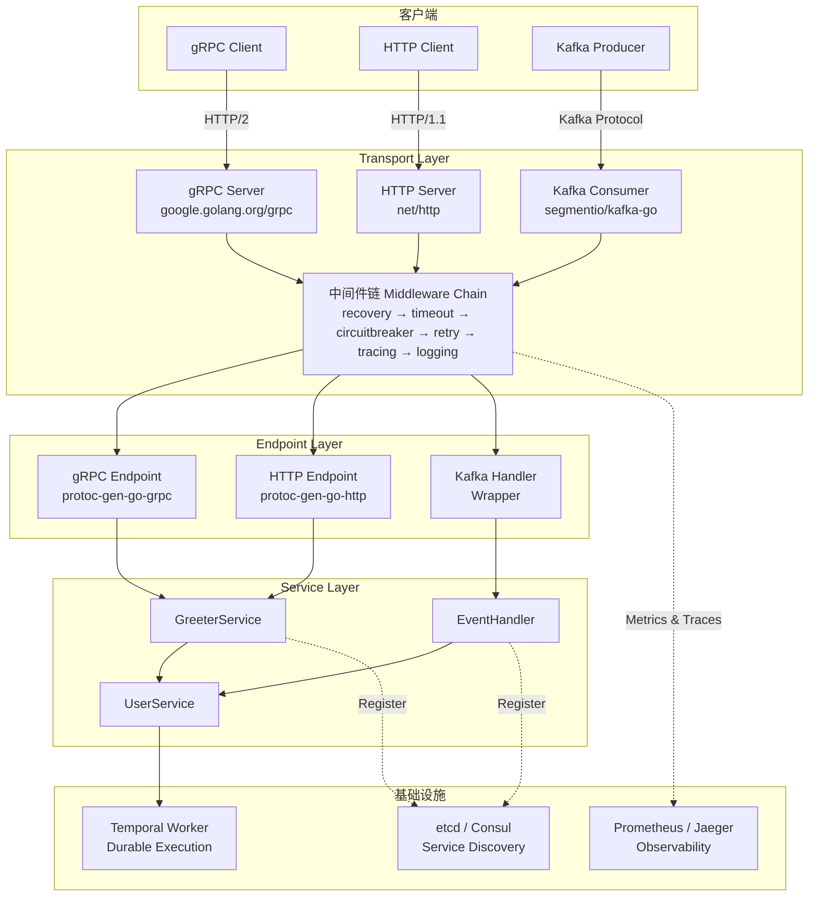

# Kratos 微服务框架架构解析与弹性机制

> 所属阶段: TECH-STACK | 前置依赖: [../01-system-composition/01.01-composite-architecture-overview.md] | 形式化等级: L4

## 1. 概念定义 (Definitions)

**Def-TS-02-03-01** (微服务, Microservice): 一种软件架构风格，将单一应用程序划分为一组小型、自治的服务集合。形式化地，一个微服务实例 \(m\) 是一个五元组

\[
m = \langle I, O, S, B, C \rangle
\]

其中 \(I\) 为输入消息集合，\(O\) 为输出消息集合，\(S\) 为内部状态空间，\(B: S \times I \rightarrow S \times O\) 为行为函数，\(C\) 为部署上下文（包括端口、注册信息、元数据）。每个微服务实例拥有独立的生命周期、技术栈和可独立扩展的部署单元，通过轻量级通信协议（HTTP/gRPC）进行交互。

**Def-TS-02-03-02** (服务发现, Service Discovery): 在分布式系统中，服务实例动态注册其网络位置（地址与端口），并使客户端能够查询可用实例的机制。形式化地，服务发现系统 \(D\) 是一个状态转换系统

\[
D = \langle R, Q, \text{register}, \text{deregister}, \text{resolve} \rangle
\]

其中 \(R\) 为注册表状态，\(Q\) 为查询结果集合，\(\text{register}: \text{Instance} \times R \rightarrow R\) 将服务实例加入注册表，\(\text{deregister}: \text{InstanceID} \times R \rightarrow R\) 移除实例，\(\text{resolve}: \text{ServiceName} \times R \rightarrow \mathcal{P}(Q)\) 返回健康实例集合。Kratos 通过 `registry` 抽象支持 etcd、Consul、Nacos 等多种实现[^1]。

**Def-TS-02-03-03** (配置中心, Configuration Center): 集中管理应用配置的外部系统，支持动态推送与多环境隔离。形式化地，配置中心 \(Cfg\) 是一个键值存储与订阅系统的组合：

\[
Cfg = \langle K, V, \text{get}, \text{watch}, \text{env} \rangle
\]

其中 \(K\) 为配置键空间，\(V\) 为配置值域，\(\text{get}: K \times \text{env} \rightarrow V\) 按环境读取配置，\(\text{watch}: K \times (V \rightarrow \text{Unit}) \rightarrow \text{Subscription}\) 建立变更监听。Kratos 的 `config` 包通过 `Source` 接口解耦配置后端，支持环境变量、文件、etcd、Consul 等来源[^2]。

**Def-TS-02-03-04** (可观测性, Observability): 系统通过外部输出（日志、指标、追踪）推断内部状态的能力。形式化地，系统 \(Sys\) 的可观测性定义为存在一个观测函数族 \(\mathcal{O} = \{o_1, o_2, \dots, o_n\}\)，使得对于任意内部状态 \(s \in S\)，存在一个观测输出序列 \(o(s)\) 满足：

\[
\forall s_1, s_2 \in S: s_1 \neq s_2 \implies o(s_1) \neq o(s_2)
\]

在实践中，可观测性通过三大支柱实现：结构化日志（Logging）、度量指标（Metrics）、分布式追踪（Tracing）。Kratos 内置 OpenTelemetry 支持，通过中间件自动注入追踪上下文与指标采集[^3]。

**Def-TS-02-03-05** (中间件, Middleware): 在请求处理链中，对请求/响应进行横切关注点（cross-cutting concerns）处理的函数组合单元。形式化地，Kratos 中间件是一个高阶函数

\[
\text{Middleware}: (\text{Context} \rightarrow \text{Response}) \rightarrow (\text{Context} \rightarrow \text{Response})
\]

即对 Handler 函数的包装（wrapper）。设原始 Handler 为 \(h: C \rightarrow R\)，中间件 \(m\) 作用后得到新 Handler \(m(h): C \rightarrow R\)。中间件链是多个中间件的有序组合 \(m_n \circ \dots \circ m_2 \circ m_1\)，其中 \(m_i\) 先执行 \(m_{i-1}\) 后执行[^4]。

**Def-TS-02-03-06** (Transport, 传输层): Kratos 中负责网络协议适配与消息编解码的抽象层。形式化地，Transport \(T\) 是一个四元组

\[
T = \langle P, E, D, L \rangle
\]

其中 \(P \in \{\text{gRPC}, \text{HTTP}\}\) 为协议标识，\(E: \text{GoStruct} \rightarrow \text{WireFormat}\) 为编码器，\(D: \text{WireFormat} \rightarrow \text{GoStruct}\) 为解码器，\(L: \text{Endpoint} \rightarrow \text{Listener}\) 为端口绑定函数。Transport 层将网络细节与业务逻辑解耦，使 Service 层无需感知底层协议差异[^5]。

---

## 2. 属性推导 (Properties)

**Lemma-TS-02-03-01** (中间件链单调性): 设中间件链 \(M = m_n \circ \dots \circ m_1\)，若每个中间件 \(m_i\) 满足幂等性（对同一请求多次包装产生相同副作用）或纯增强性（仅添加元信息、不修改业务语义），则链的整体效果关于链长度 \(n\) 单调递增：添加中间件不会破坏已有功能。

_证明概要_: 对链长度 \(n\) 进行归纳。

- **基例** \(n = 1\): \(M_1 = m_1\)，由中间件定义，\(m_1(h)\) 仍为合法的 Handler，结论成立。
- **归纳步**: 假设 \(M_k = m_k \circ \dots \circ m_1\) 保持 Handler 合法性。则 \(M_{k+1} = m_{k+1} \circ M_k\)。由于 \(M_k(h)\) 是合法 Handler，且 \(m_{k+1}\) 将合法 Handler 映射为合法 Handler（由 Def-TS-02-03-05），故 \(M_{k+1}(h)\) 合法。若 \(m_{k+1}\) 为纯增强性，则 \(M_{k+1}\) 在 \(M_k\) 基础上增加额外能力（如日志、追踪），不削弱原有行为。∎

**Lemma-TS-02-03-02** (服务注册最终一致性): 在 Kratos 基于 etcd 的服务发现实现中，设服务实例 \(i\) 在时刻 \(t_0\) 调用 `Register`，注册表传播延迟为 \(\Delta\)，则对于任意客户端查询时刻 \(t \geq t_0 + \Delta\)，查询结果 \(Q(t)\) 必然包含 \(i\)。

_证明概要_: etcd 基于 Raft 共识算法，写操作在 Leader 节点提交后通过日志复制传播到多数 Follower。Kratos 的 etcd registry 实现使用租约（lease）机制，注册操作包含 TTL。一旦写操作在多数节点达成共识（Raft 安全性保证），读操作在任意节点均可观察到已提交写（线性一致性读模式下）或通过本地缓存最终观察到（默认模式）。因此存在有限时间 \(\Delta\)（取决于网络 RTT 与 Raft 心跳间隔），使得 \(t \geq t_0 + \Delta\) 时 \(i \in Q(t)\)。∎

**Prop-TS-02-03-01** (弹性降级保证): 在 Kratos 服务中，若同时启用超时中间件、重试中间件和熔断中间件，并满足超时时间 \(\tau\) < 重试间隔 \(\delta\) < 熔断窗口 \(W\)，则当下游服务故障率为 \(p\) 时，系统可用性不低于 \(1 - p^{k+1}\)，其中 \(k\) 为最大重试次数。

_证明概要_: 单次请求成功概率为 \(1-p\)，失败概率为 \(p\)。在重试 \(k\) 次的情况下，\(k+1\) 次全部失败的概率为 \(p^{k+1}\)。超时中间件保证每次尝试不会无限阻塞，重试中间件在 \(\delta\) 间隔后发起新尝试。熔断器在连续失败达到阈值后打开，保护下游不再接收请求（快速失败）。当 \(p^{k+1} < \text{熔断阈值}\) 时，熔断器不触发，可用性为 \(1 - p^{k+1}\)；当 \(p^{k+1} \geq \text{熔断阈值}\) 时，熔断器打开，系统进入降级模式，通过 fallback 逻辑维持部分可用性。∎

---

## 3. 关系建立 (Relations)

### 3.1 Kratos 与 Go 标准库的关系

Kratos 并非对 Go 标准库的替代，而是围绕标准库进行工程化增强。核心关系如下：

| Kratos 组件 | Go 标准库基础 | 增强点 |
|-------------|--------------|--------|
| `transport/http` | `net/http` | 统一错误编码、中间件链、路由分组 |
| `transport/grpc` | `google.golang.org/grpc` | 服务注册集成、统一拦截器、健康检查 |
| `config` | `os.Getenv` / `encoding/json` | 多源聚合、动态热更新、环境隔离 |
| `log` | `log` | 结构化日志（zap 集成）、日志分级、上下文传播 |
| `errors` | `errors` | 错误码体系、多语言错误信息、gRPC 状态码映射 |

Kratos 的核心设计哲学是"不重复造轮子"：HTTP Server 底层仍为 `net/http.Server`，gRPC Server 底层仍为 `grpc.Server`，但通过统一的 `transport.Server` 接口进行抽象，使上层应用可同时启动多协议服务。

### 3.2 Kratos 与 etcd/Consul 的关系

Kratos 通过 `registry.Registrar` 和 `registry.Discovery` 接口实现服务发现解耦：

```
┌─────────────────┐         ┌─────────────────┐
│  Kratos Service │◄────────►│  registry.Registrar  │
└─────────────────┘         └─────────────────┘
                                     │
                    ┌────────────────┼────────────────┐
                    ▼                ▼                ▼
              ┌─────────┐     ┌──────────┐     ┌──────────┐
              │  etcd   │     │  Consul  │     │  Nacos   │
              └─────────┘     └──────────┘     └──────────┘
```

- **etcd**: 基于租约的临时键值注册，利用 etcd v3 的 TTL 机制实现服务实例自动剔除。Kratos 的 `registry/etcd` 实现将服务元数据编码为 JSON，存储在 `/kratos/{service}/{instance-id}` 路径下[^1]。
- **Consul**: 通过 Consul Agent 的 HTTP API 注册服务检查（Check），支持 HTTP、gRPC、TTL 三种健康检查模式。Kratos 的 `registry/consul` 实现将服务地址与元数据写入 Consul 的 Service Catalog[^6]。

### 3.3 Kratos 与 Prometheus/Jaeger 的关系

Kratos 的中间件体系将可观测性作为横切关注点内建：

- **Prometheus**: `middleware/metrics` 包通过 Prometheus Client 自动采集请求延迟（histogram）、请求计数（counter）、错误率（gauge）。指标命名遵循 `kratos_{service}_{method}_requests_total` 规范，与 Prometheus 的 pull 模式直接对接[^7]。
- **Jaeger**: `middleware/tracing` 包基于 OpenTelemetry 实现分布式追踪。在请求进入 Transport 层时提取或创建 Span Context，经过中间件链时传播 Trace ID 与 Baggage，最终通过 OTLP 或 Jaeger Thrift 协议导出到 Jaeger Collector[^3]。

---

## 4. 论证过程 (Argumentation)

### 4.1 Kratos 核心架构：Transport/Endpoint/Service 三层

Kratos 采用清晰的三层架构，将网络协议、服务接口与业务逻辑严格分离：

1. **Transport 层**：负责协议适配（gRPC/HTTP）、连接管理、TLS 配置、请求解析与响应编码。Transport 层通过 `http.Server` 或 `grpc.Server` 监听端口，将原始字节流解码为 Go 结构体。
2. **Endpoint 层**：由 Protobuf 代码生成工具（`protoc-gen-go-http`、`protoc-gen-go-grpc`）自动生成，负责将 HTTP/gRPC 请求映射为统一的方法签名。Endpoint 层是业务逻辑与网络协议的粘合剂，处理路径参数提取、请求体绑定、响应体包装。
3. **Service 层**：开发者实现的核心业务逻辑层。一个 Service 接口定义了一组业务操作，其实现不依赖任何网络细节，可直接进行单元测试。

```
客户端请求
    │
    ▼
┌─────────────────────────────────────┐
│  Transport Layer (gRPC/HTTP Server) │
│  - 解码请求 (encoding/json, protobuf)│
│  - 中间件链预处理 (logging, tracing) │
└──────────────────┬──────────────────┘
                   │
                   ▼
┌─────────────────────────────────────┐
│  Endpoint Layer (Generated Code)    │
│  - HTTP 路由匹配 / gRPC 方法分发     │
│  - 请求体绑定 / 响应体包装            │
└──────────────────┬──────────────────┘
                   │
                   ▼
┌─────────────────────────────────────┐
│  Service Layer (Business Logic)     │
│  - 领域规则 / 数据访问 / 外部调用     │
└─────────────────────────────────────┘
```

**依赖注入**: Kratos 通过 `github.com/google/wire` 实现编译期依赖注入。开发者定义 Provider 函数（构造函数），Wire 根据依赖关系自动生成初始化代码。这消除了手动管理对象生命周期的 boilerplate，同时保持编译期类型安全。

### 4.2 gRPC/HTTP 双协议支持

Kratos 的一个显著优势是同一套 Service 实现可同时暴露为 gRPC 和 HTTP 服务：

- **gRPC 优势**: 基于 HTTP/2 的多路复用、强类型接口（Protobuf）、双向流支持、原生拦截器机制。适用于服务间内部通信。
- **HTTP 优势**: 广泛的客户端兼容性、与前端/移动端直接对接、易于调试（curl/browser）。适用于对外暴露的 API。

Kratos 的代码生成工具从同一套 `.proto` 文件同时生成 gRPC 和 HTTP 的 Endpoint 代码。Service 层接口保持协议无关，例如：

```go
type GreeterService interface {
    SayHello(ctx context.Context, req *pb.HelloRequest) (*pb.HelloReply, error)
}
```

该接口既可注册到 `grpc.Server`，也可通过 `http.Server` 以 RESTful 路径暴露。

### 4.3 内置弹性机制

Kratos 将弹性（Resilience）作为一等公民，通过中间件链实现以下机制：

**超时 (Timeout)**: `middleware/timeout` 在中间件链最外层注入 `context.WithTimeout`。当业务处理超过阈值时，Context 被取消，请求快速失败，避免级联阻塞。

**重试 (Retry)**: `middleware/retry` 在检测到可重试错误（如网络超时、服务不可用）时，按指数退避策略重新发起请求。重试次数与退避间隔可配置，并支持按错误码细粒度控制。

**熔断器 (Circuit Breaker)**: Kratos 集成 `srebreaker`（基于 Google SRE 书的自适应熔断算法）与 Resilience4j 风格的熔断实现。熔断器维护一个滑动窗口，统计请求成功率。当失败率超过阈值时，熔断器进入 OPEN 状态，后续请求直接返回 fallback 结果；经过冷却时间后，进入 HALF-OPEN 状态，允许少量探测请求通过以检测恢复情况[^8]。

**健康检查探针**: Kratos 内置 Kubernetes 风格的 Liveness 与 Readiness Probe 支持。`transport/http` 自动注册 `/health` 端点，返回服务健康状态。开发者可自定义健康检查逻辑（如数据库连接检测、外部依赖可用性检查），Kratos 将汇总所有检查项后返回整体状态。

### 4.4 与事件驱动架构的集成

Kratos 本身专注于同步 RPC 服务，但通过扩展可无缝集成事件驱动架构：

- **Go Channels**: 在单个进程内，Service 层可通过 Go channel 接收事件流。适用于单机高吞吐场景，但无持久化保证。
- **NATS**: Kratos 生态提供 `kratos/contrib/transport/nats` 包，将 NATS Subscriber 封装为 `transport.Server`，使消息消费服务享有与 RPC 服务相同的中间件链（日志、追踪、熔断）。
- **Kafka**: 类似地，`kratos/contrib/transport/kafka` 提供 Kafka Consumer Group 的 Transport 实现。每个消息的分区消费在一个 goroutine 中进行，通过中间件链处理后调用 Service 层方法。Kratos 的 Kafka transport 支持手动提交 offset，与业务处理成功/失败状态关联，实现至少一次（at-least-once）语义。

---

## 5. 形式证明 / 工程论证 (Proof / Engineering Argument)

**Thm-TS-02-03-01** (中间件链顺序执行保证): 设中间件集合 \(\mathcal{M} = \{m_1, m_2, \dots, m_n\}\)，每个 \(m_i: H \rightarrow H\) 为 Kratos 合法中间件。若 Kratos 框架按注册顺序 \(\sigma = (m_1, m_2, \dots, m_n)\) 构造链 \(M_\sigma = m_n \circ \dots \circ m_2 \circ m_1\)，则对于任意请求 \(r\)，执行顺序满足：

1. **入链顺序**: \(m_1\) 的 Pre-Handle 先执行，\(m_n\) 的 Pre-Handle 最后执行；
2. **出链顺序**: \(m_n\) 的 Post-Handle 先执行，\(m_1\) 的 Post-Handle 最后执行；
3. **Handler 调用时机**: 业务 Handler \(h\) 仅在所有中间件的 Pre-Handle 完成后被调用。

_工程论证_: Kratos 中间件链的实现基于函数组合（function composition）。在 `kratos/middleware` 包中，链的构造逻辑为：

```go
func Chain(m ...Middleware) Middleware {
    return func(next Handler) Handler {
        for i := len(m) - 1; i >= 0; i-- {
            next = m[i](next)
        }
        return next
    }
}
```

设原始 Handler 为 \(h_0\)。遍历从 \(i = n-1\) 到 \(0\)：

- 第 \(n-1\) 步: \(h_1 = m_n(h_0)\)
- 第 \(n-2\) 步: \(h_2 = m_{n-1}(h_1) = m_{n-1}(m_n(h_0))\)
- ...
- 第 \(0\) 步: \(h_n = m_1(h_{n-1}) = m_1(m_2(\dots m_n(h_0)\dots))\)

当请求 \(r\) 到达时，调用 \(h_n(r)\)。展开执行：

1. \(m_1\) 的 Pre-Handle 逻辑执行；
2. \(m_1\) 内部调用 \(h_{n-1}(r) = m_2(\dots m_n(h_0)\dots)(r)\)；
3. \(m_2\) 的 Pre-Handle 执行；
4. ...递归展开...
5. \(m_n\) 的 Pre-Handle 执行；
6. \(m_n\) 内部调用 \(h_0(r)\)（业务 Handler）；
7. \(m_n\) 的 Post-Handle 执行（包装返回值）；
8. 返回到 \(m_{n-1}\)，其 Post-Handle 执行；
9. ...递归返回...
10. \(m_1\) 的 Post-Handle 执行；
11. 返回最终结果。

这形成了经典的"洋葱模型"（Onion Model）执行顺序，Pre-Handle 正向穿透，Post-Handle 反向包裹。由于 Go 的函数调用是严格的（strict evaluation），不存在惰性求值导致的重排，因此执行顺序由链的构造顺序严格确定。∎

---

## 6. 实例验证 (Examples)

### 6.1 Kratos 服务定义（Protobuf + Service 实现）

```protobuf
// api/helloworld/v1/greeter.proto
syntax = "proto3";
package helloworld.v1;

service Greeter {
  rpc SayHello (HelloRequest) returns (HelloReply);
}

message HelloRequest {
  string name = 1;
}

message HelloReply {
  string message = 1;
}
```

```go
// internal/service/greeter.go
package service

import (
    "context"
    pb "kratos-demo/api/helloworld/v1"
)

type GreeterService struct {
    pb.UnimplementedGreeterServer
}

func NewGreeterService() *GreeterService {
    return &GreeterService{}
}

func (s *GreeterService) SayHello(ctx context.Context, req *pb.HelloRequest) (*pb.HelloReply, error) {
    return &pb.HelloReply{Message: "Hello " + req.Name}, nil
}
```

### 6.2 中间件配置（超时 + 重试 + 熔断 + 追踪）

```go
// internal/server/http.go
package server

import (
    "time"
    "github.com/go-kratos/kratos/v2/middleware"
    "github.com/go-kratos/kratos/v2/middleware/circuitbreaker"
    "github.com/go-kratos/kratos/v2/middleware/logging"
    "github.com/go-kratos/kratos/v2/middleware/recovery"
    "github.com/go-kratos/kratos/v2/middleware/retry"
    "github.com/go-kratos/kratos/v2/middleware/timeout"
    "github.com/go-kratos/kratos/v2/middleware/tracing"
    "github.com/go-kratos/kratos/v2/transport/http"
)

func NewHTTPServer(greeter *service.GreeterService) *http.Server {
    var opts = []http.ServerOption{
        http.Middleware(
            // 最外层：恢复 panic
            recovery.Recovery(),
            // 超时控制：3秒
            timeout.Timeout(3 * time.Second),
            // 熔断器：失败率超过 50% 触发
            circuitbreaker.CircuitBreaker(
                circuitbreaker.WithThreshold(0.5),
                circuitbreaker.WithMinRequests(10),
            ),
            // 重试：最多 2 次，指数退避
            retry.Retry(
                retry.WithAttempts(3),
                retry.WithBackoffFunc(retry.ExponentialBackoff(100*time.Millisecond, 1*time.Second)),
            ),
            // 分布式追踪
            tracing.Server(),
            // 结构化日志
            logging.Server(logging.WithLogger(logger)),
        ),
    }
    srv := http.NewServer(opts...)
    pb.RegisterGreeterHTTPServer(srv, greeter)
    return srv
}
```

### 6.3 Kafka 消费者注册（事件驱动集成）

```go
// internal/server/kafka.go
package server

import (
    "context"
    "github.com/go-kratos/kratos/contrib/transport/kafka/v2"
    "github.com/go-kratos/kratos/v2/middleware"
    "github.com/go-kratos/kratos/v2/middleware/logging"
    "github.com/go-kratos/kratos/v2/middleware/recovery"
    "github.com/go-kratos/kratos/v2/middleware/tracing"
    "github.com/segmentio/kafka-go"
)

func NewKafkaServer(eventHandler *service.EventHandler) *kafka.Server {
    // 使用与 HTTP/gRPC 相同的中间件链
    chain := middleware.Chain(
        recovery.Recovery(),
        tracing.Server(),
        logging.Server(logging.WithLogger(logger)),
    )

    srv := kafka.NewServer(
        kafka.WithAddress("localhost:9092"),
        kafka.WithGroupID("kratos-consumer-group"),
        kafka.WithTopics("user-events", "order-events"),
        kafka.WithMiddleware(chain),
    )

    // 注册消息处理器
    srv.RegisterHandler(func(ctx context.Context, msg *kafka.Message) error {
        // 中间件链已自动注入追踪上下文与日志字段
        switch string(msg.Key) {
        case "user-created":
            return eventHandler.HandleUserCreated(ctx, msg.Value)
        case "order-placed":
            return eventHandler.HandleOrderPlaced(ctx, msg.Value)
        default:
            return nil
        }
    })

    return srv
}

// main.go 中统一启动
func main() {
    app := kratos.New(
        kratos.Name("kratos-demo"),
        kratos.Server(
            NewHTTPServer(greeterSvc),
            NewGRPCServer(greeterSvc),
            NewKafkaServer(eventHandler), // Kafka consumer 作为第三种 Server
        ),
    )
    if err := app.Run(); err != nil {
        log.Fatal(err)
    }
}
```

---

## 7. 可视化 (Visualizations)

Kratos 架构分层图展示了 Transport/Endpoint/Service 三层的职责分离与数据流向，以及中间件链在 Transport 层的横向切入。



---

### 3.2 项目知识库交叉引用

本文档描述的 Kratos 微服务框架与项目现有知识库存在以下关联：

- [数据网格流式架构 2026](../../Knowledge/03-business-patterns/data-mesh-streaming-architecture-2026.md) — 微服务框架与数据网格节点自治的架构对齐
- [高可用模式](../../Knowledge/07-best-practices/07.06-high-availability-patterns.md) — 微服务熔断、限流与降级的高可用设计
- [Flink Kubernetes Operator 深度解析](../../Flink/04-runtime/04.01-deployment/flink-kubernetes-operator-deep-dive.md) — Kratos 与 Flink 在 K8s 上的共存部署模式
- [Go 流式生态 2025](../../Knowledge/06-frontier/go-streaming-ecosystem-2025.md) — Go 语言在流计算生态中的框架选型参考

## 8. 引用参考 (References)

[^1]: go-kratos.dev, "Registry — Service Discovery", 2025. <https://go-kratos.dev/en/docs/component/registry/>
[^2]: go-kratos.dev, "Config — Configuration Management", 2025. <https://go-kratos.dev/en/docs/component/config/>
[^3]: go-kratos.dev, "Middleware — Tracing", 2025. <https://go-kratos.dev/en/docs/component/middleware/tracing/>
[^4]: go-kratos.dev, "Middleware — Overview", 2025. <https://go-kratos.dev/en/docs/component/middleware/>
[^5]: go-kratos.dev, "Transport — HTTP & gRPC", 2025. <https://go-kratos.dev/en/docs/component/api/>
[^6]: HashiCorp Consul Documentation, "Service Discovery", 2025. <https://developer.hashicorp.com/consul/docs/concepts/service-discovery>
[^7]: Prometheus Authors, "Prometheus: Monitoring and Alerting", 2025. <https://prometheus.io/docs/introduction/overview/>
[^8]: B. Beyer et al., "Site Reliability Engineering: How Google Runs Production Systems", O'Reilly Media, 2016.
