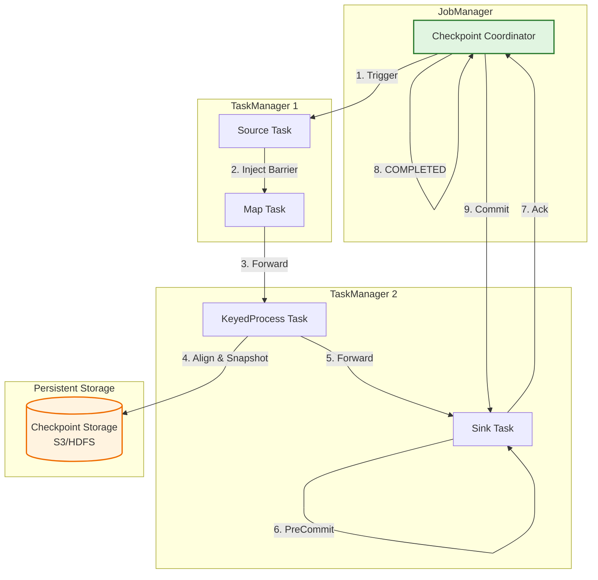
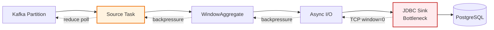

# Apache Flink 流处理容错机制深度解析

> 所属阶段: TECH-STACK | 前置依赖: [01.01-composite-architecture-overview.md] | 形式化等级: L5

## 1. 概念定义 (Definitions)

**Def-T-02-04-01** [Checkpoint — 分布式一致性快照]
Checkpoint 是 Flink 通过分布式快照算法周期性捕获的**全局一致状态集合**，包含有状态算子的本地状态 \(S_i\) 与数据源的读取偏移 \(O_j\)。形式化地，设作业图 \(G = (V, E)\)，一次成功的 Checkpoint \(C_k\) 为：
\[C_k = \left(\bigcup_{v \in V} S_v^{(k)}, \bigcup_{s \in \text{Sources}} O_s^{(k)}\right)\]
其中所有 \(S_v^{(k)}\) 与 \(O_s^{(k)}\) 对应于同一逻辑时间点——即 barrier \(b_k\) 到达各算子时的瞬时状态。

---

**Def-T-02-04-02** [Barrier — 检查点屏障]
Barrier 是 Checkpoint Coordinator 向 Source 注入的**特殊控制事件**，随数据流传播，将无限数据流切分为 pre-checkpoint 与 post-checkpoint 两个逻辑区间。设数据流为 \(R = (r_1, r_2, \dots)\)，注入 \(b_k\) 后：
\[R = R_{< b_k} \oplus b_k \oplus R_{> b_k}\]
\(R_{< b_k}\) 的处理结果纳入当前快照，\(R_{> b_k}\) 仅对后续快照可见。

---

**Def-T-02-04-03** [Exactly-Once 语义 — 端到端精确一次处理]
Exactly-Once 语义要求每条输入记录在端到端路径上被精确处理一次，且结果对外部系统可见恰好一次。需在三层同时满足：

1. **引擎层**：内部状态转换不因故障恢复而重复应用；
2. **Source 层**：支持可重复读取（如 Kafka offset rewind）；
3. **Sink 层**：支持幂等写入或两阶段提交（2PC）。

形式化地，设输入记录集为 \(I\)，处理函数为 \(f\)。Exactly-Once 要求：
\[\forall r \in I, \quad \text{可见输出}\{f(r)\} = 1\]

---

**Def-T-02-04-04** [异步状态快照 — Asynchronous State Snapshot]
异步状态快照是 barrier 到达后执行的**非阻塞状态持久化机制**。通过"拷贝-on-写"或日志结构技术创建状态的轻量视图，随后异步写入外部存储（HDFS/S3），不阻塞正常处理。设状态为 \(S(t)\)，在 \(t_c\) 时刻：

1. **同步阶段**：\(\Delta t_{sync} \approx 0\)，建立状态引用；
2. **异步阶段**：将 \(S(t_c)\) 序列化写入持久存储，期间正常处理持续。

---

**Def-T-02-04-05** [背压 (Backpressure) — 反压传播机制]
背压是**下游消费速率低于上游生产速率时，自下游向上游逐级传播的流量控制信号**。Flink 通过 Netty 水位线机制实现：当本地缓冲池耗尽时，网络层停止读取 TCP 数据，导致上游发送窗口阻塞。设算子 \(v_i\) 输出速率为 \(\lambda_{out}^{(i)}\)，下游 \(v_j\) 处理速率为 \(\lambda_{proc}^{(j)}\)，若 \(\lambda_{out}^{(i)} > \lambda_{proc}^{(j)}\)，则背压沿 \(v_j \to v_i\) 传播，直至稳态 \(\lambda_{out}^{(i)} = \min \lambda_{proc}^{(j)}\)。

---

**Def-T-02-04-06** [RocksDB 增量检查点 — RocksDB Incremental Checkpoint]
RocksDB 增量检查点**仅持久化自上次检查点以来发生变化的状态数据（新增 SST 文件）**。设完整检查点包含 SST 集合 \(\mathcal{F}_{full}\)，第 \(k\) 次增量检查点仅需上传：
\[\mathcal{F}_{\Delta}^{(k)} = \{f \in \mathcal{F}^{(k)} \mid f \notin \mathcal{F}^{(k-1)} \lor \text{modified}(f)\}\]
显著降低 I/O 与网络开销，适用于 TB 级大状态场景。

## 2. 属性推导 (Properties)

**Lemma-T-02-04-01** [Checkpoint 一致性]
设所有 Source 算子在 \(t_0\) 收到 barrier \(b_k\)，且所有通道满足 FIFO。则所有算子完成对齐后生成的 Checkpoint \(C_k\) 是**因果一致（causally consistent）**的。

_推导概要_：由 Chandy-Lamport 分布式快照算法[^1]，若 barrier 沿所有通道传播且算子仅在收到全部输入通道的 \(b_k\) 后才向下游转发，则快照对应于分布式系统的**一致割（consistent cut）**。此割上不存在从 post-checkpoint 到 pre-checkpoint 的因果消息，故 \(C_k\) 为合法全局状态。

---

**Lemma-T-02-04-02** [Barrier 对齐的语义保证]
在 exactly-once 模式下，具有 \(m \geq 1\) 个输入通道的算子 \(v\) 必须**从所有 \(m\) 个输入通道都收到 \(b_k\)**后，才能将 \(b_k\) 向下游转发，并将 \(S_v\) 纳入 \(C_k\)。

_推导概要_：假设仅收到部分 \(b_k\) 即转发，则某条 lagging 通道上的 pre-checkpoint 记录 \(r\) 会在快照后被处理。若此时故障回滚到 \(C_k\)，\(r\) 将丢失（源端 offset 已前进但结果未纳入快照），违反 at-least-once。全对齐策略确保所有 pre-checkpoint 结果反映在状态中，所有 post-checkpoint 记录不被重复处理。

## 3. 关系建立 (Relations)

### 3.1 Flink Checkpoint 与 Kafka Offset

在 Flink + Kafka exactly-once 链路中，Kafka Consumer offset 与 Flink Checkpoint 构成**耦合事务**：

- Kafka Source 将各 partition 的当前 offset \(o_p\) 作为算子状态，随 Checkpoint 持久化到外部存储；
- 作业从 \(C_k\) 恢复时，Source 读取 \(\{o_p^{(k)}\}\) 并执行 `seek()` 重置消费位点；
- Checkpoint 的成功提交等同于 offset 的原子提交——两者同时推进或同时回退。

> **关键点**：Flink 禁用 Kafka 自动提交，offset 存储在 Checkpoint 中而非 `__consumer_offsets`，确保即使 Kafka broker 故障也能从精确位点恢复。

### 3.2 Flink Checkpoint 与 PostgreSQL 复制槽进度

在 Flink CDC 场景（Debezium Source + PostgreSQL 逻辑解码）中：

- Flink 将 PostgreSQL 的 **LSN（Log Sequence Number）**作为算子状态保存到 Checkpoint；
- 仅当 Checkpoint 成功后，Flink 才向 PG 发送 `flush_lsn` 确认，允许回收早于该 LSN 的 WAL 段；
- Checkpoint 充当 PG 复制进度的"分布式事务协调器"——防止数据丢失与 WAL 膨胀。

## 4. 论证过程 (Argumentation)

### 4.1 Chandy-Lamport 分布式快照算法在 Flink 中的映射

Flink Checkpoint 直接源于 Chandy-Lamport 算法[^1]：

| Chandy-Lamport | Flink 实现 |
|----------------|-----------|
| 进程 (Process) | TaskManager 上的 Task |
| 通道 (Channel) | NetworkBuffer 构成的 TCP 连接 |
| 标记 (Marker) | Checkpoint Barrier |
| 局部快照 | 算子状态（KeyedState / OperatorState） |
| 全局快照 | Completed Checkpoint |

Flink 的关键工程优化：**异步快照**（避免阻塞数据流）与**增量快照**（仅上传变更 SST）。

### 4.2 Barrier 注入与对齐流程

1. **触发**：Checkpoint Coordinator 向所有 Source 发送 `TriggerCheckpoint`；
2. **注入**：Source 在数据流中插入 \(b_k\)，冻结当前 offset/LSN；
3. **传播**：\(b_k\) 随数据流经过 Netty 到达下游输入缓冲区；
4. **对齐**：多输入算子缓存先到达通道的 post-barrier 数据，等待所有通道 \(b_k\) 到达；
5. **快照**：对齐后触发本地状态快照，异步上传，上报 state handle；
6. **完成**：所有算子上报后，Coordinator 标记 Checkpoint **COMPLETED**。

> **对齐开销**：反压或数据倾斜场景下，某通道严重滞后会导致其他通道 post-barrier 数据在缓冲区堆积，引发 OOM。Flink 1.11+ 的 **Unaligned Checkpoint** 将 in-flight 数据纳入快照，避免对齐等待。

### 4.3 状态后端选型

| 状态后端 | 存储介质 | 快照方式 | 适用规模 | 延迟 |
|---------|---------|---------|---------|------|
| MemoryStateBackend | JVM Heap | 同步全量 | < 数 MB | 极低 |
| FsStateBackend | JVM Heap + FS | 异步全量 | < 数十 GB | 低 |
| RocksDBStateBackend | 本地 RocksDB | 异步增量 | TB 级 | 中等 |

**RocksDBStateBackend** 将状态存储在堆外磁盘，不受 JVM GC 影响，增量检查点使其成为**大状态生产环境首选**。

### 4.4 Exactly-Once vs At-Least-Once

Flink 引擎内部天然支持 exactly-once。端到端 exactly-once 需要 Source 与 Sink 协同：

| 语义 | Source 要求 | Sink 要求 |
|-----|-----------|----------|
| At-Least-Once | 支持 replay | 幂等或重复可接受 |
| Exactly-Once | 支持 seek/rewind | 两阶段提交（2PC）或幂等 |

Flink 的 **TwoPhaseCommitSinkFunction** 提供 2PC 标准框架：`preCommit` 在 Checkpoint 边界刷写预提交状态；Checkpoint 全局完成后 `commit` 使其对外可见；Checkpoint 失败则 `abort`。

### 4.5 背压传播机制

Flink 背压基于 **Credit-based 流控**与 **Netty 水位线**：

1. 下游向上游发送 credit（可接收数据量）；
2. 下游缓冲区满时 credit 降为 0；
3. 上游 Netty 检测到对端不可写，`channel.write()` 阻塞；
4. 上游算子堆积记录，耗尽自身 credit，继续向上游传播。

关键监控指标：`backPressuredTimeMsPerSecond`、`outPoolUsage`、`inPoolUsage`。

### 4.6 重启策略

| 策略 | 配置键 | 行为 | 适用场景 |
|-----|-------|------|---------|
| Fixed Delay | `fixed-delay` | 固定延迟后重启，最多 \(n\) 次 | 偶发网络抖动 |
| Failure Rate | `failure-rate` | 时间窗口内最多 \(n\) 次失败 | 频繁但可恢复故障 |
| Exponential Delay | `exponential-delay` | 延迟指数增长，带抖动与上限 | 下游间歇不可用 |
| No Restarts | `none` | 失败后停止 | 调试测试 |

### 4.7 区域故障恢复

Checkpoint 应存储在跨区域冗余存储（S3 CRR、多机房 HDFS、GCS/OSS），防止单区域灾难。Flink 1.12+ 的 **Local Recovery** 在本地磁盘保留状态副本，重启时优先本地恢复，仅本地不可用时回退远程，显著缩短恢复时间。

## 5. 形式证明 / 工程论证 (Proof / Engineering Argument)

### 5.1 定理：Barrier 对齐算法保证 Exactly-Once 语义

**Thm-T-02-04-01** [Barrier Alignment Implies Exactly-Once]
设作业图 \(G = (V, E)\) 满足：(1) 所有边为 FIFO 通道；(2) 所有算子在转发 \(b_k\) 前已收到全部输入通道的 \(b_k\)，完成本地状态持久化，且 pre-checkpoint 结果已全部反映、post-checkpoint 结果未反映于快照。则基于 \(C_k = \bigcup_v S_v^{(k)}\) 的恢复保证 exactly-once 语义。

---

**证明草图**（L5）：

**性质 A（不丢失）**：设 \(r \in R_{<b_k}\)。由 FIFO，\(r\) 在 \(b_k\) 之前到达任意算子 \(v\)。根据条件 (2)，\(v\) 在快照前已将 \(r\) 的处理结果纳入 \(S_v^{(k)}\)。系统从 \(C_k\) 恢复后，\(r\) 的结果已存在于状态中；Source 从 \(O_s^{(k)}\) 恢复后从 \(b_k\) 之后读取，但 \(r\) 的结果不会丢失。

形式化：\(\forall r \in R_{<b_k}, \; r \text{ 对 } S_v \text{ 的更新} \subseteq S_v^{(k)} \implies \text{result}(r) \in O_{vis}\)。

**性质 B（不重复）**：设 \(r' \in R_{>b_k}\)。由对齐条件，\(r'\) 不可能被当作 pre-checkpoint 记录处理，\(C_k\) 不包含 \(r'\) 的任何结果。恢复时 Source 从 \(O_s^{(k)}\)（即 \(b_k\) 位置）重新消费，\(r'\) 被首次处理且仅处理一次。

形式化：\(\forall r' \in R_{>b_k}, \; r' \notin R_{<b_k} \land O_s^{(recover)} = O_s^{(k)} \implies \text{result}(r') \text{ 恰好出现一次}\)。

**端到端扩展**：Source 的 seek 能力与 offset 原子绑定保证输入不丢不重；Sink 的 2PC 协议（`preCommit` 在 Checkpoint 时，`commit` 在全局完成后，`abort` 在失败时）保证外部系统可见状态变化与 Checkpoint 完成事件原子同步。

\[\square\]

> **Unaligned Checkpoint 扩展**：将通道 in-flight 数据 \(B_e\) 纳入全局状态 \(C_k^{(unaligned)} = (\bigcup_v S_v^{(k)}, \bigcup_e B_e^{(k)}, \bigcup_s O_s^{(k)})\)。恢复时先还原通道数据，再恢复算子状态，保持因果一致性。

## 6. 实例验证 (Examples)

### 6.1 Checkpoint 与 RocksDB 增量配置

```java
StreamExecutionEnvironment env =
    StreamExecutionEnvironment.getExecutionEnvironment();

// 每 60 秒触发 Checkpoint
env.enableCheckpointing(60000);
env.getCheckpointConfig().setCheckpointingMode(
    CheckpointingMode.EXACTLY_ONCE
);
env.getCheckpointConfig().setCheckpointTimeout(600000);
env.getCheckpointConfig().setMinPauseBetweenCheckpoints(30000);
env.getCheckpointConfig().setExternalizedCheckpointCleanup(
    ExternalizedCheckpointCleanup.RETAIN_ON_CANCELLATION
);

// RocksDB 增量检查点
EmbeddedRocksDBStateBackend rocksDb =
    new EmbeddedRocksDBStateBackend(true); // true = 增量
env.setStateBackend(rocksDb);
env.getCheckpointConfig().setCheckpointStorage(
    new FileSystemCheckpointStorage("s3://my-bucket/flink-checkpoints/")
);

// 固定延迟重启策略
env.setRestartStrategy(
    RestartStrategies.fixedDelayRestart(10, Time.seconds(10))
);
```

### 6.2 端到端 Exactly-Once：Kafka Source + JDBC XA Sink

```java
KafkaSource<String> source = KafkaSource.<String>builder()
    .setBootstrapServers("kafka:9092")
    .setTopics("input-events")
    .setGroupId("flink-exactly-once")
    .setStartingOffsets(OffsetsInitializer.earliest())
    .setValueOnlyDeserializer(new SimpleStringSchema())
    .build();

JdbcExactlyOnceSink<String> sink = JdbcExactlyOnceSink.sink(
    "INSERT INTO events (id, payload) VALUES (?, ?)",
    (ps, event) -> { ps.setString(1, event.id); ps.setString(2, event.payload); },
    JdbcExecutionOptions.builder().withMaxRetries(0).build(),
    new JdbcConnectionOptions.JdbcConnectionOptionsBuilder()
        .withUrl("jdbc:postgresql://pg:5432/db")
        .withDriverName("org.postgresql.Driver")
        .build(),
    () -> new PGXADataSource()
);

env.fromSource(source, WatermarkStrategy.noWatermarks(), "Kafka")
   .addSink(sink)
   .name("PostgreSQL XA Sink");
```

### 6.3 背压监控与调优

**Prometheus 配置**：

```yaml
metrics.reporters: prom
metrics.reporter.prom.class: org.apache.flink.metrics.prometheus.PrometheusReporter
metrics.reporter.prom.port: 9249
```

**关键 PromQL**：

```promql
# 算子背压时间占比
flink_taskmanager_job_task_backPressuredTimeMsPerSecond

# 输出缓冲池高使用率（>0.8 为瓶颈）
flink_taskmanager_job_task_buffers_outPoolUsage > 0.8
```

**调优措施**：

| 症状 | 根因 | 手段 |
|-----|------|------|
| 单一算子背压 100% | 复杂聚合等瓶颈 | 增加并行度、优化算法、异步 IO |
| 全链路均匀背压 | Sink 吞吐不足 | 批量写入、连接池扩容、提升 Sink 并行度 |
| Checkpoint 超时 | 状态过大或 I/O 瓶颈 | 启用增量 Checkpoint、使用 SSD |
| Kafka Lag 增长 | 消费 < 生产 | 增加 Source 并行度（≤ partition 数） |

**异步 IO 消除背压**：

```java
DataStream<Result> result = AsyncDataStream.unorderedWait(
    inputStream,
    new AsyncDatabaseRequest(),
    1000, TimeUnit.MILLISECONDS, 100
);
```

## 7. 可视化 (Visualizations)

### 图 1：Flink Checkpoint 流程



### 图 2：背压传播链



> **图注**：红色节点为背压起源（JDBC Sink 写入慢导致缓冲区满）。黄色虚线为背压传播方向（与数据流相反）。Source 最终降低 `poll()` 频率实现自限流。

### 3.3 项目知识库交叉引用

本文档描述的 Flink 容错机制与项目现有知识库存在以下关联：

- [Checkpoint 机制深度解析](../../Flink/02-core/checkpoint-mechanism-deep-dive.md) — Chandy-Lamport 分布式快照在 Flink 中的完整实现
- [背压与流控](../../Flink/02-core/backpressure-and-flow-control.md) — Credit-based 流控与 Netty 水位线机制的工程细节
- [Exactly-Once 语义深度解析](../../Flink/02-core/exactly-once-semantics-deep-dive.md) — 端到端 Exactly-Once 的形式化分析与工程约束
- [状态后端深度对比](../../Flink/02-core/state-backends-deep-comparison.md) — RocksDB / Memory / FsStateBackend 的选型依据

## 8. 引用参考 (References)

[^1]: K. M. Chandy and L. Lamport, "Distributed Snapshots: Determining Global States of Distributed Systems," ACM TOCS, 3(1), pp. 63-75, 1985. <https://doi.org/10.1145/214451.214456>
