# Docker 容器化与 Kubernetes 部署底座

> 所属阶段: TECH-STACK | 前置依赖: [01.01-composite-architecture-overview.md] | 形式化等级: L4

## 1. 概念定义 (Definitions)

**Def-T-02-05-01 (容器化, Containerization)**
容器化是将应用程序及其依赖（运行时、库、配置）打包为独立、可移植的运行单元——容器镜像——的技术范式。容器通过操作系统级虚拟化（如 Linux cgroups 与 namespaces）实现进程隔离，共享宿主内核，避免了传统虚拟机带来的完整 OS 开销。Docker 作为事实标准的容器运行时接口（CRI）实现，提供了镜像构建、分发与执行的完整工具链。

**Def-T-02-05-02 (Pod)**
Pod 是 Kubernetes 中最小的可调度计算单元，封装了一个或多个紧密耦合的容器（通常为 1 个主容器 + 若干 Sidecar）。Pod 内的容器共享网络命名空间（IP 地址与端口空间）、存储卷（Volume）以及 IPC 命名空间。Pod 具有生命周期：Pending → Running → Succeeded/Failed/Unknown，其状态由 kubelet 在节点上持续维护。

**Def-T-02-05-03 (StatefulSet)**
StatefulSet 是 Kubernetes 用于管理有状态分布式应用的工作负载 API 对象。它为每个 Pod 副本提供稳定的、唯一的网络标识符（通过 Headless Service 实现 `<pod-name>.<svc-name>` DNS 解析）以及稳定的持久化存储（通过 `volumeClaimTemplates` 为每个 Pod 独立分配 PVC）。StatefulSet 保证 Pod 的启动、终止与滚动更新按严格序号（ordinal index）顺序执行。

**Def-T-02-05-04 (Deployment)**
Deployment 是 Kubernetes 用于声明式管理无状态应用副本集的控制器。它通过管理底层的 ReplicaSet 来实现 Pod 的扩缩容与滚动更新。Deployment 支持 `maxSurge` 与 `maxUnavailable` 参数以控制更新速率，并记录版本历史以支持回滚。Deployment 不保证 Pod 的网络标识或存储的稳定性，任何 Pod 随时可被同构副本替换。

**Def-T-02-05-05 (PodDisruptionBudget, PDB)**
PodDisruptionBudget 是 Kubernetes 中用于保障应用在面对自愿干扰（Voluntary Disruptions，如节点维护、集群升级、手动缩容）时仍维持最低可用副本数的策略对象。PDB 通过 `minAvailable` 或 `maxUnavailable` 约束，向 Eviction API 与 Cluster Autoscaler 声明可安全移除的 Pod 数量上限，从而防止运维操作导致服务不可用。

**Def-T-02-05-06 (亲和性 / 反亲和性, Affinity / Anti-Affinity)**
亲和性与反亲和性是 Kubernetes 调度器用于控制 Pod 与节点（Node Affinity）或与其他 Pod（Pod Affinity/Anti-Affinity）放置关系的约束规则：

- **Node Affinity**：将 Pod 调度到具有特定标签的节点上（如 `disktype=ssd`）。
- **Pod Affinity**：将 Pod 与满足特定标签选择器的其他 Pod 放置在相近位置（同一节点/可用区）。
- **Pod Anti-Affinity**：将 Pod 与满足特定标签选择器的其他 Pod 放置在远离位置，常用于保证同一服务的多个副本分布在不同节点或可用区，以提高容错性。

**Def-T-02-05-07 (LimitRange & ResourceQuota)**

- **LimitRange**：在命名空间级别为单个容器或 Pod 设置默认/最小/最大的资源请求（requests）与限制（limits），防止单个异常容器耗尽节点资源。
- **ResourceQuota**：在命名空间级别限制总资源消耗（CPU、内存、Pod 数量、PVC 数量等），实现多租户环境下的资源隔离与容量规划。

---

## 2. 属性推导 (Properties)

**Lemma-T-02-05-01 (StatefulSet 有序性引理)**
给定一个副本数为 $N$ 的 StatefulSet $S$，其 Pod 集合为 $\{P_0, P_1, \dots, P_{N-1}\}$。StatefulSet 控制器保证：

1. **启动有序性**：$P_i$ 进入 Running 且 Ready 状态后，$P_{i+1}$ 才会被创建。形式化地，$\forall i \in [0, N-2], \text{Ready}(P_i) \Rightarrow \text{Create}(P_{i+1})$。
2. **终止有序性**：缩容或删除时，$P_{i+1}$ 完全终止后，$P_i$ 才会收到终止信号。形式化地，$\forall i \in [0, N-2], \text{Terminated}(P_{i+1}) \Rightarrow \text{Delete}(P_i)$。
3. **标识稳定性**：$P_i$ 的序号 $i$ 在其生命周期内不变；若 $P_i$ 因节点故障被重建，新 Pod 仍继承原序号与 PVC 绑定。

*推导依据*：StatefulSet 控制器的 `getPodsToDelete` 与 `updateStatefulSet` 逻辑在 `pkg/controller/statefulset` 中实现，其通过 `ordinal` 索引管理 Pod 创建与删除队列。

**Prop-T-02-05-01 (Deployment 滚动更新不变性命题)**
给定一个 Deployment $D$，目标副本数为 $R$，滚动更新策略参数为 `maxSurge` $= \Delta_{surge}$、`maxUnavailable` $= \Delta_{unavail}$。在滚动更新过程中，任意时刻 $t$ 满足：

$$\max(0, R - \Delta_{unavail}) \le |\text{Running Pods}_t| \le R + \Delta_{surge}$$

即：可用 Pod 数量始终不低于 $R - \Delta_{unavail}$，总运行 Pod 数量（旧版本 + 新版本）不超过 $R + \Delta_{surge}$。此不变式保证了更新期间服务容量的可控波动。

*推导依据*：Deployment 控制器在创建新 ReplicaSet 前计算 `desiredReplicas`，确保新 ReplicaSet 规模与旧 ReplicaSet 规模之和满足上述约束（参见 `pkg/controller/deployment/rolling.go` 中 `scale` 逻辑）。

---

## 3. 关系建立 (Relations)

Docker 镜像与 Kubernetes 资源对象之间存在明确的层级映射与生命周期关联：

| Docker 层 | Kubernetes 资源对象 | 关系说明 |
|-----------|-------------------|---------|
| Image (镜像) | Pod.spec.containers[].image | Pod 通过镜像拉取策略（`IfNotPresent`/`Always`）引用 Docker 镜像；节点 kubelet 调用 CRI（containerd/cri-o）完成镜像拉取与解压。 |
| Dockerfile / Build Context | ConfigMap / Secret | 构建时注入的环境变量与机密，在 K8s 中通过 ConfigMap（非敏感配置）和 Secret（敏感数据，如 TLS 证书、数据库密码）挂载到容器。 |
| Volume (数据卷) | PVC / PV / emptyDir / hostPath | Docker 的匿名/命名卷在 K8s 中对应 PersistentVolumeClaim（有状态持久化）或 emptyDir（临时缓存）。 |
| Network (容器网络) | Service / Ingress / NetworkPolicy | Docker 的桥接网络在 K8s 中通过 Service（ClusterIP/NodePort/LoadBalancer）实现服务发现与负载均衡；Ingress 提供 L7 路由；NetworkPolicy 提供 L3/L4 隔离。 |
| Compose Service | Deployment / StatefulSet / DaemonSet | Docker Compose 中的服务定义在 K8s 中依据状态特性映射为 Deployment（无状态）、StatefulSet（有状态）或 DaemonSet（节点级守护进程）。 |

在本文档涉及的五技术栈中，上述映射具体表现为：

- **PostgreSQL 18**：Docker 镜像 `postgres:18` → StatefulSet Pod Template；数据目录 `/var/lib/postgresql/data` → PVC 模板挂载；`5432` 端口 → Headless Service 暴露。
- **Flink**：JobManager/TaskManager 镜像 → Deployment；`flink-conf.yaml` → ConfigMap 卷挂载；Web UI `8081` → Service + Ingress。
- **Kratos**：微服务镜像 → Deployment；Ory Kratos 配置 → ConfigMap + Secret；公共 API → Ingress 规则。
- **Temporal**：Server 镜像 → StatefulSet（持久化历史记录）或 Deployment（无状态 Frontend）；Worker 镜像 → Deployment；动态配置 → ConfigMap。
- **Kafka**：Broker 镜像 → StatefulSet（Strimzi Operator 自动管理）或原生 StatefulSet；`server.properties` → ConfigMap/Operator 生成的配置。

---

## 4. 论证过程 (Argumentation)

### 4.1 五技术栈的容器化策略（有状态 vs 无状态组件）

在五技术栈复合架构中，组件按状态特性分为两类，对应 K8s 工作负载选型：

**有状态组件（StatefulSet + PVC）**

1. **PostgreSQL 18**：作为关系型数据库，必须保证数据持久性与实例标识稳定。采用 StatefulSet + `volumeClaimTemplates` 为每个副本分配独立 PVC；通过 Headless Service 提供稳定的 DNS 名称（如 `postgres-0.pg-svc.default.svc.cluster.local`），便于主从复制（Patroni/流复制）中的节点发现。
2. **Kafka (Broker)**：Kafka 的日志分区与副本机制依赖稳定的 broker ID 与持久化日志目录。使用 Strimzi Kafka Operator 或原生 StatefulSet，每个 broker 绑定独立 PVC，确保分区数据在 Pod 重建后不丢失。
3. **Temporal Server (History & Matching Services)**：Temporal 的 History Service 需要持久化工作流执行历史到后端存储（PostgreSQL/MySQL/Cassandra），但服务实例本身为无状态。当使用内嵌持久化（如测试环境）时，History Service 以 StatefulSet 运行；生产环境通常依赖外部数据库，此时 Temporal Server Frontend/History/Matching 均可作为 Deployment。

**无状态组件（Deployment）**

1. **Flink JobManager / TaskManager**：JobManager 负责任务调度与协调，TaskManager 负责任务执行。两者均不直接持久化业务状态到本地磁盘（状态通过 Checkpoint 写入外部存储如 S3/HDFS）。因此采用 Deployment（或 Flink Kubernetes Operator 自动生成的 Deployment 资源）管理，支持快速水平扩缩容。
2. **Kratos 微服务**：Ory Kratos 作为身份与用户管理服务，其业务状态完全存储于 PostgreSQL 中，实例本身无状态。采用 Deployment + Service + Ingress 模式部署，支持多副本负载均衡。
3. **Temporal Worker**：Worker 是 Temporal 中执行业务任务（Activity/Workflow）的进程，完全无状态。根据任务负载通过 Deployment 部署，并配置 HPA 实现弹性伸缩。

### 4.2 健康探针配置策略

Kubernetes 提供三种探针（Probe）以确保容器生命周期管理的精细化：

- **Liveness Probe**：检测容器是否处于*存活但僵死*状态。若探测失败，kubelet 将重启容器。适用于排查死锁、内存泄漏等导致应用无响应的场景。例如 Flink JobManager 的 REST API `/overview` 若持续返回非 200，则触发重启。
- **Readiness Probe**：检测容器是否*准备好接收流量*。若探测失败，该 Pod 将从 Service 端点列表中移除，但不会被重启。适用于应用启动加载、数据库连接池预热、依赖服务未就绪等场景。例如 Kratos 在数据库迁移完成前不应接收注册请求。
- **Startup Probe**：用于保护启动缓慢的容器，避免 Liveness/Readiness Probe 在启动阶段过早触发。Startup Probe 成功后，Liveness 与 Readiness 才开始工作。适用于 JVM 应用（如 Flink、Kafka）或需要复杂初始化的服务。

**配置策略矩阵**：

| 组件 | Liveness | Readiness | Startup | 说明 |
|------|----------|-----------|---------|------|
| PostgreSQL 18 | `exec: pg_isready` | `exec: pg_isready` | — | 数据库就绪即同时满足存活与就绪 |
| Flink JM | `httpGet: /overview` | `httpGet: /overview` | `tcpSocket: 8081` | JM 启动较慢，Startup Probe 保护 |
| Flink TM | `httpGet: /metrics` | `httpGet: /metrics` | `tcpSocket: 6122` | TM 依赖 JM 注册，Readiness 控制流量 |
| Kratos | `httpGet: /health/alive` | `httpGet: /health/ready` | — | 区分存活与健康检查端点 |
| Temporal Worker | `exec: tctl` | — | — | Worker 无外部流量，可仅配置 Liveness |

### 4.3 资源限制：CPU/Memory Requests & Limits 的合理设置

在容器调度与运行时资源管理中，`requests` 与 `limits` 承担不同角色：

- **Requests**：调度器（Scheduler）用于决策 Pod 应放置于哪个节点；节点上所有 Pod 的 requests 总和不得超过节点可分配容量。同时，CPU request 决定容器在 CPU 竞争时的相对权重（shares）。
- **Limits**：运行时由 CRI/Cgroup 强制执行的上限。CPU limit 通过 CFS quota 限制周期内可用时间片；Memory limit 通过 `memory.limit_in_bytes` 限制，超出时触发 OOM Killer。

**五技术栈资源策略**：

| 组件 | CPU Request | CPU Limit | Memory Request | Memory Limit | 依据 |
|------|-------------|-----------|----------------|--------------|------|
| PostgreSQL 18 | 1 | 4 | 2Gi | 8Gi | 数据库为 CPU/内存密集型，limit 设置较高以应对峰值查询 |
| Kafka Broker | 2 | 4 | 4Gi | 8Gi | 磁盘 I/O 密集型，CPU 用于压缩与协议解析 |
| Flink JM | 0.5 | 1 | 1Gi | 2Gi | 协调角色，资源消耗相对稳定 |
| Flink TM | 2 | 4 | 4Gi | 8Gi | 任务执行消耗与并行度正相关，需预留内存用于网络缓冲与状态后端 |
| Kratos | 0.25 | 1 | 256Mi | 512Mi | 微服务轻量，可根据 QPS 横向扩展 |
| Temporal Worker | 0.5 | 2 | 512Mi | 2Gi | 业务逻辑决定资源消耗，Worker 应轻量且可扩容 |

此外，应在命名空间级别配置 `LimitRange` 与 `ResourceQuota`：

- **LimitRange**：为未显式声明资源需求的容器设置默认值（如默认 request CPU 100m、memory 128Mi），防止“无限资源”容器挤占节点。
- **ResourceQuota**：限制整个命名空间的总资源消耗，例如 `requests.cpu: 20`, `requests.memory: 40Gi`，确保多租户隔离。

### 4.4 弹性机制：Pod 故障自动重启、HPA、PDB

1. **Pod 故障自动重启**：kubelet 的 `containerRestartPolicy` 与控制器（Deployment/StatefulSet）的 `restartPolicy: Always` 保证容器异常退出后自动重建。对于节点不可用（NodeNotReady），控制器在默认 5 分钟（`pod-eviction-timeout`）后将 Pod 重新调度至健康节点。

2. **HPA (Horizontal Pod Autoscaler)**：基于 CPU 利用率、内存利用率或自定义指标（Custom Metrics，如 Kafka consumer lag、Flink 任务背压程度）自动调整 Deployment 的副本数。HPA 的计算公式为：
   $$\text{Desired Replicas} = \lceil \text{Current Replicas} \times \frac{\text{Current Metric Value}}{\text{Target Metric Value}} \rceil$$
   例如，Kratos 微服务可配置为：当平均 CPU 利用率超过 70% 时，扩容至最多 10 个副本；低于 30% 时缩容至最少 2 个副本。

3. **PDB (PodDisruptionBudget)**：保证在自愿干扰期间的最小可用性。例如，为 PostgreSQL 主从架构配置 `minAvailable: 1`，确保维护窗口期间至少有一个副本可用；为 Kratos 配置 `maxUnavailable: 25%`，允许滚动更新时逐批替换副本而不中断服务。

---

## 5. 形式证明 / 工程论证 (Proof / Engineering Argument)

**论证目标**：Kubernetes 控制循环（Control Loop）保证集群状态最终收敛至用户声明的期望状态（Desired State）。

**论证框架**：将 K8s 控制循环建模为离散事件系统，证明其具有**渐近稳定性**（Asymptotic Stability）。

**定义系统状态**：

- 设全局集群状态为 $S_t = \langle O_t, N_t, P_t \rangle$，其中 $O_t$ 为 API Server 中的对象集合（Deployment、StatefulSet、Pod 等），$N_t$ 为节点状态集合，$P_t$ 为物理 Pod 实例集合。
- 设用户声明的期望状态为 $S^* = \langle O^*, N^*, P^* \rangle$，由 Deployment/StatefulSet 等对象的 Spec 字段定义。
- 定义状态差异函数 $\Delta(S_t, S^*) = |P_t \setminus P^*| + |P^* \setminus P_t| + \sum_{p \in P_t \cap P^*} \mathbf{1}[\text{phase}(p) \neq \text{Running}]$，即：不在期望中的 Pod 数、缺失的 Pod 数与不健康 Pod 数的总和。

**控制循环的观察-差异-行动（Observe-Diff-Act）模型**：
每个控制器（如 Deployment Controller、StatefulSet Controller、kubelet）以周期 $T$ 执行以下三步：

1. **Observe**：通过 List-Watch 机制从 API Server 获取当前状态 $S_t$ 的局部视图。
2. **Diff**：计算当前状态与期望状态的差异 $\delta = \Delta(S_t, S^*)$。
3. **Act**：若 $\delta > 0$，生成并执行控制动作 $a_t$（如创建 Pod、删除 Pod、更新容器镜像、挂载卷），使得 $\Delta(S_{t+1}, S^*) < \Delta(S_t, S^*)$。

**收敛性论证**：

*引理 1（动作有效性）*：对于任意控制器，其生成的动作 $a_t$ 在 API Server 与 kubelet 正常工作的前提下，必然减少目标差异 $\delta$。例如：

- 若 $\delta$ 源于 Pod 数量不足（$|P^* \setminus P_t| > 0$），ReplicaSet 控制器将向 API Server 提交 Pod 创建请求，kube-scheduler 将 Pod 绑定至有足够资源的节点，kubelet 拉取镜像并启动容器，最终 $|P^* \setminus P_{t+1}| < |P^* \setminus P_t|$。
- 若 $\delta$ 源于 Pod 状态不健康，Liveness Probe 触发 kubelet 重启或控制器重建 Pod，最终使该 Pod 进入 Running 状态或从集合中移除并被新实例替换。

*引理 2（差异下界）*：$\Delta(S_t, S^*) \ge 0$，且当且仅当 $S_t = S^*$（在 Pod 集合与相位意义上等价）时 $\Delta = 0$。

*定理（期望状态收敛定理）*：在无外部持续扰动（即用户不频繁修改 $S^*$ 导致系统无法稳定）且集群资源充足的前提下，K8s 控制循环保证 $\lim_{t \to \infty} \Delta(S_t, S^*) = 0$。

*工程论证*：

1. **控制器的幂等性**：K8s 所有核心控制器均设计为幂等——同一期望状态多次应用不会产生额外副作用。这避免了振荡（Oscillation）。
2. **乐观并发控制**：API Server 通过 ResourceVersion 实现乐观锁，防止控制器基于过时状态做出冲突决策。
3. **最终一致性**：etcd 作为持久化存储提供线性一致性的读操作，List-Watch 机制保证控制器在状态变更后 $\le$ 1s 内收到事件（默认 watch 超时内重连），确保 Diff 计算的时效性。
4. **边界条件处理**：当集群资源不足（如节点 CPU/Memory 耗尽、PVC 无法满足）时，$\Delta$ 无法收敛至 0，控制器将进入 Backoff 重试，并在资源释放后继续收敛。此时系统处于**部分收敛**状态，但控制器仍保证不偏离期望状态的"最近可达子集"。

---

## 6. 实例验证 (Examples)

### 6.1 PostgreSQL 18 StatefulSet + PVC + Headless Service YAML

以下示例展示了 PostgreSQL 18 在 Kubernetes 上的生产级部署配置，包含 Headless Service（用于稳定 DNS 与主从发现）、StatefulSet（有序部署与持久化存储）以及资源限制。

```yaml
---
apiVersion: v1
kind: Service
metadata:
  name: postgres-svc
  namespace: data-platform
  labels:
    app: postgres
spec:
  ports:
    - port: 5432
      name: postgres
  clusterIP: None          # Headless Service，为每个 Pod 提供独立 DNS
  selector:
    app: postgres
---
apiVersion: apps/v1
kind: StatefulSet
metadata:
  name: postgres
  namespace: data-platform
spec:
  serviceName: "postgres-svc"
  replicas: 3              # 1 主 + 2 从（Patroni 管理）
  selector:
    matchLabels:
      app: postgres
  template:
    metadata:
      labels:
        app: postgres
        version: "18"
    spec:
      containers:
        - name: postgres
          image: postgres:18-alpine
          ports:
            - containerPort: 5432
              name: postgres
          env:
            - name: POSTGRES_USER
              valueFrom:
                secretKeyRef:
                  name: postgres-secret
                  key: username
            - name: POSTGRES_PASSWORD
              valueFrom:
                secretKeyRef:
                  name: postgres-secret
                  key: password
            - name: POSTGRES_DB
              value: "streaming_platform"
            - name: PGDATA
              value: /var/lib/postgresql/data/pgdata
          volumeMounts:
            - name: postgres-data
              mountPath: /var/lib/postgresql/data
          resources:
            requests:
              cpu: "1"
              memory: "2Gi"
            limits:
              cpu: "4"
              memory: "8Gi"
          livenessProbe:
            exec:
              command:
                - pg_isready
                - -U
                - $(POSTGRES_USER)
            initialDelaySeconds: 30
            periodSeconds: 10
          readinessProbe:
            exec:
              command:
                - pg_isready
                - -U
                - $(POSTGRES_USER)
            initialDelaySeconds: 5
            periodSeconds: 5
      # 反亲和性：确保 PostgreSQL 副本分布在不同节点
      affinity:
        podAntiAffinity:
          requiredDuringSchedulingIgnoredDuringExecution:
            - labelSelector:
                matchExpressions:
                  - key: app
                    operator: In
                    values:
                      - postgres
              topologyKey: kubernetes.io/hostname
  volumeClaimTemplates:
    - metadata:
        name: postgres-data
      spec:
        accessModes: ["ReadWriteOnce"]
        storageClassName: fast-ssd   # 要求 SSD 后端以保障 IOPS
        resources:
          requests:
            storage: 50Gi
```

### 6.2 Flink JobManager Deployment + ConfigMap YAML

以下示例展示了 Flink JobManager 作为无状态 Deployment 的基础部署底座，ConfigMap 用于外部化 `flink-conf.yaml` 配置，Deployment 支持滚动更新与资源限制。

```yaml
---
apiVersion: v1
kind: ConfigMap
metadata:
  name: flink-config
  namespace: data-platform
data:
  flink-conf.yaml: |
    jobmanager.rpc.address: flink-jobmanager
    jobmanager.rpc.port: 6123
    jobmanager.memory.process.size: 1600m
    rest.port: 8081
    parallelism.default: 4
    state.backend: rocksdb
    state.checkpoints.dir: s3p://flink-checkpoints/prod
    execution.checkpointing.interval: 60s
---
apiVersion: apps/v1
kind: Deployment
metadata:
  name: flink-jobmanager
  namespace: data-platform
  labels:
    app: flink
    component: jobmanager
spec:
  replicas: 1              # JobManager 通常单实例（高可用模式可通过嵌入式 Journal 实现多 JM）
  selector:
    matchLabels:
      app: flink
      component: jobmanager
  strategy:
    type: RollingUpdate
    rollingUpdate:
      maxSurge: 1
      maxUnavailable: 0    # 保证更新期间 JM 不中断
  template:
    metadata:
      labels:
        app: flink
        component: jobmanager
    spec:
      containers:
        - name: jobmanager
          image: flink:1.20-scala_2.12
          args: ["jobmanager"]
          ports:
            - containerPort: 6123
              name: rpc
            - containerPort: 8081
              name: webui
          env:
            - name: JOB_MANAGER_RPC_ADDRESS
              value: flink-jobmanager
          volumeMounts:
            - name: flink-config-volume
              mountPath: /opt/flink/conf
          resources:
            requests:
              cpu: "500m"
              memory: "1Gi"
            limits:
              cpu: "1"
              memory: "2Gi"
          livenessProbe:
            httpGet:
              path: /overview
              port: 8081
            initialDelaySeconds: 30
            periodSeconds: 10
          readinessProbe:
            httpGet:
              path: /overview
              port: 8081
            initialDelaySeconds: 10
            periodSeconds: 5
          startupProbe:
            tcpSocket:
              port: 8081
            initialDelaySeconds: 10
            periodSeconds: 5
            failureThreshold: 12   # 允许最长 60s 启动时间
      volumes:
        - name: flink-config-volume
          configMap:
            name: flink-config
---
apiVersion: v1
kind: Service
metadata:
  name: flink-jobmanager
  namespace: data-platform
spec:
  type: ClusterIP
  ports:
    - port: 6123
      name: rpc
    - port: 8081
      name: webui
  selector:
    app: flink
    component: jobmanager
---
# PodDisruptionBudget：保证 JM 在维护期间可用
apiVersion: policy/v1
kind: PodDisruptionBudget
metadata:
  name: flink-jobmanager-pdb
  namespace: data-platform
spec:
  minAvailable: 1
  selector:
    matchLabels:
      app: flink
      component: jobmanager
```

---

## 7. 可视化 (Visualizations)

以下 Mermaid 图展示了本文档涉及的五技术栈在 Kubernetes 中的核心资源对象关系，涵盖镜像来源、工作负载类型、服务暴露、存储挂载及弹性策略的完整拓扑。

```mermaid
graph TB
    subgraph "Container Registry"
        IMG_PG["postgres:18-alpine"]
        IMG_FL["flink:1.20-scala_2.12"]
        IMG_KR["oryd/kratos:latest"]
        IMG_TP["temporalio/server:latest"]
        IMG_KF["strimzi/kafka:0.45.0-kafka-3.9.0"]
    end

    subgraph "Kubernetes Namespace: data-platform"
        subgraph "Workloads"
            STS_PG["StatefulSet: postgres<br/>replicas=3, ordinal"]
            STS_KF["StatefulSet: kafka<br/>Strimzi Operator"]
            STS_TP["StatefulSet: temporal-server<br/>History/Matching"]
            DEP_FL_JM["Deployment: flink-jobmanager<br/>replicas=1"]
            DEP_FL_TM["Deployment: flink-taskmanager<br/>replicas=4, HPA"]
            DEP_KR["Deployment: kratos<br/>replicas=3, HPA"]
            DEP_TP_W["Deployment: temporal-worker<br/>replicas=5, HPA"]
        end

        subgraph "Configuration"
            CM_FL["ConfigMap: flink-config"]
            CM_KR["ConfigMap: kratos-config"]
            SEC_PG["Secret: postgres-secret"]
            SEC_KR["Secret: kratos-secrets"]
        end

        subgraph "Services & Ingress"
            SVC_PG["Headless Service: postgres-svc<br/>ClusterIP=None"]
            SVC_FL["ClusterIP: flink-jobmanager"]
            SVC_KR["ClusterIP: kratos-svc"]
            ING_KR["Ingress: kratos.example.com"]
        end

        subgraph "Storage"
            PVC_PG["PVC: postgres-data<br/>50Gi, fast-ssd"]
            PVC_KF["PVC: kafka-data<br/>100Gi, fast-ssd"]
        end

        subgraph "Policies"
            LR["LimitRange<br/>default CPU/Mem"]
            RQ["ResourceQuota<br/>ns-level cap"]
            PDB_PG["PDB: postgres<br/>minAvailable=1"]
            PDB_FL["PDB: flink-jm<br/>minAvailable=1"]
            PDB_KR["PDB: kratos<br/>maxUnavailable=25%"]
        end
    end

    IMG_PG --> STS_PG
    IMG_FL --> DEP_FL_JM
    IMG_FL --> DEP_FL_TM
    IMG_KR --> DEP_KR
    IMG_TP --> STS_TP
    IMG_TP --> DEP_TP_W
    IMG_KF --> STS_KF

    STS_PG --> SVC_PG
    STS_PG --> PVC_PG
    STS_KF --> PVC_KF
    DEP_FL_JM --> SVC_FL
    DEP_KR --> SVC_KR
    SVC_KR --> ING_KR

    CM_FL -.-> DEP_FL_JM
    CM_FL -.-> DEP_FL_TM
    CM_KR -.-> DEP_KR
    SEC_PG -.-> STS_PG
    SEC_KR -.-> DEP_KR

    PDB_PG -.-> STS_PG
    PDB_FL -.-> DEP_FL_JM
    PDB_KR -.-> DEP_KR
    LR -.-> STS_PG
    LR -.-> DEP_FL_JM
    LR -.-> DEP_KR
    RQ -.-> STS_PG
    RQ -.-> DEP_FL_JM
    RQ -.-> DEP_KR
```



---

## 8. 引用参考 (References)
