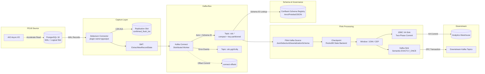
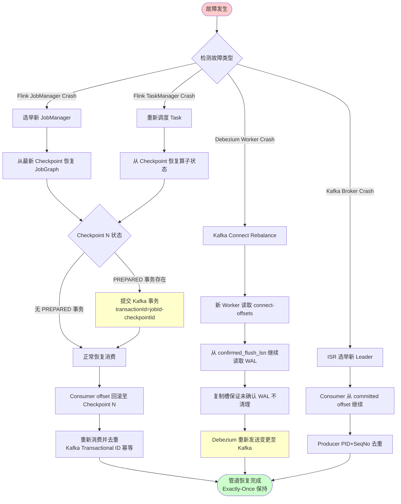

# PG18 → Debezium → Kafka → Flink 实时管道集成

> 所属阶段: TECH-STACK | 前置依赖: [02.01-postgresql-18-cdc-deep-dive.md, 02.04-flink-streaming-resilience.md] | 形式化等级: L4

## 1. 概念定义 (Definitions)

**Def-TS-03-01-01 (CDC 管道，CDC Pipeline)**

设源数据库状态序列为 \( \{ D_t \}_{t \geq 0} \)。一个 **CDC 管道** 是四元组

\[
\mathcal{P} = \langle \text{Source}, \text{Capture}, \text{Bus}, \text{Process} \rangle
\]

其中 Source 为 PG18 实例；Capture 为 Debezium Connector，读取 WAL 输出结构化变更事件；Bus 为 Kafka 消息总线；Process 为 Flink 流处理引擎。管道函数为复合映射：

\[
\Phi_{\mathcal{P}} : D_t \xrightarrow{C} \mathcal{E}_{\text{debezium}} \xrightarrow{K} \mathcal{E}_{\text{kafka}} \xrightarrow{F} \mathcal{O}_{\text{flink}}
\]

每条事件携带变更类型 \( \text{op} \in \{ c, u, d, r \} \)、LSN 与事务 ID。

**Def-TS-03-01-02 (Schema Evolution)**

设表 \( T \) 在 \( t_1 \) 的模式为 \( \text{Schema}(T, t_1) \)，在 \( t_2 > t_1 \) 时为 \( \text{Schema}(T, t_2) \)。**Schema Evolution** 是模式序列随时间演化且满足兼容性的过程：

\[
\forall t_1 < t_2, \forall r \in \text{Rows}(T, t_1): \text{deserialize}(\text{Schema}(T, t_2), \text{serialize}(\text{Schema}(T, t_1), r)) \neq \bot
\]

使用 Avro 与 Confluent Schema Registry 时，兼容性通过 schema version 管理实现[^1]。

**Def-TS-03-01-03 (Initial Snapshot)**

**Initial Snapshot** 是 CDC 管道启动时对源数据库全部现有数据的一致性读取，产生初始状态事件集：

\[
\mathcal{E}_0 = \{ e_i \mid e_i.\text{op} = 'r' \land e_i.\text{after} \in D_{t_s} \land e_i.\text{lsn} = \text{snapshot_lsn} \}
\]

其中 `snapshot_lsn` 是快照开始时通过 `pg_current_wal_lsn()` 获取的锚点。快照完成后管道切换至增量流模式，处理 \( \text{LSN} > \text{snapshot_lsn} \) 的 WAL 记录。

**Def-TS-03-01-04 (Incremental Stream)**

**Incremental Stream** 是完成 Initial Snapshot 后对 PG18 WAL 的持续实时读取流。设 WAL 记录序列为 \( \{ w_k \}_{k > k_0} \)，\( k_0 \) 对应 snapshot_lsn。增量流事件集为：

\[
\mathcal{E}_{\Delta} = \{ e_k \mid e_k = C(w_k) \land w_k.\text{lsn} > \text{snapshot_lsn} \}
\]

增量流保证：同一分区/表内事件按 LSN 严格单调递增；已提交事务的变更作为原子单元出现；通过已确认消费的 LSN 实现断点续传。

**Def-TS-03-01-05 (Dead Letter Queue, DLQ)**

**DLQ** 是 CDC 管道中隔离不可处理事件的容错机制：

\[
\text{DLQ} = \{ e \mid e \in \mathcal{E}_{\text{in}} \land \text{process}(e) = \bot \land \text{retries} \geq \text{max_retries} \}
\]

在 Kafka Connect 中通过 `errors.tolerance=all` 与 `errors.deadletterqueue.topic.name` 启用，不可处理事件被路由至独立 Kafka topic，避免阻塞主消费流。

---

## 2. 属性推导 (Properties)

**Lemma-TS-03-01-01 (管道数据一致性)**

若满足：(1) PG18 WAL 持久性；(2) Debezium 按 LSN 单调递增解析 WAL；(3) Kafka 同一 key 映射到固定分区，保证分区内顺序。则管道满足 **源-汇顺序一致性**：

\[
\forall e_i, e_j \in \mathcal{E}_{\Delta}: e_i.\text{lsn} < e_j.\text{lsn} \implies \text{consume}(e_i) <_{\text{time}} \text{consume}(e_j)
\]

_证明概要_：PG18 WAL 的 LSN 全局单调递增。Debezium 通过复制槽保持消费位点并按顺序读取。Kafka 分区保序性保证写入顺序等于消费顺序。由传递性，源端 LSN 顺序完整传递至 Flink 消费端。∎

**Lemma-TS-03-01-02 (端到端 Exactly-Once 必要条件)**

端到端 Exactly-Once 要求对于任意源端变更事件 \( e \)，Flink sink 端产生且仅产生一次对应副作用。必要条件为：

1. **源端可重放**：复制槽保留 WAL 直至 Debezium 确认消费（`confirmed_flush_lsn` 推进）；
2. **传输端持久化**：Kafka `acks=all`、`min.insync.replicas >= 2`；
3. **处理端确定性**：Flink 算子无外部非确定性输入，状态通过 Checkpoint 持久化；
4. **Sink 端幂等或事务性**：支持两阶段提交（2PC）或基于主键的幂等写入。

**Prop-TS-03-01-01 (Snapshot-Stream 衔接一致性)**

设 Initial Snapshot 在 LSN \( L_s \) 处获取一致性视图，增量流从 \( L_s + 1 \) 开始。若 Debezium 在快照期间缓冲 \( [L_s, L_{\text{switch}}] \) 区间内的变更，则切换时刻满足：

\[
\mathcal{E}_0 \cup \mathcal{E}_{\Delta} \equiv D_{t_{\text{switch}}} \setminus D_{t_0}
\]

即 snapshot 与增量流的无损并集等于从启动到切换时刻的全部数据库变更，保证无数据间隙与无重复。

---

## 3. 关系建立 (Relations)

### 3.1 Debezium 与 PG18 复制槽

Debezium 通过逻辑解码与复制槽建立 1:1 持久会话：Connector 通过 `pg_logical_slot_get_changes()` 读取 `pgoutput` 产生的逻辑变更；周期性地将已处理的最大 LSN 回写至复制槽的 `confirmed_flush_lsn`，PG18 仅在 LSN 推进后才可清理更早 WAL。PG18 AIO 使 `pgoutput` 读取延迟降低，大规模 snapshot 吞吐量提升约 15–30%[^2]。

### 3.2 Debezium 与 Kafka Connect

Debezium 作为 Kafka Connect **Source Connector** 运行于 **Distributed Mode**：Worker 组通过 `connect-configs`、`connect-offsets`、`connect-status` 三个内部 topic 共享状态，Task 故障时自动重平衡。Debezium 的消费位点（LSN）写入 `connect-offsets` topic，Worker 重启后从最新 offset 恢复；默认按 `{server}.{database}.{schema}.{table}` 自动创建 Kafka topic。

### 3.3 Kafka 与 Flink CDC Connector

Flink 通过 Kafka Source 消费 Debezium Envelope：SQL 中使用 `format = 'debezium-json'` 自动解析，DataStream API 中使用 `JsonDebeziumDeserializationSchema` 将消息转为 `RowData`。Flink Checkpoint barrier 与 Kafka consumer offset 绑定，Checkpoint 成功时 offset 被固化；Consumer 在 Checkpoint 完成后才提交 offset，保证 exactly-once 语义。

---

## 4. 论证过程 (Argumentation)

### 4.1 管道架构

**数据流路径**：PG18 WAL → `pgoutput` 逻辑解码 → Debezium 捕获并包装为 Envelope → Kafka Connect Distributed Worker 批量写入 Kafka → Flink Source 按分区顺序消费 → Flink Processing（窗口/JOIN/CEP）→ Kafka Sink（2PC）或 JDBC XA Sink 输出。消息 Key 为表主键，确保同一实体变更进入同一分区。

### 4.2 集成边界的数据一致性保障

**Snapshot + Stream 衔接**是 CDC 管道最易出错的边界：

- **Initial 模式**：先执行 `SELECT *` 快照，再切换至 WAL 增量流。快照期间的新变更被缓冲，切换后按顺序追加；
- **Exported 模式**：使用 `pg_export_snapshot()` 获取一致性快照 ID，保证快照读取与流读取之间无幻读。

一致性保障机制：(1) 快照开始时记录 `pg_current_wal_lsn()` 为 \( L_s \)，完成后请求所有 \( \text{LSN} > L_s \) 的变更；(2) 同一事务的变更通过事务元数据打包，Flink 可基于此实现事务级一致性；(3) Flink 基于 Debezium 的 `ts_ms` 生成 Watermark，处理乱序与延迟。

### 4.3 Schema Evolution 处理策略

**策略 1: Avro + Confluent Schema Registry**

PG18 DDL 变更被 Debezium 探测后，新 schema v(N+1) 注册至 Registry。Kafka 消息仅携带 schema ID，Consumer 从 Registry 获取对应 schema 反序列化。

| 变更类型 | Backward | Forward | Full |
|----------|----------|---------|------|
| ADD COLUMN (nullable) | ✓ | ✓ | ✓ |
| ADD COLUMN (default) | ✓ | ✗ | ✗ |
| DROP COLUMN | ✗ | ✓ | ✗ |
| RENAME COLUMN | ✗ | ✗ | ✗ |
| TYPE WIDENING | ✓ | ✗ | ✗ |

生产建议：Registry 兼容性策略设为 `BACKWARD` 或 `BACKWARD_TRANSITIVE`。

**策略 2: 单消息变换 (SMT)**

通过 `ExtractNewRecordState` 剥离 Debezium Envelope，仅保留 `after` 状态；配合 `AddFields` 注入操作类型与 LSN，简化 Flink 端解析。

### 4.4 组合弹性设计

**Kafka DLQ**：配置 `errors.tolerance=all` 与 `errors.deadletterqueue.topic.name=pg18.cdc.dlq`，序列化失败、模式不兼容或 SMT 异常的事件被路由至独立 topic，保留原始 headers 供排查，支持修复后回填。

**Flink Checkpoint 与 PG 复制槽 LSN 协同**：Checkpoint 周期建议 10s–60s，barrier 对齐算子状态；Flink Kafka Consumer offset 提交与 Checkpoint 绑定，Checkpoint \( n \) 成功后 offset 标记为已安全；Debezium `heartbeat.interval.ms` 确保即使无数据变更也定期推进 `confirmed_flush_lsn`，防止 WAL 无限增长。

**Failover 恢复**：Debezium Worker 崩溃 → Kafka Connect 重平衡，从 `connect-offsets` 恢复 LSN；Kafka Broker 崩溃 → ISR 选举新 leader，Consumer 从 committed offset 继续；Flink TaskManager 崩溃 → 从 Checkpoint 恢复状态（Exactly-once）；Flink JobManager 崩溃 → HA 模式恢复 JobGraph（Exactly-once）；PG18 主从切换 → Debezium 通过复制槽名称重新连接新主库。

### 4.5 PG18 AIO 对 Debezium 读取性能的加速

PG18 AIO 对 Debezium 有两方面提升：(1) **Snapshot 阶段**：大规模 `SELECT *` 的预提交批量 I/O 减少同步 `pread` 开销，NVMe SSD 上吞吐量提升 20–40%；(2) **WAL 读取阶段**：`io_uring` 后端降低延迟抖动，使 Debezium 能跟上更高 WAL 产生速率。配置要点：`--with-liburing` 编译，`io_method = async`。

---

## 5. 形式证明 / 工程论证 (Proof / Engineering Argument)

**Thm-TS-03-01-01 (端到端 Exactly-Once 充分条件)**

设 CDC 管道 \( \mathcal{P} = \langle \text{PG18}, \text{Debezium}, \text{Kafka}, \text{Flink}, \text{Sink} \rangle \)。若满足以下四组条件，则 \( \mathcal{P} \) 实现端到端 Exactly-Once：

**C1（源端可重放）**：PG18 复制槽 `restart_lsn` 与 `confirmed_flush_lsn` 持久化；`wal_level = logical` 且 `max_slot_wal_keep_size` 充足，保证 Debezium 恢复期间 WAL 不被提前清理。

**C2（传输端 Exactly-Once 写入）**：Kafka Producer `enable.idempotence=true`、`acks=all`、`retries=Integer.MAX_VALUE`；Topic `min.insync.replicas >= 2`。

**C3（处理端状态一致性）**：Flink 启用 Checkpointing，状态后端为 RocksDB 或增量 HDFS；Checkpoint 模式 `EXACTLY_ONCE`；算子状态序列化不变。

**C4（Sink 端两阶段提交或幂等）**：

- **Kafka Sink**：`Semantic.EXACTLY_ONCE`，2PC 协调 Kafka transaction 与 Flink Checkpoint，事务 ID 按 `jobId-checkpointId` 命名；
- **JDBC Sink**：XA 事务，`commit()` 在 Checkpoint 完成阶段调用，`rollback()` 在 Checkpoint 失败时调用；
- **幂等 Sink**：基于业务主键的 `UPSERT` 语义。

**证明**（按故障场景分情况论证）：

_场景 1: Flink 在 Checkpoint \( n \) 与 \( n+1 \) 之间崩溃。_ Flink 从 Checkpoint \( n \) 恢复，Kafka Consumer offset 回滚至 \( n \)。Kafka 已确认消息不丢失，未 checkpoint 的消息被重新消费。算子状态恢复至 \( n \)，处理具有确定性。Sink 端 2PC 事务中，已 `PREPARED` 的事务恢复后提交，未 `PREPARED` 的回滚。事务 ID 与 Checkpoint ID 绑定，Kafka 事务去重保证不重复写入。

_场景 2: Kafka Broker 在消息写入后崩溃。_ Producer 幂等性（PID + Sequence Number）使重复发送被 broker 去重。ISR 机制保证已确认消息在 leader 切换后不丢失。Flink Consumer 从 last committed offset 恢复，该 offset 对应 Checkpoint 成功时刻，不丢失已 checkpoint 消息。

_场景 3: Debezium Worker 崩溃。_ Kafka Connect Distributed 将 Task 重分配至存活 Worker，从 `connect-offsets` 读取 LSN，从 `restart_lsn` 继续读取 PG18 WAL。复制槽保留未确认 WAL，恢复后变更被重新发送。Kafka 端幂等 Producer 与 Flink 端事务/幂等 Sink 共同保证端到端无重复。

综上，C1–C4 为 \( \mathcal{P} \) 端到端 Exactly-Once 的充分条件。∎

---

## 6. 实例验证 (Examples)

### 6.1 Debezium Connector JSON 配置

```json
{
  "name": "pg18-inventory-connector",
  "config": {
    "connector.class": "io.debezium.connector.postgresql.PostgresConnector",
    "tasks.max": "1",
    "database.hostname": "pg18-primary.internal",
    "database.port": "5432",
    "database.user": "debezium",
    "database.password": "${secrets:debezium:db_password}",
    "database.dbname": "inventory",
    "database.server.name": "pg18",
    "plugin.name": "pgoutput",
    "slot.name": "debezium_slot_01",
    "publication.name": "dbz_publication",
    "snapshot.mode": "initial",
    "snapshot.isolation.mode": "repeatable_read",
    "tombstones.on.delete": "true",
    "decimal.handling.mode": "string",
    "heartbeat.interval.ms": "10000",
    "heartbeat.action.query": "INSERT INTO debezium_heartbeat (id, ts) VALUES (1, NOW()) ON CONFLICT (id) DO UPDATE SET ts=EXCLUDED.ts;",
    "table.include.list": "public.orders,public.customers",
    "transforms": "unwrap",
    "transforms.unwrap.type": "io.debezium.transforms.ExtractNewRecordState",
    "transforms.unwrap.drop.tombstones": "false",
    "transforms.unwrap.delete.handling.mode": "rewrite",
    "key.converter": "io.confluent.connect.avro.AvroConverter",
    "key.converter.schema.registry.url": "http://schema-registry:8081",
    "value.converter": "io.confluent.connect.avro.AvroConverter",
    "value.converter.schema.registry.url": "http://schema-registry:8081",
    "errors.tolerance": "all",
    "errors.deadletterqueue.topic.name": "cdc.pg18.dlq",
    "errors.deadletterqueue.context.headers.enable": "true"
  }
}
```

`plugin.name=pgoutput` 使用 PG 内置逻辑解码；`heartbeat.action.query` 对低频变更表强制推进 `confirmed_flush_lsn`；`ExtractNewRecordState` 输出扁平化记录简化下游消费。

### 6.2 Flink CDC SQL 定义

```sql
CREATE TABLE orders_cdc (
  id BIGINT,
  customer_id BIGINT,
  order_date TIMESTAMP_LTZ(3),
  total_amount DECIMAL(18, 2),
  status STRING,
  __op STRING METADATA FROM 'value.op' VIRTUAL,
  __ts_ms TIMESTAMP_LTZ(3) METADATA FROM 'value.source.ts_ms' VIRTUAL,
  WATERMARK FOR order_date AS order_date - INTERVAL '5' SECOND,
  PRIMARY KEY (id) NOT ENFORCED
) WITH (
  'connector' = 'kafka',
  'topic' = 'cdc.pg18.inventory.public.orders',
  'properties.bootstrap.servers' = 'kafka-1:9092,kafka-2:9092,kafka-3:9092',
  'properties.group.id' = 'flink-pg18-orders-consumer',
  'properties.isolation.level' = 'read_committed',
  'scan.startup.mode' = 'group-offsets',
  'format' = 'debezium-json'
);

CREATE TABLE orders_analytics (
  id BIGINT,
  customer_id BIGINT,
  order_date TIMESTAMP_LTZ(3),
  total_amount DECIMAL(18, 2),
  status STRING,
  last_updated TIMESTAMP_LTZ(3),
  PRIMARY KEY (id) NOT ENFORCED
) WITH (
  'connector' = 'jdbc',
  'url' = 'jdbc:postgresql://analytics-pg:5432/warehouse',
  'table-name' = 'orders_analytics',
  'username' = 'flink',
  'driver' = 'org.postgresql.Driver'
);

INSERT INTO orders_analytics
SELECT id, customer_id, order_date, total_amount, status,
       COALESCE(__ts_ms, CURRENT_TIMESTAMP) AS last_updated
FROM orders_cdc
WHERE __op IN ('c', 'u', 'r');
```

### 6.3 Kafka Topic 分区策略

```bash
kafka-topics.sh --create \
  --topic cdc.pg18.inventory.public.orders \
  --partitions 8 \
  --replication-factor 3 \
  --config cleanup.policy=compact \
  --config min.insync.replicas=2 \
  --bootstrap-server kafka-1:9092

kafka-topics.sh --create \
  --topic cdc.pg18.dlq \
  --partitions 4 \
  --replication-factor 3 \
  --config retention.ms=604800000 \
  --bootstrap-server kafka-1:9092
```

Debezium 以表主键作为消息 key，保证同一实体变更进入同一分区；changelog topic 启用 `compact` 策略保留各 key 最新值，支持 Flink `upsert-kafka` connector；分区数建议 ≥ Flink 并行度。

---

## 7. 可视化 (Visualizations)

### 7.1 端到端管道架构



### 7.2 故障恢复流程



---

## 8. 引用参考 (References)

[^1]: Debezium Documentation, "PostgreSQL Connector", 2025. <https://debezium.io/documentation/reference/stable/connectors/postgresql.html>
[^2]: Apache Flink Documentation, "Kafka Connector", "Exactly-Once Semantics", 2025. <https://nightlies.apache.org/flink/flink-docs-stable/docs/connectors/datastream/kafka/>
