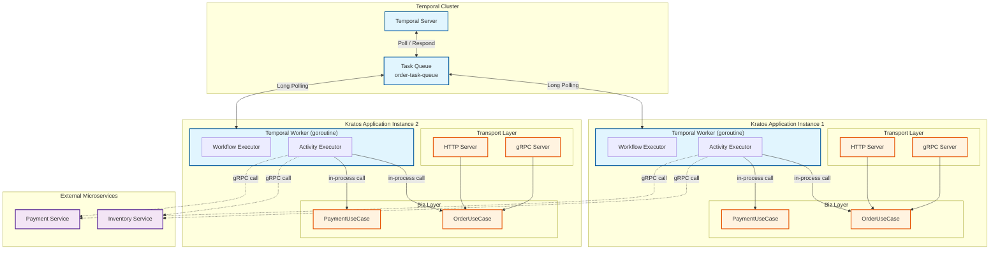
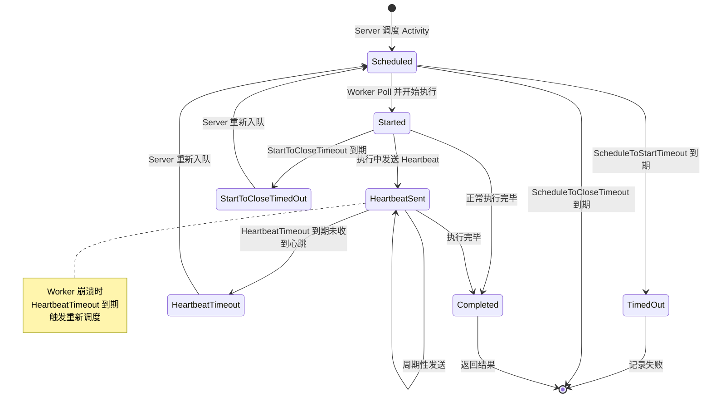

# Temporal Worker 与 Kratos 服务集成

> 所属阶段: TECH-STACK | 前置依赖: [02.02-temporal-workflow-engine-guide.md, 02.03-kratos-microservices-framework.md] | 形式化等级: L4

## 1. 概念定义 (Definitions)

本节定义 Temporal Worker 与 Kratos 服务集成所需的核心概念，为后续的属性推导与工程论证建立严格的语义基础。

**Def-T-03-02-01 (Temporal Worker)**

Temporal Worker 是一个长期运行的进程实体，负责从 Temporal Server 的特定 Task Queue 中轮询（Poll）Workflow Task 与 Activity Task，并在本地执行对应的 Workflow 与 Activity 实现。形式上，Worker 可定义为一个四元组：

$$W = (C, Q, R, O)$$

其中：

- $C$ 为到 Temporal Server 的 `client.Client` 连接句柄；
- $Q$ 为 Worker 监听的 Task Queue 名称字符串；
- $R$ 为注册在该 Worker 上的执行器集合（Workflow + Activity）；
- $O$ 为 `worker.Options` 配置选项，涵盖并发度、Sticky Execution、拦截器等参数。

Worker 的生命周期由 `worker.Start()` 启动，`worker.Stop()` 优雅终止。在 Kratos 集成场景中，Worker 作为 Kratos 应用内部的一个 goroutine 运行，与 HTTP/gRPC Server 共享进程空间与依赖注入容器。

**Def-T-03-02-02 (Activity)**

Activity 是 Workflow 中对外部世界产生副作用（Side Effect）或执行长时间计算的基本单元。Activity 在 Worker 进程内执行，可调用外部服务（数据库、消息队列、其他微服务）。形式上，Activity 是一个确定性函数：

$$A: \Sigma \times I \rightarrow (\Sigma', O \cup \{\bot\})$$

其中 $\Sigma$ 为输入上下文（包含 `activity.Context`、心跳状态），$I$ 为业务输入参数，$\Sigma'$ 为可能更新的状态，$O$ 为输出结果，$\bot$ 表示执行失败（超时、异常、取消）。Activity 的执行语义满足**至少一次执行（At-Least-Once）** guarantee。

**Def-T-03-02-03 (Task Queue)**

Task Queue 是 Temporal Server 维护的分布式任务队列，用于解耦 Workflow/Activity 的调度（Schedule）与执行（Execute）。形式上，Task Queue 是一个逻辑队列：

$$TQ = (N, T, P, D)$$

其中：

- $N$ 为队列名称（如 `"order-task-queue"`）；
- $T \subseteq \{\text{WorkflowTask}, \text{ActivityTask}\}$ 为队列承载的任务类型；
- $P$ 为优先级调度策略（默认 FIFO）；
- $D$ 为任务分发语义（Sticky Task Queue 或普通 Task Queue）。

Worker 通过长轮询（Long Polling）从 Task Queue 获取任务，Temporal Server 保证任务在被 Worker Ack 之前不会从队列中删除。

**Def-T-03-02-04 (Heartbeat)**

Heartbeat 是长时间运行 Activity 向 Temporal Server 发送的周期性存活信号，用于防止 Server 因超时而将 Activity 标记为失败并触发重试。形式上，Heartbeat 是一个时间序列：

$$H = \{h_1, h_2, \dots, h_n\}, \quad h_i = (t_i, p_i)$$

其中 $t_i$ 为心跳时间戳，$p_i$ 为可选的进度载荷（Progress Payload）。Heartbeat 的语义保证为：若 Server 在 `HeartbeatTimeout` 窗口内未收到任何 $h_i$，则判定该 Activity 执行实例失效，触发重新调度。

**Def-T-03-02-05 (Sticky Execution)**

Sticky Execution 是 Temporal 针对 Workflow Task 的优化机制：同一 Workflow Execution 的后续 Task 优先调度到此前处理过该 Workflow 的 Worker 实例，避免 Workflow 状态（Workflow State）的全量重建。形式上：

$$\text{Sticky}(W, E) = \begin{cases} \text{true} & \text{if } \exists W_i : \text{Cache}(W_i) \ni \text{State}(E) \\ \text{false} & \text{otherwise} \end{cases}$$

当 Sticky Execution 生效时，Worker 使用本地缓存的 Workflow State 继续执行；失效时，Worker 从 Server 拉取 Event History 重建状态（Rebuild State from Events）。Sticky Execution 显著降低高吞吐场景下的网络开销与状态重建延迟。

## 2. 属性推导 (Properties)

基于上述定义，本节推导 Worker 与 Task Queue 的核心性质。

**Lemma-T-03-02-01 (Worker 幂等性)**

若 Activity 实现满足幂等性条件，则 Worker 的崩溃恢复不会导致业务状态不一致。

*形式化表述*：设 Activity $A$ 对业务系统 $S$ 的副作用为 $A(S) = S'$。若 $A$ 幂等，即 $\forall S: A(A(S)) = A(S)$，则即使 $A$ 被重复执行（Worker 崩溃后由其他 Worker 重新调度），系统最终状态仍为 $S'$。

*推导*：Temporal 的 At-Least-Once 语义意味着 Activity 可能被多次执行。设 Worker $W_1$ 执行 $A$ 到中途崩溃，Server 将 $A$ 重新调度到 $W_2$。若 $A$ 修改数据库记录，无幂等保证时可能产生重复记录（如重复扣款）；有幂等保证时，第二次执行检测到已存在的状态变更后直接返回，系统保持一致。∎

**Prop-T-03-02-01 (Task Queue FIFO 保证)**

同一 Workflow Execution 内的 Task 在 Task Queue 中保持 FIFO 顺序；不同 Execution 之间的 Task 不保证全局 FIFO。

*形式化表述*：设 Workflow Execution $E$ 生成 Task 序列 $T_E = [t_1, t_2, \dots, t_n]$。对于任意 Worker $W$ 从队列中消费 $E$ 的 Task，其消费顺序满足：

$$\forall i < j : \text{Consume}(t_i) \prec \text{Consume}(t_j)$$

其中 $\prec$ 表示 happens-before 关系。但若有 $E_1 \neq E_2$，则不保证 $T_{E_1}$ 与 $T_{E_2}$ 的全局交错顺序。

*推导*：Temporal Server 按 Workflow Execution ID 维护独立的 Task Sequence，Event History 的 Append-Only 语义天然保证了同一 Execution 内 Task 的顺序性。Server 在分发 Task 时，对同一 Execution 不会分发乱序的 Task。∎

**Lemma-T-03-02-02 (Sticky Execution 缓存一致性)**

Sticky Execution 不会破坏 Workflow 的一致性，仅影响执行效率。

*形式化表述*：设 Worker $W_1$ 缓存了 Execution $E$ 的状态 $S_E$。若 $W_1$ 崩溃，Server 将 $E$ 的 Task 调度到 $W_2$。$W_2$ 从 Server 拉取完整的 Event History $H_E$ 并重建状态 $S'_E$。则有：

$$S'_E = \text{Rebuild}(H_E) = S_E$$

即重建后的状态与缓存状态等价。

*推导*：Event History 是 Workflow 执行的单一事实来源（Single Source of Truth）。Worker 缓存的状态是 Event History 的物化视图（Materialized View），重建过程是确定性的状态机重放（Deterministic Replay）。因此缓存丢失不会导致状态不一致，仅增加重建开销。∎

## 3. 关系建立 (Relations)

本节建立 Temporal Worker 与 Kratos 服务体系之间的映射与交互关系。

### 3.1 生命周期关系

在典型的 Kratos + Temporal 集成架构中，Worker 的生命周期与 Kratos 应用的生命周期紧密绑定：

| 阶段 | Kratos 应用 | Temporal Worker | 关系说明 |
|------|------------|----------------|---------|
| 初始化 | `kratos.New()` 创建 App | `worker.New(c, queue, opts)` 创建 Worker | Worker 依赖 Kratos 的 DI 容器获取配置、Logger、Tracer |
| 启动 | `app.Run()` 启动 HTTP/gRPC Server | `worker.Start()` 在独立 goroutine 中启动轮询 | 两者并行运行，共享进程资源 |
| 运行 | 处理外部 HTTP/gRPC 请求 | 轮询 Task Queue 执行 Workflow/Activity | Activity 可反向调用 Kratos 内部 gRPC Service |
| 停止 | `app.Stop()` 触发优雅关闭 | `worker.Stop()` 停止轮询，等待 Activity 完成 | 共用 Context 的取消信号 |

Worker 不是 Kratos 的 Server 插件（如 `http.Server` 或 `grpc.Server`），而是一个**后台执行器（Background Executor）**，通过 Kratos 的 `App` 生命周期钩子（Lifecycle Hooks）注册启动与停止回调。

### 3.2 gRPC/HTTP 调用关系

Activity 与 Kratos 服务之间的调用关系呈现为**双向依赖**：

1. **外向调用（Activity → Kratos Service）**：Activity 作为 Temporal Workflow 的副作用执行器，需要调用 Kratos 微服务的业务接口（如订单创建、库存扣减）。此时 Activity 充当 Kratos 的 gRPC/HTTP 客户端。

2. **内向触发（Kratos Service → Temporal）**：Kratos 的 HTTP/gRPC Handler 接收外部请求后，通过 Temporal Client 启动 Workflow（如 `c.ExecuteWorkflow(ctx, options, workflow, args...)`）。此时 Kratos 充当 Temporal 的工作流发起者。

调用拓扑可形式化为二分图 $G = (V_T \cup V_K, E)$，其中 $V_T$ 为 Temporal 实体（Client/Worker/Workflow/Activity），$V_K$ 为 Kratos 实体（HTTP Server/gRPC Server/Service/Biz UseCase），边 $E$ 表示调用关系。

### 3.3 依赖注入关系

Kratos 的依赖注入（DI）容器是两者集成的关键纽带。Temporal Worker 的创建通常放在 Kratos 的 `wire.go` 或 `provider set` 中：

```
Kratos App
├── HTTP Server (对外 API)
├── gRPC Server (对外 API)
├── Biz Layer (业务用例)
├── Data Layer (数据库/缓存/消息队列)
└── Temporal Worker
    ├── Temporal Client (依赖配置：Host/Namespace/TLSCerts)
    ├── Workflow Registry
    ├── Activity Registry (注入 Biz UseCase 作为 Activity 实现)
    └── Logger/Tracer (复用 Kratos 的日志与链路追踪)
```

Activity 的实现函数可直接接收 Kratos 的 Biz UseCase 或 Service Client 作为闭包/结构体字段，避免在 Activity 内部手动初始化依赖。

## 4. 论证过程 (Argumentation)

### 4.1 Kratos 服务如何托管 Temporal Worker

Worker 作为 Kratos 服务的一个 goroutine 运行，是集成架构的核心设计决策。论证如下：

**方案对比**：

| 方案 | Worker 位置 | 优点 | 缺点 |
|------|------------|------|------|
| A | Kratos 进程内 goroutine | 共享 DI 容器、零网络开销调用 Biz 层、统一日志/监控 | 进程崩溃同时影响 HTTP API 与 Worker |
| B | 独立进程（Sidecar） | 故障隔离、独立扩缩容 | 调用 Kratos Biz 层需走网络、额外运维成本 |
| C | 独立 Deployment | 最大隔离、Worker 可独立伸缩 | 与方案 B 类似缺点，且增加部署复杂度 |

**推荐方案 A 的论证**：

在微服务架构中，Worker 执行的业务逻辑与 HTTP/gRPC Handler 执行的逻辑高度重叠（如订单处理、支付状态机）。将 Worker 内嵌于 Kratos 进程，Activity 可直接调用同进程内的 Biz UseCase，避免序列化/网络开销。Kratos 的 `App` 生命周期管理提供了优雅的启动/停止钩子，确保 Worker 在 Server 启动后初始化、在 Server 停止前优雅关闭。

具体集成模式：

```go
// 在 Kratos 应用初始化时创建 Worker
func NewTemporalWorker(
    c client.Client,
    logger log.Logger,
    orderUC *biz.OrderUseCase,
    paymentUC *biz.PaymentUseCase,
) worker.Worker {
    w := worker.New(c, "order-task-queue", worker.Options{
        MaxConcurrentActivityExecutionSize: 100,
        Logger:                             NewTemporalLoggerAdapter(logger),
    })

    // 注册 Workflow
    w.RegisterWorkflow(order.OrderWorkflow)

    // 注册 Activity，直接注入 Biz UseCase
    w.RegisterActivity(&order.Activities{
        OrderUC:   orderUC,
        PaymentUC: paymentUC,
    })

    return w
}

// 在 main.go 中通过 Kratos App 的生命周期管理 Worker
app := kratos.New(
    kratos.Name("order-service"),
    kratos.Server(httpServer, grpcServer, NewTemporalWorkerServer(temporalWorker)),
)
```

其中 `TemporalWorkerServer` 实现了 Kratos 的 `transport.Server` 接口，`Start()` 调用 `worker.Start()`，`Stop()` 调用 `worker.Stop()`。

### 4.2 Activity 调用 Kratos gRPC/HTTP API 的设计模式

Activity 调用 Kratos 服务的模式取决于目标服务的位置：

**模式一：同进程调用（In-Process）**

当 Activity 与目标 Kratos Service 位于同一进程时，直接调用 Biz UseCase 或 gRPC Service 的内部方法，不走网络：

```go
type Activities struct {
    OrderUC   *biz.OrderUseCase
    PaymentUC *biz.PaymentUseCase
}

func (a *Activities) CreateOrderActivity(ctx context.Context, req *v1.CreateOrderRequest) (*v1.CreateOrderReply, error) {
    // 直接调用 Biz 层，零网络开销
    return a.OrderUC.CreateOrder(ctx, req)
}
```

**模式二：跨进程 gRPC 调用（Cross-Process）**

当 Activity 需要调用其他 Kratos 微服务时，使用 `kratos/client` 或原生 `grpc.Dial` 建立连接：

```go
func (a *Activities) DeductInventoryActivity(ctx context.Context, req *v1.DeductRequest) error {
    // 使用 kratos/client 进行服务发现与负载均衡
    conn, err := a.discovery.Dial(ctx, "inventory-service")
    if err != nil {
        return err
    }
    defer conn.Close()

    client := v1.NewInventoryClient(conn)
    _, err = client.Deduct(ctx, req)
    return err
}
```

**模式三：HTTP 调用（HTTP Bridging）**

对于仅暴露 HTTP 接口的遗留服务，Activity 内部使用标准 `net/http` 或 Kratos 的 HTTP Client：

```go
func (a *Activities) NotifyThirdPartyActivity(ctx context.Context, req *NotifyRequest) error {
    httpReq, _ := http.NewRequestWithContext(ctx, "POST", a.webhookURL, bytes.NewReader(body))
    resp, err := a.httpClient.Do(httpReq)
    // ... 处理响应
}
```

**设计原则**：

1. **Activity 应尽可能薄**：Activity 只负责编排与副作用触发，业务逻辑下沉到 Kratos 的 Biz 层。
2. **幂等性是必须的**：所有被 Activity 调用的 Kratos API 必须实现幂等键（Idempotency Key）机制。
3. **上下文传递**：将 Temporal 的 `activity.Context` 转换为 Kratos 的 `context.Context`，确保链路追踪（Trace ID）与超时（Deadline）的透传。

### 4.3 组合弹性：超时策略、Heartbeat 与崩溃恢复

Temporal 提供了多层次的超时与心跳机制，与 Kratos 服务的弹性设计形成互补：

**4.3.1 Activity 超时策略**

Temporal 定义了四种 Activity 超时参数[^1]：

| 超时类型 | 语义 | 典型配置 | 适用场景 |
|---------|------|---------|---------|
| `ScheduleToCloseTimeout` | 从调度到完成的总时间 | 5 minutes | 短生命周期 Activity |
| `ScheduleToStartTimeout` | 从调度到开始执行的时间 | 30 seconds | 防止 Worker 过载时任务积压 |
| `StartToCloseTimeout` | 从开始执行到完成的时间 | 30 seconds | 控制单个 Activity 的最大执行时长 |
| `HeartbeatTimeout` | 两次 Heartbeat 之间的最大间隔 | 10 seconds | 长时间运行 Activity |

在 Kratos 集成中，`StartToCloseTimeout` 与 Kratos gRPC 调用的超时设置应保持一致或留有裕量：

```go
workflow.WithActivityOptions(ctx, workflow.ActivityOptions{
    StartToCloseTimeout: 30 * time.Second,
    RetryPolicy: &temporal.RetryPolicy{
        InitialInterval:    time.Second,
        BackoffCoefficient: 2.0,
        MaximumInterval:    time.Minute,
        MaximumAttempts:    3,
    },
})
```

**4.3.2 Heartbeat 机制**

对于执行时间超过 HeartbeatTimeout 的 Activity（如批量数据处理、第三方回调等待），必须定期发送 Heartbeat：

```go
func (a *Activities) LongRunningProcessActivity(ctx context.Context, batchSize int) error {
    for i := 0; i < batchSize; i++ {
        // 执行单条处理
        if err := a.processItem(ctx, i); err != nil {
            return err
        }

        // 每处理 10 条发送一次心跳
        if i%10 == 0 {
            activity.RecordHeartbeat(ctx, Progress{Processed: i, Total: batchSize})
        }
    }
    return nil
}
```

Heartbeat 的核心作用：

1. **防止误判失败**：Server 在 `HeartbeatTimeout` 内未收到心跳则判定 Activity 失效，触发重新调度。
2. **进度检查点**：心跳载荷可作为进度检查点（Checkpoint），重新调度的 Worker 可从上次进度恢复。
3. **取消信号透传**：Activity 可在心跳后检查 `ctx.Err()`，响应 Workflow 的取消请求。

**4.3.3 Worker 崩溃恢复**

当托管 Worker 的 Kratos 实例崩溃时：

1. **Worker 与 Server 的连接断开**：Temporal Server 通过 gRPC 连接状态检测到 Worker 失效。
2. **已分配但未 Ack 的 Task 重新入队**：Server 将这些 Task 重新放入 Task Queue。
3. **其他健康 Worker 消费**：同一 Task Queue 上的其他 Kratos 实例（或新启动的 Pod）的 Worker 轮询到这些 Task 并执行。
4. **Sticky Execution 失效处理**：若崩溃的 Worker 缓存了 Workflow State，新 Worker 从 Event History 重建状态。

此过程的形式化描述：

$$\text{Crash}(W_i) \Rightarrow \forall t \in \text{Assigned}(W_i) : t \xrightarrow{\text{re-queue}} TQ \Rightarrow \exists W_j : \text{Poll}(W_j, t)$$

**4.3.4 组合弹性矩阵**

将 Temporal 的弹性机制与 Kratos 的弹性机制组合，形成多层次保障：

| 故障场景 | Temporal 机制 | Kratos 机制 | 组合效果 |
|---------|--------------|------------|---------|
| Activity 执行超时 | `StartToCloseTimeout` + 重试 | gRPC 超时 + 熔断 | 快速失败，避免级联阻塞 |
| Activity 卡住（死锁/慢查询） | `HeartbeatTimeout` + 重新调度 | 数据库连接池超时 | 自动检测并迁移到健康 Worker |
| Worker 进程崩溃 | Task 重新入队 + Sticky 失效 | K8s Pod 重启 / 健康检查 | 任务不丢失，自动恢复执行 |
| Kratos 下游服务不可用 | Activity 重试 + 指数退避 | 熔断 + 降级 | 减少无效调用，保护下游 |

### 4.4 连接池管理：gRPC 连接池与 Kratos 服务端连接

Activity 跨进程调用 Kratos 服务时，gRPC 连接的生命周期管理是关键：

**客户端连接池策略**：

```go
// 使用 kratos/client 的 Pool 机制
type ActivityDeps struct {
    InventoryClient v1.InventoryClient  // 复用连接
    PaymentClient   v1.PaymentClient
}

// 在 Kratos 初始化时注入已建立的 Client（连接池由 kratos/client 管理）
func NewActivityDeps(
    inventoryConn grpc.ClientConnInterface,
    paymentConn   grpc.ClientConnInterface,
) *ActivityDeps {
    return &ActivityDeps{
        InventoryClient: v1.NewInventoryClient(inventoryConn),
        PaymentClient:   v1.NewPaymentClient(paymentConn),
    }
}
```

**关键设计决策**：

1. **连接复用**：Activity 每次执行不应新建连接，应通过 Kratos DI 注入已建立的 Client。
2. **连接健康检查**：Kratos 的 gRPC Client 内置了健康检查与自动重连，Activity 无需额外处理连接故障。
3. **并发安全**：gRPC Client 是并发安全的，多个 Activity goroutine 可共享同一 Client 实例。
4. **优雅关闭**：Kratos `App.Stop()` 触发 Client 连接关闭，Worker `Stop()` 等待 Activity 完成后退出，避免连接泄漏。

## 5. 形式证明 / 工程论证 (Proof / Engineering Argument)

**Thm-T-03-02-01 (Heartbeat + 超时策略保证活动不丢失)**

在 Temporal Worker 与 Kratos 服务集成架构中，若 Activity 正确配置 Heartbeat 与超时参数，且 Kratos 服务具备幂等性，则 Activity 的执行语义等价于**恰好一次执行（Exactly-Once Execution）**对业务系统产生的最终效果。

*形式化表述*：

设 Activity $A$ 对业务系统 $S$ 的副作用为状态转移函数 $f_A: S \rightarrow S \cup \{\bot\}$。若满足：

1. **幂等性条件**：$\forall s \in S: f_A(f_A(s)) = f_A(s)$；
2. **心跳条件**：Activity $A$ 每 $\Delta_t < \tau_{hb}$ 时间发送 Heartbeat，其中 $\tau_{hb}$ 为 `HeartbeatTimeout`；
3. **超时条件**：Activity $A$ 的实际执行时间 $T_{exec} < \tau_{stc}$，其中 $\tau_{stc}$ 为 `StartToCloseTimeout`；

则无论 Worker 是否崩溃，业务系统的最终状态 $S_{final}$ 满足：

$$S_{final} = f_A(S_{initial}) \quad \text{或} \quad S_{final} = S_{initial} \text{（若 $A$ 最终失败）}$$

且不存在中间状态 $S_{partial}$ 使得系统永久停留在不一致状态。

*工程论证*：

**步骤 1：Worker 正常运行情况**

Worker $W$ 从 Task Queue 获取 Activity Task $t_A$，在 `StartToCloseTimeout` 内完成执行并返回结果。Server 收到成功响应，标记 $t_A$ 为 Completed。此路径下 Activity 恰好执行一次，业务状态从 $S_{initial}$ 转移到 $f_A(S_{initial})$。

**步骤 2：Worker 崩溃，Activity 未开始执行**

Worker 崩溃发生在 Poll 到 $t_A$ 之前。Server 未将 $t_A$ 分配给该 Worker，$t_A$ 仍在 Task Queue 中。其他 Worker $W'$ 后续 Poll 到 $t_A$ 并执行。此路径等价于正常调度，Activity 至少执行一次。

**步骤 3：Worker 崩溃，Activity 执行中**

Worker $W$ 开始执行 $A$ 后崩溃，分两种子情况：

- **子情况 3a：$A$ 已发送至少一次 Heartbeat**

  Server 在 `HeartbeatTimeout` 内未收到后续 Heartbeat，判定 $A$ 的执行实例失效。Server 将 $A$ 重新调度到 Task Queue（或保留在原 Sticky Task Queue）。Worker $W'$ 重新执行 $A$。由于 $A$ 幂等，即使 $W$ 已执行部分副作用，$W'$ 的重新执行不会导致状态不一致。

- **子情况 3b：$A$ 未发送任何 Heartbeat**

  若 $A$ 的执行时间已超过 `StartToCloseTimeout`，Server 已因超时而将 $A$ 重新调度。新的执行实例 $A'$ 开始执行。同样由幂等性保证状态一致性。

**步骤 4：Heartbeat 作为进度检查点的恢复**

若 Activity 在 Heartbeat 中上报进度 $p$，则重新调度时可通过 `activity.GetHeartbeatDetails(ctx, &p)` 获取上次进度，实现断点续传：

```go
var progress Progress
if activity.HasHeartbeatDetails(ctx) {
    if err := activity.GetHeartbeatDetails(ctx, &progress); err == nil {
        // 从上次进度恢复
        startFrom = progress.Processed
    }
}
```

**步骤 5：组合结论**

Temporal 的 At-Least-Once 执行语义 + 幂等性保证 = 恰好一次生效语义（Exactly-Once Effect）。Heartbeat 机制将长时间 Activity 的失效检测时间从 `StartToCloseTimeout` 降低到 `HeartbeatTimeout`，显著减少故障恢复延迟。Kratos 服务的幂等性实现（如数据库唯一约束、幂等键表）是这一等价性的业务层基础。

∎

## 6. 实例验证 (Examples)

### 6.1 Kratos 服务内启动 Temporal Worker

以下示例展示如何在 Kratos 应用的完整生命周期中集成 Temporal Worker。

**`internal/server/temporal.go`**：实现 Kratos 的 `transport.Server` 接口：

```go
package server

import (
    "context"
    "fmt"

    "github.com/go-kratos/kratos/v2/log"
    "github.com/go-kratos/kratos/v2/transport"
    "go.temporal.io/sdk/client"
    "go.temporal.io/sdk/worker"
)

// TemporalWorkerServer 实现 transport.Server 接口，将 Temporal Worker 嵌入 Kratos 生命周期
type TemporalWorkerServer struct {
    worker worker.Worker
    logger log.Logger
}

func NewTemporalWorkerServer(w worker.Worker, logger log.Logger) *TemporalWorkerServer {
    return &TemporalWorkerServer{worker: w, logger: logger}
}

func (s *TemporalWorkerServer) Start(ctx context.Context) error {
    s.logger.Log(log.LevelInfo, "msg", "starting temporal worker")
    if err := s.worker.Start(); err != nil {
        return fmt.Errorf("failed to start temporal worker: %w", err)
    }
    return nil
}

func (s *TemporalWorkerServer) Stop(ctx context.Context) error {
    s.logger.Log(log.LevelInfo, "msg", "stopping temporal worker")
    s.worker.Stop()
    return nil
}

// 确保接口实现
var _ transport.Server = (*TemporalWorkerServer)(nil)
```

**`cmd/server/main.go`**：在 Kratos 应用初始化中注册 Worker：

```go
package main

import (
    "flag"
    "os"

    "github.com/go-kratos/kratos/v2"
    "github.com/go-kratos/kratos/v2/log"
    "github.com/go-kratos/kratos/v2/transport/grpc"
    "github.com/go-kratos/kratos/v2/transport/http"

    temporalclient "go.temporal.io/sdk/client"
    temporalworker "go.temporal.io/sdk/worker"

    "order-service/internal/conf"
    "order-service/internal/server"
    "order-service/internal/service"
    "order-service/internal/workflow"
)

func main() {
    flag.Parse()
    logger := log.NewStdLogger(os.Stdout)

    // 加载配置
    bc := conf.Load()

    // 创建 Temporal Client
    c, err := temporalclient.NewClient(temporalclient.Options{
        HostPort:  bc.Temporal.HostPort,
        Namespace: bc.Temporal.Namespace,
    })
    if err != nil {
        log.Fatal(err)
    }
    defer c.Close()

    // 创建 Kratos HTTP/gRPC Servers
    httpServer := server.NewHTTPServer(bc.Server, logger)
    grpcServer := server.NewGRPCServer(bc.Server, logger)

    // 创建业务 Service（被 Activity 调用）
    orderService := service.NewOrderService()

    // 创建并配置 Temporal Worker
    w := temporalworker.New(c, "order-task-queue", temporalworker.Options{
        MaxConcurrentActivityExecutionSize:     100,
        MaxConcurrentWorkflowTaskExecutionSize: 50,
        EnableSessionWorker:                    true,
    })

    // 注册 Workflow 与 Activity
    w.RegisterWorkflow(workflow.OrderWorkflow)
    w.RegisterActivity(workflow.NewOrderActivities(orderService))

    // 将 Worker 包装为 Kratos Server，统一管理生命周期
    temporalServer := server.NewTemporalWorkerServer(w, logger)

    // 创建 Kratos App，Worker 与 HTTP/gRPC Server 并行运行
    app := kratos.New(
        kratos.Name("order-service"),
        kratos.Version("v1.0.0"),
        kratos.Server(httpServer, grpcServer, temporalServer),
        kratos.Logger(logger),
    )

    if err := app.Run(); err != nil {
        log.Fatal(err)
    }
}
```

### 6.2 Activity 调用 Kratos gRPC 服务

以下示例展示 Activity 如何通过 Kratos 的 Client 层调用其他微服务。

**`internal/workflow/activities.go`**：Activity 实现：

```go
package workflow

import (
    "context"
    "fmt"
    "time"

    "go.temporal.io/sdk/activity"
    "go.temporal.io/sdk/workflow"

    v1 "order-service/api/inventory/v1"
    v1payment "order-service/api/payment/v1"
    "order-service/internal/service"
)

type OrderActivities struct {
    orderService    *service.OrderService
    inventoryClient v1.InventoryClient  // 通过 DI 注入的 gRPC Client
    paymentClient   v1payment.PaymentClient
}

func NewOrderActivities(
    os *service.OrderService,
    ic v1.InventoryClient,
    pc v1payment.PaymentClient,
) *OrderActivities {
    return &OrderActivities{
        orderService:    os,
        inventoryClient: ic,
        paymentClient:   pc,
    }
}

// DeductInventoryActivity 调用库存服务扣减库存，带 Heartbeat 支持长时间等待
func (a *OrderActivities) DeductInventoryActivity(
    ctx context.Context,
    req *v1.DeductRequest,
) (*v1.DeductReply, error) {
    // 设置 Activity 级别的日志字段
    logger := activity.GetLogger(ctx)
    logger.Info("deducting inventory", "sku", req.Sku, "quantity", req.Quantity)

    // 调用库存服务（gRPC）
    reply, err := a.inventoryClient.Deduct(ctx, req)
    if err != nil {
        logger.Error("inventory deduct failed", "error", err)
        return nil, fmt.Errorf("inventory service error: %w", err)
    }

    return reply, nil
}

// ProcessPaymentActivity 调用支付服务，可能长时间等待第三方支付回调
func (a *OrderActivities) ProcessPaymentActivity(
    ctx context.Context,
    req *v1payment.PayRequest,
) (*v1payment.PayReply, error) {
    logger := activity.GetLogger(ctx)
    logger.Info("processing payment", "orderId", req.OrderId)

    // 初始化进度
    progress := PaymentProgress{Stage: "initiated"}
    activity.RecordHeartbeat(ctx, progress)

    // 发起支付请求
    reply, err := a.paymentClient.Pay(ctx, req)
    if err != nil {
        return nil, err
    }

    // 更新进度：支付已受理
    progress.Stage = "accepted"
    progress.PaymentId = reply.PaymentId
    activity.RecordHeartbeat(ctx, progress)

    // 模拟轮询支付状态（实际生产应使用回调或消息队列）
    ticker := time.NewTicker(5 * time.Second)
    defer ticker.Stop()

    for {
        select {
        case <-ctx.Done():
            return nil, ctx.Err()
        case <-ticker.C:
            statusReply, err := a.paymentClient.QueryStatus(ctx, &v1payment.QueryRequest{
                PaymentId: reply.PaymentId,
            })
            if err != nil {
                logger.Error("query payment status failed", "error", err)
                continue
            }

            progress.Stage = statusReply.Status
            activity.RecordHeartbeat(ctx, progress)

            if statusReply.Status == "success" {
                return &v1payment.PayReply{PaymentId: reply.PaymentId, Status: "success"}, nil
            }
            if statusReply.Status == "failed" {
                return nil, fmt.Errorf("payment failed: %s", statusReply.FailureReason)
            }
            // 继续轮询 "pending" 状态
        }
    }
}

type PaymentProgress struct {
    Stage     string `json:"stage"`
    PaymentId string `json:"paymentId"`
}
```

**`internal/workflow/order.go`**：Workflow 定义与超时配置：

```go
package workflow

import (
    "time"

    "go.temporal.io/sdk/temporal"
    "go.temporal.io/sdk/workflow"

    v1 "order-service/api/inventory/v1"
    v1payment "order-service/api/payment/v1"
)

type OrderInput struct {
    OrderId   string
    Sku       string
    Quantity  int64
    Amount    float64
    UserId    string
}

type OrderResult struct {
    Success   bool
    OrderId   string
    PaymentId string
}

func OrderWorkflow(ctx workflow.Context, input OrderInput) (*OrderResult, error) {
    logger := workflow.GetLogger(ctx)
    logger.Info("starting order workflow", "orderId", input.OrderId)

    // 配置 Activity 选项：超时、重试、心跳
    activityOptions := workflow.ActivityOptions{
        StartToCloseTimeout: 30 * time.Second,
        HeartbeatTimeout:    10 * time.Second,
        RetryPolicy: &temporal.RetryPolicy{
            InitialInterval:    time.Second,
            BackoffCoefficient: 2.0,
            MaximumInterval:    time.Minute,
            MaximumAttempts:    5,
            NonRetryableErrorTypes: []string{"InvalidSkuError", "InsufficientBalanceError"},
        },
    }
    ctx = workflow.WithActivityOptions(ctx, activityOptions)

    // 1. 扣减库存
    var deductResult v1.DeductReply
    err := workflow.ExecuteActivity(ctx, "DeductInventoryActivity", &v1.DeductRequest{
        Sku:      input.Sku,
        Quantity: input.Quantity,
    }).Get(ctx, &deductResult)
    if err != nil {
        logger.Error("deduct inventory failed", "error", err)
        return &OrderResult{Success: false, OrderId: input.OrderId}, err
    }

    // 2. 处理支付（长时间运行，依赖 Heartbeat）
    // 使用更长的超时和心跳配置
    paymentOptions := workflow.ActivityOptions{
        StartToCloseTimeout: 10 * time.Minute,
        HeartbeatTimeout:    30 * time.Second,
        RetryPolicy: &temporal.RetryPolicy{
            MaximumAttempts: 3,
        },
    }
    paymentCtx := workflow.WithActivityOptions(ctx, paymentOptions)

    var payResult v1payment.PayReply
    err = workflow.ExecuteActivity(paymentCtx, "ProcessPaymentActivity", &v1payment.PayRequest{
        OrderId: input.OrderId,
        Amount:  input.Amount,
        UserId:  input.UserId,
    }).Get(paymentCtx, &payResult)
    if err != nil {
        // 补偿：回滚库存（Saga 模式）
        logger.Warn("payment failed, compensating inventory", "error", err)
        _ = workflow.ExecuteActivity(ctx, "CompensateInventoryActivity", &v1.DeductRequest{
            Sku:      input.Sku,
            Quantity: -input.Quantity, // 回滚
        }).Get(ctx, nil)
        return &OrderResult{Success: false, OrderId: input.OrderId}, err
    }

    logger.Info("order workflow completed", "orderId", input.OrderId, "paymentId", payResult.PaymentId)
    return &OrderResult{
        Success:   true,
        OrderId:   input.OrderId,
        PaymentId: payResult.PaymentId,
    }, nil
}
```

### 6.3 幂等性实现示例（Kratos Service 层）

```go
package service

import (
    "context"
    "fmt"

    v1 "order-service/api/order/v1"
    "order-service/internal/biz"
)

type OrderService struct {
    uc *biz.OrderUseCase
}

func NewOrderService(uc *biz.OrderUseCase) *OrderService {
    return &OrderService{uc: uc}
}

// CreateOrder 实现幂等创建：使用 Temporal Workflow Execution ID 作为幂等键
func (s *OrderService) CreateOrder(ctx context.Context, req *v1.CreateOrderRequest) (*v1.CreateOrderReply, error) {
    // 从 Context 中提取 Temporal 的 Workflow Execution ID（通过 Metadata 传递）
    idempotencyKey := extractIdempotencyKey(ctx)
    if idempotencyKey == "" {
        return nil, fmt.Errorf("missing idempotency key")
    }

    order, err := s.uc.CreateOrder(ctx, &biz.Order{
        IdempotencyKey: idempotencyKey,
        Sku:            req.Sku,
        Quantity:       req.Quantity,
        Amount:         req.Amount,
        UserId:         req.UserId,
    })
    if err != nil {
        return nil, err
    }

    return &v1.CreateOrderReply{
        OrderId: order.ID,
        Status:  order.Status,
    }, nil
}

func extractIdempotencyKey(ctx context.Context) string {
    // 从传入的 gRPC/HTTP Metadata 或 Temporal Context 中提取
    // 实际实现依赖具体的上下文传递机制
    if md, ok := metadata.FromIncomingContext(ctx); ok {
        keys := md.Get("x-idempotency-key")
        if len(keys) > 0 {
            return keys[0]
        }
    }
    return ""
}
```

## 7. 可视化 (Visualizations)

### 7.1 Worker 与 Kratos 服务关系图

以下图表展示 Temporal Worker 如何嵌入 Kratos 应用进程，以及 Activity 与 Kratos gRPC Service 之间的调用关系。



**图说明**：上图展示了双实例 Kratos 应用架构。每个 Kratos 进程内同时运行 HTTP/gRPC Server 和 Temporal Worker goroutine。Worker 通过长轮询从 Temporal Server 的 Task Queue 获取任务。Activity 优先通过同进程调用（In-Process）访问 Biz Layer，必要时通过 gRPC 调用外部微服务。当实例 1 崩溃时，Temporal Server 自动将未完成的任务重新调度到实例 2 的 Worker。

### 7.2 Activity 超时与 Heartbeat 状态机



**图说明**：状态机描述了 Activity 从调度到完成的全生命周期状态转移。HeartbeatSent 状态是长时间运行 Activity 的关键：只要 Worker 定期发送 Heartbeat，Activity 就保持在执行状态；一旦 Worker 崩溃导致心跳中断，`HeartbeatTimeout` 触发后将 Activity 重新调度到健康 Worker。

## 8. 引用参考 (References)

[^1]: Temporal Technologies, "Temporal Go SDK — Activities", 2025. <https://docs.temporal.io/dev-guide/go/foundations#develop-activities>
