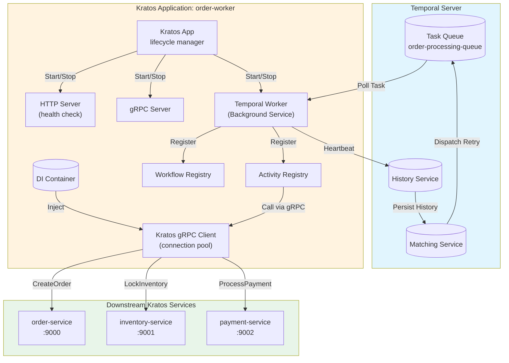

# Temporal Worker 与 Kratos 微服务集成实践

> 所属阶段: TECH-STACK | 前置依赖: [02.02-temporal-workflow-engine-guide.md, 02.03-kratos-microservices-framework.md] | 形式化等级: L4

## 1. 概念定义 (Definitions)

本节对 Temporal Worker 与 Kratos 微服务集成涉及的核心概念进行严格形式化定义，为后续属性推导与工程论证奠定基础。

**Def-T-03-01 (Temporal Worker)**

Temporal Worker 是一个长期运行的进程实体，负责从 Temporal Server 指定的 Task Queue 中拉取 Task（包括 Workflow Task 与 Activity Task），并在本地执行对应的 Workflow 或 Activity 实现。形式化地，设 Temporal Server 的 Task Queue 为队列 $Q$，Worker 集合为 $W = \{w_1, w_2, \dots, w_n\}$，则 Worker $w_i$ 的行为可描述为一个循环执行以下操作的进程：

$$
\text{Poll}(Q) \rightarrow \text{Execute}(t) \rightarrow \text{Respond}(r)
$$

其中 $\text{Poll}(Q)$ 表示从队列 $Q$ 长轮询获取 Task $t$，$\text{Execute}(t)$ 表示在本地执行该 Task，$\text{Respond}(r)$ 表示将执行结果 $r$（成功、失败或 Heartbeat）返回给 Temporal Server。Worker 的语义保证为 at-least-once 执行：若 Task $t$ 被 Poll 后未在指定超时时间内收到 Respond，则 Server 将 $t$ 重新入队。

**Def-T-03-02 (Activity)**

Activity 是 Temporal Workflow 中对外部系统产生副作用或执行长时间计算的基本工作单元。与决定性的 Workflow 函数不同，Activity 允许包含非确定性操作（如 I/O、调用外部 API、访问数据库）。形式化地，Activity 是一个函数映射 $A: C \times I \rightarrow O \cup \{\bot\}$，其中 $C$ 为 Activity 上下文（包含 `activity.Context`、Heartbeat 通道等），$I$ 为输入参数空间，$O$ 为输出空间，$\bot$ 表示执行失败或超时。Activity 的执行语义要求幂等性：对于任意输入 $i \in I$，$A(c, i)$ 的多次执行应产生与单次执行在业务层面等价的效果。

**Def-T-03-03 (Task Queue)**

Task Queue 是 Temporal Server 提供的逻辑队列抽象，用于解耦 Task 生产方（Workflow 调度器）与消费方（Worker）。Task Queue $Q$ 支持两种类型的 Task：Workflow Task（由 Workflow 状态机触发）与 Activity Task（由 `ExecuteActivity` 调用触发）。形式化地，$Q$ 是一个先进先出（FIFO）队列，其状态转移满足：

$$
Q_{t+1} =
\begin{cases}
Q_t \cup \{task\}, & \text{if } \text{Enqueue}(task) \\
Q_t \setminus \{task\}, & \text{if } \text{Poll}() = task \land \text{Accept}(task) \\
Q_t, & \text{otherwise}
\end{cases}
$$

Task Queue 按名称空间隔离，Worker 通过指定 `TaskQueueName` 订阅特定队列。

**Def-T-03-04 (Heartbeat)**

Heartbeat 是长时间运行 Activity 向 Temporal Server 发送的周期性存活信号。设 Activity 的最大允许无信号时间为 $\tau_h$（`HeartbeatTimeout`），Activity 实际发送 Heartbeat 的时间序列为 $\{h_1, h_2, \dots, h_k\}$，则 Heartbeat 的语义保证为：若对于当前时间 $t$，有 $t - \max(\{h_i\}) > \tau_h$，则 Server 判定该 Activity 执行失效，触发超时处理（重试或失败）。形式化地，定义存活 predicate：

$$
\text{Alive}(t) \iff t - \max(\{h_i \mid h_i \leq t\}) \leq \tau_h
$$

Heartbeat 还承载进度信息 payload $p$，允许 Workflow 通过 `GetHeartbeatDetails` 查询 Activity 执行进度。

**Def-T-03-05 (Sticky Execution)**

Sticky Execution 是 Temporal 为优化 Workflow Task 执行延迟而引入的缓存机制。当 Worker $w$ 首次执行某 Workflow Execution 的 Task 后，Server 将该 Workflow 的执行状态（Workflow State，包括命令历史与已执行的 Event）标记为 "Sticky" 并关联到 $w$。后续该 Workflow 的 Task 优先路由到 $w$ 的 Sticky Task Queue（基于内存的私有队列），避免从 Server 全量拉取历史 Event。形式化地，设 Workflow Execution $e$ 的状态为 $S_e$，Worker $w$ 的 Sticky 缓存为 $C_w$，则：

$$
\text{Route}(e) =
\begin{cases}
\text{StickyQueue}(w), & \text{if } S_e \in C_w \\
\text{OriginalQueue}(Q), & \text{otherwise}
\end{cases}
$$

若 $w$ 崩溃导致 $C_w$ 丢失，Server 自动降级到 OriginalQueue 重新调度，保证执行连续性。

---

## 2. 属性推导 (Properties)

基于上述定义，推导 Temporal Worker 在 Kratos 微服务上下文中的关键性质。

**Lemma-T-03-01 (Worker 崩溃后任务重新分配的公平性)**

设 Task Queue $Q$ 中有 $m$ 个待处理的 Activity Task，Worker 集合为 $W = \{w_1, \dots, w_n\}$。若 Worker $w_i$ 在时刻 $t_c$ 崩溃，其正在执行的 Task 集合为 $T_i = \{t_{i1}, \dots, \t_{ik}\}$，则对于任意 $t_j \in T_i$，Server 在 $\tau_s$（`ScheduleToStartTimeout`）时间内将其重新放入 $Q$ 的尾部。此时，剩余 Worker $W' = W \setminus \{w_i\}$ 通过长轮询竞争获取 $t_j$。由于 Temporal Go SDK 的 Poll 实现基于均匀随机分发（Server 端 Round-Robin 加权），$t_j$ 被任意 $w_l \in W'$ 获取的概率满足：

$$
P(w_l \text{ gets } t_j) = \frac{\text{capacity}(w_l)}{\sum_{w \in W'} \text{capacity}(w)}
$$

其中 $\text{capacity}(w)$ 为 Worker $w$ 配置的并发槽位数（`MaxConcurrentActivityExecutionSize`）。当所有 Worker 配置相同时，$P(w_l \text{ gets } t_j) = \frac{1}{|W'|}$，即任务重新分配满足均匀公平性。

*证明概要*: Temporal Server 的匹配引擎（Matching Service）使用分区化的 Task Queue 实现，每个分区独立进行 Task 到 Worker 的匹配。Worker 通过 `PollActivityTaskQueue` 长轮询请求注册到匹配引擎，当 Task 可用时，Server 按先到先得（FCFS）原则将 Task 分配给等待中的 Worker。Worker 崩溃后，其未确认的长期连接断开，Server 在对应的 Task Partition 中将未完成的 Task 重新标记为可用，重新进入匹配流程。由于匹配引擎不维护 Worker 与 Task 的亲和性（除 Sticky Workflow Task 外），重新分配的 Task 在所有健康 Worker 之间均匀分布。$\square$

**Prop-T-03-02 (Heartbeat 进度可恢复性)**

设 Activity $A$ 在时刻 $t_0$ 开始执行，于时刻 $t_1$ 发送 Heartbeat 并附带进度状态 $p_1$，于时刻 $t_2 > t_1$ 崩溃。Temporal Server 在 $t_2 + \tau_h$ 检测到超时，触发 Activity 重试。新的 Activity 执行 $A'$ 可通过 `activity.GetHeartbeatDetails(ctx)` 获取最后一次记录的进度 $p_1$。则 $A'$ 可从状态 $p_1$ 继续执行，而非从头开始，满足：

$$
\text{Progress}(A') \geq \text{Progress}(A, t_1)
$$

*证明概要*: Temporal Server 持久化存储每次 Heartbeat 的 Details payload 到 Workflow Execution Event History 中。当 Activity 因超时或失败触发重试时，Server 在下发的 Activity Task 中携带 `lastHeartbeatDetails` 字段。Activity 实现通过 SDK 提供的 `GetHeartbeatDetails` 反序列化该 payload，实现断点续传。该机制由 Server 端保证原子性：Heartbeat 的持久化与 Task 的超时判定在同一事务中完成。$\square$

**Prop-T-03-03 (Activity 幂等性与副作用一致性)**

设 Activity $A$ 对 Kratos 微服务产生副作用 $S$（如创建订单、更新状态），且 $A$ 使用业务层 idempotency key $k$。则对于 $A$ 的任意多次执行（包括重试、Worker 迁移导致的重复执行），副作用满足：

$$
\forall n \geq 1, \quad S(A(c, i, k), n) = S(A(c, i, k), 1)
$$

即第 $n$ 次执行的副作用与第 1 次执行的副作用在业务层面不可区分。

---

## 3. 关系建立 (Relations)

本节建立 Temporal Worker 与 Kratos 微服务之间的托管关系与交互映射。

**Temporal Worker 与 Kratos Service 的托管关系**

在 Kratos 微服务架构中，Temporal Worker 并非独立部署的进程，而是作为 Kratos `App` 生命周期的一个托管组件存在。两者的关系可形式化描述为以下层次结构：

```
Kratos Application (App)
├── HTTP Server (transport/http)
├── gRPC Server (transport/grpc)
├── Background Services (registry.Registrar)
│   └── Temporal Worker (worker.Worker)
│       ├── Workflow Registry
│       └── Activity Registry
└── Dependency Injection Container
```

具体映射关系如下：

| Kratos 组件 | Temporal 组件 | 关系说明 |
|------------|--------------|---------|
| `App` (生命周期管理) | `worker.Worker` | 托管关系：Worker 作为 Background Service 注册到 Kratos App，随 App 启动而启动，随 App 优雅关闭而停止 |
| `transport/grpc.Client` | Activity 实现内部 | 依赖注入：Activity 函数通过 Kratos DI 容器获取已配置的 gRPC 客户端，调用其他 Kratos 服务 |
| `log.Helper` | `zap.Logger` (Temporal SDK) | 日志桥接：Kratos 的日志接口适配到 Temporal SDK 的 logger 接口，统一日志输出 |
| `config.Value` | Client/Worker 配置 | 配置统一：Temporal 连接参数、超时配置从 Kratos 统一配置中心（如 etcd、consul）读取 |

**执行流关系**

Workflow 的执行语义与 Kratos 服务的调用语义存在本质差异：Workflow 是确定性的状态机，Kratos gRPC 调用是副作用操作。两者的边界清晰：Workflow 函数仅编排逻辑（条件分支、定时器、子 Workflow、Activity 调用），所有副作用操作必须封装在 Activity 中执行。Activity 作为 Temporal 世界与 Kratos 世界的桥梁，其内部通过 Kratos gRPC/HTTP 客户端与外部服务通信。

---

## 4. 论证过程 (Argumentation)

### 4.1 Kratos 服务内启动 Temporal Worker

在 Kratos 微服务中集成 Temporal Worker 的标准初始化流程包含四个步骤：创建 Temporal Client、定义 Workflow 与 Activity、注册到 Worker、将 Worker 作为后台服务启动。

**步骤 1：初始化 Temporal Client**

Temporal Client 是与 Temporal Server 通信的入口，负责发起 Workflow 执行、发送 Signal、Query 状态等。在 Kratos 服务中，Client 应在应用初始化阶段创建，并注入到 DI 容器中：

```go
import (
    "go.temporal.io/sdk/client"
)

type TemporalClient struct {
    client.Client
}

func NewTemporalClient(cfg *conf.Temporal) (client.Client, error) {
    c, err := client.NewClient(client.Options{
        HostPort:  cfg.HostPort,      // 如 "localhost:7233"
        Namespace: cfg.Namespace,     // 如 "default"
        Logger:    NewTemporalLogger(), // 适配 Kratos logger
    })
    if err != nil {
        return nil, err
    }
    return c, nil
}
```

Client 的创建属于重量级操作（建立 gRPC 连接、进行命名空间解析），应保证单例模式，通过 Kratos 的 Provider 机制注入。

**步骤 2：注册 Workflow 与 Activity**

Worker 通过 `RegisterWorkflow` 与 `RegisterActivity` 将 Go 函数注册到内部反射表。注册必须在 `worker.Start()` 之前完成：

```go
w := worker.New(temporalClient, taskQueueName, worker.Options{
    MaxConcurrentActivityExecutionSize:     100,
    MaxConcurrentWorkflowTaskExecutionSize: 50,
    WorkerActivitiesPerSecond:              100.0,
})

// 注册 Workflow
w.RegisterWorkflow(MyWorkflow)

// 注册 Activity —— 支持结构体方法注册，便于注入依赖
activitySet := &Activities{KratosClient: kratosGrpcClient}
w.RegisterActivity(activitySet)
```

**步骤 3：将 Worker 封装为 Kratos Background Service**

Kratos 的 `registry.Registrar` 接口允许注册自定义后台服务。封装 Temporal Worker 以实现生命周期对齐：

```go
type TemporalWorker struct {
    worker worker.Worker
}

func (w *TemporalWorker) Start(ctx context.Context) error {
    return w.worker.Start()
}

func (w *TemporalWorker) Stop(ctx context.Context) error {
    w.worker.Stop()
    return nil
}
```

在 `main.go` 中通过 `app.Append` 注册：

```go
app.Append(&TemporalWorker{worker: w})
```

Kratos 在接收到终止信号（SIGTERM/SIGINT）时，依次调用所有注册服务的 `Stop` 方法，Worker 的 `Stop` 方法会优雅关闭 Poll 循环，等待正在执行的 Task 完成（受 `GracefulShutdownTimeout` 限制）。

### 4.2 Activity 调用 Kratos gRPC/HTTP API 的客户端配置

Activity 内部调用 Kratos 服务时，应复用 Kratos 提供的 transport 客户端，而非裸用 `net/http` 或 `google.golang.org/grpc`。

**gRPC 客户端配置**

```go
import (
    "github.com/go-kratos/kratos/v2/transport/grpc"
)

func NewKratosGRPCClient(cfg *conf.Client) (pb.MyServiceClient, error) {
    conn, err := grpc.DialInsecure(
        context.Background(),
        grpc.WithEndpoint(cfg.Endpoint),
        grpc.WithTimeout(cfg.Timeout),
        grpc.WithMiddleware(
            recovery.Recovery(),
            tracing.Client(),
            logging.Client(),
        ),
    )
    if err != nil {
        return nil, err
    }
    return pb.NewMyServiceClient(conn), nil
}
```

关键配置项：

- **连接池**: gRPC 底层基于 HTTP/2 多路复用，单个连接即可承载高并发。Kratos gRPC 客户端默认维护一个连接池，可通过 `grpc.WithOptions(grpc.WithKeepaliveParams(...))` 调优。
- **超时**: Activity 的 `StartToCloseTimeout` 应大于 gRPC 调用超时与重试总时间之和，避免 Activity 已超时但底层 gRPC 仍在阻塞。
- **重试**: 建议在 Kratos 客户端中间件层配置重试策略（如 `retry.Client()`），而非在 Activity 层手动重试，以统一所有出站调用的重退行为。

### 4.3 组合弹性设计

**Activity 超时策略**

Temporal 提供两种核心超时参数：

- `StartToCloseTimeout`: 从 Activity Task 被 Worker 拉取开始，到 Activity 执行完成（或发送最后一次 Heartbeat）的最大允许时间。适用于大多数 Activity。
- `ScheduleToCloseTimeout`: 从 Activity 被调度（Workflow 发起 `ExecuteActivity`）到 Activity 最终完成的总时间上限，包含所有重试等待时间。适用于有严格端到端时限要求的场景。
- `ScheduleToStartTimeout`: 从 Activity 被调度到被 Worker 拉取的最大等待时间。用于检测 Worker 资源不足或 Task Queue 配置错误。

典型配置模式：

```go
ao := workflow.ActivityOptions{
    StartToCloseTimeout:    30 * time.Minute,
    ScheduleToCloseTimeout: 2 * time.Hour,
    HeartbeatTimeout:       2 * time.Minute,
    RetryPolicy: &temporal.RetryPolicy{
        InitialInterval:    time.Second,
        BackoffCoefficient: 2.0,
        MaximumInterval:    time.Minute,
        MaximumAttempts:    5,
        NonRetryableErrorTypes: []string{"InvalidArgument", "PermissionDenied"},
    },
}
ctx = workflow.WithActivityOptions(ctx, ao)
```

**Heartbeat 机制防止长时间 Activity 被误杀**

对于执行时间可能超过数分钟的 Activity（如批量数据处理、大文件上传、复杂报表生成），必须启用 Heartbeat 机制。Activity 实现应在循环或阶段性里程碑处调用 `activity.RecordHeartbeat`：

```go
func (a *Activities) ProcessLargeBatch(ctx context.Context, batchID string) error {
    items, err := a.repo.GetBatchItems(batchID)
    if err != nil {
        return err
    }

    for i, item := range items {
        // 处理单个项
        if err := a.processItem(item); err != nil {
            return err
        }

        // 每处理 10 项或每 30 秒发送一次 Heartbeat
        if i%10 == 0 {
            activity.RecordHeartbeat(ctx, Progress{Processed: i, Total: len(items)})
        }
    }

    activity.RecordHeartbeat(ctx, Progress{Processed: len(items), Total: len(items)})
    return nil
}
```

Heartbeat 的触发频率应满足：$f_h > \frac{1}{\tau_h / 2}$，即发送间隔小于 Heartbeat 超时时间的一半，以应对网络抖动导致的单次 Heartbeat 丢失。

**Worker 崩溃后任务自动重新调度**

当 Worker 进程因 OOM、节点故障、部署滚动更新而崩溃时，其正在执行的 Activity Task 会在 `StartToCloseTimeout` 到期后（若未收到 Heartbeat）或 `HeartbeatTimeout` 到期后（若启用了 Heartbeat）被 Server 重新放入 Task Queue。由于 Activity 的幂等性保证（见下文），新的 Worker 实例可以安全地重新执行该 Activity，而不会导致业务数据不一致。

重新调度的时延上界为 $\max(\tau_{stc}, \tau_h) + \tau_{retry\_wait}$，其中 $\tau_{stc}$ 为 `StartToCloseTimeout`，$\tau_h$ 为 `HeartbeatTimeout`，$\tau_{retry\_wait}$ 为 Retry Policy 计算的退避等待时间。

**Activity 幂等性保证**

幂等性是 Worker 崩溃恢复后任务重新执行不产生副作用的关键。在 Kratos 微服务上下文中，实现幂等性的典型模式：

1. **业务层 idempotency key**: Workflow 在调用 Activity 时生成全局唯一的 idempotency key（如 `workflowID + runID + activityID + attempt`），Activity 将该 key 传递给下游 Kratos 服务。下游服务在数据库中维护 `idempotency_keys` 表，已处理的 key 直接返回缓存结果。
2. **状态机校验**: 下游服务维护实体状态机，仅当当前状态为预期前置状态时才执行状态转移。重复调用若检测到状态已为目标状态，则视为成功。
3. **Temporal 原生重试标识**: Activity 可通过 `activity.GetInfo(ctx).Attempt` 获取当前重试次数，结合业务逻辑做特殊处理（如首次尝试创建资源，重试时查询资源是否已存在）。

---

## 5. 形式证明 / 工程论证 (Proof / Engineering Argument)

**论证目标**: Heartbeat 机制保证长时间 Activity 的存活检测正确性。

**定理 (Heartbeat 存活检测正确性)**: 设 Activity $A$ 启用了 Heartbeat，其 `HeartbeatTimeout` 为 $\tau_h$，Activity 实际崩溃时刻为 $t_c$。则 Temporal Server 在时刻 $t_d$ 检测到 $A$ 失效并触发重试，满足：

$$
t_c < t_d \leq t_c + \tau_h + \epsilon
$$

其中 $\epsilon$ 为 Server 端超时检查轮询周期（通常小于 5 秒）。且若 $A$ 正常运行并在 $t_c$ 前持续发送 Heartbeat，则 Server 不会在 $t_c$ 前误判 $A$ 失效。

*证明*:

1. **正常执行情形（无误判）**: 设 $A$ 在区间 $[t_0, t]$ 内正常运行，且 Heartbeat 时间序列 $\{h_1, h_2, \dots, h_k\}$ 满足 $\forall i, h_{i+1} - h_i \leq \tau_h / 2$（按工程规范，发送频率为超时时间的一半）。对于任意检查时刻 $t_c^{check}$，Server 计算 $\Delta = t_c^{check} - h_{\max}$，其中 $h_{\max} = \max(\{h_i \mid h_i \leq t_c^{check}\})$。由于 $h_{\max} \geq t_c^{check} - \tau_h / 2$，有 $\Delta \leq \tau_h / 2 < \tau_h$，故存活 predicate $\text{Alive}(t_c^{check})$ 为真，Server 不会触发超时。$\square$

2. **崩溃检测情形（及时检测）**: 设 $A$ 在时刻 $t_c$ 崩溃，此后不再发送 Heartbeat。令 $h_{last}$ 为崩溃前最后一次成功到达 Server 的 Heartbeat 时刻。则 $t_c - h_{last} \leq \tau_h / 2$（由正常执行时的发送频率保证）。Server 的超时检查器以周期 $\epsilon$ 轮询，在轮询到 $t$ 满足 $t - h_{last} > \tau_h$ 时标记超时。 earliest 超时检测时刻为：

$$
t_d = \min \{t \mid t > h_{last} + \tau_h, t = n\epsilon, n \in \mathbb{N}\}
$$

因此：

$$
t_d - t_c < (h_{last} + \tau_h + \epsilon) - t_c \leq \tau_h + \epsilon
$$

且显然 $t_d > t_c$（崩溃后不可能在崩溃前被检测）。$\square$

1. **重试安全性**: 由 Activity 幂等性假设（Prop-T-03-03），重试执行的 $A'$ 与原始执行在业务层面等价。由 Heartbeat 进度可恢复性（Prop-T-03-02），$A'$ 可获取最后一次进度状态，避免重复已完成的工作。因此 Heartbeat 触发的重试不会破坏系统一致性。$\square$

---

## 6. 实例验证 (Examples)

### 6.1 Kratos 服务启动 Temporal Worker

以下示例展示一个完整的 Kratos 服务如何集成 Temporal Worker，包括 Client 初始化、Worker 注册、Background Service 封装与应用启动。

```go
package main

import (
    "context"
    "os"
    "time"

    "github.com/go-kratos/kratos/v2"
    "github.com/go-kratos/kratos/v2/log"
    "github.com/go-kratos/kratos/v2/registry"
    "github.com/go-kratos/kratos/v2/transport/grpc"
    "github.com/go-kratos/kratos/v2/transport/http"

    "go.temporal.io/sdk/activity"
    "go.temporal.io/sdk/client"
    "go.temporal.io/sdk/worker"
    "go.temporal.io/sdk/workflow"
)

// ============ Configuration ============
type TemporalConfig struct {
    HostPort   string
    Namespace  string
    TaskQueue  string
}

// ============ Temporal Client Provider ============
func NewTemporalClient(cfg *TemporalConfig, logger log.Logger) (client.Client, error) {
    c, err := client.NewClient(client.Options{
        HostPort:  cfg.HostPort,
        Namespace: cfg.Namespace,
        Logger:    NewZapAdapter(logger),
    })
    if err != nil {
        return nil, err
    }
    return c, nil
}

// ============ Activities ============
type Activities struct {
    grpcClient OrderServiceClient
}

func NewActivities(conn *grpc.ClientConn) *Activities {
    return &Activities{
        grpcClient: NewOrderServiceClient(conn),
    }
}

// ProcessOrderActivity 演示带 Heartbeat 的长时 Activity
func (a *Activities) ProcessOrderActivity(ctx context.Context, orderID string) error {
    logger := activity.GetLogger(ctx)
    info := activity.GetInfo(ctx)
    idempotencyKey := info.WorkflowExecution.ID + "-" + info.ActivityID

    // 发送初始 Heartbeat
    activity.RecordHeartbeat(ctx, map[string]interface{}{"stage": "init", "orderID": orderID})

    // 阶段 1: 创建订单（调用 Kratos gRPC 服务）
    activity.RecordHeartbeat(ctx, map[string]interface{}{"stage": "creating_order"})
    resp, err := a.grpcClient.CreateOrder(ctx, &CreateOrderRequest{
        OrderId:        orderID,
        IdempotencyKey: idempotencyKey,
    })
    if err != nil {
        logger.Error("CreateOrder failed", "error", err)
        return err
    }
    logger.Info("Order created", "orderID", resp.OrderId)

    // 阶段 2: 模拟长时间处理（如库存锁定、支付回调）
    activity.RecordHeartbeat(ctx, map[string]interface{}{"stage": "processing", "progress": 50})
    time.Sleep(30 * time.Second) // 模拟长时操作

    // 阶段 3: 确认订单
    activity.RecordHeartbeat(ctx, map[string]interface{}{"stage": "confirming"})
    _, err = a.grpcClient.ConfirmOrder(ctx, &ConfirmOrderRequest{
        OrderId:        orderID,
        IdempotencyKey: idempotencyKey + "-confirm",
    })
    if err != nil {
        return err
    }

    activity.RecordHeartbeat(ctx, map[string]interface{}{"stage": "completed", "progress": 100})
    return nil
}

// ============ Workflow ============
func OrderWorkflow(ctx workflow.Context, orderID string) error {
    ao := workflow.ActivityOptions{
        StartToCloseTimeout: 10 * time.Minute,
        HeartbeatTimeout:    1 * time.Minute,
        RetryPolicy: &temporal.RetryPolicy{
            InitialInterval:    time.Second,
            BackoffCoefficient: 2.0,
            MaximumInterval:    time.Minute,
            MaximumAttempts:    3,
        },
    }
    ctx = workflow.WithActivityOptions(ctx, ao)

    var activities Activities
    err := workflow.ExecuteActivity(ctx, activities.ProcessOrderActivity, orderID).Get(ctx, nil)
    return err
}

// ============ Temporal Worker Service ============
type TemporalWorkerService struct {
    worker worker.Worker
}

func NewTemporalWorkerService(
    c client.Client,
    cfg *TemporalConfig,
    activities *Activities,
) *TemporalWorkerService {
    w := worker.New(c, cfg.TaskQueue, worker.Options{
        MaxConcurrentActivityExecutionSize:     10,
        MaxConcurrentWorkflowTaskExecutionSize: 5,
    })

    w.RegisterWorkflow(OrderWorkflow)
    w.RegisterActivity(activities)

    return &TemporalWorkerService{worker: w}
}

func (s *TemporalWorkerService) Start(ctx context.Context) error {
    return s.worker.Start()
}

func (s *TemporalWorkerService) Stop(ctx context.Context) error {
    s.worker.Stop()
    return nil
}

// ============ Main ============
func main() {
    logger := log.NewStdLogger(os.Stdout)

    cfg := &TemporalConfig{
        HostPort:  "localhost:7233",
        Namespace: "default",
        TaskQueue: "order-processing-queue",
    }

    // 初始化 Temporal Client
    temporalClient, err := NewTemporalClient(cfg, logger)
    if err != nil {
        log.Fatal(err)
    }
    defer temporalClient.Close()

    // 初始化 Kratos gRPC 客户端（调用下游服务）
    conn, err := grpc.DialInsecure(
        context.Background(),
        grpc.WithEndpoint("order-service:9000"),
    )
    if err != nil {
        log.Fatal(err)
    }

    activities := NewActivities(conn)
    workerSvc := NewTemporalWorkerService(temporalClient, cfg, activities)

    // 创建 Kratos App
    app := kratos.New(
        kratos.Name("order-worker"),
        kratos.Version("v1.0.0"),
        kratos.Server(
            http.NewServer(), // 可选：提供健康检查 HTTP 接口
        ),
        kratos.Registrar(registry.NewInMemoryRegistry()),
    )

    // 将 Temporal Worker 注册为后台服务
    app.Append(workerSvc)

    // 启动并优雅关闭
    if err := app.Run(); err != nil {
        log.Fatal(err)
    }
}
```

### 6.2 Heartbeat 断点续传示例

以下代码展示 Activity 如何在崩溃后利用 Heartbeat Details 恢复进度：

```go
func (a *Activities) BatchImportActivity(ctx context.Context, batchID string) error {
    var progress BatchProgress
    if activity.HasHeartbeatDetails(ctx) {
        if err := activity.GetHeartbeatDetails(ctx, &progress); err == nil {
            // 从上次进度恢复
            log.Printf("Resuming from offset %d", progress.Processed)
        }
    }

    items, err := a.repo.GetBatchItems(batchID, progress.Processed)
    if err != nil {
        return err
    }

    for i, item := range items {
        if err := a.processItem(item); err != nil {
            return err
        }
        progress.Processed++

        if i%100 == 0 {
            activity.RecordHeartbeat(ctx, progress)
        }
    }

    return nil
}
```

---

## 7. 可视化 (Visualizations)

以下图表展示 Temporal Worker 与 Kratos 微服务的托管关系及数据流。

**Temporal Worker 与 Kratos 服务关系图**

该图展示 Kratos Application 如何托管 Temporal Worker，以及 Worker 执行 Activity 时如何调用下游 Kratos gRPC 服务。



---

### 3.2 项目知识库交叉引用

本文档描述的 Temporal-Kratos 集成与项目现有知识库存在以下关联：

- [Temporal + Flink 分层架构](../../Knowledge/06-frontier/temporal-flink-layered-architecture.md) — 控制平面工作流与微服务执行层的集成模式
- [事务流处理深度解析](../../Knowledge/06-frontier/transactional-stream-processing-deep-dive.md) — Activity 执行与分布式事务的形式化关联
- [高可用模式](../../Knowledge/07-best-practices/07.06-high-availability-patterns.md) — Worker 高可用与任务队列负载均衡的设计模式
- [数据网格流式集成](../../Knowledge/03-business-patterns/data-mesh-streaming-integration.md) — 工作流编排与数据产品自治的边界划分

---

## 8. 引用参考 (References)
