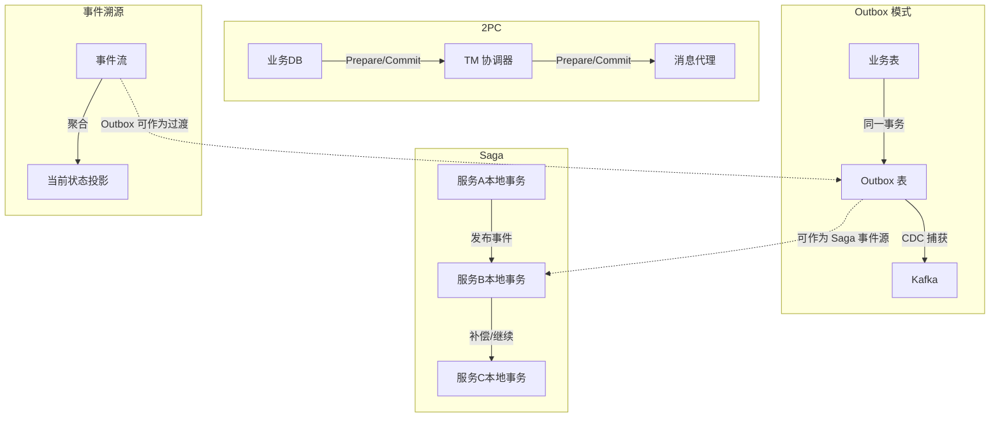
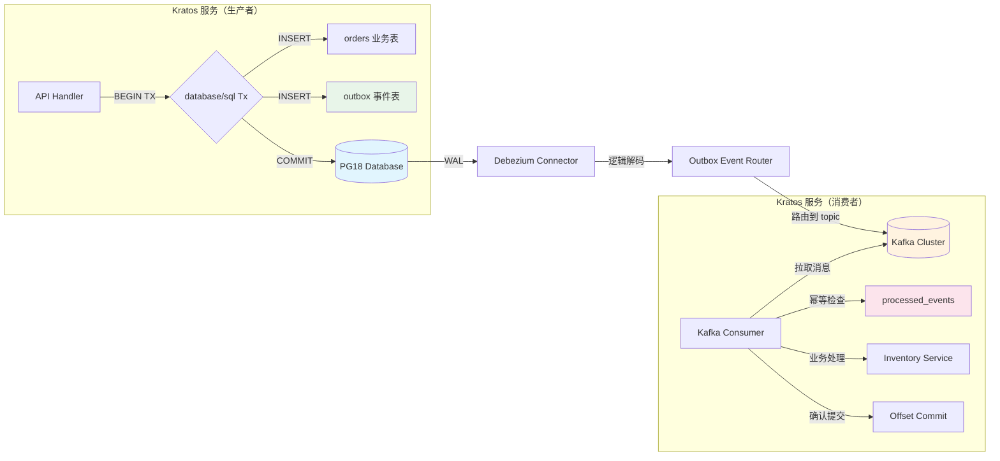
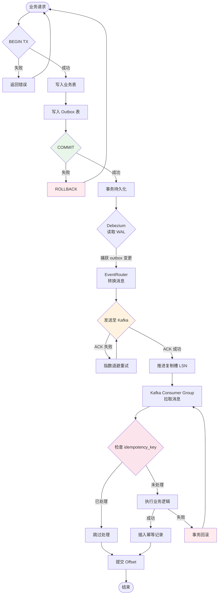

# Outbox 模式：PG18 事务 + Kratos 事件发布

> 所属阶段: TECH-STACK | 前置依赖: [02.01-postgresql-18-cdc-deep-dive.md, 02.03-kratos-microservices-framework.md] | 形式化等级: L4

## 1. 概念定义 (Definitions)

**Def-TS-03-03-01 (Outbox 模式, Outbox Pattern)**

Outbox 模式是一种在事务性数据库与消息代理之间保证事件发布一致性的架构模式。其核心思想是将待发布的事件与业务数据写入置于**同一本地事务**中，通过数据库事务的原子性保证"业务状态变更"与"事件记录"要么同时成功、要么同时回滚，从而消除分布式双写的不一致窗口。

形式化地，设业务表为 $B$，Outbox 表为 $O$，本地数据库事务为 $T_{db}$，消息代理为 $M$。Outbox 模式将原双写操作

$$
\text{write}(B, \Delta_B) ; \text{send}(M, e)
$$

重构为单事务内的本地双写：

$$
T_{db}: \{\, \text{write}(B, \Delta_B) ,\; \text{write}(O, e) \,\}
$$

其中 $e = \langle \text{id}, \text{aggregatetype}, \text{aggregateid}, \text{type}, \text{payload}, \text{created\_at} \rangle$ 为 Outbox 事件记录。下游通过 CDC（如 Debezium）捕获 $O$ 的变更并转发至 $M$，实现异步解耦[^1]。

---

**Def-TS-03-03-02 (双写问题, Dual-Write Problem)**

双写问题是指在分布式系统中，应用程序需要同时更新**持久化状态**（数据库）和**发布副作用通知**（消息代理）时，由于两个存储系统缺乏共享事务边界，可能导致状态与通知不一致的故障模式。

设数据库写操作成功事件为 $W_{db}$，消息发送成功事件为 $W_{msg}$。在无全局事务协调的情况下，存在四种可能的执行结果：

| 结果 | $W_{db}$ | $W_{msg}$ | 一致性 |
|------|----------|-----------|--------|
| 理想 | ✅ | ✅ | 一致 |
| 丢失事件 | ✅ | ❌ | **不一致**：状态已更新，下游未收到通知 |
| 幽灵事件 | ❌ | ✅ | **不一致**：下游收到通知，状态未实际更新 |
| 全失败 | ❌ | ❌ | 一致（可重试） |

Outbox 模式将消息发送从应用层移至 CDC 层，将不确定的双写转化为数据库内的原子多写，从根本上消除"丢失事件"与"幽灵事件"两类不一致。

---

**Def-TS-03-03-03 (至少一次交付, At-Least-Once Delivery)**

至少一次交付是一种消息传输语义，保证每条被成功接受的消息最终会被投递到消费者至少一次。形式化地，设生产者发送的消息序列为 $\{m_i\}_{i=1}^{n}$，消费者实际处理的消息多重集为 $\mathcal{M}$，则至少一次交付满足：

$$
\forall i \in [1, n]: m_i \in \mathcal{M} \implies \exists j: \mathcal{M}[j] = m_i \land \text{count}(\mathcal{M}, m_i) \geq 1
$$

该语义允许重复投递（$\text{count}(\mathcal{M}, m_i) > 1$），典型成因包括：生产者重试、网络超时、消费者确认丢失、Kafka 消费组重平衡等。Outbox + CDC 管道天然提供至少一次交付，因为 CDC 从 WAL 读取变更后，仅在 Kafka ACK 成功后才会推进 Debezium 偏移量；若 ACK 失败，CDC 会基于复制槽重读并重新投递[^2]。

---

**Def-TS-03-03-04 (幂等消费者, Idempotent Consumer)**

幂等消费者是指对同一消息的多次处理不会产生额外副作用的消费者组件。形式化地，设消费者处理函数为 $C: M \times S \rightarrow S$，其中 $M$ 为消息空间，$S$ 为消费者本地状态。幂等性要求：

$$
\forall m \in M, \forall s \in S: C(m, C(m, s)) = C(m, s)
$$

在工程实现中，幂等消费者通常通过**唯一标识去重**实现：为每条消息分配全局唯一 `idempotency_key`，消费者在处理前查询该 key 是否已存在；若存在则跳过处理，否则执行业务逻辑并将 key 标记为已处理。该机制将幂等性从"操作语义幂等"（如 $x := 5$）扩展为"基于去重的效果幂等"，适用于任意下游操作[^3]。

---

**Def-TS-03-03-05 (去重, Deduplication)**

去重是在至少一次交付语义下消除重复消息副作用的机制。形式化地，设消息流为 $\{m_k\}$，去重算子 $D$ 将输入流映射为无重复子序列：

$$
D(\{m_k\}) = \langle m_{k_1}, m_{k_2}, \dots \rangle \quad \text{s.t.} \quad \forall i < j: m_{k_i} \neq m_{k_j}
$$

在 PG18 + Kratos 技术栈中，去重可在以下层级实现：

1. **PG18 数据库层**：利用 Outbox 表主键（UUIDv7）的唯一索引，保证同一事件不会被重复写入 Outbox。
2. **CDC 层**：Debezium 基于 LSN 严格有序读取 WAL，同一条 WAL 记录在偏移量提交前不会被重复捕获。
3. **消费者层**：Kratos 服务在业务库中维护 `processed_events` 表，以 `idempotency_key` 为唯一键，在处理前执行 `INSERT ... ON CONFLICT DO NOTHING` 实现消费者端去重。
4. **PG18 RETURNING OLD/NEW 层**：利用 PG18 增强的 `RETURNING` 子句（如 `RETURNING OLD.*, NEW.*`），可在 UPDATE 场景中精确识别变更前后状态，辅助 CDC 事件去重与 enrich。

---

## 2. 属性推导 (Properties)

**Lemma-TS-03-03-01 (事务原子性保证 Outbox 事件不丢失)**

设数据库事务 $T$ 的 ACID 原子性保证为：$T$ 内的所有操作要么全部提交（$\text{commit}(T)$），要么全部回滚（$\text{rollback}(T)$）。若业务写 $w_B$ 与 Outbox 写 $w_O$ 均在同一事务 $T$ 内执行，则：

$$
\text{commit}(T) \implies w_B \in D_{\text{committed}} \land w_O \in D_{\text{committed}}
$$

且

$$
\text{rollback}(T) \implies w_B \notin D_{\text{committed}} \land w_O \notin D_{\text{committed}}
$$

_证明_: 由数据库事务原子性定义直接可得。$w_B$ 与 $w_O$ 作为同一事务内的两个写操作，共享相同的事务日志（WAL）边界。事务提交时，WAL 记录中包含 $w_B$ 与 $w_O$ 的变更；事务回滚时，两者均通过 MVCC 回滚段撤销。因此不存在 $w_B$ 已提交而 $w_O$ 缺失的中间状态，事件不可能在业务状态变更后丢失。∎

---

**Lemma-TS-03-03-02 (Outbox 写入顺序与 CDC 读取顺序的一致性)**

设同一事务 $T$ 内 Outbox 记录按时间顺序写入为 $o_1, o_2, \dots, o_n$。Debezium 通过逻辑解码读取 WAL 时，这些记录对应的 WAL 记录 $w_1, w_2, \dots, w_n$ 满足：

$$
\forall i < j: \text{LSN}(w_i) < \text{LSN}(w_j)
$$

_证明_: PostgreSQL WAL 是严格追加的日志结构（参见 Def-T-02-03）。同一事务内的多条 INSERT 按执行顺序产生 WAL 记录，LSN 单调递增。逻辑解码按 LSN 顺序输出变更，因此 Debezium 捕获到的 Outbox 事件顺序与写入顺序一致。∎

---

**Prop-TS-03-03-01 (Outbox + CDC 至少一次交付保证)**

在 Outbox + Debezium CDC + Kafka 管道中，只要满足以下三个条件，系统保证至少一次交付：

1. **条件 A**：业务写与 Outbox 写在同一数据库事务内提交（Lemma-TS-03-03-01）。
2. **条件 B**：Debezium 使用持久化复制槽（Replication Slot），未确认的事件不会被 WAL 清理。
3. **条件 C**：Kafka 生产者配置 `acks=all`，且 Debezium 仅在 Kafka 成功 ACK 后才提交偏移量（复制槽 confirmed_flush_lsn 推进）。

则对于任意成功提交的业务事务，其对应的 Outbox 事件必然被投递至 Kafka 至少一次。

_证明概要_: 采用反证法。假设存在某事务 $T$ 已提交，但其 Outbox 事件 $e$ 未被投递至 Kafka。

- 若 $T$ 已提交，由条件 A 知 $e$ 已持久化至 Outbox 表并生成 WAL 记录 $w_e$。
- Debezium 通过复制槽持续读取 WAL。由条件 B，$w_e$ 在 Debezium 确认消费前不会被清理，因此 Debezium 必然能读取到 $w_e$。
- Debezium 将 $e$ 发送至 Kafka。若发送失败，Debezium 不会推进复制槽的 confirmed_flush_lsn，并在重试后再次发送。由条件 C，Kafka 集群在 majority ISR 确认后才返回 ACK，保证了写入的持久性。
- 因此 $e$ 必然被成功写入 Kafka，与假设矛盾。故至少一次交付成立。∎

---

## 3. 关系建立 (Relations)

### 3.1 Outbox 与 2PC 的对比

两阶段提交（2PC, Two-Phase Commit）是实现分布式事务原子性的经典协议，通过准备（Prepare）与提交（Commit）两个阶段协调多个资源管理器。Outbox 模式与 2PC 的核心差异如下：

| 维度 | 2PC | Outbox + CDC |
|------|-----|--------------|
| 事务边界 | 跨多个资源管理器的全局事务 | 仅数据库本地事务 |
| 协调器依赖 | 需要事务协调器（TM），单点瓶颈 | 无集中协调器，CDC 为异步拉取 |
| 阻塞性 | Prepare 阶段持有锁，阻塞资源 | 不阻塞数据库锁，业务事务即时释放 |
| 可用性 | 协调器故障时参与者处于不确定状态 | 数据库可用即具备事件发布能力 |
| 性能 | 两次网络往返 + 持久化日志，延迟高 | 单次本地事务 + 异步 CDC，延迟低 |
| 语义保证 | Exactly-Once（原子提交） | At-Least-Once（需消费者幂等） |

Outbox 模式通过牺牲全局一致性的强语义（将 Exactly-Once 降级为 At-Least-Once），换取了更高的可用性与性能。在微服务架构中，这种权衡通常被接受，因为消费者端幂等性可通过去重机制低成本实现。

### 3.2 Outbox 与 Saga 的对比

Saga 模式通过将一个长事务拆分为多个本地事务，并通过补偿操作（Compensating Transaction）实现最终一致性。Outbox 与 Saga 的关系在于：

- **互补性**：Outbox 解决的是"单个服务内状态变更与事件发布的一致性"；Saga 解决的是"跨多个服务的长事务一致性"。在一个完整的分布式事务中，单个服务的 Outbox 可作为 Saga 的参与者，其发布的事件触发 Saga 的下一步本地事务。
- **事件驱动 Saga**：基于事件的 Saga（Event-Based Saga）中，服务 A 通过 Outbox 发布"订单创建"事件，服务 B 消费该事件并执行"扣减库存"本地事务，服务 B 再通过自身 Outbox 发布"库存扣减"事件，以此类推。Outbox 为 Saga 提供了可靠的事件发布基础设施。

### 3.3 Outbox 与事件溯源的对比

事件溯源（Event Sourcing）将系统状态建模为事件的聚合，状态是事件的左折叠（left fold）；业务表本身即事件流。Outbox 模式与事件溯源的关系：

- **状态存储差异**：事件溯源中业务数据通常不存储为当前状态表，而是直接以事件流为源数据；Outbox 模式中业务数据仍以关系表形式存储当前状态，Outbox 仅作为附加的事件发布通道。
- **迁移路径**：当系统从传统状态表向事件溯源演进时，Outbox 表可作为过渡方案——先将变更事件写入 Outbox，再逐步将消费者迁移为基于事件溯源的投影（Projection）模型。
- **PG18 虚拟生成列的角色**：在混合架构中，PG18 的虚拟生成列可用于从业务表当前状态派生事件 payload，减少应用层重复编码，使 Outbox 表更贴近事件溯源的"派生事件"语义。



**图 1**：Outbox 与 2PC、Saga、事件溯源的关系对比。Outbox 在复杂度与一致性之间取得了平衡，是微服务事件发布的默认推荐方案。

---

## 4. 论证过程 (Argumentation)

### 4.1 为什么需要 Outbox：双写不一致问题

在微服务架构中，一个常见的需求是：当订单服务创建订单后，需要向库存服务发送"扣减库存"事件。 naive 的实现方式是在应用层先后执行两个操作：

```go
// 伪代码：双写问题示例
db.Exec("INSERT INTO orders ...")     // 步骤 1
kafkaProducer.Send("inventory-topic", event) // 步骤 2
```

这两个步骤之间没有任何事务协调。若步骤 1 成功后、步骤 2 执行前，应用进程崩溃或 Kafka 连接中断，则订单已创建但库存服务永远不会收到通知，导致**库存超卖**或**订单状态悬空**。

Outbox 模式将步骤 2 替换为向同库 Outbox 表的 INSERT：

```go
// 伪代码：Outbox 模式
tx, _ := db.Begin()
tx.Exec("INSERT INTO orders ...")     // 业务写
tx.Exec("INSERT INTO outbox ...")     // 事件写（同一事务）
tx.Commit()
```

此时步骤 1 与步骤 2 被包裹在同一数据库事务中。任何导致 Kafka 不可用的故障都不会影响事务提交——事件已安全记录在 Outbox 表中，待 Kafka 恢复后 CDC 会自动捕获并补发。

### 4.2 PG18 实现：同一事务中写入业务表 + Outbox 表

PG18 为 Outbox 模式提供了多项增强特性：

**虚拟生成列（Virtual Generated Column）**：Outbox 表的 `aggregatetype` 字段可通过虚拟生成列从业务表外键或类型字段派生，不占用额外存储空间：

```sql
CREATE TABLE outbox (
    id UUID PRIMARY KEY DEFAULT gen_random_uuid(),
    aggregateid VARCHAR(255) NOT NULL,
    -- aggregatetype 从 aggregateid 前缀派生，不占存储
    aggregatetype VARCHAR(50) GENERATED ALWAYS AS (
        split_part(aggregateid, '-', 1)
    ) VIRTUAL,
    type VARCHAR(255) NOT NULL,
    payload JSONB NOT NULL,
    created_at TIMESTAMPTZ DEFAULT NOW()
);
```

**RETURNING OLD/NEW**：在 PG18 中，`UPDATE` 语句支持更丰富的 `RETURNING` 变体，CDC 连接器可捕获旧值与新值的完整对比，辅助下游消费者进行增量处理：

```sql
UPDATE orders SET status = 'paid' WHERE id = 'ord-123'
RETURNING OLD.*, NEW.*;
```

Debezium 可配置为捕获 `REPLICA IDENTITY FULL`，使 UPDATE 事件的 `before` 与 `after` 字段均包含完整元组，便于消费者实现基于变更 diff 的幂等处理。

### 4.3 Debezium CDC 捕获 Outbox 表变更到 Kafka

Debezium 提供专门的 **Outbox Event Router**（`io.debezium.transforms.outbox.EventRouter`），可将 Outbox 表的行记录直接路由为 Kafka 消息，并支持字段映射：

```json
{
  "transforms": "outbox",
  "transforms.outbox.type": "io.debezium.transforms.outbox.EventRouter",
  "transforms.outbox.route.by.field": "aggregatetype",
  "transforms.outbox.route.topic.replacement": "${routedByValue}.events",
  "transforms.outbox.table.field.event.timestamp": "created_at",
  "transforms.outbox.table.field.event.payload": "payload",
  "transforms.outbox.table.field.event.id": "id"
}
```

上述配置的效果是：Outbox 表中 `aggregatetype = 'order'` 的记录会被路由到 Kafka topic `order.events`，消息 key 为 `aggregateid`，消息 payload 为 `payload` 字段的 JSONB 内容。这避免了应用层直接对接 Kafka，使事件发布完全由基础设施层接管。

### 4.4 Kratos 服务消费 Kafka 事件并执行下游操作

Kratos 服务通过 `kratos-transport` 的 Kafka 消费者实现事件消费。消费者在处理事件前，首先检查 `idempotency_key` 是否已处理：

```go
func (s *Service) ProcessOrderPaidEvent(ctx context.Context, event *OrderEvent) error {
    return s.db.Transaction(func(tx *gorm.DB) error {
        // 1. 尝试写入幂等记录，若已存在则跳过
        result := tx.Exec(`
            INSERT INTO processed_events (idempotency_key, processed_at)
            VALUES (?, NOW())
            ON CONFLICT (idempotency_key) DO NOTHING
        `, event.ID)
        if result.RowsAffected == 0 {
            log.Info("Event already processed, skipping: %s", event.ID)
            return nil // 幂等跳过，不返回错误
        }

        // 2. 执行下游业务逻辑
        if err := s.inventoryClient.DeductStock(ctx, event.OrderID); err != nil {
            return err // 触发回滚，幂等记录不保留，可重试
        }

        return nil
    })
}
```

关键点在于：幂等记录的写入与下游业务操作置于**同一本地事务**中。若下游操作失败，幂等记录随事务回滚，允许消息重试；若成功，幂等记录持久化，后续重复消息将被跳过。

### 4.5 组合弹性设计

Outbox + CDC + Kratos 消费者的端到端弹性由以下四层保证：

1. **事务原子性保证**（Lemma-TS-03-03-01）：PG18 本地事务保证业务状态与 Outbox 记录的原子性。
2. **消费者幂等性设计**：基于 `idempotency_key` 的数据库唯一索引，确保同一事件的多次消费仅生效一次。
3. **重复消息去重**：
   - PG18 层：Outbox 表主键唯一索引防止重复写入。
   - CDC 层：Debezium 基于复制槽的精确一次读取（WAL 记录不会重复解码）。
   - 消费者层：`processed_events` 表唯一索引拦截重复消费。
4. **Kafka 消费组重平衡处理**：Kratos Kafka 消费者基于 `sarama` 或 `segmentio/kafka-go`，在重平衡（rebalance）时触发 `Cleanup` 回调。消费者应在此时提交当前已处理消息的偏移量，避免分区迁移后重复消费。配合幂等性设计，即使重平衡导致少量重复，也不会产生副作用。

---

## 5. 形式证明 / 工程论证 (Proof / Engineering Argument)

**Thm-TS-03-03-01 (Outbox + CDC 不依赖 2PC 的至少一次发布保证)**

设系统由 PG18 数据库 $D$、Debezium CDC 连接器 $C$、Kafka 消息代理 $K$ 与 Kratos 消费者 $S$ 组成。在以下假设下：

- **H1**：$D$ 提供严格的本地事务原子性（ACID）。
- **H2**：$C$ 使用持久化逻辑复制槽，且仅在 $K$ 返回成功 ACK 后推进复制槽 confirmed_lsn。
- **H3**：$K$ 配置 `min.insync.replicas >= 2` 与 `acks=all`，保证写入的持久性。
- **H4**：$S$ 是幂等的（Def-TS-03-03-04），即重复消费不会导致状态不一致。

则系统在不使用 2PC 的情况下，保证：

$$
\forall T \in \text{CommittedTransactions}(D): \exists e \in \text{Outbox}(T): e \in \text{Delivered}(K, S)
$$

即任意已提交事务的 Outbox 事件最终会被交付到消费者至少一次。

_证明_:

**步骤 1**：证明事件必被写入 $D$ 且生成 WAL。

对于任意事务 $T$，设其包含业务写 $w_B$ 与 Outbox 写 $w_O$。由 H1 与 Outbox 模式定义（Def-TS-03-03-01），$w_B$ 与 $w_O$ 在同一事务内。若 $T$ 提交，则 $w_O$ 已持久化至 Outbox 表，并生成 WAL 记录 $w_{\text{wal}}$。若 $T$ 回滚，则 $w_O$ 未持久化，无需进一步证明。

**步骤 2**：证明 Debezium 必然能读取到 $w_{\text{wal}}$。

Debezium 通过逻辑复制槽 $\sigma$ 消费 WAL。由 H2，$\sigma$ 的 `confirmed_flush_lsn` 仅在 Kafka ACK 成功后推进；在此之前，$w_{\text{wal}}$ 对应的 WAL 段不会被 PG18 清理（复制槽持有机制）。因此，只要 Debezium 正常运行，$w_{\text{wal}}$ 必然被逻辑解码输出。

**步骤 3**：证明 $w_{\text{wal}}$ 对应的事件必然被写入 $K$。

Debezium 将解码后的事件发送至 $K$。若发送失败（网络超时、Broker 不可用），Debezium 会基于指数退避重试，且不推进 `confirmed_flush_lsn`。由 H3，$K$ 在 majority ISR 确认后才返回 ACK，保证了消息一旦 ACK 即持久化存储于 $K$。因此，经过有限次重试（在 $K$ 最终可恢复的前提下），事件必然被成功写入 $K$。

**步骤 4**：证明消费者 $S$ 最终能消费到该事件且不产生副作用。

由 Kafka 的持久性与消费者组机制，已写入 topic 的事件会被分配给组内消费者。即使发生分区重平衡、消费者崩溃或网络分区，事件仍保留于 topic 中直至消费组重新消费。由 H4，$S$ 的幂等性保证了即使事件被重复消费（至少一次语义的固有特性），也不会导致状态不一致。

**步骤 5**：证明无需 2PC。

上述所有步骤仅依赖：

- $D$ 的本地事务原子性（H1）
- $C$ 与 $D$ 之间的拉式 CDC 机制（H2）
- $K$ 的内部复制协议（H3）
- $S$ 的幂等性（H4）

无需跨 $D$ 与 $K$ 的全局事务协调器，因此 2PC 不是必要条件。∎

---

## 6. 实例验证 (Examples)

### 6.1 PG18 表设计：业务表 + Outbox 表

```sql
-- 业务表：订单
CREATE TABLE orders (
    id UUID PRIMARY KEY DEFAULT gen_random_uuid(),
    user_id UUID NOT NULL,
    total_amount DECIMAL(18,2) NOT NULL,
    status VARCHAR(50) NOT NULL DEFAULT 'pending',
    created_at TIMESTAMPTZ DEFAULT NOW(),
    updated_at TIMESTAMPTZ DEFAULT NOW()
);

-- Outbox 表：事件发布源
CREATE TABLE outbox (
    id UUID PRIMARY KEY DEFAULT gen_random_uuid(),
    aggregatetype VARCHAR(50) GENERATED ALWAYS AS (
        split_part(aggregateid, ':', 1)
    ) VIRTUAL,
    aggregateid VARCHAR(255) NOT NULL,
    type VARCHAR(255) NOT NULL,
    payload JSONB NOT NULL,
    created_at TIMESTAMPTZ DEFAULT NOW()
);

-- 幂等处理记录表（消费者端）
CREATE TABLE processed_events (
    idempotency_key UUID PRIMARY KEY,
    event_type VARCHAR(255) NOT NULL,
    processed_at TIMESTAMPTZ DEFAULT NOW()
);

-- Outbox 表索引，加速 CDC 与消费者查询
CREATE INDEX idx_outbox_created_at ON outbox(created_at);
CREATE INDEX idx_outbox_unpublished ON outbox(created_at)
    WHERE created_at < NOW() - INTERVAL '1 hour'; -- 可用于监控延迟
```

### 6.2 Kratos 事务代码：同一 Tx 中双写

```go
package service

import (
    "context"
    "database/sql"
    "encoding/json"
    "fmt"

    "github.com/go-kratos/kratos/v2/log"
    "github.com/google/uuid"
)

type Order struct {
    ID          uuid.UUID `json:"id"`
    UserID      uuid.UUID `json:"user_id"`
    TotalAmount float64   `json:"total_amount"`
    Status      string    `json:"status"`
}

type OutboxEvent struct {
    ID            uuid.UUID       `json:"id"`
    AggregateID   string          `json:"aggregateid"`
    Type          string          `json:"type"`
    Payload       json.RawMessage `json:"payload"`
}

func (s *OrderService) CreateOrder(ctx context.Context, req *CreateOrderRequest) (*Order, error) {
    tx, err := s.db.BeginTx(ctx, &sql.TxOptions{Isolation: sql.LevelReadCommitted})
    if err != nil {
        return nil, fmt.Errorf("begin tx: %w", err)
    }
    defer func() {
        if err != nil {
            tx.Rollback()
            return
        }
        err = tx.Commit()
    }()

    // 1. 写入业务表
    order := &Order{
        ID:          uuid.Must(uuid.NewV7()),
        UserID:      req.UserID,
        TotalAmount: req.TotalAmount,
        Status:      "pending",
    }
    _, err = tx.ExecContext(ctx,
        `INSERT INTO orders (id, user_id, total_amount, status) VALUES ($1, $2, $3, $4)`,
        order.ID, order.UserID, order.TotalAmount, order.Status,
    )
    if err != nil {
        return nil, fmt.Errorf("insert order: %w", err)
    }

    // 2. 构造并写入 Outbox（同一事务）
    payload, _ := json.Marshal(order)
    event := &OutboxEvent{
        ID:          uuid.Must(uuid.NewV7()),
        AggregateID: fmt.Sprintf("order:%s", order.ID.String()),
        Type:        "OrderCreated",
        Payload:     payload,
    }
    _, err = tx.ExecContext(ctx,
        `INSERT INTO outbox (id, aggregateid, type, payload) VALUES ($1, $2, $3, $4)`,
        event.ID, event.AggregateID, event.Type, event.Payload,
    )
    if err != nil {
        return nil, fmt.Errorf("insert outbox: %w", err)
    }

    log.Context(ctx).Infof("Order %s created with outbox event %s", order.ID, event.ID)
    return order, nil
}
```

### 6.3 Debezium 捕获配置

```json
{
  "name": "pg18-outbox-connector",
  "config": {
    "connector.class": "io.debezium.connector.postgresql.PostgresConnector",
    "database.hostname": "postgres",
    "database.port": "5432",
    "database.user": "debezium",
    "database.password": "${secrets:debezium:password}",
    "database.dbname": "shop",
    "database.server.name": "shop-pg18",
    "plugin.name": "pgoutput",
    "slot.name": "debezium_outbox_slot",
    "publication.name": "dbz_publication",
    "table.include.list": "public.outbox",
    "tombstones.on.delete": "false",

    "transforms": "outbox",
    "transforms.outbox.type": "io.debezium.transforms.outbox.EventRouter",
    "transforms.outbox.route.by.field": "aggregatetype",
    "transforms.outbox.route.topic.replacement": "${routedByValue}.events",
    "transforms.outbox.table.field.event.id": "id",
    "transforms.outbox.table.field.event.key": "aggregateid",
    "transforms.outbox.table.field.event.type": "type",
    "transforms.outbox.table.field.event.payload": "payload",
    "transforms.outbox.table.field.event.timestamp": "created_at",
    "transforms.outbox.table.expand.json.payload": "true",

    "key.converter": "org.apache.kafka.connect.storage.StringConverter",
    "value.converter": "org.apache.kafka.connect.json.JsonConverter",
    "value.converter.schemas.enable": "false"
  }
}
```

### 6.4 Kratos 消费者代码

```go
package consumer

import (
    "context"
    "encoding/json"
    "fmt"

    "github.com/go-kratos/kratos/v2/log"
    "github.com/go-kratos/kratos/v2/transport/kafka"
    "github.com/google/uuid"
    "gorm.io/gorm"
)

type OrderCreatedPayload struct {
    ID          uuid.UUID `json:"id"`
    UserID      uuid.UUID `json:"user_id"`
    TotalAmount float64   `json:"total_amount"`
    Status      string    `json:"status"`
}

type OrderEventConsumer struct {
    db     *gorm.DB
    logger log.Logger
}

func (c *OrderEventConsumer) Subscribe() kafka.Handler {
    return func(ctx context.Context, msg kafka.Message) error {
        var event struct {
            ID          string          `json:"id"`
            Type        string          `json:"type"`
            Payload     json.RawMessage `json:"payload"`
            AggregateID string          `json:"aggregateid"`
        }
        if err := json.Unmarshal(msg.Value, &event); err != nil {
            return fmt.Errorf("unmarshal event: %w", err)
        }

        return c.db.Transaction(func(tx *gorm.DB) error {
            // 1. 幂等去重
            result := tx.Exec(`
                INSERT INTO processed_events (idempotency_key, event_type, processed_at)
                VALUES (?::uuid, ?, NOW())
                ON CONFLICT (idempotency_key) DO NOTHING
            `, event.ID, event.Type)

            if result.RowsAffected == 0 {
                log.NewHelper(c.logger).Infof("Duplicate event skipped: %s", event.ID)
                return nil
            }

            // 2. 业务处理
            switch event.Type {
            case "OrderCreated":
                var payload OrderCreatedPayload
                if err := json.Unmarshal(event.Payload, &payload); err != nil {
                    return fmt.Errorf("unmarshal payload: %w", err)
                }
                // 例如：发送通知、初始化物流单等
                if err := c.handleOrderCreated(ctx, tx, &payload); err != nil {
                    return err
                }
            default:
                log.NewHelper(c.logger).Warnf("Unknown event type: %s", event.Type)
            }

            return nil
        })
    }
}

func (c *OrderEventConsumer) handleOrderCreated(ctx context.Context, tx *gorm.DB, order *OrderCreatedPayload) error {
    // 下游业务逻辑，例如创建物流预订单
    log.NewHelper(c.logger).Infof("Processing OrderCreated: %s", order.ID)
    return nil
}
```

---

## 7. 可视化 (Visualizations)

### 7.1 Outbox 模式架构

以下架构图展示了 PG18 + Debezium + Kafka + Kratos 的完整 Outbox 事件管道。



**图 2**：Outbox 模式端到端架构。生产者通过同一数据库事务完成业务写与事件写；Debezium 捕获 WAL 变更并通过 Event Router 路由到 Kafka；消费者基于幂等表去重后执行业务逻辑。

### 7.2 事件发布保证流程

以下流程图展示了从业务请求到事件最终被消费者处理的完整状态转移与容错路径。



**图 3**：事件发布保证流程。绿色节点表示成功路径，粉色节点表示幂等/去重检查，红色节点表示失败回滚路径。整个流程通过事务原子性、CDC 重试与消费幂等三重机制保证至少一次交付。

---

## 8. 引用参考 (References)

[^1]: Chris Richardson, _Microservices Patterns_, Chapter 4 "Transactional messaging", Manning Publications, 2018. <https://microservices.io/patterns/data/transactional-outbox.html>

[^2]: Debezium Documentation, "Outbox Event Router", 2025. <https://debezium.io/documentation/reference/stable/transformations/outbox-event-router.html>

[^3]: AWS Architecture Blog, "Idempotency Keys and Handling Double Charges", 2023. <https://aws.amazon.com/blogs/architecture/handling-arbitrary-http-requests-in-lambda/>
