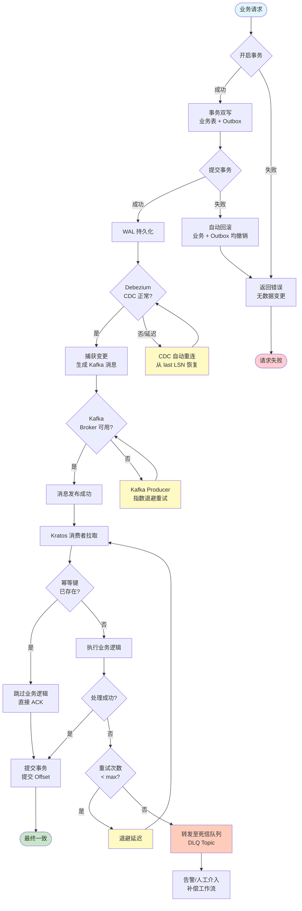

# Outbox 模式：PostgreSQL 18 事务 + Kratos 事件发布

> 所属阶段: TECH-STACK | 前置依赖: [02.01-postgresql-18-cdc-deep-dive.md, 02.03-kratos-microservices-framework.md] | 形式化等级: L4

## 1. 概念定义 (Definitions)

本节建立 Outbox 模式在 PostgreSQL 18 + Kratos 技术栈下的严格形式化定义，为后续属性推导、工程论证与实例验证奠定概念基础。

**Def-TS-03-03-01 Outbox 模式 (Outbox Pattern)**

Outbox 模式是一种保证数据库状态变更与对应领域事件原子性发布的可靠性模式。设业务服务 $S$ 的状态空间为 $\mathcal{X}$，领域事件空间为 $\mathcal{E}$。服务执行本地事务 $t: \mathcal{X} \to \mathcal{X} \times \mathcal{E}$ 时，传统"先写数据库再发消息"或"先发消息再写数据库"方案均无法保证写操作与消息发布的原子性。

Outbox 模式引入中间表 $O$（Outbox 表），将事件持久化与业务数据变更纳入同一本地事务：

$$
\forall x \in \mathcal{X},\ e \in \mathcal{E}.\quad t_{\text{outbox}}(x) = \text{commit}\left( \text{update}(x),\ \text{insert}(O, e) \right)
$$

其中 $\text{update}(x)$ 为业务表变更，$\text{insert}(O, e)$ 为 Outbox 表事件插入。二者共享同一数据库事务边界，天然满足原子性（Atomicity）。后续通过 CDC（Change Data Capture）机制异步读取 Outbox 表变更，将事件转发至消息总线（如 Kafka），实现"事务内持久化，事务外异步发布"的解耦架构。

> 直观解释：Outbox 模式如同"先写草稿再统一投递"——业务操作与事件记录先在数据库内部完成原子提交，确保事件绝不丢失；消息总线的投递则由独立的 CDC 进程异步负责，即使消息中间件瞬时不可用，事件也安全地躺在数据库中等待重试。

**Def-TS-03-03-02 事务双写 (Transactional Dual-Write)**

事务双写是指在单一数据库事务内同时执行业务数据更新与 Outbox 事件插入的操作模式。形式化地，设业务表集合为 $\mathcal{T} = \{ T_1, T_2, \ldots, T_m \}$，Outbox 表为 $O$，事务双写操作 $\tau$ 定义为：

$$
\tau = \text{BEGIN};\ \bigcup_{i=1}^{m} \Delta T_i;\ \text{insert}(O, e);\ \text{COMMIT}
$$

其中 $\Delta T_i$ 为表 $T_i$ 上的 DML 操作，$e$ 为对应的领域事件。事务双写的关键性质在于：$\tau$ 的原子性由数据库的 ACID 语义保证，即要么 $\tau$ 中所有操作全部成功持久化，要么全部回滚，不存在"业务数据已更新但事件未记录"的中间状态。

> 直观解释：事务双写是 Outbox 模式的核心实现手段。它将"双写问题"（同时更新数据库和发送消息）从"跨系统分布式操作"降维为"同一数据库内部的本地事务操作"，从而复用成熟的数据库事务机制解决原子性难题。

**Def-TS-03-03-03 至少一次交付 (At-Least-Once Delivery)**

至少一次交付是指消息系统保证每条消息被目标消费者处理至少一次的语义。形式化地，设消息 $m$ 的投递序列为 $\{ d_1, d_2, \ldots \}$，$m$ 的确认（ACK）序列为 $\{ a_1, a_2, \ldots \}$。至少一次交付要求：

$$
\forall m \in \mathcal{M}.\quad \text{commit}(m) \implies \exists a_i.\ \text{process}(d_i) \land \text{ack}(a_i)
$$

即一旦消息 $m$ 被生产者提交，必存在至少一次成功的投递与消费确认。该语义允许重复投递（Duplicate Delivery），即 $\exists i \neq j.\ d_i = d_j$，因此消费者必须设计为幂等（Idempotent）。

在 Outbox + CDC 架构中，至少一次交付由以下环节级联保证：PG18 事务提交保证事件持久化 $\to$ Debezium WAL 读取保证事件捕获 $\to$ Kafka 副本机制保证事件不丢失 $\to$ 消费者显式 ACK 保证消费确认。

**Def-TS-03-03-04 幂等消费者 (Idempotent Consumer)**

幂等消费者是指能够安全处理重复消息而不产生副作用的消费者实现。设消费者的业务处理函数为 $f: \mathcal{E} \to \mathcal{Y}$，其中 $\mathcal{E}$ 为输入事件空间，$\mathcal{Y}$ 为输出结果空间。$f$ 满足幂等性当且仅当：

$$
\forall e \in \mathcal{E}.\quad f(e) \cong f(f(e)) \cong f^n(e)
$$

其中 $\cong$ 表示业务语义等价（不要求字节级一致，但要求业务状态一致）。工程上，幂等消费者通常通过唯一性约束（如 `idempotency_key` + 数据库唯一索引）实现：在处理事件前检查该键是否已存在，若已存在则直接返回已处理结果，跳过重复执行业务逻辑。

**Def-TS-03-03-05 消息去重 (Message Deduplication)**

消息去重是指在消息投递链路中识别并消除重复消息的技术机制。设消息 $m$ 携带去重键 $k = \text{dedup_key}(m)$，去重状态空间为 $\mathcal{D}$（如数据库表或缓存），去重算子 $\delta$ 定义为：

$$
\delta(m) = \begin{cases}
\text{process}(m) & \text{if } k \notin \mathcal{D} \\
\text{skip}(m) & \text{if } k \in \mathcal{D}
\end{cases}
$$

在 PG18 + Kratos 技术栈中，消息去重通常由消费者端通过 PG18 唯一约束（`UNIQUE(idempotency_key)`）实现。重复消息尝试插入已存在的 `idempotency_key` 时将触发唯一性冲突，消费者捕获该冲突并视为幂等成功，从而将去重语义下沉至数据库层，避免引入额外的分布式锁或外部缓存依赖。

## 2. 属性推导 (Properties)

从上述定义出发，可直接推导出 Outbox 模式在 PG18 + Kratos 技术栈下的核心可靠性性质。

**Lemma-TS-03-03-01 事务原子性保证事件不丢失**

设 PG18 本地事务为 $\tau$，其 ACID 原子性保证：$\tau$ 的提交状态为二元值 $s \in \{ \text{committed}, \text{aborted} \}$。Outbox 事件 $e$ 的插入操作 $\text{insert}(O, e)$ 是 $\tau$ 的子操作，因此：

$$
s = \text{committed} \implies e \in O \quad \land \quad s = \text{aborted} \implies e \notin O
$$

即事件 $e$ 被持久化到 Outbox 表当且仅当业务事务成功提交。由于 Debezium CDC 仅读取已提交事务的 WAL 记录（PG18 `REPLICA IDENTITY` 配置下），事件 $e$ 必被 Debezium 捕获并转发至 Kafka。由此可得：

$$
\text{business commit} \implies \text{event in Outbox} \implies \text{event captured by CDC} \implies \text{event published to Kafka}
$$

因此，只要业务事务成功提交，对应领域事件绝不会丢失。QED.

**Lemma-TS-03-03-02 幂等性保证重复消费无副作用**

设消费者处理函数为 $f$，事件 $e$ 的去重键为 $k_e$。消费者端维护已处理键集合 $\mathcal{D}$，其一致性由 PG18 `UNIQUE` 约束保证。当重复事件 $e'$ 到达时（$\text{dedup_key}(e') = k_e \in \mathcal{D}$），消费者尝试插入 $k_e$ 将触发 `23505 unique_violation` 异常。捕获异常后消费者返回成功（语义上等价于 $f(e') = f(e)$），因此：

$$
\forall n \geq 1.\quad f^n(e) \cong f(e)
$$

即无论事件被消费多少次，系统最终状态与仅消费一次时业务语义等价。QED.

**Prop-TS-03-03-01 Outbox + CDC + 幂等消费者 实现最终一致性**

设系统初始状态为 $S_0$，业务操作序列 $\langle o_1, o_2, \ldots, o_n \rangle$ 产生期望的最终状态 $S_n^*$。在 Outbox 架构下，每个操作 $o_i$ 产生事件 $e_i$，事件经 CDC 异步传播至消费者，消费者 $c_j$ 处理事件后更新读模型或触发下游操作。

由 Lemma-TS-03-03-01，所有已提交业务操作对应的事件必被发布；由 Lemma-TS-03-03-02，所有消费者安全处理重复事件。因此存在有限时间 $T$，使得所有消费者完成对所有已发布事件的处理，且系统状态收敛至 $S_n^*$。形式化地：

$$
\exists T < \infty.\quad \forall t \geq T.\quad S_t = S_n^*
$$

此即最终一致性（Eventual Consistency）的定义。QED.

## 3. 关系建立 (Relations)

Outbox 模式并非解决"分布式事务下消息发布"问题的唯一方案。本节将其与 2PC、Saga、本地消息表三种相关模式进行系统性对比，明确各自适用边界。

### 3.1 Outbox vs. 两阶段提交 (2PC)

| 维度 | Outbox 模式 | 2PC (Two-Phase Commit) |
|------|------------|------------------------|
| 原子性保证 | 单数据库本地事务 | 跨多个资源的分布式原子提交 |
| 协调器依赖 | 无（数据库即协调者） | 需要全局事务协调器（TM） |
| 性能特征 | 与单事务写性能等价，无额外网络 RTT | 两阶段投票 + 锁定，延迟高、吞吐低 |
| 容错能力 | 数据库崩溃恢复即保证一致性 | 协调器单点故障可能导致悬挂事务 |
| 适用场景 | 单数据库 + 消息总线的微服务 | 跨异构数据库的强一致性事务 |

**关系结论**：Outbox 是 2PC 在"单数据库 + 异步消息"场景下的轻量级替代。当业务事务与消息发布可共享同一数据库时，Outbox 避免了 2PC 的协调器复杂性与性能损耗；只有当业务数据分散在多个异构数据库时，才需要引入 2PC 或 Saga。

### 3.2 Outbox vs. Saga 模式

| 维度 | Outbox 模式 | Saga 模式 |
|------|------------|-----------|
| 一致性模型 | 最终一致性（事务内强一致 + 异步最终一致） | 最终一致性（补偿机制） |
| 失败处理 | CDC 重试 + 消费者幂等 | 显式补偿事务（Compensation） |
| 语义复杂度 | 低：同一事务内双写即可 | 高：需定义正向操作与补偿操作对 |
| 业务流程侵入 | 低：仅增加 Outbox 表插入 | 高：需将业务拆分为可补偿步骤 |
| 适用场景 | 事件驱动微服务内"写库+发事件" | 长事务跨服务编排（如订单-库存-支付链） |

**关系结论**：Outbox 解决的是"单个服务内部如何可靠地对外发布事件"问题；Saga 解决的是"多个服务之间如何协调长事务"问题。二者在复杂业务中可以组合使用：Saga 的每个本地事务内部采用 Outbox 模式发布领域事件，既保证单服务内事件不丢失，又通过 Saga 协调器管理跨服务一致性。

### 3.3 Outbox vs. 本地消息表 (Local Message Table)

本地消息表是 Outbox 模式在缺乏 CDC 基础设施时的替代实现。其基本思路与 Outbox 相同：同一事务内写入业务数据与消息记录；区别在于消息表由应用层轮询（Polling）读取并主动发送至消息总线，而非由 CDC 捕获 WAL 变更。

| 维度 | Outbox + CDC | 本地消息表 + 轮询 |
|------|-------------|------------------|
| 事件延迟 | 低：WAL 流实时捕获（毫秒级） | 高：依赖轮询间隔（秒级） |
| 系统耦合 | 低：CDC 独立于业务应用 | 高：轮询逻辑嵌入应用进程 |
| 资源开销 | 低：WAL 顺序读取，无额外查询 | 高：轮询产生周期性数据库查询负载 |
| 实现复杂度 | 中：需部署 Debezium/Kafka Connect | 低：纯应用层实现 |
| 顺序保证 | 强：WAL 顺序即事件顺序 | 弱：轮询顺序可能受并发插入影响 |

**关系结论**：本地消息表是 Outbox 模式的退化实现，适用于短期过渡或 CDC 基础设施尚未就绪的场景。在 PG18 + Kafka 技术栈中，Debezium 提供了成熟、低延迟、低耦合的 CDC 能力，因此推荐直接使用 Outbox + CDC 方案。

## 4. 论证过程 (Argumentation)

### 4.1 为什么需要 Outbox：避免"发布-然后-写数据库"的原子性问题

在微服务架构中，服务完成业务操作后通常需要向消息总线发布领域事件，以通知其他服务。常见的 naive 实现有两种：

1. **先写数据库，后发消息**：

   ```
   BEGIN; UPDATE orders SET status='PAID'; COMMIT;
   kafkaProducer.send(OrderPaidEvent); // 可能失败！
   ```

   风险：数据库事务已提交，但消息发送失败（Kafka 瞬时不可用、网络分区、应用崩溃）。下游服务永远收不到 `OrderPaidEvent`，系统进入不一致状态。

2. **先发消息，后写数据库**：

   ```
   kafkaProducer.send(OrderPaidEvent); // 发送成功
   BEGIN; UPDATE orders SET status='PAID'; ROLLBACK; // 业务失败！
   ```

   风险：消息已发出，但数据库事务回滚。下游服务收到事件并执行操作（如扣减库存），而上游服务并未真正完成支付，导致数据不一致。

Outbox 模式通过**事务双写**将两种操作纳入同一原子边界，彻底消除上述两类风险。无论 CDC 后续是否成功捕获、Kafka 是否可用，已提交事务中的事件绝不会丢失；若事务回滚，事件也不会被记录，下游不会收到虚假事件。

### 4.2 PG18 实现：同一事务内写入业务表 + Outbox 表

PostgreSQL 18 提供了完善的本地事务语义与 WAL 基础设施，是 Outbox 模式的理想载体。在 Kratos 服务中，使用 `database/sql` 的 `BeginTx` 手动管理事务，确保业务更新与 Outbox 插入共享同一事务边界。

核心实现要点：

- Outbox 表主键采用 **UUIDv7**，天然保证时间有序性，避免 UUIDv4 的随机插入导致的索引页分裂与 WAL 放大。
- 利用 PG18 **虚拟生成列**（`GENERATED ALWAYS AS ... VIRTUAL`）为 Outbox 表的 `aggregate_type` 等派生字段创建索引，加速 CDC 过滤与查询。
- 配置表级 `REPLICA IDENTITY FULL`，确保 Debezium 能捕获 Outbox 表插入的完整行数据。

### 4.3 Debezium CDC 捕获 Outbox 表变更到 Kafka

Debezium PostgreSQL Connector 通过逻辑解码槽（Logical Decoding Slot）持续读取 PG18 WAL 流。当 Outbox 表发生插入时，Debezium 捕获变更记录并转换为 Kafka Connect 结构体。

借助 **Debezium Outbox Event Router** (`io.debezium.transforms.outbox.EventRouter`)，CDC 流可自动完成以下转换：

- 将 Outbox 表的 `aggregate_type` + `aggregate_id` 映射为 Kafka 消息 Key，保证同一聚合的事件顺序消费。
- 将 `event_type` 映射为 Kafka 消息头（Header）或 Topic 路由键。
- 将 `payload` 作为 Kafka 消息体（Value），支持 JSON/Avro 序列化。

该转换发生在 Kafka Connect 进程内部，对业务服务完全透明，实现了"业务只写 Outbox，消息格式由 CDC 层统一路由"的解耦。

### 4.4 Kratos 消费者消费 Kafka 事件并执行业务逻辑

Kratos 服务作为 Kafka 消费者，通过 `sarama` 或 `segmentio/kafka-go` 等客户端订阅 Outbox 事件 Topic。消费者处理流程遵循标准幂等模式：

1. 解析 Kafka 消息，提取 `idempotency_key`（通常由 `aggregate_type:aggregate_id:event_type:created_at` 组合或 UUIDv7 生成）。
2. 开启本地数据库事务。
3. 尝试将 `idempotency_key` 插入幂等性表（带 `UNIQUE` 约束）。
4. 若插入成功，执行业务逻辑（更新读模型、调用下游服务等）。
5. 提交事务；若任何步骤失败，回滚事务且不提交 Kafka Offset，触发重试。
6. 若插入触发唯一性冲突，说明该事件已处理，直接提交 Kafka Offset（跳过业务逻辑）。

### 4.5 组合弹性：四层防线设计

Outbox + CDC + Kafka + Kratos 消费者的完整链路通过四层防线实现端到端弹性：

**第一层：事务原子性保证"至少一次"发布**
由 PG18 ACID 事务保证。只要业务操作提交，事件必进入 Outbox 表；只要事件在表中，Debezium 必能捕获。这是整个链路可靠性的基石。

**第二层：消费者幂等性设计**
消费者通过 `idempotency_key` + 数据库唯一约束实现幂等。即使 Kafka 因重平衡、客户端重启等原因重复投递同一消息，消费者的处理结果始终语义一致。

**第三层：重复消息去重（idempotency key + PG18 唯一约束）**
去重不依赖外部缓存（如 Redis），而是直接利用 PG18 的唯一索引。这一设计消除了缓存失效、网络分区等额外故障点，将去重语义与业务数据存储统一。

**第四层：Kafka DLQ 处理失败消息**
对于真正的业务处理失败（非幂等冲突、非网络抖动），消费者配置 `max.retries` 与死信队列（Dead Letter Queue, DLQ）。超过重试阈值的消息被转发至 DLQ Topic，由运维或补偿工作流人工/自动处理，避免阻塞主消费链路。

## 5. 形式证明 / 工程论证 (Proof / Engineering Argument)

**Thm-TS-03-03-01 Outbox + CDC + 幂等消费者实现最终一致性的正确性**

**定理陈述**：在以下假设成立的前提下，由 Outbox 模式、Debezium CDC 与幂等消费者组成的分布式系统满足最终一致性（Eventual Consistency）：

- **A1**（数据库持久性）：PG18 已提交事务的数据变更在数据库崩溃后可恢复（WAL 持久化）。
- **A2**（CDC 完备性）：Debezium 逻辑解码槽能读取所有已提交事务的 WAL 记录，且不遗漏、不重复（按 LSN 顺序推进）。
- **A3**（消息总线持久性）：Kafka 配置 `acks=all` 与 `min.insync.replicas >= 2`，保证已确认发布的消息在 Broker 故障时不丢失。
- **A4**（消费者幂等性）：消费者通过 `idempotency_key` 与数据库唯一约束实现幂等处理。
- **A5**（进度可追踪性）：Kafka Consumer Group 的 Offset 提交与业务处理共享同一本地事务，或 Offset 在业务事务提交后异步提交。

**证明**：

我们证明系统满足最终一致性的两个核心条件：（1）**无遗漏**（No Omission）：所有已提交业务操作对应的事件最终被所有相关消费者处理；（2）**收敛**（Convergence）：消费者处理完成后，系统状态收敛至与操作序列语义一致的状态。

**步骤 1：无遗漏性**

设业务服务在时刻 $t_0$ 成功提交事务 $\tau$，其包含业务更新 $\Delta x$ 与 Outbox 插入 $e$。

由 **A1**，$\tau$ 的 WAL 记录已持久化到磁盘。Debezium 在时刻 $t_1 > t_0$ 读取 WAL 时，由 **A2** 保证 $e$ 被捕获并转换为 Kafka 消息 $m_e$。Kafka Producer 发送 $m_e$ 后，由 **A3** 保证 $m_e$ 在 Kafka 集群中持久化。

消费者 $c$ 在时刻 $t_2 > t_1$ 拉取到 $m_e$。若 $c$ 成功处理 $m_e$（幂等表插入成功 + 业务逻辑执行 + 事务提交），则 $m_e$ 被消费。若处理失败（如应用崩溃），Kafka Offset 未被提交，$c$ 重平衡后重新消费 $m_e$。由 **A4**，即使 $m_e$ 被重复投递多次，处理结果语义一致。

因此，只要 $\tau$ 提交，$e$ 必被处理。无遗漏性得证。

**步骤 2：收敛性**

设业务操作序列为 $\langle o_1, o_2, \ldots, o_n \rangle$，每个操作 $o_i$ 在本地事务内更新业务状态并产生事件 $e_i$。由步骤 1，所有 $e_i$ 最终被消费者处理。

消费者处理 $e_i$ 时，要么：（a）首次处理，执行业务逻辑并更新消费者本地状态 $s_i$；（b）重复处理，由 **A4** 跳过业务逻辑，本地状态保持 $s_i$ 不变。

因此，消费者本地状态序列为单调演进序列 $\langle s_0, s_1, \ldots, s_n \rangle$，其中 $s_i$ 仅由首次处理的 $e_i$ 决定。由于事件总数有限（$n < \infty$），存在有限时间 $T$ 使得所有事件处理完毕，消费者状态收敛至 $s_n$。

$s_n$ 与操作序列 $\langle o_1, \ldots, o_n \rangle$ 语义一致，因为每个 $e_i$ 由 $o_i$ 在同一事务内原子产生，$e_i$ 的业务语义与 $o_i$ 的副作用完全对应。收敛性得证。

**结论**：由无遗漏性与收敛性，系统满足最终一致性。QED.

**工程注释**：

- 假设 **A5** 中，若 Offset 提交与业务事务分离（先提交业务事务，再异步提交 Offset），存在极小概率的重复消费窗口（业务已处理但 Offset 未提交时消费者崩溃）。该窗口由消费者幂等性（**A4**）覆盖，不影响最终一致性，仅增加一次无意义的重复处理。
- 假设 **A2** 中，Debezium 逻辑解码槽的推进位置（confirmed_flush_lsn）持久化于 PG18 `pg_replication_slots` 系统表，Debezium 进程重启后从该 LSN 恢复，保证不遗漏、不重复。

## 6. 实例验证 (Examples)

本节提供一个完整的工程实例：基于 Kratos + PG18 + Debezium + Kafka 的 Outbox 模式端到端实现。

### 6.1 Outbox 表结构（PG18）

```sql
-- Outbox 表定义：使用 UUIDv7 主键，保证时间有序
CREATE EXTENSION IF NOT EXISTS "uuid-ossp";

CREATE TABLE IF NOT EXISTS outbox_events (
    id UUID PRIMARY KEY DEFAULT uuid_generate_v7(),
    aggregate_type VARCHAR(128) NOT NULL,
    aggregate_id VARCHAR(256) NOT NULL,
    event_type VARCHAR(256) NOT NULL,
    payload JSONB NOT NULL,
    created_at TIMESTAMPTZ NOT NULL DEFAULT NOW(),

    -- PG18 虚拟生成列：用于基于 event_type 的快速索引与过滤
    event_category VARCHAR(64)
        GENERATED ALWAYS AS (payload->>'category') VIRTUAL,

    -- 支持按聚合查询与 CDC 路由
    CONSTRAINT uk_outbox_aggregate UNIQUE (aggregate_type, aggregate_id, event_type, created_at)
);

-- 时间有序索引：CDC 按时间窗口读取、运维清理历史数据
CREATE INDEX idx_outbox_created_at ON outbox_events(created_at);

-- 事件类型索引：支持按类别快速过滤
CREATE INDEX idx_outbox_event_category ON outbox_events(event_category)
    WHERE event_category IS NOT NULL;

-- 幂等性表：消费者端去重使用
CREATE TABLE IF NOT EXISTS idempotency_keys (
    idempotency_key VARCHAR(512) PRIMARY KEY,
    processed_at TIMESTAMPTZ NOT NULL DEFAULT NOW(),
    event_id UUID REFERENCES outbox_events(id)
);

-- REPLICA IDENTITY FULL 确保 Debezium 捕获完整行数据
ALTER TABLE outbox_events REPLICA IDENTITY FULL;
```

### 6.2 Kratos 服务内事务双写

```go
package order

import (
    "context"
    "database/sql"
    "fmt"
    "time"

    "github.com/go-kratos/kratos/v2/log"
    "github.com/google/uuid"
)

// OutboxEvent Outbox 事件结构体
type OutboxEvent struct {
    ID            uuid.UUID
    AggregateType string
    AggregateID   string
    EventType     string
    Payload       []byte
    CreatedAt     time.Time
}

// OrderRepository 订单仓储
type OrderRepository struct {
    db  *sql.DB
    log *log.Helper
}

// PayOrder 支付订单：事务双写业务表 + Outbox 表
func (r *OrderRepository) PayOrder(ctx context.Context, orderID string, amount int64) error {
    tx, err := r.db.BeginTx(ctx, &sql.TxOptions{Isolation: sql.LevelReadCommitted})
    if err != nil {
        return fmt.Errorf("begin tx: %w", err)
    }
    // 确保事务回滚（若未提交）
    defer func() {
        if err != nil {
            if rbErr := tx.Rollback(); rbErr != nil {
                r.log.Errorf("tx rollback failed: %v", rbErr)
            }
        }
    }()

    // 1. 更新业务表：订单状态变更为 PAID
    const updateOrderSQL = `
        UPDATE orders
        SET status = 'PAID', paid_at = NOW(), updated_at = NOW()
        WHERE id = $1 AND status = 'PENDING'
        RETURNING id
    `
    var updatedID string
    if err = tx.QueryRowContext(ctx, updateOrderSQL, orderID).Scan(&updatedID); err != nil {
        if err == sql.ErrNoRows {
            return fmt.Errorf("order not found or already paid: %s", orderID)
        }
        return fmt.Errorf("update order: %w", err)
    }

    // 2. 构建领域事件
    payload := fmt.Sprintf(`{"order_id":"%s","amount":%d,"paid_at":"%s"}`,
        orderID, amount, time.Now().UTC().Format(time.RFC3339))

    event := OutboxEvent{
        ID:            uuid.Must(uuid.NewV7()),
        AggregateType: "order",
        AggregateID:   orderID,
        EventType:     "OrderPaid",
        Payload:       []byte(payload),
        CreatedAt:     time.Now().UTC(),
    }

    // 3. 同一事务内写入 Outbox 表
    const insertOutboxSQL = `
        INSERT INTO outbox_events (id, aggregate_type, aggregate_id, event_type, payload, created_at)
        VALUES ($1, $2, $3, $4, $5, $6)
    `
    _, err = tx.ExecContext(ctx, insertOutboxSQL,
        event.ID, event.AggregateType, event.AggregateID,
        event.EventType, event.Payload, event.CreatedAt)
    if err != nil {
        return fmt.Errorf("insert outbox: %w", err)
    }

    // 4. 提交事务：业务更新与事件记录原子持久化
    if err = tx.Commit(); err != nil {
        return fmt.Errorf("commit tx: %w", err)
    }

    r.log.Infof("order paid and outbox event written: order=%s, event=%s", orderID, event.ID)
    return nil
}
```

### 6.3 Debezium 捕获配置（Outbox Event Router）

```json
{
  "name": "pg18-outbox-connector",
  "config": {
    "connector.class": "io.debezium.connector.postgresql.PostgresConnector",
    "database.hostname": "postgres18",
    "database.port": "5432",
    "database.user": "debezium",
    "database.password": "${secrets:debezium:password}",
    "database.dbname": "orders_db",
    "database.server.name": "pg18",

    "plugin.name": "pgoutput",
    "slot.name": "debezium_outbox_slot",
    "publication.name": "dbz_publication",
    "publication.autocreate.mode": "filtered",
    "table.include.list": "public.outbox_events",

    "transforms": "outbox",
    "transforms.outbox.type": "io.debezium.transforms.outbox.EventRouter",
    "transforms.outbox.route.by.field": "aggregate_type",
    "transforms.outbox.route.topic.replacement": "${routedByValue}.events",
    "transforms.outbox.table.field.event.id": "id",
    "transforms.outbox.table.field.event.key": "aggregate_id",
    "transforms.outbox.table.field.event.type": "event_type",
    "transforms.outbox.table.field.event.timestamp": "created_at",
    "transforms.outbox.table.fields.additional.placement": "aggregate_id:envelope:key,event_type:header:event_type",

    "key.converter": "org.apache.kafka.connect.json.JsonConverter",
    "key.converter.schemas.enable": "false",
    "value.converter": "org.apache.kafka.connect.json.JsonConverter",
    "value.converter.schemas.enable": "false",

    "tombstones.on.delete": "false",
    "poll.interval.ms": "100"
  }
}
```

配置说明：

- `table.include.list` 限定仅捕获 `outbox_events` 表，避免全量 CDC 开销。
- `transforms.outbox.type` 启用 Debezium 官方 Outbox Event Router，自动将 Outbox 行映射为 Kafka 标准消息格式。
- `route.by.field` 按 `aggregate_type` 路由 Topic，如 `order.events`、`inventory.events`。
- `additional.placement` 将 `aggregate_id` 放入 Kafka Key，`event_type` 放入 Header，便于下游消费者路由与过滤。

### 6.4 Kratos 消费者幂等处理

```go
package consumer

import (
    "context"
    "database/sql"
    "encoding/json"
    "fmt"
    "time"

    "github.com/IBM/sarama"
    "github.com/go-kratos/kratos/v2/log"
)

// OrderPaidEvent 支付事件结构
type OrderPaidEvent struct {
    OrderID string `json:"order_id"`
    Amount  int64  `json:"amount"`
    PaidAt  string `json:"paid_at"`
}

// EventConsumer Kafka 消费者
type EventConsumer struct {
    db  *sql.DB
    log *log.Helper
}

// ConsumeClaim sarama ConsumerGroupHandler 接口实现
func (c *EventConsumer) ConsumeClaim(session sarama.ConsumerGroupSession, claim sarama.ConsumerGroupClaim) error {
    for msg := range claim.Messages() {
        if err := c.processMessage(session.Context(), msg); err != nil {
            c.log.Errorf("process message failed: key=%s, err=%v", string(msg.Key), err)
            // 不提交 Offset，触发重试；超过阈值后转入 DLQ（由外部拦截器处理）
            continue
        }
        session.MarkMessage(msg, "")
    }
    return nil
}

// processMessage 幂等消息处理
func (c *EventConsumer) processMessage(ctx context.Context, msg *sarama.ConsumerMessage) error {
    // 提取 idempotency key：aggregate_type + aggregate_id + event_type + 时间戳哈希
    idempotencyKey := fmt.Sprintf("%s:%s:%d", string(msg.Key), string(msg.Topic), msg.Offset)

    tx, err := c.db.BeginTx(ctx, &sql.TxOptions{Isolation: sql.LevelReadCommitted})
    if err != nil {
        return fmt.Errorf("begin tx: %w", err)
    }
    defer func() {
        if err != nil {
            _ = tx.Rollback()
        }
    }()

    // 1. 尝试插入幂等键：利用 PG18 UNIQUE 约束实现原子去重
    const insertIdempotencySQL = `
        INSERT INTO idempotency_keys (idempotency_key, processed_at)
        VALUES ($1, NOW())
        ON CONFLICT (idempotency_key) DO NOTHING
        RETURNING idempotency_key
    `
    var returnedKey string
    err = tx.QueryRowContext(ctx, insertIdempotencySQL, idempotencyKey).Scan(&returnedKey)

    if err == sql.ErrNoRows {
        // 唯一冲突：消息已处理，直接提交事务并视为成功
        c.log.Infof("duplicate message skipped: %s", idempotencyKey)
        return tx.Commit()
    }
    if err != nil {
        return fmt.Errorf("insert idempotency key: %w", err)
    }

    // 2. 首次处理：解析事件并执行业务逻辑（如更新读模型、通知物流系统）
    var event OrderPaidEvent
    if err = json.Unmarshal(msg.Value, &event); err != nil {
        return fmt.Errorf("unmarshal event: %w", err)
    }

    const updateReadModelSQL = `
        INSERT INTO order_read_model (order_id, status, amount, paid_at, updated_at)
        VALUES ($1, 'PAID', $2, $3, NOW())
        ON CONFLICT (order_id) DO UPDATE SET
            status = EXCLUDED.status,
            amount = EXCLUDED.amount,
            paid_at = EXCLUDED.paid_at,
            updated_at = NOW()
    `
    paidAt, _ := time.Parse(time.RFC3339, event.PaidAt)
    _, err = tx.ExecContext(ctx, updateReadModelSQL, event.OrderID, event.Amount, paidAt)
    if err != nil {
        return fmt.Errorf("update read model: %w", err)
    }

    c.log.Infof("message processed: order=%s, amount=%d", event.OrderID, event.Amount)

    // 3. 提交事务：幂等键与业务更新原子持久化
    if err = tx.Commit(); err != nil {
        return fmt.Errorf("commit tx: %w", err)
    }
    return nil
}

// Setup / Cleanup 满足 sarama.ConsumerGroupHandler 接口
func (c *EventConsumer) Setup(_ sarama.ConsumerGroupSession) error   { return nil }
func (c *EventConsumer) Cleanup(_ sarama.ConsumerGroupSession) error { return nil }
```

## 7. 可视化 (Visualizations)

### 7.1 Outbox 模式数据流

以下 Mermaid 图展示了从 Kratos 业务服务的事务双写，到 Debezium CDC 捕获，再到 Kafka 投递与 Kratos 消费者幂等处理的完整数据流。

```mermaid
graph LR
    subgraph KratosService["Kratos 业务服务"]
        A[业务操作<br/>BEGIN] --> B[更新业务表]
        B --> C[插入 Outbox 表]
        C --> D[COMMIT]
    end

    subgraph PostgreSQL18["PostgreSQL 18"]
        D --> E[WAL 日志持久化]
        E --> F[逻辑解码槽<br/>pgoutput]
    end

    subgraph CDC["Debezium CDC"]
        F --> G[读取 WAL 变更]
        G --> H[Outbox Event Router]
        H --> I[转换为 Kafka 消息]
    end

    subgraph MessageBus["Kafka 消息总线"]
        I --> J[Topic: order.events]
        J --> K[Consumer Group]
    end

    subgraph Consumer["Kratos 消费者"]
        K --> L[提取 idempotency_key]
        L --> M{已处理?}
        M -->|否| N[执行业务逻辑]
        M -->|是| O[跳过/ACK]
        N --> P[提交事务]
        O --> P
        P --> Q[提交 Offset]
    end

    style KratosService fill:#e1f5fe
    style PostgreSQL18 fill:#fff3e0
    style CDC fill:#e8f5e9
    style MessageBus fill:#fce4ec
    style Consumer fill:#f3e5f5
```



### 7.2 失败恢复流程

以下流程图展示了 Outbox 链路中各环节出现故障时的恢复机制，涵盖事务回滚、CDC 延迟、消费者重试与 DLQ 兜底。



### 3.3 项目知识库交叉引用

本文档描述的 Outbox 模式与项目现有知识库存在以下关联：

- [Flink CDC Debezium 集成指南](../../Flink/05-ecosystem/05.01-connectors/04.04-cdc-debezium-integration.md) — Debezium 读取 WAL 实现 Outbox 事件投递的技术细节
- [Flink CDC 3.0 数据集成](../../Flink/05-ecosystem/05.01-connectors/flink-cdc-3.0-data-integration.md) — CDC 管道与 Outbox 模式的端到端集成
- [事务流处理深度解析](../../Knowledge/06-frontier/transactional-stream-processing-deep-dive.md) — Outbox 与 Saga/2PC 在事务语义层面的对比
- [数据网格流式集成](../../Knowledge/03-business-patterns/data-mesh-streaming-integration.md) — Outbox 作为数据网格事件发布原语的实践

## 8. 引用参考 (References)
