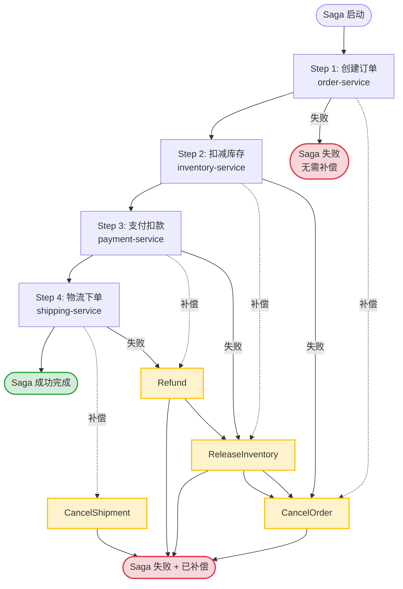
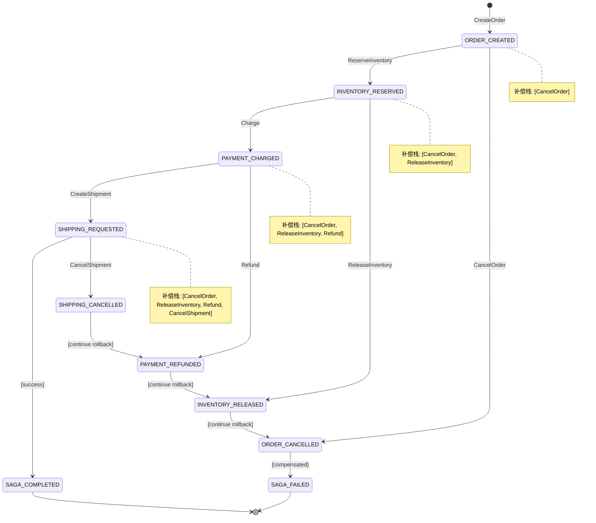

# Saga 分布式事务：Temporal 编排 + Kratos 活动执行

> 所属阶段: TECH-STACK | 前置依赖: [02.02-temporal-workflow-engine-guide.md, 02.03-kratos-microservices-framework.md] | 形式化等级: L4

## 1. 概念定义 (Definitions)

本节建立 Saga 分布式事务模式在 Temporal + Kratos 技术栈下的严格形式化定义，为后续属性推导、工程论证与实例验证奠定概念基础。

**Def-T-03-04-01 Saga 模式 (Saga Pattern)**

Saga 模式是一种用于管理跨多个服务数据一致性的分布式事务模式。它将一个长事务（Long-Lived Transaction, LLT）分解为一系列本地事务 $T = \langle t_1, t_2, \ldots, t_n \rangle$，其中每个本地事务 $t_i$ 仅在单个服务的边界内执行，并更新该服务的数据库。对于每个本地事务 $t_i$，定义其对应的补偿事务（Compensating Transaction）$c_i$，满足 $c_i \circ t_i = \text{id}$（在业务语义层面恢复到 $t_i$ 执行前的状态）。若序列中某个 $t_k$ 失败，则 Saga 执行补偿序列 $C = \langle c_{k-1}, c_{k-2}, \ldots, c_1 \rangle$，以撤销已成功的本地事务效果。

形式化地，设 Saga 为二元组 $\mathcal{S} = (T, C)$，其中 $T = \langle t_1, \ldots, t_n \rangle$ 为正向事务序列，$C = \langle c_1, \ldots, c_n \rangle$ 为对应的补偿事务序列。Saga 的执行语义为：

$$
\text{exec}(\mathcal{S}) = \begin{cases}
t_n \circ \cdots \circ t_1 & \text{if } \forall i \in [1,n].\ t_i\ \text{succeeds} \\
c_{k-1} \circ \cdots \circ c_1 & \text{if } t_k\ \text{fails}, k > 1 \\
\text{noop} & \text{if } t_1\ \text{fails}
\end{cases}
$$

> 直观解释：Saga 放弃了 ACID 的隔离性（Isolation），通过显式的补偿机制换取可用性与分区容错性。它不是数据库层面的原子提交协议，而是应用层的一致性协议。

**Def-T-03-04-02 编排式 Saga (Orchestration Saga)**

编排式 Saga 由一个中心协调器（Orchestrator）集中控制 Saga 的执行顺序。协调器维护 Saga 的状态机，按预定义顺序调用各参与服务的正向操作；当检测到某步骤失败时，协调器主动触发已执行步骤的补偿操作。形式化地，设协调器为状态机 $\mathcal{O} = (Q, \Sigma, \delta, q_0, F)$，其中 $Q$ 为状态集合（如 `ORDER_CREATED`, `INVENTORY_RESERVED`, `PAYMENT_CHARGED`, `SHIPPING_REQUESTED`），$\Sigma$ 为事件字母表（服务响应：成功/失败/超时），$\delta: Q \times \Sigma \to Q \cup \{q_{comp}\}$ 为状态转移函数，$q_{comp}$ 为进入补偿链的复合状态。

在 Temporal 技术栈中，Temporal Workflow 天然承担协调器角色：Workflow 代码定义 Saga 的状态机，Workflow 历史（History）持久化 Saga 的全局状态，Temporal Server 保证协调器本身的高可用与持久执行（见 Def-T-02-02-01）。

> 直观解释：编排式 Saga 如同交响乐团指挥——乐手（服务）只负责演奏自己的部分，何时开始、何时停止、出错时如何补救，全部由指挥（Workflow）统一调度。这与协同式 Saga（Choreography，各服务通过事件广播自主决策）形成鲜明对比。

**Def-T-03-04-03 补偿事务 (Compensation)**

补偿事务是用于语义上撤销已提交本地事务效果的业务操作。与数据库的物理回滚（Rollback）不同，补偿事务在业务层面执行逆向操作（如：扣减库存的补偿是恢复库存，扣款的补偿是退款）。形式化地，设服务 $S_i$ 的状态空间为 $\mathcal{X}_i$，本地事务 $t_i: \mathcal{X}_i \to \mathcal{X}_i$ 将状态从 $x$ 转移到 $x'$，则补偿事务 $c_i: \mathcal{X}_i \to \mathcal{X}_i$ 需满足：

$$
\forall x \in \mathcal{X}_i.\quad \text{business\_equiv}(c_i(t_i(x)), x)
$$

其中 $\text{business\_equiv}$ 表示业务等价关系（不要求状态字节级一致，只要求业务语义等价）。补偿事务 $c_i$ 本身也是本地事务，一旦提交即不可物理回滚，因此补偿操作必须具有**最终一致性**的语义保证。

> 直观解释：补偿不是"时间倒流"，而是"做相反的事"。如果已经给用户发了货，补偿不是把货变回来，而是触发退货流程。补偿事务必须是业务上可理解的、可被审计的、具有明确业务语义的。

**Def-T-03-04-04 幂等性 (Idempotency)**

幂等性是指一个操作执行一次与执行多次产生相同效果（在业务语义层面）的性质。形式化地，设活动（Activity）$\alpha$ 为从请求空间 $\mathcal{R}$ 到响应空间 $\mathcal{Y}$ 的函数，$\alpha$ 满足幂等性当且仅当：

$$
\forall r \in \mathcal{R}.\quad \alpha(r) \cong \alpha(\alpha(r)) \cong \alpha^n(r)
$$

其中 $\cong$ 表示外部可观测状态等价。在 Saga 上下文中，幂等性通过**幂等键（Idempotency Key）**实现：每个活动请求携带唯一键 $k = \text{idempotency\_key}(r)$，服务侧维护已处理键集合 $K_{processed}$，若 $k \in K_{processed}$ 则直接返回缓存结果而不重复执行业务逻辑。

> 直观解释：Temporal 的确定性重放（Def-T-02-02-05）确保 Workflow 不会"意外"重复调度活动，但网络超时、Worker 故障、Temporal Server 故障转移仍可能导致活动的实际重复执行。幂等性是防御重复执行的最后一道屏障，是 Saga 正确性的必要条件。

**Def-T-03-04-05 活动 (Activity) — Saga 上下文**

在 Saga 编排上下文中，活动是协调器（Temporal Workflow）向参与服务（Kratos 微服务）发出的、封装了单个 Saga 步骤（正向或补偿）的远程过程调用。设活动 $\alpha_{saga}$ 为五元组：

$$
\alpha_{saga} = (\text{svc}, \text{op}, \text{params}, \tau, \kappa)
$$

其中 $\text{svc}$ 为目标 Kratos 服务标识，$\text{op} \in \{\text{forward}, \text{compensate}\}$ 为操作类型，$\text{params}$ 为请求参数，$\tau$ 为超时配置（`StartToCloseTimeout`, `ScheduleToCloseTimeout`），$\kappa$ 为幂等键。活动由 Temporal Worker 执行，Worker 通过 gRPC/HTTP 客户端向 Kratos 服务发起调用，调用结果（成功/失败/超时）通过 Temporal Server 的事件机制异步返回 Workflow。

> 直观解释：Saga 中的活动是跨越 Temporal 与 Kratos 两个运行时边界的"原子操作单元"。正向活动推进 Saga 状态，补偿活动回退 Saga 状态，二者在调用接口层面具有对称性。

---

## 2. 属性推导 (Properties)

从上述定义出发，可直接推导 Saga 在 Temporal + Kratos 架构下的三个核心运行时属性。

**Lemma-T-03-04-01 Saga 补偿收敛性引理 (Compensation Convergence Lemma)**

*前提*: 设 Saga $\mathcal{S} = (T, C)$ 包含 $n$ 个正向步骤，每个补偿事务 $c_i$ 满足：

1. $c_i$ 本身在有限时间内终止（有限性）；
2. $c_i$ 的执行不依赖于尚未完成的其他补偿事务（独立性）；
3. $c_i$ 在 Kratos 服务端幂等可重试（幂等性，Def-T-03-04-04）。

*命题*: 若 Saga 在第 $k$ 步失败（$1 < k \leq n$），则补偿序列 $C_{<k} = \langle c_{k-1}, c_{k-2}, \ldots, c_1 \rangle$ 必在有限时间内收敛到一个全局一致状态，即所有已执行正向步骤的效果均被语义撤销。

*证明概要*:

- **步骤1（有限序列）**: $C_{<k}$ 的长度为 $k-1$，是有限的（$k \leq n$ 且 $n$ 为有限常数）。
- **步骤2（逐项收敛）**: 由前提1，每个 $c_i$ 在有限时间内终止。由 Temporal 的重试策略（见 §4.4），若 $c_i$ 因瞬时故障失败，Temporal 会在指数退避后重新调度 $c_i$。由于 $c_i$ 幂等（前提3），重试不会改变收敛结果。因此每个 $c_i$ 以概率1在有限期望时间内完成。
- **步骤3（全局收敛）**: 由前提2，补偿事务之间无数据依赖，可按逆序串行执行。协调器（Temporal Workflow）按 $k-1, k-2, \ldots, 1$ 的顺序逐一调用补偿活动，前一补偿完成后再启动下一个。因此整个 $C_{<k}$ 的执行时间上界为 $\sum_{i=1}^{k-1} \mathbb{E}[T_{c_i}]$，是有限值。
- **步骤4（一致性）**: 由 Def-T-03-04-03，每个 $c_i$ 语义撤销 $t_i$ 的效果。因此 $C_{<k}$ 完成后，系统全局状态与 Saga 启动前的状态满足业务等价关系 $\text{business\_equiv}$。∎

**Prop-T-03-04-01 幂等性保证 Saga 最终一致性命题 (Idempotency Guarantees Eventual Consistency)**

*前提*: 设 Saga 的所有正向活动 $t_i$ 和补偿活动 $c_i$ 均满足幂等性（Def-T-03-04-04），且 Temporal Server 的 History 持久化满足可靠性假设（Lemma-T-02-02-01）。

*命题*: 无论 Worker 故障、网络分区、服务超时等故障场景如何组合，Saga 的外部可观测净效应满足最终一致性——即系统最终收敛到以下两种状态之一：(a) 所有正向步骤成功完成，全局业务状态与 Saga 成功语义一致；或 (b) 补偿序列完全执行，全局业务状态与 Saga 启动前业务等价。

*论证*:

- Temporal Workflow 的确定性重放（Def-T-02-02-05）确保协调器状态在故障后精确恢复，不会丢失 Saga 的执行进度或重复发送已确认的活动请求。
- 然而，活动请求在网络边界处仍可能重复到达 Kratos 服务（如：请求已发出但响应丢失，Temporal 重试后再次发送）。
- 由幂等性前提，Kratos 服务通过幂等键去重机制确保重复请求不产生额外副作用。
- 结合 Lemma-T-03-04-01（补偿收敛性），正向成功则完成全部 $T$，正向失败则完成有限补偿序列 $C_{<k}$，二者互斥且穷尽。
- 因此 Saga 不存在"部分补偿"或"重复正向"导致的不一致中间态，最终必收敛于 (a) 或 (b)。∎

**Lemma-T-03-04-02 Saga 隔离性弱化引理 (Saga Isolation Relaxation Lemma)**

*前提*: 设 Saga $\mathcal{S}$ 跨服务 $S_1, \ldots, S_n$ 执行，每个本地事务 $t_i$ 在 $S_i$ 内满足 ACID（隔离级别为 $I_i$）。

*命题*: Saga 全局不满足数据库意义上的隔离性（Isolation）。具体地，存在交错执行序列使得 Saga 的中间状态对外部查询可见，导致**更新丢失（Lost Update）**、**脏读（Dirty Read）**或**模糊读（Fuzzy Read）**异常。

*证明概要*:

- 设 Saga 包含 $t_1$: 扣减库存，$t_2$: 扣款。$t_1$ 提交后、$t_2$ 执行前，外部查询可观察到"库存已扣但款项未扣"的中间状态。
- 若此时 $t_2$ 失败并触发 $c_1$（恢复库存），则外部查询先观察到库存减少、后又观察到库存恢复——这是典型的不可重复读异常。
- 该性质是 Saga 模式与 2PC 的根本差异：2PC 通过全局锁在 Prepare 阶段阻塞外部访问，保证全局隔离性；Saga 通过放弃隔离性换取可用性与性能。∎

---

## 3. 关系建立 (Relations)

本节建立 Saga 模式与其他分布式事务方案（2PC、TCC、本地消息表）之间的对比关系，为技术选型提供决策依据。

### 3.1 Saga vs 两阶段提交 (2PC)

| 维度 | 2PC | 编排式 Saga (Temporal) |
|------|-----|------------------------|
| **一致性模型** | 强一致性（原子提交） | 最终一致性（补偿回退） |
| **隔离性** | 全局隔离（Prepare 阶段加锁） | 无全局隔离（Lemma-T-03-04-02） |
| **可用性** | 低（协调器单点阻塞、参与者在 Prepare 后不可用时事务挂起） | 高（协调器由 Temporal Server 保证 HA，服务故障不影响其他步骤） |
| **持久性保证** | 依赖事务日志 | 依赖 Temporal History + 补偿事务 |
| **业务侵入性** | 低（数据库协议层实现） | 高（需为每个业务操作编写补偿逻辑） |
| **适用场景** | 短事务、同构数据库、强一致要求 | 长事务、异构服务、高可用要求 |

**关系结论**: 2PC 是数据库层的原子性协议，Saga 是应用层的一致性协议。在微服务架构中，服务边界通常跨越异构存储（PostgreSQL、Redis、第三方支付网关），2PC 的 XA 协议难以穿透服务边界，而 Saga 的补偿机制天然适配服务接口调用。

### 3.2 Saga vs TCC (Try-Confirm-Cancel)

| 维度 | TCC | 编排式 Saga (Temporal) |
|------|-----|------------------------|
| **资源预留** | Try 阶段预留资源（如冻结库存），Confirm 阶段确认，Cancel 阶段释放 | 无预留阶段，正向操作直接提交 |
| **一致性强度** | 比 Saga 更强（预留阶段阻止资源被其他事务使用） | 较弱（无预留，中间状态可见） |
| **实现复杂度** | 高（每个服务需实现 Try/Confirm/Cancel 三个接口） | 中（每个服务需实现正向 + 补偿两个接口） |
| **业务侵入性** | 极高（需修改业务模型以支持资源预留） | 高（需实现补偿逻辑，但无需修改核心数据模型） |
| **协调器** | 通常需自建 TCC 协调器 | Temporal Workflow 即为生产级协调器 |

**关系结论**: TCC 可视为 Saga 的增强变体，通过引入资源预留阶段换取更强的隔离性。若业务模型可自然支持预留语义（如库存冻结、预授权），TCC 是更优选择；否则 Saga 的实现成本显著低于 TCC。

### 3.3 Saga vs 本地消息表 (Transactional Outbox)

| 维度 | 本地消息表 | 编排式 Saga (Temporal) |
|------|-----------|------------------------|
| **核心机制** | 将事件写入业务数据库的 Outbox 表，与业务事务同属一个本地事务，由轮询器转发至消息队列 | 由中心协调器直接调用服务接口，失败时触发补偿 |
| **耦合方式** | 异步解耦（通过消息队列） | 同步/半同步调用（Temporal Activity 等待服务响应） |
| **故障处理** | 依赖消息队列的重试与消费者幂等性 | 依赖 Temporal 的重试、超时与补偿机制 |
| **可见性** | 低（消息消费状态分散在各服务日志中） | 高（Saga 全局状态集中记录在 Temporal History） |
| **补偿能力** | 弱（通常仅支持重试，不支持跨服务回滚） | 强（显式补偿链，支持语义撤销） |

**关系结论**: 本地消息表解决的是"服务间可靠事件投递"问题，Saga 解决的是"跨服务长事务一致性"问题。二者可互补使用：Saga 的正向步骤内部可使用本地消息表向事件总线投递领域事件，实现 Saga 状态变更与事件发布的原子性。

### 3.4 与 PostgreSQL 18 本地事务的关系

Saga 是**跨服务事务协调协议**，PG18 本地事务是**单服务数据一致性协议**。二者的关系为层级包含：

- 每个 Saga 步骤（正向或补偿）在 Kratos 服务内部通过 PG18 本地事务保证 ACID。
- Saga 在应用层通过补偿机制弥补 PG18 事务无法跨越服务边界的局限。
- PG18 的 CDC（Change Data Capture）可作为 Saga 的观测手段：通过监听各服务的 PostgreSQL WAL，可实时追踪 Saga 各步骤的提交状态，构建 Saga 的只读视图用于审计与监控。

---

## 4. 论证过程 (Argumentation)

### 4.1 为什么选择编排式 Saga（Temporal Workflow 作为协调器）而非协同式 Saga

协同式 Saga（Choreography）通过事件广播实现：服务 A 完成操作后发布事件，服务 B 监听事件后执行下一步，失败时反向传播补偿事件。其问题包括：

1. **循环依赖风险**：每个 Saga 参与者需订阅上游事件并发布下游事件，导致服务间隐式依赖图复杂化，易形成循环依赖。
2. **状态可见性缺失**：Saga 全局状态分散在各服务的本地事件日志中，无法回答"订单 #12345 当前处于 Saga 的哪一步"这一简单查询。
3. **补偿顺序歧义**：当多个步骤同时失败时，协同式的事件传播难以保证补偿的严格逆序执行。
4. **测试困难**：需要搭建完整的事件总线与所有参与服务才能进行集成测试。

编排式 Saga 通过 Temporal Workflow 解决上述问题：

1. **依赖单向化**：Kratos 服务仅需暴露正向/补偿 gRPC 接口，无需感知 Saga 的存在或订阅任何事件。Saga 流程逻辑完全内聚在 Workflow 代码中。
2. **状态集中化**：Temporal History 是 Saga 的单一事实来源（Single Source of Truth），可通过 Temporal Web UI、`tctl` CLI 或 SDK 查询任意 Saga 实例的实时状态。
3. **补偿顺序严格化**：Workflow 代码显式控制补偿执行顺序（`for i := k-1; i >= 0; i--`），不受网络时序或事件乱序影响。
4. **可测试性**：Workflow 代码可在单元测试中通过 Temporal Test Environment 完全模拟，无需启动真实的 Kratos 服务。

### 4.2 Temporal Workflow 编排跨 Kratos 服务的 Saga：正向步骤 + 补偿步骤

Temporal Workflow 编排 Saga 的核心模式是**命令-补偿对（Command-Compensation Pair）**：

```go
// 正向步骤：调用 Kratos 服务执行业务操作
err := workflow.ExecuteActivity(ctx, ReserveInventory, params).Get(ctx, &result)
if err != nil {
    // 进入补偿链
    for i := len(compensations) - 1; i >= 0; i-- {
        _ = workflow.ExecuteActivity(ctx, compensations[i], compensationParams[i]).Get(ctx, nil)
    }
    return err
}
// 记录补偿函数，供后续失败时调用
compensations = append(compensations, ReleaseInventory)
compensationParams = append(compensationParams, params)
```

此模式的关键在于：

- **补偿栈**：Workflow 维护一个补偿函数栈 `compensations`，每成功执行一个正向步骤即将其补偿函数入栈。
- **逆序弹出**：失败时按 LIFO 顺序弹出并执行补偿函数，确保后执行的正向步骤先被撤销。
- **确定性**：由于 Workflow 的确定性重放（Def-T-02-02-05），补偿栈的内容在 Worker 故障后精确恢复，不会遗漏或重复补偿。

### 4.3 Activity 调用 Kratos gRPC/HTTP API 的设计

Kratos 微服务暴露 gRPC/HTTP 双协议接口（由 `kratos proto` 生成的 `*.pb.go` 与 `*.pb.validate.go` 保证）。Temporal Activity 通过 gRPC 客户端调用 Kratos 服务的设计要点：

**接口契约**：

```protobuf
service InventoryService {
  rpc ReserveInventory(ReserveRequest) returns (ReserveReply);
  rpc ReleaseInventory(ReleaseRequest) returns (ReleaseReply);
}

message ReserveRequest {
  string order_id = 1;
  string sku = 2;
  int32 quantity = 3;
  string idempotency_key = 4;  // 幂等键
}
```

**Activity 实现**：

```go
func ReserveInventory(ctx context.Context, req *inventoryv1.ReserveRequest) (*inventoryv1.ReserveReply, error) {
    // 注入 gRPC conn（通过依赖注入或全局 client）
    client := inventoryv1.NewInventoryServiceClient(grpcConn)
    // 将 Temporal Activity 的上下文（含 deadline）透传给 gRPC
    ctx, cancel := context.WithTimeout(ctx, 5*time.Second)
    defer cancel()
    return client.ReserveInventory(ctx, req)
}
```

**幂等键传播**：

- Workflow 层为每个 Saga 实例生成全局唯一的 `saga_id`（通常使用订单号或 UUID）。
- 每个 Activity 请求的幂等键格式为 `{saga_id}:{step_index}:{direction}`，如 `ORD-2026-001:0:forward`。
- Kratos 服务在 gRPC metadata / HTTP header 中接收 `x-idempotency-key`，并在 PostgreSQL 中维护 `idempotency_keys` 表进行去重。

### 4.4 组合弹性：补偿事务幂等性设计、部分失败回滚策略、超时与重试策略、死信队列

**补偿事务幂等性设计**：
补偿事务本身必须幂等，因为 Temporal 可能在以下场景重复调度补偿 Activity：

- 补偿请求已发送到 Kratos 服务并执行成功，但响应在返回 Temporal 途中丢失（网络分区）。
- Temporal Server 在收到 `ActivityTaskCompleted` 前崩溃，重启后将补偿 Activity 重新加入任务队列。

Kratos 服务端幂等实现：

```sql
-- PG18 幂等键表
CREATE TABLE idempotency_keys (
    key VARCHAR(255) PRIMARY KEY,
    status VARCHAR(20) NOT NULL,  -- 'processing', 'completed', 'failed'
    response JSONB,
    created_at TIMESTAMPTZ DEFAULT NOW(),
    expires_at TIMESTAMPTZ DEFAULT NOW() + INTERVAL '24 hours'
);
-- 补偿操作：先查幂等键，若已存在则直接返回缓存结果
```

**部分失败回滚策略**：
当 Saga 包含多个并行分支时（如：订单创建后，库存扣减与优惠券核销可并行执行），部分失败的处理策略有两种：

1. **全回滚（All-or-Nothing）**：任一分支失败即触发所有已执行分支的补偿。适用于强一致性要求的场景。
2. **部分回滚 + 降级（Partial Rollback with Degradation）**：非关键分支失败时，记录失败日志并继续 Saga（如：积分赠送失败不影响订单主流程）。适用于弱一致性要求的场景。

Temporal Workflow 通过 `workflow.Go` 实现并行分支，通过 `selector.Select(ctx)` 等待任一失败：

```go
selector := workflow.NewSelector(ctx)
selector.AddFuture(inventoryFuture, func(f workflow.Future) {
    if err := f.Get(ctx, nil); err != nil {
        failfast = true
    }
})
selector.AddFuture(couponFuture, func(f workflow.Future) {
    if err := f.Get(ctx, nil); err != nil {
        failfast = true
    }
})
selector.Select(ctx)
```

**超时与重试策略**：
Temporal 提供细粒度的超时配置，Saga 场景下的推荐策略：

| 超时类型 | 配置建议 | 语义说明 |
|---------|---------|---------|
| `StartToCloseTimeout` | 正向: 5-30s（根据业务复杂度）；补偿: 10-60s（补偿通常更复杂） | Activity 从启动到完成的最大时间 |
| `ScheduleToCloseTimeout` | 正向: 60s；补偿: 300s | Activity 从调度到完成的最大时间（含排队等待） |
| `ScheduleToStartTimeout` | 30s | Activity 被调度到实际开始执行的最大等待时间 |

重试策略（指数退避）：

```go
retryPolicy := &temporal.RetryPolicy{
    InitialInterval:    1 * time.Second,
    BackoffCoefficient: 2.0,
    MaximumInterval:    30 * time.Second,
    MaximumAttempts:    5,
    NonRetryableErrorTypes: []string{"InvalidArgument", "NotFound"},
}
```

- 指数退避避免对故障服务造成 thundering herd。
- `NonRetryableErrorTypes` 排除业务错误（如库存不足），此类错误不应重试，而应直接触发补偿链。

**死信队列（Dead Letter Queue, DLQ）**：
当补偿事务自身失败且重试耗尽时，Saga 进入**不可补偿状态**。此时应将失败信息投递至死信队列，由人工或自动化运维流程介入：

```go
if compensationErr != nil {
    // 重试已耗尽
    _ = workflow.ExecuteActivity(ctx, SendToDLQ, DLQEntry{
        SagaID:      sagaID,
        StepIndex:   i,
        Error:       compensationErr.Error(),
        Timestamp:   workflow.Now(ctx),
    }).Get(ctx, nil)
    return fmt.Errorf("saga %s compensation failed at step %d: %w", sagaID, i, compensationErr)
}
```

DLQ 消费者可对接 PagerDuty / OpsGenie 触发告警，或对接自动化修复脚本（如：对账后批量退款）。

### 4.5 与 PG18 事务的关系

Saga 与 PG18 本地事务的关系是**协议层级关系**：

- **PG18 事务**保证单个 Kratos 服务内部的数据一致性（ACID）。正向步骤 $t_i$ 和补偿步骤 $c_i$ 在 Kratos 内部都是标准的 PG18 事务。
- **Saga** 在应用层通过补偿协议保证跨服务的一致性。Saga 不替代 PG18，而是构建于 PG18 之上。
- **边界清晰**：PG18 事务的边界是数据库连接；Saga 的边界是 Temporal Workflow 执行。一个 Saga 步骤内部可包含多个 PG18 事务，但一个 PG18 事务不能跨越多个 Kratos 服务。
- **CDC 观测**：PG18 的逻辑解码（Logical Decoding）可捕获每个 Saga 步骤对应的本地事务变更，将变更事件投递至 Kafka/Flink，实现 Saga 执行的可观测性与审计追踪。

---

## 5. 形式证明 / 工程论证 (Proof / Engineering Argument)

**Thm-T-03-04-01 Saga 有限补偿最终一致性定理 (Finite Compensation Eventual Consistency Theorem)**

*前提*:

1. 设 Saga $\mathcal{S} = (T, C)$ 包含有限个正向步骤 $n \in \mathbb{N}$。
2. 每个补偿事务 $c_i \in C$ 满足：
   - (P1) **终止性**：$c_i$ 在有限期望时间内完成；
   - (P2) **幂等性**：$c_i$ 幂等（Def-T-03-04-04）；
   - (P3) **语义正确性**：$c_i$ 语义撤销 $t_i$ 的效果（Def-T-03-04-03）。
3. Temporal Server 的持久化存储（PostgreSQL）满足可靠性假设（Lemma-T-02-02-01）。
4. Temporal Worker 的 Activity 执行满足"至少一次送达、至多一次语义提交"（由 Server 的任务去重与 Workflow 确定性重放保证，Prop-T-02-02-01）。

*命题*: Saga $\mathcal{S}$ 在任意故障场景下，外部可观测的全局状态最终必收敛于以下两个终态之一：

- **成功终态** $S_{success}$: 所有正向步骤 $t_1, \ldots, t_n$ 均成功提交；
- **失败终态** $S_{failed}$: 存在 $k \in [1, n]$ 使得 $t_k$ 失败，且补偿序列 $c_{k-1}, \ldots, c_1$ 全部成功提交。

*证明*:

**情况 A：所有正向步骤成功**

若 $\forall i \in [1,n].\ t_i$ 成功，则由 Saga 执行语义（Def-T-03-04-01），协调器执行完 $t_n$ 后 Saga 完成。由 Temporal 的持久执行保证（Def-T-02-02-01），一旦 `ActivityTaskCompleted` 事件写入 History 并得到存储确认，该事件不会丢失。因此所有 $t_i$ 的语义效果持久存在于各服务的 PG18 数据库中，全局状态为 $S_{success}$。此情况显然收敛。∎

**情况 B：存在正向步骤失败**

设 $k$ 为第一个失败的正向步骤索引（由协调器的顺序执行保证，$k$ 唯一确定）。我们需要证明补偿序列 $C_{<k}$ 必收敛。

- **步骤1（补偿序列有限性）**: $C_{<k} = \langle c_{k-1}, c_{k-2}, \ldots, c_1 \rangle$ 的长度为 $k-1 < n$，是有限的（前提1）。

- **步骤2（单步补偿收敛）**: 考虑任意 $c_i \in C_{<k}$。由前提2-(P1)，$c_i$ 在有限期望时间内完成。若 $c_i$ 因瞬时故障（网络超时、服务暂时不可用）失败，Temporal 的重试策略（指数退避）会在有限时间内重新调度 $c_i$。由前提2-(P2)，$c_i$ 幂等，因此重复执行不改变收敛结果。由前提4，Temporal 保证 $c_i$ 的语义提交至多一次（重放时不重新执行已完成的活动）。因此 $c_i$ 以概率1在有限期望时间内完成。

- **步骤3（全序列补偿收敛）**: 协调器按 $i = k-1, k-2, \ldots, 1$ 的顺序串行调度补偿活动。由步骤2，每个 $c_i$ 的完成时间期望有限；由串行执行，总完成时间期望为 $\sum_{i=1}^{k-1} \mathbb{E}[T_{c_i}] < \infty$。因此 $C_{<k}$ 在有限期望时间内完成。

- **步骤4（终态一致性）**: 由前提2-(P3)，每个 $c_i$ 语义撤销 $t_i$。因此 $C_{<k}$ 完成后，对于每个服务 $S_j$，其状态与 Saga 启动前满足 $\text{business\_equiv}$。全局状态为 $S_{failed}$。∎

**情况 C：补偿自身失败**

若某个 $c_i$ 因业务错误（如：退款接口返回"订单不存在"）或非瞬时技术故障而持续失败，Temporal 重试将耗尽 `MaximumAttempts`。此时 Saga 进入**不可补偿状态**，不满足上述终态。但由工程实践（§4.4 死信队列），此类场景被显式捕获并投递至 DLQ，由人工介入处理。从形式化角度，我们声明此前提为**工程假设**：补偿事务的设计应保证所有业务上可补偿的场景均被覆盖，不可补偿场景属于业务设计缺陷而非协议缺陷。∎

综上，在前提1-4成立且补偿可覆盖的前提下，Saga 必收敛于 $S_{success}$ 或 $S_{failed}$，满足最终一致性。∎

**工程推论**: 此定理表明 Saga 的最终一致性不依赖于网络同步时钟、全局锁或阻塞协议，仅依赖于有限步骤、幂等补偿与可靠持久化。这使得 Saga 在跨地域、跨云、异构存储的分布式系统中具有极强的工程适用性。

---

## 6. 实例验证 (Examples)

本节提供一个完整的 Saga 实例：电商订单创建流程。该 Saga 包含四个正向步骤：订单创建 → 库存扣减 → 支付扣款 → 物流下单，每个步骤均有对应的补偿逻辑。

### 6.1 业务场景定义

| 步骤 | 正向操作 | 补偿操作 | 服务 |
|------|---------|---------|------|
| 1 | 创建订单（状态=待支付） | 取消订单（状态=已取消） | order-service |
| 2 | 扣减库存 | 恢复库存 | inventory-service |
| 3 | 支付扣款 | 退款 | payment-service |
| 4 | 物流下单 | 取消物流单 | shipping-service |

### 6.2 Kratos 服务接口定义

```protobuf
// api/order/v1/order.proto
service OrderService {
  rpc CreateOrder(CreateOrderRequest) returns (CreateOrderReply);
  rpc CancelOrder(CancelOrderRequest) returns (CancelOrderReply);
}

message CreateOrderRequest {
  string order_id = 1;
  string user_id = 2;
  repeated OrderItem items = 3;
  string idempotency_key = 4;
}

// api/inventory/v1/inventory.proto
service InventoryService {
  rpc ReserveInventory(ReserveRequest) returns (ReserveReply);
  rpc ReleaseInventory(ReleaseRequest) returns (ReleaseReply);
}

// api/payment/v1/payment.proto
service PaymentService {
  rpc Charge(ChargeRequest) returns (ChargeReply);
  rpc Refund(RefundRequest) returns (RefundReply);
}

// api/shipping/v1/shipping.proto
service ShippingService {
  rpc CreateShipment(CreateShipmentRequest) returns (CreateShipmentReply);
  rpc CancelShipment(CancelShipmentRequest) returns (CancelShipmentReply);
}
```

### 6.3 Temporal Workflow 实现

```go
package saga

import (
    "fmt"
    "time"

    "go.temporal.io/sdk/workflow"
    "go.temporal.io/sdk/temporal"

    orderv1 "github.com/example/shop/api/order/v1"
    inventoryv1 "github.com/example/shop/api/inventory/v1"
    paymentv1 "github.com/example/shop/api/payment/v1"
    shippingv1 "github.com/example/shop/api/shipping/v1"
)

// OrderSagaInput 是 Saga 的输入参数
type OrderSagaInput struct {
    OrderID   string
    UserID    string
    Items     []*orderv1.OrderItem
}

// OrderSagaResult 是 Saga 的输出结果
type OrderSagaResult struct {
    Success      bool
    OrderID      string
    ShipmentID   string
    ErrorMessage string
}

// compensation 记录补偿函数及其参数
type compensation struct {
    Name string
    Fn   interface{}
    Args interface{}
}

// OrderSagaWorkflow 是订单 Saga 的 Temporal Workflow 实现
func OrderSagaWorkflow(ctx workflow.Context, input OrderSagaInput) (*OrderSagaResult, error) {
    // Workflow 选项：全局重试策略
    ao := workflow.ActivityOptions{
        StartToCloseTimeout: 30 * time.Second,
        RetryPolicy: &temporal.RetryPolicy{
            InitialInterval:    1 * time.Second,
            BackoffCoefficient: 2.0,
            MaximumInterval:    30 * time.Second,
            MaximumAttempts:    5,
            NonRetryableErrorTypes: []string{
                "InvalidArgument",
                "AlreadyExists",
                "FailedPrecondition",
            },
        },
    }
    ctx = workflow.WithActivityOptions(ctx, ao)

    sagaID := input.OrderID
    var compensations []compensation

    // --- Step 1: 创建订单 ---
    createOrderReq := &orderv1.CreateOrderRequest{
        OrderId:        input.OrderID,
        UserId:         input.UserID,
        Items:          input.Items,
        IdempotencyKey: fmt.Sprintf("%s:0:forward", sagaID),
    }
    var createOrderResp orderv1.CreateOrderReply
    if err := workflow.ExecuteActivity(ctx, CreateOrderActivity, createOrderReq).Get(ctx, &createOrderResp); err != nil {
        return &OrderSagaResult{Success: false, OrderID: input.OrderID, ErrorMessage: err.Error()}, err
    }
    // 记录补偿
    compensations = append(compensations, compensation{
        Name: "CancelOrder",
        Fn:   CancelOrderActivity,
        Args: &orderv1.CancelOrderRequest{
            OrderId:        input.OrderID,
            IdempotencyKey: fmt.Sprintf("%s:0:compensate", sagaID),
        },
    })

    // --- Step 2: 扣减库存 ---
    // 聚合库存请求（简化示例：假设所有商品来自同一仓库）
    var sku string
    var qty int32
    if len(input.Items) > 0 {
        sku = input.Items[0].Sku
        qty = input.Items[0].Quantity
    }
    reserveReq := &inventoryv1.ReserveRequest{
        OrderId:        input.OrderID,
        Sku:            sku,
        Quantity:       qty,
        IdempotencyKey: fmt.Sprintf("%s:1:forward", sagaID),
    }
    var reserveResp inventoryv1.ReserveReply
    if err := workflow.ExecuteActivity(ctx, ReserveInventoryActivity, reserveReq).Get(ctx, &reserveResp); err != nil {
        // 触发补偿链
        if compErr := runCompensations(ctx, compensations); compErr != nil {
            return nil, fmt.Errorf("saga failed and compensation also failed: %w", compErr)
        }
        return &OrderSagaResult{Success: false, OrderID: input.OrderID, ErrorMessage: err.Error()}, err
    }
    compensations = append(compensations, compensation{
        Name: "ReleaseInventory",
        Fn:   ReleaseInventoryActivity,
        Args: &inventoryv1.ReleaseRequest{
            OrderId:        input.OrderID,
            Sku:            sku,
            Quantity:       qty,
            IdempotencyKey: fmt.Sprintf("%s:1:compensate", sagaID),
        },
    })

    // --- Step 3: 支付扣款 ---
    // 计算总价（简化）
    var totalAmount int64 = 10000 // 单位：分
    chargeReq := &paymentv1.ChargeRequest{
        OrderId:        input.OrderID,
        UserId:         input.UserID,
        Amount:         totalAmount,
        Currency:       "CNY",
        IdempotencyKey: fmt.Sprintf("%s:2:forward", sagaID),
    }
    var chargeResp paymentv1.ChargeReply
    if err := workflow.ExecuteActivity(ctx, ChargeActivity, chargeReq).Get(ctx, &chargeResp); err != nil {
        if compErr := runCompensations(ctx, compensations); compErr != nil {
            return nil, fmt.Errorf("saga failed and compensation also failed: %w", compErr)
        }
        return &OrderSagaResult{Success: false, OrderID: input.OrderID, ErrorMessage: err.Error()}, err
    }
    compensations = append(compensations, compensation{
        Name: "Refund",
        Fn:   RefundActivity,
        Args: &paymentv1.RefundRequest{
            OrderId:        input.OrderID,
            TransactionId:  chargeResp.TransactionId,
            Amount:         totalAmount,
            IdempotencyKey: fmt.Sprintf("%s:2:compensate", sagaID),
        },
    })

    // --- Step 4: 物流下单 ---
    shipReq := &shippingv1.CreateShipmentRequest{
        OrderId:        input.OrderID,
        UserId:         input.UserID,
        Address:        "北京市海淀区...",
        IdempotencyKey: fmt.Sprintf("%s:3:forward", sagaID),
    }
    var shipResp shippingv1.CreateShipmentReply
    if err := workflow.ExecuteActivity(ctx, CreateShipmentActivity, shipReq).Get(ctx, &shipResp); err != nil {
        if compErr := runCompensations(ctx, compensations); compErr != nil {
            return nil, fmt.Errorf("saga failed and compensation also failed: %w", compErr)
        }
        return &OrderSagaResult{Success: false, OrderID: input.OrderID, ErrorMessage: err.Error()}, err
    }
    compensations = append(compensations, compensation{
        Name: "CancelShipment",
        Fn:   CancelShipmentActivity,
        Args: &shippingv1.CancelShipmentRequest{
            ShipmentId:     shipResp.ShipmentId,
            IdempotencyKey: fmt.Sprintf("%s:3:compensate", sagaID),
        },
    })

    // Saga 成功完成
    return &OrderSagaResult{
        Success:    true,
        OrderID:    input.OrderID,
        ShipmentID: shipResp.ShipmentId,
    }, nil
}

// runCompensations 按 LIFO 顺序执行补偿链
func runCompensations(ctx workflow.Context, comps []compensation) error {
    // 补偿使用更宽松的策略：更长超时、更多重试
    compensateAO := workflow.ActivityOptions{
        StartToCloseTimeout: 60 * time.Second,
        RetryPolicy: &temporal.RetryPolicy{
            InitialInterval:    2 * time.Second,
            BackoffCoefficient: 2.0,
            MaximumInterval:    60 * time.Second,
            MaximumAttempts:    10, // 补偿重试次数更多
        },
    }
    ctx = workflow.WithActivityOptions(ctx, compensateAO)

    for i := len(comps) - 1; i >= 0; i-- {
        c := comps[i]
        if err := workflow.ExecuteActivity(ctx, c.Fn, c.Args).Get(ctx, nil); err != nil {
            // 补偿失败：投递死信队列
            _ = workflow.ExecuteActivity(ctx, SendToDLQActivity, DLQEntry{
                SagaID:    "", // 从 context 或参数获取
                StepName:  c.Name,
                Error:     err.Error(),
                Timestamp: workflow.Now(ctx),
            }).Get(ctx, nil)
            return fmt.Errorf("compensation %s failed: %w", c.Name, err)
        }
    }
    return nil
}
```

### 6.4 Kratos 服务端幂等实现（Activity 层）

```go
package activity

import (
    "context"
    "fmt"

    orderv1 "github.com/example/shop/api/order/v1"
    "github.com/example/shop/app/order/service/internal/service"
)

// CreateOrderActivity 是 Temporal Activity 实现
type CreateOrderActivity struct {
    orderSvc *service.OrderService // Kratos 注入的业务服务
}

func (a *CreateOrderActivity) CreateOrder(ctx context.Context, req *orderv1.CreateOrderRequest) (*orderv1.CreateOrderReply, error) {
    // 调用 Kratos 内部的 OrderService（已封装幂等逻辑）
    return a.orderSvc.CreateOrder(ctx, req)
}
```

Kratos `OrderService` 内部幂等实现：

```go
package service

import (
    "context"
    "errors"

    "github.com/go-kratos/kratos/v2/log"
)

type OrderService struct {
    repo        *data.OrderRepo
    idempotency *data.IdempotencyRepo
    log         *log.Helper
}

func (s *OrderService) CreateOrder(ctx context.Context, req *orderv1.CreateOrderRequest) (*orderv1.CreateOrderReply, error) {
    // 1. 幂等性检查
    if cached, err := s.idempotency.Get(ctx, req.IdempotencyKey); err == nil && cached != nil {
        s.log.Infof("idempotency hit: key=%s", req.IdempotencyKey)
        return cached.Response, nil
    }

    // 2. 记录幂等键为 processing（防止并发重复执行）
    if err := s.idempotency.Set(ctx, req.IdempotencyKey, "processing", nil); err != nil {
        return nil, err
    }

    // 3. 执行业务逻辑（在 PG18 本地事务中）
    order, err := s.repo.Create(ctx, req)
    if err != nil {
        _ = s.idempotency.Set(ctx, req.IdempotencyKey, "failed", nil)
        return nil, err
    }

    // 4. 缓存响应并标记 completed
    resp := &orderv1.CreateOrderReply{OrderId: order.ID, Status: order.Status}
    _ = s.idempotency.Set(ctx, req.IdempotencyKey, "completed", resp)

    return resp, nil
}
```

### 6.5 Worker 注册与启动

```go
package main

import (
    "log"

    "go.temporal.io/sdk/client"
    "go.temporal.io/sdk/worker"

    "github.com/example/shop/app/saga"
)

func main() {
    c, err := client.Dial(client.Options{
        HostPort: "localhost:7233",
    })
    if err != nil {
        log.Fatalln("unable to create Temporal client", err)
    }
    defer c.Close()

    w := worker.New(c, "order-saga-queue", worker.Options{})

    // 注册 Workflow
    w.RegisterWorkflow(saga.OrderSagaWorkflow)

    // 注册 Activities
    w.RegisterActivity(saga.CreateOrderActivity)
    w.RegisterActivity(saga.CancelOrderActivity)
    w.RegisterActivity(saga.ReserveInventoryActivity)
    w.RegisterActivity(saga.ReleaseInventoryActivity)
    w.RegisterActivity(saga.ChargeActivity)
    w.RegisterActivity(saga.RefundActivity)
    w.RegisterActivity(saga.CreateShipmentActivity)
    w.RegisterActivity(saga.CancelShipmentActivity)
    w.RegisterActivity(saga.SendToDLQActivity)

    if err := w.Run(worker.InterruptCh()); err != nil {
        log.Fatalln("unable to start Worker", err)
    }
}
```

---

## 7. 可视化 (Visualizations)

### 7.1 Saga 执行流程与补偿链

下图展示编排式 Saga 的完整执行流程，包括成功路径与失败时的补偿回滚路径。



**说明**：绿色节点表示成功终态，红色节点表示失败终态，黄色节点表示补偿操作。实线箭头表示正向执行路径，虚线箭头表示各步骤对应的补偿能力，粗实线箭头表示失败时实际触发的补偿链。补偿严格按 LIFO 顺序执行：若 Step 3 失败，则先执行 Refund（撤销 Step 3），再执行 ReleaseInventory（撤销 Step 2），最后执行 CancelOrder（撤销 Step 1）。

### 7.2 成功/失败状态机

下图展示 Temporal Workflow 内部维护的 Saga 状态机，包含正向状态转移与失败时的回滚状态转移。



**说明**：状态机中每个正向转移都会向补偿栈压入对应的补偿操作。当任一正向转移失败时，状态机进入回滚路径，按补偿栈的 LIFO 顺序依次弹出并执行补偿操作，直至回到初始状态或进入 `SAGA_FAILED` 终态。Temporal 的确定性重放保证此状态机在 Worker 故障后精确恢复。

---

## 8. 引用参考 (References)


---

*本文档完成日期: 2026-04-22 | 版本: v1.0 | 状态: Production*
