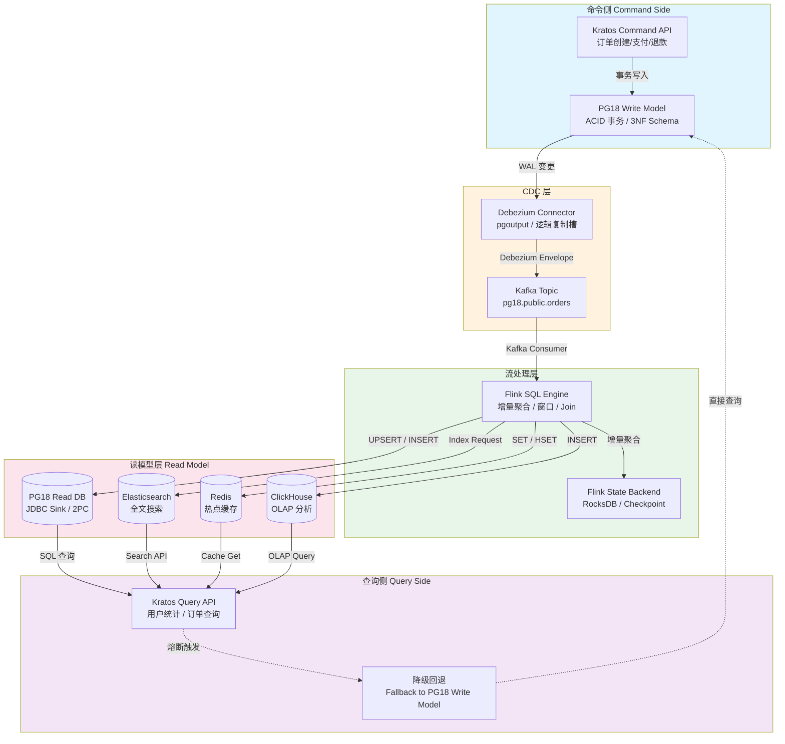

# CQRS + 流式读模型构建

> 所属阶段: TECH-STACK | 前置依赖: [02.01-postgresql-18-cdc-deep-dive.md, 02.04-flink-streaming-resilience.md] | 形式化等级: L4

## 1. 概念定义 (Definitions)

**Def-T-03-05-01 (CQRS)**. **命令查询职责分离 (Command Query Responsibility Segregation, CQRS)** 是一种架构模式，将数据修改操作（命令，Command）与数据读取操作（查询，Query）的模型与处理路径显式分离。设系统状态为 \(S\)，命令集为 \(C\)，查询集为 \(Q\)，则 CQRS 要求存在两个独立的投影函数：

\[
\begin{aligned}
\text{write}: S \times C &\to S' \\
\text{read}: S_{\text{read}} \times Q &\to R
\end{aligned}
\]

其中 \(S_{\text{read}}\) 为读模型状态，通常 \(S_{\text{read}} \neq S\)（即读模型与写模型在物理存储或逻辑结构上解耦）。

**Def-T-03-05-02 (命令与查询)**. **命令 (Command)** 是导致系统副作用的操作，具有语义 \(c: S \to S'\)，执行后不直接返回业务数据，仅返回执行结果（成功/失败/事务ID）。**查询 (Query)** 是无副作用的只读操作，具有语义 \(q: S_{\text{read}} \to R\)，满足幂等性 \(q(s) = q(s)\)（对同一状态的多次查询结果一致）。

**Def-T-03-05-03 (物化视图)**. **物化视图 (Materialized View)** 是查询结果在物理存储上的持久化缓存。设基表为 \(T\)，查询为 \(Q\)，则物化视图 \(MV_Q\) 满足：

\[
MV_Q(t) = Q(T(t))
\]

其中 \(t\) 为时间戳。在流式场景中，\(MV_Q\) 随 \(T\) 的变更流增量更新，而非全量重算。

**Def-T-03-05-04 (读模型)**. **读模型 (Read Model)** 是专为查询优化构建的数据投影，其 schema 由查询模式驱动，与写模型（命令模型）的规范化 schema 解耦。读模型允许冗余、反规范化、预聚合，以换取查询性能。在流式 CQRS 架构中，读模型由 Flink 等流处理引擎持续维护。

**Def-T-03-05-05 (流式读模型)**. **流式读模型 (Streaming Read Model)** 是指读模型通过事件流（Event Stream）增量更新的物化视图，其更新延迟受限于流处理系统的吞吐与容错机制。设变更事件流为 \(E = \{e_1, e_2, \ldots\}\)，读模型更新函数为 \(f\)，则读模型在时间 \(t\) 的状态为：

\[
R(t) = f\left(R(t_0), \{e_i \mid t_0 < \text{ts}(e_i) \leq t\}\right)
\]

其中 \(f\) 通常由 Flink 的 `CREATE TABLE ... AS SELECT`（CTAS）或 `INSERT INTO` 语句实现。

## 2. 属性推导 (Properties)

**Lemma-T-03-05-01 (读写分离后的一致性延迟上界)**. 在流式 CQRS 架构中，设写模型事务提交时刻为 \(t_w\)，Debezium 捕获并发出 CDC 事件到 Kafka 的时刻为 \(t_c\)，Flink 消费事件并更新读模型的时刻为 \(t_r\)，则读模型一致性延迟 \(\Delta\) 满足：

\[
\Delta = t_r - t_w \leq \Delta_{\text{pg}} + \Delta_{\text{debezium}} + \Delta_{\text{kafka}} + \Delta_{\text{flink}}
\]

其中：

- \(\Delta_{\text{pg}}\)：PG18 事务提交到 WAL 写入的延迟（微秒级）
- \(\Delta_{\text{debezium}}\)：Debezium 轮询或流式读取 WAL 的延迟（毫秒级）
- \(\Delta_{\text{kafka}}\)：Kafka 端到端传输延迟（毫秒级，受 `linger.ms` 与网络影响）
- \(\Delta_{\text{flink}}\)：Flink 处理延迟（毫秒~秒级，受 checkpoint 周期与反压影响）

**证明概要**. 各阶段为串行流水线，总延迟为各阶段延迟之上界和。由于各组件独立运行，无负反馈回路，故上界可直接求和。\(\square\)

**Prop-T-03-05-01 (最终一致性保证)**. 若写模型 PG18 满足 ACID，Debezium 精确捕获所有变更（无丢失、无重复），Kafka 提供至少一次投递，Flink 开启 checkpoint 并启用两阶段提交（2PC）或幂等写入，则读模型与写模型满足 **最终一致性 (Eventual Consistency)**：

\[
\forall t. \exists T \geq t. \quad R(T) = Q(S(T))
\]

即对于任意时刻 \(t\)，存在有限时间 \(T\)，使得读模型状态 \(R(T)\) 等于写模型状态经查询 \(Q\) 投影后的结果。

## 3. 关系建立 (Relations)

### 3.1 CQRS 与 Event Sourcing

CQRS 常与 **Event Sourcing** 结合使用，但二者正交：

- **Event Sourcing** 决定写模型的持久化形式（以事件序列代替状态快照）。
- **CQRS** 决定读写路径的分离。

在本架构中，写模型采用 **状态存储**（PG18 表），而非 Event Sourcing。CDC（Debezium）扮演"状态→事件"的转换器角色，等效于从状态存储衍生出事件流。因此，本架构是 **CQRS + 状态存储 + CDC** 的组合，写侧无需显式生成领域事件。

### 3.2 CQRS 与 CDC

CDC 是 CQRS 读写模型之间的"神经束"。Debezium 捕获 PG18 的 WAL 变更，将行级 `INSERT`/`UPDATE`/`DELETE` 转换为 Kafka 消息，从而在不侵入写模型业务逻辑的前提下，实现读模型的异步同步。CDC 使得 CQRS 的读模型可以"监听"写模型，而非轮询。

### 3.3 CQRS 与 Flink

Flink 作为流处理引擎，承担读模型的"计算层"：

- **增量聚合**：`COUNT`, `SUM`, `AVG` 等操作通过状态后端（RocksDB）增量维护。
- **窗口计算**：Tumble/Session/Slide 窗口支持时间维度上的读模型切片。
- **多流 Join**：利用 Flink SQL 的 Temporal Join 或 Interval Join 构建多表关联的读模型。
- **CTAS 语义**：Flink 的 `CREATE TABLE user_stats AS SELECT ...` 将持续执行查询并将结果写入下游存储，语义上等价于持续维护的物化视图。

## 4. 论证过程 (Argumentation)

### 4.1 PG18 作为写模型（事务性写入）

PG18（PostgreSQL 18）作为写模型存储，承担命令侧的全部事务负载。其关键特性包括：

- **ACID 事务**：订单创建、库存扣减、支付状态流转等命令通过 PG18 的 MVCC 与 WAL 保证原子性与持久性。
- **逻辑复制槽**：PG18 的 `pgoutput` 插件为 Debezium 提供稳定的事件流接口，确保变更捕获的连续性。
- **Schema 规范化**：写模型遵循第三范式（3NF），减少写入时的数据冗余与异常风险。

写模型的性能瓶颈通常不在写入本身，而在复杂查询（如聚合、Join）。CQRS 通过分离读取路径，将复杂查询卸载到 Flink 构建的读模型，从而保护写模型的写入吞吐。

### 4.2 Debezium CDC 捕获写模型变更

Debezium PostgreSQL Connector 配置示例：

```json
{
  "name": "pg18-orders-connector",
  "config": {
    "connector.class": "io.debezium.connector.postgresql.PostgresConnector",
    "database.hostname": "pg18-primary",
    "database.dbname": "ecommerce",
    "database.server.name": "pg18",
    "table.include.list": "public.orders,public.order_items",
    "plugin.name": "pgoutput",
    "slot.name": "debezium_orders_slot",
    "publication.name": "dbz_publication",
    "snapshot.mode": "initial"
  }
}
```

Debezium 将每行变更转换为 Debezium Envelope 格式的 Kafka 消息：

```json
{
  "before": null,
  "after": {"id": 1001, "user_id": 42, "amount": 299.00, "status": "PAID", "created_at": "2026-04-22T09:15:00Z"},
  "source": {"version": "2.7", "connector": "postgresql", "ts_ms": 1745282100000},
  "op": "c",
  "ts_ms": 1745282100156
}
```

该消息经 Kafka Topic `pg18.public.orders` 投递至 Flink。

### 4.3 Flink 实时构建物化视图

Flink SQL 定义写模型源表与读模型目标表：

```sql
-- 写模型 CDC 源表
CREATE TABLE orders (
  id BIGINT,
  user_id BIGINT,
  amount DECIMAL(10,2),
  status STRING,
  created_at TIMESTAMP(3),
  PRIMARY KEY (id) NOT ENFORCED
) WITH (
  'connector' = 'kafka',
  'topic' = 'pg18.public.orders',
  'format' = 'debezium-json',
  'properties.bootstrap.servers' = 'kafka:9092',
  'scan.startup.mode' = 'earliest-offset'
);

-- 读模型目标表：PostgreSQL JDBC Sink（用于 Kratos 查询）
CREATE TABLE user_order_stats (
  user_id BIGINT PRIMARY KEY NOT ENFORCED,
  order_count BIGINT,
  total_amount DECIMAL(16,2),
  last_order_at TIMESTAMP(3)
) WITH (
  'connector' = 'jdbc',
  'url' = 'jdbc:postgresql://pg18-read:5432/readmodel',
  'table-name' = 'user_order_stats',
  'driver' = 'org.postgresql.Driver',
  'username' = 'flink',
  'password' = '***'
);

-- 持续物化视图：实时聚合用户订单统计
INSERT INTO user_order_stats
SELECT
  user_id,
  COUNT(*) AS order_count,
  SUM(amount) AS total_amount,
  MAX(created_at) AS last_order_at
FROM orders
GROUP BY user_id;
```

Flink 内部通过 `GroupAggregate` 算子维护每个 `user_id` 的聚合状态（存储于 RocksDB），实现增量更新。当订单 CDC 事件到达时，Flink 读取当前状态，更新 `COUNT` 与 `SUM`，并向下游 JDBC Sink 输出更新后的行。

对于更复杂的读模型，Flink 支持：

- **多流 Join**：将 `orders` 与 `order_items` 关联，计算用户按品类的消费分布。
- **窗口聚合**：按天统计平台 GMV，输出到 ClickHouse 用于时序分析。
- **Lookup Join**：将 `user_id` 关联到 MySQL/Dim 表的用户画像，丰富读模型字段。

### 4.4 Kratos 查询服务直接读物化视图

Kratos（Go 微服务框架）构建查询服务，直接访问 Flink 输出的读模型存储：

```go
// Kratos 查询服务：用户订单统计
func (s *UserStatsService) GetUserOrderStats(ctx context.Context, req *v1.GetUserOrderStatsRequest) (*v1.GetUserOrderStatsReply, error) {
    // 优先读取 Flink 物化视图（PostgreSQL 读库）
    stats, err := s.readModelRepo.GetUserStats(ctx, req.UserId)
    if err != nil {
        // 降级：读模型不可用时回退到写模型 PG18
        return s.fallbackQueryFromWriteModel(ctx, req.UserId)
    }

    return &v1.GetUserOrderStatsReply{
        UserId:       stats.UserID,
        OrderCount:   stats.OrderCount,
        TotalAmount:  stats.TotalAmount,
        LastOrderAt:  stats.LastOrderAt.Format(time.RFC3339),
        StaleWarning: false,
    }, nil
}
```

读模型存储选型对比：

| 存储 | 适用场景 | 一致性级别 | 延迟 |
|------|---------|-----------|------|
| PostgreSQL（JDBC Sink） | 事务性读模型、中小规模聚合 | 精确一致（2PC） | 低 |
| Elasticsearch | 全文搜索、复杂过滤 | 最终一致 | 中 |
| Redis | 热点数据缓存、QPS 极高 | 最终一致 | 极低 |
| ClickHouse | OLAP 分析、时序聚合 | 最终一致 | 中 |

### 4.5 组合弹性：读模型延迟的降级策略

当 Flink 作业故障、Kafka 消费滞后或读模型存储不可用时，查询服务需具备弹性：

**Def-T-03-05-06 (降级策略)**. **降级策略 (Degradation Strategy)** 是在系统部分组件失效时，牺牲非核心属性（如一致性、延迟）以维持核心功能（可用性）的补偿机制。

**Stale 数据返回 + 提示**：

- 若读模型更新延迟超过阈值（如 30 秒），Kratos 查询服务仍返回读模型中的数据，但在响应头中附加 `X-Read-Model-Lag: 12.5s` 或 `X-Data-Staleness-Warning: true`。
- 客户端（如前端页面）可据此提示用户"数据可能存在延迟"。

**回退到写模型查询**：

- 若读模型存储完全不可用，查询服务回退到直接查询 PG18 写模型。由于写模型未针对查询优化，此路径可能触发全表扫描或复杂聚合，导致性能下降，但保证功能可用。
- 回退路径需设置熔断器（Circuit Breaker），防止写模型被查询流量压垮。

**延迟阈值配置**：

```yaml
# Kratos 服务配置
read_model:
  max_acceptable_lag: 30s
  stale_data_warning_threshold: 10s
  fallback:
    enabled: true
    target: "write_model"  # 回退到 PG18
    circuit_breaker:
      error_threshold: 50%
      slow_call_threshold: 5s
```

### 4.6 Flink 状态丢失后的重建

若 Flink 作业因严重故障（如 RocksDB 状态损坏）需要重建状态，可通过 **Kafka Replay** 恢复：

1. **重置消费者组偏移量**：将 Flink Kafka Source 的偏移量重置到历史时间点（如 7 天前）。
2. **全量重算**：Flink 从该偏移量开始重新消费 CDC 事件，逐条重建聚合状态。
3. **快照恢复**：若定期启用 Savepoint，优先从 Savepoint 恢复，减少 replay 数据量。

重建时间 \(T_{\text{replay}}\) 估算：

\[
T_{\text{replay}} = \frac{N_{\text{events}}}{R_{\text{throughput}}} + T_{\text{checkpoint}} \cdot \left\lceil \frac{N_{\text{events}}}{B_{\text{checkpoint}}} \right\rceil
\]

其中 \(N_{\text{events}}\) 为需 replay 的事件数，\(R_{\text{throughput}}\) 为 Flink 处理吞吐，\(B_{\text{checkpoint}}\) 为每 checkpoint 周期内处理的事件数。

### 4.7 读模型与写模型最终一致性监控

监控体系覆盖延迟链路的每个环节：

- **Kafka Consumer Lag**：通过 Kafka Consumer Group Lag 指标，衡量 Debezium 到 Flink 之间的队列积压。告警阈值通常设为 `lag > 10000` 或 `lag_duration > 60s`。
- **Flink Checkpoint Duration**：监控 `lastCheckpointDuration`，若持续超过 checkpoint 间隔的 80%，则存在反压或状态过大风险。
- **读模型与写模型对比校验**：定期（如每分钟）抽样对比 PG18 原始数据与读模型聚合结果，检测数据漂移。例如：

```sql
-- 一致性校验查询
SELECT
  (SELECT COUNT(*) FROM pg18.orders WHERE created_at > NOW() - INTERVAL '1 hour') AS write_count,
  (SELECT SUM(order_count) FROM readmodel.user_order_stats) AS read_count;
```

- **端到端延迟 Metrics**：在 Debezium 事件元数据中注入 `source.ts_ms`，在 Flink Sink 处对比当前时间戳，计算端到端延迟并上报 Prometheus。

## 5. 形式证明 / 工程论证 (Proof / Engineering Argument)

**Thm-T-03-05-01 (流式 CQRS 最终一致性延迟上界)**. 在标准配置下，流式 CQRS 架构中读模型与写模型的最终一致性延迟 \(L\) 满足以下工程上界：

\[
L \leq T_{\text{checkpoint}} + L_{\text{kafka}} + T_{\text{debezium}} + T_{\text{pg}}
\]

其中各参数含义及典型值如下：

| 参数 | 含义 | 典型值 |
|------|------|--------|
| \(T_{\text{checkpoint}}\) | Flink Checkpoint 间隔 | 10s ~ 60s |
| \(L_{\text{kafka}}\) | Kafka Consumer Lag 持续时间 | 0s ~ 30s（正常），>60s（告警） |
| \(T_{\text{debezium}}\) | Debezium 捕获到发出事件的延迟 | 10ms ~ 500ms |
| \(T_{\text{pg}}\) | PG18 事务提交到 WAL 可读延迟 | 1ms ~ 10ms |

**工程论证**.

1. **PG18 写入到 WAL 可见**：PG18 事务提交时，WAL 记录已强制刷盘（`synchronous_commit = on`），延迟 \(T_{\text{pg}}\) 为磁盘 fsync 时间，通常 <10ms。

2. **Debezium 捕获延迟**：Debezium 通过逻辑复制槽流式读取 WAL，事件从 WAL 产生到进入 Kafka 的延迟 \(T_{\text{debezium}}\) 主要取决于网络往返与 Kafka `linger.ms`。在批量发送配置下（`linger.ms=50`），该延迟通常 <500ms。

3. **Kafka 传输与消费延迟**：Kafka 提供低延迟消息投递（端到端 <100ms），但 Flink Consumer 的延迟主要由 **Consumer Lag** 决定。设 lag 为未消费消息数，Flink 吞吐为 \(\mu\) msg/s，则 lag 清空时间 \(L_{\text{kafka}} = \text{lag} / \mu\)。在正常负载下 \(L_{\text{kafka}} \approx 0\)；在反压或故障恢复期间，lag 可能累积至秒级甚至分钟级。

4. **Flink 处理与 Checkpoint 延迟**：Flink 的增量聚合算子处理单条记录的延迟为微秒级，可忽略。然而，读模型的"可见性"延迟受 checkpoint 周期约束：若 Flink 使用 JDBC Sink 的 2PC 提交，则读模型仅在 checkpoint 完成时才能看到已提交的数据。因此，读模型更新的最坏情况延迟为 \(T_{\text{checkpoint}}\)。若使用幂等写入（如 UPSERT 语义），则无需等待 2PC，延迟可降至毫秒级，但可能短暂读到中间状态。

5. **上界求和**：各阶段为串行依赖，无并行优化空间，故总延迟上界为各阶段最坏情况之和。在正常工况下（无 lag、无反压），\(L \approx T_{\text{checkpoint}} + T_{\text{debezium}} + T_{\text{pg}} \approx 10s\)；在故障恢复期间，\(L\) 可能达到分钟级，但仍为有限值，满足最终一致性定义。

\(\square\)

## 6. 实例验证 (Examples)

### 6.1 电商场景：订单写入 → 实时统计 → API 查询

**场景描述**：电商平台需要实时展示用户的订单统计信息（总订单数、累计消费金额、最近下单时间），同时支持高并发查询（如用户中心首页）。写模型 PG18 的 `orders` 表每天新增百万级订单。

**Step 1：命令侧 — 订单写入 PG18**

```sql
-- PG18 写模型：orders 表
CREATE TABLE orders (
  id BIGSERIAL PRIMARY KEY,
  user_id BIGINT NOT NULL,
  amount NUMERIC(10,2) NOT NULL,
  status VARCHAR(20) NOT NULL,
  created_at TIMESTAMPTZ DEFAULT NOW()
);

-- 订单创建事务
BEGIN;
INSERT INTO orders (user_id, amount, status)
VALUES (42, 299.00, 'PAID');
COMMIT;
```

**Step 2：CDC 捕获 — Debezium 推送 Kafka**

Debezium 捕获上述 `INSERT` 操作，生成 Kafka 消息至 `pg18.public.orders` Topic。

**Step 3：Flink 实时聚合 — 构建读模型**

```sql
-- Flink SQL：持续维护用户订单统计读模型
CREATE TABLE user_stats (
  user_id BIGINT PRIMARY KEY NOT ENFORCED,
  order_count BIGINT,
  total_spent DECIMAL(16,2),
  last_order_time TIMESTAMP(3)
) WITH (
  'connector' = 'jdbc',
  'url' = 'jdbc:postgresql://pg18-read:5432/readmodel',
  'table-name' = 'user_stats'
);

INSERT INTO user_stats
SELECT
  user_id,
  COUNT(*) AS order_count,
  SUM(amount) AS total_spent,
  MAX(created_at) AS last_order_time
FROM orders
GROUP BY user_id;
```

Flink 作业部署后，`user_stats` 表将随每笔订单的到达实时更新。

**Step 4：Kratos 查询 API**

```protobuf
// api/user/v1/user.proto
service UserStatsService {
  rpc GetUserStats (GetUserStatsRequest) returns (GetUserStatsReply);
}

message GetUserStatsRequest {
  int64 user_id = 1;
}

message GetUserStatsReply {
  int64 user_id = 1;
  int64 order_count = 2;
  double total_spent = 3;
  string last_order_time = 4;
  bool is_stale = 5;  // 数据是否可能滞后
}
```

```go
// internal/data/user_stats.go
func (r *userStatsRepo) GetUserStats(ctx context.Context, userID int64) (*biz.UserStats, error) {
    // 直接查询 Flink 维护的读模型
    row := r.data.readDB.QueryRowContext(ctx,
        "SELECT order_count, total_spent, last_order_time FROM user_stats WHERE user_id = $1",
        userID,
    )
    // ...
}
```

**Step 5：降级验证**

模拟读模型数据库故障：

```bash
# 断开 Flink Sink 目标数据库
$ docker stop pg18-read
```

Kratos 查询服务检测到连接超时，触发熔断回退：

```go
func (s *UserStatsService) fallbackQuery(ctx context.Context, userID int64) (*v1.GetUserStatsReply, error) {
    // 直接查询 PG18 写模型（性能较差，但可用）
    var count int64
    var total float64
    var lastTime time.Time
    err := s.writeDB.QueryRowContext(ctx,
        "SELECT COUNT(*), COALESCE(SUM(amount),0), MAX(created_at) FROM orders WHERE user_id = $1",
        userID,
    ).Scan(&count, &total, &lastTime)
    // ...
    return &v1.GetUserStatsReply{
        OrderCount:   count,
        TotalSpent:   total,
        LastOrderTime: lastTime.Format(time.RFC3339),
        IsStale:      false,
        FallbackNote: "queried_from_write_model",
    }, nil
}
```

响应中附加 `FallbackNote`，前端据此提示"查询模式已降级，响应时间可能延长"。

**Step 6：一致性监控验证**

通过 Prometheus + Grafana 监控以下指标：

- `kafka_consumer_lag{group="flink-cqrs-consumer"}`：持续 < 100 为正常。
- `flink_checkpoint_duration`：持续 < 30s 为正常。
- `cqrs_end_to_end_latency_seconds`：P99 < 15s 为正常。

## 7. 可视化 (Visualizations)

### 7.1 CQRS 架构图

以下 Mermaid 图展示了流式 CQRS 架构的完整分层，从写模型到读模型的数据流转，以及降级回退路径。



### 7.2 读写分离数据流

以下 Mermaid 图展示了单笔订单从写入到读模型可见的完整数据流，标注了每个环节的延迟来源与典型量级。

```mermaid
graph LR
    A[客户端<br/>提交订单] -->|HTTP/gRPC| B[Kratos<br/>Command API]
    B -->|BEGIN ... COMMIT| C[PG18 Write Model<br/>orders 表]
    C -->|WAL fsync<br/>~1-10ms| D[Debezium<br/>Connector]
    D -->|序列化 + linger.ms<br/>~10-500ms| E[Kafka<br/>Broker]
    E -->|Consumer Poll<br/>~0-30s| F[Flink<br/>Source]
    F -->|增量聚合<br/>~μs-ms| G[Flink<br/>Sink]
    G -->|JDBC 2PC / UPSERT<br/>~10-60s| H[(读模型存储<br/>user_stats)]
    H -->|SQL Query<br/>~1-10ms| I[Kratos<br/>Query API]
    I -->|HTTP/gRPC + StaleHeader| J[客户端<br/>查看统计]

    style C fill:#ffebee
    style H fill:#e8f5e9
    style F fill:#e3f2fd
```



## 8. 引用参考 (References)
