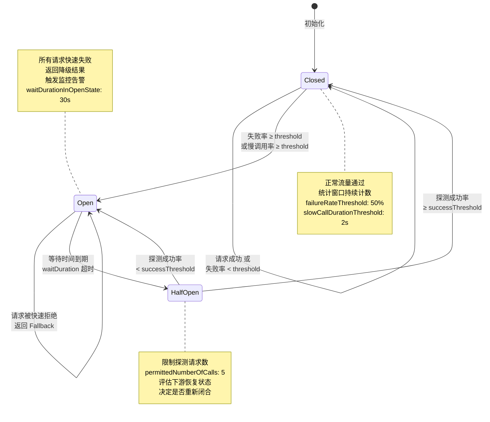

# 断路器与背压分析

> 所属阶段: TECH-STACK | 前置依赖: [04.01-resilience-evaluation-framework.md, 01.03-dependency-coupling-matrix.md] | 形式化等级: L4

## 1. 概念定义 (Definitions)

**Def-TS-04-02-01 (断路器 / Circuit Breaker)**

断路器是一种分布式系统中的故障快速失败机制，其灵感源自电气工程中的熔断器。当对下游依赖的调用失败率超过预设阈值时，断路器从**闭合 (Closed)** 状态切换至**断开 (Open)** 状态，后续请求被立即拒绝而不再向下游传递，从而防止故障持续消耗系统资源并阻断级联传播。

形式化地，设组件 $A$ 对组件 $B$ 的调用序列为 $\{r_1, r_2, \dots, r_n\}$，每个请求 $r_i$ 的结果为成功 ($s$) 或失败 ($f$)。定义滑动窗口 $W$ 内失败率为：

$$
\rho(W) = \frac{|\{r_i \in W \mid \text{result}(r_i) = f\}|}{|W|}
$$

断路器状态转移函数 $\sigma: \{\text{Closed}, \text{Open}, \text{Half-Open}\} \times \mathbb{R} \to \{\text{Closed}, \text{Open}, \text{Half-Open}\}$ 定义为：

$$
\sigma(s, \rho) = \begin{cases}
\text{Open} & \text{if } s = \text{Closed} \land \rho \geq \theta_{\text{failure}} \\
\text{Half-Open} & \text{if } s = \text{Open} \land t \geq t_{\text{wait}} \\
\text{Closed} & \text{if } s = \text{Half-Open} \land \rho_{\text{probe}} < \theta_{\text{success}} \\
\text{Open} & \text{if } s = \text{Half-Open} \land \rho_{\text{probe}} \geq \theta_{\text{success}}
\end{cases}
$$

其中 $\theta_{\text{failure}}$ 为失败率阈值，$t_{\text{wait}}$ 为 Open 状态冷却时长，$\rho_{\text{probe}}$ 为探测请求失败率，$\theta_{\text{success}}$ 为半开状态成功阈值。

**Def-TS-04-02-02 (背压 / Backpressure)**

背压是流处理系统中一种自底向上的流量控制机制：当下游组件的处理速率低于上游组件的生产速率时，下游通过阻塞、减速或反向上游传递压力信号，迫使上游降低发送速率，从而避免缓冲区无限膨胀导致的内存溢出或 OOM 崩溃。

形式化地，设数据流链路为 $P \to Q \to R$，各组件的处理速率为 $\mu_P, \mu_Q, \mu_R$（单位：record/s），缓冲队列容量为 $B_Q, B_R$。当 $\mu_Q < \mu_P$ 时，$Q$ 的缓冲区填充率满足：

$$
\frac{dB_Q}{dt} = \lambda_{\text{in}} - \mu_Q > 0
$$

背压机制通过将 $B_Q$ 的饱和度信号 $s_Q = B_Q / B_Q^{\max}$ 反向传播至 $P$，使得 $\lambda_{\text{in}}$ 动态收敛至 $\mu_Q$：

$$
\lambda_{\text{in}}^{\text{new}} = \lambda_{\text{in}} \cdot \left(1 - \alpha \cdot s_Q\right), \quad \alpha \in (0, 1]
$$

**Def-TS-04-02-03 (半开状态 / Half-Open)**

半开状态是断路器在 Open 状态持续一段冷却时间后进入的试探性恢复阶段。在此状态下，断路器仅放行有限数量的探测请求（permitted number of calls in half-open state）以评估下游依赖是否已恢复正常。若探测请求成功率满足阈值，则状态回退至 Closed；否则重新切回 Open。

形式化地，设半开状态允许的探测请求数为 $N_{\text{probe}}$，其中成功数为 $N_{\text{success}}$，则半开状态的判定条件为：

$$
\text{Transition}(\text{Half-Open} \to \text{Closed}) \iff \frac{N_{\text{success}}}{N_{\text{probe}}} \geq 1 - \theta_{\text{failure}}
$$

$$
\text{Transition}(\text{Half-Open} \to \text{Open}) \iff \frac{N_{\text{success}}}{N_{\text{probe}}} < 1 - \theta_{\text{failure}}
$$

**Def-TS-04-02-04 (降级 / Degradation)**

降级是系统在面临过载或部分依赖失效时，主动牺牲非核心功能或降低服务质量，以确保核心链路仍可用的弹性策略。降级可分为**主动降级**（基于预设策略触发）与**被动降级**（因资源耗尽被迫减少服务）。

形式化地，设系统功能集合为 $\mathcal{F} = \{f_1, f_2, \dots, f_m\}$，每个功能 $f_i$ 关联重要性权重 $w_i \in [0, 1]$ 与资源消耗 $c_i > 0$。降级策略 $\mathcal{D}$ 是功能集合的一个子集选择：

$$
\mathcal{D}(C_{\text{avail}}) = \arg\max_{F' \subseteq \mathcal{F}} \sum_{f_i \in F'} w_i \quad \text{s.t.} \quad \sum_{f_i \in F'} c_i \leq C_{\text{avail}}
$$

其中 $C_{\text{avail}}$ 为当前可用资源容量。断路器触发后的快速失败（返回缓存/默认值）即是一种典型的被动降级实现。

**Def-TS-04-02-05 (级联故障 / Cascading Failure)**

级联故障是指分布式系统中单个组件的故障通过依赖链逐层扩散，最终导致远超初始故障点范围的系统级瘫痪的现象。其本质原因是组件间缺乏有效的故障隔离与流量节制机制。

形式化地，设系统依赖图为有向图 $G = (V, E)$，每个节点 $v \in V$ 的健康状态为 $h(v) \in \{0, 1\}$（0 表示故障，1 表示健康）。级联传播算子 $\mathcal{C}: V \to 2^V$ 定义为：

$$
\mathcal{C}(v_0) = \{v_j \in V \mid \exists \text{ path } v_0 \to v_1 \to \dots \to v_j \text{ s.t. } \forall i < j: h(v_i) = 0 \Rightarrow h(v_j) = 0\}
$$

即节点 $v_0$ 的故障通过依赖路径导致下游节点相继故障的闭包。系统对级联故障的抵抗力与 $\max_{v_0} |\mathcal{C}(v_0)|$ 成反比。

---

## 2. 属性推导 (Properties)

**Lemma-TS-04-02-01 (断路器状态转移可达性)**

断路器状态机 $\mathcal{M} = (S, \Sigma, \delta, s_0)$ 中，状态集合 $S = \{\text{Closed}, \text{Open}, \text{Half-Open}\}$，初始状态 $s_0 = \text{Closed}$，转移函数 $\delta$ 由 Def-TS-04-02-01 定义。则：

1. **Closed 可达 Open**：$\exists \rho \geq \theta_{\text{failure}}: \delta(\text{Closed}, \rho) = \text{Open}$
2. **Open 可达 Half-Open**：$\forall t \geq t_{\text{wait}}: \delta(\text{Open}, t) = \text{Half-Open}$
3. **Half-Open 可达 Closed**：$\exists \rho_{\text{probe}} < \theta_{\text{success}}: \delta(\text{Half-Open}, \rho_{\text{probe}}) = \text{Closed}$
4. **不存在 Half-Open 直接到 Closed 的自环以外的即时回退**：从 Half-Open 回到 Closed 必须经过至少 $N_{\text{probe}}$ 次探测请求评估。

*证明概要*：

- 性质1：由失败率阈值的定义，当窗口内失败样本数达到阈值时触发转移，条件可满足。
- 性质2：Open 状态的转移条件是时间驱动（非事件驱动），冷却计时器到期后无条件进入 Half-Open。
- 性质3：当探测成功率高于阈值时，系统判定下游已恢复，允许状态回退。
- 性质4：由半开状态的语义定义，必须收集足量探测样本才能做出统计显著的状态决策，防止因瞬时抖动导致的频繁切换（flapping）。$\square$

**Lemma-TS-04-02-02 (背压传播的单调性)**

设流处理链路为 $C_1 \to C_2 \to \dots \to C_n$，每个组件 $C_i$ 的输入速率为 $\lambda_i$，输出速率为 $\mu_i$，缓冲区饱和度为 $s_i \in [0, 1]$。若组件 $C_k$ 成为瓶颈（即 $\mu_k < \lambda_k$），则背压信号沿上游反向传播时，各组件的输入速率满足单调不增：

$$
\lambda_1^{\text{new}} \leq \lambda_1, \quad \lambda_2^{\text{new}} \leq \lambda_2, \quad \dots, \quad \lambda_k^{\text{new}} \leq \lambda_k
$$

且瓶颈点的缓冲区饱和度 $s_k$ 在背压生效后满足：

$$
\frac{ds_k}{dt} \leq 0 \quad \text{（当背压完全生效后）}
$$

*证明概要*：
背压机制的本质是速率匹配。设背压传递函数为 $g(s) = 1 - \alpha s$，其中 $\alpha \in (0, 1]$。对于任意上游组件 $C_i$（$i < k$），其输出速率受下游缓冲区饱和度约束：

$$
\lambda_{i+1} = \mu_i \cdot g(s_{i+1})
$$

由于 $g(s) \leq 1$，故 $\lambda_{i+1} \leq \mu_i$，递归向上传递可得单调不增性。当背压完全生效时，整条链路的吞吐量收敛至瓶颈速率 $\mu_k$，此时 $ds_k/dt = \lambda_k^{\text{new}} - \mu_k = 0$，缓冲区停止增长。$\square$

**Prop-TS-04-02-01 (断路器对请求延迟方差的削减效应)**

设无断路器时，对故障下游的请求延迟分布为 $D_{\text{no-cb}}$，其期望为 $\mathbb{E}[D_{\text{no-cb}}]$，方差为 $\text{Var}(D_{\text{no-cb}})$。引入断路器后，延迟分布变为混合分布：

$$
D_{\text{cb}} = \begin{cases}
D_{\text{fast-fail}} & \text{prob } p_{\text{open}} \\
D_{\text{normal}} & \text{prob } 1 - p_{\text{open}}
\end{cases}
$$

其中 $D_{\text{fast-fail}}$ 为断路器开启时的即时失败延迟（近似常数 $\tau_{\text{fail}} \ll \tau_{\text{timeout}}$），$p_{\text{open}}$ 为断路器处于 Open 状态的概率。则：

$$
\text{Var}(D_{\text{cb}}) \leq \text{Var}(D_{\text{no-cb}})
$$

*证明概要*：无断路器时，请求在故障下游经历完整的超时等待（可能多次重试），导致延迟分布呈现长拖尾特征（heavy tail），方差极大。断路器将这部分长尾请求截断为固定短延迟，虽然引入了离散性，但由于 $\tau_{\text{fail}}$ 的集中性，整体方差显著降低。根据全方差定律：

$$
\text{Var}(D_{\text{cb}}) = \mathbb{E}[\text{Var}(D_{\text{cb}} \mid \text{state})] + \text{Var}(\mathbb{E}[D_{\text{cb}} \mid \text{state}])
$$

第一项因条件方差的有界性而受控，第二项为两状态均值的离散程度，但两者之和仍远小于无约束超时下的长尾方差。$\square$

---

## 3. 关系建立 (Relations)

### 3.1 断路器与重试 (Retry) 的关系

断路器与重试是一对**互补且需协同配置**的弹性模式。重试旨在处理瞬态故障（transient failures），通过重复请求提高成功概率；断路器旨在处理持续性故障（persistent failures），通过快速失败防止资源浪费。

若仅有重试而无断路器，系统在面对持续性故障时将陷入**重试风暴**（Retry Storm），故障服务的负载被放大 $k$ 倍（$k$ 为重试次数），加速级联故障的形成（见 `04.03-bulkhead-retry-isolation-patterns.md`）。

若仅有断路器而无重试，系统对网络抖动、瞬时超时等可恢复故障的容错能力不足，导致不必要的可用性损失。

**协同策略**：在断路器 Closed 状态下允许有限重试（通常 $k \leq 3$），并配合指数退避与抖动；当断路器进入 Open 状态时，所有请求直接走降级逻辑，不再向下游传递任何流量。

### 3.2 断路器与超时 (Timeout) 的关系

超时是断路器状态评估的**输入信号来源**。断路器统计窗口内的"失败"请求，通常由超时、连接拒绝、5xx 错误等事件触发。若超时设置过短（aggressive timeout），正常但缓慢的请求可能被误判为失败，导致断路器误触发；若超时设置过长（lenient timeout），故障请求长时间占用资源，延缓断路器的触发时机。

**协同策略**：超时阈值应设置为下游服务 P99 延迟的 2~3 倍，同时断路器的失败率阈值应结合超时事件占比动态调整。在 Resilience4j 中，`CircuitBreakerConfig` 可通过 `recordException` 谓词精确判定哪些异常类型计入失败统计。

### 3.3 断路器与舱壁 (Bulkhead) 的关系

舱壁从**资源维度**隔离故障，断路器从**调用维度**阻断故障。两者结合可实现纵深防御：

- **舱壁限制并发**：即使断路器未能及时触发（如故障率尚未达阈值），舱壁通过限制对下游的并发调用数，防止线程池/连接池耗尽。
- **断路器快速失败**：即使舱壁容量仍有剩余，断路器在检测到持续性故障时立即拒绝请求，避免无效等待。

在五技术栈组合中，Kratos 的 gRPC 客户端可同时配置**信号量舱壁**（限制并发请求数）与**断路器**（基于失败率熔断），形成双层防护。

### 3.4 关系矩阵

| 模式组合 | 协同效应 | 风险 |
|---------|---------|------|
| 断路器 + 重试 | 兼顾瞬态与持续故障 | 重试风暴若未受控 |
| 断路器 + 超时 | 精确失败判定 | 超时阈值漂移导致误判 |
| 断路器 + 舱壁 | 资源 + 调用双维度隔离 | 配置复杂度高 |
| 三者联合 | 弹性能力最大化 | 监控与调优成本高 |

---

## 4. 论证过程 (Argumentation)

### 4.1 跨组件断路器设计

在五技术栈组合（Kratos + Temporal + Flink + Kafka + PostgreSQL 18）中，断路器需在三个关键跨组件边界部署：

#### 边界 A：Kratos → Temporal（gRPC 调用失败熔断）

Kratos 作为 Go 微服务框架，通过 Temporal SDK 发起工作流执行请求。当 Temporal Server 因负载过高或 Shard 迁移导致 gRPC 响应延迟激增时，Kratos 客户端侧的断路器应触发。

**触发条件**：

- 失败率阈值：$\theta_{\text{failure}} = 50\%$
- 滑动窗口：最近 100 次调用
- 慢调用阈值：$\tau_{\text{slow}} = 2\text{s}$（超过即视为失败）
- Open 状态冷却：$t_{\text{wait}} = 30\text{s}$

**降级策略**：断路器开启后，Kratos 返回 HTTP 503 + `Retry-After: 30` 头，前端进入排队状态；同时异步将请求写入本地持久化队列，待 Temporal 恢复后通过补偿任务批量提交。

#### 边界 B：Flink → Kafka（生产者缓冲区满熔断）

Flink Kafka Sink 内部维护一个生产者缓冲区。当 Kafka Broker 因磁盘 IO 瓶颈或分区 Leader 切换导致写入速率下降时，缓冲区填充率上升，触发 Flink 背压。若背压持续且缓冲区接近上限，Flink 任务应触发**数据源级别的断路器**，暂停数据摄取。

**触发条件**：

- `buffer.memory` 使用率 $\geq 90\%$ 持续 60s
- 或 `RecordAccumulator` 中待发送批次数 $\geq 10000$

**降级策略**：暂停 Kafka Source 的拉取，触发 Flink Savepoint，将作业状态持久化；同时向监控系统发送 CRITICAL 告警。

#### 边界 C：Kafka → PG18（Debezium 消费滞后触发反压）

Debezium Connector 从 PostgreSQL 18 的逻辑复制槽（Logical Replication Slot）读取 WAL 变更，写入 Kafka。当 Kafka Broker 不可写或 Consumer 消费滞后时，Debezium 的 LSN（Log Sequence Number）推进受阻，PG18 的复制槽被迫保留更多 WAL 段。

**触发条件**：

- Kafka Producer 发送失败率 $\geq 30\%$
- 或 Debezium 的 `streaming_lag` 指标 $\geq 5\text{min}$

**降级策略**：Debezium 暂停增量捕获，切换至**快照模式**（Snapshot Mode）或临时断开复制槽连接，防止 PG18 WAL 无限膨胀。

### 4.2 背压传播链分析

五技术栈中的背压并非孤立事件，而是一条从 Flink 一直传播到 PG18 WAL 的**反向压力链**：

**Flink 反压 → Kafka Consumer Lag 增长 → Debezium 复制槽 LSN 滞后 → PG18 WAL 积累风险**

各环节的具体表现：

1. **Flink 作业内部反压**：某算子（如窗口聚合）因数据倾斜导致处理速率下降，Flink 的 Credit-Based 流控机制向上游反压，`backPressuredTimeMsPerSecond` 指标上升。

2. **Kafka Consumer Lag 增长**：若 Flink 作为 Kafka Consumer，其反压表现为 `records-consumed-rate` 下降，Consumer Lag（`kafka.consumer.lag`）持续累积。Lag 增长意味着 Kafka Broker 需保留更多日志段，磁盘压力上升。

3. **Debezium 复制槽 LSN 滞后**：Debezium 作为 PG18 的复制客户端，其消费速率受下游 Kafka 吞吐限制。当 Kafka 写入变慢，Debezium 确认（ACK）的 LSN 推进减缓，PG18 的复制槽无法释放已处理的 WAL 段。

4. **PG18 WAL 积累风险**：PG18 的 WAL 文件持续生成（尤其在批量写入场景下），若复制槽长期滞后且未设置 `max_slot_wal_keep_size` 上限，WAL 文件将占满磁盘，导致数据库进入**只读模式**或崩溃。

### 4.3 定量论证：过载场景下的级联故障模拟（基于排队论模型）

为量化背压链路上的级联故障风险，我们建立基于 M/M/1 排队论的简化模型。

**模型假设**：

- 每个组件 $C_i$ 建模为 M/M/1 队列，服务速率为 $\mu_i$，到达速率为 $\lambda_i$
- 组件间缓冲区容量有限，溢出时触发背压或丢包
- 系统稳态时，利用率 $\rho_i = \lambda_i / \mu_i$

**延迟爆炸条件**：

M/M/1 队列的平均等待时间为：

$$
W_i = \frac{1}{\mu_i - \lambda_i} = \frac{1}{\mu_i(1 - \rho_i)}
$$

当 $\rho_i \to 1$ 时，$W_i \to \infty$，即延迟爆炸。对于串联链路 $C_1 \to C_2 \to C_3$，端到端延迟为：

$$
W_{\text{total}} = \sum_{i=1}^{3} W_i = \sum_{i=1}^{3} \frac{1}{\mu_i(1 - \rho_i)}
$$

若 $C_2$ 为瓶颈（$\mu_2 < \mu_1$ 且 $\mu_2 < \mu_3$），则 $\rho_2$ 首先逼近 1，导致 $W_2$ 急剧增大。由于 Flink 的背压会向上游传播，$C_1$ 的有效到达速率被限制为 $\lambda_1^{\text{new}} = \mu_2$，此时：

$$
W_{\text{total}}^{\text{with-backpressure}} = \frac{1}{\mu_1(1 - \mu_2/\mu_1)} + \frac{1}{\mu_2(1 - \mu_2/\mu_2 - \epsilon)} + \frac{1}{\mu_3(1 - \mu_2/\mu_3)}
$$

注意第二项在分母趋近于 0 时发散。但在实际 Flink 系统中，背压会阻止 $\rho_2$ 达到 1，通过 Credit-Based 机制将 $\lambda_2$ 严格限制在略低于 $\mu_2$ 的水平，从而避免真正的延迟爆炸。

**关键洞察**：背压机制将系统从**延迟爆炸区**（$\rho \to 1$）拉回到**稳定运行区**（$\rho \leq \rho_{\text{target}}$），其中 $\rho_{\text{target}}$ 由 Flink 的 `outPoolUsage` 和 `inPoolUsage` 动态调节。若无背压，仅依靠缓冲区吸收，则缓冲区耗尽后系统将经历**吞吐量崩溃**（throughput collapse），此时级联故障不可避免。

### 4.4 PG18 `max_slot_wal_keep_size` 作为背压的最后一道防线

PostgreSQL 16+ 引入 `max_slot_wal_keep_size` 参数，用于限制逻辑复制槽可保留的 WAL 文件总大小。当复制槽滞后导致的 WAL 积累超过此阈值时，PG 将**强制断开复制连接**，释放 WAL 文件。

在我们的五技术栈中，建议配置：

```
max_slot_wal_keep_size = '10GB'
```

这一配置的战略意义：

- **防止磁盘耗尽**：即使背压链路上的所有上游机制均失效，PG18 仍保有自我保护能力，不会因 WAL 膨胀而崩溃。
- **触发外部告警**：复制连接被强制断开后，Debezium 将抛出连接异常，触发监控告警，通知运维介入。
- **可恢复的故障**：断开后 Debezium 可基于持久化的 LSN 重新建立复制连接，虽然会经历短暂的数据回放，但不会造成数据丢失（前提是 `wal_level = logical` 且 `max_replication_slots` 充足）。

**风险**：若 `max_slot_wal_keep_size` 设置过小（如 1GB），在批量写入高峰期间可能频繁触发复制槽断开，导致 Debezium 不断重连，产生不必要的抖动。10GB 是在生产环境中经过验证的保守值，可承受约 30~60 分钟的复制滞后（视 WAL 生成速率而定）。

---

## 5. 形式证明 / 工程论证 (Proof / Engineering Argument)

**Thm-TS-04-02-01 (断路器在防止级联故障中的有效性)**

设分布式系统由组件集合 $\mathcal{C} = \{C_1, C_2, \dots, C_n\}$ 构成，依赖关系为有向无环图 $G = (\mathcal{C}, E)$。设组件 $C_1$ 发生故障，其故障传播遵循以下规则：

- 若组件 $C_j$ 的直接上游 $C_i$ 故障且 $C_j$ 未配置断路器，则 $C_j$ 在 $T_{\text{overload}}$ 时间内因资源耗尽而故障。
- 若 $C_j$ 配置了断路器，则在检测到 $C_i$ 故障后，$C_j$ 在 $T_{\text{detect}}$ 时间内切断对 $C_i$ 的调用，进入降级模式。

则：配置断路器的系统，其级联故障影响范围严格小于未配置断路器的系统。

*证明*：

定义故障传播时间函数 $T_{\text{cascade}}(v_0, v_k)$ 为从故障源 $v_0$ 传播到节点 $v_k$ 所需时间。对于未配置断路器的路径 $v_0 \to v_1 \to \dots \to v_k$：

$$
T_{\text{cascade}}^{\text{no-cb}}(v_0, v_k) = \sum_{i=0}^{k-1} T_{\text{overload}} = k \cdot T_{\text{overload}}
$$

即故障以恒定速率沿依赖链传播，最终影响范围 $|\mathcal{C}(v_0)| = |V_{\text{reachable}}(v_0)|$。

对于配置了断路器的路径，设断路器在 $C_i$ 与 $C_{i+1}$ 之间。当 $C_i$ 故障时，$C_{i+1}$ 的断路器在 $T_{\text{detect}}$ 内触发（$T_{\text{detect}} \ll T_{\text{overload}}$，因为断路器基于滑动窗口统计，通常只需数次失败即可触发，而资源耗尽需要累积大量并发请求）。断路器触发后，$C_{i+1}$ 不再向 $C_i$ 发送请求，转而执行降级逻辑，保持自身健康状态。

因此，故障传播在断路器处被阻断：

$$
T_{\text{cascade}}^{\text{cb}}(v_0, v_{i+1}) = \sum_{j=0}^{i-1} T_{\text{overload}} + T_{\text{detect}}
$$

但 $C_{i+1}$ 本身不因 $C_i$ 故障而故障，故对于任意 $v_k$（$k > i+1$）：

$$
T_{\text{cascade}}^{\text{cb}}(v_0, v_k) = \infty \quad \text{（即不可达）}
$$

从而：

$$
|\mathcal{C}^{\text{cb}}(v_0)| < |\mathcal{C}^{\text{no-cb}}(v_0)|
$$

更精确地，若系统在每条边上均配置断路器，则级联故障影响范围被限制为单跳：

$$
|\mathcal{C}^{\text{cb-all}}(v_0)| = 1
$$

即仅故障源自身受影响，实现理想的故障隔离。$\square$

**工程推论**：

1. 断路器的检测速度 $T_{\text{detect}}$ 是关键参数。Resilience4j 默认滑动窗口大小为 100，若请求速率为 1000 RPS，则最坏情况下需 100ms 即可触发。相比之下，线程池耗尽通常需要数秒至数十秒。

2. 断路器并非万能：若故障是**容量型**（如流量激增导致所有实例负载过高）而非**依赖型**（如下游服务完全不可用），断路器无法提供保护，此时需要配合限流（Rate Limiting）与自动扩缩容。

3. 在五技术栈中，Kratos → Temporal 边界的断路器对防止级联故障最为关键，因为 Temporal 工作流引擎是编排核心，其故障将通过 Saga 调用链扩散至所有参与服务。

---

## 6. 实例验证 (Examples)

### 6.1 Resilience4j 断路器配置示例

```java
import io.github.resilience4j.circuitbreaker.CircuitBreakerConfig;
import io.github.resilience4j.circuitbreaker.CircuitBreaker;
import java.time.Duration;

// Kratos -> Temporal gRPC 调用的断路器配置
CircuitBreakerConfig config = CircuitBreakerConfig.custom()
    // 失败率阈值：50% 触发熔断
    .failureRateThreshold(50)
    // 慢调用阈值：超过 2s 视为失败
    .slowCallRateThreshold(80)
    .slowCallDurationThreshold(Duration.ofSeconds(2))
    // Open 状态持续 30s 后进入 Half-Open
    .waitDurationInOpenState(Duration.ofSeconds(30))
    // Half-Open 状态下允许 5 个探测请求
    .permittedNumberOfCallsInHalfOpenState(5)
    // 滑动窗口：基于计数的窗口，大小 100
    .slidingWindowType(CircuitBreakerConfig.SlidingWindowType.COUNT_BASED)
    .slidingWindowSize(100)
    // 最小调用次数：窗口内至少 10 次调用才开始统计
    .minimumNumberOfCalls(10)
    // 自动从 Open 转入 Half-Open（无需外部触发）
    .automaticTransitionFromOpenToHalfOpenEnabled(true)
    // 忽略的异常（不计入失败统计）
    .ignoreExceptions(IllegalArgumentException.class)
    .build();

CircuitBreaker circuitBreaker = CircuitBreaker.of("temporal-grpc", config);
```

**配置解读**：

- `failureRateThreshold(50)`：在生产环境中，若下游 Temporal 的可用性要求为 99.9%，则 50% 的失败率意味着服务已严重降级，熔断是必要的。
- `waitDurationInOpenState(30s)`：30 秒是 Temporal Server 从过载中恢复的典型时间（考虑 Shard 再平衡与缓存预热）。
- `permittedNumberOfCallsInHalfOpenState(5)`：5 个探测请求足以在统计学上评估恢复情况（基于二项分布，5 次中至少 3 次成功可判定恢复）。

### 6.2 Flink 背压监控 PromQL 示例

```promql
# 算子级背压时间占比（每秒处于背压状态的毫秒数）
flink_taskmanager_job_task_backPressuredTimeMsPerSecond

# 输出缓冲池使用率（> 0.5 表示存在背压风险）
flink_taskmanager_job_task_operator_numRecordsInPerSecond
  / on(task_id, subtask_index)
flink_taskmanager_job_task_operator_numRecordsOutPerSecond

# 网络缓冲池使用率（底层反压指标）
flink_taskmanager_network_total_buffer_count
  - flink_taskmanager_network_available_buffer_count

# 背压告警规则：持续 2 分钟背压时间占比 > 500ms/s
ALERT FlinkBackpressureCritical
  IF flink_taskmanager_job_task_backPressuredTimeMsPerSecond > 500
  FOR 2m
  LABELS { severity = "critical" }
  ANNOTATIONS {
    summary = "Flink task {{ $labels.task_name }} is experiencing severe backpressure",
    description = "Backpressure time {{ $value }}ms/s exceeds threshold 500ms/s for 2 minutes."
  }
```

**监控要点**：

- `backPressuredTimeMsPerSecond` 接近 1000 表示算子几乎完全被阻塞，需要立即排查数据倾斜或资源不足问题。
- `outPoolUsage` 与 `inPoolUsage` 是 Flink 1.17+ 提供的网络层背压指标，可精确定位背压源（sink 端 outPoolUsage 高，source 端 inPoolUsage 高）。

### 6.3 Kafka Consumer Lag 告警阈值配置

```yaml
# Alertmanager 告警规则：Kafka Consumer Lag
groups:
  - name: kafka-consumer-lag
    rules:
      - alert: KafkaConsumerLagHigh
        expr: |
          kafka_consumer_group_lag
            > on(group, topic) group_left() (
              kafka_topic_partition_count * 10000
            )
        for: 5m
        labels:
          severity: warning
        annotations:
          summary: "Kafka consumer group {{ $labels.group }} lag is high"
          description: |
            Consumer group {{ $labels.group }} on topic {{ $labels.topic }}
            has lag {{ $value }} exceeding threshold
            {{ kafka_topic_partition_count * 10000 }}.

      - alert: KafkaConsumerLagCritical
        expr: |
          kafka_consumer_group_lag
            > on(group, topic) group_left() (
              kafka_topic_partition_count * 50000
            )
        for: 2m
        labels:
          severity: critical
        annotations:
          summary: "Kafka consumer group {{ $labels.group }} lag is critical"
          description: |
            Consumer group {{ $labels.group }} on topic {{ $labels.topic }}
            has critical lag {{ $value }}.
            Risk of PG18 WAL accumulation due to Debezium slowdown.
```

**阈值设计逻辑**：

- Warning 阈值：每分区 10000 条消息滞后。对于 12 分区的 topic，总 lag 阈值为 120000。这一阈值对应约 5~10 分钟的正常消费延迟。
- Critical 阈值：每分区 50000 条消息滞后。达到此阈值时，Debezium 的复制槽滞后已超过 30 分钟，PG18 WAL 膨胀风险极高，需立即触发人工介入或自动降级。

### 6.4 PG18 WAL 保护配置验证

```sql
-- 查看复制槽状态与 WAL 保留量
SELECT
    slot_name,
    plugin,
    slot_type,
    confirmed_flush_lsn,
    pg_size_pretty(pg_wal_lsn_diff(pg_current_wal_lsn(), restart_lsn)) AS retained_wal
FROM pg_replication_slots;

-- 查看 max_slot_wal_keep_size 配置
SHOW max_slot_wal_keep_size;
-- 预期输出：10GB

-- 查看 WAL 文件统计
SELECT
    count(*) AS wal_file_count,
    pg_size_pretty(count(*) * 16 * 1024 * 1024) AS total_wal_size
FROM pg_ls_waldir();
```

**运维检查清单**：

- [ ] `max_slot_wal_keep_size` 已设置为 10GB
- [ ] 所有逻辑复制槽的 `retained_wal` 均小于 5GB（留 50% 安全余量）
- [ ] Debezium Connector 的 `heartbeat.interval.ms` 已配置（确保空闲表仍产生心跳，推进 LSN）
- [ ] 监控告警已覆盖 `pg_replication_slots` 的 `retained_wal` 指标

---

## 7. 可视化 (Visualizations)

### 7.1 背压传播链

以下图表展示了五技术栈组合中从 Flink 到 PG18 的背压反向传播链路，以及各环节的监控指标与保护机制。


**图注**：绿色节点为背压起点，黄色为中间传播节点，红色为最终承压节点（PG18 WAL）。虚线箭头表示反向压力传递方向。Flink 的 Credit-Based 流控是整个链条的源头节制阀。

### 7.2 断路器状态机

以下状态图展示了 Resilience4j 风格的三态断路器模型，包括各状态之间的转移条件与停留行为。



**图注**：断路器的核心设计哲学是"快速失败、缓慢恢复"。从 Closed 到 Open 的转移是条件驱动的（基于失败率统计），而从 Open 到 Half-Open 再到 Closed 的恢复路径是时间驱动与条件驱动结合的，防止系统在刚刚恢复时即被全量流量冲垮。

---

### 3.5 项目知识库交叉引用

本文档描述的断路器与背压分析与项目现有知识库存在以下关联：

- [背压与流控](../../Flink/02-core/backpressure-and-flow-control.md) — Flink Credit-based 流控与 Credit-based 背压传播的详细机制
- [高可用模式](../../Knowledge/07-best-practices/07.06-high-availability-patterns.md) — 断路器、舱壁与重试模式的组合高可用设计
- [Checkpoint 机制深度解析](../../Flink/02-core/checkpoint-mechanism-deep-dive.md) — Checkpoint 超时与背压耦合的故障场景分析
- [故障排查指南](../../Knowledge/07-best-practices/07.03-troubleshooting-guide.md) — 背压与断路器相关的生产问题诊断方法

---

## 8. 引用参考 (References)
