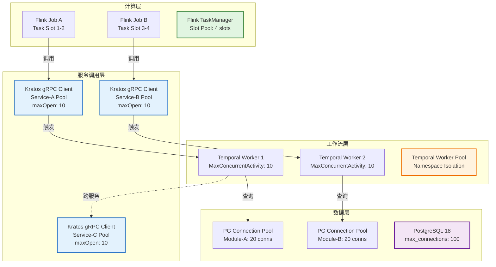
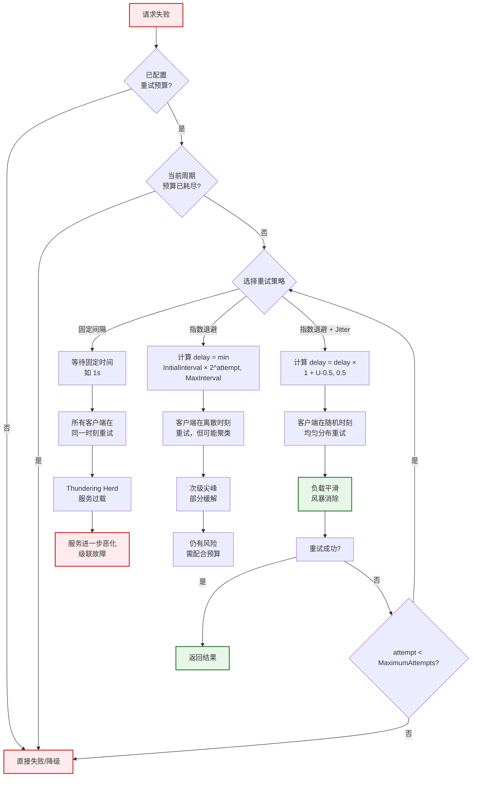

# 舱壁隔离与重试模式

> 所属阶段: TECH-STACK | 前置依赖: [04.01-resilience-evaluation-framework.md] | 形式化等级: L4

## 1. 概念定义 (Definitions)

**Def-TS-04-03-01 (舱壁, Bulkhead)**
舱壁是一种故障隔离机制，通过将系统资源（线程、连接、内存）划分为相互独立的池，确保单个组件或依赖的故障不会耗尽全局资源，从而将故障影响限制在预定义的边界内。该模式借鉴船舶舱壁设计：单个舱室进水不会导致整艘船沉没。

形式化地，设系统总资源为 $R$，划分为 $n$ 个隔离池 $\{R_1, R_2, \ldots, R_n\}$，满足：
$$\bigcup_{i=1}^{n} R_i \subseteq R, \quad R_i \cap R_j = \emptyset \ (i \neq j)$$
当池 $i$ 发生故障并耗尽 $R_i$ 时，其余池 $R_{j \neq i}$ 仍保持可用。

**Def-TS-04-03-02 (重试风暴, Retry Storm)**
重试风暴是指在分布式系统中，当某个服务实例或依赖发生 transient 故障时，大量客户端在几乎同一时间发起重试请求，导致故障服务承受的负载瞬间倍增，进而引发级联过载甚至雪崩的现象。

设正常请求速率为 $\lambda$，故障触发的即时重试因子为 $k$（通常 $k \geq 1$，表示每个失败请求立即重试 1 次），则在重试风暴峰值期间，服务承受的等效请求速率为：
$$\lambda_{\text{effective}} = \lambda \cdot (1 + k)$$
若多个客户端同时触发，叠加效应可使 $\lambda_{\text{effective}}$ 达到正常负载的数倍至数十倍。

**Def-TS-04-03-03 (指数退避, Exponential Backoff)**
指数退避是一种重试间隔调度策略，每次重试失败后，等待时间按指数函数增长，以逐渐降低对故障服务的压力。

形式化定义：设第 $attempt$ 次重试的等待延迟为 $delay(attempt)$，则
$$delay(attempt) = \min\left(InitialInterval \cdot BackoffCoefficient^{attempt},\ MaximumInterval\right)$$
其中 $InitialInterval > 0$ 为初始间隔，$BackoffCoefficient > 1$ 为退避系数，$MaximumInterval$ 为上限封顶值。

**Def-TS-04-03-04 (抖动, Jitter)**
抖动是在指数退避的基础上引入的随机扰动，通过在延迟时间上叠加随机变量，避免多个客户端在精确相同的时刻发起重试（thundering herd 问题）。

形式化定义：设基础延迟为 $delay$，则施加抖动后的实际延迟为：
$$delay_{\text{jittered}} = delay \cdot \left(1 + \mathcal{U}(-0.5,\ 0.5)\right)$$
其中 $\mathcal{U}(-0.5, 0.5)$ 表示区间 $[-0.5, 0.5]$ 上的均匀分布。更一般的 Full Jitter 策略定义为：
$$delay_{\text{full-jitter}} = \mathcal{U}(0,\ delay)$$

**Def-TS-04-03-05 (重试预算, Retry Budget)**
重试预算是 Google SRE 提出的一种流量治理机制，通过限制重试请求占总请求的比例上限，防止重试行为对系统整体稳定性造成不可逆的侵蚀。

形式化地，设观测窗口为 $T$，窗口内总请求数为 $N_{\text{total}}$，重试请求数为 $N_{\text{retry}}$，则重试预算约束为：
$$\frac{N_{\text{retry}}}{N_{\text{total}}} \leq BudgetRatio$$
典型取值如 $BudgetRatio = 0.1\%$（即每 1000 次原始请求最多允许 1 次重试）。

**Def-TS-04-03-06 (故障隔离, Fault Isolation)**
故障隔离是通过架构设计或运行时机制，确保系统中某一组件的故障被限制在特定的作用域内，不会通过依赖链、资源竞争或同步调用等路径扩散至整个系统的工程实践。舱壁、断路器、超时均为故障隔离的实现手段。

## 2. 属性推导 (Properties)

**Lemma-TS-04-03-01 (舱壁对故障爆炸半径的缩减效应)**
在无舱壁隔离的系统中，若某一依赖故障导致资源耗尽，其影响半径覆盖整个系统资源 $R$。引入舱壁后，故障影响被限制在单个资源池 $R_i$ 内。

设系统由 $n$ 个等容量舱壁组成，每个舱壁分配资源 $|R_i| = |R|/n$。当故障发生在舱壁 $i$ 时：

- 故障爆炸半径（资源维度）：$|R_i|/|R| = 1/n$
- 受影响并发能力比例：$1/n$
- 健康舱壁数量：$n - 1$

因此，舱壁将故障爆炸半径缩减为原来的 $1/n$。

**Lemma-TS-04-03-02 (重试预算的收敛性)**
设系统每秒处理原始请求的能力为 $C$，重试预算比例为 $b$（$0 < b \ll 1$），则系统在任意时间窗口内承受的峰值请求率（含重试）满足：
$$\lambda_{\text{peak}} \leq C \cdot (1 + b)$$

证明：根据重试预算定义，重试请求数 $N_{\text{retry}} \leq b \cdot N_{\text{total}}$。因此总请求数 $N_{\text{total}} + N_{\text{retry}} \leq N_{\text{total}} \cdot (1 + b)$。由于系统处理能力 $C$ 必须大于等于原始请求到达率，代入即得结论。

在 $b = 0.1\%$ 的约束下，即使所有请求均失败并重试，重试带来的额外负载也不超过 $0.1\%$，从根本上消除了重试风暴的级联放大可能。

**Prop-TS-04-03-01 (指数退避 + 全抖动的请求分布均匀化)**
设 $m$ 个客户端在同一时刻 $t_0$ 遭遇故障并启动重试，采用指数退避 + Full Jitter 策略。则第 1 次重试时刻 $\{t_1^{(1)}, t_1^{(2)}, \ldots, t_1^{(m)}\}$ 为独立同分布的随机变量，服从 $\mathcal{U}(t_0, t_0 + InitialInterval)$。

由此，第 1 次重试请求在区间 $[t_0, t_0 + InitialInterval]$ 内均匀分布，峰值并发请求数从 $m$ 降低为期望约 $m \cdot \frac{\Delta t}{InitialInterval}$（在任意微小区间 $\Delta t$ 内）。当 $m$ 很大时，请求被充分打散，thundering herd 效应被抑制。

## 3. 关系建立 (Relations)

**舱壁与断路器 (Bulkhead vs. Circuit Breaker)**
舱壁与断路器是互补的故障隔离机制：

- 舱壁是**资源维度**的隔离，通过限制并发访问数防止资源耗尽，属于" proactive 容量保护"。
- 断路器是**调用链路**的隔离，通过检测错误率快速失败，属于" reactive 故障熔断"。
- 二者协同：舱壁防止局部故障扩散为全局资源枯竭；断路器在故障持续时快速拒绝请求，减轻舱壁压力。

**重试与超时 (Retry vs. Timeout)**
重试与超时构成对立统一的策略组合：

- 超时定义了单次调用的最大等待时间，防止请求无限期挂起。
- 重试定义了失败后的补偿行为，提高对 transient 故障的容忍度。
- 二者必须协同配置：超时过短会加剧重试频率，超时过长会浪费舱壁资源。经验法则：`Timeout > RetryInterval + ProcessingTime`。

**隔离与资源池 (Isolation vs. Resource Pooling)**
资源池（连接池、线程池）是舱壁的物理实现载体。资源池化本身是为了复用和降低创建开销，而舱壁化是在资源池之上增加**容量上限**和**隔离边界**：

- PG18 `max_connections` 定义了全局连接池上限，属于粗粒度舱壁。
- Kratos gRPC 连接池按目标服务划分，属于细粒度舱壁。
- Flink Task Slot 隔离将计算资源与任务绑定，属于计算舱壁。

## 4. 论证过程 (Argumentation)

### 4.1 线程池/连接池舱壁

**Kratos gRPC 连接池舱壁**
Kratos 框架在 gRPC 客户端层实现了基于连接池的舱壁隔离。每个上游服务的连接独立管理，配置参数包括：

- `MaxOpen`：连接池最大打开连接数（舱壁容量）
- `MaxIdle`：最大空闲连接数
- `IdleTimeout`：空闲连接回收时间

当某一上游服务出现网络分区或响应延迟时，其对应的连接池可能耗尽，但不会侵占其他服务的连接资源，从而实现故障隔离。

**PG18 连接池舱壁 (`max_connections`)**
PostgreSQL 18 通过 `max_connections` 参数定义全局连接上限。在微服务架构中，多个服务共享同一个 PG 实例时，单服务的连接泄漏可能导致全局拒绝服务。推荐的舱壁化策略：

- 在连接池中间件（如 PgBouncer、HikariCP）层按业务模块划分独立池
- 每个池设置 `maximumPoolSize`，确保单个服务的峰值连接需求不超过其配额
- PG18 新增的 `connection_limits` 按角色/数据库细粒度控制，增强多租户场景下的舱壁能力

**Temporal Worker 池舱壁 (`MaxConcurrentActivityExecutionSize`)**
Temporal Worker 通过以下参数实现活动执行舱壁：

- `MaxConcurrentActivityExecutionSize`：单个 Worker 同时执行 Activity 的上限
- `MaxConcurrentWorkflowTaskExecutionSize`：单个 Worker 同时处理 Workflow Task 的上限
- `WorkerActivitiesPerSecond`：全局速率限制

这些参数将 Temporal Worker 的处理能力与后端依赖（如数据库、外部 API）的容量匹配，防止 Workflow 突发调度导致下游过载。

**Flink Task Slot 隔离**
Flink 的 Task Slot 是计算资源舱壁的核心机制：

- 每个 TaskManager 包含固定数量的 Slot，Slot 之间内存隔离（基于 Netty Buffer Pool 划分）
- 同一 Job 的不同算子可以共享 Slot（Chaining），但不同 Job 默认不共享 Slot Group
- 当某一 Job 出现数据倾斜或 OOM 时，异常被限制在该 Job 的 Slot 范围内，不会扩散至 TaskManager 上其他 Job

### 4.2 重试风暴防护

**指数退避 + 抖动避免 Thundering Herd**
当服务集群中大量客户端同时遭遇故障（如数据库主从切换、网络闪断），若所有客户端采用固定间隔重试，将在 $t_0 + Interval$ 时刻形成请求尖峰。指数退避将重试时间拉开，但仍可能在 $t_0 + MaximumInterval$ 处形成次级尖峰。

引入 Full Jitter 后，重试时刻变为随机变量，根据大数定律，当客户端数量 $m \to \infty$ 时，单位时间内的重试请求率趋于均匀分布：
$$\lim_{m \to \infty} \frac{\text{retries in } [t, t + \Delta t]}{m} = \frac{\Delta t}{delay_{\text{max}}}$$

实际工程中，即使 $m$ 为数十至数百量级，Jitter 已能显著平滑请求分布。

**重试预算（每小时最多重试 10 次）**
Google SRE 模式推荐按错误率比例设定预算，但在具体技术栈中也可以采用绝对数量限制。例如：

- Temporal `MaximumAttempts = 10` 限制单个 Activity 的重试次数
- 系统全局层面通过令牌桶或计数器限制单位时间内的重试总量

当重试预算耗尽后，后续失败请求直接降级或进入死信队列，避免无限重试导致资源浪费。

**截止时间传递（Deadline Propagation）**
在多层调用链中，若每一层独立设置超时，可能导致外层已放弃但内层仍在执行（"孤儿请求"）。截止时间传递通过将全局 Deadline 沿调用链向下传播，确保所有层级的执行时间总和不超过用户可容忍的端到端延迟。

- gRPC：`context.WithDeadline(parentCtx, deadline)` 将截止时间写入 gRPC Metadata
- HTTP：`Timeout` 头或自定义 `X-Request-Deadline` 传递剩余时间
- Temporal：Workflow 的 `WorkflowExecutionTimeout` 作为全局 Deadline，Activity 的 `StartToCloseTimeout` 必须小于剩余 Deadline

### 4.3 定量论证：隔离对故障爆炸半径的量化缩减

基于资源竞争模型，假设系统有 $n$ 个等容量舱壁，每个舱壁容量为 $C_i = C/n$。设故障服务 $S_f$ 的异常请求率为 $\lambda_f$，正常服务 $S_n$ 的请求率为 $\lambda_n$。

**无舱壁场景**：

- 总容量 $C$ 被所有服务共享
- 当 $\lambda_f \gg C$ 时，$S_f$ 耗尽全部容量，$S_n$ 的可用容量趋于 0
- 故障爆炸半径：$100\%$（全局不可用）

**有舱壁场景**：

- $S_f$ 被限制在舱壁 $i$ 内，其最大资源消耗为 $C_i = C/n$
- 其余 $n-1$ 个舱壁的总容量为 $(n-1) \cdot C/n$
- $S_n$ 的可用容量保持为 $(n-1) \cdot C/n$
- 故障爆炸半径：$1/n$（仅舱壁 $i$ 内服务降级）

**量化结论**：舱壁隔离将故障爆炸半径从 $100\%$ 缩减至 $1/n$。例如，4 个舱壁可将影响范围缩减 $75\%$。

### 4.4 跨组件重试策略协同

在 Streaming + Postgres + Temporal + Kratos 的技术栈中，重试发生在多个层级，必须协同设计以避免重试放大：

| 层级 | 重试机制 | 推荐策略 | 关键参数 |
|------|----------|----------|----------|
| Flink 作业 | Task 失败重启 | 固定延迟 + 最大重启次数 | `restart-strategy.fixed-delay.delay`, `restart-strategy.fixed-delay.attempts` |
| Temporal Activity | 指数退避重试 | 指数退避 + Jitter | `InitialInterval`, `BackoffCoefficient`, `MaximumAttempts` |
| Kratos gRPC | 拦截器重试 | 指数退避 + 预算控制 | 拦截器配置 `maxRetries`, `backoff` |
| PG 连接 | 连接池重连 | 有限重试 + 快速失败 | `connectionTimeout`, `reconnectAttempts` |

**协同原则**：

1. **低层快速失败，高层决策重试**：PG 连接层不应长时间阻塞，应由 Temporal Activity 或 Flink Task 层根据业务语义决定是否重试。
2. **避免重试循环**：若 Kratos 调用 Temporal，Temporal Activity 又访问 Kratos 服务，双方的重试策略必须确保不会在环形依赖中无限循环。可通过全局 `Retry-Count` 计数器或 Trace ID 标记重试深度。
3. **Deadline 逐级递减**：外层 Deadline 为 30s 时，内层必须预留网络和处理开销，如 Kratos gRPC 超时 10s，Temporal Activity 超时 8s，PG 查询超时 5s。

## 5. 形式证明 / 工程论证 (Proof / Engineering Argument)

**Thm-TS-04-03-01 (重试预算 + 指数退避的系统收敛性)**
在重试预算比例为 $b$ 且采用指数退避（含 Jitter）的重试策略下，系统对瞬态故障的响应负载满足收敛性：无论原始请求率 $\lambda$ 和故障持续时间 $T_f$ 如何变化，重试引入的额外负载上界为 $b \cdot \lambda$，且重试请求的时序分布随时间趋于均匀。

**工程论证**：

**Part 1 — 负载上界收敛**
根据 Def-TS-04-03-05，重试预算硬性约束了重试请求与总请求的比例：
$$N_{\text{retry}} \leq b \cdot N_{\text{total}}$$
因此，在任何观测窗口内，重试带来的额外请求量被限制在原始流量的 $b$ 倍以内。当 $b = 0.1\%$ 时，即使系统处于完全故障状态（所有请求均失败），重试流量也不超过正常流量的 $0.1\%$。这从根本上消除了重试风暴导致的负载倍增可能。

**Part 2 — 时间分布收敛**
设故障在 $t_0$ 时刻发生，$m$ 个客户端同时触发重试。采用指数退避 + Full Jitter 时，第 $k$ 次重试的延迟为：
$$d_k^{(i)} = \mathcal{U}\left(0,\ \min\left(InitialInterval \cdot BackoffCoefficient^k,\ MaximumInterval\right)\right)$$
对于第 1 次重试（$k=1$），所有 $m$ 个客户端的重试时刻均匀分布在 $[t_0, t_0 + InitialInterval \cdot BackoffCoefficient]$ 内。随着 $k$ 增大，区间上限趋于 $MaximumInterval$，分布范围扩大。

根据概率论中的**大数定律**，独立同分布的均匀随机变量之和的样本均值收敛于期望。因此，当客户端数量 $m$ 足够大时，任意长度为 $\Delta t$ 的时间切片内，期望重试请求数为：
$$E[\text{retries in } \Delta t] = m \cdot \frac{\Delta t}{delay_{\text{max}}^{(k)}}$$
这意味着重试请求从初始的脉冲式分布逐渐平滑为近似均匀分布，thundering herd 效应被有效抑制。

**Part 3 — 综合收敛判定**
系统收敛的判定条件为：在故障持续期间，总请求率（原始 + 重试）不超过系统处理容量的某一安全比例（如 $80\%$）。

设系统容量为 $C$，原始请求率为 $\lambda \leq C$。在故障期间，原始请求失败率为 $p$（$0 < p \leq 1$）。根据重试预算约束，实际进入系统的重试请求率为：
$$\lambda_{\text{retry}} = \min(p \cdot \lambda,\ b \cdot \lambda) = b \cdot \lambda \quad (\text{当 } p \geq b \text{ 时由预算截断})$$
总请求率为：
$$\lambda_{\text{total}} = \lambda + \lambda_{\text{retry}} \leq \lambda \cdot (1 + b) \leq C \cdot (1 + b)$$
由于 $b \ll 1$（典型值 $0.001$），$\lambda_{\text{total}}$ 仅略高于正常负载，系统始终处于可处理范围内，不会发生过载级联。证毕。

## 6. 实例验证 (Examples)

### 6.1 Resilience4j 舱壁配置

```java
import io.github.resilience4j.bulkhead.Bulkhead;
import io.github.resilience4j.bulkhead.BulkheadConfig;
import io.github.resilience4j.bulkhead.BulkheadRegistry;
import java.time.Duration;

// 定义舱壁配置：最大并发调用数 20，最大等待时间 500ms
BulkheadConfig config = BulkheadConfig.custom()
    .maxConcurrentCalls(20)          // 舱壁容量：同时允许 20 个并发调用
    .maxWaitDuration(Duration.ofMillis(500))  // 超过容量时排队等待上限 500ms
    .build();

BulkheadRegistry registry = BulkheadRegistry.of(config);
Bulkhead bulkhead = registry.bulkhead("paymentService", config);

// 使用舱壁包装调用
Supplier<String> decorated = Bulkhead.decorateSupplier(
    bulkhead,
    () -> paymentClient.charge(order)
);

try {
    String result = decorated.get();
} catch (BulkheadFullException ex) {
    // 舱壁已满且等待超时，执行降级逻辑
    return fallbackService.charge(order);
}
```

配置说明：

- `maxConcurrentCalls`：定义舱壁的硬边界，当并发请求达到 20 时，新请求进入等待队列
- `maxWaitDuration`：防止请求在队列中无限等待，超过 500ms 未获得许可则抛出 `BulkheadFullException`
- 与断路器协同：舱壁满时快速失败，断路器检测到错误率上升后熔断，形成双重防护

### 6.2 Temporal 重试策略配置

```go
import (
    "go.temporal.io/sdk/temporal"
    "go.temporal.io/sdk/workflow"
    "time"
)

// 定义指数退避重试策略
retryPolicy := &temporal.RetryPolicy{
    InitialInterval:    1 * time.Second,   // 首次重试等待 1s
    BackoffCoefficient: 2.0,               // 每次间隔翻倍
    MaximumInterval:    60 * time.Second,  // 最大间隔封顶 60s
    MaximumAttempts:    10,                // 最多重试 10 次
    NonRetryableErrorTypes: []string{"InvalidArgument", "PermissionDenied"},
}

// 在 Activity Options 中应用
ao := workflow.ActivityOptions{
    StartToCloseTimeout: 5 * time.Minute,
    RetryPolicy:         retryPolicy,
}

ctx = workflow.WithActivityOptions(ctx, ao)

// 执行 Activity
var result PaymentResult
err := workflow.ExecuteActivity(ctx, ProcessPayment, paymentReq).Get(ctx, &result)
```

配置说明：

- `InitialInterval` + `BackoffCoefficient`：实现指数退避，第 $n$ 次重试间隔为 $2^{n-1}$ 秒（1s, 2s, 4s, 8s, ... 封顶 60s）
- `MaximumAttempts`：作为绝对重试预算，防止无限重试
- `NonRetryableErrorTypes`：对业务错误（如参数非法、权限不足）立即失败，不浪费重试预算
- 与 Deadline 协同：`StartToCloseTimeout` 必须大于重试间隔总和的期望，确保在 Deadline 内有机会完成多次重试

### 6.3 Kratos 中间件重试配置

```go
import (
    "github.com/go-kratos/kratos/v2/middleware/recovery"
    "github.com/go-kratos/kratos/v2/middleware/retry"
    "github.com/go-kratos/kratos/v2/transport/grpc"
    "google.golang.org/grpc/codes"
    "time"
)

// 构建 gRPC 客户端，带重试中间件
conn, err := grpc.DialInsecure(
    context.Background(),
    grpc.WithEndpoint("discovery:///user-service"),
    grpc.WithMiddleware(
        recovery.Recovery(),
        retry.Retry(
            retry.WithAttempts(3),                    // 最大重试 3 次
            retry.WithBackoff(func(attempt uint) time.Duration {
                // 自定义指数退避 + Jitter
                base := time.Second * time.Duration(1<<attempt)
                if base > 30*time.Second {
                    base = 30 * time.Second
                }
                jitter := time.Duration(float64(base) * (0.5 + rand.Float64()))
                return jitter
            }),
            retry.WithConditions(
                retry.WithErrorCode(codes.Unavailable),
                retry.WithErrorCode(codes.DeadlineExceeded),
            ),
        ),
    ),
)
```

配置说明：

- `retry.WithAttempts(3)`：限定单个 RPC 调用的重试次数，作为调用级预算
- 自定义 `Backoff` 函数：实现指数退避（`1 << attempt`）+ Jitter（`base * (0.5 + rand)`），避免 thundering herd
- `retry.WithConditions`：仅对可重试错误（Unavailable、DeadlineExceeded）触发重试，业务错误直接失败
- 与舱壁协同：Kratos 的连接池层按服务端点隔离，单服务端点的重试不会挤占其他端点的连接资源

## 7. 可视化 (Visualizations)

以下可视化展示了舱壁隔离在多技术栈环境中的架构，以及重试策略的决策对比。

**图 1：多技术栈舱壁隔离架构**

整个系统通过分层舱壁将故障限制在不同作用域内：Flink Task Slot 隔离计算，Kratos 连接池隔离服务调用，PG 连接池隔离数据访问，Temporal Worker 池隔离工作流执行。



**图 2：重试策略决策对比流程**

该流程图对比了固定间隔重试、指数退避、指数退避 + Jitter 三种策略在面对 thundering herd 时的行为差异，并展示重试预算的熔断逻辑。



## 8. 引用参考 (References)
