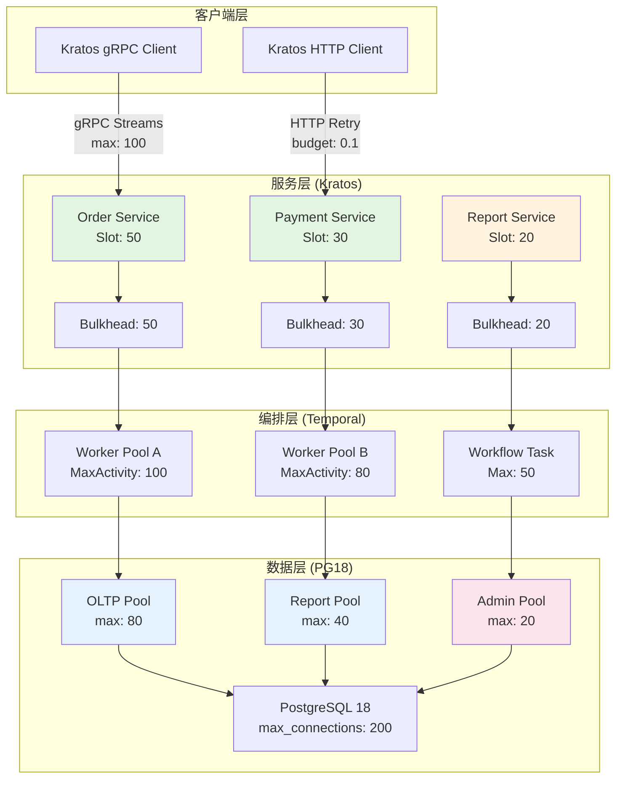
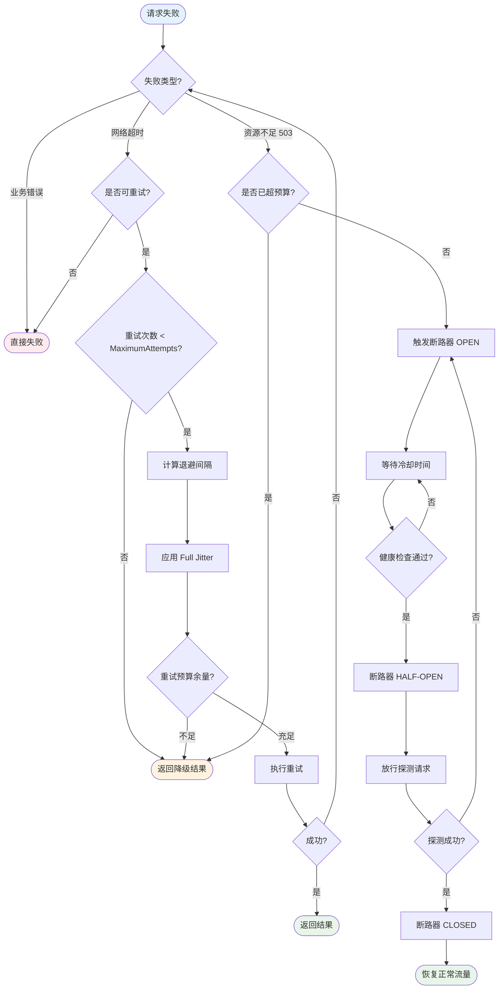

# 舱壁隔离与重试模式

> 所属阶段: TECH-STACK | 前置依赖: [04.01-resilience-evaluation-framework.md] | 形式化等级: L4

## 1. 概念定义 (Definitions)

本节严格定义舱壁隔离与重试模式的核心概念，为后续定量分析与工程论证建立形式化基础。

**Def-T-04-03-01 (舱壁, Bulkhead)**
设系统 $S$ 由 $n$ 个功能域 $\{D_1, D_2, \dots, D_n\}$ 组成，每个域消耗资源集 $R_i \subseteq R$。舱壁隔离是一种资源分区策略，引入分配函数 $B: R \times \{1,\dots,n\} \to \mathbb{R}^+$，使得对于任意 $i \neq j$，$D_i$ 的资源消耗受限于 $B(r, i)$，且当 $D_i$ 发生故障导致资源 $r$ 耗尽时，满足：

$$\forall r \in R, \quad \sum_{j \neq i} \text{Alloc}_j(r) \leq B(r, j)$$

即故障域 $D_i$ 的资源消耗不会挤占其他域的配额。该概念源自船舶设计中的防水隔舱[^1]。

**Def-T-04-03-02 (信号量舱壁, SemaphoreBulkhead)**
一种基于计数信号量的舱壁实现，维护共享计数器 $C$（初始值为 $C_{max}$）。当域 $D_i$ 内的执行单元请求进入临界区时，执行 $P(C)$；退出时执行 $V(C)$。若 $C = 0$，则请求被立即拒绝或排队（取决于配置）。形式上，并发度约束为：

$$\text{Concurrent}(D_i) \leq C_{max}$$

**Def-T-04-03-03 (线程池舱壁, ThreadPoolBulkhead)**
一种基于固定线程池的舱壁实现，为每个隔离域分配独立的线程池 $T_i$，满足 $|T_i| = N_i$（固定大小）。与信号量舱壁的区别在于：线程池舱壁将执行单元与线程绑定，提供天然的线程隔离和队列边界；而信号量舱壁仅在当前调用线程上限制并发，不创建独立线程。形式上：

$$\forall t \in T_i, \quad t \text{ 仅执行属于 } D_i \text{ 的任务}$$

**Def-T-04-03-04 (连接池隔离, Connection Pool Isolation)**
在数据访问层中，为不同服务或不同查询类型分配独立的连接池实例 $\{P_1, P_2, \dots, P_m\}$，每个池具有独立的上限 $C_k$ 和超时配置。设总连接需求为 $N$，独立池配置下的可用连接为：

$$\text{Available}_{\text{isolated}} = \sum_{k=1}^{m} \min(C_k, \text{Demand}_k)$$

而共享池配置下可用连接为 $\min(C_{\text{total}}, N)$。当某一查询类型发生连接泄漏时，隔离池保证：

$$\text{Leaked}_k \leq C_k \quad \Rightarrow \quad \text{Pool}_{j \neq k} \text{ 不受影响}$$

**Def-T-04-03-05 (重试预算, Retry Budget)**
给定正常请求率 $\lambda_{\text{normal}}$（单位：请求/秒），重试预算定义允许的重试请求率上限：

$$\lambda_{\text{retry}}^{\text{budget}} = \beta \cdot \lambda_{\text{normal}}$$

其中 $\beta \in (0, 1]$ 为预算系数（工程实践中常取 $\beta = 0.1$）。系统在任意时间窗口 $[t_1, t_2]$ 内累计重试请求数必须满足：

$$\int_{t_1}^{t_2} \lambda_{\text{retry}}(t)\, dt \leq \beta \int_{t_1}^{t_2} \lambda_{\text{normal}}(t)\, dt$$

**Def-T-04-03-06 (重试风暴, Retry Storm)**
设系统中存在 $N$ 个客户端，每个客户端对失败请求实施重试策略。若服务端可用容量为 $C$，正常负载为 $L < C$，则在瞬时故障下，客户端集体重试产生的负载 $L_{\text{retry}}$ 可能满足：

$$L_{\text{retry}} = N \cdot \sum_{k=1}^{M} p_k \cdot L > C$$

其中 $M$ 为最大重试次数，$p_k$ 为第 $k$ 次重试的触发概率。当 $L_{\text{retry}} > C$ 时，系统从瞬时故障恶化为级联过载，此现象称为重试风暴[^2]。

**Def-T-04-03-07 (指数退避, Exponential Backoff)**
一种重试间隔计算策略，第 $k$ 次重试的等待间隔为：

$$T_k = \min(T_{\text{max}}, T_0 \cdot c^k)$$

其中 $T_0$ 为初始间隔，$c$ 为退避系数（通常 $c = 2$），$T_{\text{max}}$ 为最大间隔上限。该策略将重试流量在时间轴上指数稀疏化，降低对恢复中系统的冲击。

**Def-T-04-03-08 (抖动, Jitter)**
在指数退避基础上引入随机扰动，避免多个客户端在同一时刻发起重试导致的同步冲击。Full Jitter 策略下，第 $k$ 次重试的实际等待时间为：

$$T_k^{\text{jitter}} = \text{Uniform}(0, \min(T_{\text{max}}, T_0 \cdot c^k))$$

Decorrelated Jitter 变体则采用：

$$T_k^{\text{decorrelated}} = \text{Uniform}(T_{\text{min}}, T_{k-1} \cdot 3)$$

## 2. 属性推导 (Properties)

从上述定义可直接推导舱壁与重试策略的核心工程属性。

**Lemma-T-04-03-01 (隔离对故障爆炸半径的缩减)**
设共享资源池的总容量为 $C$，无隔离时故障域 $D_i$ 可消耗全部资源导致全系统故障。采用舱壁隔离后，设 $D_i$ 的配额为 $C_i$，则故障爆炸半径缩减比例为：

$$\rho = \frac{C - C_i}{C} = 1 - \frac{C_i}{C}$$

在均分隔离策略下（$C_i = C/n$），有 $\rho = 1 - 1/n$。当 $n \geq 2$ 时，$\rho \geq 50\%$，即至少一半的容量不受单个域故障影响。

*证明.* 无隔离时，故障域可占用资源上限为 $C$，影响所有 $n$ 个域。隔离后占用上限为 $C_i$，影响范围缩减为 $1$ 个域。资源保护比例直接由定义得出。$\square$

**Lemma-T-04-03-02 (重试预算对过载因子的上限约束)**
设系统正常请求率为 $\lambda$，失败率为 $f$，最大重试次数为 $M$。无预算约束时，重试放大因子为：

$$A_{\text{unbounded}} = \sum_{k=0}^{M} f^k = \frac{1 - f^{M+1}}{1 - f}$$

引入重试预算 $\beta$ 后，实际重试率被限制为 $\lambda_{\text{retry}} \leq \beta \lambda$，则有效放大因子满足：

$$A_{\text{budgeted}} = 1 + \frac{\lambda_{\text{retry}}}{\lambda} \leq 1 + \beta$$

当 $\beta = 0.1$ 时，$A_{\text{budgeted}} \leq 1.1$，而无预算时若 $f = 0.5, M = 5$，$A_{\text{unbounded}} \approx 1.97$。

*证明.* 预算定义直接限制重试流量占正常流量的比例，放大因子由总流量除以正常流量得出：$(\lambda + \lambda_{\text{retry}})/\lambda = 1 + \lambda_{\text{retry}}/\lambda \leq 1 + \beta$。$\square$

**Prop-T-04-03-01 (指数退避+抖动对重试同步的解聚效果)**
设 $N$ 个独立客户端在同一时刻 $t_0$ 遭遇故障并启动重试。纯指数退避下，第 $k$ 轮重试集中在区间 $[T_k - \delta, T_k + \delta]$（网络延迟波动），重试峰值密度为 $O(N)$。引入 Full Jitter 后，第 $k$ 轮重试时间均匀分布在 $[0, T_k]$ 上，任意单位时间窗口内的期望重试数为：

$$\mathbb{E}[\text{retries per unit time}] = \frac{N}{T_k}$$

峰值密度降为 $O(1)$（相对于同步重试的 $O(N)$ 尖峰），实现了时间维度上的负载解聚[^3]。

## 3. 关系建立 (Relations)

**舱壁与断路器的关系**
舱壁隔离（Bulkhead）与断路器（Circuit Breaker）是互补的故障 containment 策略：

- **舱壁** 关注 **空间隔离**：通过资源分区限制故障在横向（跨域）的扩散，保证域 $D_i$ 的故障不侵占 $D_j$ 的资源配额。
- **断路器** 关注 **时间隔离**：通过状态机（Closed → Open → Half-Open）在纵向（时间轴）上阻断对故障服务的持续调用。

二者的组合形成二维防御矩阵：舱壁确保局部故障的边界；断路器在边界内阻止无效重试。当域 $D_i$ 的断路器 Open 时，其舱壁配额 $C_i$ 可被其他健康域复用（若配置动态配额），或保持空置以避免故障恢复后的瞬时冲击。

**重试与背压的关系**
重试（Retry）与背压（Backpressure）是流处理系统中负载管理的两个正交维度：

- **背压** 是 **预防性** 机制：当下游处理能力不足时，向上游传播反压信号，从源头限制数据产生速率，避免队列无限增长。
- **重试** 是 **恢复性** 机制：当瞬时故障发生时，通过延迟重试提高操作最终成功率。

无约束的重试会破坏背压契约：上游因背压降速，但客户端重试却产生额外流量，形成 "背压泄漏"。重试预算（Def-T-04-03-05）通过量化重试流量上限，使重试层与背压层达成速率契约：

$$\lambda_{\text{source}} + \lambda_{\text{retry}}^{\text{budget}} \leq \lambda_{\text{sink}}^{\text{capacity}}$$

**舱壁与连接池的关系**
连接池本质上是一种特殊的舱壁实现：将有限的数据库连接资源按域分区。PG18 的 `max_connections` 是全局舱壁；应用层的多池配置（如 HikariCP 的多个 `HikariDataSource` 实例）是域级舱壁。二者的层级关系满足：

$$\sum_{k=1}^{m} C_k^{\text{app}} \leq C^{\text{PG}} = \text{max_connections}$$

违反此不等式将导致应用层总连接需求超过 PG18 全局上限，引发 `FATAL: sorry, too many clients already` 错误。

## 4. 论证过程 (Argumentation)

### 4.1 线程池/连接池舱壁的工程实现

**Kratos gRPC 连接池舱壁**
Kratos 框架在 gRPC 传输层提供两类舱壁机制：

1. **流级舱壁**：通过 `grpc.WithMaxConcurrentStreams(uint32)` 限制单条 HTTP/2 连接上的最大并发流数。HTTP/2 的多路复用允许单 TCP 连接承载多路 gRPC 调用，但无限制时大量并发流会竞争连接上的发送/接收窗口，导致队头阻塞（Head-of-Line Blocking）。设单连接带宽为 $B$，流数为 $N$，则每流可用带宽为 $B/N$；当 $N \to \infty$ 时，单流带宽趋近于零，所有流饿死。

2. **连接保活舱壁**：通过 `grpc.KeepaliveParams(keepalive.ClientParameters{Time: 10s, Timeout: 3s})` 定义连接的存活探测策略，及时回收僵尸连接，避免连接泄漏侵蚀舱壁容量。

**PG18 连接池舱壁**
PostgreSQL 18 的全局连接舱壁由 `max_connections` 参数控制（默认 100，生产环境通常调增至 200）。PG18 引入的 `connection_traffic_control` 特性（前瞻性特性，以实际发布为准）允许对连接进行更细粒度的资源分组。在应用层，推荐按业务域划分连接池：

```
┌─────────────────────────────────────────────┐
│           Application Layer                  │
│  ┌──────────────┐      ┌──────────────┐    │
│  │   Pool-A     │      │   Pool-B     │    │
│  │ (OLTP: 80)   │      │ (Report: 40) │    │
│  └──────┬───────┘      └──────┬───────┘    │
│         │                     │             │
│  ┌──────┴───────┐      ┌──────┴───────┐    │
│  │  PG18 Primary │◄────►│  PG18 Replica │   │
│  │ max_conn=200  │      │ max_conn=100  │   │
│  └───────────────┘      └───────────────┘   │
└─────────────────────────────────────────────┘
```

在该配置中，OLTP 池（80 连接）与报表池（40 连接）舱壁隔离。当报表查询触发全表扫描导致连接长时间占用时，OLTP 事务仍拥有独立的 80 连接配额，不受报表域故障影响。

**Temporal Worker 池舱壁**
Temporal Worker 通过 `worker.Options` 提供两类并发舱壁：

- `MaxConcurrentActivityExecutionSize: 100` — Activity 执行舱壁，限制单个 Worker 实例同时执行的 Activity 任务数
- `MaxConcurrentWorkflowTaskExecutionSize: 50` — Workflow Task 执行舱壁，限制同时处理的 Workflow 决策任务数

Temporal 的舱壁设计区分了 Workflow（轻量、状态机推进）与 Activity（重量、实际业务操作）的资源特性。Activity 通常涉及外部 I/O（数据库查询、HTTP 调用），是资源消耗的主要方；Workflow 则是内存中的状态机计算。独立舱壁确保重量 Activity 的阻塞不会冻结 Workflow 的决策调度。

### 4.2 重试风暴防护的三层策略

**第一层：指数退避（时间稀疏化）**
将重试流量在时间轴上指数分散。设初始间隔 $T_0 = 1s$，退避系数 $c = 2.0$，最大间隔 $T_{\text{max}} = 60s$，最大尝试次数 $M = 5$，则重试时间序列为：

| 尝试次数 | 计算间隔 | 实际间隔（取 min） |
|---------|---------|------------------|
| 1 | $1 \times 2^0 = 1s$ | 1s |
| 2 | $1 \times 2^1 = 2s$ | 2s |
| 3 | $1 \times 2^2 = 4s$ | 4s |
| 4 | $1 \times 2^3 = 8s$ | 8s |
| 5 | $1 \times 2^4 = 16s$ | 16s |

总重试窗口为 $1+2+4+8+16 = 31s$，将潜在的重试尖峰分散到半分钟的时间跨度内。

**第二层：抖动（相位解聚）**
纯指数退避在多客户端场景下仍存在同步风险：所有客户端按相同公式计算，若时钟对齐则重试仍可能聚集。Full Jitter 通过随机化完全消除这种相位锁定：

```python
sleep = random.uniform(0, min(cap, base * 2**attempt))
```

AWS 的实践经验表明，Decorrelated Jitter 在某些场景下比 Full Jitter 提供更优的尾延迟表现[^3]。

**第三层：重试预算（流量硬上限）**
作为最终防线，重试预算为重试流量设置不可逾越的上界。设服务正常处理 1000 RPS，预算系数 $\beta = 0.1$，则无论多少请求失败，系统最多允许 100 次重试/秒。超出预算的失败请求直接进入降级逻辑（返回缓存、默认值或错误）。

### 4.3 定量论证：隔离对故障爆炸半径的量化缩减

考虑基于资源竞争模型的定量分析。设系统有 $n$ 个功能域共享资源池，总容量为 $C$。无隔离时，各域按需竞争资源，采用 "先到先得" 策略。

**定理（资源竞争下的故障扩散边界）**
设故障域 $D_f$ 发生资源泄漏，消耗速率从正常 $\mu$ 突增至 $\mu' \gg \mu$。无隔离时，系统完全故障时间：

$$T_{\text{total-failure}}^{\text{no-bulkhead}} = \frac{C}{\mu'}$$

采用均分舱壁隔离（每域配额 $C/n$）后，故障域自身耗尽配额的时间：

$$T_{\text{domain-failure}} = \frac{C/n}{\mu'} = \frac{1}{n} \cdot T_{\text{total-failure}}^{\text{no-bulkhead}}$$

其他域 $D_j$（$j \neq f$）拥有完整配额 $C/n$，可持续正常运行时间：

$$T_{\text{healthy}}^{\text{others}} = \infty \quad \text{(在 } D_f \text{ 不再额外侵占下)}$$

故障爆炸半径缩减比例为：

$$\rho = \frac{(n-1) \cdot C/n}{C} = \frac{n-1}{n}$$

当 $n = 5$ 时，$\rho = 80\%$，即 80% 的系统容量免受故障域影响。

**非均分隔离的优化**
实际工程中各域的重要性与负载不同，常采用加权隔离：

$$C_i = C \cdot w_i, \quad \sum_{i=1}^{n} w_i \leq 1$$

关键域（如支付核心）分配 $w_i = 0.4$，次要域（如日志采集）分配 $w_j = 0.1$。当次要域故障时，关键域的 40% 配额完全不受影响。

### 4.4 五技术栈各组件的舱壁配置策略

本技术栈涵盖 Streaming、PostgreSQL、Temporal、Kratos 及基础设施层，各组件的舱壁策略如下：

| 组件层级 | 舱壁机制 | 配置参数 | 隔离目标 |
|---------|---------|---------|---------|
| **Streaming (Flink)** | Task Slot 隔离 | `taskmanager.numberOfTaskSlots` | 防止单个 Job 的 Backpressure 扩散到其他 Job |
| **PG18** | 连接池分区 | `max_connections`, 应用层多 HikariPool | 防止慢查询耗尽全部连接 |
| **Temporal** | Worker 并发舱壁 | `MaxConcurrentActivityExecutionSize` | 防止重 Activity 阻塞 Workflow 调度 |
| **Kratos (gRPC)** | 流数限制 + 连接池 | `WithMaxConcurrentStreams`, 连接池大小 | 防止单服务拖垮客户端连接资源 |
| **Kratos (HTTP)** | 客户端重试舱壁 | 重试预算、退避策略、熔断器 | 防止重试风暴冲击下游 |
| **基础设施** | K8s ResourceQuota | `limits.cpu`, `limits.memory` | 防止 Pod 资源泄漏影响节点稳定性 |

## 5. 形式证明 / 工程论证 (Proof / Engineering Argument)

**Thm-T-04-03-01 (舱壁隔离保证局部故障不扩散的充分条件)**
设系统 $S$ 由 $n \geq 2$ 个域 $\{D_1, \dots, D_n\}$ 组成，资源集 $R = \{r_1, \dots, r_m\}$。若满足以下条件：

1. **硬分区条件**：对每个资源 $r_k$，存在分配函数 $B(r_k, i)$ 使得 $D_i$ 对 $r_k$ 的使用量 $u_i(r_k)$ 满足 $u_i(r_k) \leq B(r_k, i)$ 几乎必然成立（由 OS/运行时强制执行）；
2. **配额饱和条件**：$\sum_{i=1}^{n} B(r_k, i) \leq C_k$，其中 $C_k$ 为资源 $r_k$ 的物理上限；
3. **故障域有界性**：故障域 $D_f$ 的资源需求 $d_f(r_k)$ 有限（虽可能 $d_f(r_k) \gg B(r_k, f)$，但超出部分被拒绝而非无限累积）。

则对任意 $j \neq f$，$D_j$ 的可用资源不受 $D_f$ 故障影响，即：

$$\text{Available}_j(r_k \mid D_f \text{ 故障}) = B(r_k, j) - u_j(r_k) = \text{Available}_j(r_k \mid D_f \text{ 正常})$$

*证明.* 由条件 1，舱壁机制通过 OS 调度器或运行时监控强制执行资源上限。无论 $D_f$ 内部发生何种故障（死循环、内存泄漏、连接风暴），其对 $r_k$ 的使用被截断于 $B(r_k, f)$。由条件 2，总分配不超过物理容量，不存在过度承诺导致的系统性资源枯竭。由条件 3，超出配额的请求被拒绝/排队/降级，不会以隐藏形式（如无限增长的等待队列）侵占其他域资源。因此 $D_f$ 的故障行为被完全限制在其配额边界内，$D_j$（$j \neq f$）的可用资源不变。$\square$

**工程推论：舱壁不是万能的**
上述证明的成立依赖于 "硬分区" 条件的满足。在以下场景中，舱壁可能失效：

1. **共享内核资源**：Linux 的 inode cache、TCP 协议栈全局状态等无法按域分区，某一域的极端行为（如大量 TIME_WAIT 套接字）仍可影响全局网络性能。
2. **级联超时**：$D_j$ 调用 $D_f$ 的同步接口，即使 $D_j$ 自身资源充足，等待 $D_f$ 响应的线程仍被占用，形成 "逻辑故障扩散"。断路器在此场景中作为必要补充。
3. **配额动态调整**：若舱壁支持动态配额再分配，故障域的配额释放后可能被健康域获取，但配额回收的延迟窗口内仍可能存在资源碎片。

## 6. 实例验证 (Examples)

### 6.1 Resilience4j Bulkhead 配置

Resilience4j 提供两种舱壁实现。以下为信号量舱壁配置，适用于轻量级、非阻塞操作：

```java
import io.github.resilience4j.bulkhead.Bulkhead;
import io.github.resilience4j.bulkhead.BulkheadConfig;
import io.github.resilience4j.bulkhead.BulkheadRegistry;

// 信号量舱壁配置
BulkheadConfig semaphoreConfig = BulkheadConfig.custom()
    .maxConcurrentCalls(50)          // 最大并发调用数
    .maxWaitDuration(Duration.ofMillis(500))  // 获取许可最大等待时间
    .build();

BulkheadRegistry registry = BulkheadRegistry.of(semaphoreConfig);
Bulkhead orderBulkhead = registry.bulkhead("orderService", semaphoreConfig);

// 使用
Supplier<String> decorated = Bulkhead.decorateSupplier(
    orderBulkhead,
    () -> orderClient.placeOrder(request)
);
String result = Try.ofSupplier(decorated)
    .recover(throwable -> "FALLBACK")
    .get();
```

线程池舱壁适用于阻塞 I/O 操作，提供独立的线程和队列：

```java
import io.github.resilience4j.bulkhead.ThreadPoolBulkheadConfig;

ThreadPoolBulkheadConfig threadPoolConfig = ThreadPoolBulkheadConfig.custom()
    .maxThreadPoolSize(20)           // 线程池最大线程数
    .coreThreadPoolSize(10)          // 核心线程数
    .queueCapacity(100)              // 等待队列容量
    .keepAliveDuration(Duration.ofMillis(5000))
    .build();
```

### 6.2 Kratos HTTP 客户端重试配置

Kratos HTTP 客户端内置重试中间件，支持指数退避和重试预算：

```go
import (
    "github.com/go-kratos/kratos/v2/transport/http"
    "github.com/go-kratos/kratos/v2/middleware/recovery"
    "time"
)

// 客户端配置
client, err := http.NewClient(
    http.WithEndpoint("http://api.example.com:8000"),
    http.WithTimeout(time.Second * 5),
    http.WithMiddleware(
        recovery.Recovery(),
    ),
)

// Kratos HTTP 重试通常通过自定义 RoundTripper 或中间件实现
// 以下展示典型的指数退避 + Jitter 重试中间件配置
```

在 Kratos gRPC 层，流级舱壁和连接保活配置如下：

```go
import (
    "google.golang.org/grpc"
    "google.golang.org/grpc/keepalive"
    "time"
)

// gRPC 连接配置（客户端侧舱壁）
conn, err := grpc.Dial(target,
    grpc.WithMaxConcurrentStreams(100),  // 单连接最大并发流
    grpc.WithKeepaliveParams(keepalive.ClientParameters{
        Time:    10 * time.Second,       // 发送 keepalive 探测间隔
        Timeout: 3 * time.Second,        // 探测超时
    }),
    grpc.WithDefaultServiceConfig(`{
        "loadBalancingConfig": [{"round_robin": {}}],
        "methodConfig": [{
            "name": [{"service": "my.Service"}],
            "retryPolicy": {
                "maxAttempts": 5,
                "initialBackoff": "1s",
                "maxBackoff": "60s",
                "backoffMultiplier": 2.0,
                "retryableStatusCodes": ["UNAVAILABLE", "DEADLINE_EXCEEDED"]
            }
        }]
    }`),
)
```

### 6.3 PG18 连接池配置

使用 HikariCP 作为应用层连接池，实施按域舱壁隔离：

```yaml
# application.yml — OLTP 域连接池
spring.datasource.oltp.type: com.zaxxer.hikari.HikariDataSource
spring.datasource.oltp.jdbc-url: jdbc:postgresql://primary:5432/mydb
spring.datasource.oltp.username: ${DB_USER}
spring.datasource.oltp.password: ${DB_PASS}
spring.datasource.oltp.hikari.maximum-pool-size: 80
spring.datasource.oltp.hikari.minimum-idle: 20
spring.datasource.oltp.hikari.connection-timeout: 30000
spring.datasource.oltp.hikari.idle-timeout: 600000
spring.datasource.oltp.hikari.max-lifetime: 1800000

# 报表域连接池（独立舱壁）
spring.datasource.report.type: com.zaxxer.hikari.HikariDataSource
spring.datasource.report.jdbc-url: jdbc:postgresql://replica:5432/mydb
spring.datasource.report.hikari.maximum-pool-size: 40
spring.datasource.report.hikari.minimum-idle: 10
```

PG18 服务器端全局舱壁配置：

```ini
# postgresql.conf
max_connections = 200                   # 全局硬上限
shared_buffers = 4GB                    # 共享内存舱壁
work_mem = 16MB                         # 每查询工作内存（舱壁化）
maintenance_work_mem = 512MB            # 维护操作内存上限
max_parallel_workers_per_gather = 4     # 并行查询工作线程上限
max_parallel_workers = 8                # 全局并行工作线程上限
```

### 6.4 Temporal Worker 并发配置

Temporal Worker 的舱壁配置通过 `worker.Options` 结构体实现：

```go
import (
    "go.temporal.io/sdk/worker"
    "go.temporal.io/sdk/client"
)

c, err := client.Dial(client.Options{
    HostPort: "temporal-frontend:7233",
})

w := worker.New(c, "my-task-queue", worker.Options{
    // Activity 执行舱壁
    MaxConcurrentActivityExecutionSize: 100,

    // Workflow Task 执行舱壁
    MaxConcurrentWorkflowTaskExecutionSize: 50,

    // 本地 Activity 并发舱壁
    MaxConcurrentLocalActivityExecutionSize: 50,

    // 其他关键配置
    WorkerActivitiesPerSecond: 100.0,           // 每秒启动 Activity 速率限制
    TaskQueueActivitiesPerSecond: 200.0,        // Task Queue 级别速率限制
    MaxConcurrentSessionExecutionSize: 1000,    // Session 并发上限
    DeadlockDetectionTimeout: time.Second * 5,  // Workflow 死锁检测
})

// 注册 Workflow 和 Activity
w.RegisterWorkflow(MyWorkflow)
w.RegisterActivity(MyActivity)

err = w.Run(worker.InterruptCh())
```

Temporal 的重试策略在 Workflow 和 Activity 层面独立配置：

```go
import (
    "go.temporal.io/sdk/temporal"
    "go.temporal.io/sdk/workflow"
    "time"
)

// Activity 重试策略：指数退避 + 最大尝试
retryPolicy := &temporal.RetryPolicy{
    InitialInterval:    time.Second,         // T_0 = 1s
    BackoffCoefficient: 2.0,                 // c = 2.0
    MaximumInterval:    time.Minute,         // T_max = 60s
    MaximumAttempts:    5,                   // M = 5
    NonRetryableErrorTypes: []string{"InvalidArgument", "PermissionDenied"},
}

ao := workflow.ActivityOptions{
    StartToCloseTimeout: time.Minute * 5,
    RetryPolicy:         retryPolicy,
}

ctx = workflow.WithActivityOptions(ctx, ao)
```

## 7. 可视化 (Visualizations)

### 7.1 舱壁隔离架构

以下图示展示了五技术栈环境下的多层舱壁隔离架构。每个层级独立分配资源配额，故障被限制在 originating 域内。



上图展示了从客户端到数据库的全链路舱壁：

- **客户端层**：Kratos gRPC 通过 `maxConcurrentStreams` 限制单连接流数；HTTP 客户端通过重试预算限制重试流量。
- **服务层**：Resilience4j Bulkhead 为每个微服务分配独立并发槽位（Order: 50, Payment: 30, Report: 20）。
- **编排层**：Temporal Worker 的 `MaxConcurrentActivityExecutionSize` 将 Activity 执行隔离在独立的工作线程池中。
- **数据层**：HikariCP 多池配置将 PG18 的 200 连接按业务域分区（OLTP: 80, Report: 40, Admin: 20）。

当 Report Service 发生连接泄漏时，其 20 个服务槽位和 40 个数据库连接被耗尽，但 Order Service 的 50 槽位和 80 连接完全不受影响，故障爆炸半径被限制在报表域内。

### 7.2 重试策略对比

以下决策树展示了在不同故障场景下如何选择重试策略，以及指数退避+抖动+预算的组合如何协同防止重试风暴。



该流程图的关键决策点：

1. **预算检查**（节点 I）：在任何重试执行前，先校验重试预算余量。预算耗尽直接进入降级，避免重试风暴。
2. **抖动注入**（节点 H）：在指数退避计算后注入随机抖动，打散多客户端的重试同步。
3. **断路器协同**（节点 K）：当资源不足类错误频繁发生时，断路器直接切断流量，为系统恢复赢得时间窗口。

## 8. 引用参考 (References)

[^1]: N. Brown, "Bulkhead Pattern — Cloud Design Patterns", Microsoft Azure Architecture Center, 2023. <https://learn.microsoft.com/en-us/azure/architecture/patterns/bulkhead>

[^2]: M. Brooker et al., "Retries and Backoff Strategies in Distributed Systems", AWS Architecture Blog, 2025. <https://aws.amazon.com/blogs/architecture/exponential-backoff-and-jitter/>

[^3]: A. B. Sharma et al., "Fail at Scale: Reliability in the Presence of Overload", arXiv:2512.16959v1 [cs.DC], 2025. <https://arxiv.org/abs/2512.16959v1>
