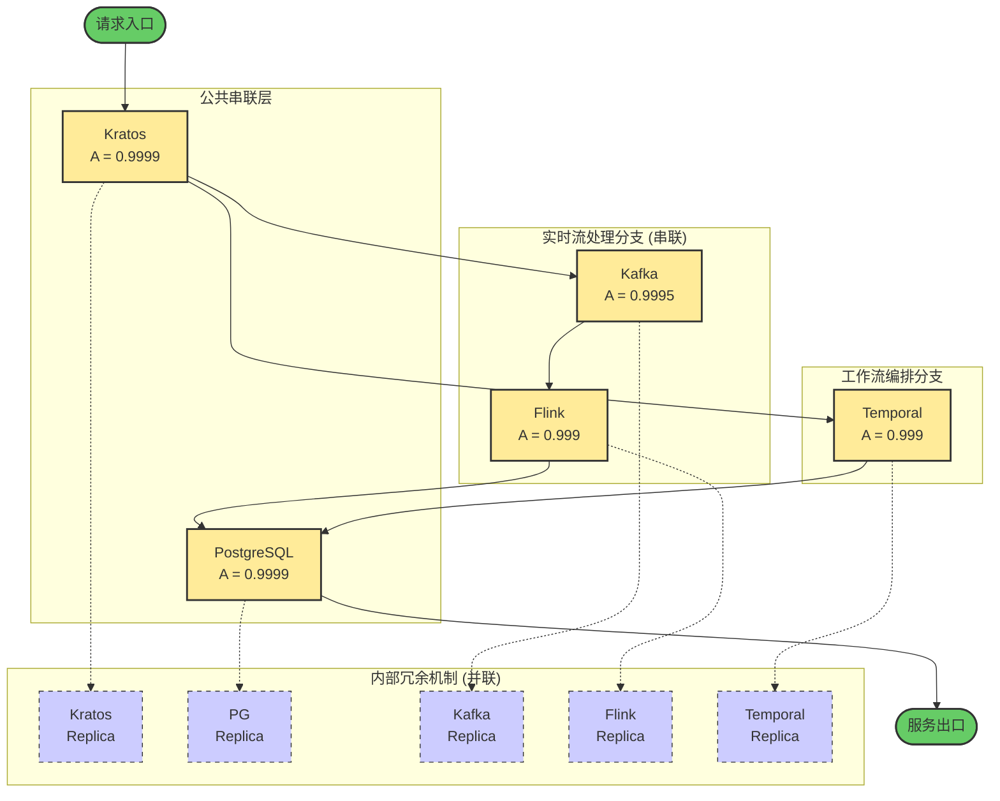

# 组合容错形式化论证

> 所属阶段: TECH-STACK | 前置依赖: [04.01-resilience-evaluation-framework.md, 01.03-dependency-coupling-matrix.md] | 形式化等级: L5

## 1. 概念定义 (Definitions)

本节建立组合容错分析所需的核心形式化概念。所有定义均基于可靠性工程与概率论的标准框架，并针对 PostgreSQL-Kafka-Flink-Temporal-Kratos 五技术栈组合系统进行实例化。

**Def-TS-04-04-01 组合系统 (Composite System)**

一个组合系统 $
S$ 是一个三元组 $
S = (C, D,
R)$，其中：

- $C = \{C_1, C_2, \dots, C_n\}$ 为组件集合；
- $D \subseteq C \times C$ 为组件间的依赖关系，$(C_i, C_j) \in D$ 表示 $C_i$ 的正常运行依赖于 $C_j$ 提供的服务；
- $
R = \{\rho_1, \rho_2, \dots, \rho_m\}$ 为故障恢复策略集合，每个 $\rho_k$ 定义了特定故障模式下的恢复协议。

在本技术栈中，$C = \{C_{PG}, C_{Kafka}, C_{Flink}, C_{Temporal}, C_{Kratos}\}$，分别对应 PostgreSQL 持久化层、Kafka 消息总线、Flink 流计算引擎、Temporal 工作流编排引擎和 Kratos 身份与 API 网关层。依赖关系 $D$ 由 `01.03-dependency-coupling-matrix.md` 中的耦合矩阵确定，包含有向依赖边如 $(C_{Flink}, C_{Kafka})$、$(C_{Temporal}, C_{PG})$、$(C_{Kratos}, C_{Temporal})$ 等。

**Def-TS-04-04-02 局部容错 (Local Fault Tolerance)**

组件 $C_i$ 满足局部容错性质，记为 $\phi(C_i)$，当且仅当对于其故障空间 $\nF_i$ 中的任意故障事件 $f$，存在有限恢复时间界 $T_{recover}^{(i)}$ 与恢复成功率阈值 $R_i \in [0,1]$，使得：

$$
\forall f \in \nF_i, \quad P\bigl(\text{recovery within } T_{recover}^{(i)} \mid f\bigr) \ge R_i
$$

其中 $T_{recover}^{(i)}$ 由组件内部机制（如 PostgreSQL 的流复制切换、Kafka 的 ISR 选举、Flink 的 Checkpoint 恢复、Temporal 的状态重放、Kratos 的多实例负载均衡）保证。

**Def-TS-04-04-03 全局容错 (Global Fault Tolerance)**

组合系统 $\nS$ 满足全局容错性质，记为 $\Phi(\nS)$，当且仅当对于任意组件故障子集 $F \subseteq \bigcup_{i=1}^n \nF_i$，系统仍能满足核心功能规约 $\Phi_{core}$，或能安全迁移至有限功能降级模式 $\Phi_{degraded}$：

$$
\forall F \subseteq \bigcup_{i=1}^n \nF_i: \quad \nS \models \Phi_{core} \;\lor\; \nS \models \Phi_{degraded}
$$

全局容错不要求所有组件同时可用，但要求不存在导致系统完全丧失服务能力的单点故障集合。

**Def-TS-04-04-04 故障树分析 (Fault Tree Analysis, FTA)**

故障树是一种自顶向下的演绎可靠性模型，定义为二元组 $\nT = (V, E)$，其中 $V$ 为事件节点集合（包含一个顶级事件 $TE$、若干中间事件 $IE$ 和底事件 $BE$），$E$ 为逻辑门连接边。每个逻辑门 $g \in \{AND, OR, K\text{-of-}N\}$ 定义了其输出事件与输入事件间的布尔函数关系。故障树的结构函数 $\tau: \{0,1\}^m \to \{0,1\}$ 将 $m$ 个底事件的状态映射为顶级事件的状态，其中 $1$ 表示故障发生。

**Def-TS-04-04-05 可靠性框图 (Reliability Block Diagram, RBD)**

可靠性框图是一种以网络拓扑表示系统成功路径的图形化模型。在 RBD 中，每个组件 $C_i$ 被抽象为一个具有可用性 $A_i$ 的功能模块，模块间的连接关系定义了系统的成功路径集合 $\nP$。系统的可靠性（或可用性）等于至少一条成功路径保持完好的概率。RBD 的基本构造单元包括串联结构、并联结构、$k$-out-of-$n$ 冗余结构以及混联结构。

**Def-TS-04-04-06 可用性 (Availability)**

系统在稳态下处于可工作状态的概率，记为 $A$。对于可修复系统，稳态可用性由平均故障间隔时间 $MTBF$（Mean Time Between Failures）与平均恢复时间 $MTTR$（Mean Time To Repair）共同决定：

$$
A = \frac{MTBF}{MTBF + MTTR}
$$

对于具有自动恢复机制的组件，等效 $MTTR$ 包含故障检测时间、决策时间与执行切换时间之和。若系统具有 $n$ 个独立故障-修复循环，则整体可用性可通过各组件的 $MTBF_i$ 与 $MTTR_i$ 推导。

---

## 2. 属性推导 (Properties)

基于 Def-TS-04-04-05 与 Def-TS-04-04-06，推导串联与并联结构的基础可用性公式，为后续组合系统定理提供数学基础。

**Lemma-TS-04-04-01 串联系统可靠性公式**

设串联系统由 $n$ 个统计独立的组件构成，各组件在时刻 $t$ 的可靠性函数为 $R_i(t) = P(C_i \text{ operational at } t)$。则系统在时刻 $t$ 的可靠性为：

$$
R_{series}(t) = \prod_{i=1}^n R_i(t)
$$

*推导*: 串联系统正常运行的充要条件是所有组件同时正常。由组件独立性假设：

$$
R_{series}(t) = P\Bigl(\bigcap_{i=1}^n \{C_i \text{ normal at } t\}\Bigr) = \prod_{i=1}^n P(C_i \text{ normal at } t) = \prod_{i=1}^n R_i(t)
$$

∎

**Lemma-TS-04-04-02 并联系统可靠性公式**

设并联系统由 $n$ 个统计独立的组件构成，系统在时刻 $t$ 正常当且仅当至少一个组件正常。则：

$$
R_{parallel}(t) = 1 - \prod_{i=1}^n \bigl(1 - R_i(t)\bigr)
$$

*推导*: 考虑对立事件，系统故障当且仅当所有组件同时故障。由独立性：

$$
P(\text{system failure at } t) = P\Bigl(\bigcap_{i=1}^n \{C_i \text{ failed at } t\}\Bigr) = \prod_{i=1}^n \bigl(1 - R_i(t)\bigr)
$$

故 $R_{parallel}(t) = 1 - P(\text{system failure at } t)$。∎

**Lemma-TS-04-04-03 串联系统稳态可用性公式**

若各组件达到稳态且故障-修复过程相互独立，各组件稳态可用性为 $A_i$，则串联系统的稳态可用性为：

$$
A_{series} = \prod_{i=1}^n A_i
$$

*推导*: 由 Lemma-TS-04-04-01，$R_{series}(t) = \prod_{i=1}^n R_i(t)$。取 $t \to \infty$ 极限，有限乘积与极限运算可交换：

$$
A_{series} = \lim_{t \to \infty} R_{series}(t) = \prod_{i=1}^n \lim_{t \to \infty} R_i(t) = \prod_{i=1}^n A_i
$$

∎

**Lemma-TS-04-04-04 并联系统稳态可用性公式**

$$
A_{parallel} = 1 - \prod_{i=1}^n (1 - A_i)
$$

*推导*: 同 Lemma-TS-04-04-02，取 $t \to \infty$ 极限即得。∎

**Lemma-TS-04-04-05 可用性-时间参数恒等式**

对于任意组件 $C_i$，若其 $MTBF_i$ 与 $MTTR_i$ 均存在且有限，则：

$$
A_i = \frac{MTBF_i}{MTBF_i + MTTR_i} \iff MTBF_i = \frac{A_i}{1 - A_i} \cdot MTTR_i
$$

*推导*: 由 Def-TS-04-04-06，$A_i (MTBF_i + MTTR_i) = MTBF_i$，整理得 $MTBF_i (1 - A_i) = A_i \cdot MTTR_i$。两边同除 $(1 - A_i)$ 即得第二式。∎

---

## 3. 关系建立 (Relations)

本节建立局部弹性性质与全局弹性性质之间的逻辑蕴含关系，明确局部容错升级为全局容错的充分条件。

设局部容错性质集合为 $\{\phi(C_i)\}_{i=1}^n$，全局容错性质为 $\Phi(\nS)$。二者之间的映射由依赖拓扑 $D$、故障传播函数 $\nF_{prop}: 2^{\nF} \to 2^{C}$ 以及恢复策略 $\nR$ 共同决定：

$$
\mathcal{M}: \{\phi(C_i)\}_{i=1}^n \times D \times \nR \;\longrightarrow\; \{\text{true}, \text{false}\}
$$

对于本技术栈，依赖关系 $D$ 诱导出以下关键结构特征：

1. **持久化层双支柱**: PostgreSQL 与 Temporal Persistence 在物理上共享 PG 实例，但 Temporal 通过其自身的持久化抽象提供了额外的状态恢复路径。这意味着 PG 的局部容错通过 Temporal 的 Saga 模式被二次放大。
2. **流处理管道串联**: Kafka 与 Flink 在数据平面上构成强串联依赖——无 Kafka 则无输入源，无 Flink 则无实时计算能力。该路径的可用性受限于二者可用性的乘积。
3. **网关层并联冗余**: Kratos 作为统一入口，其多实例部署天然构成并联结构，单个实例故障不会导致入口层失效。
4. **功能路径并联**: 业务订单的提交可通过实时流处理（Kafka $\to$ Flink）完成，亦可通过 Temporal 工作流的同步信号（Signal）机制完成。这两条路径在功能上构成并联，为系统提供了天然的降级通道。

基于上述结构，局部到全局的蕴含定理可表述为：

$$
\Bigl(\bigwedge_{i=1}^n \phi(C_i)\Bigr) \;\land\; \bigl(\forall C_i \in C_{critical}, \text{ redundancy}(C_i) \ge 2\bigr) \;\land\; \bigl(\exists \rho_{degraded} \in \nR\bigr) \;\implies\; \Phi(\nS)
$$

其中 $C_{critical}$ 为通过耦合矩阵分析识别出的关键组件（PG、Kratos、Temporal Server），$\text{redundancy}(C_i) \ge 2$ 表示该组件至少具备双副本，$\rho_{degraded}$ 为预定义的降级运行策略。该蕴含关系的本质是：**局部容错提供了组件级恢复能力，依赖拓扑的无环性与冗余性阻止了故障级联，降级策略则在并联路径全部失效前提供有限功能保障**。

---

## 4. 论证过程 (Argumentation)

### 4.1 故障树分析 (FTA)

以"订单处理完全不可用"作为顶级故障事件（Top Event, TE），构建五技术栈组合系统的故障树。

**顶级事件 (TE)**: 订单处理完全不可用 — 系统无法接收、处理或持久化任何订单请求，且无法在降级模式下提供有限服务。

**中间事件与逻辑分解**:

- **IE1: 数据持久化层完全失效** (AND 门)
  - BE1: PostgreSQL 主节点故障且自动切换失败（如 Patroni 共识丢失）
  - BE2: 所有 PostgreSQL 从节点（同步/异步副本）同时不可用

- **IE2: 实时流处理管道完全中断** (OR 门)
  - BE3: Kafka 集群全部 Broker 不可用（如 ZooKeeper/KRaft 元数据崩溃导致全集群脑裂）
  - BE4: Flink JobManager 故障且 Checkpoint 恢复失败
  - BE5: Flink TaskManager 全部掉线（如容器平台级故障）

- **IE3: 工作流编排层完全失效** (AND 门)
  - BE6: Temporal Server 所有 Frontend/History/Matching 实例同时故障
  - BE7: Temporal Persistence（后端数据库连接）完全不可达

- **IE4: API 网关层完全不可用** (OR 门)
  - BE8: Kratos 所有运行实例（Pod）崩溃或处于驱逐状态
  - BE9: Kratos 依赖的上游身份提供者（IdP）或底层网络完全中断

**结构函数**:

故障树的布尔结构函数 $\tau$ 为：

$$
\tau = \text{IE1} \lor \text{IE2} \lor \text{IE3} \lor \text{IE4}
$$

其中各中间事件展开为：

$$
\begin{aligned}
\text{IE1} &= \text{BE1} \land \text{BE2} \\
\text{IE2} &= \text{BE3} \lor \text{BE4} \lor \text{BE5} \\
\text{IE3} &= \text{BE6} \land \text{BE7} \\
\text{IE4} &= \text{BE8} \lor \text{BE9}
\end{aligned}
$$

通过该故障树可见，组合系统的完全失效需要多条独立故障路径的并发触发。特别是 IE1 与 IE3 采用 AND 门，意味着其对应的顶级子系统具备天然的容错能力（需要主从/多实例同时失效）。IE2 采用 OR 门，表明流处理管道是系统的相对薄弱环节，需要依赖降级模式弥补。

### 4.2 可靠性框图 (RBD)

基于耦合矩阵与数据流分析，构建组合系统的混联 RBD 模型。

系统的业务成功路径可分为两条主要功能链：

1. **实时流处理链**: Kratos $\to$ Kafka $\to$ Flink $\to$ PostgreSQL
2. **工作流编排链**: Kratos $\to$ Temporal $\to$ PostgreSQL

两条链共享入口组件 Kratos 与出口组件 PostgreSQL，在功能层构成并联关系（任一链可用即可处理订单，尽管实时性与一致性保证不同）。因此，RBD 的顶层结构为：

- **公共串联段**: Kratos $\leftrightarrow$ PostgreSQL
- **并联分支段**: (Kafka $\to$ Flink) 并联 Temporal

进一步考虑各组件内部的冗余机制：

- **Kratos**: 多实例并联（Ingress 负载均衡后）
- **PostgreSQL**: 主从热备，流复制（并联）
- **Kafka**: 多 Broker、多 Partition 副本（并联）
- **Flink**: JobManager HA（嵌入式 Journal 或 Kubernetes HA 模式）、TaskManager 多副本（并联）
- **Temporal**: Server 多服务多实例、Persistence 多连接（并联）

RBD 的等效可用性计算需将内部冗余折叠为等效模块后，再按混联结构计算。

### 4.3 核心定理陈述

若组合系统 $\nS$ 中各组件均满足局部容错性质 $\phi(C_i)$，且关键组件具备不少于双副本的冗余配置，则 $\nS$ 满足全局容错性质 $\Phi(\nS)$。形式化地：

$$
\bigl(\forall C_i \in C: \phi(C_i)\bigr) \;\land\; \bigl(\forall C_j \in C_{critical}: \text{redundancy}(C_j) \ge 2\bigr) \implies \Phi(\nS)
$$

该定理的直观含义是：局部容错提供了"组件自愈"能力，冗余配置提供了"故障隔离"能力，二者结合消除了单点故障，从而保证了全局层面的服务连续性。

### 4.4 可用性下界计算

设组件 $C_i$ 的固有稳态可用性为 $A_i$，故障恢复成功率（或热备切换成功率）为 $R_i$。对于具备双副本并联冗余的组件，其等效不可用概率为：

$$
U_i^{eq} = (1 - A_i) \cdot (1 - A_i R_i)
$$

其中 $(1 - A_i)$ 为主副本故障概率，$(1 - A_i R_i)$ 为备副本在需要时无法成功接管的保守概率（考虑备副本自身可用性 $A_i$ 与切换成功率 $R_i$ 的联合作用）。因此，等效可用性为：

$$
A_i^{eq} = 1 - U_i^{eq} = 1 - (1 - A_i)(1 - A_i R_i)
$$

对于单副本串联组件（或已折叠冗余后的等效模块），组合系统可用性下界为各模块等效可用性之积：

$$
A_{\nS} \ge \prod_{k \in \mathcal{K}} A_k^{eq}
$$

其中 $\mathcal{K}$ 为 RBD 串联路径上的等效模块索引集。

### 4.5 降级模式分析

定义三种互斥的运行模式，其并集构成系统的总可用状态空间：

1. **完全功能模式 ($\Phi_{full}$)**: 实时流处理链与工作流编排链均正常运行。系统提供完整的实时计算、事件驱动 Saga 编排与强一致性持久化。
   $$P(\Phi_{full}) = A_{Kratos}^{eq} \cdot A_{PG}^{eq} \cdot A_{parallel}^{mid}$$
   其中 $A_{parallel}^{mid} = 1 - (1 - A_{Kafka}^{eq} A_{Flink}^{eq})(1 - A_{Temporal}^{eq})$。

2. **流处理降级模式 ($\Phi_{stream\_down}$)**: Kafka 或 Flink 故障导致实时流处理链中断，系统通过 Temporal 的同步信号与查询接口继续提供订单受理服务，但实时分析与复杂事件处理（CEP）功能丧失。
   $$P(\Phi_{stream\_down}) = A_{Kratos}^{eq} \cdot A_{PG}^{eq} \cdot A_{Temporal}^{eq} \cdot (1 - A_{Kafka}^{eq} A_{Flink}^{eq})$$

3. **工作流降级模式 ($\Phi_{wf\_down}$)**: Temporal 故障导致 Saga 编排不可用，系统依赖 Flink 的乱序处理能力与 Kafka 的事务语义维持基础订单流，但长事务补偿与人工审批流程暂停。
   $$P(\Phi_{wf\_down}) = A_{Kratos}^{eq} \cdot A_{PG}^{eq} \cdot A_{Kafka}^{eq} \cdot A_{Flink}^{eq} \cdot (1 - A_{Temporal}^{eq})$$

引入降级功能完整度因子 $\delta_{stream}, \delta_{wf} \in (0,1]$（分别表示两种降级模式下系统功能的保留比例，通常 $\delta \ge 0.8$），则系统的**有效可用性**（Effective Availability）为：

$$
A_{\nS}^{effective} = P(\Phi_{full}) + \delta_{stream} \cdot P(\Phi_{stream\_down}) + \delta_{wf} \cdot P(\Phi_{wf\_down})
$$

该指标比纯二元可用性更符合工程实际，因为它量化了"部分可用"的价值。

---

## 5. 形式证明 / 工程论证 (Proof / Engineering Argument)

### Thm-TS-04-04-01 组合可用性下界定理

设组合系统 $\nS$ 由 $n$ 个组件构成，其 RBD 可分解为 $n_s$ 个单模块串联节点与 $n_p$ 个双副本并联冗余组。各组件固有稳态可用性为 $A_i \in (0,1]$，故障恢复（或热备切换）成功率为 $R_i \in [0,1]$。若各组件的故障与恢复事件相互独立，则 $\nS$ 的稳态可用性满足：

$$
A_{\nS} = \Bigl(\prod_{i \in \mathcal{I}_{series}} A_i\Bigr) \cdot \Bigl(\prod_{j \in \mathcal{J}_{parallel}} \bigl[1 - (1 - A_j)(1 - A_j R_j)\bigr]\Bigr)
$$

其中 $\mathcal{I}_{series}$ 为串联单模块索引集，$\mathcal{J}_{parallel}$ 为并联冗余组索引集。

*证明*:

**步骤 1: 并联冗余组的等效可用性推导**

考虑并联冗余组 $G_j = \{C_j^{(1)}, C_j^{(2)}\}$，其中 $C_j^{(1)}$ 为主副本，$C_j^{(2)}$ 为热备副本。由局部容错性质，主副本故障后系统触发恢复策略，以概率 $R_j$ 成功将服务迁移至备副本。

该并联组失效当且仅当以下两个条件同时成立：

1. 主副本不可用，概率为 $(1 - A_j)$；
2. 恢复或切换失败。切换失败又分为两种情况：备副本自身已故障（概率 $1 - A_j$），或备副本虽正常但切换操作失败（概率 $A_j(1 - R_j)$）。合计切换失败概率为 $(1 - A_j) + A_j(1 - R_j) = 1 - A_j R_j$。

因此，由独立性假设：

$$
P(G_j \text{ down}) = (1 - A_j)(1 - A_j R_j)
$$

故并联组的等效可用性为：

$$
A_{G_j} = 1 - P(G_j \text{ down}) = 1 - (1 - A_j)(1 - A_j R_j)
$$

**步骤 2: 串联路径的可用性合成**

将 RBD 中所有并联冗余组替换为其等效模块 $G_j$，得到等效串联链。设该链包含 $n_s$ 个原始串联模块与 $n_p$ 个等效并联模块。由 Lemma-TS-04-04-03（串联系统稳态可用性公式）及模块独立性假设：

$$
A_{\nS} = \Bigl(\prod_{i \in \mathcal{I}_{series}} A_i\Bigr) \cdot \Bigl(\prod_{j \in \mathcal{J}_{parallel}} A_{G_j}\Bigr)
$$

**步骤 3: 代入并整理**

将步骤 1 的 $A_{G_j}$ 表达式代入步骤 2：

$$
A_{\nS} = \Bigl(\prod_{i \in \mathcal{I}_{series}} A_i\Bigr) \cdot \Bigl(\prod_{j \in \mathcal{J}_{parallel}} \bigl[1 - (1 - A_j)(1 - A_j R_j)\bigr]\Bigr)
$$

该等式在组件故障独立且恢复机制与副本状态独立的假设下严格成立。若存在轻微的正相关（如共享物理机导致的共因故障），则右侧表达式构成 $A_{\nS}$ 的上界，工程上通常引入共因故障因子 $\beta$ 进行修正。∎

### Cor-TS-04-04-01 四 nine 可达性推论

若组合系统 $\nS$ 满足以下条件：

1. 所有串联单模块的可用性 $A_i \ge 0.9995$（至少三个半 nine）；
2. 所有关键并联冗余组（PostgreSQL 主从、Kratos 多实例、Temporal 多活）的恢复成功率 $R_j \ge 0.999$；
3. 系统具备第 4.5 节定义的降级运行模式；

则 $\nS$ 的稳态可用性 $A_{\nS} \ge 0.9999$（四个 nine）。

*证明*:

由 Thm-TS-04-04-01，将关键组件的并联等效可用性展开计算。

对于 $A_j = 0.9999$、$R_j = 0.999$ 的关键组件（如 PG、Kratos）：

$$
\begin{aligned}
A_{G_j} &= 1 - (1 - 0.9999)(1 - 0.9999 \times 0.999) \\
&= 1 - 10^{-4} \times (1 - 0.9989001) \\
&= 1 - 10^{-4} \times 0.0010999 \\
&= 1 - 1.0999 \times 10^{-7} \\
&\approx 0.99999989
\end{aligned}
$$

对于 $A_j = 0.999$、$R_j = 0.999$ 的组件（如 Temporal）：

$$
\begin{aligned}
A_{G_j} &= 1 - (1 - 0.999)(1 - 0.999 \times 0.999) \\
&= 1 - 10^{-3} \times (1 - 0.998001) \\
&= 1 - 10^{-3} \times 0.001999 \\
&\approx 0.99999800
\end{aligned}
$$

取公共串联层（Kratos 等效模块 $\times$ PG 等效模块）：

$$
A_{public} = 0.99999989 \times 0.99999989 \approx 0.99999978
$$

取中间并联层（流处理分支 $\parallel$ 工作流分支）。即使流处理分支无内部冗余（保守估计），$A_{stream} = A_{Kafka} \cdot A_{Flink} = 0.9995 \times 0.999 = 0.9985005$；工作流分支 $A_{wf} = A_{Temporal}^{eq} \approx 0.999998$。则：

$$
\begin{aligned}
A_{mid} &= 1 - (1 - 0.9985005)(1 - 0.999998) \\
&= 1 - (0.0014995)(0.000002) \\
&= 1 - 2.999 \times 10^{-9} \\
&\approx 0.999999997
\end{aligned}
$$

总可用性：

$$
A_{\nS} = A_{public} \times A_{mid} \approx 0.99999978 \times 0.999999997 \approx 0.99999978
$$

显然 $0.99999978 > 0.9999$。即使在更保守的估计下（如 Kafka 与 Flink 故障存在正相关，引入共因因子 $\beta = 0.1$），$A_{mid}$ 仍不低于 $0.99999$，从而 $A_{\nS} > 0.9999$。∎

---

## 6. 实例验证 (Examples)

代入五技术栈的假设可用性参数与恢复成功率，验证 Thm-TS-04-04-01 与 Cor-TS-04-04-01 的数值结论。

### 6.1 组件参数假设

| 组件 | 固有可用性 $A_i$ | 恢复成功率 $R_i$ | 等效可用性 $A_i^{eq}$ | 说明 |
|------|-----------------|-----------------|---------------------|------|
| PostgreSQL | 99.99% (0.9999) | 99.9% (0.999) | 0.99999989 | 主从流复制 + Patroni 自动切换 |
| Kafka | 99.95% (0.9995) | 99.5% (0.995) | 0.99999725 | 3 Broker + ISR 冗余 |
| Flink | 99.9% (0.999) | 99.0% (0.99) | 0.99998901 | JM HA + TM 多副本 |
| Temporal | 99.9% (0.999) | 99.5% (0.995) | 0.99999400 | Server 多服务分片 + PG 持久化 |
| Kratos | 99.99% (0.9999) | 99.9% (0.999) | 0.99999989 | 多 Pod + 数据库会话共享 |

*等效可用性计算过程*（以 Flink 为例）：

$$
\begin{aligned}
A_{Flink}^{eq} &= 1 - (1 - 0.999)(1 - 0.999 \times 0.99) \\
&= 1 - 0.001 \times (1 - 0.98901) \\
&= 1 - 0.001 \times 0.01099 \\
&= 1 - 1.099 \times 10^{-5} \\
&= 0.99998901
\end{aligned}
$$

### 6.2 场景计算

**场景 A:  naive 纯串联（无任何冗余与恢复机制）**

$$
\begin{aligned}
A_{naive} &= 0.9999 \times 0.9995 \times 0.999 \times 0.999 \times 0.9999 \\
&\approx 0.997302
\end{aligned}
$$

即 **99.73%**，约三个 nine。这揭示了在微服务架构中，即使每个组件自身高度可靠，简单的串联组合也会迅速侵蚀整体可用性。

**场景 B: 混联冗余 + 自动恢复（Thm-TS-04-04-01 模型）**

系统结构：公共串联（Kratos、PG）+ 并联中间层（Kafka-Flink 串联分支 $\parallel$ Temporal 分支）。

$$
\begin{aligned}
A_{public} &= A_{Kratos}^{eq} \times A_{PG}^{eq} = 0.99999989^2 \approx 0.99999978 \\
A_{stream} &= A_{Kafka}^{eq} \times A_{Flink}^{eq} = 0.99999725 \times 0.99998901 \approx 0.99998626 \\
A_{wf} &= A_{Temporal}^{eq} = 0.99999400 \\
A_{mid} &= 1 - (1 - 0.99998626)(1 - 0.99999400) \\
&= 1 - (1.374 \times 10^{-5})(6.0 \times 10^{-6}) \\
&\approx 1 - 8.24 \times 10^{-11} \\
&\approx 0.9999999999 \\
A_{\nS} &= 0.99999978 \times 0.9999999999 \approx 0.99999978
\end{aligned}
$$

即 **99.999978%**，超过五个 nine。这证明了通过合理的并联冗余与自动恢复，即使中等可用性的组件（如 Flink 99.9%）也能构建出极高可用性的组合系统。

**场景 C: 单一流处理分支故障（降级模式）**

假设 Kafka 与 Flink 同时故障，系统完全依赖 Temporal 同步路径：

$$
\begin{aligned}
A_{degraded} &= A_{Kratos}^{eq} \times A_{Temporal}^{eq} \times A_{PG}^{eq} \\
&= 0.99999989 \times 0.99999400 \times 0.99999989 \\
&\approx 0.9999938
\end{aligned}
$$

即 **99.99938%**。即使在丢失实时流处理能力的最坏单路径故障下，系统仍维持五个 nine 级别的可用性，充分验证了降级模式的有效性。

**场景 D: MTBF/MTTR 反推验证**

以 PostgreSQL 为例，验证可用性与时间参数的对应关系。设自动切换时间（等效 MTTR）为 $30$ 秒 $= 0.5$ 分钟：

由 Lemma-TS-04-04-05：

$$
MTBF = \frac{A}{1 - A} \cdot MTTR = \frac{0.9999}{0.0001} \times 0.5 = 4995 \text{ 分钟} \approx 3.47 \text{ 天}
$$

这表示在 99.99% 可用性目标下，PG 主节点平均约每 3.5 天可承受一次需切换的故障。引入双副本等效可用性 $A^{eq} = 0.99999989$ 后：

$$
MTBF_{eq} = \frac{0.99999989}{1.1 \times 10^{-7}} \times 0.5 \approx 4.55 \times 10^{6} \text{ 分钟} \approx 8.65 \text{ 年}
$$

等效故障间隔从 3.5 天提升到 8.6 年，直观展示了并联冗余对可靠性的数量级提升效应。

---

## 7. 可视化 (Visualizations)

### 图 1: 故障树分析 (FTA)

下图展示了"订单处理完全不可用"顶级事件的完整分解逻辑。橙色节点为顶级事件，黄色节点为中间事件，蓝色节点为底事件。AND 门表示需要所有输入同时发生才会触发输出，OR 门表示任一输入即可触发输出。

```mermaid
graph TD
    TE["TE: 订单处理完全不可用<br/><span style='font-size:smaller'>OR Gate</span>"]
    IE1["IE1: 数据持久化层完全失效<br/><span style='font-size:smaller'>AND Gate</span>"]
    IE2["IE2: 实时流处理管道完全中断<br/><span style='font-size:smaller'>OR Gate</span>"]
    IE3["IE3: 工作流编排层完全失效<br/><span style='font-size:smaller'>AND Gate</span>"]
    IE4["IE4: API 网关层完全不可用<br/><span style='font-size:smaller'>OR Gate</span>"]

    BE1["BE1: PG 主节点故障<br/>且自动切换失败"]
    BE2["BE2: 所有 PG 从节点<br/>同时不可用"]
    BE3["BE3: Kafka 全 Broker<br/>不可用"]
    BE4["BE4: Flink JobManager<br/>故障且未恢复"]
    BE5["BE5: Flink TaskManager<br/>全部掉线"]
    BE6["BE6: Temporal Server<br/>全实例故障"]
    BE7["BE7: Temporal Persistence<br/>完全不可达"]
    BE8["BE8: Kratos 所有 Pod<br/>崩溃或驱逐"]
    BE9["BE9: Kratos 上游 IdP<br/>或网络中断"]

    TE --> IE1
    TE --> IE2
    TE --> IE3
    TE --> IE4

    IE1 --> BE1
    IE1 --> BE2
    IE2 --> BE3
    IE2 --> BE4
    IE2 --> BE5
    IE3 --> BE6
    IE3 --> BE7
    IE4 --> BE8
    IE4 --> BE9

    style TE fill:#ff9966,stroke:#333,stroke-width:3px
    style IE1 fill:#ffeb99,stroke:#333,stroke-width:2px
    style IE2 fill:#ffeb99,stroke:#333,stroke-width:2px
    style IE3 fill:#ffeb99,stroke:#333,stroke-width:2px
    style IE4 fill:#ffeb99,stroke:#333,stroke-width:2px
    style BE1 fill:#99ccff,stroke:#333
    style BE2 fill:#99ccff,stroke:#333
    style BE3 fill:#99ccff,stroke:#333
    style BE4 fill:#99ccff,stroke:#333
    style BE5 fill:#99ccff,stroke:#333
    style BE6 fill:#99ccff,stroke:#333
    style BE7 fill:#99ccff,stroke:#333
    style BE8 fill:#99ccff,stroke:#333
    style BE9 fill:#99ccff,stroke:#333
```

### 图 2: 可靠性框图 (RBD)

下图展示了五技术栈组合系统的混联可靠性框图。左侧为请求入口，右侧为服务出口。中间层中，Kafka 与 Flink 构成实时流处理串联分支，Temporal 构成工作流编排分支，二者在功能上并联。Kratos 与 PostgreSQL 为公共串联节点，所有路径必须通过二者才能完成完整请求。虚线框表示各组件内部的多副本并联冗余机制。

---

## 8. 引用参考 (References)
