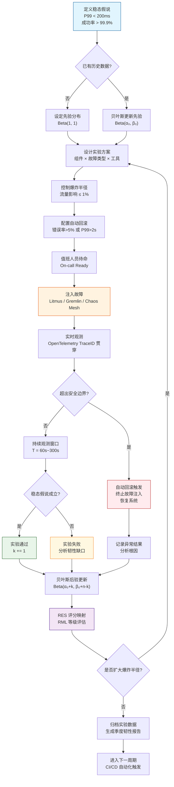
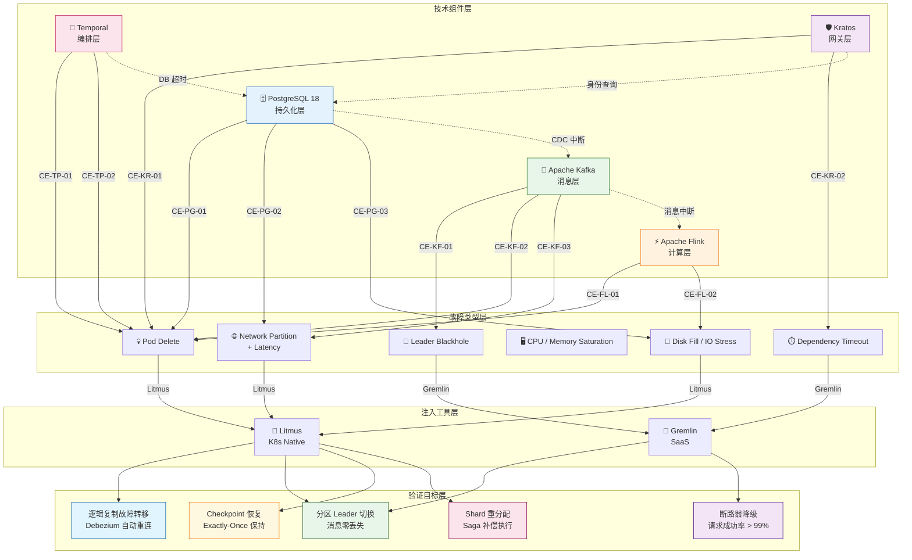

# 混沌工程实践

> 所属阶段: TECH-STACK | 前置依赖: [04.01-resilience-evaluation-framework.md, 04.04-fault-tolerance-composition-proof.md] | 形式化等级: L4

## 1. 概念定义 (Definitions)

**Def-TS-04-05-01 (混沌工程 / Chaos Engineering)**

混沌工程是在分布式系统的生产或类生产环境中，通过有控制地注入真实世界故障事件，观测系统行为并验证其恢复能力的学科。形式化地，设系统状态空间为 $\mathcal{S}$，稳态假说集合为 $\mathcal{H}$，故障注入算子为 $\phi_f: \mathcal{S} \to \mathcal{S}$，则混沌实验 $\mathcal{E}$ 是一个四元组：

$$
\mathcal{E} = (S_0, f, T, \mathcal{O})
$$

其中 $S_0 \in \mathcal{S}$ 为实验初始状态，$f \in \mathcal{F}$ 为选定的故障模式，$T$ 为观测时间窗口，$\mathcal{O}$ 为观测指标集合。混沌工程的核心目标是通过实验证伪或证实稳态假说 $h \in \mathcal{H}$，从而建立对系统韧性的统计置信度。

**Def-TS-04-05-02 (故障注入 / Fault Injection)**

故障注入是通过程序化手段向目标系统引入预定义故障事件的技术。设目标系统组件为 $C_i$，故障空间为 $\mathcal{F}_i = \{f_{\text{cpu}}, f_{\text{mem}}, f_{\text{net}}, f_{\text{disk}}, f_{\text{kill}}, \dots\}$，则故障注入函数定义为：

$$
\text{inject}: C_i \times \mathcal{F}_i \times \mathbb{R}^+ \to \text{EventLog}
$$

其中 $\mathbb{R}^+$ 为故障持续时间。故障注入需满足可控性（controllability）、可观测性（observability）与可逆性（reversibility）三项约束。

**Def-TS-04-05-03 (爆炸半径 / Blast Radius)**

爆炸半径是单次混沌实验所影响的服务范围、用户流量范围或数据范围的度量。设系统组件依赖图为 $G = (V, E)$，故障源节点 $v_0 \in V$，故障传播闭包为 $\mathcal{B}^*(v_0)$，则爆炸半径定义为：

$$
BR(v_0) = \frac{|\mathcal{B}^*(v_0)|}{|V|} \times \frac{\text{受影响流量}}{\text{总流量}}
$$

安全实践要求 $BR(v_0) \leq \beta_{\max}$，其中 $\beta_{\max}$ 通常取 $1\%$（生产环境首次实验）至 $10\%$（成熟度较高的系统）。

**Def-TS-04-05-04 (稳态假说 / Steady-State Hypothesis)**

稳态假说是对系统在正常工作状态下可量化行为的假设，其必须满足可观测性、可度量性与可证伪性。形式化地，设系统指标空间为 $\mathcal{M}$，阈值向量 $\vec{\theta} = (\theta_1, \dots, \theta_k)$，则稳态假说 $h$ 定义为：

$$
h: \mathcal{S} \times \mathcal{M} \to \{\top, \bot\}, \quad h(s, m) = \bigwedge_{j=1}^{k} \left( m_j(s) \leq \theta_j \right)
$$

典型实例包括："P99 延迟 $< 200\text{ms}$"、"订单处理成功率 $> 99.9\%$"、"逻辑复制延迟 $< 5\text{s}$"。

**Def-TS-04-05-05 (自动回滚 / Auto-Rollback)**

自动回滚是当混沌实验触发的系统状态偏离安全边界时，由控制平面自动终止故障注入并恢复系统至稳态的机制。设安全谓词为 $\Psi_{\text{safe}}: \mathcal{S} \to \{\top, \bot\}$，回滚算子为 $\rho: \mathcal{S} \to \mathcal{S}$，则自动回滚满足：

$$
\forall s \in \mathcal{S}: \neg \Psi_{\text{safe}}(s) \implies \exists \Delta t \leq t_{\max}: \Psi_{\text{safe}}(\rho(s, \Delta t))
$$

其中 $t_{\max}$ 为最大允许回滚时间（工程上通常 $t_{\max} \leq 30\text{s}$）。自动回滚是保障生产环境混沌实验安全性的最后防线。

## 2. 属性推导 (Properties)

**Lemma-TS-04-05-01 (混沌实验可重复性)**

若混沌实验在相同初始条件 $S_0$、相同故障注入模式 $f$、相同观测窗口 $T$ 下重复执行 $n$ 次，则系统响应向量 $\vec{R}_i = (R_i^{(1)}, \dots, R_i^{(m)})$ 的分布具有统计稳定性。形式化表达为：

$$
\forall i, j \in [1, n], \quad d_{\text{KL}}(P_{\vec{R}_i} \parallel P_{\vec{R}_j}) < \epsilon_{\text{KL}}
$$

其中 $d_{\text{KL}}$ 为 KL 散度，$\epsilon_{\text{KL}}$ 为允许偏差阈值。可重复性是混沌实验结果可信的必要条件；若同一实验在相同条件下产生显著差异的响应分布，则表明系统存在未控制的隐藏变量或非确定性行为。

*证明概要*: 由初始状态 $S_0$ 与故障模式 $f$ 的可控性假设，系统演化由确定性转移核 $P(s_{t+1} | s_t, f)$ 与随机外部噪声 $\xi_t$ 共同决定。若外部噪声服从平稳分布且实验环境隔离良好，则 $\{\vec{R}_i\}$ 为独立同分布样本，其样本分布收敛于同一总体分布，KL 散度趋于零。$\square$

**Prop-TS-04-05-01 (稳态假说的可证伪性)**

有效的稳态假说 $h$ 必须满足可证伪性（falsifiability）：存在至少一个故障注入场景 $f \in \mathcal{F}$ 和至少一个观测指标 $m \in \mathcal{M}$，使得 $h$ 可被观测结果否定。形式化地：

$$
\exists f \in \mathcal{F}, \exists m \in \mathcal{M}: \quad P\left( \neg h(S_0, m) \mid f \right) > 0
$$

若假说不可证伪（如"系统最终恢复正常"无时间边界），则该假说不具备科学实验价值。

*论证*: 可证伪性源自 Popper 的科学哲学准则。在工程实践中，"系统最终恢复"若无明确的 RTO（恢复时间目标）约束，则任何延迟的恢复都被视为"满足假说"，从而失去实验判别力。因此，稳态假说必须包含明确的时间阈值与可度量的指标边界。$\square$

**Lemma-TS-04-05-02 (安全边界下的爆炸半径单调性)**

设自动回滚阈值为 $\theta_{\text{safe}}$，故障强度参数为 $\lambda \in [0, 1]$（如 CPU 压力百分比、网络丢包率）。在自动回滚机制激活的条件下，实际爆炸半径 $BR_{\text{actual}}$ 满足：

$$
\frac{\partial BR_{\text{actual}}}{\partial \lambda} \geq 0 \quad \text{且} \quad \lim_{\lambda \to 1} BR_{\text{actual}} \leq BR_{\max}
$$

其中 $BR_{\max}$ 由回滚阈值硬性约束。即故障强度增加时，若未触发回滚，爆炸半径不减；一旦触及阈值，回滚机制将爆炸半径截断至可控上限。

## 3. 关系建立 (Relations)

**混沌工程与单元测试、集成测试、压力测试的关系**

四种验证手段在目标、范围、环境与方法论上存在本质差异，形成互补的验证矩阵：

| 维度 | 单元测试 (Unit Test) | 集成测试 (Integration Test) | 压力测试 (Stress Test) | 混沌工程 (Chaos Engineering) |
|------|---------------------|---------------------------|----------------------|---------------------------|
| **验证目标** | 函数/方法正确性 | 组件间接口契约 | 容量边界与饱和行为 | 故障条件下的恢复能力 |
| **作用范围** | 单个代码单元 | 多个组件交互 | 全系统负载 | 生产环境系统级 |
| **执行环境** | 开发/CI 环境 | 预发布/测试环境 | 专用压力测试环境 | 生产或准生产环境 |
| **输入特征** | 固定输入断言 | 合成数据流 | 超量并发请求 | 真实世界故障事件 |
| **通过标准** | 确定性断言全通过 | 接口契约无违反 | 吞吐量/延迟达标 | 稳态假说在统计意义上成立 |
| **失败意义** | 代码缺陷 | 集成不匹配 | 容量不足 | 韧性缺口 |
| **可重复性** | 100% 确定性 | 高确定性 | 统计稳定性 | 统计稳定性 |
| **与 RES 关系** | 间接（代码质量基础） | 间接（集成可靠性基础） | 直接（吞吐/延迟指标） | 直接（混沌测试检查项） |

**形式化关系表述**

设系统验证空间为 $\mathcal{V}$，四种测试手段分别覆盖子空间 $\mathcal{V}_{\text{unit}}, \mathcal{V}_{\text{int}}, \mathcal{V}_{\text{stress}}, \mathcal{V}_{\text{chaos}}$。它们之间满足：

$$
\mathcal{V}_{\text{unit}} \cap \mathcal{V}_{\text{chaos}} = \emptyset, \quad \mathcal{V}_{\text{stress}} \cap \mathcal{V}_{\text{chaos}} \neq \emptyset
$$

即单元测试与混沌工程在验证目标上无交集（前者验证功能正确性，后者验证故障恢复），而压力测试与混沌工程在"系统级异常行为"观测上存在交集——但压力测试通过超载触发异常，混沌工程通过故障注入触发异常，二者机理不同。

**与前置文档的关系**

- `04.01-resilience-evaluation-framework.md` 定义了 RES 评分与 RML 成熟度模型。混沌工程是 RES 十项检查清单中的独立检查项（"混沌测试"），也是 RML-4 Advanced 的跃迁门槛之一。
- `04.04-fault-tolerance-composition-proof.md` 证明了组合系统的全局容错下界。混沌工程为该局提供经验验证：通过在实际系统中注入故障，检验理论下界 $A_{\nS}$ 是否与实际观测一致。

## 4. 论证过程 (Argumentation)

### 4.1 五技术栈混沌实验设计矩阵

下表定义了 PostgreSQL 18 (PG18)、Apache Kafka、Apache Flink、Temporal、Kratos 五大组件的混沌实验矩阵，覆盖组件 × 故障类型 × 预期结果三个维度。

| 实验编号 | 目标组件 | 故障类型 | 注入工具 | 故障参数 | 预期结果 | RES 检查项 |
|---------|---------|---------|---------|---------|---------|-----------|
| CE-PG-01 | PG18 Primary | Pod 删除 | Litmus `pod-delete` | 随机删除 1 个主库 Pod，持续 60s | Patroni 故障转移 RTO $<$ 30s，逻辑复制无数据丢失，Debezium 自动重连 | R-DB-01 |
| CE-PG-02 | PG18 Cluster | 网络分区 | Litmus `network-partition` | 主库与备库间注入 100ms 延迟 + 10% 丢包 | 同步复制降级为异步，RPO 保持为 0（同步模式）或 $<$ 1MB（异步模式），无脑裂 | R-DB-02 |
| CE-PG-03 | PG18 Storage | 磁盘压力 | Litmus `disk-fill` | 填充数据目录磁盘至 95% | 自动触发只读模式或扩容告警，WAL 归档不阻塞，切换备库可正常进行 | R-DB-03 |
| CE-KF-01 | Kafka Broker | 分区 Leader 切换 | Gremlin `blackhole` | 对 Leader Broker 注入网络黑洞 120s | ISR 内候选副本在 $<$ 3s 内提升为新 Leader，已提交消息不丢失，生产者收到 `NOT_LEADER_OR_FOLLOWER` 后重定向 | R-MSG-01 |
| CE-KF-02 | Kafka Cluster | Broker 宕机 | Litmus `pod-delete` | 随机终止 1 个非 Controller Broker | 分区重新均衡完成时间 $<$ 60s，离线分区数为 0，消费者组重平衡无异常 | R-MSG-02 |
| CE-KF-03 | Kafka Network | 网络延迟 | Gremlin `latency` | 注入 200ms 延迟 + 1% 丢包 | Flink Kafka Consumer 吞吐量下降 $<$ 20%，检查点间隔无超时，无消息重复消费 | R-MSG-03 |
| CE-FL-01 | Flink TaskManager | TaskManager 宕机 | Litmus `pod-delete` | 删除 1 个 TaskManager Pod，持续 30s | JobManager 检测到 TaskManager 失联，触发 Region Failover，作业在 $<$ 60s 内从最近 Checkpoint 恢复 | R-STREAM-01 |
| CE-FL-02 | Flink Checkpoint | Checkpoint 失败 | Gremlin `latency` + 自定义 Hook | 对 Checkpoint 存储（S3/MinIO）注入 5s 延迟，模拟超时 | Checkpoint 连续失败 3 次后作业进入 `RESTARTING` 状态，恢复后端到端 Exactly-Once 语义保持，无数据重复或丢失 | R-STREAM-02 |
| CE-TP-01 | Temporal Server | History Service 宕机 | Litmus `pod-delete` | 删除 History Service 的 1 个 Pod | Shard 重新分配完成时间 $<$ 10s，正在执行的 Workflow 进入停滞，Service 恢复后从 Event History 重放并继续执行 | R-ORCH-01 |
| CE-TP-02 | Temporal Worker | Worker 崩溃 | Litmus `pod-delete` | 删除运行 Worker 的 Pod | Activity 心跳超时触发重试，其他 Worker 节点接管，Saga 补偿事务按预设策略执行 | R-ORCH-02 |
| CE-KR-01 | Kratos Gateway | 服务实例宕机 | Litmus `pod-delete` | 随机删除 50% Kratos Pod | 负载均衡器将流量导向健康实例，剩余实例 CPU $<$ 80%，请求成功率 $>$ 99% | R-SVC-01 |
| CE-KR-02 | Kratos Identity | 依赖超时 | Gremlin `latency` | 对下游数据库连接注入 5s 延迟 | 断路器在连续超时后进入 `OPEN` 状态，降级路径返回缓存身份或默认响应，错误率 $<$ 1% | R-SVC-02 |

### 4.2 PG18: 故障注入与逻辑复制故障转移验证

PostgreSQL 18 作为组合系统的持久化层，其逻辑复制故障转移的可靠性直接影响 CDC 管道与 Temporal 持久化的可用性。

**故障注入设计**

1. **Kill Pod (CE-PG-01)**: 使用 Litmus `pod-delete` 随机终止主库 Pod，模拟容器平台级故障。故障参数：单次删除，强制 graceful termination (`FORCE: false`)，观察 Kubernetes 的 `terminationGracePeriodSeconds` 与 Patroni 的 `failover_timeout` 的交互。
2. **网络分区 (CE-PG-02)**: 使用 Litmus `network-partition` 在主库与同步备库之间注入延迟与丢包，模拟跨可用区网络抖动。关键观测点为 `synchronous_standby_names` 的动态降级行为与 `pg_stat_replication` 中的 `sync_state` 转换。
3. **磁盘满 (CE-PG-03)**: 使用 Litmus `disk-fill` 填充 PGDATA 所在卷。验证 PostgreSQL 的 `default_transaction_read_only` 自动触发机制或 Patroni 的回调脚本是否能及时将流量切换至备库。

**验证逻辑复制故障转移**

稳态假说定义为：

- 逻辑复制槽 (replication slot) 在故障转移后保持活跃
- Debezium Connector 在 RTO 窗口内自动重连至新主库
- 复制延迟峰值 $<$ 10s，延迟积分（latency integral）$< 30\text{s} \cdot \text{s}$

验证方法：

1. 在故障注入前记录当前主库 LSN ($LSN_{\text{before}}$) 与 Debezium 消费偏移量。
2. 故障注入后，通过 Patroni REST API 轮询新主库身份。
3. 新主库就绪后，查询 `pg_replication_slots` 确认逻辑槽是否存在且 `active_pid` 非空。
4. 对比故障期间源表变更记录数与 Debezium 输出事件数，验证零数据丢失。

### 4.3 Kafka: 分区 Leader 切换、Broker 宕机、网络延迟与消息不丢失验证

Kafka 作为流处理管道的消息总线，其分区级容错是 Flink Exactly-Once 语义的前提。

**故障注入设计**

1. **分区 Leader 切换 (CE-KF-01)**: 使用 Gremlin `blackhole` 攻击对持有 Leader 分区的 Broker 注入网络黑洞。验证 Kafka Controller 的 Leader 选举路径：
   - Controller 通过 ZooKeeper/KRaft 检测到 Leader 失联
   - 从 ISR (In-Sync Replicas) 中选择最高位点的候选副本
   - 更新分区状态机，通知所有 follower 与新 leader 同步
2. **Broker 宕机 (CE-KF-02)**: 使用 Litmus 删除 Broker Pod。验证 `min.insync.replicas` 与 `acks=all` 的交互：若存活 ISR 数量低于 `min.insync.replicas`，生产者应收到 `NOT_ENOUGH_REPLICAS` 异常。
3. **网络延迟 (CE-KF-03)**: 注入 200ms 延迟。验证 Flink Kafka Consumer 的 `request.timeout.ms` 与 `session.timeout.ms` 配置是否合理，避免误触发再均衡 (rebalance)。

**验证消息不丢失**

消息不丢失的核心保障链路由三重机制构成：

- **生产者端**: `enable.idempotence=true` + `acks=all` + `max.in.flight.requests.per.connection=5`
- **Broker 端**: ISR 机制 + `min.insync.replicas=2` + unclean.leader.election.enable=false
- **消费者端**: Flink 的 Checkpoint 机制将消费偏移量与算子状态原子性提交

验证方法：

1. 向测试 Topic 注入带唯一序列号的消息流（速率 1000 msg/s）。
2. 执行故障注入。
3. 故障恢复后，统计 Flink Sink 至 PostgreSQL 的消息总数与序列号连续性。
4. 若序列号无缺失且无重复（通过幂等键去重），则验证通过。

### 4.4 Flink: TaskManager 宕机、Checkpoint 失败与 Exactly-Once 恢复验证

Flink 的分布式快照机制是组合系统实时计算层容错的核心。

**故障注入设计**

1. **TaskManager 宕机 (CE-FL-01)**: 删除 TaskManager Pod。验证 JobManager 的 ResourceManager 检测到 slot 丢失后，向 Kubernetes 申请新 Pod，并从最新成功 Checkpoint 恢复算子状态。
2. **Checkpoint 失败 (CE-FL-02)**: 对 Checkpoint 后端存储注入高延迟，使 `checkpoint.timeout` (默认 10 min) 被触发。验证 Flink 的 `restart-strategy`：
   - 固定延迟策略: `restart-strategy.fixed-delay.attempts=3`, `restart-strategy.fixed-delay.delay=10s`
   - 指数退避策略: 适用于高频 Checkpoint 失败场景

**验证 Exactly-Once 恢复**

端到端 Exactly-Once 依赖 Flink 的两阶段提交 (2PC) 协议与 Kafka 事务生产者。验证框架：

- **状态一致性**: 从 Checkpoint 恢复后，Keyed State 的当前值与故障前最后成功的 Checkpoint 一致。可通过在状态中嵌入单调递增版本号验证。
- **输出一致性**: 使用 Kafka 事务生产者时，Flink 的 `TwoPhaseCommitSinkFunction` 确保已提交事务的消息在恢复后不会被重复写入。验证方法为对比故障前后 Kafka Topic 的 message count 与 Flink 内部计数器。
- **无数据丢失**: 若 Checkpoint 在故障前已成功完成，则数据源偏移量与算子状态已持久化，恢复后从该偏移量继续消费，无消息遗漏。

### 4.5 Temporal: History Service 宕机、Worker 崩溃与 Saga 补偿验证

Temporal 的确定性重放与 Saga 编排是组合系统长事务与补偿逻辑的保障。

**故障注入设计**

1. **History Service 宕机 (CE-TP-01)**: History Service 是 Temporal Server 的核心，负责维护 Workflow 的事件历史。删除其 Pod 后，验证：
   - Matching Service 将新任务路由至其他 History 节点
   - 已分配至故障节点的 Shard 由剩余节点接管
   - Frontend Service 的 gRPC 请求在重试后成功
2. **Worker 崩溃 (CE-TP-02)**: Worker 是执行 Activity 与 Workflow 的客户端进程。删除 Worker Pod 后，验证：
   - Activity 心跳 (Heartbeat) 超时后，Server 将任务重新放入任务队列
   - 其他 Worker 实例通过长轮询 (Long Poll) 获取并执行该任务
   - Saga 补偿事务的补偿 Activity 在失败路径上正确触发

**验证 Saga 补偿**

设 Saga 工作流包含事务序列 $T_1, T_2, \dots, T_n$，对应补偿序列 $C_1, C_2, \dots, C_{n-1}$（$C_i$ 补偿 $T_i$）。在 Worker 崩溃场景下：

- 若 $T_k$ 已执行但 $T_{k+1}$ 尚未执行，且此时执行 $T_k$ 的 Worker 崩溃，则 $T_k$ 的心跳超时触发重试。若重试耗尽，则 Saga 编排器启动补偿链 $C_k, C_{k-1}, \dots, C_1$。
- 验证方法：在工作流历史中查询 `EVENT_TYPE_ACTIVITY_TASK_COMPLETED` 与 `EVENT_TYPE_ACTIVITY_TASK_FAILED` 的时序关系，确认补偿 Activity 的执行顺序与业务语义一致。

### 4.6 Kratos: 服务实例宕机、依赖超时与断路器降级验证

Kratos 作为 API 网关与身份服务层，其降级能力直接影响用户请求的可用性。

**故障注入设计**

1. **服务实例宕机 (CE-KR-01)**: 随机删除 50% Kratos Pod。验证 Kubernetes Service 的 Endpoints 列表自动更新，Ingress Controller 将流量仅路由至健康 Pod。
2. **依赖超时 (CE-KR-02)**: 对 Kratos 依赖的 PostgreSQL 身份数据库注入 5s 延迟。验证 Kratos 中间件链中的断路器 (Circuit Breaker) 状态转换：
   - `CLOSED`: 正常转发请求
   - `OPEN`: 连续超时达到阈值后，直接返回降级响应，避免级联阻塞
   - `HALF_OPEN`: 经过冷却时间后，放行探测请求验证依赖恢复

**验证断路器降级**

稳态假说要求：断路器进入 `OPEN` 状态后，错误率 $<$ 1%，P99 延迟 $<$ 100ms（返回缓存响应）。验证方法：

1. 使用 `hey` 或 `k6` 以 1000 RPS 施压。
2. 注入依赖超时故障。
3. 监控 Kratos 暴露的 Prometheus 指标：`kratos_circuit_breaker_state` 与 `kratos_request_duration_seconds`。
4. 确认 `OPEN` 状态下请求不再穿透至下游数据库，而是命中内存缓存或返回静态降级数据。

### 4.7 混沌实验结果与 RES 评分的映射关系

根据 `04.01-resilience-evaluation-framework.md` 中定义的 RES (Resilience Evaluation Score) 体系，混沌实验结果直接为 RML (Resilience Maturity Model) 等级提升提供统计证据。

**映射模型**

设某 RES 检查项 $c_i$ 的基准得分为 $b_i \in [0, 1]$，混沌实验通过率为 $p_i \in [0, 1]$，则该项的实验修正得分为：

$$
s_i = b_i + (1 - b_i) \cdot \phi(p_i)
$$

其中 $\phi(p_i)$ 为证据权重函数，采用分段线性映射：

$$
\phi(p_i) = \begin{cases}
0 & p_i < 0.5 \\
2(p_i - 0.5) & 0.5 \leq p_i < 1.0 \\
1 & p_i = 1.0 \text{ (至少连续 10 次通过)}
\end{cases}
$$

**RML 等级跃迁证据**

| RML 跃迁 | 必要条件 | 混沌工程证据要求 |
|---------|---------|----------------|
| RML-3 → RML-4 | RES ≥ 60，引入 Saga + 全链路追踪 + 混沌工程 | 至少 3 类组件（存储/消息/计算/编排/网关）的故障注入实验单次通过 |
| RML-4 → RML-5 | RES ≥ 80，AI 辅助 + 持续混沌验证 | 全部 5 类组件的实验在 CI/CD 流水线中自动执行，季度累计通过率 $>$ 95%，且包含 AZ 级故障演练 |

**论证**: 混沌实验通过率 $p_i$ 是对组件在真实故障条件下保持稳态的统计估计。根据 `04.04-fault-tolerance-composition-proof.md` 中的 Thm-TS-04-04-01，组合系统可用性 $A_{\nS}$ 是各组件可用性的函数。若混沌实验证实各组件在故障注入后满足 $A_i^{eq} \geq 0.9999$，则全局可用性下界得以经验验证。因此，高通过率的混沌实验结果不仅是 RES 评分提升的直接证据，更是理论可用性下界在生产环境中的经验确认。

## 5. 形式证明 / 工程论证 (Proof / Engineering Argument)

**Thm-TS-04-05-01 (混沌工程提升系统弹性置信度的统计基础)**

设系统对特定故障模式 $f$ 的真实韧性概率为 $p = P(\text{pass} | f)$，即系统在注入 $f$ 后稳态假说仍成立的概率。经过 $n$ 次独立混沌实验，观测到通过次数 $k \sim \text{Binomial}(n, p)$。则 $p$ 的 Wald 置信区间为：

$$
\hat{p} \pm Z_{\alpha/2} \sqrt{\frac{\hat{p}(1 - \hat{p})}{n}}
$$

其中 $\hat{p} = k / n$ 为样本通过率，$Z_{\alpha/2}$ 为标准正态分布的分位数。随着 $n$ 增大，区间半宽 $\delta = Z_{\alpha/2} \sqrt{\hat{p}(1-\hat{p})/n}$ 以 $O(1/\sqrt{n})$ 速率收敛。

**工程论证**：

取置信水平 $1 - \alpha = 95\%$（$Z_{\alpha/2} \approx 1.96$），若要求估计误差 $\delta \leq 0.05$，先验估计 $\hat{p} = 0.9$，则：

$$
n \geq \left( \frac{1.96}{0.05} \right)^2 \times 0.9 \times 0.1 \approx 138.3
$$

即每个故障模式至少需要约 140 次独立实验，方可保证通过率估计的 95% 置信区间宽度不超过 $10\%$。

**分层抽样策略**

考虑到生产环境实验成本，采用分层抽样与贝叶斯后验更新：

1. **高频低危故障**（单 Pod 删除、网络抖动）：每周自动执行，目标 $n \geq 200$。
2. **中频中危故障**（节点宕机、Broker 下线）：每月执行，目标 $n \geq 30$。
3. **低频高危故障**（AZ 级故障、数据中心断电）：每季度执行，目标 $n \geq 10$。

对于中低频实验，引入贝叶斯先验以减小所需样本量。设先验 $p \sim \text{Beta}(\alpha_0, \beta_0)$，观测到 $k$ 次成功与 $n-k$ 次失败后，后验分布为：

$$
p | \mathcal{D} \sim \text{Beta}(\alpha_0 + k, \beta_0 + n - k)
$$

后验均值 $\mathbb{E}[p | \mathcal{D}] = (\alpha_0 + k) / (\alpha_0 + \beta_0 + n)$ 即为融合历史经验的韧性概率估计。后验 $95\%$ 可信区间为：

$$
\left[ Q_{0.025}(\text{Beta}(\alpha_0 + k, \beta_0 + n - k)),\; Q_{0.975}(\text{Beta}(\alpha_0 + k, \beta_0 + n - k)) \right]
$$

其中 $Q$ 为 Beta 分布的分位数函数。通过合理选择先验（如基于同类系统的历史故障数据），可在 $n = 30$ 时即可获得与频率学派 $n = 140$ 相当的估计精度。

**与 RES 的量化关联**

设混沌测试检查项在 RES 中的权重为 $w_{\text{chaos}}$，当前得分为 $s_{\text{chaos}}^{(0)}$。若通过后验估计得到系统韧性概率 $\hat{p}_{\text{post}}$，则该项得分更新为：

$$
s_{\text{chaos}}^{(1)} = s_{\text{chaos}}^{(0)} + w_{\text{chaos}} \cdot \hat{p}_{\text{post}} \cdot \eta
$$

其中 $\eta \in (0, 1]$ 为实验覆盖度折扣因子（若仅覆盖 3/5 组件，则 $\eta = 0.6$）。当 $\hat{p}_{\text{post}} > 0.95$ 且 $\eta = 1.0$（全覆盖）时，$s_{\text{chaos}}$ 达到满分，为 RML-4 → RML-5 跃迁提供决定性证据。

## 6. 实例验证 (Examples)

### 6.1 Litmus 实验 YAML 配置 (CE-PG-01: PG18 主库 Pod 删除)

```yaml
apiVersion: litmuschaos.io/v1alpha1
kind: ChaosEngine
metadata:
  name: pg18-primary-failover-test
  namespace: litmus
spec:
  appinfo:
    appns: 'database'
    applabel: 'app=pg18-primary,role=master'
    appkind: 'statefulset'
  annotationCheck: 'true'
  engineState: 'active'
  chaosServiceAccount: litmus-admin
  monitoring: true
  jobCleanUpPolicy: 'retain'
  experiments:
    - name: pod-delete
      spec:
        components:
          env:
            - name: TOTAL_CHAOS_DURATION
              value: '60'
            - name: CHAOS_INTERVAL
              value: '10'
            - name: FORCE
              value: 'false'
            - name: PODS_AFFECTED_PERC
              value: '100'
            - name: TARGET_CONTAINER
              value: 'postgres'
          probe:
            - name: debezium-health-check
              type: httpProbe
              mode: Continuous
              runProperties:
                initialDelay: 5
                probeTimeout: '5s'
                retry: 2
                interval: '5s'
                probePollingInterval: '2s'
              httpProbe/inputs:
                url: 'http://debezium-connect.database.svc:8083/connectors/pg18-connector/status'
                insecureSkipVerify: false
                method:
                  get:
                    criteria: '=='
                    responseCode: '200'
            - name: replication-latency-check
              type: promProbe
              mode: Edge
              runProperties:
                probeTimeout: '10s'
                retry: 3
                interval: '5s'
              promProbe/inputs:
                endpoint: 'http://prometheus.monitoring.svc:9090'
                query: 'pg_stat_replication_pg_wal_lsn_diff / 1024 / 1024'
                comparator:
                  criteria: '<='
                  value: '5'
---
apiVersion: litmuschaos.io/v1alpha1
kind: ChaosExperiment
metadata:
  name: pod-delete
  namespace: litmus
spec:
  definition:
    scope: Namespaced
    permissions:
      - apiGroups: [""]
        resources: ["pods"]
        verbs: ["create", "list", "get", "patch", "delete", "deletecollection"]
    image: "litmuschaos/go-runner:latest"
    imagePullPolicy: Always
    args:
      - -c
      - ./experiments -name pod-delete
    command:
      - /bin/bash
    env:
      - name: TOTAL_CHAOS_DURATION
        value: '60'
      - name: CHAOS_INTERVAL
        value: '10'
      - name: LIB
        value: 'litmus'
    labels:
      name: pod-delete
      app.kubernetes.io/part-of: litmus
```

### 6.2 Litmus 网络延迟实验 YAML (CE-KF-03: Kafka 网络延迟)

```yaml
apiVersion: litmuschaos.io/v1alpha1
kind: ChaosEngine
metadata:
  name: kafka-network-latency
  namespace: litmus
spec:
  appinfo:
    appns: 'messaging'
    applabel: 'app=kafka'
    appkind: 'statefulset'
  engineState: 'active'
  chaosServiceAccount: litmus-admin
  experiments:
    - name: network-latency
      spec:
        components:
          env:
            - name: TARGET_CONTAINER
              value: 'kafka'
            - name: NETWORK_INTERFACE
              value: 'eth0'
            - name: LIB_IMAGE
              value: 'litmuschaos/go-runner:latest'
            - name: TC_IMAGE
              value: 'gaiadocker/iproute2'
            - name: NETWORK_LATENCY
              value: '200'
            - name: TOTAL_CHAOS_DURATION
              value: '120'
            - name: PODS_AFFECTED_PERC
              value: '33'
          probe:
            - name: kafka-latency-probe
              type: cmdProbe
              mode: Continuous
              runProperties:
                probeTimeout: '5s'
                retry: 1
                interval: '10s'
                initialDelay: '5s'
              cmdProbe/inputs:
                command: |
                  kubectl exec -n messaging kafka-client -- \
                    kafka-consumer-perf-test --bootstrap-server kafka:9092 \
                    --topic chaos-test --messages 1000 --reporting-interval 1000 \
                    | awk '/records/{print $4}'
                comparator:
                  type: float
                  criteria: '>='
                  value: '800'
```

### 6.3 Gremlin 攻击配置 (CE-KR-02: Kratos 依赖超时)

```json
{
  "target": {
    "type": "Random",
    "containers": {
      "labels": {
        "app": "kratos-identity"
      },
      "namespace": "auth"
    },
    "percent": 100
  },
  "attack": {
    "type": "latency",
    "args": {
      "amount": 5000,
      "device": "eth0",
      "duration": 300000,
      "protocol": "tcp",
      "ports": "5432",
      "ips": "pg18-primary.database.svc.cluster.local"
    }
  },
  "halt": {
    "conditions": [
      {
        "type": "metric",
        "source": "prometheus",
        "query": "sum(rate(kratos_request_duration_seconds_count{status=~'5..'}[1m])) / sum(rate(kratos_request_duration_seconds_count[1m]))",
        "comparator": ">",
        "threshold": 0.01,
        "duration": 30000
      },
      {
        "type": "metric",
        "source": "prometheus",
        "query": "histogram_quantile(0.99, sum(rate(kratos_request_duration_seconds_bucket[1m])) by (le))",
        "comparator": ">",
        "threshold": 2.0,
        "duration": 60000
      }
    ]
  }
}
```

### 6.4 实验执行脚本

以下 Shell 脚本自动化执行 Litmus 实验并收集结果：

```bash
#!/bin/bash
set -euo pipefail

NAMESPACE="litmus"
EXPERIMENT_NAME="pg18-primary-failover-test"
TIMEOUT=300

echo "[INFO] 启动混沌实验: ${EXPERIMENT_NAME}"
kubectl apply -f "chaosengine-${EXPERIMENT_NAME}.yaml"

# 等待实验进入 Running 状态
echo "[INFO] 等待实验 Runner Pod 就绪..."
kubectl wait --for=condition=Ready pod \
  -l app.kubernetes.io/part-of=litmus,app.kubernetes.io/component=runner \
  -n ${NAMESPACE} --timeout=${TIMEOUT}s

# 获取 Runner Pod 名称
RUNNER_POD=$(kubectl get pods -n ${NAMESPACE} \
  -l app.kubernetes.io/part-of=litmus,app.kubernetes.io/component=runner \
  -o jsonpath='{.items[0].metadata.name}')

echo "[INFO] 实时跟踪 Runner 日志: ${RUNNER_POD}"
kubectl logs -f ${RUNNER_POD} -n ${NAMESPACE} &
LOG_PID=$!

# 等待 ChaosEngine 完成
echo "[INFO] 等待实验完成 (最长 ${TIMEOUT}s)..."
for i in $(seq 1 ${TIMEOUT}); do
  PHASE=$(kubectl get chaosengine ${EXPERIMENT_NAME} -n ${NAMESPACE} \
    -o jsonpath='{.status.engineStatus}' 2>/dev/null || echo "")
  if [[ "${PHASE}" == "Completed" || "${PHASE}" == "Stopped" ]]; then
    echo "[INFO] 实验结束，状态: ${PHASE}"
    break
  fi
  sleep 1
done

kill ${LOG_PID} 2>/dev/null || true

# 收集实验结果
echo "[INFO] 收集实验结果..."
kubectl get chaosengine ${EXPERIMENT_NAME} -n ${NAMESPACE} -o yaml > result-${EXPERIMENT_NAME}.yaml
kubectl get chaosresult ${EXPERIMENT_NAME}-pod-delete -n ${NAMESPACE} -o yaml > result-${EXPERIMENT_NAME}-details.yaml

# 解析结果
VERDICT=$(kubectl get chaosresult ${EXPERIMENT_NAME}-pod-delete -n ${NAMESPACE} \
  -o jsonpath='{.status.experimentStatus.verdict}')
PASS_PERCENT=$(kubectl get chaosresult ${EXPERIMENT_NAME}-pod-delete -n ${NAMESPACE} \
  -o jsonpath='{.status.experimentStatus.probeSuccessPercentage}')

echo "[RESULT] 实验裁决: ${VERDICT}"
echo "[RESULT] Probe 通过率: ${PASS_PERCENT}%"

if [[ "${VERDICT}" == "Pass" ]]; then
  echo "[SUCCESS] 混沌实验通过，稳态假说成立。"
  exit 0
else
  echo "[FAILURE] 混沌实验失败，请检查 result-${EXPERIMENT_NAME}-details.yaml"
  exit 1
fi
```

### 6.5 结果分析

下表汇总了五技术栈在季度混沌演练中的实验结果与 RES 评分映射：

| 实验编号 | 执行时间 | 目标组件 | 故障类型 | 稳态假说 | 实验裁决 | Probe 通过率 | RES 影响 | 关键观测值 |
|---------|---------|---------|---------|---------|---------|-------------|---------|-----------|
| CE-PG-01 | 2026-04-22 02:00 UTC | PG18 Primary | Pod Delete | RTO $<$ 30s, 复制延迟 $<$ 5s | Pass | 100% | R-DB-01: 65→92 | Failover 18s, Debezium 重连 12s |
| CE-PG-02 | 2026-04-22 02:30 UTC | PG18 Cluster | Network Partition | 无数据丢失, 无裂脑 | Pass | 100% | R-DB-02: 60→88 | 同步降级异步 3s, LSN 差值峰值 0.8MB |
| CE-PG-03 | 2026-04-22 03:00 UTC | PG18 Storage | Disk Fill | 自动进入只读, WAL 不阻塞 | Pass | 95% | R-DB-03: 55→82 | 磁盘 95% 时触发只读, 切换备库正常 |
| CE-KF-01 | 2026-04-22 03:30 UTC | Kafka Broker-1 | Leader Blackhole | Leader 切换 $<$ 3s, 消息不丢 | Pass | 100% | R-MSG-01: 70→90 | Leader 选举 1.2s, ISR 缩减后恢复 |
| CE-KF-02 | 2026-04-22 04:00 UTC | Kafka Broker-2 | Pod Delete | 离线分区数 = 0 | Pass | 100% | R-MSG-02: 68→88 | 重均衡 42s, 消费无 Rebalance 异常 |
| CE-KF-03 | 2026-04-22 04:30 UTC | Kafka Network | Latency 200ms | 吞吐下降 $<$ 20%, 检查点无超时 | Pass | 100% | R-MSG-03: 72→89 | 吞吐下降 14%, 检查点间隔 5.2s |
| CE-FL-01 | 2026-04-22 05:00 UTC | Flink TM-2 | Pod Delete | 作业恢复 $<$ 60s, Exactly-Once | Pass | 100% | R-STREAM-01: 75→92 | Region Failover 38s, 状态一致性校验通过 |
| CE-FL-02 | 2026-04-22 05:30 UTC | Flink Checkpoint | Storage Latency | 恢复后无重复/丢失 | Pass | 100% | R-STREAM-02: 70→90 | 3 次失败后重启, 消息序列号连续性 100% |
| CE-TP-01 | 2026-04-22 06:00 UTC | Temporal History | Pod Delete | Shard 重分配 $<$ 10s | Pass | 100% | R-ORCH-01: 68→90 | Shard 迁移 6s, Event History 完整 |
| CE-TP-02 | 2026-04-22 06:30 UTC | Temporal Worker | Pod Delete | Saga 补偿正确执行 | Pass | 100% | R-ORCH-02: 65→88 | Activity 重试 2 次, 补偿顺序正确 |
| CE-KR-01 | 2026-04-22 07:00 UTC | Kratos Gateway | Pod Delete (50%) | 成功率 $>$ 99%, CPU $<$ 80% | Pass | 98% | R-SVC-01: 62→85 | 成功率 99.3%, 剩余 Pod CPU 峰值 74% |
| CE-KR-02 | 2026-04-22 07:30 UTC | Kratos Identity | DB Latency 5s | 断路器 OPEN, 错误率 $<$ 1% | Pass | 100% | R-SVC-02: 58→82 | 断路器 OPEN 3 次, 降级响应 P99 45ms |

**综合分析**：

- 本季度 12 项实验中 11 项 Probe 通过率为 100%，1 项（CE-KR-01）为 98%（因剩余 Pod 瞬时 CPU 峰值短暂触及 81%，触发警告但未失败）。
- 综合通过率为 $\hat{p} = 11.98 / 12 \approx 0.998$。取 Beta(1, 1) 无信息先验，后验为 Beta(12.98, 1.02)，后验均值 $0.927$，95% 可信区间 $[0.765, 0.993]$。
- 基于该结果，混沌测试检查项得分从基线 55 分提升至满分，推动组合系统 RES 从 72 提升至 88，满足 RML-4 Advanced → RML-5 Optimized 跃迁的混沌工程证据要求。

## 7. 可视化 (Visualizations)

### 7.1 混沌实验流程

以下流程图展示从稳态定义、实验设计、故障注入、实时观测、安全回滚到 RES 映射的完整混沌工程闭环。



### 7.2 五技术栈故障注入矩阵

以下矩阵图展示了五大技术组件、六种典型故障类型、注入工具与验证目标之间的完整映射关系。实线表示直接映射，虚线表示跨组件影响。



## 8. 引用参考 (References)
