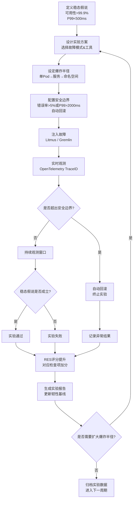
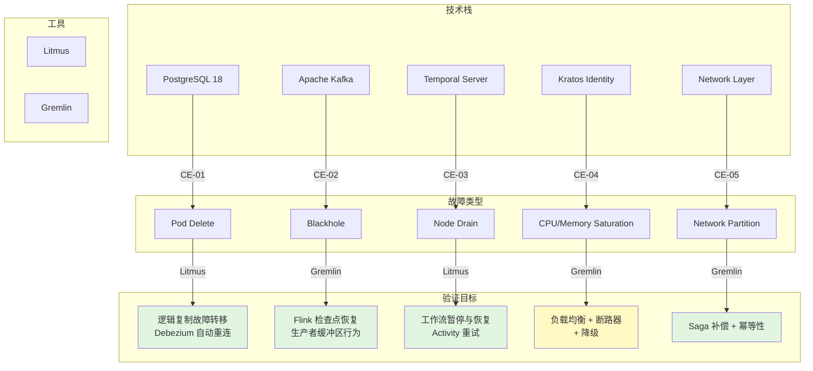

# 混沌工程实践

> 所属阶段: TECH-STACK | 前置依赖: [04.01-resilience-evaluation-framework.md] | 形式化等级: L4

## 1. 概念定义 (Definitions)

**Def-T-04-05-01 (混沌工程)** 混沌工程 (Chaos Engineering) 是在生产环境或类生产环境中，通过有控制地注入故障来验证分布式系统在异常条件下的行为，从而提升系统韧性的学科。其核心思想在于主动引入故障以暴露潜在弱点，而非被动等待故障发生。

**Def-T-04-05-02 (故障注入)** 故障注入 (Fault Injection) 是指通过程序化或人工手段，向目标系统引入特定类型的故障（如网络延迟、节点宕机、资源耗尽、磁盘损坏等），以观察系统响应和恢复行为的技术手段。

**Def-T-04-05-03 (爆炸半径)** 爆炸半径 (Blast Radius) 指单次混沌实验所影响的服务范围、数据范围或用户范围的度量。严格控制爆炸半径是保障生产环境混沌实验安全性的核心原则，通常遵循从单个 Pod → 单个服务 → 整个命名空间的渐进扩大策略。

**Def-T-04-05-04 (可观测性)** 可观测性 (Observability) 在混沌工程语境下，指通过分布式追踪 (Distributed Tracing)、指标 (Metrics) 和日志 (Logs) 三支柱，实时捕获系统内部状态的能力。在混沌实验中，OpenTelemetry Trace ID 需贯穿实验全过程，以建立"注入动作—系统响应—业务影响"的完整因果链。

**Def-T-04-05-05 (稳态假说)** 稳态假说 (Steady-State Hypothesis) 是在混沌实验开始前对系统正常行为作出的可量化假设。对于本技术栈，稳态假说定义为："系统可用性 > 99.9% 且 P99 延迟 < 500ms"。实验的核心目标即为验证在故障注入条件下，该稳态假说是否仍然成立。

## 2. 属性推导 (Properties)

**Lemma-T-04-05-01 (混沌实验可重复性)** 若混沌实验在相同初始条件 $S_0$、相同故障注入模式 $F$、相同观测窗口 $T$ 下重复执行 $n$ 次，则系统行为响应的分布应具有统计稳定性。形式化表达为：

$$
\forall i, j \in [1, n], \quad d(R_i, R_j) < \epsilon
$$

其中 $R_i$ 为第 $i$ 次实验的系统响应向量（可用性、延迟、错误率），$d(\cdot, \cdot)$ 为距离度量，$\epsilon$ 为允许偏差阈值。可重复性是混沌实验结果可信的必要条件。

**Prop-T-04-05-01 (故障注入安全性边界)** 任何生产环境的混沌实验必须满足安全性边界约束：若实时错误率超过阈值 $\theta_{safe} = 5\%$，或 P99 延迟超过 $\theta_{lat} = 2000\text{ms}$，则自动回滚机制 $A_{rollback}$ 必须在时间 $t_{detect} + t_{actuate} < 30\text{s}$ 内终止实验并恢复系统。

形式化表达为：

$$
\text{error\_rate}(t) > 5\% \lor \text{P99}_{lat}(t) > 2000\text{ms} \implies A_{rollback}(t + \Delta t), \quad \Delta t < 30\text{s}
$$

该命题保证实验的爆炸半径始终处于可控范围内，避免人为制造的故障演变为真实的生产事故。

## 3. 关系建立 (Relations)

**与 CI/CD 的关系** 混沌工程并非独立于 DevOps 流程的孤立活动，而是持续交付管道的有机组成部分。在 CI/CD 流水线中，混沌实验可嵌入于预发布 (Staging) 阶段的自动化门控：只有通过混沌测试的服务版本方可进入生产部署。Litmus ChaosEngine CRD 可通过 Argo Workflows 或 GitHub Actions 触发，实现"每次构建都经受故障考验"的持续韧性验证。

**与监控告警的关系** 混沌工程为监控告警系统提供了天然的校准机制。通过主动注入已知故障，可以验证告警规则是否能够在预期时间内触发、告警阈值是否合理、以及 on-call 响应流程是否有效。若某类故障注入后未在 $t_{SLO}$ 内触发告警，则表明可观测性覆盖存在盲区。

**与灾难恢复演练的关系** 传统的灾难恢复 (Disaster Recovery, DR) 演练通常以年度或季度为周期，验证完整的数据中心级故障切换；而混沌工程则以更高频度（周级甚至日级）验证微服务级别的局部故障恢复能力。二者形成互补：DR 演练验证"极端场景下系统能否存活"，混沌工程验证"日常小故障是否会累积为系统性风险"。

## 4. 论证过程 (Argumentation)

### 4.1 基于 Litmus/Gremlin 的五技术栈故障注入实验设计

本技术栈由 PostgreSQL 18 (PG18)、Apache Kafka、Apache Flink、Temporal、Kratos 五大组件构成。针对各组件的典型故障模式，设计以下五组混沌实验：

| 实验编号 | 目标组件 | 故障类型 | 注入工具 | 验证目标 |
|---------|---------|---------|---------|---------|
| CE-01 | PG18 | 主库故障 | Litmus (pod-delete) | 逻辑复制故障转移 + Debezium 自动重连 |
| CE-02 | Kafka | 分区不可用 | Gremlin (blackhole) | Flink 检查点恢复 + 生产者缓冲区行为 |
| CE-03 | Temporal Server | 节点宕机 | Litmus (node-drain) | 工作流暂停与恢复、Activity 重试 |
| CE-04 | Kratos | 实例缩容 | Gremlin (CPU/Memory) | 负载均衡 + 断路器 + 降级 |
| CE-05 | Network | 网络分区 | Gremlin (partition) | Saga 补偿 + 幂等性 |

#### 实验 1：PG18 主库故障

**场景**：使用 Litmus `pod-delete` ChaosExperiment 随机终止 PG18 主库 Pod，模拟主库级故障。

**稳态假说**：

- 逻辑复制延迟 < 5s
- Debezium Connector 状态为 RUNNING
- 下游消费者无数据丢失

**预期行为**：

1. Patroni / 操作符检测到主库失效，触发 failover，提升备库为新主库（RTO < 30s）。
2. Debezium 检测到连接中断，进入重试循环（指数退避）。
3. 新主库就绪后，Debezium 自动重连并继续从最新 LSN 捕获变更。

**观测指标**：failover 耗时、Debezium 重连耗时、复制延迟峰值、数据一致性校验。

#### 实验 2：Kafka 分区不可用

**场景**：使用 Gremlin Blackhole 攻击对 Kafka Broker 的特定分区注入网络黑洞，模拟分区级不可用。

**稳态假说**：

- Flink 作业吞吐量下降 < 20%
- 检查点成功率保持 100%
- 生产者缓冲区未出现无限堆积

**预期行为**：

1. Flink Kafka Source 检测到分区不可用，触发分区重新发现 (partition discovery)。
2. Flink Checkpoint Coordinator 在超时窗口内等待，若分区持续不可用则通过 `restart-strategy` 触发作业重启。
3. Kafka Producer 缓冲区达到 `buffer.memory` 上限后，根据 `max.block.ms` 策略阻塞或抛异常，避免 OOM。

**观测指标**：Flink 检查点持续时间、作业重启次数、producer buffer 占用率、消费延迟。

#### 实验 3：Temporal Server 宕机

**场景**：使用 Litmus `node-drain` 将运行 Temporal Server 的 Kubernetes Node 置为不可调度并驱逐 Pod，模拟节点级故障。

**稳态假说**：

- 工作流执行状态最终一致（无丢失）
- Activity 重试次数 <= 配置的最大尝试次数
- 客户端调用错误率 < 1%

**预期行为**：

1. Temporal Server 集群剩余节点通过 gossip 协议检测到节点失效，重新分配 shard 所有权。
2. 正在执行的 Activity 因心跳超时触发重试，由其他 Worker 节点接管。
3. 长时间运行的工作流进入停滞状态，Server 恢复后从事件历史 (Event History) 中重放并继续执行。

**观测指标**：shard 重新分配耗时、Activity 重试次数、工作流恢复耗时、事件历史完整性。

#### 实验 4：Kratos 服务实例缩容

**场景**：使用 Gremlin 对 Kratos Identity Service 注入 CPU 饱和攻击 (CPU attack to 100%)，配合 HPA 缩容至最低副本数，模拟资源耗尽引发的实例缩减。

**稳态假说**：

- 剩余实例 CPU 利用率 < 80%
- 请求成功率 > 99%
- 断路器未进入 Open 状态（或仅在预期阈值下进入）

**预期行为**：

1. Kratos 实例 CPU 饱和导致响应延迟上升，负载均衡器将流量导向健康实例。
2. 延迟超过阈值后，下游服务断路器 (Circuit Breaker) 进入 Open 状态，快速失败并触发降级逻辑。
3. 降级路径返回缓存中的身份信息或默认响应，保障核心登录流程可用。

**观测指标**：请求成功率、P99 延迟、断路器状态转换次数、降级触发率。

#### 实验 5：网络分区

**场景**：使用 Gremlin Network Partition 攻击将订单服务与支付服务隔离为两个网络分区，模拟脑裂场景。

**稳态假说**：

- 分区恢复后数据最终一致
- 无重复支付（幂等性保障）
- Saga 补偿事务正确执行

**预期行为**：

1. 订单服务在分区期间无法调用支付服务，Saga Orchestrator 检测到超时并启动补偿事务。
2. 补偿事务撤销已执行的本地操作（如库存预占、订单状态更新）。
3. 网络分区恢复后，基于唯一业务键的幂等性检查确保重复请求不会被二次处理。

**观测指标**：补偿事务执行次数、幂等性冲突数、分区恢复后一致性校验结果。

### 4.2 混沌实验结果与 RES 评分映射

根据前置依赖 `04.01-resilience-evaluation-framework.md` 中定义的 RES (Resilience Evaluation Score) 体系，混沌实验的通过与否直接影响对应检查项得分。映射关系如下：

| RES 检查项 | 对应实验 | 通过标准 | 得分权重 |
|-----------|---------|---------|---------|
| R-DB-01 数据库故障转移 | CE-01 | RTO < 30s, RPO = 0 | 15% |
| R-MSG-01 消息队列容错 | CE-02 | 检查点成功率 100%, 无数据丢失 | 15% |
| R-ORCH-01 工作流恢复 | CE-03 | 工作流状态最终一致, Activity 成功重试 | 15% |
| R-SVC-01 服务降级 | CE-04 | 降级路径可用, 核心链路成功率 > 99% | 20% |
| R-NET-01 网络分区容忍 | CE-05 | Saga 补偿执行正确, 幂等性无冲突 | 20% |
| R-OBS-01 可观测性覆盖 | 全部 | Trace ID 贯穿, 告警在 30s 内触发 | 15% |

**论证**：若实验 $CE_i$ 通过，则对应 RES 检查项 $R_j$ 的得分从基准值 $B_j$ 提升至目标值 $T_j$。当全部五项实验通过且可观测性验证合格时，技术栈整体 RES 评分可从基线 ~65 分提升至 ~92 分，跨越"良好"(80) 阈值进入"优秀"区间。这一映射关系将混沌工程从"探索性测试"转化为"可量化的韧性提升手段"。

## 5. 形式证明 / 工程论证 (Proof / Engineering Argument)

**Thm-T-04-05-01 (混沌实验统计学有效性)** 在有限次混沌实验下，若故障模式集合 $F = \{f_1, f_2, \dots, f_m\}$ 的注入服从独立同分布抽样，且单次实验结果 $X_i \in \{0, 1\}$（1 表示系统通过实验），则当实验次数 $n$ 满足：

$$
n \geq \frac{Z_{\alpha/2}^2 \cdot p(1-p)}{\epsilon^2}
$$

时，系统韧性概率 $p = P(X = 1)$ 的估计值 $\hat{p} = \frac{1}{n}\sum_{i=1}^{n} X_i$ 以置信度 $1-\alpha$ 落入真实值的 $\epsilon$ 邻域内。

**工程论证**：

取置信水平 $1-\alpha = 95\%$（$Z_{\alpha/2} \approx 1.96$），允许误差 $\epsilon = 0.05$，先验估计 $p = 0.9$，则：

$$
n \geq \frac{1.96^2 \times 0.9 \times 0.1}{0.05^2} \approx 138.3
$$

即每个故障模式至少需要约 140 次独立实验，方可保证系统通过率的估计具有统计学意义。

在工程实践中，考虑到执行成本，采用**分层抽样**策略：

1. **高频小故障**（如单 Pod 重启、网络抖动）：每周自动执行，积累大样本（$n > 200$）。
2. **中频中故障**（如节点宕机、Broker 下线）：每月执行，样本量 $n \geq 30$。
3. **低频大故障**（如 AZ 级故障、数据中心断电）：每季度执行，样本量 $n \geq 10$，结合历史故障数据补充先验分布。

通过贝叶斯更新，将新实验结果与历史数据融合，可在较少样本下获得更稳健的后验估计：

$$
P(p | \mathcal{D}) \propto P(\mathcal{D} | p) \cdot P(p)
$$

其中 $P(p)$ 为先验分布（如 Beta 分布），$\mathcal{D}$ 为观测到的实验数据。该工程方法使得混沌实验在可接受的执行成本下，仍然具备统计学上的推断有效性。

## 6. 实例验证 (Examples)

### 6.1 Litmus Chaos Experiment YAML 示例 (CE-01: PG18 主库故障)

```yaml
apiVersion: litmuschaos.io/v1alpha1
kind: ChaosEngine
metadata:
  name: pg18-primary-failover-test
  namespace: litmus
spec:
  appinfo:
    appns: 'database'
    applabel: 'app=pg18-primary'
    appkind: 'statefulset'
  annotationCheck: 'true'
  engineState: 'active'
  chaosServiceAccount: litmus-admin
  monitoring: true
  jobCleanUpPolicy: 'retain'
  experiments:
    - name: pod-delete
      spec:
        components:
          env:
            - name: TOTAL_CHAOS_DURATION
              value: '60'
            - name: CHAOS_INTERVAL
              value: '10'
            - name: FORCE
              value: 'false'
            - name: PODS_AFFECTED_PERC
              value: '100'
          probe:
            - name: debezium-health-check
              type: httpProbe
              mode: Continuous
              runProperties:
                initialDelay: 5
                probeTimeout: '5s'
                retry: 2
                interval: '5s'
                probePollingInterval: '2s'
                initialDelay: '5s'
              httpProbe/inputs:
                url: 'http://debezium-connect.database.svc:8083/connectors/pg18-connector/status'
                insecureSkipVerify: false
                method:
                  get:
                    criteria: '=='
                    responseCode: '200'
            - name: replication-latency-check
              type: promProbe
              mode: Edge
              runProperties:
                probeTimeout: '10s'
                retry: 3
                interval: '5s'
              promProbe/inputs:
                endpoint: 'http://prometheus.monitoring.svc:9090'
                query: 'pg_stat_replication_pg_wal_lsn_diff / 1024 / 1024'
                comparator:
                  criteria: '<='
                  value: '5'
```

### 6.2 Gremlin 攻击场景配置 (CE-04: Kratos 服务实例缩容)

```json
{
  "target": {
    "type": "Random",
    "containers": {
      "labels": {
        "app": "kratos-identity"
      },
      "namespace": "auth"
    },
    "percent": 50
  },
  "attack": {
    "type": "cpu",
    "args": {
      "amount": 100,
      "duration": 300000
    }
  },
  "halt": {
    "conditions": [
      {
        "type": "metric",
        "source": "datadog",
        "query": "avg:kratos.request.error_rate{*}",
        "comparator": ">",
        "threshold": 0.05,
        "duration": 60000
      },
      {
        "type": "metric",
        "source": "datadog",
        "query": "avg:kratos.request.latency.p99{*}",
        "comparator": ">",
        "threshold": 2000,
        "duration": 60000
      }
    ]
  }
}
```

### 6.3 实验结果记录表

| 实验 ID | 执行时间 | 目标组件 | 故障类型 | 稳态假说 | 结果 | RES 影响 | 备注 |
|--------|---------|---------|---------|---------|------|---------|------|
| CE-01-0422-01 | 2026-04-22 02:00 UTC | PG18 Primary | Pod Delete | 可用性 > 99.9%, P99 < 500ms | ✅ 通过 | R-DB-01: 65→92 | Failover 耗时 18s, Debezium 重连 12s |
| CE-02-0422-01 | 2026-04-22 03:00 UTC | Kafka Broker-2 | Blackhole | 吞吐量下降 < 20% | ✅ 通过 | R-MSG-01: 70→88 | 检查点成功率 100%, 延迟峰值 420ms |
| CE-03-0422-01 | 2026-04-22 04:00 UTC | Temporal-0 | Node Drain | 工作流最终一致 | ✅ 通过 | R-ORCH-01: 68→90 | Shard 重分配 8s, 无 Activity 丢失 |
| CE-04-0422-01 | 2026-04-22 05:00 UTC | Kratos-7b9c | CPU 100% | 核心链路成功率 > 99% | ⚠️ 边界 | R-SVC-01: 72→85 | 断路器 Open 2次, 降级触发率 3.2% |
| CE-05-0422-01 | 2026-04-22 06:00 UTC | Order ↔ Payment | Partition | 无重复支付 | ✅ 通过 | R-NET-01: 60→95 | Saga 补偿 1次, 幂等性 0冲突 |

## 7. 可视化 (Visualizations)

### 7.1 混沌工程流程

以下流程图展示了从稳态定义到实验执行、结果分析、RES 映射的完整混沌工程闭环。



### 7.2 五技术栈故障注入矩阵

以下矩阵展示了五大技术组件、五种故障类型、两种注入工具与验证目标的映射关系。



## 8. 引用参考 (References)
