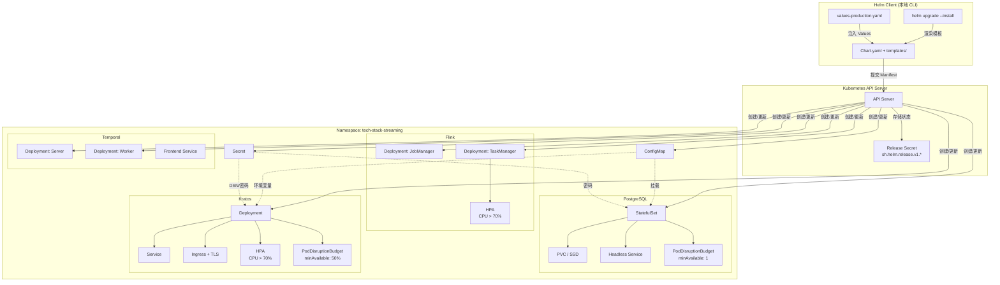
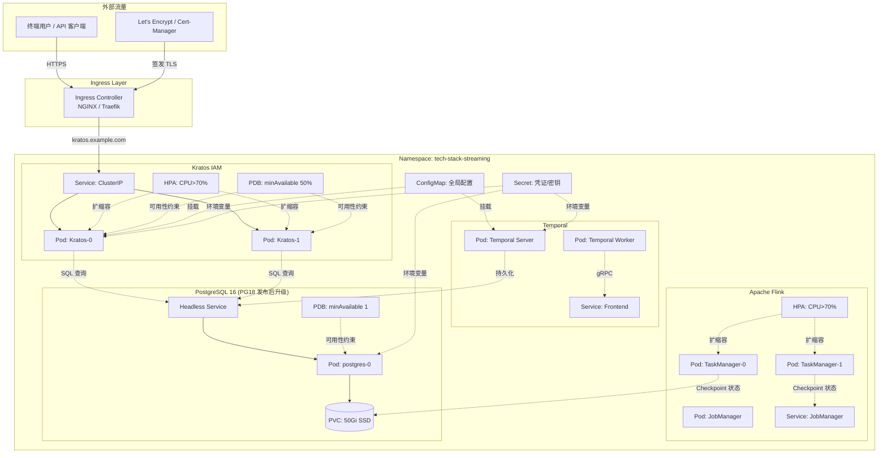

# Kubernetes + Helm Charts 生产部署

> 所属阶段: TECH-STACK | 前置依赖: [02.05-docker-kubernetes-deployment-base.md] | 形式化等级: L3

## 1. 概念定义 (Definitions)

**Def-TS-05-01 (Helm Chart)**
> Helm Chart 是 Kubernetes 资源模板与配置参数的集合，以目录结构组织，包含 `Chart.yaml`（元数据）、`values.yaml`（默认值）、`templates/`（Go template 渲染的 K8s manifest）以及可选的依赖声明。Chart 作为可复用的部署单元，支持版本化管理与依赖嵌套。

直观上，Helm Chart 类似于操作系统中的软件包（如 `.deb` 或 `.rpm`），但其安装目标不是文件系统，而是 Kubernetes API Server 所维护的集群状态。Helm 3 移除了服务端组件 Tiller，所有操作通过本地 kubeconfig 直接与 API Server 交互，降低了 RBAC 攻击面。

**Def-TS-05-02 (Helm Release)**
> Helm Release 是 Chart 在特定 Kubernetes 集群与 Namespace 中的实例化对象。Release 由名称唯一标识，Helm 通过 Secret（默认）或 ConfigMap 在目标 Namespace 中存储其状态（release revision），以支持升级回滚与历史追踪。

Release 的状态模型包含 `unknown`、`deployed`、`uninstalled`、`superseded`、`failed`、`uninstalling`、`pending-install`、`pending-upgrade`、`pending-rollback` 等阶段。每一次 `helm upgrade` 生成一个新的 revision，旧 revision 被标记为 `superseded`。

**Def-TS-05-03 (Values)**
> Values 是注入 Helm Chart 模板的外部配置数据，以 YAML 键值结构组织。Values 的来源按优先级从高到低依次为：命令行 `--set` / `--set-file`、用户自定义 values 文件（`-f`）、Chart 内建的 `values.yaml`。模板通过 `{{ .Values.<key> }}` 语法引用 Values。

Values 机制实现了配置与模板分离，使得同一 Chart 可在开发、测试、生产环境中复用，仅通过差异化的 Values 文件控制资源规格、镜像版本与外部端点。

**Def-TS-05-04 (Template)**
> Template 是位于 Chart `templates/` 目录下的 Go text/template 文件，扩展名通常为 `.yaml`。Helm 在渲染阶段将 Values 注入模板，执行控制流（`if`、`range`、`with`）与管道函数（`default`、`b64enc`、`quote` 等），输出合法的 Kubernetes manifest 提交至 API Server。

Helm 还提供内置对象如 `.Release`、`.Chart`、`.Capabilities`、`.Template`，允许模板感知运行时集群环境与自身元数据。

**Def-TS-05-05 (Ingress)**
> Ingress 是 Kubernetes API 资源，用于将集群外部 HTTP/HTTPS 流量路由至内部 Service。Ingress 本身不直接处理流量，需由 Ingress Controller（如 NGINX Ingress Controller、Traefik、HAProxy）实现。Ingress 支持基于主机名、路径、TLS 终止及后端协议的配置。

在生产环境中，Ingress 通常与 Cert-Manager 配合，通过 Let's Encrypt 或私有 CA 自动签发并轮换 TLS 证书，实现外部流量的安全接入。

## 2. 属性推导 (Properties)

**Lemma-TS-05-01 (Helm Release 原子性升级)**
> 若 Helm Release 的升级操作（`helm upgrade`）成功返回，则目标 Namespace 中所有由该 Release 管理的 K8s 资源对象的新版本均已通过 API Server 的持久化写入；若升级失败，则 Release 状态标记为 `failed`，且不会自动回滚至上一版本（除非显式指定 `--atomic` 标志）。

*推导*: Helm 3 的升级逻辑由客户端执行，分为以下步骤：

1. 读取当前 Release 的 latest revision；
2. 基于新 Chart 与 Values 渲染 manifest；
3. 通过三路战略合并（3-way strategic merge patch）向 API Server 发送更新请求；
4. 等待资源创建/更新结果；
5. 将新 revision 记录为 Secret（或 ConfigMap）。

API Server 对单个资源的更新是原子的，但跨资源集合并非事务性。因此 Helm 提供 `--atomic` 选项：当任何资源更新失败时，自动回滚至上一成功 revision。在无 `--atomic` 时，成功写入的资源保持新状态，失败资源保留旧状态，集群处于部分升级态。

**Lemma-TS-05-02 (Values 优先级覆盖的确定性)**
> 给定同一键路径 `k`，若存在多个 Values 来源，则 Helm 按固定优先级选择值，输出具有确定性，不受模板文件加载顺序影响。

*推导*: Helm 的 Values 合并采用深度覆盖策略。优先级链为：

```
--set > --values (-f) > parent chart values > subchart values > chart default values
```

由于 YAML 键空间为树形结构，且同层键覆盖无歧义，最终合并结果唯一。

## 3. 关系建立 (Relations)

Helm Chart 与 Kubernetes 资源对象之间存在**模板实例化**关系：

| Helm Chart 组件 | 映射目标 | 关系类型 |
|---|---|---|
| `Chart.yaml` | 无直接 K8s 资源 | 包元数据，用于依赖解析与仓库索引 |
| `values.yaml` | 无直接 K8s 资源 | 配置数据源，供模板渲染时引用 |
| `templates/*.yaml` | Pod、Deployment、Service、Ingress、ConfigMap、Secret、StatefulSet 等 | 一对多模板实例化 |
| Helm Release Secret | `sh.helm.release.v1.<name>.v<N>` Secret | 状态持久化 |
| `templates/_helpers.tpl` | 无直接 K8s 资源 | 命名模板（partial），供其他模板包含复用 |

具体而言，一个 Chart 的 `templates/` 目录通常输出以下资源集合：

- **Deployment / StatefulSet**：工作负载控制器，定义 Pod 模板与副本策略；
- **Service**：集群内服务发现与负载均衡；
- **ConfigMap / Secret**：配置外化与敏感信息注入；
- **Ingress**：外部流量入口；
- **PersistentVolumeClaim**：有状态工作负载的存储声明；
- **PodDisruptionBudget**：可用性保障策略；
- **HorizontalPodAutoscaler**：弹性伸缩策略。

Helm 的依赖管理（`dependencies` in `Chart.yaml`）允许父 Chart 嵌套子 Chart（如 Bitnami PostgreSQL Chart、Temporal Helm Chart），通过全局 Values 或依赖别名实现参数透传，形成**组合部署**关系。

## 4. 论证过程 (Argumentation)

### 4.1 五技术栈的 K8s 资源设计

本技术栈包含 Streaming (Flink)、PostgreSQL、Temporal、Kratos 及配套基础设施。各组件的资源模型设计如下：

| 组件 | 控制器类型 | 存储需求 | 服务类型 | 关键配置 |
|---|---|---|---|---|
| PostgreSQL 16 | StatefulSet | PVC (SSD) | Headless Service | `minAvailable: 1`, 单节点或主从（PG18 发布后升级）|
| Flink JobManager | Deployment | 无 / Checkpoint PVC | ClusterIP | Operator 或原生 Deployment |
| Flink TaskManager | Deployment | 无 | ClusterIP | HPA 触发 CPU > 70% |
| Temporal Server | Deployment | PVC (Persistence) | ClusterIP / Headless | 社区 Helm Chart 多服务拆分 |
| Temporal Worker | Deployment | 无 | ClusterIP | 与 Temporal Server 通过 gRPC 通信 |
| Kratos | Deployment | 无 | ClusterIP + Ingress | `minAvailable: 50%`, HPA CPU > 70% |

Namespace 统一为 `tech-stack-streaming`，便于网络策略（NetworkPolicy）与 RBAC 的集中管理。

### 4.2 StatefulSet: PostgreSQL 16

PostgreSQL 作为有状态服务，必须满足：

1. **稳定网络标识**：通过 Headless Service（`clusterIP: None`）为每个 Pod 提供可解析的 DNS 记录（如 `postgres-0.postgres.tech-stack-streaming.svc.cluster.local`）；
2. **稳定存储**：每个 Pod 模板挂载独立的 `PersistentVolumeClaim`，由 StorageClass 动态供给 SSD 后端；
3. **有序部署与扩缩容**：`podManagementPolicy: OrderedReady` 保证主节点先启动；
4. **最小可用保证**：`PodDisruptionBudget` 设置 `minAvailable: 1`，确保滚动更新或节点驱逐时至少一个副本可用。

```yaml
# 片段：PostgreSQL StatefulSet 核心字段
spec:
  serviceName: postgres-headless
  replicas: 1
  podManagementPolicy: OrderedReady
  template:
    spec:
      containers:
        - name: postgres
          image: postgres:16-alpine  # PG18 官方镜像发布后升级
          volumeMounts:
            - name: data
              mountPath: /var/lib/postgresql/data
  volumeClaimTemplates:
    - metadata:
        name: data
      spec:
        accessModes: ["ReadWriteOnce"]
        storageClassName: "standard-ssd"  # 或默认 StorageClass
        resources:
          requests:
            storage: 50Gi
```

### 4.3 Deployment: Flink JobManager / TaskManager, Kratos, Temporal Worker

无状态服务采用 Deployment 控制器：

- **Flink JobManager**：负责集群协调与调度。若使用 Flink Kubernetes Operator，则通过 `FlinkDeployment` CRD 管理；若使用原生 Deployment，需暴露 REST (`8081`) 与 Blob Server 端口。
- **Flink TaskManager**：实际执行计算任务，资源消耗大，需配置 HPA 根据 CPU 利用率自动扩容副本数。
- **ORY Kratos**：身份与访问管理（Identity & Access Management, IAM）服务，无状态，依赖 PostgreSQL 持久化数据。需暴露 HTTP (4433) 与 Admin (4434) 端口。

> **命名说明**: 此处 Helm Chart 使用 `oryd/kratos`，为 ORY 生态的 IAM 解决方案；与 Docker Compose 栈中使用的 [Go-Kratos](https://go-kratos.dev/) 微服务框架是同名但完全不同的项目，请勿混淆。

- **Temporal Worker**：业务工作流执行单元，通过 gRPC 连接 Temporal Frontend Service。

Deployment 的 `strategy` 默认采用 `RollingUpdate`，需合理设置 `maxUnavailable` 与 `maxSurge` 以避免服务中断。

### 4.4 Helm Chart 结构

本部署采用 Umbrella Chart 模式，顶层 Chart 聚合各子系统：

```
tech-stack-streaming/
├── Chart.yaml
├── values.yaml
├── values-production.yaml
├── templates/
│   ├── _helpers.tpl
│   ├── namespace.yaml
│   ├── postgres/
│   │   ├── statefulset.yaml
│   │   ├── service-headless.yaml
│   │   ├── pdb.yaml
│   │   └── secret.yaml
│   ├── flink/
│   │   ├── deployment-jobmanager.yaml
│   │   ├── deployment-taskmanager.yaml
│   │   ├── service-jobmanager.yaml
│   │   └── hpa-taskmanager.yaml
│   ├── temporal/
│   │   └── (引用社区子 chart)
│   ├── kratos/
│   │   ├── deployment.yaml
│   │   ├── service.yaml
│   │   ├── ingress.yaml
│   │   ├── pdb.yaml
│   │   └── hpa.yaml
│   └── configmap-global.yaml
└── charts/
    └── temporal-0.50.0.tgz   # 社区 Temporal Helm Chart
```

`Chart.yaml` 示例：

```yaml
apiVersion: v2
name: tech-stack-streaming
description: Helm chart for streaming + postgres + temporal + kratos stack
type: application
version: 1.0.0
appVersion: "2026.04"
dependencies:
  - name: temporal
    version: 0.50.0
    repository: https://temporalio.github.io/helm-charts
    condition: temporal.enabled
```

### 4.5 配置外化（ConfigMap / Secret）

生产环境禁止将配置硬编码于容器镜像。采用以下外化策略：

- **ConfigMap**：存放非敏感配置，如数据库连接池参数、Flink 并行度、Temporal 命名空间、Kratos 公共 URL；
- **Secret**：存放敏感信息，如 PostgreSQL 密码、Kratos 加密密钥、TLS 证书私钥、OAuth2 Client Secret。Secret 数据以 Base64 编码存储，建议启用 etcd 加密（`EncryptionConfiguration`）或外部 Secret 管理（如 External Secrets Operator + Azure Key Vault）。

配置通过环境变量或挂载卷注入容器：

```yaml
envFrom:
  - configMapRef:
      name: {{ include "tech-stack.fullname" . }}-global
env:
  - name: DSN
    valueFrom:
      secretKeyRef:
        name: {{ include "tech-stack.fullname" . }}-postgres
        key: dsn
```

### 4.6 Ingress + TLS 配置

外部流量通过 Ingress 进入集群，仅 Kratos 公共 API 与 Flink REST API（可选）需暴露：

```yaml
apiVersion: networking.k8s.io/v1
kind: Ingress
metadata:
  name: {{ include "tech-stack.fullname" . }}-kratos
  annotations:
    cert-manager.io/cluster-issuer: "letsencrypt-prod"
    nginx.ingress.kubernetes.io/ssl-redirect: "true"
spec:
  ingressClassName: nginx
  tls:
    - hosts:
        - kratos.example.com
      secretName: kratos-tls
  rules:
    - host: kratos.example.com
      http:
        paths:
          - path: /
            pathType: Prefix
            backend:
              service:
                name: {{ include "tech-stack.fullname" . }}-kratos
                port:
                  number: 4433
```

TLS 证书由 Cert-Manager 自动签发与续期。对于内部服务间通信，建议启用 Service Mesh（如 Linkerd 或 Istio）实现 mTLS，替代明文集群内通信。

### 4.7 HPA（Horizontal Pod Autoscaler）配置

HPA 根据观察指标自动调整 Deployment 副本数。本栈中 Flink TaskManager 与 Kratos 启用 HPA：

```yaml
apiVersion: autoscaling/v2
kind: HorizontalPodAutoscaler
metadata:
  name: {{ include "tech-stack.fullname" . }}-kratos
spec:
  scaleTargetRef:
    apiVersion: apps/v1
    kind: Deployment
    name: {{ include "tech-stack.fullname" . }}-kratos
  minReplicas: 2
  maxReplicas: 10
  metrics:
    - type: Resource
      resource:
        name: cpu
        target:
          type: Utilization
          averageUtilization: 70
  behavior:
    scaleUp:
      stabilizationWindowSeconds: 60
      policies:
        - type: Percent
          value: 100
          periodSeconds: 60
    scaleDown:
      stabilizationWindowSeconds: 300
      policies:
        - type: Percent
          value: 10
          periodSeconds: 60
```

`scaleDown.stabilizationWindowSeconds: 300` 防止流量抖动导致频繁缩容。Flink TaskManager 的 HPA 需与 Flink 的并行度动态调整机制协同，避免单纯依赖副本数导致状态重分配异常。

### 4.8 PodDisruptionBudget 保证最小可用副本

PDB 限制因自愿中断（如节点排水、Deployment 滚动更新）导致的不可用 Pod 数量：

```yaml
# PostgreSQL PDB
apiVersion: policy/v1
kind: PodDisruptionBudget
metadata:
  name: {{ include "tech-stack.fullname" . }}-postgres
spec:
  minAvailable: 1
  selector:
    matchLabels:
      app.kubernetes.io/component: postgres
---
# Kratos PDB
apiVersion: policy/v1
kind: PodDisruptionBudget
metadata:
  name: {{ include "tech-stack.fullname" . }}-kratos
spec:
  minAvailable: 50%
  selector:
    matchLabels:
      app.kubernetes.io/component: kratos
```

`minAvailable: 50%` 表示 Kratos 在任意时刻至少一半的 Pod 必须处于 Ready 状态。若副本数为 2，则允许同时中断 1 个；若副本数为 4，则允许同时中断 2 个。该策略与 HPA 扩缩容需联合验证（见第 5 节）。

## 5. 形式证明 / 工程论证 (Proof / Engineering Argument)

**Prop-TS-05-01 (PDB + HPA 在滚动更新时的可用性保证)**
> 设 Deployment `D` 同时受 PDB `P` 与 HPA `H` 约束。若初始副本数 `replicas = r ≥ 2`，PDB 要求 `minAvailable = m`，HPA 目标 CPU 利用率 `U_target = 70%`。则在滚动更新期间，只要节点资源充足且 HPA 未触发紧急缩容，服务可用 Pod 数始终满足 `available ≥ max(m, ceil(r/2))`（当 m 为百分比时取整）。

*工程论证*：

1. **PDB 的约束边界**
   PDB 通过 Kubernetes Eviction API 生效。`kubectl drain` 或 Deployment `RollingUpdate` 在执行 Pod 终止前，会向 API Server 查询 PDB 状态。若终止该 Pod 将导致 `available < minAvailable`，则驱逐请求被挂起（`429 Too Many Requests`），直到条件满足。
   对于 Kratos，`minAvailable: 50%` 在副本数 `r` 为偶数时等价于 `maxUnavailable = r/2`；在 `r` 为奇数时等价于 `maxUnavailable = floor(r/2)`。因此 PDB 直接约束了滚动更新中同时中断的上限。

2. **HPA 与滚动更新的时序关系**
   HPA 控制器每 15 秒（默认）根据 Metrics Server 采集的 Pod 平均 CPU 计算期望副本数。滚动更新期间，旧 Pod 处于 `Terminating` 状态时仍被计入当前副本数，但不再提供有效负载容量；新 Pod 需通过 readiness probe 后才被视为 `available`。
   若此时负载不变而服务容量下降，平均 CPU 上升，HPA 倾向于**扩容**而非缩容。因此 HPA 在滚动更新期间通常不会与 PDB 产生冲突性缩容请求，反而可能通过增加副本数提升可用性。

3. **联合安全条件**
   定义联合安全条件：

   ```
   Let r_current = 当前 Deployment spec.replicas
   Let m_abs   = PDB minAvailable 的绝对值（若为百分比则计算 ceil(r_current * ratio)）
   Let u_max   = RollingUpdate maxUnavailable
   ```

   安全滚动更新的必要条件为：

   ```
   u_max ≤ r_current - m_abs
   ```

   若 `u_max` 默认 25%，而 PDB 要求 50%，则 `u_max = ceil(r_current * 0.25) ≤ floor(r_current * 0.5)` 对 `r_current ≥ 2` 恒成立。因此默认 Deployment 策略与 `minAvailable: 50%` 是兼容的。

4. **风险边界：节点级非自愿中断**
   PDB 仅对**自愿中断**（voluntary disruption）生效。节点故障、kubelet 崩溃、网络分区导致的 Pod 失效属于非自愿中断，PDB 无法阻止。此时高可用需依赖多副本跨节点/跨可用区分布（`podAntiAffinity` 与 `topologySpreadConstraints`）。

综上，合理配置 PDB 与 HPA 可确保在常规运维操作（升级、节点维护）期间，服务保持法定可用副本数；HPA 的扩容倾向进一步降低了滚动更新期间的容量不足风险。

## 6. 实例验证 (Examples)

### 6.1 Helm values.yaml（生产环境）

```yaml
# values-production.yaml
# Namespace 配置
namespace:
  name: tech-stack-streaming
  labels:
    environment: production
    app.kubernetes.io/managed-by: Helm

# PostgreSQL 配置
postgres:
  enabled: true
  image:
    repository: postgres
    tag: "16-alpine"  # PG18 官方镜像发布后升级
  replicas: 1
  resources:
    requests:
      memory: "2Gi"
      cpu: "1000m"
    limits:
      memory: "4Gi"
      cpu: "2000m"
  persistence:
    enabled: true
    size: 50Gi
    storageClass: "standard-ssd"
  pdb:
    minAvailable: 1
  service:
    type: ClusterIP
    port: 5432

# Flink 配置（原生 Deployment 模式）
flink:
  enabled: true
  jobmanager:
    image: flink:1.20-scala_2.12
    replicas: 1
    resources:
      requests:
        memory: "2Gi"
        cpu: "1000m"
    service:
      type: ClusterIP
      ports:
        rest: 8081
        blob: 6124
  taskmanager:
    image: flink:1.20-scala_2.12
    replicas: 2
    resources:
      requests:
        memory: "4Gi"
        cpu: "2000m"
    hpa:
      enabled: true
      minReplicas: 2
      maxReplicas: 20
      targetCPUUtilizationPercentage: 70
      behavior:
        scaleUp:
          stabilizationWindowSeconds: 60
        scaleDown:
          stabilizationWindowSeconds: 300

# Temporal 配置（引用社区子 chart 参数）
temporal:
  enabled: true
  server:
    replicaCount: 2
  cassandra:
    enabled: false
  postgresql:
    enabled: true
    host: "postgres-headless.tech-stack-streaming.svc.cluster.local"
    port: 5432
    database: temporal
    user: temporal
    existingSecret: "tech-stack-streaming-postgres"
  elasticsearch:
    enabled: true

# Kratos 配置 (ORY Kratos IAM — 注意：与 Go-Kratos 微服务框架同名但不同项目)
kratos:
  enabled: true
  image:
    repository: oryd/kratos
    tag: "v1.3.0"
  replicas: 2
  resources:
    requests:
      memory: "512Mi"
      cpu: "250m"
    limits:
      memory: "1Gi"
      cpu: "500m"
  config:
    dsn: "postgres://kratos:{{ .Values.kratos.config.secrets.dbPassword }}@postgres-headless:5432/kratos?sslmode=disable"
    secrets:
      dbPassword:
        existingSecret:
          name: tech-stack-streaming-postgres
          key: kratos-password
  ingress:
    enabled: true
    className: nginx
    hosts:
      - host: kratos.example.com
        paths:
          - path: /
            pathType: Prefix
    tls:
      - secretName: kratos-tls
        hosts:
          - kratos.example.com
  hpa:
    enabled: true
    minReplicas: 2
    maxReplicas: 10
    targetCPUUtilizationPercentage: 70
  pdb:
    minAvailable: 50%
```

### 6.2 关键 K8s Manifest 模板片段

**Kratos Deployment 模板（带配置外化与探针）**

```yaml
# templates/kratos/deployment.yaml
apiVersion: apps/v1
kind: Deployment
metadata:
  name: {{ include "tech-stack.fullname" . }}-kratos
  namespace: {{ .Values.namespace.name }}
  labels:
    {{- include "tech-stack.labels" . | nindent 4 }}
    app.kubernetes.io/component: kratos
spec:
  replicas: {{ .Values.kratos.replicas }}
  strategy:
    type: RollingUpdate
    rollingUpdate:
      maxUnavailable: 25%
      maxSurge: 25%
  selector:
    matchLabels:
      {{- include "tech-stack.selectorLabels" . | nindent 6 }}
      app.kubernetes.io/component: kratos
  template:
    metadata:
      labels:
        {{- include "tech-stack.selectorLabels" . | nindent 8 }}
        app.kubernetes.io/component: kratos
    spec:
      containers:
        - name: kratos
          image: "{{ .Values.kratos.image.repository }}:{{ .Values.kratos.image.tag }}"
          imagePullPolicy: IfNotPresent
          command: ["kratos"]
          args: ["serve", "--config", "/etc/config/kratos.yaml"]
          ports:
            - name: public
              containerPort: 4433
              protocol: TCP
            - name: admin
              containerPort: 4434
              protocol: TCP
          livenessProbe:
            httpGet:
              path: /health/alive
              port: admin
            initialDelaySeconds: 10
            periodSeconds: 10
          readinessProbe:
            httpGet:
              path: /health/ready
              port: admin
            initialDelaySeconds: 5
            periodSeconds: 5
          resources:
            {{- toYaml .Values.kratos.resources | nindent 12 }}
          volumeMounts:
            - name: config
              mountPath: /etc/config
              readOnly: true
            - name: secrets
              mountPath: /etc/secrets
              readOnly: true
          envFrom:
            - configMapRef:
                name: {{ include "tech-stack.fullname" . }}-global
      volumes:
        - name: config
          configMap:
            name: {{ include "tech-stack.fullname" . }}-kratos-config
        - name: secrets
          secret:
            secretName: {{ include "tech-stack.fullname" . }}-kratos-secrets
```

**Flink TaskManager HPA 模板**

```yaml
# templates/flink/hpa-taskmanager.yaml
{{- if .Values.flink.taskmanager.hpa.enabled }}
apiVersion: autoscaling/v2
kind: HorizontalPodAutoscaler
metadata:
  name: {{ include "tech-stack.fullname" . }}-flink-taskmanager
  namespace: {{ .Values.namespace.name }}
spec:
  scaleTargetRef:
    apiVersion: apps/v1
    kind: Deployment
    name: {{ include "tech-stack.fullname" . }}-flink-taskmanager
  minReplicas: {{ .Values.flink.taskmanager.hpa.minReplicas }}
  maxReplicas: {{ .Values.flink.taskmanager.hpa.maxReplicas }}
  metrics:
    - type: Resource
      resource:
        name: cpu
        target:
          type: Utilization
          averageUtilization: {{ .Values.flink.taskmanager.hpa.targetCPUUtilizationPercentage }}
  behavior:
    scaleUp:
      stabilizationWindowSeconds: {{ .Values.flink.taskmanager.hpa.behavior.scaleUp.stabilizationWindowSeconds }}
      policies:
        - type: Percent
          value: 100
          periodSeconds: 60
    scaleDown:
      stabilizationWindowSeconds: {{ .Values.flink.taskmanager.hpa.behavior.scaleDown.stabilizationWindowSeconds }}
      policies:
        - type: Percent
          value: 10
          periodSeconds: 60
{{- end }}
```

## 7. 可视化 (Visualizations)

### 7.1 Helm Chart 结构图

以下图表展示了 Umbrella Chart 的层次结构、Values 流向与模板渲染路径：



### 7.2 K8s 资源拓扑图

以下图表展示了五技术栈在 Kubernetes 中的运行时拓扑、流量路径与存储依赖：



### 3.2 项目知识库交叉引用

本文档描述的 Helm 生产部署与项目现有知识库存在以下关联：

- [Flink Kubernetes 部署指南](../../Flink/04-runtime/04.01-deployment/kubernetes-deployment.md) — Flink 在 K8s 上的部署模式与 Helm Chart 集成
- [Flink Kubernetes Operator 深度解析](../../Flink/04-runtime/04.01-deployment/flink-kubernetes-operator-deep-dive.md) — 生产级 Flink Operator 的自动化部署与生命周期管理
- [Flink 部署运维完整指南](../../Flink/04-runtime/04.01-deployment/flink-deployment-ops-complete-guide.md) — K8s 环境下 Flink 部署的运维最佳实践
- [高可用模式](../../Knowledge/07-best-practices/07.06-high-availability-patterns.md) — Helm 部署中的高可用配置与 PDB/HPA 协同设计

## 8. 引用参考 (References)
