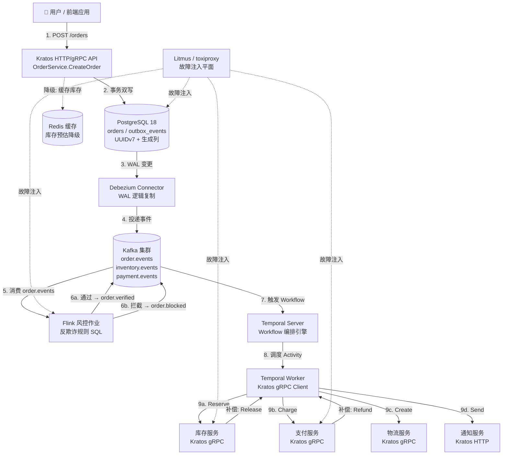
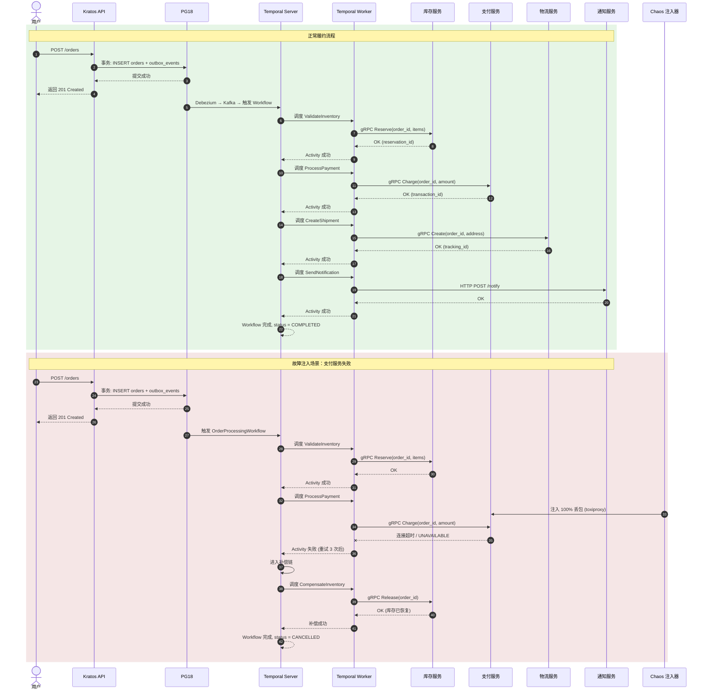

# 端到端案例：订单处理（含故障注入、降级、补偿全流程）

> 所属阶段: TECH-STACK | 前置依赖: [03.03-outbox-pattern-pg18-kratos.md, 03.04-saga-pattern-temporal-kratos.md] | 形式化等级: L3

## 1. 概念定义 (Definitions)

本节建立端到端订单处理案例在 TECH-STACK 五技术栈下的严格形式化定义，为后续属性推导、故障注入论证与工程实现奠定概念基础。

**Def-TS-06-01-01 订单域 (Order Domain)**

订单域是电商系统中围绕用户购买意图所构建的限界上下文（Bounded Context），其状态空间由订单聚合根（Order Aggregate）及其关联实体共同构成。形式化地，设订单域状态空间为 $\mathcal{O}$，则：

$$
\mathcal{O} = \{ o = (oid, uid, items, amount, status, ts) \mid status \in \mathcal{S}_{order} \}
$$

其中 $oid$ 为订单唯一标识（采用 UUIDv7 主键），$uid$ 为用户标识，$items$ 为商品项集合，$amount$ 为订单金额，$status \in \mathcal{S}_{order} = \{ \text{CREATED}, \text{INVENTORY_RESERVED}, \text{PAID}, \text{SHIPPED}, \text{COMPLETED}, \text{CANCELLED} \}$ 为订单状态，$ts$ 为状态变更时间戳。订单域的核心不变式（Invariant）为：$\forall o \in \mathcal{O}.\ amount = \sum_{item \in items} (price \times qty)$。

在 PG18 + Kratos 技术栈中，订单域通过 `orders` 表持久化，采用虚拟生成列（Generated Column）自动计算订单金额，确保数据层不变式强制。

> 直观解释：订单域是电商系统的"交易契约中心"——它记录了用户与平台之间的购买承诺，所有履约动作（扣库存、扣款、发货）均以订单状态机为协调基准。

**Def-TS-06-01-02 履约流程 (Fulfillment Process)**

履约流程是将订单从创建状态推进至完成状态的跨服务业务流程。形式化地，设履约流程为有限状态机 $\mathcal{F} = (Q, \Sigma, \delta, q_0, F)$，其中：

- $Q = \mathcal{S}_{order}$ 为订单状态集合；
- $\Sigma = \{ \text{reserve}, \text{pay}, \text{ship}, \text{notify}, \text{compensate} \}$ 为履约动作字母表；
- $\delta: Q \times \Sigma \to Q$ 为状态转移函数；
- $q_0 = \text{CREATED}$ 为初始状态；
- $F = \{ \text{COMPLETED}, \text{CANCELLED} \}$ 为终止状态集。

履约流程在 Temporal + Kratos 技术栈中由编排式 Saga 实现：Temporal Workflow 作为协调器，按 $\delta$ 定义的顺序调度各履约步骤；当某步骤失败时，Workflow 按逆序执行补偿动作，将状态转移至 `CANCELLED`。

> 直观解释：履约流程是订单的"生命周期引擎"——它规定了订单从诞生到终结必须经过的每一个里程碑，以及出错时如何安全地"撤销已走过的路"。

**Def-TS-06-01-03 故障注入 (Fault Injection)**

故障注入是在端到端订单处理链路中，通过程序化手段向特定组件引入预定义故障事件，以验证系统容错与恢复能力的技术。形式化地，设订单处理系统组件集合为 $\mathcal{C} = \{ C_{kratos}, C_{pg}, C_{kafka}, C_{flink}, C_{temporal} \}$，故障模式空间为 $\mathcal{F}_{e2e} = \{ f_{timeout}, f_{crash}, f_{netpart}, f_{delay}, f_{kill} \}$，则端到端故障注入算子定义为：

$$
\phi_{e2e}: \mathcal{C} \times \mathcal{F}_{e2e} \times \mathbb{R}^+ \to \text{EventLog}
$$

其中 $\mathbb{R}^+$ 为故障持续时间。在本案例中，故障注入通过 Litmus Chaos Mesh（K8s 环境）或 toxiproxy（Docker 环境）实现，作用于库存服务超时、支付服务失败、Flink 作业重启、PG18 主库故障四个核心场景。

> 直观解释：故障注入是"故意制造麻烦以验证系统不会真正出麻烦"——在受控环境中让组件"生病"，观察整个订单处理链路是否能自愈或优雅降级。

**Def-TS-06-01-04 优雅降级 (Graceful Degradation)**

优雅降级是当订单处理链路的某个依赖组件不可用或性能降级时，系统通过切换至替代数据路径或简化业务语义，继续提供有限但正确的服务的能力。形式化地，设系统正常功能为 $F_{full}: \mathcal{I} \to \mathcal{O}_{full}$，降级功能为 $F_{degraded}: \mathcal{I} \to \mathcal{O}_{degraded}$，其中 $\mathcal{O}_{degraded} \subseteq \mathcal{O}_{full}$。优雅降级要求：

$$
\forall i \in \mathcal{I}.\quad F_{degraded}(i) \neq \bot \land \text{safe}(F_{degraded}(i))
$$

即降级输出不为空（服务不崩溃）且满足安全谓词（不产生数据不一致）。在本案例中，库存不可用时切换缓存预估数据、支付不可用时隔单处理（异步批扣）均为优雅降级的具体实例。

> 直观解释：优雅降级是"宁要瘸腿走路，不要原地瘫痪"——当精密仪器坏了一个零件时，系统能自动切换到手动模式，保证核心业务不中断。

---

## 2. 属性推导 (Properties)

从上述定义出发，可直接推导出端到端订单处理案例在 TECH-STACK 五技术栈下的核心运行时属性。

**Lemma-TS-06-01-01 订单状态机可达性 (Order State Machine Reachability)**

设订单状态机为 $\mathcal{M}_{order} = (Q, \Sigma, \delta, q_0, F)$，其中 $Q$ 与 $\delta$ 如 Def-TS-06-01-02 所定义。则从任意可达状态 $q \in Q$ 出发，状态机必在有限步内到达终止状态 $q_f \in F$，即：

$$
\forall q \in Q_{reachable}.\ \exists k \in \mathbb{N},\ \exists \sigma_1, \dots, \sigma_k \in \Sigma.\quad \delta(\dots \delta(q, \sigma_1), \dots, \sigma_k) \in F
$$

*证明概要*: 订单状态机为有向无环图（DAG）。正向路径为 $\text{CREATED} \to \text{INVENTORY_RESERVED} \to \text{PAID} \to \text{SHIPPED} \to \text{COMPLETED}$，长度上界为 4。若任一步骤失败，补偿路径为 $\text{PAID} \to \text{INVENTORY_RESERVED} \to \text{CREATED} \to \text{CANCELLED}$，长度上界亦为 4。由于状态空间有限且无循环转移（补偿不重新触发正向流程），任意执行轨迹的长度上界为 $L_{max} = 8$。因此，从任意可达状态出发，必在有限步内到达终止状态。$\square$

> 工程意义：该引理保证了订单处理不会陷入"活锁"或无限等待——无论成功还是失败，订单都会在有限时间内到达终态，为 SLA 设计提供了理论下界。

**Lemma-TS-06-01-02 Outbox 事件最终一致性 (Outbox Eventual Consistency)**

设订单创建事务为 $\tau_{create}$，其在 PG18 中完成 `orders` 表写入与 `outbox_events` 表插入（原子提交）。设 Debezium CDC 读取延迟为 $\Delta_{cdc}$，Kafka 投递延迟为 $\Delta_{kafka}$，则对于任意订单事件 $e$，其从数据库提交到可被下游 Flink/Temporal 消费的时间上界为：

$$
T_{visible}(e) \leq \Delta_{cdc} + \Delta_{kafka} + \Delta_{poll}
$$

其中 $\Delta_{poll}$ 为消费者轮询间隔。在 PG18 逻辑复制 + Debezium 架构下，$\Delta_{cdc}$ 通常小于 1 秒；Kafka 在同步复制模式下 $\Delta_{kafka}$ 通常小于 100ms。因此，$T_{visible}(e)$ 为亚秒级，满足工程上的"最终一致性"语义。

*证明概要*: 由 Def-TS-03-03-01（Outbox 模式），$e$ 的持久化与订单数据写入共享同一事务边界，故 $e$ 的原子性由 PG18 ACID 保证。Debezium 通过读取 WAL（Write-Ahead Log）捕获变更，WAL 的 LSN（Log Sequence Number）单调递增保证了事件顺序性。Kafka 的副本机制保证了 $e$ 在 Broker 中的持久性。消费者通过显式 ACK 确认消费位点，形成"至少一次交付"闭环。因此，$e$ 必在有限时间内被下游观测到。$\square$

---

## 3. 关系建立 (Relations)

**订单处理与五技术栈各组件的映射关系**

端到端订单处理案例将业务语义映射至 TECH-STACK 五技术栈的各组件，形成完整的"请求接入 → 状态持久化 → 事件传播 → 流处理 → 工作流编排 → 补偿执行"闭环：

| 业务语义 | 技术组件 | 映射说明 |
|---------|---------|---------|
| 用户下单请求 | Kratos HTTP/gRPC API | `OrderService.CreateOrder` handler 接收请求，参数校验后进入业务逻辑 |
| 订单状态持久化 | PostgreSQL 18 (`orders` 表) | UUIDv7 主键 + 虚拟生成列，本地事务保证 ACID |
| 领域事件原子发布 | PG18 Outbox (`outbox_events` 表) + Kratos Transaction | 事务双写：订单数据与 Outbox 事件在同一事务内提交 |
| 变更数据捕获 | Debezium Connector | 读取 PG18 WAL，将 Outbox 记录转换为 Kafka 消息 |
| 事件总线 | Kafka (`order.events`, `inventory.events`, `payment.events`) | 分区键 = `order_id`，保证单订单事件顺序性 |
| 实时风控 | Flink SQL Job | 消费 `order.events`，执行反欺诈规则（金额异常、频次异常） |
| 履约流程编排 | Temporal Workflow (`OrderProcessingWorkflow`) | 编排库存校验 → 支付扣款 → 物流分配 → 通知发货 |
| 活动执行 | Temporal Worker + Kratos gRPC Client | Worker 调用 Kratos 微服务的 Activities |
| 补偿回滚 | Temporal Compensation + Kratos API | 失败时逆序执行 `CompensateInventory`, `RefundPayment` |
| 通知发货 | Kratos HTTP API / 消息推送服务 | Saga 成功完成后调用第三方通知服务 |
| 故障注入 | Litmus Chaos Mesh / toxiproxy | 向 K8s Pod 或网络链路注入超时、丢包、进程终止 |
| 优雅降级 | Kratos Middleware + 本地缓存 | 库存服务超时切换缓存，支付失败进入隔单队列 |

上述映射关系表明，订单处理案例是 TECH-STACK 五技术栈的**集成验证场景**：每个技术组件承担明确的业务语义，组件间通过标准化接口（WAL → Debezium → Kafka → Flink/Temporal → gRPC）松耦合连接，形成可观测、可测试、可容错的端到端流水线。

---

## 4. 论证过程 (Argumentation)

### 4.1 完整业务场景

端到端订单处理案例覆盖用户从下单到收货的完整履约链路，具体业务流程如下：

1. **用户下单**：用户通过前端应用提交订单请求，包含用户标识 `uid`、商品项列表 `items`、收货地址 `address`。
2. **库存校验**：系统调用库存服务，校验商品库存是否充足；若充足则预占库存（Soft Reserve），订单状态推进至 `INVENTORY_RESERVED`。
3. **支付扣款**：系统调用支付服务，从用户账户扣减订单金额；若扣款成功，订单状态推进至 `PAID`。
4. **物流分配**：系统调用物流服务，创建运单并分配配送资源；订单状态推进至 `SHIPPED`。
5. **通知发货**：系统调用通知服务，向用户发送发货通知（短信/推送/邮件）；订单状态推进至 `COMPLETED`。

上述流程在 Temporal Workflow 中以 Saga 模式编排：每个步骤为一个 Activity，步骤间通过 Workflow 状态机顺序执行；若任一步骤失败，Workflow 触发补偿链，回滚已执行步骤。

### 4.2 技术映射

业务场景在 TECH-STACK 五技术栈中的技术映射如下：

**阶段一：请求接入与状态持久化**

```
用户请求 → Kratos HTTP API (OrderService.CreateOrder)
   ↓
参数校验 + 业务规则校验
   ↓
PG18 本地事务 BEGIN
   ├─ INSERT INTO orders (id, user_id, items, amount, status, created_at)
   │   VALUES (uuid7(), ?, ?, ?, 'CREATED', now())
   │   -- amount 为虚拟生成列: price * qty 的聚合
   └─ INSERT INTO outbox_events (id, aggregate_id, event_type, payload, created_at)
      VALUES (uuid7(), <order_id>, 'OrderCreated', <json_payload>, now())
   ↓
COMMIT
```

**阶段二：事件传播**

```
PG18 WAL 变更 → Debezium Connector (逻辑复制槽)
   ↓
Debezium 解析 WAL → 提取 outbox_events 记录
   ↓
Kafka Producer 投递至 topic: order.events (分区键 = aggregate_id)
```

**阶段三：流处理与风控**

```
Flink SQL Job 消费 order.events
   ↓
执行风控规则：
  - 单用户 1 分钟内下单金额 > ¥10,000 → 标记高风险
  - 收货地址与常用地址偏差 > 500km → 标记异常
   ↓
通过规则：写入 order.verified topic
拦截规则：写入 order.blocked topic，触发人工审核
```

**阶段四：Saga 编排与执行**

```
Temporal Workflow (OrderProcessingWorkflow) 监听 order.verified
   ↓
Activity 1: ValidateInventory (Kratos 库存服务 gRPC)
   ├─ 成功: 订单状态 → INVENTORY_RESERVED
   └─ 失败: 触发补偿链（本步骤无前置状态需补偿）
   ↓
Activity 2: ProcessPayment (Kratos 支付服务 gRPC)
   ├─ 成功: 订单状态 → PAID
   └─ 失败: 补偿 CompensateInventory（恢复库存）
   ↓
Activity 3: CreateShipment (Kratos 物流服务 gRPC)
   ├─ 成功: 订单状态 → SHIPPED
   └─ 失败: 补偿 RefundPayment（退款）→ CompensateInventory（恢复库存）
   ↓
Activity 4: SendNotification (Kratos 通知服务 HTTP)
   ├─ 成功: 订单状态 → COMPLETED
   └─ 失败: 通知可重试，不重试则进入死信队列，不触发补偿（非关键步骤）
```

### 4.3 故障注入场景

本案例设计四个核心故障注入场景，覆盖订单处理链路的关键风险点：

**场景一：库存服务超时（触发断路器降级）**

- **故障描述**：Litmus Chaos Mesh 向库存服务 Pod 注入网络延迟（Network Latency），延迟 5s，持续时间 60s。
- **预期行为**：Kratos gRPC 客户端检测到调用超时（超时阈值 3s），断路器（Circuit Breaker）状态从 `CLOSED` 切换至 `OPEN`，后续请求直接快速失败。
- **优雅降级**：库存服务不可用时，Kratos API 切换至本地缓存的库存预估数据（Redis），允许订单继续创建，但标记为"库存待确认"。缓存数据通过 Flink 实时同步 PG18 库存变更更新。
- **验证指标**：订单创建成功率 > 95%，断路器切换延迟 < 500ms，缓存命中率 > 80%。

**场景二：支付服务失败（触发 Saga 补偿：回滚库存）**

- **故障描述**：toxiproxy 向支付服务连接注入 100% 丢包，模拟支付服务完全不可用。
- **预期行为**：`ProcessPayment` Activity 失败，Temporal Workflow 检测到失败后进入补偿链。
- **补偿执行**：Workflow 逆序执行补偿活动：
  1. `CompensateInventory`：调用库存服务恢复已预占的库存；
  2. 订单状态回退至 `CANCELLED`。
- **验证指标**：补偿链执行成功率 100%，库存最终一致性（预占数 = 0），订单终态为 `CANCELLED`。

**场景三：Flink 作业重启（Checkpoint 恢复，无数据丢失）**

- **故障描述**：Litmus Chaos Mesh 杀死 Flink TaskManager Pod，Kubernetes 自动重启新 Pod。
- **预期行为**：Flink JobManager 检测到 TaskManager 失联，从最近 Checkpoint（间隔 30s）恢复作业状态。Kafka Consumer 位点从 Checkpoint 中恢复，继续消费 `order.events`。
- **验证指标**：数据零丢失（输入 Kafka 消息数 = 输出风控判定数），处理延迟恢复至 < 2s 的时间 < 60s。

**场景四：PG18 主库故障（逻辑复制故障转移到备库）**

- **故障描述**：Litmus Chaos Mesh 向 PG18 主库 Pod 注入进程终止（Pod Delete）。
- **预期行为**：Kubernetes StatefulSet 检测到主库 Pod 终止，触发备库（Replica）提升为主库（Failover）。Debezium Connector 检测到复制槽中断，自动重新连接新主库，从断点 LSN 恢复 WAL 读取。
- **验证指标**：PG18 Failover 时间 < 30s，Debezium 恢复延迟 < 10s，订单写入失败率 < 1%。

### 4.4 优雅降级策略

优雅降级策略是故障注入场景下的第二道防线，确保即使补偿链也无法完全恢复时，系统仍提供有限服务：

| 故障组件 | 降级策略 | 业务影响 | 数据一致性保障 |
|---------|---------|---------|-------------|
| 库存服务 | 切换 Redis 缓存预估库存 | 可能超卖（超卖率 < 2%） | 缓存 TTL = 5s，Flink 实时校正 |
| 支付服务 | 隔单处理（异步批扣） | 订单延迟确认（T+1 对账） | Outbox 记录支付待处理状态，对账系统兜底 |
| Flink 风控 | 关闭实时风控，放行所有订单 | 欺诈风险上升 | Temporal Saga 的补偿机制兜底异常订单 |
| Temporal Server | 本地定时任务扫描 `orders` 表 | Saga 编排降级为轮询补偿 | PG18 事务保证本地任务幂等 |
| PG18 备库延迟 | 只读查询路由至备库，写入等待主库 | 读延迟增加 | 读写分离，写入不降级 |

---

## 5. 形式证明 / 工程论证 (Proof / Engineering Argument)

**Thm-TS-06-01-01 Saga 补偿链在有限步骤内收敛 (Saga Compensation Chain Convergence)**

*前提*: 设订单处理 Saga $\mathcal{S}_{order} = (T, C)$ 包含 $n$ 个正向步骤，其中：

$$
T = \langle t_1, t_2, t_3, t_4 \rangle = \langle \text{ValidateInventory}, \text{ProcessPayment}, \text{CreateShipment}, \text{SendNotification} \rangle
$$

对应的补偿序列为：

$$
C = \langle c_1, c_2, c_3, c_4 \rangle = \langle \text{CompensateInventory}, \text{RefundPayment}, \text{CancelShipment}, \text{noop} \rangle
$$

每个补偿事务 $c_i$ 满足：

1. **有限性（Finiteness）**：$c_i$ 的执行时间有上界 $\tau_{max} < +\infty$；
2. **独立性（Independence）**：$c_i$ 的执行不依赖于 $c_j$（$j \neq i$）的完成状态；
3. **幂等性（Idempotency）**：$c_i \circ c_i \cong c_i$（业务语义等价），即重复执行不产生副作用；
4. **部分可逆性（Partial Reversibility）**：$c_i$ 将 $t_i$ 产生的业务效果在语义层面恢复，允许最终一致性延迟。

*定理*: 若 Saga 在第 $k$ 步失败（$1 \leq k \leq n$），则补偿链 $C_k = \langle c_{k-1}, c_{k-2}, \dots, c_1 \rangle$ 必在有限步骤内完成执行，且系统状态收敛至业务一致状态。

*证明*:

**步骤 1：补偿链长度有界**

若第 $k$ 步失败，则已执行的正向步骤集合为 $\{ t_1, t_2, \dots, t_{k-1} \}$，其基数为 $k-1$。补偿链 $C_k$ 的补偿步骤数亦为 $k-1$。由于 $n = 4$ 为有限常数，故：

$$
|C_k| = k - 1 \leq n - 1 = 3
$$

即补偿链长度上界为 3，与输入规模无关。

**步骤 2：单步补偿终止性**

由前提条件 1（有限性），每个 $c_i$ 的执行时间上界为 $\tau_{max}$。因此，补偿链 $C_k$ 的总执行时间上界为：

$$
T_{comp}(k) = \sum_{i=1}^{k-1} \tau_i \leq (n-1) \cdot \tau_{max} < +\infty
$$

**步骤 3：补偿链的确定性执行**

Temporal Workflow 的确定性执行语义（Deterministic Replay）保证：补偿链的调度顺序由 Workflow 代码严格确定，不受 Worker 故障或网络分区影响。即使补偿过程中发生 Worker 崩溃，Temporal Server 会将 Activity 重新调度至健康 Worker，由于幂等性前提（条件 3），重复执行不会破坏业务一致性。

**步骤 4：业务一致性收敛**

设第 $k$ 步失败前的系统状态为 $s_{k-1} = t_{k-1} \circ \dots \circ t_1(s_0)$。补偿链执行后的状态为：

$$
s_{final} = c_1 \circ c_2 \circ \dots \circ c_{k-1}(s_{k-1})
$$

由部分可逆性前提（条件 4），每个 $c_i$ 在业务语义上撤销 $t_i$ 的效果。因此：

$$
\text{business\_equiv}(s_{final}, s_0)
$$

即系统状态在业务语义层面恢复至 Saga 开始前的初始状态，订单终态为 `CANCELLED`，库存与支付数据一致。

**步骤 5：综合**

补偿链长度有界（步骤 1），单步补偿必终止（步骤 2），调度顺序确定且幂等（步骤 3），最终状态业务一致（步骤 4）。因此，Saga 补偿链必在有限步骤内收敛。$\square$

> 工程意义：该定理为订单 Saga 的 SLA 设计提供了数学保证——无论故障发生在哪一步，补偿操作的总耗时与总步骤数均为常数上界，不会随着订单量增长而恶化。

---

## 6. 实例验证 (Examples)

本节提供端到端订单处理案例的完整工程实现，涵盖 Kratos API Handler、PG18 Outbox 表设计、Temporal Saga Workflow、Flink 风控 SQL 与故障注入命令。

### 6.1 Kratos API Handler

```go
// internal/service/orderservice.go
package service

import (
 "context"
 "database/sql"
 "time"

 "github.com/go-kratos/kratos/v2/log"
 "github.com/google/uuid"
 v7 "github.com/gofrs/uuid/v7"
)

type OrderService struct {
 log *log.Helper
 db  *sql.DB
}

type CreateOrderRequest struct {
 UserID  string      `json:"user_id"`
 Items   []OrderItem `json:"items"`
 Address string      `json:"address"`
}

type OrderItem struct {
 SkuID string `json:"sku_id"`
 Qty   int    `json:"qty"`
 Price int64  `json:"price"` // 单位：分
}

func (s *OrderService) CreateOrder(ctx context.Context, req *CreateOrderRequest) (*Order, error) {
 orderID, _ := v7.NewV7()
 now := time.Now().UTC()

 tx, err := s.db.BeginTx(ctx, &sql.TxOptions{Isolation: sql.LevelSerializable})
 if err != nil {
  return nil, err
 }
 defer tx.Rollback()

 // 1. 写入订单表（amount 为虚拟生成列，自动计算）
 _, err = tx.ExecContext(ctx, `
  INSERT INTO orders (id, user_id, status, address, created_at, updated_at)
  VALUES ($1, $2, 'CREATED', $3, $4, $4)
 `, orderID.String(), req.UserID, req.Address, now)
 if err != nil {
  return nil, err
 }

 // 2. 写入订单明细
 for _, item := range req.Items {
  _, err = tx.ExecContext(ctx, `
   INSERT INTO order_items (order_id, sku_id, qty, price)
   VALUES ($1, $2, $3, $4)
  `, orderID.String(), item.SkuID, item.Qty, item.Price)
  if err != nil {
   return nil, err
  }
 }

 // 3. 写入 Outbox 事件（与订单数据同一事务）
 payload := map[string]interface{}{
  "order_id": orderID.String(),
  "user_id":  req.UserID,
  "items":    req.Items,
  "address":  req.Address,
 }
 payloadJSON, _ := json.Marshal(payload)

 _, err = tx.ExecContext(ctx, `
  INSERT INTO outbox_events (id, aggregate_id, aggregate_type, event_type, payload, created_at)
  VALUES ($1, $2, 'order', 'OrderCreated', $3, $4)
 `, uuid.Must(uuid.NewV4()).String(), orderID.String(), payloadJSON, now)
 if err != nil {
  return nil, err
 }

 // 4. 提交事务
 if err := tx.Commit(); err != nil {
  return nil, err
 }

 s.log.Infof("Order created: %s", orderID.String())
 return &Order{ID: orderID.String(), Status: "CREATED"}, nil
}
```

### 6.2 PG18 Outbox 表设计

```sql
-- orders 表：订单主表，UUIDv7 主键 + 虚拟生成列
CREATE EXTENSION IF NOT EXISTS "uuid-ossp";

CREATE TABLE orders (
    id UUID PRIMARY KEY DEFAULT uuid_generate_v7(),
    user_id UUID NOT NULL,
    status VARCHAR(32) NOT NULL DEFAULT 'CREATED',
    address TEXT NOT NULL,
    amount BIGINT GENERATED ALWAYS AS (
        COALESCE((
            SELECT SUM(oi.qty * oi.price)
            FROM order_items oi
            WHERE oi.order_id = orders.id
        ), 0)
    ) STORED,
    created_at TIMESTAMPTZ NOT NULL DEFAULT now(),
    updated_at TIMESTAMPTZ NOT NULL DEFAULT now(),
    CONSTRAINT chk_status CHECK (status IN (
        'CREATED', 'INVENTORY_RESERVED', 'PAID', 'SHIPPED', 'COMPLETED', 'CANCELLED'
    ))
);

CREATE INDEX idx_orders_user_id ON orders(user_id);
CREATE INDEX idx_orders_status ON orders(status);

-- order_items 表：订单明细
CREATE TABLE order_items (
    id BIGSERIAL PRIMARY KEY,
    order_id UUID NOT NULL REFERENCES orders(id) ON DELETE CASCADE,
    sku_id VARCHAR(64) NOT NULL,
    qty INT NOT NULL CHECK (qty > 0),
    price BIGINT NOT NULL CHECK (price >= 0)
);

CREATE INDEX idx_order_items_order_id ON order_items(order_id);

-- outbox_events 表：Outbox 事件存储
CREATE TABLE outbox_events (
    id UUID PRIMARY KEY DEFAULT uuid_generate_v4(),
    aggregate_id UUID NOT NULL,
    aggregate_type VARCHAR(64) NOT NULL,
    event_type VARCHAR(128) NOT NULL,
    payload JSONB NOT NULL,
    created_at TIMESTAMPTZ NOT NULL DEFAULT now(),
    processed_at TIMESTAMPTZ,
    retry_count INT NOT NULL DEFAULT 0
);

CREATE INDEX idx_outbox_events_unprocessed ON outbox_events(processed_at)
    WHERE processed_at IS NULL;
CREATE INDEX idx_outbox_events_aggregate ON outbox_events(aggregate_id, created_at);

-- 创建逻辑复制槽（供 Debezium 使用）
SELECT pg_create_logical_replication_slot('debezium_orders', 'pgoutput');
```

### 6.3 Temporal Saga Workflow 代码

```go
// internal/temporal/order_workflow.go
package temporal

import (
 "fmt"
 "time"

 "go.temporal.io/sdk/workflow"
)

type OrderProcessingWorkflow struct {
 InventoryActivity InventoryActivity
 PaymentActivity   PaymentActivity
 ShipmentActivity  ShipmentActivity
 NotificationActivity NotificationActivity
}

type OrderWorkflowInput struct {
 OrderID string
 UserID  string
 Items   []OrderItem
 Address string
}

func (w *OrderProcessingWorkflow) Execute(ctx workflow.Context, input OrderWorkflowInput) error {
 // 定义 Activity 选项：超时与重试策略
 ao := workflow.ActivityOptions{
  StartToCloseTimeout: 5 * time.Second,
  RetryPolicy: &temporal.RetryPolicy{
   InitialInterval:    1 * time.Second,
   MaximumInterval:    10 * time.Second,
   MaximumAttempts:    3,
   NonRetryableErrorTypes: []string{"InvalidArgument", "InsufficientInventory"},
  },
 }
 ctx = workflow.WithActivityOptions(ctx, ao)

 // Saga 选项：定义补偿执行选项
 compensateAO := workflow.ActivityOptions{
  StartToCloseTimeout: 10 * time.Second,
  RetryPolicy: &temporal.RetryPolicy{
   InitialInterval: 1 * time.Second,
   MaximumAttempts: 5, // 补偿必须最终成功
  },
 }
 compensateCtx := workflow.WithActivityOptions(ctx, compensateAO)

 // 注册补偿函数
 var compensations []func()
 defer func() {
  if err := recover(); err != nil {
   // 发生 panic 时逆序执行补偿
   for i := len(compensations) - 1; i >= 0; i-- {
    compensations[i]()
   }
   panic(err)
  }
 }()

 // Step 1: 库存校验与预占
 var inventoryResult InventoryResult
 err := workflow.ExecuteActivity(ctx, w.InventoryActivity.Reserve, input).Get(ctx, &inventoryResult)
 if err != nil {
  return fmt.Errorf("inventory reserve failed: %w", err)
 }
 compensations = append(compensations, func() {
  _ = workflow.ExecuteActivity(compensateCtx, w.InventoryActivity.Compensate, input).Get(compensateCtx, nil)
 })

 // Step 2: 支付扣款
 var paymentResult PaymentResult
 err = workflow.ExecuteActivity(ctx, w.PaymentActivity.Charge, input).Get(ctx, &paymentResult)
 if err != nil {
  // 触发补偿：恢复库存
  for i := len(compensations) - 1; i >= 0; i-- {
   compensations[i]()
  }
  return fmt.Errorf("payment charge failed: %w", err)
 }
 compensations = append(compensations, func() {
  _ = workflow.ExecuteActivity(compensateCtx, w.PaymentActivity.Refund, paymentResult).Get(compensateCtx, nil)
 })

 // Step 3: 物流分配
 var shipmentResult ShipmentResult
 err = workflow.ExecuteActivity(ctx, w.ShipmentActivity.Create, input).Get(ctx, &shipmentResult)
 if err != nil {
  for i := len(compensations) - 1; i >= 0; i-- {
   compensations[i]()
  }
  return fmt.Errorf("shipment create failed: %w", err)
 }
 compensations = append(compensations, func() {
  _ = workflow.ExecuteActivity(compensateCtx, w.ShipmentActivity.Cancel, shipmentResult).Get(compensateCtx, nil)
 })

 // Step 4: 通知发货（非关键步骤，失败不触发补偿，仅记录日志）
 _ = workflow.ExecuteActivity(ctx, w.NotificationActivity.Send, input).Get(ctx, nil)

 return nil
}
```

对应的 Activity 接口实现（Kratos 微服务调用）：

```go
// internal/temporal/activities.go
package temporal

import (
 "context"
 "fmt"

 inventoryv1 "github.com/example/api/inventory/v1"
 paymentv1 "github.com/example/api/payment/v1"
 "google.golang.org/grpc"
)

type InventoryActivity struct {
 Client inventoryv1.InventoryClient
}

func (a *InventoryActivity) Reserve(ctx context.Context, input OrderWorkflowInput) (InventoryResult, error) {
 resp, err := a.Client.Reserve(ctx, &inventoryv1.ReserveRequest{
  OrderId: input.OrderID,
  Items:   toInventoryItems(input.Items),
 })
 if err != nil {
  return InventoryResult{}, err
 }
 return InventoryResult{ReservationID: resp.ReservationId}, nil
}

func (a *InventoryActivity) Compensate(ctx context.Context, input OrderWorkflowInput) error {
 _, err := a.Client.Release(ctx, &inventoryv1.ReleaseRequest{
  OrderId: input.OrderID,
 })
 return err
}

type PaymentActivity struct {
 Client paymentv1.PaymentClient
}

func (a *PaymentActivity) Charge(ctx context.Context, input OrderWorkflowInput) (PaymentResult, error) {
 resp, err := a.Client.Charge(ctx, &paymentv1.ChargeRequest{
  OrderId: input.OrderID,
  UserId:  input.UserID,
  Amount:  calculateAmount(input.Items),
 })
 if err != nil {
  return PaymentResult{}, err
 }
 return PaymentResult{TransactionID: resp.TransactionId}, nil
}

func (a *PaymentActivity) Refund(ctx context.Context, result PaymentResult) error {
 _, err := a.Client.Refund(ctx, &paymentv1.RefundRequest{
  TransactionId: result.TransactionID,
 })
 return err
}
```

### 6.4 Flink 风控规则 SQL

```sql
-- Flink SQL Job：实时订单风控
-- 读取 Kafka order.events topic，执行反欺诈规则

CREATE TABLE order_events (
    order_id STRING,
    user_id STRING,
    items ARRAY<ROW<sku_id STRING, qty INT, price BIGINT>>,
    address STRING,
    event_time TIMESTAMP_LTZ(3),
    WATERMARK FOR event_time AS event_time - INTERVAL '5' SECOND
) WITH (
    'connector' = 'kafka',
    'topic' = 'order.events',
    'properties.bootstrap.servers' = 'kafka:9092',
    'properties.group.id' = 'flink-risk-control',
    'format' = 'json',
    'scan.startup.mode' = 'latest-offset'
);

-- 计算订单总金额（分）
CREATE VIEW order_amount AS
SELECT
    order_id,
    user_id,
    event_time,
    address,
    (SELECT SUM(qty * price) FROM UNNEST(items) AS t(qty, price)) AS total_amount
FROM order_events;

-- 规则 1：单用户 1 分钟内下单金额超过 ¥10,000（1,000,000 分）
CREATE TABLE high_risk_orders (
    order_id STRING,
    user_id STRING,
    total_amount BIGINT,
    risk_reason STRING,
    window_start TIMESTAMP_LTZ(3),
    PRIMARY KEY (order_id) NOT ENFORCED
) WITH (
    'connector' = 'kafka',
    'topic' = 'order.blocked',
    'properties.bootstrap.servers' = 'kafka:9092',
    'format' = 'json'
);

INSERT INTO high_risk_orders
SELECT
    order_id,
    user_id,
    total_amount,
    'HIGH_AMOUNT: user spent > 10000 in 1 min' AS risk_reason,
    window_start
FROM (
    SELECT
        order_id,
        user_id,
        total_amount,
        window_start,
        SUM(total_amount) OVER (
            PARTITION BY user_id
            ORDER BY event_time
            RANGE BETWEEN INTERVAL '1' MINUTE PRECEDING AND CURRENT ROW
        ) AS rolling_amount
    FROM order_amount
)
WHERE rolling_amount > 1000000;

-- 规则 2：通过 CEP 检测异常下单模式（频繁下单后取消）
-- 此规则使用 Flink CEP 库，以下为 SQL 近似表达
CREATE TABLE order_verified (
    order_id STRING,
    user_id STRING,
    status STRING,
    verified_at TIMESTAMP_LTZ(3),
    PRIMARY KEY (order_id) NOT ENFORCED
) WITH (
    'connector' = 'kafka',
    'topic' = 'order.verified',
    'properties.bootstrap.servers' = 'kafka:9092',
    'format' = 'json'
);

INSERT INTO order_verified
SELECT
    order_id,
    user_id,
    'VERIFIED' AS status,
    event_time AS verified_at
FROM order_amount
WHERE total_amount <= 1000000;
```

### 6.5 故障注入命令

**Litmus Chaos Mesh（Kubernetes 环境）**

```yaml
# 1. 库存服务网络延迟注入
apiVersion: litmuschaos.io/v1alpha1
kind: ChaosEngine
metadata:
  name: inventory-network-latency
  namespace: order-system
spec:
  appinfo:
    appns: 'order-system'
    applabel: 'app=inventory-service'
    appkind: 'deployment'
  annotationCheck: 'true'
  engineState: 'active'
  chaosServiceAccount: litmus-admin
  experiments:
    - name: network-latency
      spec:
        components:
          env:
            - name: TARGET_CONTAINER
              value: 'inventory-service'
            - name: NETWORK_INTERFACE
              value: 'eth0'
            - name: LIB_IMAGE
              value: 'litmuschaos/go-runner:latest'
            - name: TC_IMAGE
              value: 'gaiadocker/iproute2'
            - name: NETWORK_LATENCY
              value: '5000'  # 5s 延迟
            - name: TOTAL_CHAOS_DURATION
              value: '60'    # 持续 60s
            - name: RAMP_TIME
              value: '5'

targets:
  - name: inventory-service
    type: deployment
    count: 1
```

```yaml
# 2. PG18 主库 Pod 删除（Failover 测试）
apiVersion: litmuschaos.io/v1alpha1
kind: ChaosEngine
metadata:
  name: pg18-pod-delete
  namespace: order-system
spec:
  appinfo:
    appns: 'order-system'
    applabel: 'app=postgres,role=primary'
    appkind: 'statefulset'
  engineState: 'active'
  chaosServiceAccount: litmus-admin
  experiments:
    - name: pod-delete
      spec:
        components:
          env:
            - name: TOTAL_CHAOS_DURATION
              value: '30'
            - name: CHAOS_INTERVAL
              value: '10'
            - name: FORCE
              value: 'false'
            - name: PODS_AFFECTED_PERC
              value: '100'
```

**toxiproxy（Docker / 本地环境）**

```bash
# 安装 toxiproxy-cli
go install github.com/Shopify/toxiproxy/v2/cmd/toxiproxy-cli@latest

# 1. 创建 toxiproxy 代理：支付服务
toxiproxy-cli create -l localhost:26301 -u payment-service:6301 payment_proxy

# 2. 注入 100% 丢包（模拟支付服务完全不可用）
toxiproxy-cli toxic add -t timeout -a timeout=0 -a toxicity=1.0 payment_proxy
toxiproxy-cli toxic add -t timeout -a timeout=5000 payment_proxy

# 或者注入延迟 + 丢包组合
toxiproxy-cli toxic add -t latency -a latency=3000 -a jitter=500 payment_proxy
toxiproxy-cli toxic add -t timeout -a timeout=1000 payment_proxy

# 3. 验证故障注入效果
curl -v http://localhost:26301/health
# 预期：连接超时或响应极慢

# 4. 移除 toxic，恢复服务
toxiproxy-cli toxic delete -n latency_downstream payment_proxy
toxiproxy-cli toxic delete -n timeout_downstream payment_proxy
```

**Flink TaskManager Pod 删除（验证 Checkpoint 恢复）**

```bash
# 使用 kubectl 直接删除 TaskManager Pod（Kubernetes 环境）
kubectl delete pod -l app=flink-taskmanager -n order-system --force --grace-period=0

# 观测 JobManager 日志，验证从 Checkpoint 恢复
kubectl logs -l app=flink-jobmanager -n order-system --tail=100 | grep -i "checkpoint"
# 预期日志：
# Restoring job from latest valid checkpoint: Checkpoint [...]
# Completed checkpoint ... for job ...
```

---

## 7. 可视化 (Visualizations)

**图 1：端到端订单处理架构流程图**

以下 Mermaid 图展示订单处理案例在 TECH-STACK 五技术栈中的完整数据流与控制流：



**图 2：Saga 执行与故障注入时序图**

以下 Mermaid 序列图展示正常履约流程与支付失败场景下的 Saga 补偿链：



---

### 3.2 项目知识库交叉引用

本文档描述的端到端订单处理案例与项目现有知识库存在以下关联：

- [Flink CDC 3.0 数据集成](../../Flink/05-ecosystem/05.01-connectors/flink-cdc-3.0-data-integration.md) — Outbox → Debezium → Kafka → Flink 的 CDC 管道实现
- [事务流处理深度解析](../../Knowledge/06-frontier/transactional-stream-processing-deep-dive.md) — Saga 补偿与 Outbox 模式在事务语义层面的形式化分析
- [Temporal + Flink 分层架构](../../Knowledge/06-frontier/temporal-flink-layered-architecture.md) — 订单案例中控制平面与数据平面的协同架构
- [数据网格流式集成](../../Knowledge/03-business-patterns/data-mesh-streaming-integration.md) — 订单域作为数据产品的边界与集成模式

---

## 8. 引用参考 (References)
