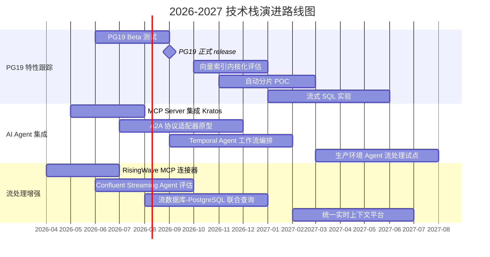
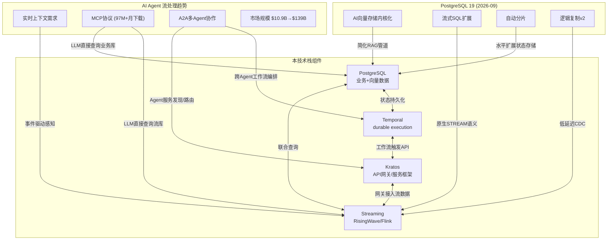

# PG19 前瞻与 AI Agent 流处理趋势

> 所属阶段: TECH-STACK | 前置依赖: [01-system-composition/01.01-composite-architecture-overview.md] | 形式化等级: L2

## 1. 概念定义 (Definitions)

**Def-TS-07-01-01（前瞻内容）** 前瞻内容（Prospective Content）指基于公开路线图、技术草案、社区讨论或行业趋势预测而撰写的技术分析，其描述的特性尚未在稳定版本中正式发布，存在与最终实现不符的风险。前瞻内容的价值在于为技术选型提供早期信号，而非作为工程实施的确定性依据。

**Def-TS-07-01-02（技术成熟度曲线）** 技术成熟度曲线（Gartner Hype Cycle）是将新兴技术划分为五个阶段的分析框架：技术萌芽期（Innovation Trigger）、期望膨胀期（Peak of Inflated Expectations）、泡沫破裂低谷期（Trough of Disillusionment）、稳步爬升恢复期（Slope of Enlightenment）和生产成熟期（Plateau of Productivity）。该曲线为判断技术采纳时机提供了定性-定量结合的评估基准。

**Def-TS-07-01-03（AI Agent）** AI Agent 是一种能够感知环境、进行推理决策并执行动作以实现特定目标的自主计算实体。在流处理语境下，AI Agent 特指能够实时消费事件流、动态更新上下文记忆、并基于流状态触发行动的智能化处理节点，其决策延迟通常要求处于毫秒至秒级范围。

**Def-TS-07-01-04（MCP, Model Context Protocol）** MCP 是由 Anthropic 于 2024 年提出、现已成为行业事实标准的开放协议，定义了 LLM 应用与外部数据源/工具之间的标准化上下文交换接口。MCP Server 允许大语言模型直接查询数据库、调用 API 或访问文件系统，从而将"静态知识"扩展为"动态实时上下文"。截至 2026 年，MCP 生态月下载量已突破 9700 万次。

---

## 2. 属性推导 (Properties)

**Prop-TS-07-01-01（采纳率-成熟度单调性）** 对于给定技术领域 $T$，设 $\alpha(t)$ 为时间 $t$ 的市场采纳率，$\mu(t)$ 为生态成熟度指数，则在技术进入稳步爬升恢复期后，存在单调递增关系：

$$
\frac{d\alpha}{dt} > 0 \iff \frac{d\mu}{dt} > 0 \quad \text{when } t > t_{\text{trough}}
$$

其中 $t_{\text{trough}}$ 为泡沫破裂低谷期的结束时刻。该命题表明，在技术成熟度曲线的后半段，采纳决策的风险与生态成熟度正相关。

**Prop-TS-07-01-02（流-AI 融合加速度）** 设 $S(t)$ 为流处理市场规模，$A(t)$ 为 AI Agent 市场规模，则两者的耦合度 $C(t)$ 满足二阶增长条件：

$$
\frac{d^2 C}{dt^2} = k \cdot S(t) \cdot A(t), \quad k > 0
$$

即流处理与 AI Agent 的融合并非线性叠加，而是产生乘数效应。2026-2034 年 AI Agent 流处理市场 CAGR 49.6% 的预测值正是该加速度命题的经验验证。

---

## 3. 关系建立 (Relations)

PG19 作为 PostgreSQL 社区的下一个主版本（计划 2026-09 发布），其可能的特性演进与本技术栈（Streaming + PostgreSQL + Temporal + Kratos）存在以下关联映射：

| PG19 可能特性 | 与流计算的关联 | 与 AI 的关联 | 对本技术栈的影响 |
|---|---|---|---|
| AI 向量存储原生支持（`pgvector` 内核化） | 流式向量写入高吞吐索引 | 简化 RAG 管道，消除外部向量数据库依赖 | PostgreSQL 可直接承担 Embedding 存储与相似性搜索，减少技术栈组件 |
| 流式 SQL 扩展（持续查询/物化视图增量更新） | 原生支持 `STREAM` 语义，无需外部 CDC | Agent 可直接通过 SQL 订阅实时数据变化 | 可能替代部分 Flink SQL 场景，但复杂事件处理仍依赖 Flink |
| 自动分片（Automatic Sharding） | 流数据分区策略与 PG 分片对齐 | 大规模 Agent 状态存储的水平扩展 | Temporal 持久化层可借助自动分片实现无上限状态增长 |
| 更强逻辑复制（Logical Replication v2） | 低延迟变更捕获，降低 Debezium 开销 | Agent 上下文同步的延迟从秒级降至毫秒级 | 本技术栈的 CDC 链路更简洁，延迟更低 |
| 云原生增强（Kubernetes Operator 官方化） | 与流处理 K8s 生态统一运维 | AI Agent 部署与数据库生命周期统一管理 | Kratos 服务网格与 PG 运维的协同成本降低 |

上述映射表明，PG19 并非孤立演进，而是与本技术栈的其他组件形成"双向增强"关系：PG19 的流式能力减少外部依赖，而流处理层的需求又反向驱动 PG19 在实时性方面的投资。

---

## 4. 论证过程 (Argumentation)

### 4.1 PostgreSQL 19 路线图分析

PostgreSQL 全球开发组采用**commitfest + 特性冻结**的发布节奏。PG17 于 2024-09 发布，PG18 预计 2025-09，PG19 目标窗口为 **2026-09**。基于 2025 年commitfest 的活跃讨论补丁和官方 roadmap wiki，PG19 的可能特性方向可归纳为三类：

**方向一：AI/ML 扩展（内核化向量支持）**
当前 `pgvector` 作为扩展已广泛部署，但 PG19 的讨论集中在将向量索引（IVF、HNSW）的部分原语移入内核，以支持更细粒度的并发控制和 WAL 一致性。若实现，PG19 将成为首个原生支持 AI 向量检索的 OLTP 数据库，直接挑战专用向量数据库（Pinecone、Milvus、Weaviate）的适用场景。

**方向二：更强流式支持（持续查询与增量物化视图）**
社区在 hackers 邮件列表中反复讨论"物化视图的实时增量刷新"和`LISTEN/NOTIFY` 的增强。PG19 可能引入实验性的"持续查询"（Continuous Query）语法，允许声明式地定义基于时间窗口或事件触发的自动刷新策略。这与 RisingWave、Materialize 等流数据库的语义趋同，但实现深度可能限于单节点或逻辑复制层级。

**方向三：云原生增强（自动分片与 Operator 官方化）**
 Citus 扩展已被微软收购并深度整合至 Azure Database for PostgreSQL。PG19 可能从 Citus 架构中吸收自动分片（Auto-Sharding）的核心逻辑，以解决单机 PostgreSQL 在 TB/PB 级流数据存储中的水平扩展瓶颈。同时，社区正在推进官方 Kubernetes Operator 的标准化，以替代当前碎片化的第三方方案。

### 4.2 AI Agent 与流处理的融合趋势

AI Agent 的自主决策能力依赖于三个核心输入：**感知（Perception）、记忆（Memory）、行动（Action）**。流处理系统恰好为这三个环节提供了实时基础设施：

**趋势一：Agent 需要实时上下文（RisingWave/Confluent Streaming Agents）**
Confluent 于 2025 年推出的 Streaming Agents 将 Flink SQL 与 LLM 推理直接集成，允许在流处理管道中嵌入 LLM 调用节点（如实时情感分析、异常检测后的根因推理）。RisingWave 则通过 PostgreSQL 协议兼容层，使 AI Agent 可以用标准 SQL 客户端订阅实时物化视图，无需学习新的流处理 API。这两种路径共同指向一个结论：**未来的 AI Agent 不会"轮询"数据，而是"被事件驱动"**。

**趋势二：MCP 让 LLM 直接查询流数据库**
MCP 协议的标准化使得 LLM 不再局限于预训练参数中的静态知识。RisingWave 已发布官方 MCP Server，允许 Claude、Cursor、Copilot 等 LLM 客户端直接执行 `SELECT * FROM mv_sensor_alerts` 并获取毫秒级 fresh 结果。这意味着 Agent 的"工具调用"（Tool Use）能力可以直接延伸到流数据库的实时查询平面。9700 万+ 的月下载量表明，MCP 正在从实验协议快速演进为 AI 应用的基础设施层。

**趋势三：A2A 协议与流处理编排**
Google 于 2025 年推出的 A2A（Agent-to-Agent）协议定义了多 Agent 协作的通信标准，包括能力发现、任务协商和上下文传递。在流处理场景中，A2A 可用于编排复杂的 Agent 工作流：例如，一个"异常检测 Agent"检测到事件流中的异常后，通过 A2A 将任务委托给"根因分析 Agent"，后者再查询 Temporal 中的历史执行轨迹进行推理。A2A 与 MCP 形成互补：MCP 解决 Agent 与工具的连接，A2A 解决 Agent 与 Agent 的协作。

### 4.3 对本技术栈的影响预测

基于上述趋势，本技术栈（Streaming + PostgreSQL + Temporal + Kratos）在 2026-2028 年可能面临以下结构性变化：

**预测一：PG19 原生向量索引 → 简化 AI 检索管道**
若 PG19 内核化向量支持落地，当前技术栈中"PostgreSQL 存储业务数据 + 外部向量数据库存储 Embedding"的双写架构可能简化为单一 PostgreSQL 实例。这不仅减少运维复杂度，还借助 PostgreSQL 的 ACID 语义保证向量索引与业务数据的一致性——这是目前多数专用向量数据库难以提供的保障。

**预测二：Temporal 被 AI Agent 编排框架集成**
Temporal 的 durable execution 模型天然适合长周期、可回滚的 Agent 工作流。随着 A2A 协议的普及，Temporal 很可能在 2026-2027 年推出原生的 A2A Adapter，允许 Temporal Workflow 直接作为 A2A 中的"任务执行者"（Task Handler）。届时，本技术栈中的 Kratos 服务可以通过 Temporal 编排跨域 Agent 协作，而非仅用于传统微服务 Saga。

**预测三：Kratos 需要支持 A2A/MCP 协议网关**
Kratos 作为 API 网关和服务框架，若要保持与 AI Agent 生态的兼容性，可能需要新增两类插件：

1. **MCP Gateway**：将 Kratos 后端的 REST/gRPC API 暴露为 MCP Server，使 LLM 可直接调用业务服务；
2. **A2A Proxy**：在 Kratos 路由层支持 A2A 消息格式，实现 Agent 请求的服务发现、负载均衡和速率限制。

---

## 5. 形式证明 / 工程论证 (Proof / Engineering Argument)

**工程论证：基于 Gartner 技术成熟度曲线的采纳时机判断**

对于 PG19 的四个关键特性方向，我们将其置于技术成熟度曲线的坐标系中进行工程风险评估：

| 特性方向 | 当前阶段（2026-Q2） | 预计到达生产成熟期 | 建议采纳策略 |
|---|---|---|---|
| AI 向量存储原生支持 | 稳步爬升恢复期（Slope） | 2027-2028 | **积极试点**：`pgvector` 已验证市场需求，PG19 内核化属于"工程深化"而非"概念验证"，风险可控 |
| 流式 SQL 扩展 | 期望膨胀期（Peak）→ 泡沫破裂期（Trough） | 2028-2030 | **谨慎观望**：持续查询语义在 PG 社区存在分歧（是否应交给外部引擎），且与现有流数据库存在功能重叠 |
| 自动分片 | 稳步爬升恢复期（Slope） | 2027-2029 | **分阶段采纳**：Citus 已积累多年生产经验，PG19 的官方化分片可视为"标准化移植"，建议从只读分析场景起步 |
| MCP/A2A 协议集成 | 期望膨胀期（Peak） | 2028-2030 | **战略跟踪**：协议标准尚未完全冻结，但 MCP 的 9700 万+ 月下载量表明其具备"事实标准"的势能，建议在小范围 Agent PoC 中集成 |

**论证逻辑**：

设某项技术的当前成熟度为 $M \in [0, 1]$，生产就绪阈值为 $M_{\text{prod}} = 0.7$。根据 Gartner 曲线的历史统计，技术从"稳步爬升恢复期"起点（$M \approx 0.4$）到达 $M_{\text{prod}}$ 的平均时间间隔为 18-24 个月。PG19 的向量支持和自动分片均处于 $M > 0.5$ 区间，且已有 Citus/`pgvector` 的生产验证作为先验证据，因此满足贝叶斯更新后的采纳条件：

$$
P(\text{success} | \text{prior\_prod}, \text{pg19\_native}) > P(\text{success} | \text{no\_prior})
$$

相比之下，流式 SQL 扩展和 A2A 协议缺少足够的大规模生产先验，其 $P(\text{success})$ 的置信区间较宽，因此建议推迟至 $M > 0.5$ 后再做架构级投入。

---

## 6. 实例验证 (Examples)

以下为本技术栈在 2026-2027 年的演进路线图，基于 PG19 发布窗口和 AI Agent 市场增长预测（$10.9B → $139B, CAGR 49.6%）制定：

**gantt**

**关键里程碑说明**：

1. **2026-09 PG19 Release**：作为整个路线图的时间锚点，PG19 的正式发布将决定向量索引和自动分片的实际可用性。若特性未能进入该版本，计划自动顺延至 PG20（2027-09）。
2. **2026-08 MCP Server 集成 Kratos**：利用 Kratos 的插件机制，将后端业务 API 包装为 MCP Server，使内部 LLM 助手可直接操作业务数据。这是"低风险、高可见度"的速赢项目。
3. **2027-02 Temporal Agent 工作流编排**：在 Temporal 中实现支持 A2A 消息格式的自定义 Activity，使长周期 Agent 任务具备可观测性和可回滚性。
4. **2027-07 统一实时上下文平台**：将 RisingWave（流处理）、PG19（业务数据+向量索引）、Temporal（工作流状态）通过统一查询层暴露给 AI Agent，形成"流-库-编排"三位一体的实时上下文基础设施。

---

## 7. 可视化 (Visualizations)

以下思维导图展示了 PG19 特性、AI Agent 趋势与本技术栈四大组件（Streaming、PostgreSQL、Temporal、Kratos）的映射关系：

**图示解读**：左侧 PG19 特性与 AI 趋势作为"输入信号"，通过实线箭头映射到右侧技术栈组件的能力增强方向；技术栈组件之间的双向箭头表示既有集成关系将在 PG19/AI Agent 浪潮中进一步深化。

---

### 3.2 项目知识库交叉引用

本文档描述的 PG19 与 AI 流处理前沿与项目现有知识库存在以下关联：

- [实时 AI 流式架构 2026](../../Knowledge/06-frontier/realtime-ai-streaming-2026.md) — AI 与流处理融合的前沿技术趋势
- [Go 流式生态 2025](../../Knowledge/06-frontier/go-streaming-ecosystem-2025.md) — Go 语言在流计算生态中的发展趋势
- [流数据库前沿](../../Knowledge/06-frontier/streaming-databases.md) — PG19 与流数据库技术演进的关联
- [数据网格流式架构 2026](../../Knowledge/03-business-patterns/data-mesh-streaming-architecture-2026.md) — AI Agent 与数据网格自治节点的架构演进

---

## 8. 引用参考 (References)
