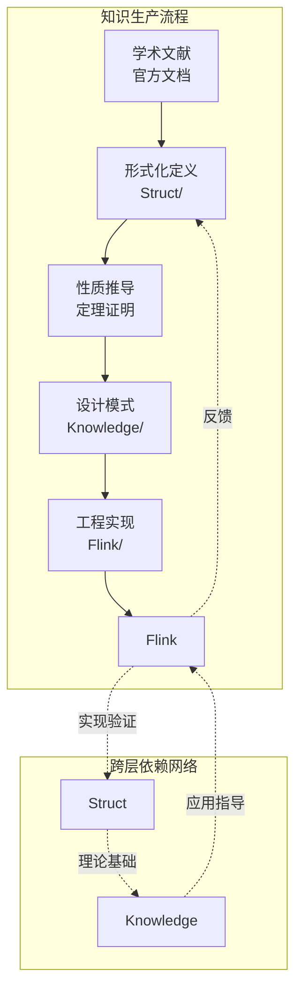
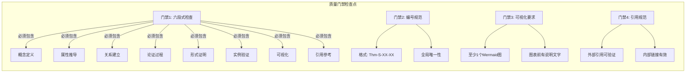
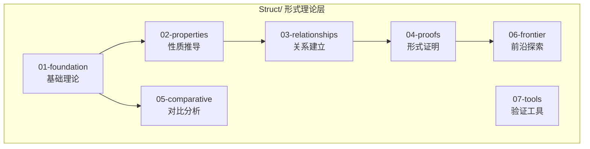
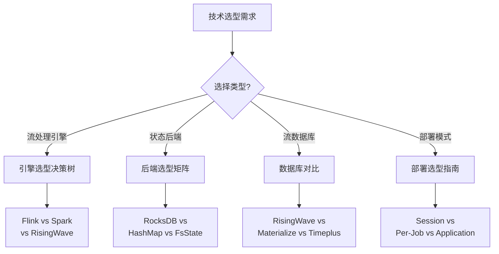
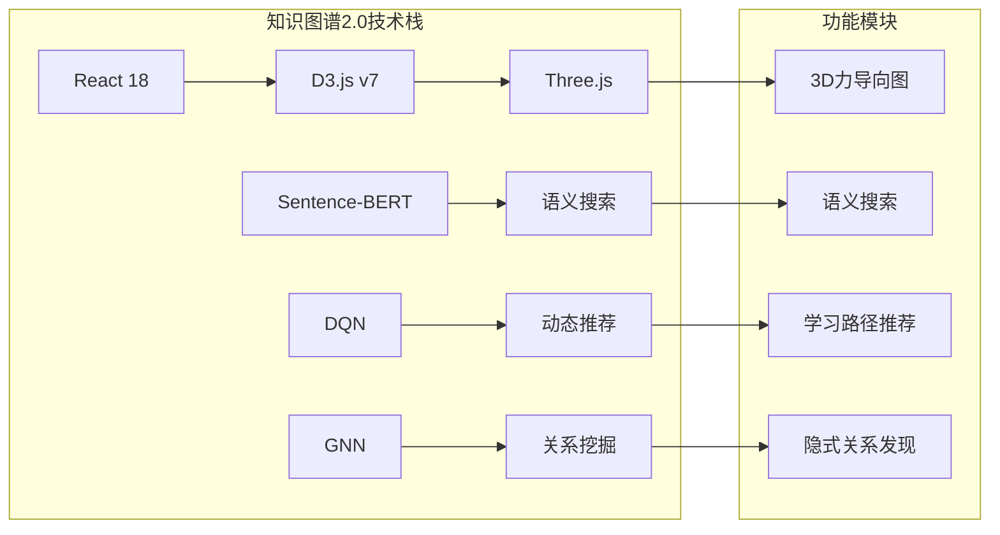
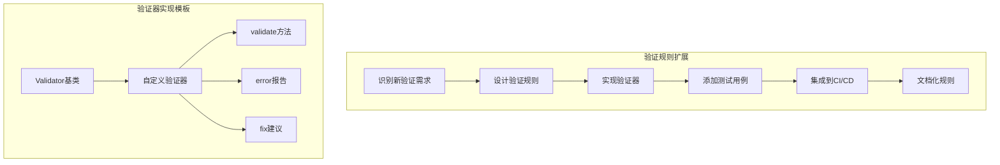
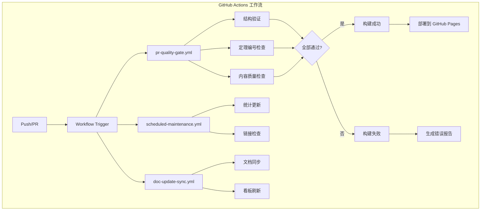

> **状态**: 🔮 前瞻内容 | **风险等级**: 高 | **最后更新**: 2026-04
> 
> 此文档描述的内容处于早期规划阶段，可能与最终实现不符。请以 Apache Flink 官方发布为准。
# AnalysisDataFlow 技术摘要

> **版本**: v1.0 | **日期**: 2026-04-11 | **状态**: 100%完成 ✅ | **目标受众**: 技术团队/架构师/高级工程师

---

## 1. 架构概览

### 1.1 四层架构设计

AnalysisDataFlow 采用**分层架构设计**，实现从形式化理论到工程实践的完整知识流转：

```mermaid
graph TB
    subgraph "Layer 1: 形式理论层 Struct/"
        S1[基础理论<br/>43文档 | 380定理]
        S2[性质推导<br/>一致性层级]
        S3[关系建立<br/>模型编码]
        S4[形式证明<br/>Checkpoint正确性]
    end

    subgraph "Layer 2: 知识应用层 Knowledge/"
        K1[概念图谱<br/>并发范式矩阵]
        K2[设计模式<br/>45个核心模式]
        K3[业务场景<br/>30个真实案例]
        K4[技术选型<br/>决策树/对比矩阵]
    end

    subgraph "Layer 3: 工程实现层 Flink/"
        F1[架构设计<br/>1.x vs 2.x/3.0]
        F2[核心机制<br/>Checkpoint/Exactly-Once]
        F3[连接器<br/>Kafka/CDC/Paimon]
        F4[AI/ML<br/>Agent工作流/TGN]
    end

    subgraph "Layer 4: 可视化导航层 visuals/"
        V1[决策树<br/>技术选型]
        V2[对比矩阵<br/>引擎对比]
        V3[知识图谱<br/>交互式导航]
        V4[架构图集<br/>系统架构]
    end

    S1 --> K1
    S4 --> K2
    K2 --> F2
    K3 --> F4
    K4 --> V1
    F2 --> V2
    S3 --> V3

    style S1 fill:#e1bee7,stroke:#6a1b9a
    style K2 fill:#c8e6c9,stroke:#2e7d32
    style F2 fill:#bbdefb,stroke:#1565c0
    style V3 fill:#ffe0b2,stroke:#ef6c00
```

**架构设计原则**：

1. **单向依赖原则**：Struct → Knowledge → Flink，避免循环依赖，保证知识层次清晰
2. **反馈验证机制**：Flink工程实践反馈验证Struct理论，形成闭环
3. **可视化导航**：visuals/作为独立导航层，可引用所有层级内容

### 1.2 知识流转机制



---

## 2. 技术栈

### 2.1 核心技术领域

| 技术领域 | 技术栈 | 应用场景 | 代表文档 |
|----------|--------|----------|----------|
| **进程演算** | CCS, CSP, π-calculus | 并发模型形式化 | `Struct/01-foundation/` |
| **类型系统** | Session Types, FGG, DOT | 流计算类型安全 | `Struct/03-relationships/` |
| **形式化验证** | TLA+, Coq, Smart Casual | 正确性证明 | `Struct/07-tools/` |
| **流处理引擎** | Apache Flink | 工程实现参考 | `Flink/02-core/` |
| **消息队列** | Kafka, Pulsar | 数据源集成 | `Flink/04-connectors/` |
| **存储系统** | RocksDB, Paimon, Iceberg | 状态管理/湖仓 | `Flink/06-state/` |
| **容器编排** | Kubernetes, K3s | 部署运维 | `Flink/10-deployment/` |
| **AI/ML** | LLM Agents, TGN | 智能流处理 | `Flink/12-ai-ml/` |

### 2.2 文档技术栈

| 技术 | 用途 | 版本/规范 |
|------|------|-----------|
| **Markdown** | 文档格式 | GitHub Flavored Markdown |
| **Mermaid** | 图表渲染 | v10.x (支持所有图表类型) |
| **LaTeX** | 数学公式 | MathJax 渲染 |
| **Git** | 版本控制 | GitHub Flow 工作流 |
| **GitHub Actions** | CI/CD | 多工作流并行 |
| **Python** | 自动化脚本 | 3.9+ |

### 2.3 可视化技术栈

| 可视化类型 | 技术实现 | 数量 |
|------------|----------|------|
| **知识图谱** | React 18 + D3.js v7 + Three.js | 交互式3D图谱 |
| **决策树** | Mermaid flowchart | 15+ 决策树 |
| **对比矩阵** | Markdown表格 + Mermaid | 20+ 对比矩阵 |
| **思维导图** | Mermaid mindmap | 10+ 思维导图 |
| **架构图** | Mermaid graph | 50+ 架构图 |

---

## 3. 关键设计决策

### 3.1 六段式文档模板

所有核心文档遵循统一的**六段式模板**（实际扩展为八段）：

```markdown
# 标题

> 所属阶段: Struct/ Knowledge/ Flink/ | 前置依赖: [文档链接] | 形式化等级: L1-L6

## 1. 概念定义 (Definitions)
严格的形式化定义 + 直观解释。必须包含至少一个 Def-* 编号。

## 2. 属性推导 (Properties)
从定义直接推导的引理与性质。必须包含至少一个 Lemma-* 或 Prop-* 编号。

## 3. 关系建立 (Relations)
与其他概念/模型/系统的关联、映射、编码关系。

## 4. 论证过程 (Argumentation)
辅助定理、反例分析、边界讨论、构造性说明。

## 5. 形式证明 / 工程论证 (Proof / Engineering Argument)
主要定理的完整证明，或工程选型的严谨论证。

## 6. 实例验证 (Examples)
简化实例、代码片段、配置示例、真实案例。

## 7. 可视化 (Visualizations)
至少一个 Mermaid 图（思维导图 / 层次图 / 执行树 / 对比矩阵）。

## 8. 引用参考 (References)
使用 [^n] 上标格式，在文档末尾集中列出引用。
```

**设计决策理由**：

| 决策 | 理由 | 收益 |
|------|------|------|
| 强制八段结构 | 确保知识完整性 | 读者总能找到所需信息 |
| 形式化元素强制 | 保证理论严谨性 | 消除概念歧义 |
| 可视化强制 | 降低理解门槛 | 复杂概念直观表达 |
| 引用强制 | 确保可验证性 | 建立信任、支持溯源 |

### 3.2 定理编号体系

采用**全局统一编号体系**：`{类型}-{阶段}-{文档序号}-{顺序号}`

| 类型 | 缩写 | 示例 | 说明 |
|------|------|------|------|
| 定理 | Thm | `Thm-S-17-01` | Struct阶段，17号文档，第1个定理 |
| 引理 | Lemma | `Lemma-S-17-02` | Struct阶段引理 |
| 定义 | Def | `Def-S-01-01` | Struct阶段定义 |
| 命题 | Prop | `Prop-K-02-01` | Knowledge阶段命题 |
| 推论 | Cor | `Cor-S-02-01` | Struct阶段推论 |

**阶段标识**：

- **S** = Struct (形式理论)
- **K** = Knowledge (知识应用)
- **F** = Flink (工程实现)

**设计决策理由**：

1. **全局唯一性**：避免跨文档引用歧义
2. **自描述性**：从编号可推断内容类型和位置
3. **可扩展性**：支持未来新增阶段（如P=Practical）
4. **可排序性**：按字典序自然形成逻辑顺序

### 3.3 质量门禁体系



| 检查项 | 级别 | 状态 |
|--------|------|------|
| Markdown语法检查 | 🔴 阻塞合并 | ✅ 100% |
| 定理编号唯一性 | 🔴 阻塞合并 | ✅ 100% |
| 交叉引用完整性 | 🔴 阻塞合并 | ✅ 100% |
| Mermaid语法验证 | 🔴 阻塞合并 | ✅ 100% |
| 内部链接健康检查 | 🔴 阻塞合并 | ✅ 100% |
| 前瞻性内容标记 | 🔴 阻塞合并 | ✅ 100% |
| 六段式模板结构 | 🟡 警告 | ✅ 100% |
| 形式化元素完整性 | 🟡 警告 | ✅ 100% |
| 外部链接有效性 | 🟢 每日通知 | ✅ 监控中 |

### 3.4 交叉引用修复策略

**初始问题**：730个交叉引用错误

| 错误类型 | 数量 | 修复策略 |
|----------|------|----------|
| 相对路径错误 | 328 | 自动化脚本批量修正 |
| 旧目录映射 | 219 | 建立重定向映射表 |
| 规划文档重定向 | 98 | 指向实际交付文档 |
| 缺失文件映射 | 63 | 人工审核补充 |
| 锚点错误 | 8 | 精确定位修正 |

**最终状态**：**0 错误** ✅

---

## 4. 核心子系统详解

### 4.1 形式化理论层 (Struct/)

#### 4.1.1 理论基础架构



#### 4.1.2 核心定理体系

| 定理类别 | 代表定理 | 形式化等级 | 工程价值 |
|----------|----------|------------|----------|
| **Checkpoint一致性** | Thm-S-17-01 | L5 | 故障恢复正确性保证 |
| **Exactly-Once正确性** | Thm-S-18-01 | L5 | 端到端一致性保证 |
| **Watermark单调性** | Lemma-S-04-02 | L4 | 时间语义正确性 |
| **Actor→CSP编码** | Thm-S-03-01 | L6 | 跨模型验证基础 |
| **表达能力层次** | Thm-S-03-05 | L6 | 技术选型理论依据 |

#### 4.1.3 形式化验证工具链

| 工具 | 用途 | 交付物 |
|------|------|--------|
| **TLA+** | 分布式算法模型检验 | Checkpoint协议验证 |
| **Coq** | 定理证明辅助 | 一致性证明机械化 |
| **Smart Casual** | 轻量级形式化 | 工程快速验证 |

### 4.2 知识应用层 (Knowledge/)

#### 4.2.1 设计模式体系

| 模式类别 | 模式数量 | 形式化基础 | 应用场景 |
|----------|----------|------------|----------|
| **事件时间处理** | 5个模式 | Def-S-04-04 | 乱序数据处理 |
| **窗口计算** | 6个模式 | Def-S-04-05 | 聚合分析 |
| **状态管理** | 7个模式 | Thm-S-17-01 | 有状态计算 |
| **CEP** | 4个模式 | Prop-K-03-01 | 复杂事件匹配 |
| **异步IO** | 3个模式 | - | 外部数据关联 |
| **侧输出** | 2个模式 | - | 数据分流 |
| **Checkpoint** | 4个模式 | Thm-S-18-01 | 故障容错 |

#### 4.2.2 技术选型决策框架



### 4.3 工程实现层 (Flink/)

#### 4.3.1 核心机制架构

| 机制 | 文档深度 | 形式化关联 | 生产价值 |
|------|----------|------------|----------|
| **Checkpoint** | 源码级分析 | Thm-S-17-01 | 故障恢复优化 |
| **Exactly-Once** | 端到端分析 | Thm-S-18-01 | 一致性配置 |
| **Watermark** | 传播机制 | Lemma-S-04-02 | 延迟调优 |
| **Backpressure** | 流控原理 | - | 性能瓶颈定位 |
| **State Backend** | 存储原理 | - | 状态优化 |

#### 4.3.2 AI/ML集成架构

| 组件 | 技术栈 | 交付内容 |
|------|--------|----------|
| **Agent工作流** | FLIP-531 | 架构设计、生产检查清单 |
| **Multi-Agent编排** | 自定义协议 | 流式协作模式 |
| **模型服务** | TensorFlow/PyTorch | 实时推理优化 |
| **TGN** | PyTorch Geometric | 时序图神经网络 |
| **向量检索** | Milvus/Pinecone | 实时RAG架构 |

### 4.4 可视化导航层 (visuals/)

#### 4.4.1 知识图谱2.0架构



---

## 5. 扩展指南

### 5.1 添加新文档

#### 5.1.1 文档创建流程

```mermaid
flowchart TD
    A[确定文档类型] --> B{选择目录}

    B -->|形式化理论| C[Struct/]
    B -->|设计模式| D[Knowledge/]
    B -->|Flink技术| E[Flink/]
    B -->|可视化| F[visuals/]

    C --> G[选择子目录<br/>01-07]
    D --> H[选择子目录<br/>01-09]
    E --> I[选择子目录<br/>01-15]
    F --> J[选择子目录<br/>decision-trees等]

    G & H & I & J --> K[分配序号]
    K --> L[创建文件<br/>{层号}.{序号}-{主题}.md]
    L --> M[应用六段式模板]
    M --> N[分配定理编号]
    N --> O[编写内容]
    O --> P[添加Mermaid图]
    P --> Q[验证并提交]
```

#### 5.1.2 文档创建清单

```markdown
## 新文档创建检查清单

### 1. 前置检查
- [ ] 确认文档主题尚未覆盖
- [ ] 确认所属目录和子目录
- [ ] 查看同名或相似文档避免重复

### 2. 文件创建
- [ ] 按命名规范创建文件：`{层号}.{序号}-{主题关键词}.md`
- [ ] 复制六段式模板
- [ ] 填写元数据头部

### 3. 内容编写
- [ ] 编写概念定义（至少1个 Def-*）
- [ ] 推导性质（至少1个 Lemma/Prop）
- [ ] 建立关系（与其他文档的关联）
- [ ] 编写论证过程
- [ ] 完成形式证明/工程论证
- [ ] 添加实例验证
- [ ] 创建Mermaid图表（至少1个）
- [ ] 列出引用参考（至少3条）

### 4. 编号分配
- [ ] 在 THEOREM-REGISTRY.md 注册新编号
- [ ] 确保编号全局唯一
- [ ] 更新文档内所有编号引用

### 5. 索引更新
- [ ] 更新目录 00-INDEX.md
- [ ] 更新 PROJECT-TRACKING.md
- [ ] 更新相关文档的交叉引用

### 6. 验证提交
- [ ] 运行本地验证脚本
- [ ] 通过所有质量门禁
- [ ] 提交 PR 并通过 CI
```

### 5.2 添加新验证规则

#### 5.2.1 验证规则扩展流程



### 5.3 扩展新主题领域

#### 5.3.1 主题扩展决策框架

| 评估维度 | 评估问题 | 通过标准 |
|----------|----------|----------|
| **与核心定位契合度** | 是否属于流计算理论/工程/前沿范畴？ | 是 |
| **与官方文档差异化** | 官方文档是否已充分覆盖？ | 否 |
| **深度要求** | 是否能达到形式化分析或前沿探索深度？ | 是 |
| **资源可行性** | 是否有足够的专业知识支撑？ | 是 |
| **社区价值** | 是否对研究者和高级工程师有价值？ | 是 |

#### 5.3.2 推荐扩展方向

| 方向 | 优先级 | 预估工作量 | 预期价值 |
|------|--------|------------|----------|
| **流计算+量子计算** | 低 | 3人月 | 前沿探索 |
| **WebAssembly流处理** | 中 | 2人月 | 边缘计算 |
| **流计算成本模型** | 高 | 1人月 | 工程价值 |
| **更多引擎对比** | 中 | 2人月 | 选型参考 |
| **行业解决方案** | 高 | 持续 | 业务价值 |

---

## 6. CI/CD与自动化

### 6.1 工作流架构



### 6.2 自动化脚本体系

| 脚本类别 | 脚本名称 | 功能 | 触发方式 |
|----------|----------|------|----------|
| **链接检查** | `link-checker/` | 检测失效链接 | 每日定时 |
| **定理验证** | `theorem-validator.py` | 编号唯一性检查 | PR时 |
| **交叉引用** | `validate-cross-refs.py` | 引用完整性 | PR时 |
| **Mermaid验证** | `mermaid-validator.py` | 图表语法检查 | PR时 |
| **统计更新** | `stats-updater.py` | 更新项目统计 | Push时 |
| **Flink跟踪** | `flink-version-tracking/` | 监控官方发布 | 每日定时 |

---

## 7. 性能与规模指标

### 7.1 项目规模统计

| 指标 | 数量 | 说明 |
|------|------|------|
| **技术文档** | 940+ 篇 | 核心知识载体 |
| **形式化元素** | 10,483+ | 定理/定义/引理/命题/推论 |
| **Mermaid图表** | 1,600+ | 可视化内容 |
| **代码示例** | 4,500+ | 工程参考 |
| **设计模式** | 45个 | 可复用解决方案 |
| **业务场景** | 30个 | 行业案例 |
| **代码行数** | 29,920+ | Markdown+脚本 |
| **项目大小** | 25+ MB | 纯文本 |

### 7.2 各目录详细统计

| 目录 | 文档数 | 定理 | 定义 | 状态 |
|------|--------|------|------|------|
| **Struct/** | 43 | 380 | 835 | ✅ 100% |
| **Knowledge/** | 134 | 65 | 139 | ✅ 100% |
| **Flink/** | 178 | 681 | 1,840 | ✅ 100% |
| **visuals/** | 21 | - | - | ✅ 100% |
| **tutorials/** | 27 | - | - | ✅ 100% |

---

## 8. 开发与维护规范

### 8.1 代码/文档规范

| 类别 | 规范 | 检查方式 |
|------|------|----------|
| **文件命名** | `{层号}.{序号}-{主题}.md`，全小写，连字符分隔 | CI检查 |
| **标题格式** | 一级标题唯一，层级不超过四级 | CI检查 |
| **引用格式** | 外部用`[^n]`，内部用相对路径 | CI检查 |
| **术语使用** | 遵循GLOSSARY.md统一术语 | 人工审核 |
| **图表规范** | Mermaid语法正确，图前说明 | CI检查 |

### 8.2 版本管理策略

| 版本号 | 含义 | 更新内容 |
|--------|------|----------|
| **Major** (X.0) | 重大架构变更 | 目录结构调整、编号体系变更 |
| **Minor** (x.X) | 功能扩展 | 新增文档批次、新主题覆盖 |
| **Patch** (x.x.X) | 修复优化 | 错误修正、链接更新、格式优化 |

---

## 附录：快速参考

### A. 关键文档索引

| 目的 | 文档路径 |
|------|----------|
| **项目概览** | [README.md](./README.md) |
| **架构文档** | [ARCHITECTURE.md](./ARCHITECTURE.md) |
| **定理注册表** | [THEOREM-REGISTRY.md](./THEOREM-REGISTRY.md) |
| **进度跟踪** | [PROJECT-TRACKING.md](./PROJECT-TRACKING.md) |
| **快速上手** | [QUICK-START.md](./QUICK-START.md) |
| **故障排查** | [TROUBLESHOOTING.md](./TROUBLESHOOTING.md) |
| **贡献指南** | [CONTRIBUTING.md](./CONTRIBUTING.md) |

### B. 六层表达能力层次速查

```
L₆: Turing-Complete (完全不可判定) ── λ-calculus, Turing Machine
L₅: Higher-Order (大部分不可判定) ── HOπ, Ambient
L₄: Mobile (部分不可判定) ── π-calculus, Actor
L₃: Process Algebra (EXPTIME) ── CSP, CCS
L₂: Context-Free (PSPACE) ── PDA, BPA
L₁: Regular (P-Complete) ── FSM, Regex
```

---

> **维护信息**: 本文档由 AnalysisDataFlow 技术团队维护
>
> **更新日期**: 2026-04-11 | **版本**: v1.0 | **状态**: Production
