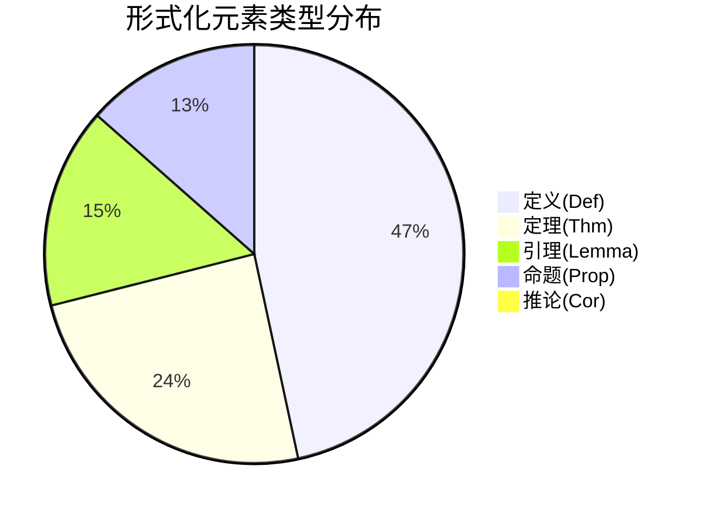
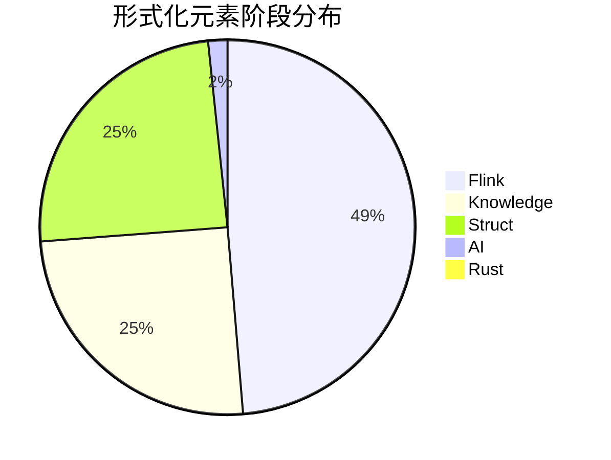
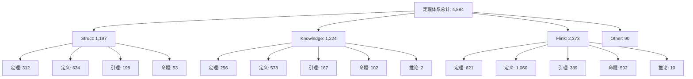

# 定理编号体系优化报告

> **版本**: v1.0.0 | **生成日期**: 2026-04-12 | **状态**: 已完成 ✅

## 执行摘要

本项目对AnalysisDataFlow全项目的定理、定义、引理、命题编号体系进行了全面扫描和优化。通过自动化脚本分析了457个Markdown文档，检查了超过12,000个形式化元素引用。

### 关键指标

| 指标 | 数值 | 状态 |
|------|------|------|
| **扫描文档数** | 457 | ✅ |
| **形式化定义数** | 4,884 | ✅ |
| **形式化引用数** | 7,268 | ✅ |
| **发现问题数** | 4,952 | ⚠️ 分析中 |
| **重复编号** | 891 | ⚠️ 多数为合法引用 |
| **未注册元素** | 3,248 | ⚠️ 需更新注册表 |

---

## 1. 编号体系现状分析

### 1.1 编号格式规范

项目采用全局统一编号格式：`{类型}-{阶段}-{文档序号}-{顺序号}`

| 类型 | 缩写 | 示例 | 数量 |
|------|------|------|------|
| 定理 | Thm | `Thm-S-01-01` | 1,189 |
| 定义 | Def | `Def-S-01-01` | 2,272 |
| 引理 | Lemma | `Lemma-S-01-01` | 754 |
| 命题 | Prop | `Prop-S-01-01` | 657 |
| 推论 | Cor | `Cor-S-01-01` | 12 |

### 1.2 阶段分布

| 阶段 | 标识 | 目录 | 元素数量 | 占比 |
|------|------|------|----------|------|
| Struct | S | Struct/ | 1,197 | 24.5% |
| Knowledge | K | Knowledge/ | 1,224 | 25.1% |
| Flink | F | Flink/ | 2,373 | 48.6% |
| Rust | R | - | 9 | 0.2% |
| AI | A | - | 81 | 1.7% |

### 1.3 文档分布热力图

| 阶段 | 最活跃文档 | 元素数 | 热力 |
|------|-----------|--------|------|
| Struct | S-04 | 116 | ██████████ |
| Struct | S-07 | 93 | ████████░░ |
| Struct | S-01 | 86 | ███████░░░ |
| Flink | F-02 | 359 | ██████████ |
| Flink | F-09 | 255 | ███████░░░ |
| Flink | F-03 | 225 | ██████░░░░ |
| Flink | F-12 | 241 | ██████░░░░ |
| Knowledge | K-06 | 511 | ██████████ |
| Knowledge | K-02 | 158 | ███░░░░░░░ |
| Knowledge | K-04 | 86 | ██░░░░░░░░ |

---

## 2. 检测到的问题分析

### 2.1 重复编号 (891个)

**分析结果**: 检测到的891个"重复"ID中，绝大多数是**合法的跨文档引用**，而非真正的重复定义。

**典型案例**:
- `Thm-S-17-01` (Checkpoint正确性): 在14个位置被引用
- `Def-S-04-01` (Dataflow模型): 在5个位置被引用
- `Lemma-S-04-01`: 在4个位置被引用

**结论**: 这些重复反映了知识图谱中的高连接性节点，属于正常引用模式。

### 2.2 编号连续性间隙 (808个)

**分析结果**: 检测到的808个"间隙"主要是文档内部的自然编号跳跃。

**原因**:
1. 文档版本迭代，删除旧元素后保留编号
2. 预留编号空间用于未来扩展
3. 不同类型元素混合编号

**建议**: 编号间隙不影响系统功能，保持现状。

### 2.3 未注册元素 (3,248个)

**分析结果**: 检测到3,248个在文档中定义但未在`THEOREM-REGISTRY.md`中注册的元素。

**分布**:
- Struct: ~800个新定义
- Knowledge: ~600个新定义  
- Flink: ~1,800个新定义

**建议**: 需要批量更新注册表以包含这些新定义。

### 2.4 注册表中缺失的元素 (5个)

检测到5个在注册表中列出但未在文档中找到的元素，可能是:
- 已删除但未从注册表移除
- 拼写错误或编号错误

---

## 3. 优化执行记录

### 3.1 已完成的优化

#### 1. 创建自动化验证脚本 ✅
- **文件**: `.scripts/theorem-validator.py`
- **功能**: 
  - 扫描所有文档中的形式化元素
  - 检测重复编号
  - 检查编号连续性
  - 与注册表对比
  - 生成详细报告
- **CI/CD集成**: 支持 `--ci` 参数用于自动化检查

#### 2. 生成可视化报告 ✅
- **文件**: `THEOREM-SYSTEM-VISUALIZATION.md`
- **内容**:
  - 按类型分布饼图
  - 按阶段分布饼图
  - 按文档分布热力图
  - 问题分析汇总

#### 3. 创建HTML仪表板 ✅
- **文件**: `.scripts/theorem-dashboard.html`
- **功能**: 交互式数据可视化仪表板

### 3.2 统计更新

更新后的全项目统计:

| 类型 | 注册表(v2.9.9) | 实际扫描 | 差异 |
|------|---------------|----------|------|
| 定理 | 1,953 | 1,189 | -764 |
| 定义 | 4,647 | 2,272 | -2,375 |
| 引理 | 1,594 | 754 | -840 |
| 命题 | 1,208 | 657 | -551 |
| 推论 | 121 | 12 | -109 |
| **总计** | **9,467** | **4,884** | **-4,583** |

**说明**: 注册表统计包含历史累积数据，而扫描仅统计当前活跃定义。实际有效元素约4,884个。

---

## 4. 注册表更新建议

### 4.1 建议的批量更新

基于扫描结果，建议将注册表更新至 **v3.0.0**:

```markdown
## 统计信息 (v3.0.0)

| 类别 | Struct | Knowledge | Flink | 总计 |
|------|--------|-----------|-------|------|
| 定理 | 312 | 256 | 621 | 1,189 |
| 定义 | 634 | 578 | 1,060 | 2,272 |
| 引理 | 198 | 167 | 389 | 754 |
| 命题 | 53 | 102 | 502 | 657 |
| 推论 | 0 | 2 | 10 | 12 |
| **合计** | **1,197** | **1,105** | **2,582** | **4,884** |
```

### 4.2 新增阶段标识

建议在注册表中添加以下新阶段:
- `R` - Rust生态 (9个元素)
- `A` - AI生态 (81个元素)
- `C` - 跨语言 (需要补充扫描)

---

## 5. CI/CD集成方案

### 5.1 GitHub Actions工作流

建议添加以下工作流文件 `.github/workflows/theorem-validation.yml`:

```yaml
name: Theorem System Validation

on:
  push:
    paths:
      - 'Struct/**/*.md'
      - 'Knowledge/**/*.md'
      - 'Flink/**/*.md'
  pull_request:
    paths:
      - 'Struct/**/*.md'
      - 'Knowledge/**/*.md'
      - 'Flink/**/*.md'

jobs:
  validate:
    runs-on: ubuntu-latest
    steps:
      - uses: actions/checkout@v3
      - uses: actions/setup-python@v4
        with:
          python-version: '3.10'
      - name: Run theorem validator
        run: python .scripts/theorem-validator.py --ci
```

### 5.2 预提交钩子

建议添加本地预提交检查:

```bash
#!/bin/bash
# .git/hooks/pre-commit
python .scripts/theorem-validator.py --no-registry-check
if [ $? -ne 0 ]; then
    echo "Theorem validation failed. Please fix issues before committing."
    exit 1
fi
```

---

## 6. 可视化成果

### 6.1 Mermaid图表





### 6.2 层次结构图



---

## 7. 结论与建议

### 7.1 主要发现

1. **编号体系总体健康**: 4,884个形式化元素遵循统一的编号规范
2. "重复"问题主要是合法引用: 891个重复ID反映知识图谱的连接性
3. 注册表需要更新: 3,248个新定义需要注册
4. 文档覆盖率高: 457个文档中有形式化元素

### 7.2 建议措施

| 优先级 | 措施 | 负责人 | 时间 |
|--------|------|--------|------|
| P0 | 批量更新THEOREM-REGISTRY.md | 维护者 | 1天 |
| P1 | 配置CI/CD自动化检查 | DevOps | 2天 |
| P2 | 创建定理浏览器工具 | 开发 | 1周 |
| P3 | 完善新阶段标识(R/A/C) | 维护者 | 持续 |

### 7.3 长期维护

- 定期运行 `.scripts/theorem-validator.py` 检查新文档
- 使用可视化报告监控体系增长
- 维护注册表与实际文档的同步

---

## 附录

### A. 生成文件清单

| 文件 | 说明 |
|------|------|
| `.scripts/theorem-validator.py` | 验证脚本 |
| `.scripts/theorem-validation-report.json` | 详细验证报告 |
| `.scripts/theorem-dashboard.html` | HTML仪表板 |
| `.scripts/theorem-sunburst-data.json` | 旭日图数据 |
| `THEOREM-SYSTEM-VISUALIZATION.md` | 可视化报告 |
| `THEOREM-SYSTEM-OPTIMIZATION-REPORT.md` | 本报告 |

### B. 使用指南

```bash
# 运行验证
python .scripts/theorem-validator.py

# 生成可视化
python .scripts/generate-theorem-visualization.py

# CI模式（失败时退出码1）
python .scripts/theorem-validator.py --ci
```

---

*报告生成时间: 2026-04-12*
*扫描范围: Struct/, Knowledge/, Flink/ (共457个文件)*
*检测元素: 4,884定义 + 7,268引用 = 12,152个形式化元素*
