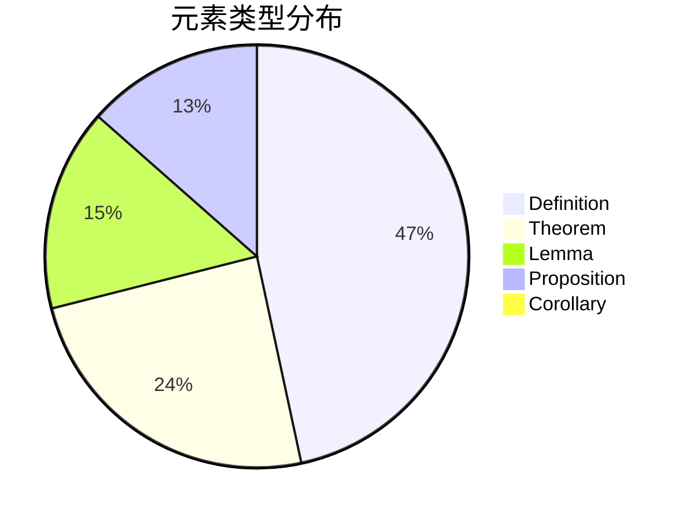
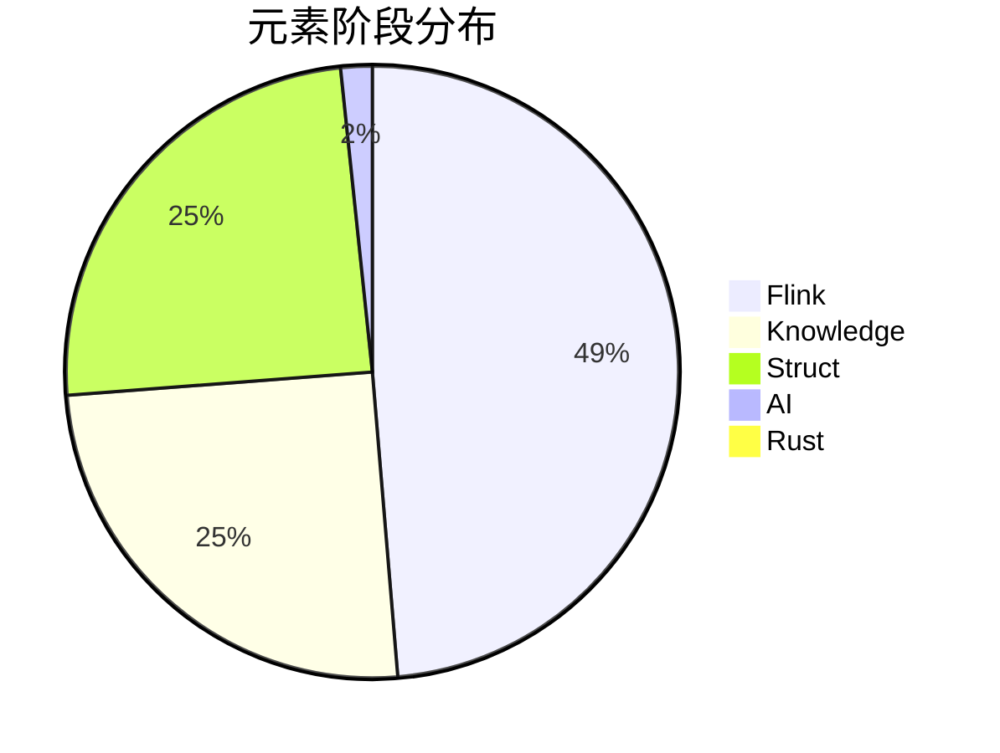

# 定理体系可视化报告

> 生成时间: 2026-04-12 22:47:30

## 1. 总体统计

| 指标 | 数值 |
|------|------|
| 总定义数 | 4,884 |
| 总引用数 | 7,268 |
| 扫描文件数 | 457 |
| 重复编号 | 891 |
| 未注册元素 | 3248 |

## 2. 按类型分布

## 3. 按阶段分布

## 4. 按文档分布热力图

| Stage | Document | Count | Heat |
|-------|----------|-------|------|
| AI | A-01 | 50 | ██████████ |
| AI | A-02 | 31 | ██████░░░░ |
| Flink | F-01 | 39 | █░░░░░░░░░ |
| Flink | F-02 | 359 | ██████████ |
| Flink | F-03 | 225 | ██████░░░░ |
| Flink | F-04 | 194 | █████░░░░░ |
| Flink | F-05 | 38 | █░░░░░░░░░ |
| Flink | F-06 | 133 | ███░░░░░░░ |
| Flink | F-07 | 131 | ███░░░░░░░ |
| Flink | F-07-05 | 9 | ░░░░░░░░░░ |
| Flink | F-07-06 | 7 | ░░░░░░░░░░ |
| Flink | F-08 | 142 | ███░░░░░░░ |
| Flink | F-09 | 255 | ███████░░░ |
| Flink | F-09-03 | 24 | ░░░░░░░░░░ |
| Flink | F-09-05 | 40 | █░░░░░░░░░ |
| Flink | F-09-06 | 18 | ░░░░░░░░░░ |
| Flink | F-10 | 182 | █████░░░░░ |
| Flink | F-10-04 | 14 | ░░░░░░░░░░ |
| Flink | F-11 | 22 | ░░░░░░░░░░ |
| Flink | F-12 | 241 | ██████░░░░ |
| Flink | F-13 | 92 | ██░░░░░░░░ |
| Flink | F-14 | 103 | ██░░░░░░░░ |
| Flink | F-15 | 105 | ██░░░░░░░░ |
| Knowledge | K-01 | 73 | █░░░░░░░░░ |
| Knowledge | K-02 | 158 | ███░░░░░░░ |
| Knowledge | K-02-07 | 8 | ░░░░░░░░░░ |
| Knowledge | K-03 | 83 | █░░░░░░░░░ |
| Knowledge | K-04 | 86 | █░░░░░░░░░ |
| Knowledge | K-05 | 77 | █░░░░░░░░░ |
| Knowledge | K-05-01 | 7 | ░░░░░░░░░░ |
| Knowledge | K-05-02 | 7 | ░░░░░░░░░░ |
| Knowledge | K-05-03 | 8 | ░░░░░░░░░░ |
| Knowledge | K-05-04 | 7 | ░░░░░░░░░░ |
| Knowledge | K-05-05 | 8 | ░░░░░░░░░░ |
| Knowledge | K-05-13 | 8 | ░░░░░░░░░░ |
| Knowledge | K-06 | 511 | ██████████ |
| Knowledge | K-07 | 9 | ░░░░░░░░░░ |
| Knowledge | K-08 | 28 | ░░░░░░░░░░ |
| Knowledge | K-10 | 43 | ░░░░░░░░░░ |
| Knowledge | K-10-01 | 7 | ░░░░░░░░░░ |
| Knowledge | K-10-02 | 6 | ░░░░░░░░░░ |
| Knowledge | K-10-03 | 5 | ░░░░░░░░░░ |
| Knowledge | K-10-04 | 15 | ░░░░░░░░░░ |
| Knowledge | K-10-05 | 13 | ░░░░░░░░░░ |
| Knowledge | K-10-06 | 5 | ░░░░░░░░░░ |
| Knowledge | K-10-07 | 13 | ░░░░░░░░░░ |
| Knowledge | K-10-08 | 11 | ░░░░░░░░░░ |
| Knowledge | K-10-09 | 1 | ░░░░░░░░░░ |
| Knowledge | K-10-13 | 13 | ░░░░░░░░░░ |
| Knowledge | K-10-34 | 8 | ░░░░░░░░░░ |
| Knowledge | K-10-35 | 6 | ░░░░░░░░░░ |
| Rust | R-02 | 9 | ██████████ |
| Struct | S-01 | 86 | ███████░░░ |
| Struct | S-02 | 76 | ██████░░░░ |
| Struct | S-02-08 | 1 | ░░░░░░░░░░ |
| Struct | S-03 | 53 | ████░░░░░░ |
| Struct | S-04 | 116 | ██████████ |
| Struct | S-05 | 19 | █░░░░░░░░░ |
| Struct | S-05-04 | 7 | ░░░░░░░░░░ |
| Struct | S-06 | 49 | ████░░░░░░ |
| Struct | S-07 | 93 | ████████░░ |
| Struct | S-08 | 72 | ██████░░░░ |
| Struct | S-09 | 35 | ███░░░░░░░ |
| Struct | S-10 | 9 | ░░░░░░░░░░ |
| Struct | S-11 | 2 | ░░░░░░░░░░ |
| Struct | S-12 | 38 | ███░░░░░░░ |
| Struct | S-13 | 45 | ███░░░░░░░ |
| Struct | S-14 | 34 | ██░░░░░░░░ |
| Struct | S-15 | 66 | █████░░░░░ |
| Struct | S-16 | 45 | ███░░░░░░░ |
| Struct | S-17 | 70 | ██████░░░░ |
| Struct | S-18 | 46 | ███░░░░░░░ |
| Struct | S-19 | 18 | █░░░░░░░░░ |
| Struct | S-20 | 57 | ████░░░░░░ |
| Struct | S-21 | 20 | █░░░░░░░░░ |
| Struct | S-22 | 18 | █░░░░░░░░░ |
| Struct | S-23 | 28 | ██░░░░░░░░ |
| Struct | S-24 | 29 | ██░░░░░░░░ |
| Struct | S-25 | 19 | █░░░░░░░░░ |
| Struct | S-26 | 33 | ██░░░░░░░░ |
| Struct | S-29 | 13 | █░░░░░░░░░ |

## 5. 问题分析

### 5.1 重复编号

检测到 **891** 个重复ID。这些可能是：

- 合法的跨文档引用
- 需要修复的重复定义

### 5.2 未注册元素

检测到 **3248** 个在文档中定义但未在THEOREM-REGISTRY.md中注册的元素。

## 6. 改进建议

1. **规范化编号体系**: 确保每个定义有唯一的全局ID
2. **更新注册表**: 将未注册元素添加到THEOREM-REGISTRY.md
3. **CI/CD集成**: 使用theorem-validator.py在提交前自动检查

---

*此报告由 theorem-validator.py 自动生成*
