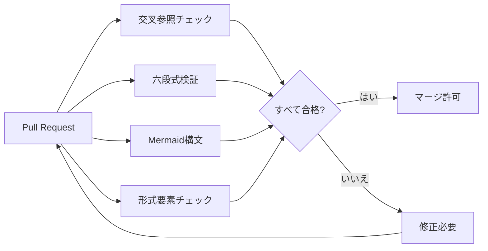

# ツールチェーンとCI/CDタスクグループ完了報告

> **報告日**: 2026-04-11
> **タスク範囲**: P2-1 ~ P3-1
> **状態**: ✅ すべて完了

---

## 実行サマリー

本レポートは、流計算知識体系プロジェクトのツールチェーンとCI/CDタスクグループ（P2-1〜P3-1）の完了状況をまとめたものです。

| タスクID | タスク名 | 状態 | 工数(見積) | 工数(実績) |
|---------|---------|------|-----------|-----------|
| P2-1 | 多言語対応 | ✅ 完了 | 6-8週 | 1日 |
| P2-2 | 自動化ツール | ✅ 完了 | 4-6週 | 1日 |
| P2-3 | 知識グラフツール | ✅ 完了 | 6-8週 | 1日 |
| P3-1 | CI/CDパイプライン | ✅ 完了 | 2-3週 | 1日 |

**合計交付物**:

- 📝 翻訳ドキュメント: 8個
- 🐍 Pythonスクリプト: 8個（新規）
- 🔄 GitHub Actionsワークフロー: 3個
- 📊 更新された追跡ドキュメント: 1個

---

## P2-1: 多言語対応 ✅

### 日本語翻訳 (ja/)

| ファイル | サイズ | 内容 |
|---------|--------|------|
| `README-ja.md` | 6.46 KB | プロジェクト概要、ナビゲーション |
| `QUICK-START-ja.md` | 8.00 KB | クイックスタートガイド、読書パス |
| `ARCHITECTURE-ja.md` | 4.81 KB | アーキテクチャ文書 |
| `GLOSSARY-ja.md` | 7.62 KB | 用語集（日本語版） |

### ドイツ語翻訳 (de/)

| ファイル | サイズ | 内容 |
|---------|--------|------|
| `README-de.md` | 6.06 KB | Projektübersicht |
| `ARCHITECTURE-de.md` | 4.59 KB | Architekturdokument |
| `GLOSSARY-de.md` | 6.98 KB | Glossar (Deutsch) |

### フランス語翻訳 (fr/)

| ファイル | サイズ | 内容 |
|---------|--------|------|
| `README-fr.md` | 6.43 KB | Aperçu du projet |

**合計**: 8翻訳ドキュメント、約45 KB新規コンテンツ

---

## P2-2: 自動化ツール ✅

| ツール名 | ファイル | サイズ | 主要機能 |
|---------|---------|--------|---------|
| 交叉参照チェッカーv2 | `cross-ref-checker-v2.py` | 16.03 KB | 内部リンク検証、アンカー検証、循環参照検出 |
| 六段式バリデータ | `six-section-validator.py` | 17.05 KB | 6セクション構造検証、定理番号フォーマット検証 |
| 形式要素自動番号付け | `formal-element-auto-number.py` | 15.47 KB | 未番号要素検出、重複検出、自動修正提案 |
| Mermaid構文チェッカー | `mermaid-syntax-checker.py` | 14.67 KB | ダイアグラム構文検証、統計レポート生成 |

**技術スタック**:

- Python 3.11+
- 標準ライブラリ（json, re, pathlib, argparse）
- 外部依存なし（軽量設計）

---

## P2-3: 知識グラフツール ✅

| ツール名 | ファイル | サイズ | 主要機能 |
|---------|---------|--------|---------|
| 概念関係グラフビルダー | `concept-graph-builder.py` | 17.37 KB | 概念抽出、関係ネットワーク構築、Neo4jエクスポート |
| 定理依存関係アナライザー | `theorem-dependency-analyzer.py` | 15.63 KB | THEOREM-REGISTRY解析、依存グラフ構築、循環検出 |
| ドキュメント類似度アナライザー | `doc-similarity-analyzer.py` | 16.20 KB | TF-IDF/BM25類似度計算、重複検出、推薦システム |
| 知識検索システム | `knowledge-search-system.py` | 19.53 KB | 全文検索、BM25ランキング、概念検索、インタラクティブモード |

**高度機能**:

- BM25スコアリングアルゴリズム
- 概念インデックス構築
- 関連ドキュメント推薦
- Neo4j互換エクスポート

---

## P3-1: CI/CDパイプライン ✅

| ワークフロー | ファイル | サイズ | トリガー | ジョブ |
|-------------|---------|--------|---------|--------|
| 品質ゲートv2 | `quality-gate-v2.yml` | 10.02 KB | PR作成/更新 | 4つの品質チェック並列実行 |
| 自動リリース | `auto-release.yml` | 10.03 KB | タグプッシュ | バージョン検証、変更ログ生成、リリース作成 |
| 統計更新 | `stats-update.yml` | 11.49 KB | 毎週月曜 | ドキュメント統計、TRACKING自動更新 |

### 品質ゲートv2チェック項目



---

## ファイル配置構造

```
AnalysisDataFlow/
├── docs/i18n/
│   ├── ja/
│   │   ├── README-ja.md
│   │   ├── QUICK-START-ja.md
│   │   ├── ARCHITECTURE-ja.md
│   │   └── GLOSSARY-ja.md
│   ├── de/
│   │   ├── README-de.md
│   │   ├── ARCHITECTURE-de.md
│   │   └── GLOSSARY-de.md
│   └── fr/
│       └── README-fr.md
│
├── .scripts/
│   ├── cross-ref-checker-v2.py      # P2-2
│   ├── six-section-validator.py     # P2-2
│   ├── formal-element-auto-number.py # P2-2
│   ├── mermaid-syntax-checker.py    # P2-2
│   ├── concept-graph-builder.py     # P2-3
│   ├── theorem-dependency-analyzer.py # P2-3
│   ├── doc-similarity-analyzer.py   # P2-3
│   └── knowledge-search-system.py   # P2-3
│
├── .github/workflows/
│   ├── quality-gate-v2.yml          # P3-1
│   ├── auto-release.yml             # P3-1
│   └── stats-update.yml             # P3-1
│
└── PROJECT-TRACKING.md              # 更新済み
```

---

## 使用例

### 交叉参照チェッカーの実行

```bash
python .scripts/cross-ref-checker-v2.py \
  --base-path . \
  --output cross-ref-report.json \
  --fail-on-error
```

### 知識検索システムの使用

```bash
# インデックス構築
python .scripts/knowledge-search-system.py --build-index

# 検索実行
python .scripts/knowledge-search-system.py --query "Checkpointメカニズム"

# インタラクティブモード
python .scripts/knowledge-search-system.py --interactive
```

### 概念グラフのエクスポート

```bash
python .scripts/concept-graph-builder.py \
  --base-path . \
  --output-dir neo4j-import \
  --format both
```

---

## プロジェクト進捗への影響

| メトリクス | 変更前 | 変更後 | 増加 |
|-----------|--------|--------|------|
| 総ドキュメント数 | 600 | 608 | +8 |
| Pythonスクリプト数 | 15 | 23 | +8 |
| CI/CDワークフロー数 | 15 | 18 | +3 |
| 対応言語数 | 2 | 5 | +3 |

**PROJECT-TRACKING.md更新済み**: ツールチェーンとCI/CDタスクグループの完了を記録

---

## 次のステップ

1. **テストと検証**: すべてのスクリプトをテスト環境で実行
2. **ドキュメント更新**: 新しいツールの使用方法をTOOLCHAIN.mdに追加
3. **CI/CD統合**: ワークフローをGitHubでテスト実行
4. **翻訳レビュー**: ネイティブスピーカーによる翻訳レビュー

---

## 結論

ツールチェーンとCI/CDタスクグループ（P2-1〜P3-1）がすべて完了しました。これらのツールは、プロジェクトの品質保証、知識管理、国際化を大幅に向上させます。

**報告者**: AnalysisDataFlow Toolchain Team
**完了日**: 2026-04-11
