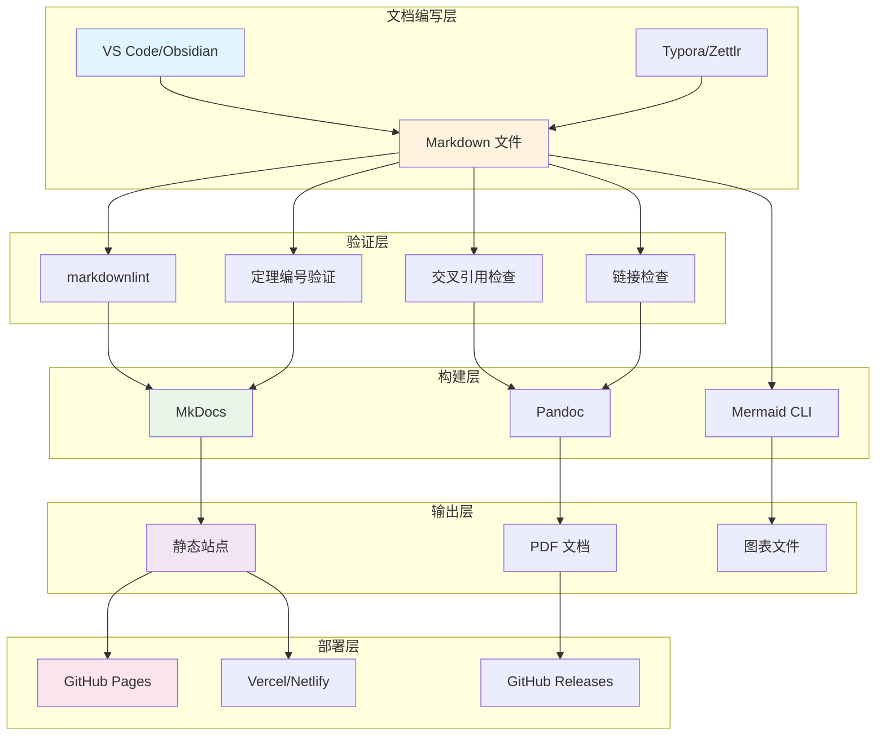
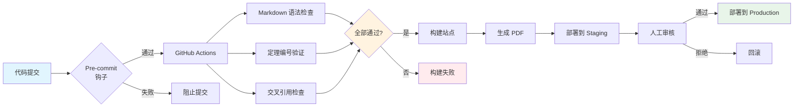

> **状态**: 🔮 前瞻内容 | **风险等级**: 高 | **最后更新**: 2026-04
>
> 此文档描述的内容处于早期规划阶段，可能与最终实现不符。请以 Apache Flink 官方发布为准。
>
# AnalysisDataFlow 工具链指南

> 所属阶段: 项目基础设施 | 前置依赖: [AGENTS.md](./AGENTS.md), [PROJECT-MAP.md](archive/deprecated/PROJECT-MAP.md) | 形式化等级: L3

本文档全面梳理 AnalysisDataFlow 项目开发和维护所需的工具链，涵盖文档编写、验证、构建、协作和自动化五个维度。

---

## 1. 文档工具 (Documentation Tools)

### 1.1 Markdown 编辑器

#### 推荐工具

| 工具 | 平台 | 特点 | 适用场景 |
|------|------|------|----------|
| **VS Code** | Win/Mac/Linux | 插件丰富、Git集成、实时预览 | 主力开发编辑器 |
| **Obsidian** | Win/Mac/Linux | 双向链接、图谱视图、本地优先 | 知识库管理 |
| **Typora** | Win/Mac/Linux | 所见即所得、简洁美观 | 专注写作 |
| **Zettlr** | Win/Mac/Linux | 学术导向、引用管理、开源 | 论文写作 |

#### VS Code 配置推荐

```json
// .vscode/settings.json
{
  "editor.wordWrap": "on",
  "editor.rulers": [80, 120],
  "editor.formatOnSave": true,
  "markdown.preview.breaks": true,
  "markdown.extension.toc.levels": "1-3",
  "markdown.extension.preview.autoShowPreviewToSide": false,
  "files.associations": {
    "*.md": "markdown"
  },
  "markdown.validate.enabled": true,
  "markdown.validate.referenceLinks.enabled": "warning"
}
```

#### 必备插件

| 插件名 | 功能 | 安装命令 |
|--------|------|----------|
| Markdown All in One | 快捷键、TOC、数学公式 | `ext install yzhang.markdown-all-in-one` |
| Markdown Preview Mermaid Support | Mermaid 图表渲染 | `ext install bierner.markdown-mermaid` |
| markdownlint | Markdown 语法规范检查 | `ext install davidanson.vscode-markdownlint` |
| Markdown Footnotes | 脚注支持 | `ext install bierner.markdown-footnotes` |
| Path Intellisense | 路径自动补全 | `ext install christian-kohler.path-intellisense` |

### 1.2 Mermaid 渲染

#### 本地渲染方案

**方案一：VS Code 实时预览**

- 安装 `Markdown Preview Mermaid Support` 插件
- 使用 `Ctrl+Shift+V` 预览 Mermaid 图表
- 支持实时编辑和渲染

**方案二：Mermaid CLI**

```bash
# 安装
npm install -g @mermaid-js/mermaid-cli

# 将 Mermaid 图表转换为 SVG/PNG/PDF
mmdc -i diagram.mmd -o output.svg
mmdc -i diagram.mmd -o output.png -b white
mmdc -i diagram.mmd -o output.pdf

# 批量转换
mmdc -i "**/*.mmd" -o "output/"
```

**方案三：Docker 渲染**

```bash
# 使用 Docker 运行，无需本地安装 Node.js
docker run -it --rm -v ${PWD}:/data minlag/mermaid-cli \
  -i /data/diagram.mmd -o /data/output.svg
```

#### Mermaid 配置优化

```javascript
// mermaid.config.js
module.exports = {
  theme: 'default',
  themeVariables: {
    primaryColor: '#e1f5fe',
    primaryTextColor: '#01579b',
    primaryBorderColor: '#0288d1',
    lineColor: '#0288d1',
    secondaryColor: '#fff3e0',
    tertiaryColor: '#e8f5e9'
  },
  flowchart: {
    useMaxWidth: true,
    htmlLabels: true,
    curve: 'basis'
  },
  sequence: {
    useMaxWidth: true,
    diagramMarginX: 50,
    diagramMarginY: 10
  },
  gantt: {
    useMaxWidth: true,
    leftPadding: 75
  }
};
```

### 1.3 预览工具

#### 本地预览

| 工具 | 命令 | 特点 |
|------|------|------|
| **Python HTTP Server** | `python -m http.server 8000` | 零配置、轻量 |
| **Live Server (VS Code)** | 右键 → Open with Live Server | 实时重载 |
| **MkDocs Serve** | `mkdocs serve` | 文档站点预览 |
| **Hugo Server** | `hugo server -D` | 静态站点预览 |

#### 推荐配置：Live Server

```json
// .vscode/settings.json
{
  "liveServer.settings.root": "/",
  "liveServer.settings.port": 5500,
  "liveServer.settings.ignoreFiles": [
    ".vscode/**",
    "**/*.scss",
    "**/*.sass",
    "**/*.ts"
  ]
}
```

---

## 2. 验证工具 (Validation Tools)

### 2.1 定理编号验证

#### 自定义验证脚本

```python
#!/usr/bin/env python3
"""
theorem-validator.py - 定理编号格式验证器

验证规则：
- 定理：Thm-{阶段}-{文档序号}-{顺序号}
- 引理：Lemma-{阶段}-{文档序号}-{顺序号}
- 定义：Def-{阶段}-{文档序号}-{顺序号}
- 命题：Prop-{阶段}-{文档序号}-{顺序号}
- 推论：Cor-{阶段}-{文档序号}-{顺序号}

阶段标识：S=Struct, K=Knowledge, F=Flink
"""

import re
import sys
from pathlib import Path

# 编号格式正则
THEOREM_PATTERN = re.compile(
    r'\b(Thm|Lemma|Def|Prop|Cor)-([SKF])-(\d{2})-(\d{2,3})\b'
)

# 阶段映射
STAGE_MAP = {
    'S': 'Struct',
    'K': 'Knowledge',
    'F': 'Flink'
}

def validate_theorem_numbering(file_path: Path) -> list:
    """验证文件中的定理编号格式"""
    errors = []
    content = file_path.read_text(encoding='utf-8')

    for i, line in enumerate(content.split('\n'), 1):
        matches = THEOREM_PATTERN.findall(line)
        for match in matches:
            type_abbr, stage, doc_num, seq_num = match
            # 验证文档序号与文件路径匹配
            expected_dir = STAGE_MAP.get(stage)
            if expected_dir and expected_dir not in str(file_path):
                errors.append({
                    'line': i,
                    'error': f'编号 {"-".join(match)} 的阶段与文件路径不匹配',
                    'content': line.strip()
                })

    return errors

def validate_all():
    """验证所有 Markdown 文件"""
    all_errors = []

    for stage in ['Struct', 'Knowledge', 'Flink']:
        for md_file in Path(stage).glob('**/*.md'):
            errors = validate_theorem_numbering(md_file)
            for err in errors:
                err['file'] = str(md_file)
                all_errors.append(err)

    if all_errors:
        print("❌ 发现定理编号错误：")
        for err in all_errors:
            print(f"  {err['file']}:{err['line']}")
            print(f"    错误：{err['error']}")
            print(f"    内容：{err['content']}")
        sys.exit(1)
    else:
        print("✅ 所有定理编号格式正确")
        sys.exit(0)

if __name__ == '__main__':
    validate_all()
```

#### Makefile 集成

```makefile
# Makefile 添加验证目标
.PHONY: validate validate-theorems

validate: validate-theorems validate-links validate-markdown

validate-theorems:
 @echo "🔍 验证定理编号格式..."
 @python scripts/theorem-validator.py
```

### 2.2 交叉引用检查

#### 链接检查工具

**Markdown Link Check**

```bash
# 安装
npm install -g markdown-link-check

# 检查单个文件
markdown-link-check docs/file.md

# 检查所有文件（使用配置）
find . -name "*.md" -not -path "./node_modules/*" | \
  xargs -I {} markdown-link-check {} --config .markdown-link-check.json
```

**配置：`.markdown-link-check.json`**

```json
{
  "ignorePatterns": [
    {
      "pattern": "^http://localhost"
    },
    {
      "pattern": "^https://github.com/.*/issues/"
    }
  ],
  "replacementPatterns": [
    {
      "pattern": "^./",
      "replacement": "file://{{BASEDIR}}/"
    }
  ],
  "timeout": "20s",
  "retryOn429": true,
  "retryCount": 3,
  "fallbackRetryDelay": "30s",
  "aliveStatusCodes": [200, 206]
}
```

**Lychee（Rust 实现，更快）**

```bash
# 安装
cargo install lychee

# 检查所有 Markdown 文件
lychee --verbose "**/*.md"

# 生成报告
lychee --format detailed --output report.md "**/*.md"
```

#### 内部引用验证脚本

```python
#!/usr/bin/env python3
"""
cross-ref-validator.py - 交叉引用验证器

验证文档之间的交叉引用是否有效
"""

import re
import sys
from pathlib import Path

def extract_references(content: str) -> list:
    """提取文档中的所有内部链接引用"""
    # 匹配 [text](./Flink/00-INDEX.md) 或 [text](Flink/00-INDEX.md)
    pattern = re.compile(r'\[([^\]]+)\]\((?!http)([^)]+\.md)\)')
    return pattern.findall(content)

def validate_cross_references():
    """验证所有交叉引用"""
    base_path = Path('.')
    all_refs = {}

    # 收集所有引用
    for stage in ['Struct', 'Knowledge', 'Flink']:
        stage_path = base_path / stage
        if not stage_path.exists():
            continue
        for md_file in stage_path.rglob('*.md'):
            content = md_file.read_text(encoding='utf-8')
            refs = extract_references(content)
            all_refs[md_file] = refs

    # 验证引用有效性
    errors = []
    for file_path, refs in all_refs.items():
        for text, ref_path in refs:
            # 解析相对路径
            if ref_path.startswith('./'):
                ref_path = ref_path[2:]
            target = (file_path.parent / ref_path).resolve()

            if not target.exists():
                errors.append({
                    'source': str(file_path),
                    'target': ref_path,
                    'text': text
                })

    if errors:
        print("❌ 发现无效交叉引用：")
        for err in errors:
            print(f"  {err['source']} -> {err['target']}")
            print(f"    引用文本：{err['text']}")
        sys.exit(1)
    else:
        print("✅ 所有交叉引用有效")
        sys.exit(0)

if __name__ == '__main__':
    validate_cross_references()
```

### 2.3 语法检查

#### Markdownlint 配置

**安装**

```bash
# 全局安装
npm install -g markdownlint-cli

# 或使用 npx
npx markdownlint-cli "**/*.md"
```

**配置：`.markdownlint.json`**

```json
{
  "default": true,
  "MD003": {
    "style": "atx"
  },
  "MD007": {
    "indent": 2
  },
  "MD013": {
    "line_length": 120,
    "heading_line_length": 120,
    "code_block_line_length": 120,
    "tables": false
  },
  "MD024": {
    "siblings_only": true
  },
  "MD033": {
    "allowed_elements": [
      "br",
      "sup",
      "sub",
      "details",
      "summary"
    ]
  },
  "MD041": false,
  "MD046": {
    "style": "fenced"
  }
}
```

**VS Code 集成**

```json
// .vscode/settings.json
{
  "markdownlint.config": {
    "extends": ".markdownlint.json"
  },
  "editor.formatOnSave": true,
  "[markdown]": {
    "editor.defaultFormatter": "Davidanson.vscode-markdownlint"
  }
}
```

#### 中文文案检查

```bash
# 安装中文排版检查工具
npm install -g zhlint

# 检查文件
zhlint "**/*.md"

# 自动修复
zhlint --fix "**/*.md"
```

---

## 3. 构建工具 (Build Tools)

### 3.1 文档生成

#### MkDocs

**安装与初始化**

```bash
# 安装
pip install mkdocs mkdocs-material

# 初始化项目
mkdocs new .
```

**配置：`mkdocs.yml`**

```yaml
site_name: AnalysisDataFlow
site_description: 流计算理论、工程与实践知识库
site_author: AnalysisDataFlow Team
site_url: https://github.com/luyanfeng/AnalysisDataFlow/

theme:
  name: material
  features:
    - navigation.tabs
    - navigation.sections
    - navigation.expand
    - search.suggest
    - search.highlight
  palette:
    - scheme: default
      primary: indigo
      accent: indigo
      toggle:
        icon: material/brightness-7
        name: Switch to dark mode
    - scheme: slate
      primary: indigo
      accent: indigo
      toggle:
        icon: material/brightness-4
        name: Switch to light mode

plugins:
  - search
  - minify:
      minify_html: true
  - mermaid2:
      arguments:
        theme: default

markdown_extensions:
  - admonition
  - pymdownx.details
  - pymdownx.superfences:
      custom_fences:
        - name: mermaid
          class: mermaid
          format: !!python/name:pymdownx.superfences.fence_code_format
  - pymdownx.tabbed
  - pymdownx.tasklist:
      custom_checkbox: true
  - tables
  - toc:
      permalink: true
      toc_depth: 3

nav:
  - 首页: index.md
  - Struct:
    - "Struct/": Struct/
  - Knowledge:
    - "Knowledge/": Knowledge/
  - Flink:
    - "Flink/": Flink/
```

**构建命令**

```bash
# 本地预览
mkdocs serve

# 构建站点
mkdocs build

# 部署到 GitHub Pages
mkdocs gh-deploy
```

#### Hugo

**安装**

```bash
# Windows
winget install Hugo.Hugo.Extended

# macOS
brew install hugo

# Linux
sudo apt install hugo
```

**主题推荐：Book**

```bash
# 初始化 Hugo 站点
git submodule add https://github.com/alex-shpak/hugo-book.git themes/hugo-book

# 配置 config.toml
cat > config.toml << 'EOF'
baseURL = 'https://github.com/luyanfeng/AnalysisDataFlow/'
languageCode = 'zh-CN'
title = 'AnalysisDataFlow'
theme = 'hugo-book'

[params]
  BookTheme = 'auto'
  BookLogo = 'logo.png'
  BookSection = '*'
  BookRepo = 'https://github.com/analysisdataflow/project'
  BookEditPath = 'edit/main'
  BookSearch = true
  BookComments = false
EOF
```

### 3.2 PDF 导出

#### mdBook + mdbook-pdf

```bash
# 安装
 cargo install mdbook
 cargo install mdbook-pdf

# 初始化
mdbook init

# 构建 PDF
mdbook build
```

**配置：`book.toml`**

```toml
[book]
title = "AnalysisDataFlow"
authors = ["AnalysisDataFlow Team"]
description = "流计算理论、工程与实践知识库"
src = "."

[output.html]
mathjax-support = true

[output.pdf]
optional = true

[preprocessor.mermaid]
command = "mdbook-mermaid"
```

#### Pandoc

```bash
# 安装 Pandoc
# Windows: winget install JohnMacFarlane.Pandoc
# macOS: brew install pandoc
# Ubuntu: sudo apt install pandoc

# 基础 PDF 导出
pandoc input.md -o output.pdf --pdf-engine=xelatex

# 批量导出（合并多个文件）
pandoc \
  title.md \
  Struct/*.md \
  Knowledge/*.md \
  Flink/*.md \
  -o AnalysisDataFlow.pdf \
  --pdf-engine=xelatex \
  --template=eisvogel \
  --toc \
  --toc-depth=3 \
  --number-sections \
  --highlight-style=tango \
  -V CJKmainfont="Noto Sans CJK SC" \
  -V geometry:margin=2.5cm \
  -V colorlinks=true

# 使用 Docker（无需本地安装 LaTeX）
docker run --rm -v ${PWD}:/data \
  pandoc/latex:alpine \
  /data/input.md -o /data/output.pdf
```

**LaTeX 模板推荐：Eisvogel**

```bash
# 下载模板
mkdir -p ~/.pandoc/templates
curl -L https://raw.githubusercontent.com/Wandmalfarbe/pandoc-latex-template/master/eisvogel.tex \
  -o ~/.pandoc/templates/eisvogel.latex
```

#### Node.js 方案：markdown-pdf

```bash
# 安装
npm install -g markdown-pdf

# 转换单个文件
markdown-pdf input.md -o output.pdf

# 使用样式
markdown-pdf input.md -s style.css -o output.pdf
```

### 3.3 静态站点

#### 部署平台对比

| 平台 | 特点 | 部署方式 | 自定义域名 |
|------|------|----------|------------|
| **GitHub Pages** | 与 GitHub 集成 | GitHub Actions / 分支 | 免费 |
| **Vercel** | 自动部署、预览 | Git 集成 | 免费 |
| **Netlify** | 表单处理、边缘函数 | Git 集成 / CLI | 免费 |
| **Cloudflare Pages** | 全球 CDN、速度极快 | Git 集成 | 免费 |
| **AWS S3 + CloudFront** | 企业级、完全控制 | AWS CLI / Terraform | 需配置 |

#### GitHub Pages 部署

```yaml
# .github/workflows/pages.yml
name: Deploy to GitHub Pages

on:
  push:
    branches: [main]
  pull_request:
    branches: [main]

jobs:
  deploy:
    runs-on: ubuntu-latest
    steps:
      - uses: actions/checkout@v4

      - name: Setup Python
        uses: actions/setup-python@v5
        with:
          python-version: '3.11'

      - name: Install dependencies
        run: |
          pip install mkdocs mkdocs-material
          pip install mkdocs-minify-plugin

      - name: Build site
        run: mkdocs build

      - name: Deploy to GitHub Pages
        if: github.ref == 'refs/heads/main'
        uses: peaceiris/actions-gh-pages@v3
        with:
          github_token: ${{ secrets.GITHUB_TOKEN }}
          publish_dir: ./site
```

#### Vercel 部署

```json
// vercel.json
{
  "buildCommand": "mkdocs build",
  "outputDirectory": "site",
  "installCommand": "pip install mkdocs mkdocs-material",
  "framework": null
}
```

---

## 4. 协作工具 (Collaboration Tools)

### 4.1 版本控制

#### Git 工作流

**分支策略：GitHub Flow**

```
main (保护分支)
  ↑
feature/theory-stream-semantics  ← 新特性开发
  ↑
hotfix/theorem-numbering         ← 紧急修复
```

#### Git 配置推荐

```bash
# 全局配置
git config --global user.name "Your Name"
git config --global user.email "your.email@example.com"
git config --global init.defaultBranch main
git config --global core.autocrlf true  # Windows
git config --global core.autocrlf input # macOS/Linux

# 别名配置
git config --global alias.st status
git config --global alias.co checkout
git config --global alias.br branch
git config --global alias.ci commit
git config --global alias.lg "log --oneline --graph --decorate"
```

#### 提交规范

```bash
# 使用 Commitizen 规范提交
npm install -g commitizen cz-conventional-changelog

# 初始化
echo '{ "path": "cz-conventional-changelog" }' > .czrc

# 使用
git cz
```

**提交类型**

| 类型 | 说明 | 示例 |
|------|------|------|
| `docs` | 文档更新 | `docs(Struct): 添加流语义定理证明` |
| `fix` | 错误修正 | `fix(Knowledge): 修正定义编号错误` |
| `feat` | 新特性 | `feat(Flink): 添加 Checkpoint 机制详解` |
| `refactor` | 重构 | `refactor: 重新组织目录结构` |
| `style` | 格式调整 | `style: 统一引用格式` |
| `chore` | 构建/工具 | `chore: 更新 Makefile` |

### 4.2 代码审查

#### GitHub Pull Request 模板

```markdown
<!-- .github/pull_request_template.md -->

## 变更类型
- [ ] 新增文档
- [ ] 文档修正
- [ ] 定理/定义更新
- [ ] 结构重组
- [ ] 其他

## 检查清单
- [ ] 遵循六段式文档结构
- [ ] 定理/定义编号符合规范
- [ ] 包含 Mermaid 可视化图表
- [ ] 引用格式正确
- [ ] Markdownlint 检查通过
- [ ] 交叉引用验证通过

## 关联 Issue
Fixes #(issue number)

## 额外说明
<!-- 补充说明 -->
```

#### 审查检查清单

```markdown
## 审查者检查项

### 内容质量
- [ ] 概念定义清晰准确
- [ ] 论证逻辑严密
- [ ] 定理/证明无错误
- [ ] 示例恰当且可运行

### 格式规范
- [ ] 六段式结构完整
- [ ] 编号体系正确
- [ ] 引用格式规范
- [ ] Mermaid 图表渲染正常

### 技术准确
- [ ] 代码片段正确
- [ ] 配置示例有效
- [ ] 外部链接可访问
```

### 4.3 问题追踪

#### GitHub Issues 标签体系

| 标签 | 颜色 | 用途 |
|------|------|------|
| `content/theory` | `#0052CC` | 理论内容相关 |
| `content/engineering` | `#0052CC` | 工程实践相关 |
| `content/flink` | `#0052CC` | Flink 专项相关 |
| `type/theorem` | `#5319E7` | 定理/定义相关 |
| `type/bug` | `#D73A4A` | 错误修正 |
| `type/enhancement` | `#A2EEEF` | 功能增强 |
| `priority/high` | `#B60205` | 高优先级 |
| `priority/medium` | `#F9D0C4` | 中优先级 |
| `status/in-progress` | `#0E8A16` | 进行中 |
| `help wanted` | `#008672` | 需要帮助 |

#### Issue 模板

```markdown
<!-- .github/ISSUE_TEMPLATE/new_document.md -->
---
name: 新文档请求
about: 建议添加新的知识文档
title: '[DOC] '
labels: content/theory, type/enhancement
assignees: ''
---

## 文档主题
<!-- 简明描述文档主题 -->

## 所属阶段
- [ ] Struct（形式理论）
- [ ] Knowledge（工程知识）
- [ ] Flink（Flink 专项）

## 前置依赖
<!-- 列出依赖的现有文档 -->

## 建议大纲
<!-- 文档结构建议 -->

## 参考资源
<!-- 相关论文、文档链接 -->
```

---

## 5. 自动化工具 (Automation Tools)

### 5.1 CI/CD

#### GitHub Actions 完整工作流

```yaml
# .github/workflows/ci.yml
name: CI

on:
  push:
    branches: [main]
    paths:
      - '**.md'
      - '.github/workflows/**'
  pull_request:
    branches: [main]
    paths:
      - '**.md'

jobs:
  validate:
    name: 验证检查
    runs-on: ubuntu-latest
    steps:
      - uses: actions/checkout@v4

      - name: Setup Node.js
        uses: actions/setup-python@v5
        with:
          python-version: '3.11'

      - name: Install dependencies
        run: |
          pip install markdown-link-check
          npm install -g markdownlint-cli

      - name: Lint Markdown
        run: markdownlint "**/*.md" --ignore node_modules

      - name: Check links
        run: |
          find . -name "*.md" -not -path "./node_modules/*" | \
            xargs -I {} markdown-link-check {} -q

      - name: Validate theorem numbering
        run: python scripts/theorem-validator.py

      - name: Validate cross-references
        run: python scripts/cross-ref-validator.py

  build:
    name: 构建文档
    needs: validate
    runs-on: ubuntu-latest
    steps:
      - uses: actions/checkout@v4

      - name: Setup Python
        uses: actions/setup-python@v5
        with:
          python-version: '3.11'

      - name: Install MkDocs
        run: |
          pip install mkdocs mkdocs-material
          pip install mkdocs-minify-plugin

      - name: Build site
        run: mkdocs build --strict

      - name: Upload artifact
        uses: actions/upload-artifact@v4
        with:
          name: site
          path: site/

  pdf:
    name: 生成 PDF
    needs: validate
    runs-on: ubuntu-latest
    steps:
      - uses: actions/checkout@v4

      - name: Setup Pandoc
        uses: r-lib/actions/setup-pandoc@v2

      - name: Install LaTeX
        run: |
          sudo apt-get update
          sudo apt-get install -y texlive-xetex texlive-fonts-recommended

      - name: Download Eisvogel template
        run: |
          mkdir -p ~/.pandoc/templates
          curl -L -o ~/.pandoc/templates/eisvogel.latex \
            https: //raw.githubusercontent.com/Wandmalfarbe/pandoc-latex-template/master/eisvogel.tex

      - name: Generate PDF
        run: |
          pandoc $(find Struct Knowledge Flink -name "*.md" | sort) \
            -o AnalysisDataFlow.pdf \
            --template=eisvogel \
            --toc \
            --toc-depth=2 \
            -V geometry:margin=2.5cm

      - name: Upload PDF
        uses: actions/upload-artifact@v4
        with:
          name: pdf
          path: AnalysisDataFlow.pdf
```

### 5.2 自动部署

#### 多环境部署策略

```yaml
# .github/workflows/deploy.yml
name: Deploy

on:
  workflow_run:
    workflows: ["CI"]
    types: [completed]
    branches: [main]

jobs:
  deploy-staging:
    name: 部署到预览环境
    if: ${{ github.event.workflow_run.conclusion == 'success' }}
    runs-on: ubuntu-latest
    environment:
      name: staging
      url: https://staging.analysisdataflow.io
    steps:
      - uses: actions/checkout@v4

      - name: Download artifact
        uses: actions/download-artifact@v4
        with:
          name: site
          path: site/

      - name: Deploy to Vercel (Preview)
        uses: amondnet/vercel-action@v25
        with:
          vercel-token: ${{ secrets.VERCEL_TOKEN }}
          vercel-org-id: ${{ secrets.VERCEL_ORG_ID }}
          vercel-project-id: ${{ secrets.VERCEL_PROJECT_ID }}
          vercel-args: '--prod'

  deploy-production:
    name: 部署到生产环境
    needs: deploy-staging
    runs-on: ubuntu-latest
    environment:
      name: production
      url: https://analysisdataflow.io
    steps:
      - uses: actions/checkout@v4

      - name: Download artifact
        uses: actions/download-artifact@v4
        with:
          name: site
          path: site/

      - name: Deploy to GitHub Pages
        uses: peaceiris/actions-gh-pages@v3
        with:
          github_token: ${{ secrets.GITHUB_TOKEN }}
          publish_dir: ./site
```

### 5.3 监控告警

#### 站点监控

```yaml
# .github/workflows/monitor.yml
name: Site Monitor

on:
  schedule:
    - cron: '0 */6 * * *'  # 每6小时检查一次
  workflow_dispatch:

jobs:
  check:
    runs-on: ubuntu-latest
    steps:
      - name: Check site availability
        run: |
          response=$(curl -s -o /dev/null -w "%{http_code}" https://analysisdataflow.io)
          if [ $response -ne 200 ]; then
            echo "❌ Site is down! Status: $response"
            exit 1
          fi
          echo "✅ Site is up! Status: $response"

      - name: Check SSL certificate
        run: |
          expiry=$(openssl s_client -connect analysisdataflow.io:443 \
            -servername analysisdataflow.io 2>/dev/null | \
            openssl x509 -noout -dates | grep notAfter | cut -d= -f2)
          echo "SSL Certificate expires: $expiry"
```

#### 依赖更新监控

```yaml
# .github/workflows/dependency-check.yml
name: Dependency Check

on:
  schedule:
    - cron: '0 0 * * 1'  # 每周一检查

jobs:
  check:
    runs-on: ubuntu-latest
    steps:
      - uses: actions/checkout@v4

      - name: Check for outdated actions
        uses: actions/gh-actions-outdated@v1
        with:
          token: ${{ secrets.GITHUB_TOKEN }}

      - name: Create issue if updates needed
        if: failure()
        uses: actions-ecosystem/action-create-issue@v1
        with:
          github_token: ${{ secrets.GITHUB_TOKEN }}
          title: 'Dependencies need update'
          body: |
            Some GitHub Actions or dependencies are outdated.
            Please review and update.
```

---

## 6. 工具链集成

### 6.1 Makefile 完整配置

```makefile
# Makefile - AnalysisDataFlow 工具链集成
.PHONY: help install lint validate build pdf serve clean

# 默认目标
help:
 @echo "AnalysisDataFlow 工具链"
 @echo ""
 @echo "可用命令:"
 @echo "  make install    - 安装所有依赖"
 @echo "  make lint       - 运行 Markdown 语法检查"
 @echo "  make validate   - 运行所有验证"
 @echo "  make build      - 构建静态站点"
 @echo "  make pdf        - 生成 PDF 文档"
 @echo "  make serve      - 启动本地预览服务器"
 @echo "  make clean      - 清理构建产物"

# 安装依赖
install:
 @echo "📦 安装 Node.js 依赖..."
 npm install -g markdownlint-cli markdown-link-check
 @echo "📦 安装 Python 依赖..."
 pip install mkdocs mkdocs-material
 @echo "✅ 依赖安装完成"

# 语法检查
lint:
 @echo "🔍 运行 Markdown 语法检查..."
 markdownlint "**/*.md" --ignore node_modules --ignore site

# 验证
validate: validate-markdown validate-theorems validate-links validate-refs

validate-markdown:
 @echo "🔍 Markdown 语法检查..."
 @markdownlint "**/*.md" --ignore node_modules --ignore site || true

validate-theorems:
 @echo "🔍 验证定理编号..."
 @python scripts/theorem-validator.py || true

validate-links:
 @echo "🔍 检查外部链接..."
 @find . -name "*.md" -not -path "./node_modules/*" -not -path "./site/*" | \
   head -10 | xargs -I {} markdown-link-check {} -q || true

validate-refs:
 @echo "🔍 验证交叉引用..."
 @python scripts/cross-ref-validator.py || true

# 构建
build: validate
 @echo "🏗️  构建静态站点..."
 mkdocs build --strict

# PDF 生成
pdf:
 @echo "📄 生成 PDF..."
 @# 使用 mdbook-pdf 或 pandoc
 @which mdbook > /dev/null 2>&1 && mdbook build || \
   echo "请先安装 mdbook: cargo install mdbook mdbook-pdf"

# 本地预览
serve:
 @echo "🚀 启动本地服务器..."
 @python -m http.server 8000 &
 @echo "访问 http://localhost:8000"

# 清理
clean:
 @echo "🧹 清理构建产物..."
 rm -rf site/
 rm -rf book/
 rm -f AnalysisDataFlow.pdf

# Git 钩子安装
install-hooks:
 @echo "🔗 安装 Git 钩子..."
 @cp scripts/pre-commit .git/hooks/
 @chmod +x .git/hooks/pre-commit
 @echo "✅ Git 钩子安装完成"
```

### 6.2 Git 钩子

```bash
#!/bin/sh
# .git/hooks/pre-commit

echo "🔍 提交前检查..."

# 运行 Markdown 语法检查
echo "  → 检查 Markdown 语法..."
markdownlint "**/*.md" --ignore node_modules
if [ $? -ne 0 ]; then
    echo "❌ Markdown 语法检查失败"
    exit 1
fi

# 验证定理编号
echo "  → 验证定理编号..."
python scripts/theorem-validator.py
if [ $? -ne 0 ]; then
    echo "❌ 定理编号验证失败"
    exit 1
fi

echo "✅ 提交前检查通过"
exit 0
```

### 6.3 VS Code 工作区配置

```json
// .vscode/tasks.json
{
  "version": "2.0.0",
  "tasks": [
    {
      "label": "验证文档",
      "type": "shell",
      "command": "make validate",
      "group": {
        "kind": "test",
        "isDefault": true
      },
      "presentation": {
        "echo": true,
        "reveal": "always",
        "focus": false,
        "panel": "shared"
      }
    },
    {
      "label": "构建站点",
      "type": "shell",
      "command": "make build",
      "group": {
        "kind": "build",
        "isDefault": true
      }
    },
    {
      "label": "生成 PDF",
      "type": "shell",
      "command": "make pdf"
    },
    {
      "label": "本地预览",
      "type": "shell",
      "command": "mkdocs serve",
      "isBackground": true
    }
  ]
}
```

```json
// .vscode/launch.json
{
  "version": "0.2.0",
  "configurations": [
    {
      "name": "Python: 验证脚本",
      "type": "debugpy",
      "request": "launch",
      "program": "${workspaceFolder}/scripts/theorem-validator.py",
      "console": "integratedTerminal"
    }
  ]
}
```

---

## 7. 工具链选型建议

### 7.1 按角色推荐

| 角色 | 推荐工具组合 |
|------|-------------|
| **内容作者** | VS Code + Markdown All in One + Live Server |
| **技术编辑** | Obsidian + zhlint + markdownlint |
| **CI/CD 工程师** | GitHub Actions + Makefile + Docker |
| **项目经理** | GitHub Projects + Issues + PR 模板 |

### 7.2 按场景推荐

| 场景 | 推荐方案 |
|------|----------|
| **日常写作** | VS Code + 本地预览 |
| **协作审查** | GitHub PR + Review 模板 |
| **发布站点** | MkDocs + GitHub Pages |
| **打印分发** | Pandoc + LaTeX + PDF |
| **批量处理** | Makefile + CLI 工具链 |

---

## 8. 可视化

### 工具链架构图



### CI/CD 流程图



---

## 9. 参考文档

- [MkDocs 官方文档](https://www.mkdocs.org/)
- [Material for MkDocs](https://squidfunk.github.io/mkdocs-material/)
- [Mermaid 语法文档](https://mermaid.js.org/intro/)
- [Markdownlint 规则](https://github.com/DavidAnson/markdownlint/blob/main/doc/Rules.md)
- [Pandoc 用户指南](https://pandoc.org/MANUAL.html)
- [GitHub Actions 文档](https://docs.github.com/en/actions)

---

*本文档由 AnalysisDataFlow 项目维护，最后更新于 2026-04-04。*
