# 流计算系统故障排查手册

> **适用版本**: v2.8+ | **适用范围**: Flink/Dataflow 流计算系统 | **更新日期**: 2026-04-03

## 快速导航

```
┌─────────────────────────────────────────────────────────────────────────────┐
│                         问题分类速查索引                                      │
├─────────────────┬─────────────────┬─────────────────┬─────────────────────────┤
│    🔥 性能问题   │   ⚖️ 一致性问题  │   💾 Checkpoint │    🔧 资源问题          │
├─────────────────┼─────────────────┼─────────────────┼─────────────────────────┤
│ • 延迟高 (P-01) │ • 数据丢失 (C-01)│ • 超时 (K-01)  │ • OOM (R-01)           │
│ • 吞吐量低 (P-02)│ • 数据重复 (C-02)│ • 失败 (K-02)  │ • GC频繁 (R-02)        │
│ • 背压严重 (P-03)│ • 乱序数据 (C-03)│ • 状态过大 (K-03)│ • 磁盘不足 (R-03)    │
│ • 数据倾斜 (P-04)│ • 迟到数据 (C-04)│ • 恢复失败 (K-04)│ • 网络问题 (R-04)    │
└─────────────────┴─────────────────┴─────────────────┴─────────────────────────┘
```

---

## 1. 问题诊断流程

### 1.1 问题树决策图

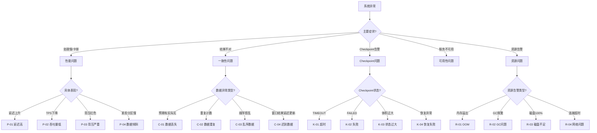

### 1.2 诊断检查清单

| 检查项 | 命令/方法 | 正常范围 | 异常指标 |
|--------|-----------|----------|----------|
| CPU使用率 | Flink UI / Metrics | < 70% | > 80%持续 |
| 内存使用率 | JVM Metrics | < 80% Heap | > 90% Heap |
| GC频率 | GC日志分析 | < 1次/分钟 | > 5次/分钟 |
| Checkpoint时长 | Flink UI Checkpoints | < 1分钟 | > timeout |
| 背压状态 | Flink UI Backpressure | OK/LOW | HIGH |
| 网络延迟 | ping/netstat | < 10ms | > 100ms |
| 磁盘I/O | iostat | < 80% util | 100% util |
| 数据延迟 | Watermark lag | < 窗口大小 | > 2x窗口 |

---

## 2. 性能问题排查 (Performance Issues)

### P-01: 延迟高 (High Latency)

#### 症状识别

| 症状 | 检测位置 | 严重程度 |
|------|----------|----------|
| 端到端延迟持续上升 | Flink UI Metrics: `latency` | 🔴 高 |
| Watermark滞后时间增加 | Flink UI Watermarks | 🔴 高 |
| 窗口触发延迟 | 业务输出监控 | 🟡 中 |
| 下游消费者超时 | 下游系统日志 | 🔴 高 |

#### 根因分析

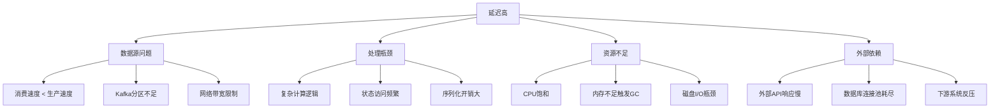

#### 解决方案

| 优先级 | 方案 | 实施步骤 | 预期效果 |
|--------|------|----------|----------|
| 1 | 增加并行度 | `setParallelism(n)` | 线性提升吞吐量 |
| 2 | 优化序列化 | 改用Avro/Protobuf | 减少30-50%序列化时间 |
| 3 | 预聚合优化 | 使用MapState本地聚合 | 减少状态访问次数 |
| 4 | 异步IO | `AsyncFunction`改造 | 消除阻塞等待 |
| 5 | 调整Buffer | `taskmanager.memory.network.fraction` | 减少背压传递 |

#### 预防措施

```yaml
# flink-conf.yaml 推荐配置
# 1. 网络缓冲配置
taskmanager.memory.network.fraction: 0.2
taskmanager.memory.network.min: 2gb
taskmanager.memory.network.max: 8gb

# 2. 检查点间隔（平衡延迟与恢复）
execution.checkpointing.interval: 30s
execution.checkpointing.min-pause-between-checkpoints: 30s

# 3. 背压采样频率
web.backpressure.refresh-interval: 60000
```

---

### P-02: 吞吐量低 (Low Throughput)

#### 症状识别

| 症状 | 检测指标 | 阈值 |
|------|----------|------|
| TPS低于预期 | `numRecordsInPerSecond` | < 目标80% |
| CPU利用率低 | Task CPU Usage | < 50% |
| 网络带宽未饱和 | Network IO | < 60% |
| 磁盘I/O等待高 | `iowait` | > 30% |

#### 根因分析

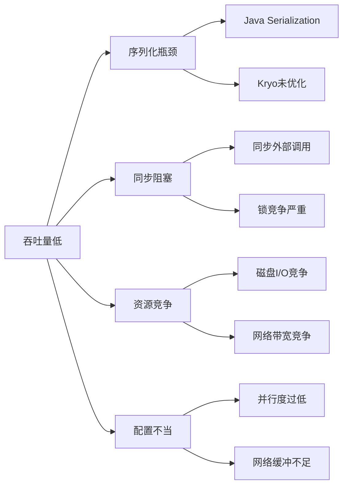

#### 解决方案

| 问题类型 | 诊断方法 | 解决方案 | 验证指标 |
|----------|----------|----------|----------|
| 序列化瓶颈 | CPU火焰图分析 | 注册Kryo序列化器 | 序列化时间下降 |
| 同步阻塞 | Thread Dump分析 | 异步IO改造 | 线程阻塞减少 |
| GC影响 | GC日志分析 | 调整堆内存/G1GC | GC时间<5% |
| 磁盘瓶颈 | iostat监控 | SSD替换/RocksDB调优 | I/O wait下降 |
| 网络瓶颈 | iftop监控 | 压缩传输/批量发送 | 网络利用率提升 |

#### 代码级优化示例

```java
// ❌ 低效：同步外部调用
public class SyncFunction extends RichMapFunction<String, Result> {
    @Override
    public Result map(String value) {
        return externalService.call(value); // 阻塞!
    }
}

// ✅ 高效：异步外部调用
public class AsyncExternalCall extends AsyncFunction<String, Result> {
    @Override
    public void asyncInvoke(String input, ResultFuture<Result> resultFuture) {
        CompletableFuture.supplyAsync(() -> externalService.call(input))
            .thenAccept(result -> resultFuture.complete(Collections.singleton(result)));
    }
}

// 使用方式
DataStream<Result> result = AsyncDataStream.unorderedWait(
    inputStream,
    new AsyncExternalCall(),
    1000, // 超时时间
    TimeUnit.MILLISECONDS,
    100   // 并发请求数
);
```

---

### P-03: 背压严重 (Severe Backpressure)

#### 症状识别

| 症状 | UI表现 | 影响 |
|------|--------|------|
| 背压状态HIGH | Flink UI显示红色背压 | 上游减速，延迟增加 |
| 输出Buffer满 | `outPoolUsage=100%` | 数据堆积 |
| 反压级联 | 多算子背压传导 | 全链路延迟 |

#### 根因定位流程

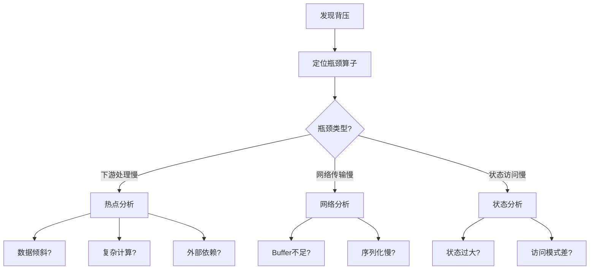

#### 解决方案矩阵

| 瓶颈位置 | 诊断方法 | 快速缓解 | 根本解决 |
|----------|----------|----------|----------|
| Sink端 | 查看最后算子 | 增加Sink并行度 | 批量写入优化 |
| 聚合算子 | 查看Window状态 | 增大窗口预聚合 | 两阶段聚合 |
| Join算子 | 查看Join状态 | 增加缓存大小 | 优化Join策略 |
| 网络层 | Buffer使用率 | 增加网络缓冲 | 优化序列化 |

#### 背压缓解配置

```java
// 代码级别优化
env.setBufferTimeout(100); // 减少Buffer等待时间

// 算子链优化（避免不必要的序列化）
DataStream<Result> result = input
    .map(new FastMapper())     // 链在一起
    .filter(new FastFilter())  // 链在一起
    .keyBy(KeySelector)        // 断开链（需要shuffle）
    .window(TumblingEventTimeWindows.of(Time.minutes(1)))
    .aggregate(new OptimizedAggregate()); // 链在一起

// 禁用算子链（调试用，生产慎用）
// env.disableOperatorChaining();
```

---

### P-04: 数据倾斜 (Data Skew)

#### 症状识别

| 症状 | 检测方法 | 判断标准 |
|------|----------|----------|
| 部分Subtask处理慢 | Flink UI Subtask对比 | 最慢/最快 > 3x |
| 某些Key堆积 | Key分布监控 | 热点Key占比>50% |
| 个别Task Heap高 | Task内存监控 | 差异>2x |

#### 倾斜类型分析

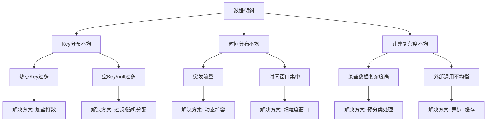

#### 解决方案详解

| 倾斜类型 | 解决方案 | 实现方式 | 适用场景 |
|----------|----------|----------|----------|
| Key热点 | 加盐打散 | `key + random(0, N)` | 聚合类操作 |
| Key热点 | 两阶段聚合 | 局部聚合+全局聚合 | Sum/Count类 |
| Key热点 | 自定义分区 | 实现Partitioner | 特定业务逻辑 |
| 时间突发 | 动态窗口 | SessionWindow+Gap | 活动类数据 |
| 时间突发 | 流量削峰 | 缓存队列缓冲 | 可接受延迟 |

#### 两阶段聚合代码示例

```java
// 第一阶段：加盐局部聚合
DataStream<LocalAgg> localAgg = source
    .map(new RichMapFunction<Event, Event>() {
        private int salt;
        @Override
        public void open(Configuration parameters) {
            salt = getRuntimeContext().getIndexOfThisSubtask();
        }
        @Override
        public Event map(Event value) {
            // 加盐：原始key + salt
            value.setSaltedKey(value.getKey() + "_" + (value.getKey().hashCode() % 10));
            return value;
        }
    })
    .keyBy(Event::getSaltedKey)
    .window(TumblingEventTimeWindows.of(Time.seconds(10)))
    .aggregate(new LocalAggregateFunction());

// 第二阶段：去盐全局聚合
DataStream<Result> globalAgg = localAgg
    .map(e -> { e.setOriginalKey(e.getSaltedKey().split("_")[0]); return e; })
    .keyBy(LocalAgg::getOriginalKey)
    .window(TumblingEventTimeWindows.of(Time.seconds(10)))
    .aggregate(new GlobalAggregateFunction());
```

---

## 3. 一致性问题排查 (Consistency Issues)

### C-01: 数据丢失 (Data Loss)

#### 症状识别

| 症状 | 验证方法 | 严重程度 |
|------|----------|----------|
| 输入输出条数不匹配 | Source Counter vs Sink Counter | 🔴 严重 |
| 业务数据缺漏 | 端到端对账 | 🔴 严重 |
| 窗口结果缺失 | 预期窗口无输出 | 🟡 中等 |

#### 丢失原因分析树

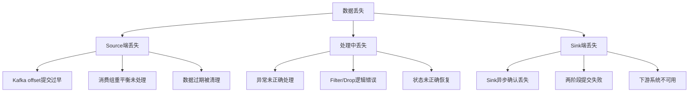

#### 诊断与解决

| 丢失位置 | 诊断方法 | 根本原因 | 解决方案 |
|----------|----------|----------|----------|
| Source | 对比Kafka offset | At-Most-Once配置 | 启用Checkpoint |
| Transformation | 异常日志 | 异常吞没 | Try-Catch+侧输出 |
| Sink | 下游对账 | At-Least-Once配置 | 启用Exactly-Once |
| 状态恢复 | 历史Checkpoint对比 | 状态不兼容 | 状态迁移策略 |

#### 防丢失配置检查清单

```yaml
# 1. Checkpoint配置（必须启用）
execution.checkpointing.mode: EXACTLY_ONCE
execution.checkpointing.interval: 30s
execution.checkpointing.min-pause-between-checkpoints: 30s
execution.checkpointing.max-concurrent-checkpoints: 1
execution.checkpointing.externalized-checkpoint-retention: RETAIN_ON_CANCELLATION

# 2. State Backend配置
state.backend: rocksdb
state.backend.incremental: true
state.checkpoint-storage: filesystem
state.checkpoints.dir: hdfs://namenode:8020/flink-checkpoints

# 3. 重启策略（确保失败重启）
restart-strategy: fixed-delay
restart-strategy.fixed-delay.attempts: 10
restart-strategy.fixed-delay.delay: 10s

# 4. Kafka Source配置（Exactly-Once）
properties.group.id: flink-consumer-group
properties.isolation.level: read_committed
scan.startup.mode: group-offsets
```

---

### C-02: 数据重复 (Data Duplication)

#### 症状识别

| 症状 | 检测方法 | 常见场景 |
|------|----------|----------|
| 计数结果偏大 | 幂等性校验失败 | At-Least-Once模式 |
| 重复事件ID | 唯一性约束冲突 | 故障恢复后 |
| 窗口结果重复输出 | 下游去重失败 | Checkpoint失败后 |

#### 重复产生机制

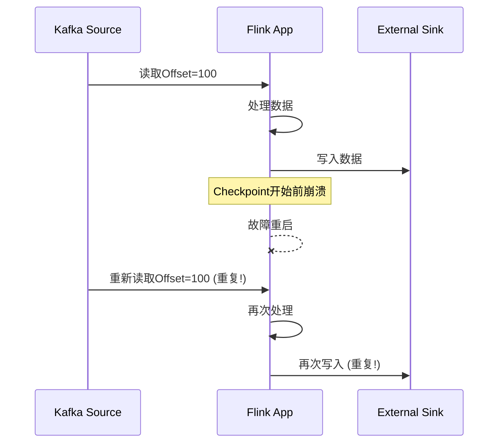

#### 去重策略矩阵

| 策略 | 实现复杂度 | 性能影响 | 适用场景 |
|------|------------|----------|----------|
| 幂等Sink | 低 | 无 | 支持幂等写入的系统 |
| 事务Sink | 中 | 低 | 支持事务的系统 |
| 事件时间去重 | 中 | 中 | 允许一定延迟 |
| 布隆过滤器 | 低 | 低 | 内存充足场景 |
| 外部存储去重 | 高 | 高 | 强一致性要求 |

#### 实现示例

```java
// 方案1: 幂等Sink（推荐）
public class IdempotentSink extends RichSinkFunction<Event> {
    private transient RedisClient redis;

    @Override
    public void invoke(Event value, Context context) {
        String dedupKey = value.getEventId();
        // 使用SETNX确保幂等
        Boolean success = redis.setnx(dedupKey, "1", Duration.ofHours(24));
        if (success) {
            // 实际写入
            writeToDatabase(value);
        }
    }
}

// 方案2: 事件时间去重（基于状态）
public class DeduplicateFunction extends KeyedProcessFunction<String, Event, Event> {
    private ValueState<Long> lastEventTimeState;

    @Override
    public void open(Configuration parameters) {
        StateTtlConfig ttlConfig = StateTtlConfig
            .newBuilder(Time.hours(24))
            .setUpdateType(StateTtlConfig.UpdateType.OnCreateAndWrite)
            .setStateVisibility(StateTtlConfig.StateVisibility.NeverReturnExpired)
            .build();

        ValueStateDescriptor<Long> descriptor = new ValueStateDescriptor<>("lastEventTime", Types.LONG);
        descriptor.enableTimeToLive(ttlConfig);
        lastEventTimeState = getRuntimeContext().getState(descriptor);
    }

    @Override
    public void processElement(Event value, Context ctx, Collector<Event> out) throws Exception {
        Long lastTime = lastEventTimeState.value();
        long currentTime = value.getEventTime();

        // 只处理比之前更新的数据
        if (lastTime == null || currentTime > lastTime) {
            lastEventTimeState.update(currentTime);
            out.collect(value);
        }
    }
}
```

---

### C-03: 乱序数据 (Out-of-Order Data)

#### 症状识别

| 症状 | 检测方法 | 业务影响 |
|------|----------|----------|
| 窗口提前触发 | Watermark监控 | 数据未完全聚合 |
| 时间序列错乱 | 业务顺序校验 | 分析结果错误 |
| 状态计算异常 | 状态值跳跃 | 累计结果错误 |

#### 乱序处理机制

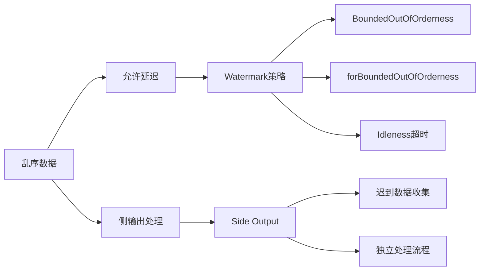

#### 解决方案

| 方案 | 配置参数 | 适用延迟 | 注意事项 |
|------|----------|----------|----------|
| Bounded延迟 | `forBoundedOutOfOrderness(delay)` | < 分钟级 | 延迟与实时性权衡 |
| 处理时间 | `assignAscendingTimestamps()` | 无 | 仅用于测试 |
| 侧输出 | `output(Tag, stream)` | 任意 | 需要额外处理逻辑 |
| 增量窗口 | `allowedLateness()` | 窗口周期内 | 内存消耗增加 |

#### 完整Watermark配置

```java
// 合理的Watermark策略
WatermarkStrategy<Event> strategy = WatermarkStrategy
    .<Event>forBoundedOutOfOrderness(Duration.ofSeconds(30))  // 最大乱序延迟
    .withIdleness(Duration.ofMinutes(5))                       // 空闲检测
    .withTimestampAssigner((event, timestamp) -> event.getEventTime());

DataStream<Event> withTimestamps = stream.assignTimestampsAndWatermarks(strategy);

// 窗口配置（允许迟到数据）
OutputTag<Event> lateDataTag = new OutputTag<Event>("late-data"){};

SingleOutputStreamOperator<Result> result = withTimestamps
    .keyBy(Event::getKey)
    .window(TumblingEventTimeWindows.of(Time.minutes(1)))
    .allowedLateness(Time.minutes(10))      // 允许10分钟迟到
    .sideOutputLateData(lateDataTag)        // 超出的进入侧输出
    .aggregate(new MyAggregateFunction());

// 处理迟到数据
DataStream<Event> lateData = result.getSideOutput(lateDataTag);
lateData.addSink(new LateDataHandler());
```

---

### C-04: 迟到数据 (Late Data)

#### 症状识别

| 症状 | 检测方法 | 根因 |
|------|----------|------|
| 窗口结果后期更新 | 下游数据版本对比 | 迟到数据触发窗口重算 |
| Watermark推进慢 | `currentOutputWatermark` | 某些分区无数据 |
| 状态持续增长 | State Size监控 | 迟到缓冲积累 |

#### 迟到数据处理策略

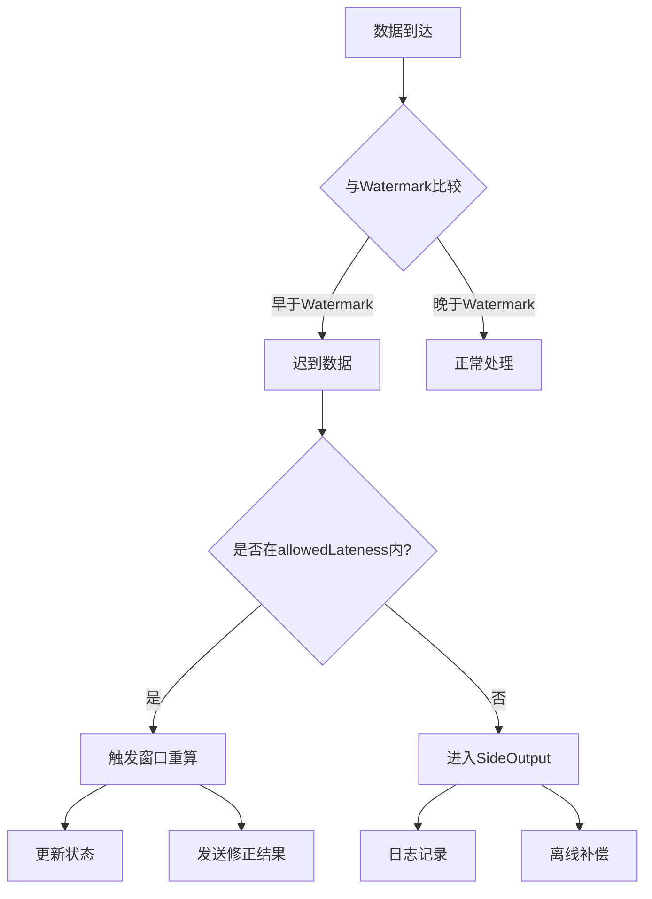

#### 生产环境推荐配置

```java
// 迟到数据处理完整示例
public class LateDataHandlingJob {

    public static void main(String[] args) throws Exception {
        StreamExecutionEnvironment env = StreamExecutionEnvironment.getExecutionEnvironment();

        // 侧输出标签
        final OutputTag<Event> lateDataOutputTag = new OutputTag<Event>("LATE_DATA"){};

        DataStream<Event> source = env
            .fromSource(kafkaSource,
                WatermarkStrategy
                    .<Event>forBoundedOutOfOrderness(Duration.ofMinutes(1))
                    .withTimestampAssigner((e, ts) -> e.getTimestamp()),
                "Kafka Source");

        SingleOutputStreamOperator<WindowResult> windowed = source
            .keyBy(Event::getUserId)
            .window(TumblingEventTimeWindows.of(Time.minutes(5)))
            .allowedLateness(Time.minutes(10))      // 允许10分钟迟到
            .sideOutputLateData(lateDataOutputTag)  // 超出进入侧输出
            .process(new ProcessWindowFunction<Event, WindowResult, String, TimeWindow>() {
                @Override
                public void process(String key, Context context,
                        Iterable<Event> elements, Collector<WindowResult> out) {
                    // 窗口计算逻辑
                    WindowResult result = compute(elements);
                    result.setWindowStart(context.window().getStart());
                    result.setIsUpdate(context.window().maxTimestamp() <
                        context.currentWatermark()); // 标记是否为更新
                    out.collect(result);
                }
            });

        // 主输出：正常窗口结果
        windowed.addSink(new MainResultSink());

        // 侧输出：迟到数据
        windowed.getSideOutput(lateDataOutputTag)
            .addSink(new LateDataMetricsSink());  // 监控迟到数据量

        // 修正流：用于下游更新
        windowed.filter(r -> r.isUpdate())
            .addSink(new CorrectionSink());

        env.execute();
    }
}
```

---

## 4. Checkpoint问题排查

### K-01: Checkpoint超时 (Checkpoint Timeout)

#### 症状识别

| 症状 | 检测位置 | 阈值 |
|------|----------|------|
| Checkpoint持续时间持续增长 | Flink UI Checkpoints | > 配置超时时间 |
| Checkpoint状态TIMEOUT | Flink UI | 连续多次 |
| TaskManager日志出现TimeoutException | TaskManager日志 | - |

#### 超时原因分析

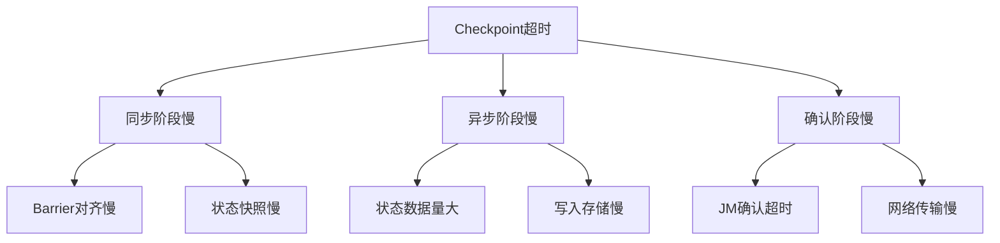

#### 解决方案

| 阶段 | 问题 | 解决方案 | 配置参数 |
|------|------|----------|----------|
| 同步 | Barrier对齐慢 | 启用Unaligned Checkpoint | `execution.checkpointing.unaligned: true` |
| 同步 | 同步快照慢 | 减少同步快照状态 | 使用增量Checkpoint |
| 异步 | 状态过大 | 状态压缩 | `state.backend.rocksdb.compression: SNAPPY` |
| 异步 | 写入慢 | 提升存储性能 | 使用SSD/HDFS |
| 确认 | JM压力 | 增加JM资源 | `jobmanager.memory.process.size` |

#### Unaligned Checkpoint配置

```yaml
# Unaligned Checkpoint（解决背压场景超时）
execution.checkpointing.unaligned: true
execution.checkpointing.unaligned.max-subtasks-per-channel-state-file: 5
execution.checkpointing.max-aligned-checkpoint-size: 1mb

# 注意：Unaligned Checkpoint会增加内存和网络开销
# 适用于背压严重但状态较小的场景
```

---

### K-02: Checkpoint失败 (Checkpoint Failure)

#### 症状识别

| 症状 | 检测方法 | 常见错误 |
|------|----------|----------|
| Checkpoint状态FAILED | Flink UI | 写入失败/超时 |
| 异常日志 | JM/TM日志 | IOException/TimeoutException |
| Checkpoint数量骤减 | Metrics监控 | 失败率>10% |

#### 失败原因分类

| 错误类型 | 典型异常 | 解决方案 |
|----------|----------|----------|
| 存储失败 | `HdfsSnapshotFailure` | 检查HDFS权限/空间 |
| 网络失败 | `ConnectTimeoutException` | 检查网络连通性 |
| 内存失败 | `OutOfMemoryError` | 增加TM内存 |
| 状态损坏 | `StateMigrationException` | 检查状态兼容性 |

#### 故障恢复流程

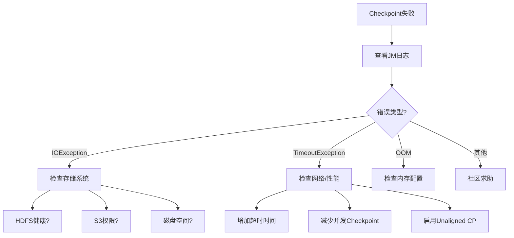

---

### K-03: 状态过大 (Large State)

#### 症状识别

| 症状 | 检测指标 | 阈值建议 |
|------|----------|----------|
| Checkpoint体积大 | Checkpointed Data Size | > 10GB |
| Checkpoint时间长 | Checkpoint Duration | > 5分钟 |
| TM内存压力大 | Heap/RocksDB内存 | > 80% |
| 恢复时间长 | Restore Time | > Checkpoint时长 |

#### 状态优化策略

| 策略 | 实现方式 | 效果 |
|------|----------|------|
| 状态TTL | `StateTtlConfig` | 自动清理过期数据 |
| 增量Checkpoint | `state.backend.incremental: true` | 仅传输变化数据 |
| 状态压缩 | RocksDB压缩配置 | 减少存储体积 |
| 本地恢复 | `state.backend.local-recovery: true` | 加速故障恢复 |
| 状态分片 | 自定义KeyGroup | 并行恢复 |

#### RocksDB调优配置

```yaml
# RocksDB状态后端优化
state.backend: rocksdb
state.backend.incremental: true
state.backend.local-recovery: true

# RocksDB内存调优
state.backend.rocksdb.memory.managed: true
state.backend.rocksdb.memory.fixed-per-slot: 256mb
state.backend.rocksdb.memory.high-prio-pool-ratio: 0.1

# RocksDB线程调优
state.backend.rocksdb.threads.threads-number: 4

# 压缩配置
state.backend.rocksdb.compression: SNAPPY
state.backend.rocksdb.compression-per-level: [NONE, NONE, SNAPPY, SNAPPY]
```

#### 状态监控指标

```java
// 自定义状态大小监控
public class MonitoredFunction extends RichFlatMapFunction<String, Result> {
    private transient ListState<MyState> state;
    private transient Histogram stateSizeHistogram;

    @Override
    public void open(Configuration parameters) {
        state = getRuntimeContext().getListState(new ListStateDescriptor<>("my-state", MyState.class));
        stateSizeHistogram = getRuntimeContext()
            .getMetricGroup()
            .histogram("stateSize", new DropwizardHistogramWrapper(
                new com.codahale.metrics.Histogram(new SlidingWindowReservoir(500))));
    }

    @Override
    public void flatMap(String value, Collector<Result> out) throws Exception {
        // 定期估算状态大小
        Iterable<MyState> states = state.get();
        int count = 0;
        for (MyState s : states) {
            count++;
        }
        stateSizeHistogram.update(count);
    }
}
```

---

### K-04: 恢复失败 (Recovery Failure)

#### 症状识别

| 症状 | 检测位置 | 影响 |
|------|----------|------|
| 作业无法从Checkpoint恢复 | JM日志 | 需要重跑历史数据 |
| State Migration Exception | 启动日志 | 状态不兼容 |
| ClassNotFoundException | 恢复日志 | 类版本不一致 |

#### 恢复失败类型

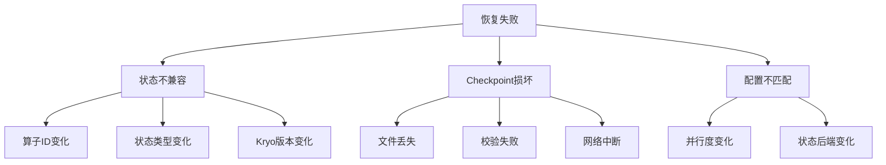

#### 恢复策略

| 场景 | 解决方案 | 命令/配置 |
|------|----------|-----------|
| 算子结构调整 | 指定UID | `.uid("unique-id")` |
| 版本升级 | State Migration | 实现`StateMigration`接口 |
| Checkpoint损坏 | 使用更早Checkpoint | `-s hdfs://path/to/earlier-checkpoint` |
| 并行度变更 | 重新分配 | 使用`--allowNonRestoredState` |

---

## 5. 资源问题排查 (Resource Issues)

### R-01: OOM (Out of Memory)

#### 症状识别

| 症状 | 检测位置 | 错误信息 |
|------|----------|----------|
| JVM OOM | TaskManager日志 | `java.lang.OutOfMemoryError: Java heap space` |
| 直接内存OOM | 日志 | `OutOfMemoryError: Direct buffer memory` |
| Metaspace OOM | 日志 | `OutOfMemoryError: Metaspace` |
| 容器被杀 | K8s事件 | `OOMKilled` |

#### OOM类型分析

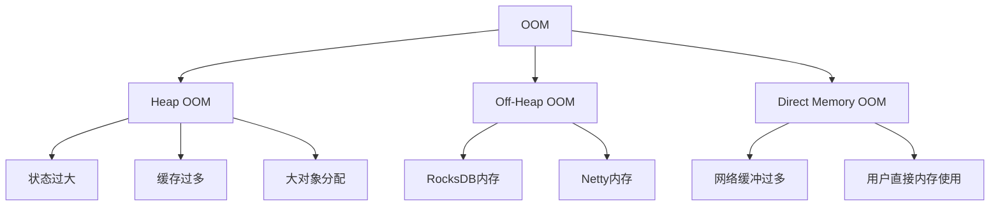

#### OOM解决方案矩阵

| OOM类型 | 快速缓解 | 根本解决 | 配置参数 |
|----------|----------|----------|----------|
| Heap OOM | 增加Heap内存 | 优化状态使用 | `taskmanager.memory.task.heap.size` |
| Off-Heap OOM | 增加Off-Heap内存 | 减少RocksDB内存 | `taskmanager.memory.task.off-heap.size` |
| Direct OOM | 增加直接内存 | 优化网络缓冲 | `taskmanager.memory.network.max` |
| Metaspace OOM | 增加Metaspace | 减少动态类加载 | `taskmanager.memory.jvm-metaspace.size` |

#### 内存配置模板

```yaml
# TaskManager内存配置（总内存 = 框架内存 + 任务内存 + 网络内存 + JVM开销）
taskmanager.memory.process.size: 8gb

# 任务堆内存（用户代码 + 状态）
taskmanager.memory.task.heap.size: 2gb

# 任务Off-Heap内存（RocksDB等）
taskmanager.memory.task.off-heap.size: 2gb

# 网络内存（数据传输缓冲）
taskmanager.memory.network.min: 1gb
taskmanager.memory.network.max: 2gb

# JVM Metaspace
taskmanager.memory.jvm-metaspace.size: 512mb

# JVM开销（栈空间、直接内存等）
taskmanager.memory.jvm-overhead.min: 1gb
taskmanager.memory.jvm-overhead.max: 2gb
```

---

### R-02: GC频繁 (Frequent GC)

#### 症状识别

| 症状 | 检测方法 | 阈值 |
|------|----------|------|
| GC时间占比高 | GC日志 | > 10% |
| 频繁Full GC | GC日志 | > 1次/分钟 |
| 长时间GC暂停 | GC日志 | > 5秒 |
| 吞吐量下降 | 业务指标 | 明显下降 |

#### GC优化策略

| GC算法 | 适用场景 | 配置 | 注意事项 |
|--------|----------|------|----------|
| G1GC | 大堆内存(>4GB) | `-XX:+UseG1GC` | 默认推荐 |
| ZGC | 超低延迟要求 | `-XX:+UseZGC` | JDK 11+ |
| Shenandoah | 低延迟要求 | `-XX:+UseShenandoahGC` | JDK 12+ |
| ParallelGC | 吞吐量优先 | `-XX:+UseParallelGC` | 批处理场景 |

#### G1GC推荐配置

```yaml
# flink-conf.yaml
env.java.opts.taskmanager: >
  -XX:+UseG1GC
  -XX:MaxGCPauseMillis=100
  -XX:+UnlockExperimentalVMOptions
  -XX:+UseCGroupMemoryLimitForHeap
  -XX:+ParallelRefProcEnabled
  -XX:InitiatingHeapOccupancyPercent=35
  -XX:G1HeapRegionSize=16m
  -XX:G1ReservePercent=15
  -XX:+DisableExplicitGC
  -XX:+HeapDumpOnOutOfMemoryError
  -XX:HeapDumpPath=/var/log/flink/heap-dumps/
  -Xlog:gc*:file=/var/log/flink/gc.log::filecount=10,filesize=10m
```

#### GC监控指标

```java
// 自定义GC监控
public class GCMonitor implements Runnable {
    private final MetricGroup metricGroup;

    @Override
    public void run() {
        List<GarbageCollectorMXBean> gcBeans = ManagementFactory.getGarbageCollectorMXBeans();
        for (GarbageCollectorMXBean gcBean : gcBeans) {
            long count = gcBean.getCollectionCount();
            long time = gcBean.getCollectionTime();

            metricGroup.gauge("gc." + gcBean.getName() + ".count", () -> count);
            metricGroup.gauge("gc." + gcBean.getName() + ".time", () -> time);
        }
    }
}
```

---

### R-03: 磁盘不足 (Disk Full)

#### 症状识别

| 症状 | 检测方法 | 常见位置 |
|------|----------|----------|
| 磁盘使用率100% | `df -h` | Checkpoint目录 |
| Checkpoint失败 | 错误日志 | 写入失败 |
| RocksDB错误 | 日志 | SST文件创建失败 |
| 日志写入失败 | 系统日志 | 日志目录满 |

#### 磁盘使用分析

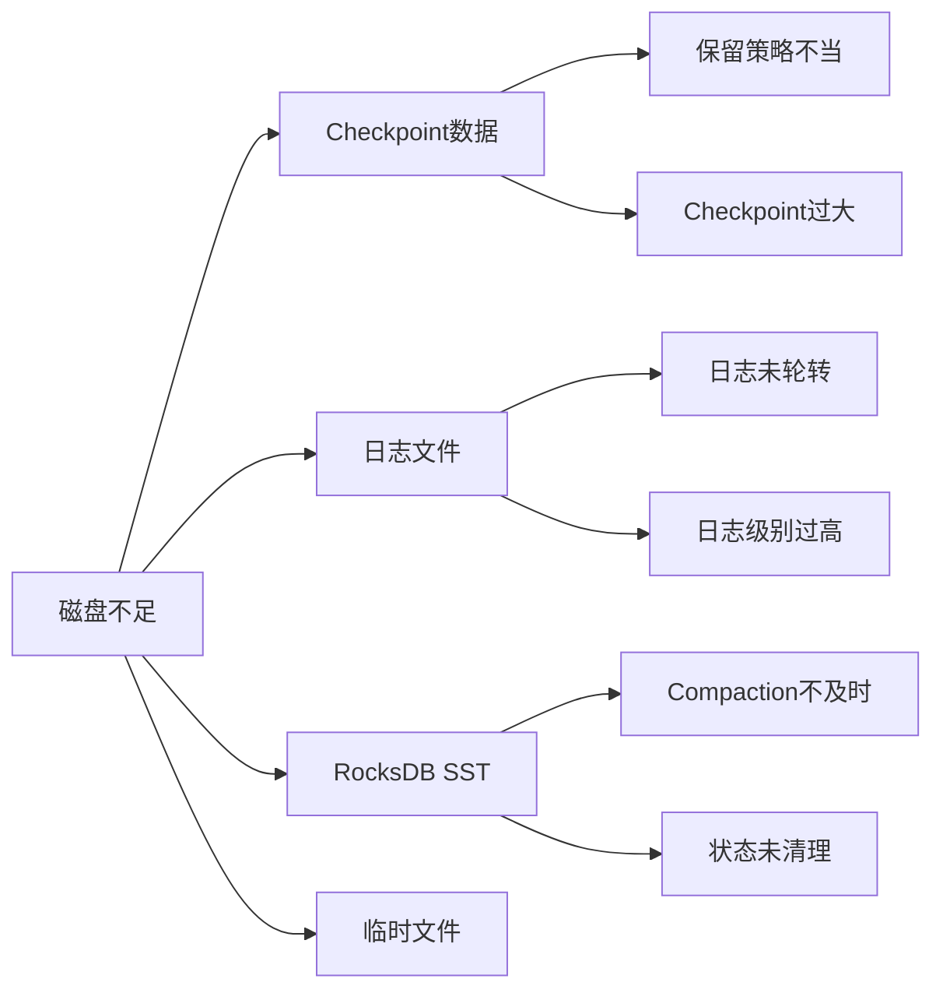

#### 解决方案

| 问题 | 解决方案 | 配置/命令 |
|------|----------|-----------|
| Checkpoint过大 | 清理旧Checkpoint | `execution.checkpointing.max-retained-checkpoints: 10` |
| 日志过大 | 配置日志轮转 | `log4j.properties`中配置`RollingFileAppender` |
| RocksDB膨胀 | 配置TTL | `StateTtlConfig` |
| 临时文件 | 定期清理 | `cron`任务清理`/tmp` |

#### 日志轮转配置

```properties
# log4j.properties
appender.rolling.type = RollingFile
appender.rolling.name = RollingFileAppender
appender.rolling.fileName = ${sys:log.file}
appender.rolling.filePattern = ${sys:log.file}.%i
appender.rolling.layout.type = PatternLayout
appender.rolling.layout.pattern = %d{yyyy-MM-dd HH:mm:ss,SSS} %-5p %-60c %x - %m%n
appender.rolling.policies.type = Policies
appender.rolling.policies.size.type = SizeBasedTriggeringPolicy
appender.rolling.policies.size.size = 500MB
appender.rolling.strategy.type = DefaultRolloverStrategy
appender.rolling.strategy.max = 10
```

---

### R-04: 网络问题 (Network Issues)

#### 症状识别

| 症状 | 检测方法 | 错误表现 |
|------|----------|----------|
| 连接超时 | 日志 | `ConnectionTimeoutException` |
| 连接重置 | 日志 | `ConnectionResetException` |
| 网络分区 | 集群监控 | TaskManager失联 |
| 带宽不足 | 网络监控 | 传输速率低 |

#### 网络问题诊断

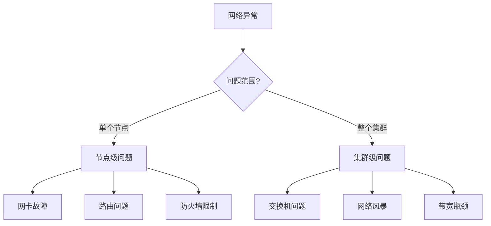

#### 网络优化配置

```yaml
# Flink网络配置
# 网络缓冲（背压控制）
taskmanager.memory.network.fraction: 0.15
taskmanager.memory.network.min: 1gb
taskmanager.memory.network.max: 4gb

# 网络超时
akka.ask.timeout: 30s
akka.lookup.timeout: 30s
akka.client.timeout: 60s

# 重试配置
akka.transport.heartbeat.interval: 10s
akka.transport.heartbeat.pause: 60s
akka.transport.heartbeat.threshold: 12

# 数据压缩（带宽受限场景）
execution.checkpointing.enable-unnecessary-channels-compression: true
pipeline.compression: LZ4
blob.fetch.backlog: 1000
blob.fetch.num-concurrent: 50
```

---

## 6. 应急处理手册

### 6.1 紧急恢复流程

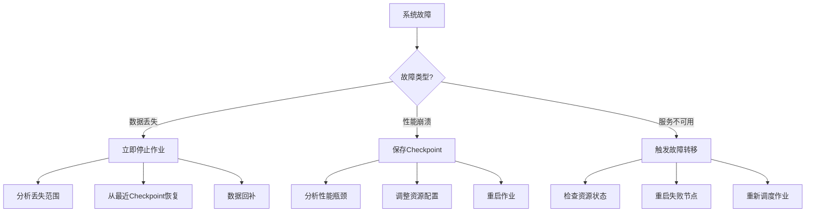

### 6.2 常用诊断命令

```bash
#!/bin/bash
# Flink故障诊断脚本

echo "=== Flink集群健康检查 ==="

# 1. 检查JobManager
echo "--- JobManager状态 ---"
curl -s http://localhost:8081/config | jq .

# 2. 检查TaskManager
echo "--- TaskManager列表 ---"
curl -s http://localhost:8081/taskmanagers | jq '.taskmanagers[] | {id, slotsNumber, freeSlots, cpuCores, physicalMemory}'

# 3. 检查正在运行的作业
echo "--- 运行中作业 ---"
curl -s http://localhost:8081/jobs | jq '.jobs[] | select(.status == "RUNNING")'

# 4. 检查Checkpoint状态
echo "--- Checkpoint状态 ---"
JOB_ID=$(curl -s http://localhost:8081/jobs | jq -r '.jobs[0].id')
curl -s http://localhost:8081/jobs/${JOB_ID}/checkpoints | jq '{counts: .counts, latest: .latest}'

# 5. 检查背压
echo "--- 背压状态 ---"
curl -s http://localhost:8081/jobs/${JOB_ID}/vertices | jq '.vertices[] | {id, name, metrics: .metrics}'

echo "=== 检查完成 ==="
```

### 6.3 快速修复清单

| 问题 | 快速修复 | 持久修复 |
|------|----------|----------|
| 延迟飙升 | 增加并行度 | 优化处理逻辑 |
| Checkpoint失败 | 增加超时时间 | 优化状态/存储 |
| OOM | 增加内存 | 内存泄漏排查 |
| 背压严重 | 增加Buffer | 消除瓶颈算子 |
| 数据丢失 | 启用Exactly-Once | 端到端对账 |

---

## 7. 监控告警配置

### 7.1 关键指标监控

```yaml
# 推荐监控指标配置
metrics:
  # 延迟指标
  - name: flink_jobmanager_job_latency
    threshold: "> 10000"  # 10秒
    severity: warning

  - name: flink_taskmanager_job_task_backPressuredTimeMsPerSecond
    threshold: "> 200"    # 20%时间背压
    severity: critical

  # Checkpoint指标
  - name: flink_jobmanager_job_numberOfFailedCheckpoints
    threshold: "> 0"
    severity: critical

  - name: flink_jobmanager_job_lastCheckpointDuration
    threshold: "> 60000"  # 60秒
    severity: warning

  # 资源指标
  - name: flink_taskmanager_Status_JVM_Memory_Heap_Used
    threshold: "> 0.8"    # 80%堆内存
    severity: warning

  - name: flink_taskmanager_Status_JVM_GarbageCollector_G1_Young_Generation_Time
    threshold: "> 5000"   # 5秒GC时间
    severity: critical
```

### 7.2 日志关键字监控

| 关键字 | 级别 | 含义 | 响应动作 |
|--------|------|------|----------|
| `OutOfMemoryError` | CRITICAL | 内存溢出 | 立即扩容/重启 |
| `Checkpoint expired` | WARNING | Checkpoint超时 | 调整配置 |
| `BackPressure` | WARNING | 背压警告 | 性能优化 |
| `Connection refused` | WARNING | 连接失败 | 检查网络/服务 |
| `State migration` | INFO | 状态迁移 | 监控恢复进度 |

---

## 8. 参考与附录

### 8.1 Flink版本兼容性

| Flink版本 | 推荐JDK | 推荐Scala | 状态后端 |
|-----------|---------|-----------|----------|
| 1.17+ | JDK 11/17 | 2.12/2.13 | RocksDB |
| 1.15-1.16 | JDK 11 | 2.12 | RocksDB/Heap |
| 1.13-1.14 | JDK 8/11 | 2.12 | RocksDB |

### 8.2 相关文档链接

- [Flink官方文档 - 调优指南](https://nightlies.apache.org/flink/flink-docs-stable/docs/ops/tuning/)
- [Flink官方文档 - Checkpoint故障排查](https://nightlies.apache.org/flink/flink-docs-stable/docs/ops/state/checkpointing_under_backpressure/)
- [RocksDB调优指南](https://github.com/facebook/rocksdb/wiki/RocksDB-Tuning-Guide)

---

## 更新记录

| 版本 | 日期 | 更新内容 | 作者 |
|------|------|----------|------|
| v1.0 | 2026-04-03 | 初始版本，包含完整故障排查体系 | Kimi Code |

---

*本手册基于Apache Flink 1.17+版本编写，部分内容适用于其他流计算系统*
