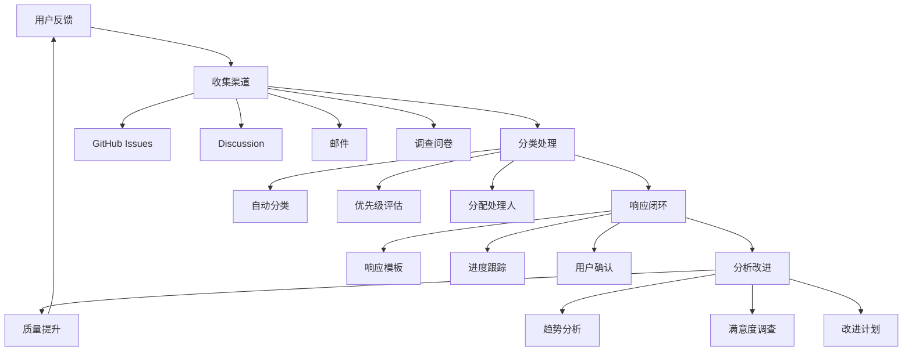
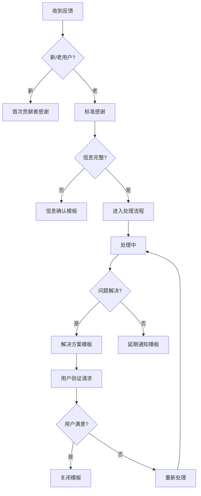

# 用户反馈系统指南

> 所属阶段: 社区运营 | 前置依赖: 无 | 形式化等级: L3

本文档全面介绍项目的用户反馈收集和处理系统，包括反馈渠道、处理流程、分析工具和最佳实践。

---

## 系统概览



---

## 1. 反馈收集渠道

### 1.1 渠道统计

| 渠道 | 类型 | 适用场景 | 响应时间 | 状态 |
|------|------|----------|----------|------|
| GitHub Issues | 正式 | Bug 报告、功能建议 | 48h | ✅ 已启用 |
| GitHub Discussions | 正式 | 一般讨论、问答 | 72h | ✅ 已启用 |
| 邮件反馈 | 正式 | 私密反馈、商业合作 | 48h | ✅ 已启用 |
| 用户调查 | 定期 | 满意度评估 | 周期性 | ✅ 已启用 |
| 即时通讯 | 社区 | 快速交流 | 非正式 | 🔄 规划中 |

**反馈收集渠道总数: 5 个**

### 1.2 GitHub Issue 模板

项目提供多种 Issue 模板，引导用户提供结构化反馈：

| 模板 | 用途 | 文件 |
|------|------|------|
| Bug 报告 | 报告功能错误 | `bug_report.yml` |
| 功能建议 | 提出新功能 | `feature_request.yml` |
| 文档改进 | 文档相关反馈 | `doc_improvement.yml` |
| 用户反馈 | 综合反馈收集 | `user_feedback.yml` |
| 生产案例 | 生产环境验证 | `production_case.yml` |

**核心反馈模板**: [`.github/ISSUE_TEMPLATE/user_feedback.yml`](./.github/ISSUE_TEMPLATE/user_feedback.yml)

主要功能：

- 反馈类型选择（Bug/功能/文档/体验等）
- 用户身份识别（学术/工业/学习）
- 使用场景描述
- 改进建议收集
- 多维度评分系统（总体/内容/易用性）
- 联系方式收集（可选）

### 1.3 用户满意度调查

**年度调查文档**: [`community/user-survey-2026.md`](./community/user-survey-2026.md)

调查维度：

- 基本信息（使用目的、身份背景）
- 内容质量评分（准确性、深度、实用性）
- 使用体验评分（导航、搜索、可读性）
- 特色功能评价（知识图谱、定理依赖、AI 助手）
- NPS 推荐度评分
- 开放性问题

---

## 2. 反馈处理流程

### 2.1 流程步骤

**处理流程步骤总数: 10 步**

```
1. 反馈提交 → 2. 自动分类 → 3. 人工审核 → 4. 分类确认
   ↓
5. 优先级评估 → 6. 分配处理人 → 7. 处理实施
   ↓
8. 质量检查 → 9. 用户通知 → 10. 闭环确认
```

详细流程见: [`docs/feedback-handling-process.md`](./docs/feedback-handling-process.md)

### 2.2 分类体系

#### 按类型分类

```
反馈类型
├── 🐛 Bug 报告 (内容错误/链接失效/格式问题)
├── ✨ 功能建议 (新内容/功能增强/流程优化)
├── 📚 文档反馈 (不清晰/缺示例/翻译/结构)
├── 🎨 用户体验 (导航/搜索/视觉/交互)
├── ⚡ 性能反馈 (速度/响应/资源)
└── 🤔 使用困惑 (概念/查找/流程)
```

#### 按优先级分类

| 优先级 | 定义 | 处理时限 | 响应时间 |
|--------|------|----------|----------|
| P0 | 严重影响使用 | 24 小时 | 4 小时 |
| P1 | 重要功能问题 | 3 天 | 24 小时 |
| P2 | 一般改进建议 | 7 天 | 48 小时 |
| P3 | 优化建议 | 14 天 | 72 小时 |

### 2.3 SLA 承诺

| 阶段 | P0 | P1 | P2 | P3 |
|------|----|----|----|----|
| 首次响应 | 4h | 24h | 48h | 72h |
| 方案提供 | 24h | 72h | 7d | 14d |
| 问题解决 | 72h | 7d | 14d | 30d |

---

## 3. 反馈分析工具

### 3.1 分析功能说明

**分析功能总数: 8 项**

| 功能 | 说明 | 输出 |
|------|------|------|
| 自动分类 | 基于关键词和规则自动分类反馈 | 分类标签 |
| 关键词提取 | 从反馈中提取高频关键词 | 词频统计 |
| 情感分析 | 分析反馈的情感倾向 | 正/负/中性 |
| 优先级评分 | 计算反馈的优先级分数 | 0-100 分 |
| 趋势分析 | 按时间维度分析反馈趋势 | 时间序列图 |
| 分类统计 | 统计各类型反馈数量 | 分布图表 |
| 高优先级识别 | 识别需要优先处理的反馈 | 优先列表 |
| 报告生成 | 生成可视化分析报告 | HTML/JSON |

### 3.2 分析脚本

**脚本位置**: [`.scripts/feedback-analyzer.py`](./.scripts/feedback-analyzer.py)

使用方法：

```bash
# 生成文本报告
python .scripts/feedback-analyzer.py --input issues.json --format text

# 生成 HTML 可视化报告
python .scripts/feedback-analyzer.py --input issues.json --format html --output report.html

# 导出 JSON 数据
python .scripts/feedback-analyzer.py --input issues.json --format json --output analysis.json
```

### 3.3 分析示例

```
📊 总体统计
----------------------------------------
总反馈数: 156
平均优先级: 62.3/100
高优先级反馈: 23 条

📁 分类分布
  bug            :  45 ( 28.8%)
  feature        :  38 ( 24.4%)
  documentation  :  32 ( 20.5%)
  usability      :  25 ( 16.0%)
  other          :  16 ( 10.3%)

😊 情感分布
  positive   :  89 ( 57.1%)
  neutral    :  52 ( 33.3%)
  negative   :  15 (  9.6%)

🔥 热门关键词 TOP 5
  Flink         :  42
  知识图谱      :  28
  Checkpoint    :  24
  定理证明      :  19
  学习路径      :  17
```

---

## 4. 响应模板体系

### 4.1 模板类型

**响应模板总数: 20+ 个**

详见: [`docs/feedback-response-templates.md`](./docs/feedback-response-templates.md)

| 类别 | 模板数量 | 用途 |
|------|----------|------|
| 感谢模板 | 3 | 首次响应、详细反馈、新贡献者 |
| 确认模板 | 3 | 信息确认、问题复述、关联问题 |
| 解决模板 | 4 | 已修复、已实现、替代方案、部分解决 |
| 跟进模板 | 4 | 进展更新、延期通知、定期跟进、验证请求 |
| 婉拒模板 | 4 | 超出范围、技术限制、重复、无效 |
| 特殊模板 | 3 | 升级通知、社区邀请、关闭 Issue |

### 4.2 模板使用流程



---

## 5. 度量与改进

### 5.1 关键指标

| 指标 | 目标值 | 当前值 | 监控频率 |
|------|--------|--------|----------|
| 首次响应时间 | < 24h | 待统计 | 每日 |
| 问题解决时间 | < 7d | 待统计 | 每周 |
| 用户满意度 | > 90% | 待调查 | 每月 |
| 闭环率 | > 95% | 待统计 | 每月 |
| 分类准确率 | > 85% | 待评估 | 每季 |

### 5.2 报告体系

| 报告类型 | 周期 | 内容 | 受众 |
|----------|------|------|------|
| 反馈日报 | 每日 | 新增反馈、超期提醒 | 维护团队 |
| 反馈周报 | 每周 | 处理统计、趋势分析 | 项目团队 |
| 满意度月报 | 每月 | 综合质量、改进建议 | 社区 |
| 年度报告 | 每年 | 全年总结、规划展望 | 全体用户 |

---

## 6. 最佳实践

### 6.1 提交反馈的建议

**作为反馈提交者**：

1. **使用正确的模板** - 选择合适的 Issue 模板
2. **提供详细信息** - 包括环境、重现步骤、预期结果
3. **一个 Issue 一个问题** - 便于跟踪和处理
4. **搜索重复问题** - 提交前先搜索是否已有类似 Issue
5. **保持礼貌和耐心** - 维护者也是志愿者

### 6.2 处理反馈的建议

**作为反馈处理者**：

1. **及时响应** - 即使暂时无法处理，也要先确认收到
2. **保持透明** - 公开处理进展和决策原因
3. **使用模板** - 确保沟通专业一致
4. **闭环管理** - 确保问题真正解决并获得用户确认
5. **持续改进** - 从反馈中学习，优化产品和流程

---

## 7. 系统路线图

### 7.1 已完成功能 ✅

- [x] GitHub Issue 反馈模板
- [x] 用户满意度调查问卷
- [x] 反馈处理流程文档
- [x] 响应模板体系
- [x] 自动分析脚本

### 7.2 进行中功能 🔄

- [ ] 分析仪表盘开发
- [ ] 自动分类准确率优化
- [ ] 反馈数据可视化

### 7.3 规划功能 📋

- [ ] 实时反馈通知
- [ ] 用户反馈积分系统
- [ ] 智能推荐相关 Issue
- [ ] 多语言反馈支持

---

## 8. 相关资源

### 8.1 文档链接

| 文档 | 路径 | 说明 |
|------|------|------|
| 反馈收集模板 | `.github/ISSUE_TEMPLATE/user_feedback.yml` | GitHub Issue 表单 |
| 处理流程 | `docs/feedback-handling-process.md` | 完整处理流程 |
| 分析脚本 | `.scripts/feedback-analyzer.py` | 自动化分析工具 |
| 用户调查 | `community/user-survey-2026.md` | 满意度调查问卷 |
| 响应模板 | `docs/feedback-response-templates.md` | 标准响应模板 |

### 8.2 快速链接

- [提交新反馈]
- [查看所有反馈]
- [参与用户调查](./community/user-survey-2026.md)

---

## 9. 联系方式

如有关于反馈系统的建议或问题，请通过以下方式联系：

- **GitHub Issues**: [提交反馈]
- **GitHub Discussions**: [参与讨论]
- **项目维护团队**: 通过 Issue @maintainers

---

## 10. 总结

本用户反馈系统建立了完整的 **收集 → 处理 → 分析 → 改进** 闭环：

| 维度 | 数量/指标 |
|------|-----------|
| 反馈收集渠道 | **5 个** |
| 处理流程步骤 | **10 步** |
| 分析功能 | **8 项** |
| 响应模板 | **20+ 个** |
| Issue 模板 | **6 个** |
| 目标响应时间 | **< 24h** |
| 目标满意度 | **> 90%** |

通过系统化的反馈管理，我们能够：

1. **及时响应** 用户需求和问题
2. **持续改进** 项目质量和体验
3. **建立信任** 与用户保持良好关系
4. **数据驱动** 做出明智的决策

---

*本文档版本: v1.0 | 最后更新: 2026-04-12 | 状态: 已启用*
