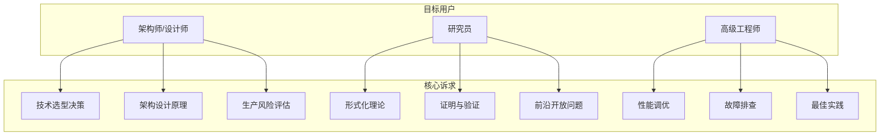
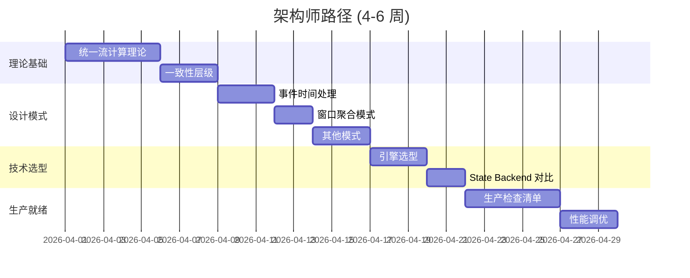
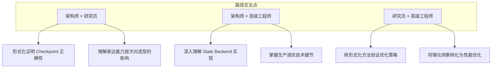

> **状态**: 🔮 前瞻内容 | **风险等级**: 高 | **最后更新**: 2026-04
>
> 此文档描述的内容处于早期规划阶段，可能与最终实现不符。请以 Apache Flink 官方发布为准。
>
# AnalysisDataFlow 用户旅程地图

> **版本**: v1.0 | **生效日期**: 2026-04-05 | **状态**: 正式发布
>
> 本文档定义三类核心用户的导航路径，确保不同背景的读者都能高效找到所需内容。

---

## 1. 用户角色定义

### 1.1 角色矩阵



### 1.2 角色画像

| 属性 | 架构师/设计师 | 研究员 | 高级工程师 |
|------|--------------|--------|------------|
| **典型职位** | 首席架构师、技术总监 | 博士生、研究科学家 | Staff Engineer、技术专家 |
| **经验水平** | 10+ 年分布式系统经验 | 深厚的理论背景 | 5+ 年流处理实战经验 |
| **时间预算** | 有限，需要高效决策 | 充足，追求深度理解 | 中等，解决具体问题 |
| **阅读偏好** | 结论先行，支持材料可深入 | 严格论证，完整证明 | 实用导向，可运行代码 |
| **成功标准** | 做出正确技术决策 | 发表研究或理解机制 | 解决生产问题 |

---

## 2. 架构师/设计师路径

### 2.1 路径概览

```
┌─────────────────────────────────────────────────────────────────────────┐
│                      架构师学习路径 (4 阶段)                              │
├─────────────────────────────────────────────────────────────────────────┤
│                                                                          │
│  阶段 1: 理论基础              阶段 2: 设计模式                           │
│  ━━━━━━━━━━━━━━━━━━━           ━━━━━━━━━━━━━━━━━━━                        │
│  • 统一流计算理论              • 事件时间处理模式                         │
│  • 表达能力层次                • 窗口聚合模式                             │
│  • 一致性层级                  • 状态计算模式                             │
│                                                                          │
│  阶段 3: 技术选型              阶段 4: 生产就绪                           │
│  ━━━━━━━━━━━━━━━━━━━           ━━━━━━━━━━━━━━━━━━━                        │
│  • 引擎选型决策树              • 生产检查清单                             │
│  • Flink vs 竞品对比           • 性能调优指南                             │
│  • State Backend 对比          • 故障排查手册                             │
│                                                                          │
└─────────────────────────────────────────────────────────────────────────┘
```

### 2.2 阶段详解

#### 阶段 1: 理论基础 (1-2 周)

**目标**: 建立流计算的形式化理解框架

| 优先级 | 文档 | 预计时间 | 关键产出 |
|--------|------|----------|----------|
| P0 | [统一流计算理论](Struct/01-foundation/01.01-unified-streaming-theory.md) | 4-6h | 理解六层表达能力层次 |
| P1 | [一致性层级](../02-properties/02.02-consistency-hierarchy.md) | 2-3h | 掌握一致性模型选择 |
| P2 | [表达能力层次](Struct/03-relationships/03.03-expressiveness-hierarchy.md) | 2h | 理解模型间的表达能力关系 |

**关键问题清单**:

- [ ] 我的场景需要 L4 (Mobile) 还是 L3 (Process Algebra) 表达能力？
- [ ] 业务对一致性要求属于哪个层级？
- [ ] 不同时间语义对结果确定性的影响？

---

#### 阶段 2: 设计模式 (1-2 周)

**目标**: 掌握流处理核心设计模式

| 优先级 | 文档 | 预计时间 | 关键产出 |
|--------|------|----------|----------|
| P0 | [事件时间处理模式](Knowledge/02-design-patterns/pattern-event-time-processing.md) | 3-4h | 理解 Watermark 与乱序处理 |
| P0 | [窗口聚合模式](Knowledge/02-design-patterns/pattern-windowed-aggregation.md) | 2-3h | 掌握窗口类型选择 |
| P1 | [状态计算模式](Knowledge/02-design-patterns/pattern-stateful-computation.md) | 2h | 理解状态管理设计 |
| P2 | [异步 IO 模式](Knowledge/02-design-patterns/pattern-async-io-enrichment.md) | 1-2h | 掌握外部系统交互模式 |

**架构决策检查点**:

- [ ] 事件时间 vs 处理时间的选择依据？
- [ ] Watermark 生成策略与业务延迟容忍度的匹配？
- [ ] 窗口类型的语义需求分析？

---

#### 阶段 3: 技术选型 (1 周)

**目标**: 基于场景做出技术选型决策

| 优先级 | 文档 | 预计时间 | 关键产出 |
|--------|------|----------|----------|
| P0 | [引擎选型决策指南](Knowledge/04-technology-selection/engine-selection-guide.md) | 3-4h | 完成技术选型决策 |
| P1 | [Flink vs RisingWave](Knowledge/04-technology-selection/flink-vs-risingwave.md) | 2h | 理解现代流引擎对比 |
| P1 | [State Backend 深度对比](Flink/02-core/state-backends-deep-comparison.md) | 2h | 确定状态后端选择 |
| P2 | [存储选型指南](Knowledge/04-technology-selection/storage-selection-guide.md) | 1h | 确定存储方案 |

**技术选型决策树**:

```
开始
  │
  ├─ 需要 Exactly-Once 语义？
  │     ├─ 是 → 考虑 Flink / RisingWave
  │     └─ 否 → 考虑 Kafka Streams / Spark Streaming
  │
  ├─ 状态大小？
  │     ├─ < 100MB → HashMapStateBackend
  │     ├─ 100MB - 10GB → RocksDBStateBackend
  │     └─ > 10GB → ForSt StateBackend (Flink 2.0+)
  │
  └─ 延迟要求？
        ├─ < 100ms → 纯流处理引擎
        └─ > 1s → 可考虑微批处理
```

---

#### 阶段 4: 生产就绪 (持续)

**目标**: 确保生产部署的成功与稳定

| 优先级 | 文档 | 预计时间 | 关键产出 |
|--------|------|----------|----------|
| P0 | [Flink 生产检查清单](Knowledge/07-best-practices/07.01-flink-production-checklist.md) | 4-6h | 完成 150+ 项检查 |
| P1 | [性能调优模式](Knowledge/07-best-practices/07.02-performance-tuning-patterns.md) | 2-3h | 建立调优框架 |
| P2 | [故障排查指南](Knowledge/07-best-practices/07.03-troubleshooting-guide.md) | 2h | 建立问题诊断能力 |
| P2 | [反模式识别](Knowledge/09-anti-patterns/) | 1-2h | 规避常见陷阱 |

**生产检查清单关键项**:

- [ ] Checkpoint 配置合理性验证
- [ ] 资源预估与容量规划
- [ ] 监控告警体系搭建
- [ ] 故障恢复流程演练

---

### 2.3 架构师路径时间线



---

## 3. 研究员路径

### 3.1 路径概览

```
┌─────────────────────────────────────────────────────────────────────────┐
│                       研究员学习路径 (3 阶段)                             │
├─────────────────────────────────────────────────────────────────────────┤
│                                                                          │
│  阶段 1: 进程演算基础          阶段 2: 表达能力层次                       │
│  ━━━━━━━━━━━━━━━━━━━━━━━       ━━━━━━━━━━━━━━━━━━━━━━━                    │
│  • CSP 形式化                  • 模型间编码关系                           │
│  • Actor 模型形式化            • 互模拟等价性                             │
│  • π-calculus 基础             • 表达能力判定定理                         │
│  • 会话类型                    • Flink 的表达能力定位                     │
│                                                                          │
│  阶段 3: 前沿开放问题                                                     │
│  ━━━━━━━━━━━━━━━━━━━━━━━                                                  │
│  • 流验证开放问题                                                         │
│  • 编排式流编程                                                           │
│  • AI Agent 会话类型                                                      │
│  • 路径依赖类型                                                           │
│                                                                          │
└─────────────────────────────────────────────────────────────────────────┘
```

### 3.2 阶段详解

#### 阶段 1: 进程演算基础 (2-3 周)

**目标**: 建立严格的并发理论基础

| 优先级 | 文档 | 预计时间 | 关键产出 |
|--------|------|----------|----------|
| P0 | [进程演算入门](Struct/01-foundation/01.02-process-calculus-primer.md) | 6-8h | 掌握 CSP/CCS 基础 |
| P0 | [Actor 模型形式化](../01-foundation/01.03-actor-model-formalization.md) | 4-6h | 理解 Actor 语义 |
| P1 | [CSP 形式化](Struct/01-foundation/01.05-csp-formalization.md) | 4h | 掌握 CSP 代数法则 |
| P2 | [会话类型](Struct/01-foundation/01.07-session-types.md) | 4h | 理解会话类型理论 |

**理论准备检查点**:

- [ ] 理解进程等价关系（强互模拟、弱互模拟）
- [ ] 掌握迹语义 (Trace Semantics) 与故障语义
- [ ] 理解移动性 (Mobility) 与名称传递

---

#### 阶段 2: 表达能力层次 (2-3 周)

**目标**: 理解流计算模型的理论定位

| 优先级 | 文档 | 预计时间 | 关键产出 |
|--------|------|----------|----------|
| P0 | [表达能力层次](Struct/03-relationships/03.03-expressiveness-hierarchy.md) | 6-8h | 掌握 L1-L6 层次结构 |
| P0 | [Actor 到 CSP 编码](Struct/03-relationships/03.01-actor-to-csp-encoding.md) | 4h | 理解跨模型编码 |
| P1 | [互模拟等价性](Struct/03-relationships/03.04-bisimulation-equivalences.md) | 4h | 掌握等价关系证明 |
| P2 | [Flink 到进程演算](Struct/03-relationships/03.02-flink-to-process-calculus.md) | 4h | 理解 Flink 的语义映射 |

**核心定理清单**:

- [ ] Thm-S-03-01: 表达能力层次的严格包含性
- [ ] Thm-S-03-02: Actor 到 CSP 的编码完备性
- [ ] Thm-S-03-03: Flink 表达能力的层次判定

---

#### 阶段 3: 前沿开放问题 (持续)

**目标**: 探索流计算研究前沿

| 优先级 | 文档 | 预计时间 | 关键产出 |
|--------|------|----------|----------|
| P0 | [流验证开放问题](Struct/06-frontier/06.01-open-problems-streaming-verification.md) | 4-6h | 了解研究前沿 |
| P1 | [编排式流编程](Struct/06-frontier/06.02-choreographic-streaming-programming.md) | 3-4h | 理解新兴范式 |
| P2 | [AI Agent 会话类型](Struct/06-frontier/06.03-ai-agent-session-types.md) | 2h | 跨领域探索 |
| P2 | [路径依赖类型](Struct/06-frontier/06.04-pdot-path-dependent-types.md) | 2h | 类型理论前沿 |

**研究问题推荐**:

1. 如何形式化验证 Flink Checkpoint 的优化变体？
2. 流处理系统中渐进类型 (Gradual Typing) 的可行性？
3. AI Agent 工作流的形式化语义？

---

### 3.3 研究员路径特色资源

| 资源类型 | 推荐内容 | 用途 |
|----------|----------|------|
| **验证工具** | [TLA+ for Flink](Struct/07-tools/tla-for-flink.md) | 模型检验实践 |
| **定理证明** | [Coq 机械化](Struct/07-tools/coq-mechanization.md) | 严格形式化证明 |
| **分离逻辑** | [Iris 分离逻辑](Struct/07-tools/iris-separation-logic.md) | 并发程序验证 |
| **轻量验证** | [Smart Casual](Struct/07-tools/smart-casual-verification.md) | 工业级验证方法 |

---

## 4. 高级工程师路径

### 4.1 路径概览

```
┌─────────────────────────────────────────────────────────────────────────┐
│                     高级工程师学习路径 (4 阶段)                           │
├─────────────────────────────────────────────────────────────────────────┤
│                                                                          │
│  阶段 1: Flink 核心机制        阶段 2: 性能调优                           │
│  ━━━━━━━━━━━━━━━━━━━━━━━       ━━━━━━━━━━━━━━━━━━━━━━━                    │
│  • Checkpoint 深度剖析         • 性能调优模式                             │
│  • Exactly-Once 语义           • State Backend 优化                       │
│  • Watermark 与时间语义        • 网络栈调优                               │
│  • 状态管理原理                • JVM GC 优化                              │
│                                                                          │
│  阶段 3: 故障排查              阶段 4: 最佳实践                           │
│  ━━━━━━━━━━━━━━━━━━━━━━━       ━━━━━━━━━━━━━━━━━━━━━━━                    │
│  • 常见问题诊断                • 生产检查清单                             │
│  • 反模式识别                  • 测试策略                                 │
│  • 性能瓶颈定位                • 安全加固                                 │
│  • 恢复流程                    • 成本优化                                 │
│                                                                          │
└─────────────────────────────────────────────────────────────────────────┘
```

### 4.2 阶段详解

#### 阶段 1: Flink 核心机制 (2-3 周)

**目标**: 深入理解 Flink 内部机制

| 优先级 | 文档 | 预计时间 | 关键产出 |
|--------|------|----------|----------|
| P0 | [Checkpoint 机制深度剖析](Flink/02-core/checkpoint-mechanism-deep-dive.md) | 6-8h | 掌握 Checkpoint 原理 |
| P0 | [Exactly-Once 语义](Flink/02-core/exactly-once-semantics-deep-dive.md) | 4-6h | 理解端到端一致性 |
| P1 | [时间语义与 Watermark](Flink/02-core/time-semantics-and-watermark.md) | 3-4h | 掌握时间处理 |
| P1 | [State Backend 对比](Flink/02-core/state-backends-deep-comparison.md) | 3h | 理解状态管理 |

**动手实验清单**:

- [ ] 实现自定义 Checkpoint Listener 观察 Barrier 传播
- [ ] 对比 Aligned vs Unaligned Checkpoint 的性能差异
- [ ] 构造 Watermark 延迟场景观察窗口触发行为

---

#### 阶段 2: 性能调优 (1-2 周)

**目标**: 掌握 Flink 性能优化技术

| 优先级 | 文档 | 预计时间 | 关键产出 |
|--------|------|----------|----------|
| P0 | [性能调优模式](Knowledge/07-best-practices/07.02-performance-tuning-patterns.md) | 4-6h | 建立调优方法论 |
| P1 | [反压与流量控制](Flink/02-core/backpressure-and-flow-control.md) | 3h | 掌握反压处理 |
| P2 | [流处理成本优化](Flink/09-practices/09.03-performance-tuning/stream-processing-cost-optimization.md) | 2h | 理解成本优化 |

**调优检查清单**:

- [ ] Checkpoint 间隔与超时配置优化
- [ ] 并行度与槽位配置合理性
- [ ] 状态后端的 RocksDB 参数调优
- [ ] 网络缓冲区与序列化优化

---

#### 阶段 3: 故障排查 (1 周)

**目标**: 建立系统的问题诊断能力

| 优先级 | 文档 | 预计时间 | 关键产出 |
|--------|------|----------|----------|
| P0 | [故障排查指南](Knowledge/07-best-practices/07.03-troubleshooting-guide.md) | 4h | 掌握诊断方法 |
| P0 | [反模式识别](Knowledge/09-anti-patterns/) | 3h | 规避常见陷阱 |
| P1 | [可观测性完整指南](Flink/04-runtime/04.03-observability/flink-observability-complete-guide.md) | 2h | 建立监控体系 |

**故障诊断流程**:

```
问题发现
   │
   ├─ 查看 Flink Web UI 指标
   │     ├─ Checkpoint 状态
   │     ├─ 反压指示器
   │     └─ 延迟指标
   │
   ├─ 分析日志模式
   │     ├─ Exception 堆栈
   │     ├─ GC 日志
   │     └─ 网络层日志
   │
   └─ 定位根因
         ├─ 资源不足？
         ├─ 配置错误？
         ├─ 数据倾斜？
         └─ 外部系统问题？
```

---

#### 阶段 4: 最佳实践 (持续)

**目标**: 建立生产级开发规范

| 优先级 | 文档 | 预计时间 | 关键产出 |
|--------|------|----------|----------|
| P0 | [生产检查清单](Knowledge/07-best-practices/07.01-flink-production-checklist.md) | 4h | 完成检查清单 |
| P1 | [测试策略](Knowledge/07-best-practices/07.07-testing-strategies-complete.md) | 3h | 建立测试体系 |
| P2 | [安全加固](Knowledge/07-best-practices/07.05-security-hardening-guide.md) | 2h | 安全最佳实践 |

---

## 5. 路径交叉与推荐组合

### 5.1 交叉学习推荐



### 5.2 推荐组合路径

| 组合 | 适用场景 | 推荐路径 |
|------|----------|----------|
| **架构师 + 研究员** | 学术型架构师、技术负责人 | 理论基础 → 表达能力层次 → 技术选型 |
| **架构师 + 高级工程师** | 实战型架构师 | 核心机制 → 技术选型 → 生产就绪 |
| **全栈路径** | 技术领袖、CTO | 理论基础 → 核心机制 → 生产就绪 → 前沿探索 |

---

## 6. 快速入口

### 6.1 按问题类型快速导航

| 问题类型 | 推荐起点 | 预计解决时间 |
|----------|----------|--------------|
| "我该选哪个流处理引擎？" | [引擎选型指南](Knowledge/04-technology-selection/engine-selection-guide.md) | 1-2h |
| "Checkpoint 为什么超时？" | [故障排查指南](Knowledge/07-best-practices/07.03-troubleshooting-guide.md) | 30min |
| "如何保证 Exactly-Once？" | [Exactly-Once 语义](Flink/02-core/exactly-once-semantics-deep-dive.md) | 2h |
| "Watermark 该怎么配？" | [事件时间处理模式](Knowledge/02-design-patterns/pattern-event-time-processing.md) | 1h |
| "状态后端怎么选？" | [State Backend 对比](Flink/02-core/state-backends-deep-comparison.md) | 1h |
| "Checkpoint 原理是什么？" | [Checkpoint 正确性证明](Struct/04-proofs/04.01-flink-checkpoint-correctness.md) | 2-3h |

### 6.2 学习时长估算

| 路径 | 快速入门 | 全面掌握 | 精通 |
|------|----------|----------|------|
| 架构师路径 | 1 周 | 4-6 周 | 3 个月+ |
| 研究员路径 | 2 周 | 6-8 周 | 6 个月+ |
| 高级工程师路径 | 1 周 | 3-4 周 | 2 个月+ |

---

## 7. 总结

### 7.1 路径选择指南

```
┌────────────────────────────────────────────────────────────────┐
│                                                                │
│   选择你的路径：                                                │
│                                                                │
│   ━━━━━━━━━━━━━━━━━━━━━━━━━━━━━━━━━━━━━━━━━━━━━━━━━━━━━━━━━━━  │
│                                                                │
│   你是架构师/技术负责人？                                        │
│   → 架构师路径：理论 → 模式 → 选型 → 生产                       │
│                                                                │
│   你是研究员/博士生？                                           │
│   → 研究员路径：进程演算 → 表达能力 → 开放问题                   │
│                                                                │
│   你是高级工程师/技术专家？                                      │
│   → 高级工程师路径：核心机制 → 调优 → 排查 → 最佳实践            │
│                                                                │
└────────────────────────────────────────────────────────────────┘
```

### 7.2 下一步行动

1. **确定你的角色**: 根据职位和经验选择合适路径
2. **从旗舰文档开始**: 参考 [FLAGSHIP-DOCS.md](./FLAGSHIP-DOCS.md) 获取质量标杆
3. **设置学习节奏**: 根据时间预算调整学习进度
4. **实践与验证**: 将所学应用于实际项目

---

## 引用参考
