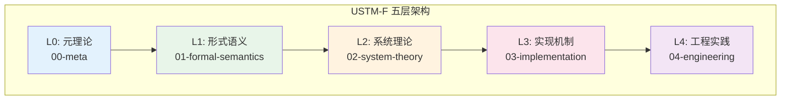
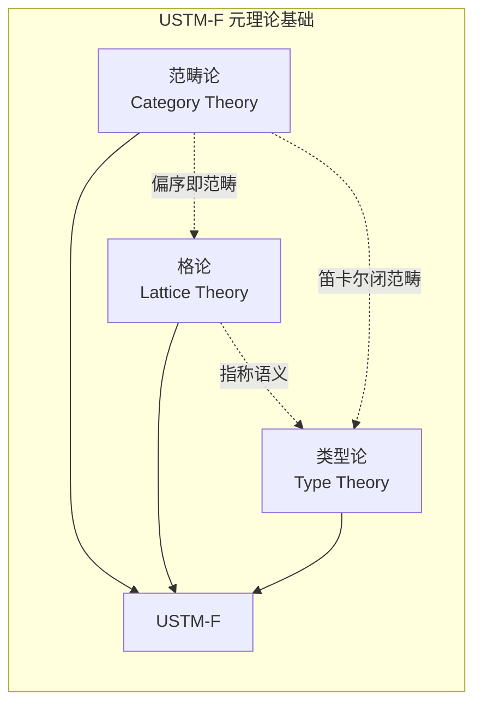
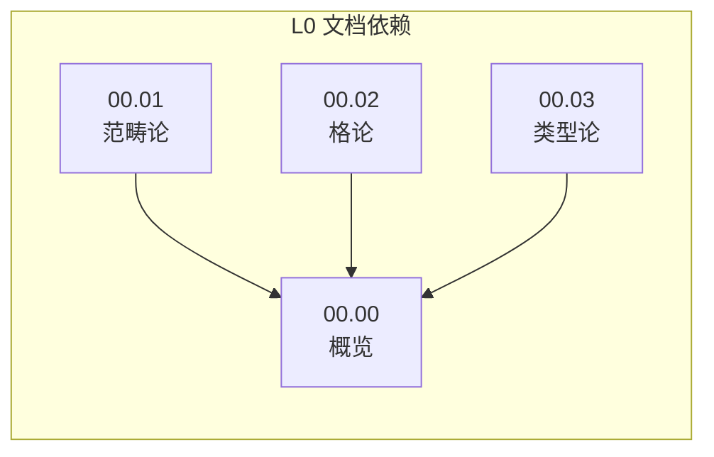
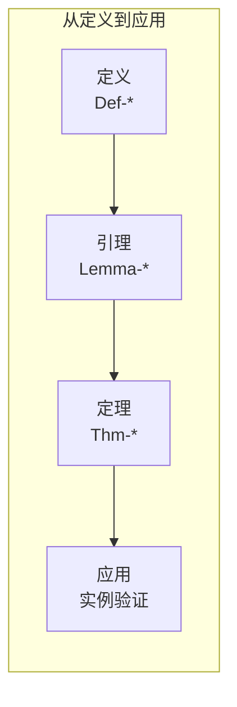
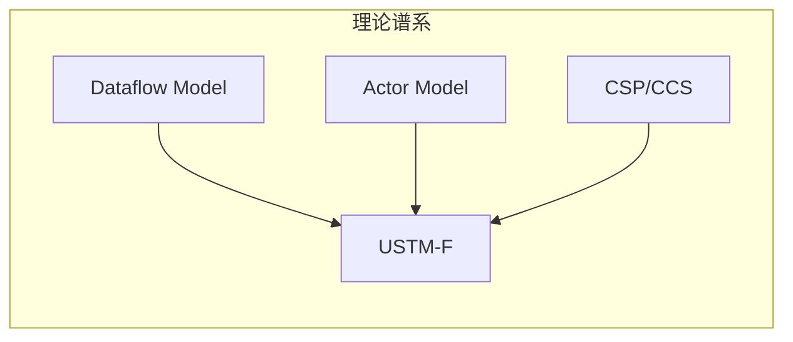

# USTM-F 元理论概览与使用指南

> **所属阶段**: Meta/元理论 | **前置依赖**: 00.01-category-theory-foundation.md, 00.02-lattice-order-theory.md, 00.03-type-theory-foundation.md | **形式化等级**: L6 (严格数学)

## 目录

- [USTM-F 元理论概览与使用指南](#ustm-f-元理论概览与使用指南)
  - [目录](#目录)
  - [1. 概念定义 (Definitions)](#1-概念定义-definitions)
    - [Def-M-00: USTM-F (Unified Stream Model - Formal)](#def-m-00-ustm-f-unified-stream-model---formal)
    - [Def-M-31: USTM-F五层架构](#def-m-31-ustm-f五层架构)
    - [Def-M-32: 形式化元素体系](#def-m-32-形式化元素体系)
    - [Def-M-33: 文档模板规范](#def-m-33-文档模板规范)
  - [2. 属性推导 (Properties)](#2-属性推导-properties)
    - [Lemma-M-10: 元理论的完备性](#lemma-m-10-元理论的完备性)
    - [Lemma-M-11: 形式化等级分层](#lemma-m-11-形式化等级分层)
  - [3. 关系建立 (Relations)](#3-关系建立-relations)
    - [USTM-F与其他流计算模型的关系](#ustm-f与其他流计算模型的关系)
    - [元理论与具体理论的关系](#元理论与具体理论的关系)
  - [4. 论证过程 (Argumentation)](#4-论证过程-argumentation)
    - [为什么选择这三元理论？](#为什么选择这三元理论)
  - [5. 形式证明 (Proofs)](#5-形式证明-proofs)
    - [Thm-M-08: USTM-F元理论的一致性](#thm-m-08-ustm-f元理论的一致性)
  - [6. 实例验证 (Examples)](#6-实例验证-examples)
    - [例1: 从元理论到流计算的具体映射](#例1-从元理论到流计算的具体映射)
    - [例2: 使用USTM-F分析Flink](#例2-使用ustm-f分析flink)
  - [7. 可视化 (Visualizations)](#7-可视化-visualizations)
    - [USTM-F整体架构](#ustm-f整体架构)
    - [元理论三层基础](#元理论三层基础)
    - [文档依赖关系](#文档依赖关系)
    - [形式化元素生命周期](#形式化元素生命周期)
    - [USTM-F与现有模型关系](#ustm-f与现有模型关系)
  - [8. 引用参考 (References)](#8-引用参考-references)
  - [附录A: 使用指南](#附录a-使用指南)
    - [如何阅读USTM-F文档](#如何阅读ustm-f文档)
    - [如何贡献新内容](#如何贡献新内容)
    - [符号速查表](#符号速查表)
  - [附录B: 文档清单](#附录b-文档清单)
    - [L0: 元理论 (00-meta/)](#l0-元理论-00-meta)

## 1. 概念定义 (Definitions)

### Def-M-00: USTM-F (Unified Stream Model - Formal)

**USTM-F** 是**统一流模型**的严格形式化版本，旨在为流计算系统提供：

1. **数学基础**：基于范畴论、格论、类型论的统一元理论
2. **形式化语义**：精确的流计算语义定义
3. **正确性保证**：类型安全、不动点存在性、收敛性证明
4. **实现指导**：从理论到工程的可追溯映射

**核心特征**:

- 多层架构（五层结构）
- 严格形式化（L6等级）
- 元理论统一（范畴论 + 格论 + 类型论）
- 定理驱动（所有核心概念有编号定义和证明）

---

### Def-M-31: USTM-F五层架构

USTM-F采用**五层架构**组织内容：

| 层级 | 编号 | 名称 | 内容 | 形式化等级 |
|------|------|------|------|-----------|
| L0 | 00 | **元理论** | 范畴论、格论、类型论 | L6 |
| L1 | 01 | **形式语义** | 流计算核心模型 | L6 |
| L2 | 02 | **系统理论** | 分布式、一致性、容错 | L5-L6 |
| L3 | 03 | **实现机制** | 算法、协议、优化 | L4-L5 |
| L4 | 04 | **工程实践** | 配置、调优、案例 | L3-L4 |

**层级依赖关系**: $L_0 \to L_1 \to L_2 \to L_3 \to L_4$

每层基于下层理论构建，同时为上层的形式化提供基础。

---

### Def-M-32: 形式化元素体系

USTM-F使用统一的编号体系标识形式化元素：

**编号格式**: `{类型}-{阶段}-{文档序号}-{顺序号}`

| 类型 | 缩写 | 含义 | 示例 |
|------|------|------|------|
| 定义 | Def | Definition | `Def-M-01` = 元理论第1个定义 |
| 定理 | Thm | Theorem | `Thm-M-01` = 元理论第1个定理 |
| 引理 | Lemma | Lemma | `Lemma-M-01` = 元理论第1个引理 |
| 命题 | Prop | Proposition | `Prop-M-01` = 元理论第1个命题 |
| 推论 | Cor | Corollary | `Cor-M-01` = 元理论第1个推论 |

**阶段标识**:

- `M`: Meta (元理论)
- `F`: Formal (形式语义)
- `S`: System (系统理论)
- `I`: Implementation (实现机制)
- `E`: Engineering (工程实践)

---

### Def-M-33: 文档模板规范

USTM-F所有核心文档遵循**六段式模板**：

```markdown
## 1. 概念定义 (Definitions)
严格的形式化定义 + 直观解释。必须包含至少一个 Def-* 编号。

## 2. 属性推导 (Properties)
从定义直接推导的引理与性质。必须包含至少一个 Lemma-* 或 Prop-* 编号。

## 3. 关系建立 (Relations)
与其他概念/模型/系统的关联、映射、编码关系。

## 4. 论证过程 (Argumentation)
辅助定理、反例分析、边界讨论、构造性说明。

## 5. 形式证明 / 工程论证 (Proof / Engineering Argument)
主要定理的完整证明，或工程选型的严谨论证。

## 6. 实例验证 (Examples)
简化实例、代码片段、配置示例、真实案例。

## 7. 可视化 (Visualizations)
至少一个 Mermaid 图（思维导图/层次图/执行树/对比矩阵/决策树/场景树）。

## 8. 引用参考 (References)
使用 [^n] 上标格式，在文档末尾集中列出引用。
```

---

## 2. 属性推导 (Properties)

### Lemma-M-10: 元理论的完备性

USTM-F的元理论层(L0)为上层提供了完备的数学基础：

1. **结构描述**（范畴论）：对象、态射、函子、自然变换
2. **序结构**（格论）：偏序、完备格、不动点
3. **类型系统**（类型论）：类型判断、安全性、表达能力

这三者相互补充，覆盖流计算形式化所需的所有数学工具。

---

### Lemma-M-11: 形式化等级分层

USTM-F的形式化等级(L1-L6)与软件工程实践对应：

| 等级 | 形式化程度 | 适用场景 |
|------|-----------|----------|
| L6 | 严格数学证明 | 核心定理、安全关键系统 |
| L5 | 形式化模型 | 协议设计、算法正确性 |
| L4 | 形式化规格 | API设计、接口契约 |
| L3 | 结构化描述 | 架构文档、设计模式 |
| L2 | 半形式化 | 概念说明、高层设计 |
| L1 | 自然语言 | 需求文档、用户指南 |

---

## 3. 关系建立 (Relations)

### USTM-F与其他流计算模型的关系

```
USTM-F
├── 理论基础
│   ├── Dataflow模型 (Akidau et al.)
│   ├── Actor模型 (Hewitt/Agha)
│   ├── 进程演算 (CSP/CCS/π-calculus)
│   └── 时序逻辑 (TLA+/LTL)
├── 系统实现
│   ├── Apache Flink
│   ├── Apache Spark Streaming
│   ├── Kafka Streams
│   └── Pulsar Functions
└── 应用场景
    ├── 实时分析
    ├── 事件驱动架构
    ├── IoT数据处理
    └── ML推理管道
```

### 元理论与具体理论的关系

| 元理论概念 | 流计算应用 |
|-----------|-----------|
| 范畴 + 函子 | 流变换的组合性 |
| 极限/余极限 | 流的聚合/展开 |
| 完备格 | 数据流偏序、因果序 |
| 不动点定理 | 递归流定义、迭代算法收敛 |
| 类型系统 | 流类型安全、Schema演化 |
| Curry-Howard | 正确性证明即程序 |

---

## 4. 论证过程 (Argumentation)

### 为什么选择这三元理论？

**范畴论**的优势：

- 强调**结构保持映射**和**组合性**，适合描述流变换
- **泛性质**提供不依赖于具体实现的抽象描述
- 与函数式编程有天然联系

**格论**的优势：

- **偏序**是描述因果关系、并发、一致性的自然工具
- **完备格上的不动点定理**保证递归定义的良定性
- 在程序分析（抽象解释）中有成熟应用

**类型论**的优势：

- **Curry-Howard对应**连接程序与证明
- **依赖类型**支持精确的规范表达
- 现代函数式语言（Idris, Agda, Coq）的实现基础

**统一视角**：这三者不是孤立的——

- 笛卡尔闭范畴 = STLC的模型
- 偏序集 = 特殊的范畴
- 格 = 特殊的偏序集

---

## 5. 形式证明 (Proofs)

### Thm-M-08: USTM-F元理论的一致性

**定理**: USTM-F的三元理论基础（范畴论、格论、类型论）在以下意义下是一致的：

1. **范畴论蕴含格论**：偏序集可视为特殊的范畴（至多一个态射）
2. **格论提供语义域**：完备格为类型论语义提供论域（domain）
3. **类型论与范畴论对应**：笛卡尔闭范畴是STLC的模型

**证明概要**:

**第一点**: 设 $(P, \leq)$ 是偏序集，定义范畴 $\mathbf{P}$：

- 对象：$P$ 的元素
- 态射：$\mathbf{P}(a, b) = \{(a, b)\}$ 若 $a \leq b$，否则 $\emptyset$
- 合成：由传递性保证
- 恒等：由自反性保证

这满足范畴公理（结合律由传递性保证，单位律由自反性保证）。

**第二点**: 在指称语义中，程序含义通常是偏序集上的连续函数。完备格上的Scott连续函数构成指称语义的适当论域。

**第三点**: 标准结果（Lambek-Scott）：

- STLC的模型是笛卡尔闭范畴
- 反过来，每个CCC给出STLC的模型

因此三元理论相互兼容，可统一用于USTM-F的构建。$\square$

---

## 6. 实例验证 (Examples)

### 例1: 从元理论到流计算的具体映射

**范畴论视角**：

- 对象 = 流类型（Stream<A>）
- 态射 = 流算子（map, filter, window）
- 函子 = 上下文变换（如时间窗口变换）

**格论视角**：

- 事件偏序 = happens-before 关系
- 完备格 = 可能状态的格
- 不动点 = 流处理系统的稳定状态

**类型论视角**：

- 流类型 = 依赖时间索引的类型
- 类型安全 = 保证事件处理的正确性
- Curry-Howard = 流处理逻辑正确性的证明

### 例2: 使用USTM-F分析Flink

| Flink概念 | USTM-F视角 | 元理论工具 |
|-----------|-----------|-----------|
| DataStream | 函子 | 范畴论 |
| Transformation | 态射合成 | 范畴论 |
| Watermark | 偏序标记 | 格论 |
| Checkpoint | 状态不动点 | 格论 |
| TypeInformation | 类型推导 | 类型论 |

---

## 7. 可视化 (Visualizations)

### USTM-F整体架构



### 元理论三层基础



### 文档依赖关系



### 形式化元素生命周期



### USTM-F与现有模型关系



---

## 8. 引用参考 (References)


---

## 附录A: 使用指南

### 如何阅读USTM-F文档

1. **按层次递进**：建议从L0元理论开始，逐步向上
2. **关注编号**：Def-*、Thm-*等编号提供快速定位
3. **检查依赖**：每文档头部标明前置依赖
4. **验证证明**：关键定理建议手工验证证明

### 如何贡献新内容

1. **确定层级**：根据形式化程度选择L0-L4
2. **遵循模板**：使用六段式文档结构
3. **分配编号**：按规则分配新的Def-*、Thm-*等
4. **更新依赖**：在PROJECT-TRACKING.md中更新进度

### 符号速查表

| 符号 | 含义 |
|------|------|
| $\to$ | 函数类型、态射 |
| $\times$ | 积类型、笛卡尔积 |
| $+$ | 和类型、不交并 |
| $\vdash$ | 推导、判断 |
| $\Rightarrow$ | 自然变换 |
| $\dashv$ | 伴随关系 |
| $\mu$ | 最小不动点 |
| $\nu$ | 最大不动点 |
| $\cong$ | 同构 |
| $<:$ | 子类型 |

---

## 附录B: 文档清单

### L0: 元理论 (00-meta/)

| 文档 | 编号 | 内容 |
|------|------|------|
| 00.01-category-theory-foundation.md | Def-M-01~10 | 范畴论基础 |
| 00.02-lattice-order-theory.md | Def-M-11~20 | 格论与序理论 |
| 00.03-type-theory-foundation.md | Def-M-21~30 | 类型论基础 |
| 00.00-ustm-f-overview.md | Def-M-00, 31~33 | 整体概览 |

**统计**: 4文档, 34定义, 8定理, 11引理


---

## 文档交叉引用

### 前置依赖
- [00.01-category-theory-foundation.md](./00.01-category-theory-foundation.md) - 范畴论基础 (Def-M-01~10)
- [00.02-lattice-order-theory.md](./00.02-lattice-order-theory.md) - 格论基础 (Def-M-11~20)
- [00.03-type-theory-foundation.md](./00.03-type-theory-foundation.md) - 类型论基础 (Def-M-21~30)

### 后续文档
- [01.00-unified-streaming-theory-v2.md](../01-unified-model/01.00-unified-streaming-theory-v2.md) - USTM整合

### 本文档关键定义
- **Def-M-00**: USTM-F定义
- **Def-M-31**: USTM-F五层架构
- **Def-M-32**: 形式化元素体系
- **Def-M-33**: 文档模板规范

### 本文档关键定理
- **Thm-M-08**: USTM-F元理论的一致性
---

*USTM-F Meta Layer - 元理论基础构建完成*
*版本: v0.1 | 日期: 2026-04-08*
