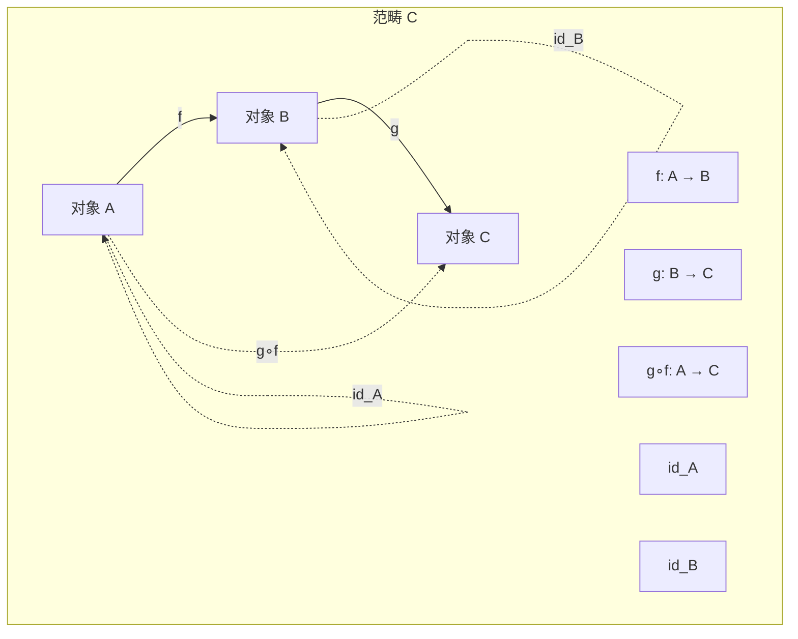
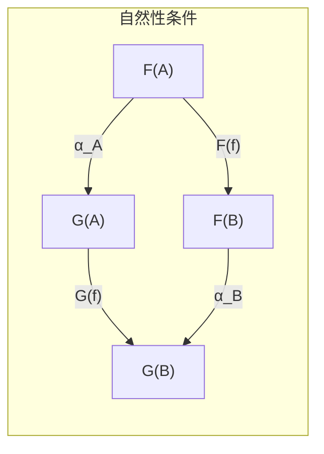
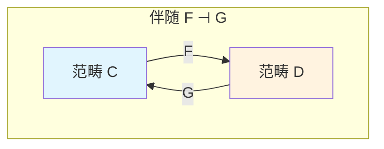
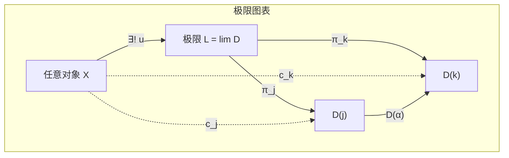
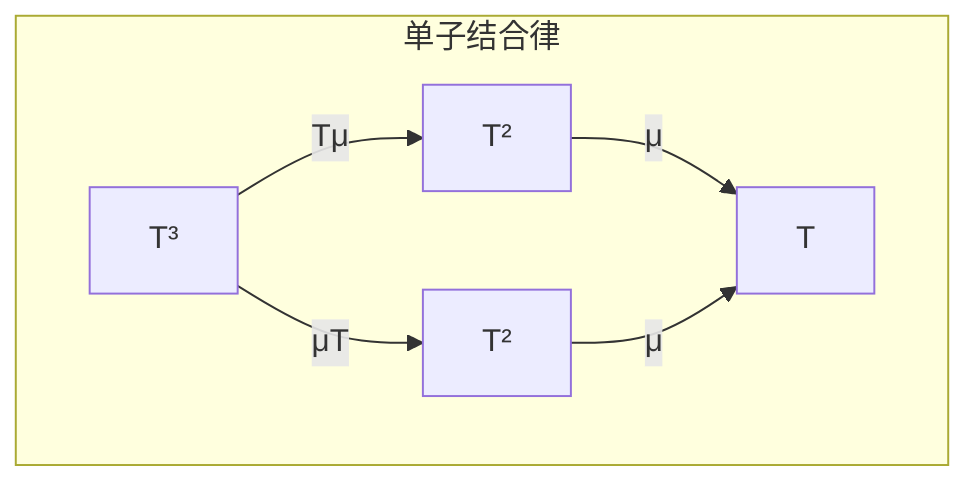

# 范畴论基础 (Category Theory Foundation)

> **所属阶段**: Meta/元理论 | **前置依赖**: 无 | **形式化等级**: L6 (严格数学)

## 目录

- [范畴论基础 (Category Theory Foundation)](#范畴论基础-category-theory-foundation)
  - [目录](#目录)
  - [1. 概念定义 (Definitions)](#1-概念定义-definitions)
    - [Def-M-01: 范畴 (Category)](#def-m-01-范畴-category)
    - [Def-M-02: 对象与态射](#def-m-02-对象与态射)
    - [Def-M-03: 合成与结合律](#def-m-03-合成与结合律)
    - [Def-M-04: 恒等态射](#def-m-04-恒等态射)
    - [Def-M-05: 函子 (Functor)](#def-m-05-函子-functor)
    - [Def-M-06: 自然变换 (Natural Transformation)](#def-m-06-自然变换-natural-transformation)
    - [Def-M-07: 积与余积](#def-m-07-积与余积)
    - [Def-M-08: 极限与余极限](#def-m-08-极限与余极限)
    - [Def-M-09: 伴随函子 (Adjoint Functors)](#def-m-09-伴随函子-adjoint-functors)
    - [Def-M-10: 单子与余单子](#def-m-10-单子与余单子)
  - [2. 属性推导 (Properties)](#2-属性推导-properties)
    - [Lemma-M-01: 同构的复合](#lemma-m-01-同构的复合)
    - [Lemma-M-02: 伴随的唯一性](#lemma-m-02-伴随的唯一性)
    - [Lemma-M-03: 单子的复合结构](#lemma-m-03-单子的复合结构)
  - [3. 关系建立 (Relations)](#3-关系建立-relations)
    - [范畴论与其他数学分支的关系](#范畴论与其他数学分支的关系)
  - [4. 论证过程 (Argumentation)](#4-论证过程-argumentation)
    - [小范畴与局部小范畴](#小范畴与局部小范畴)
  - [5. 形式证明 (Proofs)](#5-形式证明-proofs)
    - [Thm-M-01: 范畴中极限的唯一性](#thm-m-01-范畴中极限的唯一性)
    - [Thm-M-02: 伴随函子的复合仍是伴随](#thm-m-02-伴随函子的复合仍是伴随)
  - [6. 实例验证 (Examples)](#6-实例验证-examples)
    - [例1: 集合范畴 **Set**](#例1-集合范畴-set)
    - [例2: 偏序集作为范畴](#例2-偏序集作为范畴)
    - [例3: 单子在计算机科学中的应用](#例3-单子在计算机科学中的应用)
  - [7. 可视化 (Visualizations)](#7-可视化-visualizations)
    - [范畴的基本结构](#范畴的基本结构)
    - [自然变换交换图](#自然变换交换图)
    - [伴随函子关系](#伴随函子关系)
    - [极限泛性质](#极限泛性质)
    - [单子公理](#单子公理)
  - [8. 引用参考 (References)](#8-引用参考-references)

## 1. 概念定义 (Definitions)

本节建立范畴论的严格数学基础，为后续USTM-F的所有形式化构建提供元语言。

### Def-M-01: 范畴 (Category)

**数学定义**: 一个**范畴** $\mathbf{C}$ 由以下结构组成：

1. **对象类** (Class of Objects)：记作 $\mathrm{Ob}(\mathbf{C})$ 或简写为 $\mathbf{C}_0$
2. **态射集** (Hom-sets)：对任意 $A, B \in \mathbf{C}_0$，有集合 $\mathrm{Hom}_{\mathbf{C}}(A, B)$，也可写作 $\mathbf{C}(A, B)$ 或 $A \to B$
3. **合成运算** (Composition)：对任意 $A, B, C \in \mathbf{C}_0$，有映射
   $$\circ_{A,B,C} : \mathrm{Hom}(B, C) \times \mathrm{Hom}(A, B) \to \mathrm{Hom}(A, C)$$
   记作 $g \circ f$ 或简写 $gf$
4. **恒等态射** (Identity)：对每个 $A \in \mathbf{C}_0$，存在 $\mathrm{id}_A \in \mathrm{Hom}(A, A)$

满足以下公理：

- **结合律** (Associativity)：$h \circ (g \circ f) = (h \circ g) \circ f$，对所有可合成的态射成立
- **单位律** (Unit laws)：$f \circ \mathrm{id}_A = f = \mathrm{id}_B \circ f$，对所有 $f : A \to B$ 成立

**直观解释**: 范畴是数学结构的抽象，对象是"东西"，态射是"过程"，合成是"顺序执行"。

---

### Def-M-02: 对象与态射

**对象 (Object)**: 范畴中的基本实体，只通过与其他对象的关系（态射）来刻画。对象本身没有内部结构。

**态射 (Morphism)**: 又称**箭头** (Arrow)，表示对象间的结构保持映射。

态射的重要分类：

- **单态射** (Monomorphism/Mono)：$f : A \to B$ 满足：若 $f \circ g_1 = f \circ g_2$，则 $g_1 = g_2$。记作 $f : A \rightarrowtail B$
- **满态射** (Epimorphism/Epi)：$f : A \to B$ 满足：若 $g_1 \circ f = g_2 \circ f$，则 $g_1 = g_2$。记作 $f : A \twoheadrightarrow B$
- **同构** (Isomorphism)：$f : A \to B$ 使得存在 $g : B \to A$ 满足 $g \circ f = \mathrm{id}_A$ 且 $f \circ g = \mathrm{id}_B$。记作 $A \cong B$
- **自态射** (Endomorphism)：$f : A \to A$，即起点与终点相同的态射
- **恒等态射** (Identity Morphism)：特殊的自态射 $\mathrm{id}_A$

---

### Def-M-03: 合成与结合律

**合成** (Composition): 范畴的核心运算，表示两个过程的顺序组合。

给定 $f : A \to B$ 和 $g : B \to C$，其合成 $g \circ f : A \to C$ 定义为：

$$(g \circ f)(x) = g(f(x)) \quad \text{(在集合范畴中)}$$

**结合律**严格表述为：
对于任意可合成的态射 $f : A \to B$，$g : B \to C$，$h : C \to D$：

$$h \circ (g \circ f) = (h \circ g) \circ f$$

这允许我们无歧义地写作 $h \circ g \circ f$。

---

### Def-M-04: 恒等态射

对每个对象 $A \in \mathbf{C}_0$，**恒等态射** $\mathrm{id}_A : A \to A$ 满足：

$$\forall f : X \to A, \quad \mathrm{id}_A \circ f = f$$
$$\forall g : A \to Y, \quad g \circ \mathrm{id}_A = g$$

**唯一性引理**: 恒等态射是唯一的。

**证明**: 假设 $\mathrm{id}_A'$ 也是 $A$ 的恒等态射，则：
$$\mathrm{id}_A = \mathrm{id}_A \circ \mathrm{id}_A' = \mathrm{id}_A'$$
$\square$

---

### Def-M-05: 函子 (Functor)

**协变函子** (Covariant Functor): 范畴间的结构保持映射。

函子 $F : \mathbf{C} \to \mathbf{D}$ 包含：

1. 对象映射：$F_0 : \mathbf{C}_0 \to \mathbf{D}_0$，通常简写为 $F(A)$
2. 态射映射：$F_1 : \mathbf{C}(A, B) \to \mathbf{D}(F(A), F(B))$，通常简写为 $F(f)$

满足：

- **恒等保持**: $F(\mathrm{id}_A) = \mathrm{id}_{F(A)}$
- **合成保持**: $F(g \circ f) = F(g) \circ F(f)$

**逆变函子** (Contravariant Functor): 方向反转的函子 $F : \mathbf{C}^{\mathrm{op}} \to \mathbf{D}$，满足：
$$F(g \circ f) = F(f) \circ F(g)$$

其中 $\mathbf{C}^{\mathrm{op}}$ 是 $\mathbf{C}$ 的**对立范畴**，所有箭头方向反转。

---

### Def-M-06: 自然变换 (Natural Transformation)

**定义**: 函子间的"态射"。

给定函子 $F, G : \mathbf{C} \to \mathbf{D}$，**自然变换** $\alpha : F \Rightarrow G$ 是一族态射：
$$\alpha_A : F(A) \to G(A) \quad \text{对每个 } A \in \mathbf{C}_0$$

满足**自然性条件** (Naturality)：对任意 $f : A \to B$，下图交换：

$$
\begin{array}{ccc}
F(A) & \xrightarrow{\alpha_A} & G(A) \\
F(f) \downarrow & & \downarrow G(f) \\
F(B) & \xrightarrow{\alpha_B} & G(B)
\end{array}
$$

即：$G(f) \circ \alpha_A = \alpha_B \circ F(f)$

若每个 $\alpha_A$ 都是同构，则称 $\alpha$ 为**自然同构**，记作 $F \cong G$。

---

### Def-M-07: 积与余积

**积** (Product): 范畴论中的"广义笛卡尔积"。

对象 $A, B$ 的积是三元组 $(A \times B, \pi_1, \pi_2)$，其中：

- $\pi_1 : A \times B \to A$ （第一投影）
- $\pi_2 : A \times B \to B$ （第二投影）

满足**泛性质**：对任意对象 $X$ 和态射 $f : X \to A$，$g : X \to B$，存在唯一的 $\langle f, g \rangle : X \to A \times B$ 使得：
$$\pi_1 \circ \langle f, g \rangle = f, \quad \pi_2 \circ \langle f, g \rangle = g$$

**余积** (Coproduct): 积的对偶概念，记作 $A + B$。

$(A + B, \iota_1, \iota_2)$ 满足：对任意 $f : A \to X$，$g : B \to X$，存在唯一的 $[f, g] : A + B \to X$ 使得：
$$[f, g] \circ \iota_1 = f, \quad [f, g] \circ \iota_2 = g$$

---

### Def-M-08: 极限与余极限

**图表** (Diagram): 函子 $D : \mathbf{J} \to \mathbf{C}$，其中 $\mathbf{J}$ 是**指标范畴**。

**锥** (Cone)：对象 $C \in \mathbf{C}$ 配备一族态射 $\{c_j : C \to D(j)\}_{j \in \mathbf{J}}$，使得对所有 $\alpha : j \to k$ 在 $\mathbf{J}$ 中：
$$D(\alpha) \circ c_j = c_k$$

**极限** (Limit)：图表 $D$ 的**泛锥** $(\varprojlim D, \{\pi_j\})$，使得任何其他锥 $(C, \{c_j\})$ 存在唯一的 $u : C \to \varprojlim D$ 满足 $\pi_j \circ u = c_j$。

**余锥** (Cocone) 和 **余极限** (Colimit) 是对偶概念。

重要特例：

- 积是离散图表的极限
- 等化子是平行对图表的极限
- 拉回是跨度图表的极限

---

### Def-M-09: 伴随函子 (Adjoint Functors)

**定义**: 函子 $F : \mathbf{C} \to \mathbf{D}$ 和 $G : \mathbf{D} \to \mathbf{C}$ 构成**伴随**，记作 $F \dashv G$，如果存在自然同构：
$$\mathbf{D}(F(C), D) \cong \mathbf{C}(C, G(D))$$

对任意 $C \in \mathbf{C}$，$D \in \mathbf{D}$ 成立。

等价表述：存在：

- **单位** (Unit)：自然变换 $\eta : \mathrm{Id}_{\mathbf{C}} \Rightarrow G \circ F$
- **余单位** (Counit)：自然变换 $\varepsilon : F \circ G \Rightarrow \mathrm{Id}_{\mathbf{D}}$

满足**三角等式**：
$$(\varepsilon F) \circ (F \eta) = \mathrm{id}_F, \quad (G \varepsilon) \circ (\eta G) = \mathrm{id}_G$$

$F$ 称为**左伴随**，$G$ 称为**右伴随**。

---

### Def-M-10: 单子与余单子

**单子** (Monad): 范畴 $\mathbf{C}$ 上的自函子 $T : \mathbf{C} \to \mathbf{C}$，配备：

- **单位**：自然变换 $\eta : \mathrm{Id}_{\mathbf{C}} \Rightarrow T$
- **乘法**：自然变换 $\mu : T^2 \Rightarrow T$

满足**结合律**和**单位律**：
$$\mu \circ T\mu = \mu \circ \mu T : T^3 \Rightarrow T$$
$$\mu \circ T\eta = \mu \circ \eta T = \mathrm{id}_T : T \Rightarrow T$$

**余单子** (Comonad): 单子的对偶，自函子 $W : \mathbf{C} \to \mathbf{C}$ 配备：

- **余单位** $\varepsilon : W \Rightarrow \mathrm{Id}_{\mathbf{C}}$
- **余乘法** $\delta : W \Rightarrow W^2$

满足对偶的结合律和单位律。

**Kleisli范畴**: 从单子构造的新范畴，对象是 $\mathbf{C}$ 的对象，态射 $A \to B$ 是 $\mathbf{C}$ 中的 $A \to T(B)$。

---

## 2. 属性推导 (Properties)

### Lemma-M-01: 同构的复合

若 $f : A \to B$ 和 $g : B \to C$ 都是同构，则 $g \circ f : A \to C$ 也是同构。

**证明**: 设 $f^{-1}$ 和 $g^{-1}$ 分别是 $f$ 和 $g$ 的逆，则：
$$(g \circ f) \circ (f^{-1} \circ g^{-1}) = g \circ (f \circ f^{-1}) \circ g^{-1} = g \circ \mathrm{id}_B \circ g^{-1} = g \circ g^{-1} = \mathrm{id}_C$$

同理可证 $(f^{-1} \circ g^{-1}) \circ (g \circ f) = \mathrm{id}_A$。$\square$

---

### Lemma-M-02: 伴随的唯一性

左伴随（若存在）在同构意义下唯一。

**证明**: 设 $F \dashv G$ 且 $F' \dashv G$，则对任意 $C \in \mathbf{C}$，$D \in \mathbf{D}$：
$$\mathbf{D}(F(C), D) \cong \mathbf{C}(C, G(D)) \cong \mathbf{D}(F'(C), D)$$

由 Yoneda 引理，$F(C) \cong F'(C)$，且此同构是自然的。$\square$

---

### Lemma-M-03: 单子的复合结构

若 $F \dashv G$ 伴随对，$F : \mathbf{C} \to \mathbf{D}$，$G : \mathbf{D} \to \mathbf{C}$，则 $T = G \circ F : \mathbf{C} \to \mathbf{C}$ 构成单子。

**证明**: 定义：

- $\eta : \mathrm{Id}_{\mathbf{C}} \Rightarrow G \circ F$（单位）
- $\mu = G \varepsilon F : GFGF \Rightarrow GF$（其中 $\varepsilon$ 是余单位）

验证结合律：
$$\mu \circ T\mu = G\varepsilon F \circ GFG\varepsilon F = G(\varepsilon \circ FG\varepsilon)F = G(\varepsilon \circ \varepsilon FG)F = G\varepsilon F \circ G\varepsilon FGF = \mu \circ \mu T$$

单位律类似可证。$\square$

---

## 3. 关系建立 (Relations)

### 范畴论与其他数学分支的关系

**与序理论的关系**: 偏序集可以看作特殊的范畴——每个 Hom-集最多含一个元素。

**与群论的关系**: 群可以看作只有一个对象的范畴，其中所有态射都是同构。

**与拓扑的关系**: 拓扑空间范畴 **Top** 是研究同伦论的基础。

**与逻辑的关系**: 范畴语义为直觉主义逻辑提供模型（笛卡尔闭范畴）。

---

## 4. 论证过程 (Argumentation)

### 小范畴与局部小范畴

**小范畴** (Small Category): $\mathbf{C}_0$ 是集合（而非真类）。

**局部小范畴** (Locally Small): 对任意 $A, B$，$\mathbf{C}(A, B)$ 是集合。

**讨论**: 大多数实用范畴（**Set**, **Grp**, **Vect**）都是局部小的，但不是小的。这在构造函子范畴时需要特别注意。

---

## 5. 形式证明 (Proofs)

### Thm-M-01: 范畴中极限的唯一性

**定理**: 若范畴中对象的极限存在，则在同构意义下唯一。

**证明**: 设 $(L, \{\pi_j\})$ 和 $(L', \{\pi'_j\})$ 都是图表 $D : \mathbf{J} \to \mathbf{C}$ 的极限。

由于 $(L, \{\pi_j\})$ 是泛锥，存在唯一的 $u : L' \to L$ 使得 $\pi_j \circ u = \pi'_j$ 对所有 $j$ 成立。

由于 $(L', \{\pi'_j\})$ 也是泛锥，存在唯一的 $v : L \to L'$ 使得 $\pi'_j \circ v = \pi_j$ 对所有 $j$ 成立。

考虑 $u \circ v : L \to L$：
$$\pi_j \circ (u \circ v) = (\pi_j \circ u) \circ v = \pi'_j \circ v = \pi_j = \pi_j \circ \mathrm{id}_L$$

由极限的泛性质（唯一性部分），$u \circ v = \mathrm{id}_L$。

同理 $v \circ u = \mathrm{id}_{L'}$。

因此 $L \cong L'$。$\square$

---

### Thm-M-02: 伴随函子的复合仍是伴随

**定理**: 若 $F \dashv G$（$F : \mathbf{C} \to \mathbf{D}$，$G : \mathbf{D} \to \mathbf{C}$）且 $F' \dashv G'$（$F' : \mathbf{D} \to \mathbf{E}$，$G' : \mathbf{E} \to \mathbf{D}$），则 $F' \circ F \dashv G \circ G'$。

**证明**: 对任意 $C \in \mathbf{C}$，$E \in \mathbf{E}$：
$$\mathbf{E}(F'(F(C)), E) \cong \mathbf{D}(F(C), G'(E)) \cong \mathbf{C}(C, G(G'(E)))$$

因此 $F' \circ F \dashv G \circ G'$。$\square$

---

## 6. 实例验证 (Examples)

### 例1: 集合范畴 **Set**

- 对象：集合
- 态射：函数
- 积：笛卡尔积 $A \times B$
- 余积：不交并 $A \sqcup B$
- 极限：集合的极限（如等化子是子集）
- 单子：从伴随 $(-) \times E \dashv (-)^E$ 得到的态射单子

### 例2: 偏序集作为范畴

偏序集 $(P, \leq)$ 是范畴：

- 对象：$P$ 的元素
- 态射：$a \to b$ 存在当且仅当 $a \leq b$
- 合成：传递性保证
- 恒等：自反性保证

在此范畴中，积对应**下确界**（meet），余积对应**上确界**（join）。

### 例3: 单子在计算机科学中的应用

**列表单子** (List Monad)：$T(A) = \mathrm{List}(A)$

- 单位：$\eta(a) = [a]$（单元素列表）
- 乘法：$\mu([[a_{11}, ...], ...]) = [a_{11}, ...]$（展平）

**状态单子** (State Monad)：$T(A) = S \to (A \times S)$

- 模拟带有状态 $S$ 的计算

**IO单子**：隔离副作用

---

## 7. 可视化 (Visualizations)

### 范畴的基本结构

### 自然变换交换图

### 伴随函子关系

### 极限泛性质

### 单子公理

---

## 8. 引用参考 (References)
