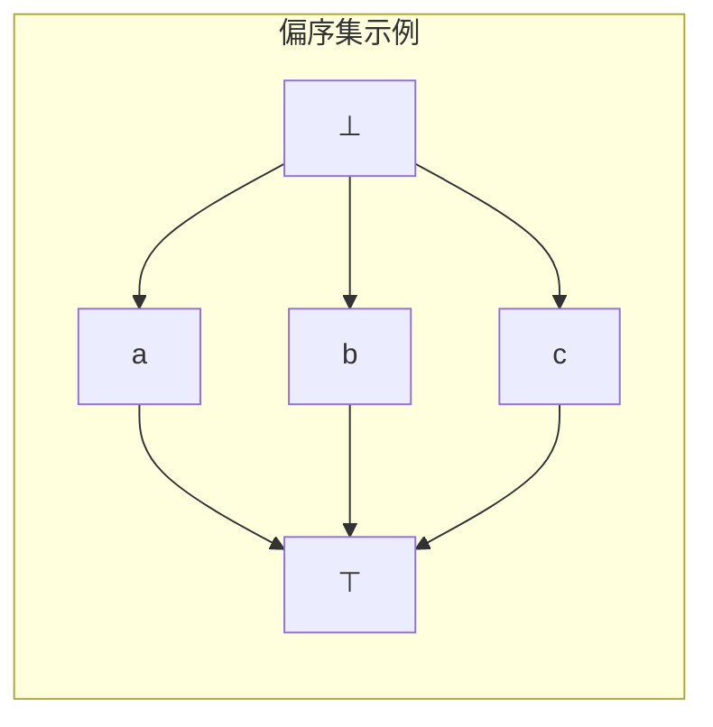
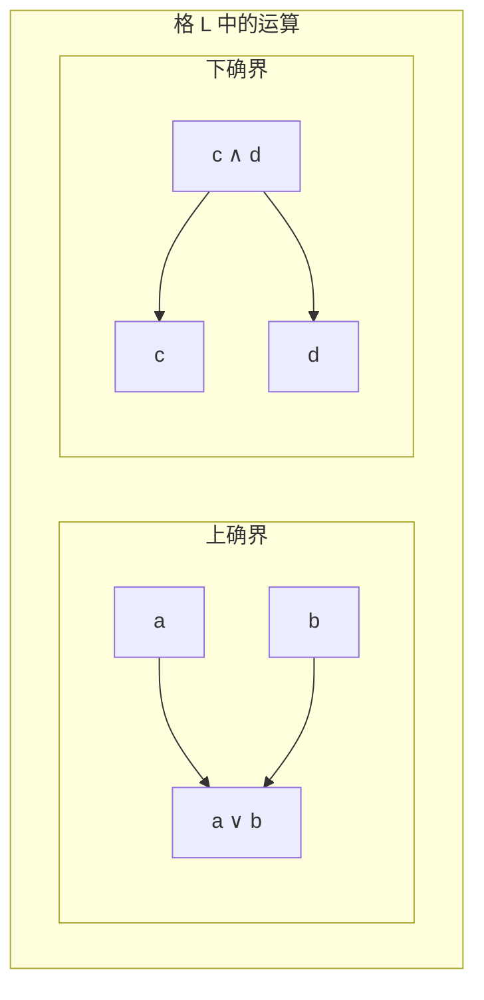
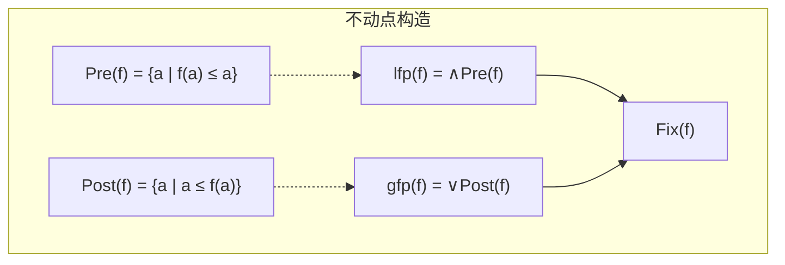
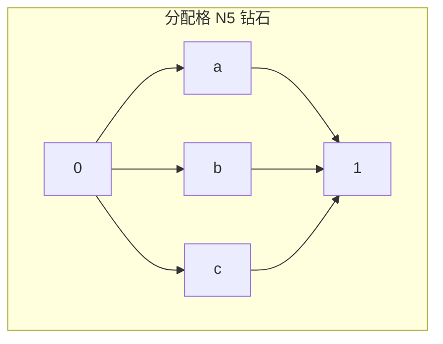
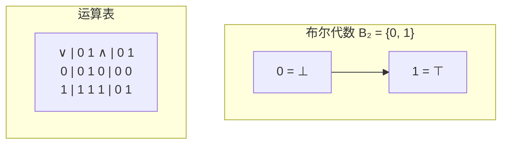

# 格论与序理论基础 (Lattice and Order Theory Foundation)

> **所属阶段**: Meta/元理论 | **前置依赖**: 00.01-category-theory-foundation.md | **形式化等级**: L6 (严格数学)

## 目录

- [格论与序理论基础 (Lattice and Order Theory Foundation)](#格论与序理论基础-lattice-and-order-theory-foundation)
  - [目录](#目录)
  - [1. 概念定义 (Definitions)](#1-概念定义-definitions)
    - [Def-M-11: 偏序集 (Poset)](#def-m-11-偏序集-poset)
    - [Def-M-12: 上确界与下确界](#def-m-12-上确界与下确界)
    - [Def-M-13: 格 (Lattice)](#def-m-13-格-lattice)
    - [Def-M-14: 完备格 (Complete Lattice)](#def-m-14-完备格-complete-lattice)
    - [Def-M-15: 不动点定理 (Knaster-Tarski)](#def-m-15-不动点定理-knaster-tarski)
    - [Def-M-16: 完全格上的单调函数](#def-m-16-完全格上的单调函数)
    - [Def-M-17: 最小/最大不动点](#def-m-17-最小最大不动点)
    - [Def-M-18: 格同态](#def-m-18-格同态)
    - [Def-M-19: 分配格](#def-m-19-分配格)
    - [Def-M-20: 布尔代数](#def-m-20-布尔代数)
  - [2. 属性推导 (Properties)](#2-属性推导-properties)
    - [Lemma-M-04: 单调函数的复合](#lemma-m-04-单调函数的复合)
    - [Lemma-M-05: 不动点集构成完备格](#lemma-m-05-不动点集构成完备格)
    - [Lemma-M-06: 最小不动点的迭代构造](#lemma-m-06-最小不动点的迭代构造)
  - [3. 关系建立 (Relations)](#3-关系建立-relations)
    - [格论与范畴论的联系](#格论与范畴论的联系)
    - [格论在计算机科学中的应用](#格论在计算机科学中的应用)
  - [4. 论证过程 (Argumentation)](#4-论证过程-argumentation)
    - [连续性与Scott连续性](#连续性与scott连续性)
  - [5. 形式证明 (Proofs)](#5-形式证明-proofs)
    - [Thm-M-03: Knaster-Tarski不动点定理](#thm-m-03-knaster-tarski不动点定理)
    - [Thm-M-04: 完备格上单调函数必有最小/最大不动点](#thm-m-04-完备格上单调函数必有最小最大不动点)
    - [Thm-M-05: 连续函数的不动点迭代收敛](#thm-m-05-连续函数的不动点迭代收敛)
  - [6. 实例验证 (Examples)](#6-实例验证-examples)
    - [例1: 幂集格上的不动点](#例1-幂集格上的不动点)
    - [例2: 区间格](#例2-区间格)
    - [例3: 布尔代数与命题逻辑](#例3-布尔代数与命题逻辑)
  - [7. 可视化 (Visualizations)](#7-可视化-visualizations)
    - [偏序集与Hasse图](#偏序集与hasse图)
    - [格的基本结构](#格的基本结构)
    - [Knaster-Tarski不动点定理示意](#knaster-tarski不动点定理示意)
    - [分配格与非分配格](#分配格与非分配格)
    - [布尔代数结构](#布尔代数结构)
  - [8. 引用参考 (References)](#8-引用参考-references)

## 1. 概念定义 (Definitions)

本节建立格论与序理论的严格数学基础，为USTM-F中的数据流语义分析、类型推理和不动点计算提供理论支撑。

### Def-M-11: 偏序集 (Poset)

**数学定义**: **偏序集** (Partially Ordered Set, Poset) 是一个二元组 $(P, \leq)$，其中 $P$ 是集合，$\leq \subseteq P \times P$ 是二元关系，满足：

1. **自反性** (Reflexivity)：$\forall a \in P, \quad a \leq a$
2. **反对称性** (Antisymmetry)：$\forall a, b \in P, \quad a \leq b \land b \leq a \implies a = b$
3. **传递性** (Transitivity)：$\forall a, b, c \in P, \quad a \leq b \land b \leq c \implies a \leq c$

**相关概念**:

- **严格序** $<$：$a < b$ 当且仅当 $a \leq b \land a \neq b$
- **覆盖关系** $a \prec b$：$a < b$ 且不存在 $c$ 使得 $a < c < b$
- **可比性**：$a$ 和 $b$ **可比**如果 $a \leq b$ 或 $b \leq a$；否则**不可比**，记作 $a \parallel b$
- **全序** (Total Order)：任意两元素可比
- **良基关系**：不存在无限严格降链 $a_0 > a_1 > a_2 > \cdots$

**Hasse图**: 偏序集的可视化，只画覆盖关系，省略自环和传递边。

---

### Def-M-12: 上确界与下确界

设 $(P, \leq)$ 是偏序集，$S \subseteq P$ 是子集。

**上界** (Upper Bound)：$u \in P$ 是 $S$ 的上界如果 $\forall s \in S, \quad s \leq u$。

**上确界/并** (Supremum/Join)：$S$ 的上确界是最小上界，记作 $\bigvee S$ 或 $\sup S$。形式地：
$$\bigvee S = u \iff (\forall s \in S, s \leq u) \land (\forall v, (\forall s \in S, s \leq v) \implies u \leq v)$$

**下界** (Lower Bound)：$l \in P$ 是 $S$ 的下界如果 $\forall s \in S, \quad l \leq s$。

**下确界/交** (Infimum/Meet)：$S$ 的下确界是最大下界，记作 $\bigwedge S$ 或 $\inf S$。

**二元运算记号**:

- $a \vee b = \bigvee \{a, b\}$ （二元并）
- $a \wedge b = \bigwedge \{a, b\}$ （二元交）

---

### Def-M-13: 格 (Lattice)

**数学定义**: **格**是一个偏序集 $(L, \leq)$，其中任意两个元素都有上确界和下确界。

等价地，格可以定义为代数结构 $(L, \vee, \wedge)$，满足：

1. **交换律**:
   - $a \vee b = b \vee a$
   - $a \wedge b = b \wedge a$

2. **结合律**:
   - $(a \vee b) \vee c = a \vee (b \vee c)$
   - $(a \wedge b) \wedge c = a \wedge (b \wedge c)$

3. **吸收律**:
   - $a \vee (a \wedge b) = a$
   - $a \wedge (a \vee b) = a$

**序与代数结构的对应**:

- $a \leq b \iff a \vee b = b \iff a \wedge b = a$

**特殊元素**:

- **底** (Bottom)：$\bot = \bigvee \emptyset$（若存在），是最小元，满足 $\bot \leq a$ 对所有 $a$
- **顶** (Top)：$\top = \bigwedge \emptyset$（若存在），是最大元，满足 $a \leq \top$ 对所有 $a$

**格的分类**:

- **有界格** (Bounded Lattice)：有 $\bot$ 和 $\top$
- **分配格** (Distributive Lattice)：见 Def-M-19
- **模格** (Modular Lattice)：满足模律

---

### Def-M-14: 完备格 (Complete Lattice)

**数学定义**: **完备格**是偏序集 $(L, \leq)$，其中**任意**子集（包括无限子集）都有上确界和下确界。

等价条件：若任意子集有上确界，则任意子集也有下确界：
$$\bigwedge S = \bigvee \{l \in L \mid \forall s \in S, l \leq s\}$$

**重要性质**:

- 完备格必然有界：$\bot = \bigvee \emptyset$，$\top = \bigwedge \emptyset$
- 有限格总是完备的
- 完备格是范畴论中**完备范畴**的特例（所有小图表都有极限）

**例子**:

- 幂集格 $(\mathcal{P}(X), \subseteq)$ 是完备格，$\bigvee S = \bigcup S$，$\bigwedge S = \bigcap S$
- 区间 $[0, 1]$ 是完备格
- 凸子集格是完备格

---

### Def-M-15: 不动点定理 (Knaster-Tarski)

**前置定义**:

**单调函数** (Monotone Function)：$f : P \to P$ 是单调的如果：
$$a \leq b \implies f(a) \leq f(b)$$

**前缀点** (Prefixpoint)：$a$ 是 $f$ 的前缀点如果 $f(a) \leq a$

**后缀点** (Postfixpoint)：$a$ 是 $f$ 的后缀点如果 $a \leq f(a)$

**不动点** (Fixed Point)：$a$ 是 $f$ 的不动点如果 $f(a) = a$

---

### Def-M-16: 完全格上的单调函数

**定义**: 设 $(L, \leq)$ 是完备格，$f : L \to L$ 是单调函数。

**重要集合**:

- 前缀点集：$\mathrm{Pre}(f) = \{a \in L \mid f(a) \leq a\}$
- 后缀点集：$\mathrm{Post}(f) = \{a \in L \mid a \leq f(a)\}$
- 不动点集：$\mathrm{Fix}(f) = \{a \in L \mid f(a) = a\}$

**性质**: $\mathrm{Fix}(f) \subseteq \mathrm{Pre}(f) \cap \mathrm{Post}(f)$

---

### Def-M-17: 最小/最大不动点

在完备格中，定义：

**最小不动点** (Least Fixed Point)：$\mathrm{lfp}(f) = \bigwedge \mathrm{Pre}(f) = \bigwedge \{a \mid f(a) \leq a\}$

**最大不动点** (Greatest Fixed Point)：$\mathrm{ gfp}(f) = \bigvee \mathrm{Post}(f) = \bigvee \{a \mid a \leq f(a)\}$

**注记**: 最小不动点和最大不动点都存在（由完备性保证），且 $\mathrm{lfp}(f) \leq \mathrm{gfp}(f)$。

---

### Def-M-18: 格同态

设 $(L, \vee, \wedge)$ 和 $(M, \vee, \wedge)$ 是格。

**格同态** (Lattice Homomorphism)：映射 $h : L \to M$ 满足：

- $h(a \vee b) = h(a) \vee h(b)$ （保并）
- $h(a \wedge b) = h(a) \wedge h(b)$ （保交）

**完备格同态** (Complete Lattice Homomorphism)：对任意 $S \subseteq L$：

- $h(\bigvee S) = \bigvee h(S)$
- $h(\bigwedge S) = \bigwedge h(S)$

**特殊同态**:

- **嵌入** (Embedding)：单射同态
- **同构** (Isomorphism)：双射同态

---

### Def-M-19: 分配格

**定义**: 格 $(L, \vee, \wedge)$ 是**分配格**如果满足分配律：

$$a \wedge (b \vee c) = (a \wedge b) \vee (a \wedge c)$$
$$a \vee (b \wedge c) = (a \vee b) \wedge (a \vee c)$$

（两个分配律等价，只需验证其一）

**特征**: 分配格不含 $M_3$ 或 $N_5$ 子格（Dedekind-Birkhoff 定理）。

**例子**:

- 幂集格是分配格
- 全序集是分配格
- 自然数整除格不是分配格

---

### Def-M-20: 布尔代数

**定义**: **布尔代数**是有界分配格 $(B, \vee, \wedge, \bot, \top, \neg)$，配备**补运算** $\neg : B \to B$ 满足：

- $a \vee \neg a = \top$
- $a \wedge \neg a = \bot$

**等价特征**: 布尔代数与**布尔环** $(B, \oplus, \cdot)$ 等价，其中：

- $a \oplus b = (a \wedge \neg b) \vee (\neg a \wedge b)$ （对称差）
- $a \cdot b = a \wedge b$

**Stone表示定理**: 每个布尔代数都同构于某个集合的幂集的子代数。

---

## 2. 属性推导 (Properties)

### Lemma-M-04: 单调函数的复合

若 $f, g : P \to P$ 都是单调函数，则 $g \circ f$ 也是单调的。

**证明**: 设 $a \leq b$，则 $f(a) \leq f(b)$（$f$ 单调），进而 $g(f(a)) \leq g(f(b))$（$g$ 单调）。$\square$

---

### Lemma-M-05: 不动点集构成完备格

设 $f : L \to L$ 是完备格上的单调函数，则不动点集 $\mathrm{Fix}(f)$ 构成完备格。

**证明概要**: 对 $S \subseteq \mathrm{Fix}(f)$，定义：
$$u = \bigwedge \{a \in L \mid \forall s \in S, s \leq a \land f(a) \leq a\}$$

可证 $u \in \mathrm{Fix}(f)$ 且是 $S$ 在 $\mathrm{Fix}(f)$ 中的上确界。$\square$

---

### Lemma-M-06: 最小不动点的迭代构造

设 $f : L \to L$ 是完备格上的单调函数，定义序列为：
$$f^0 = \bot, \quad f^{\alpha+1} = f(f^\alpha), \quad f^\lambda = \bigvee_{\beta < \lambda} f^\beta \text{（极限序数）}$$

则存在序数 $\gamma$ 使得 $f^\gamma = \mathrm{lfp}(f)$。

---

## 3. 关系建立 (Relations)

### 格论与范畴论的联系

**偏序集作为范畴**: 偏序集 $(P, \leq)$ 可视为范畴：

- 对象：$P$ 的元素
- 态射：$a \to b$ 存在当且仅当 $a \leq b$

在此视角下：

- 积 $\leftrightarrow$ 下确界（meet）
- 余积 $\leftrightarrow$ 上确界（join）
- 终对象 $\leftrightarrow$ 顶（top）
- 始对象 $\leftrightarrow$ 底（bottom）

**完备格作为完备范畴**: 完备格是只有小极限的完备范畴。

### 格论在计算机科学中的应用

| 领域 | 应用 |
|------|------|
| 程序分析 | 抽象解释（抽象域是格） |
| 类型系统 | 子类型关系（预序） |
| 并发理论 | Happens-before 关系 |
| 数据库 | 依赖分析、一致性模型 |
| 逻辑 | 真值格（多值逻辑） |

---

## 4. 论证过程 (Argumentation)

### 连续性与Scott连续性

在计算机科学中，我们关注**Scott连续函数**：

**定义**: $f : L \to L$ 是 **Scott连续**的如果：

1. 单调
2. 保有向上确界：$f(\bigvee_{i \in I} x_i) = \bigvee_{i \in I} f(x_i)$ 对任意定向集 $\{x_i\}$

**重要性**: Scott连续函数的不动点可以通过 $\omega$-迭代（可数步）达到，而不需要超限迭代。

---

## 5. 形式证明 (Proofs)

### Thm-M-03: Knaster-Tarski不动点定理

**定理**: 设 $(L, \leq)$ 是完备格，$f : L \to L$ 是单调函数。则：

1. $\mathrm{lfp}(f)$ 存在且等于 $\bigwedge \{a \in L \mid f(a) \leq a\}$
2. $\mathrm{gfp}(f)$ 存在且等于 $\bigvee \{a \in L \mid a \leq f(a)\}$
3. $\mathrm{Fix}(f)$ 构成完备格

**证明**:

**第一部分**: 令 $P = \{a \in L \mid f(a) \leq a\}$（前缀点集）。由于 $L$ 完备，$\mu = \bigwedge P$ 存在。

需证 $f(\mu) = \mu$：

首先，$\mu \leq a$ 对所有 $a \in P$（由定义）。由 $f$ 单调：
$$f(\mu) \leq f(a) \leq a \quad \text{对所有 } a \in P$$

因此 $f(\mu)$ 也是 $P$ 的下界，故 $f(\mu) \leq \mu = \bigwedge P$。

另一方面，由 $f(\mu) \leq \mu$ 和 $f$ 单调：
$$f(f(\mu)) \leq f(\mu)$$

这表明 $f(\mu) \in P$，因此 $\mu \leq f(\mu)$（因为 $\mu$ 是 $P$ 的最大下界）。

结合 $f(\mu) \leq \mu$ 和 $\mu \leq f(\mu)$，得 $f(\mu) = \mu$。

还需证最小性：若 $f(a) = a$，则 $a \in P$，故 $\mu \leq a$。

**第二部分**: 对偶地，令 $Q = \{a \in L \mid a \leq f(a)\}$，$\nu = \bigvee Q$。类似可证 $f(\nu) = \nu$ 且是最大不动点。

**第三部分**: 已证于 Lemma-M-05。$\square$

---

### Thm-M-04: 完备格上单调函数必有最小/最大不动点

**定理**: 这是 Thm-M-03 的直接推论。

**补充说明**: 单调性是关键条件。非单调函数可能没有不动点，或有不唯一的不动点。

---

### Thm-M-05: 连续函数的不动点迭代收敛

**定理**: 设 $(L, \leq)$ 是完备格，$f : L \to L$ 是Scott连续函数。则：
$$\mathrm{lfp}(f) = \bigvee_{n \in \mathbb{N}} f^n(\bot)$$

**证明**:

定义链 $\bot \leq f(\bot) \leq f^2(\bot) \leq \cdots$（由单调性）。

令 $x = \bigvee_{n} f^n(\bot)$。由Scott连续性：
$$f(x) = f(\bigvee_n f^n(\bot)) = \bigvee_n f(f^n(\bot)) = \bigvee_n f^{n+1}(\bot) = x$$

因此 $x$ 是不动点。

若 $y$ 是任意不动点，由归纳 $f^n(\bot) \leq y$ 对所有 $n$，故 $x \leq y$。

因此 $x = \mathrm{lfp}(f)$。$\square$

---

## 6. 实例验证 (Examples)

### 例1: 幂集格上的不动点

设 $X$ 是集合，$f : \mathcal{P}(X) \to \mathcal{P}(X)$ 单调。

- $\mathrm{lfp}(f)$ 对应从空集出发的迭代闭包
- $\mathrm{gfp}(f)$ 对应从全集出发的迭代核

**应用**: 在程序分析中，$X$ 可以是程序状态，$f$ 是状态转换的抽象。

### 例2: 区间格

区间 $[0, 1]$ 是完备格。设 $f(x) = \frac{x+1}{2}$：

- $\mathrm{lfp}(f) = \mathrm{gfp}(f) = 1$
- 迭代：$0 \to 0.5 \to 0.75 \to 0.875 \to \cdots \to 1$

### 例3: 布尔代数与命题逻辑

命题逻辑的 Lindenbaum 代数是布尔代数：

- 元素：命题公式的等价类
- 序：$[\phi] \leq [\psi]$ 当且仅当 $\phi \models \psi$
- 运算：$[\phi] \vee [\psi] = [\phi \lor \psi]$，等等

---

## 7. 可视化 (Visualizations)

### 偏序集与Hasse图

### 格的基本结构

### Knaster-Tarski不动点定理示意

### 分配格与非分配格

### 布尔代数结构

---

## 8. 引用参考 (References)
