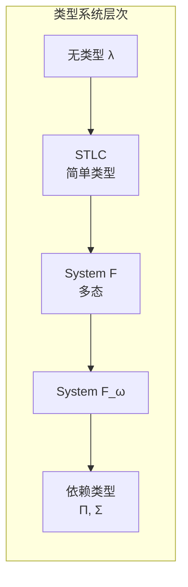
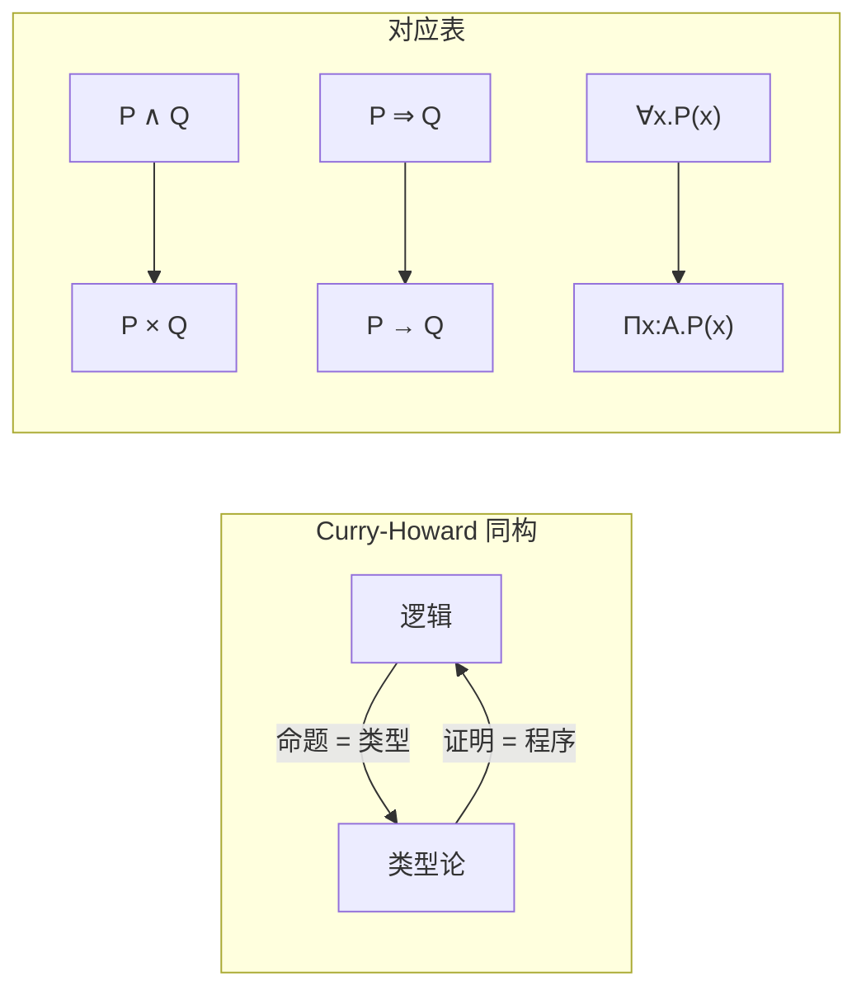
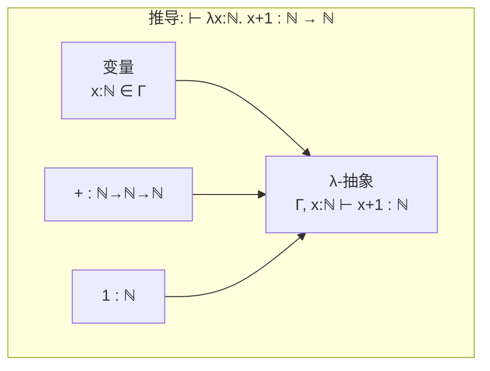
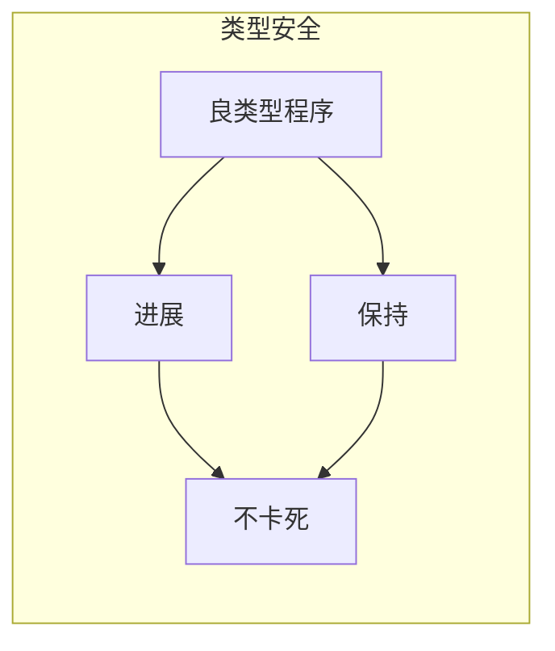
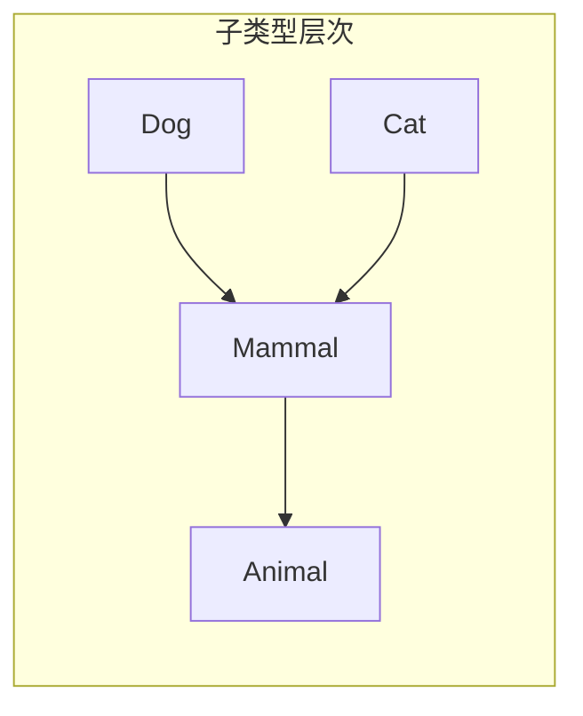

# 类型论基础 (Type Theory Foundation)

> **所属阶段**: Meta/元理论 | **前置依赖**: 00.01-category-theory-foundation.md, 00.02-lattice-order-theory.md | **形式化等级**: L6 (严格数学)

## 目录

- [类型论基础 (Type Theory Foundation)](#类型论基础-type-theory-foundation)
  - [目录](#目录)
  - [1. 概念定义 (Definitions)](#1-概念定义-definitions)
    - [Def-M-21: 类型与项](#def-m-21-类型与项)
    - [Def-M-22: 类型判断](#def-m-22-类型判断)
    - [Def-M-23: 简单类型λ演算 (STLC)](#def-m-23-简单类型λ演算-stlc)
    - [Def-M-24: 多态类型系统 (System F)](#def-m-24-多态类型系统-system-f)
    - [Def-M-25: 依赖类型 (Dependent Types)](#def-m-25-依赖类型-dependent-types)
    - [Def-M-26: 类型安全](#def-m-26-类型安全)
    - [Def-M-27: 子类型](#def-m-27-子类型)
    - [Def-M-28: 递归类型](#def-m-28-递归类型)
    - [Def-M-29: 类型同构](#def-m-29-类型同构)
    - [Def-M-30: Curry-Howard对应](#def-m-30-curry-howard对应)
  - [2. 属性推导 (Properties)](#2-属性推导-properties)
    - [Lemma-M-07: 替换引理](#lemma-m-07-替换引理)
    - [Lemma-M-08: 上下文弱化](#lemma-m-08-上下文弱化)
    - [Lemma-M-09: 唯一类型（对简单类型）](#lemma-m-09-唯一类型对简单类型)
  - [3. 关系建立 (Relations)](#3-关系建立-relations)
    - [类型论与范畴论](#类型论与范畴论)
    - [类型论与格论](#类型论与格论)
  - [4. 论证过程 (Argumentation)](#4-论证过程-argumentation)
    - [类型系统的表达能力谱系](#类型系统的表达能力谱系)
    - [类型安全与运行时错误](#类型安全与运行时错误)
  - [5. 形式证明 (Proofs)](#5-形式证明-proofs)
    - [Thm-M-06: 类型安全性定理](#thm-m-06-类型安全性定理)
    - [Thm-M-07: 强规范化定理](#thm-m-07-强规范化定理)
  - [6. 实例验证 (Examples)](#6-实例验证-examples)
    - [例1: Church编码](#例1-church编码)
    - [例2: 列表类型](#例2-列表类型)
    - [例3: 依赖类型的向量](#例3-依赖类型的向量)
  - [7. 可视化 (Visualizations)](#7-可视化-visualizations)
    - [类型系统层次结构](#类型系统层次结构)
    - [Curry-Howard对应](#curry-howard对应)
    - [类型推导树示例](#类型推导树示例)
    - [类型安全示意图](#类型安全示意图)
    - [子类型关系图](#子类型关系图)
  - [8. 引用参考 (References)](#8-引用参考-references)

## 1. 概念定义 (Definitions)

本节建立类型论的严格数学基础，为USTM-F中的类型系统、程序验证和形式化语义提供理论支撑。

### Def-M-21: 类型与项

**类型** (Type)：对数学对象或计算值的分类。形式上，类型是项的集合，或更抽象地，是项的规范（specification）。

**项** (Term)：类型论中的基本实体，代表数学对象、程序表达式或证明。

**记号**:

- $A, B, C, \tau, \sigma$ 表示类型
- $t, u, v, e$ 表示项
- $t : A$ 表示"项 $t$ 具有类型 $A$"

**类型层次**:

- **基础类型** (Base Types)：$\mathbb{B}$ (布尔), $\mathbb{N}$ (自然数), $\mathbb{Z}$ (整数) 等
- **函数类型** (Function Types)：$A \to B$
- **积类型** (Product Types)：$A \times B$
- **和类型** (Sum Types)：$A + B$
- **泛型/参数化类型**：$\mathrm{List}(A)$, $\mathrm{Option}(A)$ 等

---

### Def-M-22: 类型判断

**类型判断** (Typing Judgment) 形式为：
$$\Gamma \vdash e : \tau$$

读作"在上下文 $\Gamma$ 中，项 $e$ 具有类型 $\tau$"。

**上下文** (Context) $\Gamma$ 是一组类型假设：
$$\Gamma = x_1 : \tau_1, x_2 : \tau_2, \ldots, x_n : \tau_n$$

表示变量 $x_i$ 具有类型 $\tau_i$。

**类型规则** (Typing Rules) 通常以自然演绎形式给出：

$$\frac{\text{前提}_1 \quad \text{前提}_2 \quad \cdots}{\text{结论}} \text{(规则名)}$$

**基本规则示例**:

- **变量规则**:
  $$\frac{x : \tau \in \Gamma}{\Gamma \vdash x : \tau} \text{(var)}$$

- **抽象规则** (函数引入):
  $$\frac{\Gamma, x : \sigma \vdash e : \tau}{\Gamma \vdash \lambda x. e : \sigma \to \tau} \text{(abs)}$$

- **应用规则** (函数消除):
  $$\frac{\Gamma \vdash e_1 : \sigma \to \tau \quad \Gamma \vdash e_2 : \sigma}{\Gamma \vdash e_1 \, e_2 : \tau} \text{(app)}$$

---

### Def-M-23: 简单类型λ演算 (STLC)

**语法**:

$$
\begin{aligned}
\text{类型} \quad \tau &::= b \mid \tau \to \tau \mid \tau \times \tau \mid \tau + \tau \mid \mathbf{1} \mid \mathbf{0} \\
\text{项} \quad e &::= x \mid \lambda x : \tau. e \mid e \, e \mid (e, e) \mid \pi_1 e \mid \pi_2 e \mid \iota_1 e \mid \iota_2 e \mid \mathrm{case}\,e\,\mathrm{of}\ldots \mid () \mid \mathrm{absurd}\,e
\end{aligned}
$$

其中：

- $b$：基础类型
- $\tau \to \tau'$：函数类型
- $\tau \times \tau'$：积类型
- $\tau + \tau'$：和类型
- $\mathbf{1}$：单位类型（终对象）
- $\mathbf{0}$：空类型（始对象）

**归约规则** (β-归约):
$$(\lambda x. e_1) \, e_2 \to_\beta e_1[e_2/x]$$

其中 $e_1[e_2/x]$ 表示将 $e_1$ 中自由出现的 $x$ 替换为 $e_2$（需避免变量捕获）。

**η-归约**:
$$\lambda x. (f \, x) \to_\eta f \quad \text{(若 $x$ 不在 $f$ 中自由出现)}$$

---

### Def-M-24: 多态类型系统 (System F)

**动机**: STLC 中函数只能作用于特定类型。多态允许定义**类型抽象**的函数。

**语法扩展**:
$$\tau ::= \ldots \mid \alpha \mid \forall \alpha. \tau$$
$$e ::= \ldots \mid \Lambda \alpha. e \mid e[\tau]$$

- $\alpha$：类型变量
- $\forall \alpha. \tau$：全称类型（泛型）
- $\Lambda \alpha. e$：类型抽象（类型层面的λ）
- $e[\tau]$：类型应用（实例化）

**类型规则**:

$$\frac{\Gamma \vdash e : \tau \quad \alpha \notin \mathrm{FV}(\Gamma)}{\Gamma \vdash \Lambda \alpha. e : \forall \alpha. \tau} \text{(type-abs)}$$

$$\frac{\Gamma \vdash e : \forall \alpha. \tau}{\Gamma \vdash e[\sigma] : \tau[\sigma/\alpha]} \text{(type-app)}$$

**归约**:
$$(\Lambda \alpha. e)[\sigma] \to e[\sigma/\alpha]$$

**表达能力**: System F 可表达所有原始递归函数，但不支持递归类型。

---

### Def-M-25: 依赖类型 (Dependent Types)

**动机**: 类型可以依赖于项，允许在类型中编码**规范**（specification）。

**依赖函数类型** (Π-type):
$$\Pi_{x:A} B(x) \quad \text{或} \quad (x : A) \to B(x)$$

表示：输入 $x : A$，输出类型依赖于 $x$ 的函数。

当 $B(x) = B$ 不依赖 $x$ 时，$\Pi_{x:A} B = A \to B$。

**依赖积类型** (Σ-type):
$$\Sigma_{x:A} B(x) \quad \text{或} \quad (x : A) \times B(x)$$

表示：第一个分量类型为 $A$，第二个分量类型依赖于第一个分量的值。

**项**: $(a, b)$ 其中 $a : A$，$b : B(a)$。

**示例**: 定长向量类型 $\mathrm{Vec}(A, n)$，其中 $n : \mathbb{N}$。

**类型规则**:
$$\frac{\Gamma, x : A \vdash B(x) : \mathbf{Type} \quad \Gamma \vdash f : \Pi_{x:A} B(x) \quad \Gamma \vdash a : A}{\Gamma \vdash f(a) : B(a)}$$

---

### Def-M-26: 类型安全

类型安全由两个基本性质保证：

**进展** (Progress):
若 $\vdash e : \tau$，则 $e$ 是值，或存在 $e'$ 使得 $e \to e'$。

**保持** (Preservation/Subject Reduction):
若 $\Gamma \vdash e : \tau$ 且 $e \to e'$，则 $\Gamma \vdash e' : \tau$。

**值的定义**: 不可再归约的规范形式，如：

- 函数抽象 $\lambda x. e$
- 对 $(v_1, v_2)$ 其中 $v_1, v_2$ 是值
- 单位 $()$
- 注入 $\iota_i v$

**规范性** (Normalization): 所有良类型的项都有有限的归约序列终止于值。

---

### Def-M-27: 子类型

**子类型关系** $\tau <: \sigma$ 读作"$\tau$ 是 $\sigma$ 的子类型"。

**直观**: 若 $\tau <: \sigma$，则任何 $\tau$ 类型的值都可安全地用作 $\sigma$ 类型的值。

**基本规则**:

- **自反性**: $\tau <: \tau$
- **传递性**: $\tau_1 <: \tau_2 \land \tau_2 <: \tau_3 \implies \tau_1 <: \tau_3$

**函数子类型** (逆变-协变):
$$\frac{\tau_1' <: \tau_1 \quad \tau_2 <: \tau_2'}{\tau_1 \to \tau_2 <: \tau_1' \to \tau_2'}$$

参数类型逆变，返回类型协变。

**记录/结构子类型**:
$$\frac{\{l_i : \tau_i\}_{i \in I} \subseteq \{l_j : \sigma_j\}_{j \in J}}{\{l_j : \sigma_j\}_{j \in J} <: \{l_i : \tau_i\}_{i \in I}}$$

超集（更多字段）是子类型。

---

### Def-M-28: 递归类型

**动机**: 定义无限数据结构，如列表、树。

**等递归** (Equirecursive):
$$\mu \alpha. \tau = \tau[\mu \alpha. \tau / \alpha]$$

类型与其展开完全等同。

**等递归语法**:
$$\tau ::= \ldots \mid \mu \alpha. \tau$$

**示例**: 自然数列表
$$\mathrm{List}_\mathbb{N} = \mu \alpha. \mathbf{1} + \mathbb{N} \times \alpha$$

即：列表要么是空（$\mathbf{1}$），要么是头（$\mathbb{N}$）与尾（$\alpha$，递归）。

**归纳原则**: 递归类型支持**fold/unfold**操作：

- $\mathrm{fold} : \tau[\mu \alpha. \tau / \alpha] \to \mu \alpha. \tau$
- $\mathrm{unfold} : \mu \alpha. \tau \to \tau[\mu \alpha. \tau / \alpha]$

---

### Def-M-29: 类型同构

**定义**: 类型 $A$ 和 $B$ **同构**，记作 $A \cong B$，如果存在项：

- $f : A \to B$
- $g : B \to A$

满足：

- $g \circ f = \mathrm{id}_A$
- $f \circ g = \mathrm{id}_B$

（在适当的等价关系下，如βη-等价）

**重要同构**:

- $A \times B \cong B \times A$ （交换律）
- $(A \times B) \times C \cong A \times (B \times C)$ （结合律）
- $A \times \mathbf{1} \cong A$ （单位元）
- $A \times (B + C) \cong (A \times B) + (A \times C)$ （分配律）
- $(A \to B) \to C \cong A \to (B \to C)$ （Currying）

---

### Def-M-30: Curry-Howard对应

**核心洞察**: 类型论与直觉主义逻辑之间存在**同构**。

| 逻辑 | 类型论 |
|------|--------|
| 命题 $P$ | 类型 $P$ |
| 证明 $p$ | 项 $p : P$ |
| $P \land Q$ | $P \times Q$ (积类型) |
| $P \lor Q$ | $P + Q$ (和类型) |
| $P \implies Q$ | $P \to Q$ (函数类型) |
| $\forall x. P(x)$ | $\Pi_{x:A} P(x)$ (依赖函数) |
| $\exists x. P(x)$ | $\Sigma_{x:A} P(x)$ (依赖积) |
| 真 $\top$ | 单位类型 $\mathbf{1}$ |
| 假 $\bot$ | 空类型 $\mathbf{0}$ |
| $\neg P$ | $P \to \bot$ |

**推论**: 程序即证明，类型即命题。

---

## 2. 属性推导 (Properties)

### Lemma-M-07: 替换引理

若 $\Gamma, x : \sigma \vdash e : \tau$ 且 $\Gamma \vdash e' : \sigma$，则 $\Gamma \vdash e[e'/x] : \tau$。

**证明**: 对 $e$ 的推导进行结构归纳。$\square$

### Lemma-M-08: 上下文弱化

若 $\Gamma \vdash e : \tau$ 且 $\Gamma \subseteq \Gamma'$，则 $\Gamma' \vdash e : \tau$。

### Lemma-M-09: 唯一类型（对简单类型）

在 STLC 中，若 $\Gamma \vdash e : \tau$ 且 $\Gamma \vdash e : \tau'$，则 $\tau = \tau'$。

---

## 3. 关系建立 (Relations)

### 类型论与范畴论

**笛卡尔闭范畴 (CCC)**:
STLC 的模型是笛卡尔闭范畴，其中：

- 对象 = 类型
- 态射 = 项（模可证明等价）
- 积 = 积类型
- 指数 = 函数类型

**局部笛卡尔闭范畴 (LCCC)**:
依赖类型论的模型，支持依赖积。

### 类型论与格论

**子类型格**: 子类型关系 $(\mathcal{T}, <:)$ 形成预序，可商化为偏序。

**类型推导作为不动点**: 在 Hindley-Milner 类型推导中，最一般合一器 (mgu) 可视为不动点计算。

---

## 4. 论证过程 (Argumentation)

### 类型系统的表达能力谱系

| 系统 | 类型算子 | 表达能力 | 类型检查 |
|------|----------|----------|----------|
| STLC | $\to, \times, +$ | 原始递归 | 可判定 |
| System F | $+\,\forall$ | 高阶原始递归 | 可判定 |
| System F$_\omega$ | $+\,\lambda$ 在类型层 | 高阶抽象 | 可判定 |
| 依赖类型 | $\Pi, \Sigma$ | 全逻辑 | 部分可判定 |

### 类型安全与运行时错误

类型安全保证**良类型的程序不会卡死**（不会遇到未定义的操作）。但类型安全不保证：

- 终止性
- 无异常
- 功能正确性

---

## 5. 形式证明 (Proofs)

### Thm-M-06: 类型安全性定理

**定理**: 对 STLC，若 $\vdash e : \tau$，则：

1. **进展**: $e$ 是值，或存在 $e'$ 使得 $e \to e'$
2. **保持**: 若 $e \to e'$，则 $\vdash e' : \tau$

**证明**:

**进展**: 对 $\vdash e : \tau$ 的推导进行归纳。

- 变量情况：不可能（空上下文）
- 抽象：值
- 应用 $e_1 \, e_2$：
  - 由归纳，$e_1$ 是值或可归约
  - 若 $e_1$ 是值，则必为 $\lambda x. e'$（由典型性）
  - 则 $(\lambda x. e') \, e_2 \to e'[e_2/x]$（β-归约）

**保持**: 对 $e \to e'$ 的推导进行归纳。

- β-归约情况：使用替换引理 (Lemma-M-07)。
  - 设 $e = (\lambda x : \sigma. e_1) \, e_2$，$e' = e_1[e_2/x]$
  - 由类型规则，$\Gamma, x : \sigma \vdash e_1 : \tau$ 且 $\Gamma \vdash e_2 : \sigma$
  - 由替换引理，$\Gamma \vdash e_1[e_2/x] : \tau$

其他情况类似。$\square$

---

### Thm-M-07: 强规范化定理

**定理**: STLC 是**强规范化**的：每个良类型的项的所有归约序列都终止。

**证明概要**: 使用**可约候选** (Reducibility Candidates) 或**逻辑关系** (Logical Relations)。

定义类型 $\tau$ 上的逻辑关系 $\mathcal{R}_\tau$：

- $\mathcal{R}_b = \{e \mid e \text{ 强规范化且若 } e \to^* v \text{ 则 } v \text{ 是规范值}\}$
- $\mathcal{R}_{\sigma \to \tau} = \{e \mid \forall u \in \mathcal{R}_\sigma, e \, u \in \mathcal{R}_\tau\}$

证明：**可推导 $\implies$ 可约**。

对归约深度进行归纳，证明良类型项属于对应类型的可约集合，故强规范化。$\square$

---

## 6. 实例验证 (Examples)

### 例1: Church编码

在 System F 中，数据类型可编码为高阶函数：

**Church布尔**:
$$\mathbb{B} = \forall \alpha. \alpha \to \alpha \to \alpha$$
$$\mathrm{true} = \Lambda \alpha. \lambda t : \alpha. \lambda f : \alpha. t$$
$$\mathrm{false} = \Lambda \alpha. \lambda t : \alpha. \lambda f : \alpha. f$$

**Church自然数**:
$$\mathbb{N} = \forall \alpha. (\alpha \to \alpha) \to \alpha \to \alpha$$
$$\bar{n} = \Lambda \alpha. \lambda f : \alpha \to \alpha. \lambda x : \alpha. f^n(x)$$

### 例2: 列表类型

递归定义：
$$\mathrm{List}(A) = \mu \alpha. \mathbf{1} + A \times \alpha$$

构造函数：

- $\mathrm{nil} = \mathrm{fold}(\iota_1 ()) : \mathrm{List}(A)$
- $\mathrm{cons} = \lambda h : A. \lambda t : \mathrm{List}(A). \mathrm{fold}(\iota_2 (h, t)) : A \to \mathrm{List}(A) \to \mathrm{List}(A)$

### 例3: 依赖类型的向量

定长向量避免越界错误：

$$\mathrm{Vec} : \mathbf{Type} \to \mathbb{N} \to \mathbf{Type}$$

构造：

- $\mathrm{vnil} : \mathrm{Vec}(A, 0)$
- $\mathrm{vcons} : \Pi_{n:\mathbb{N}} A \to \mathrm{Vec}(A, n) \to \mathrm{Vec}(A, n+1)$

安全的索引：
$$\mathrm{index} : \Pi_{n:\mathbb{N}} \mathrm{Fin}(n) \to \mathrm{Vec}(A, n) \to A$$

其中 $\mathrm{Fin}(n)$ 是小于 $n$ 的有限类型，保证索引安全。

---

## 7. 可视化 (Visualizations)

### 类型系统层次结构

### Curry-Howard对应

### 类型推导树示例

### 类型安全示意图

### 子类型关系图

---

## 8. 引用参考 (References)
