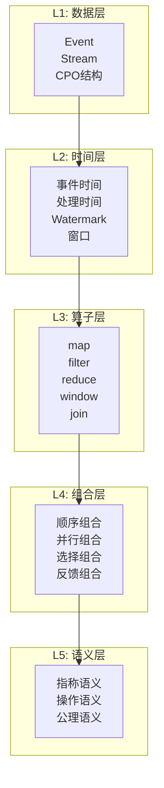
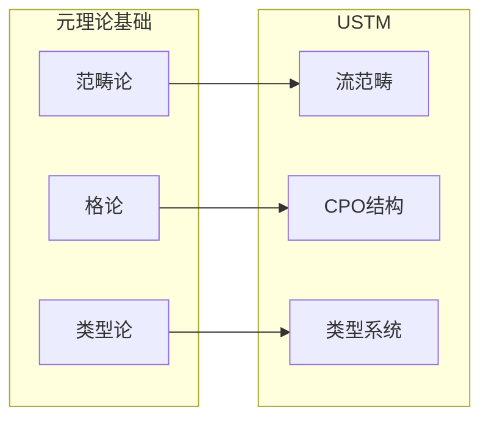
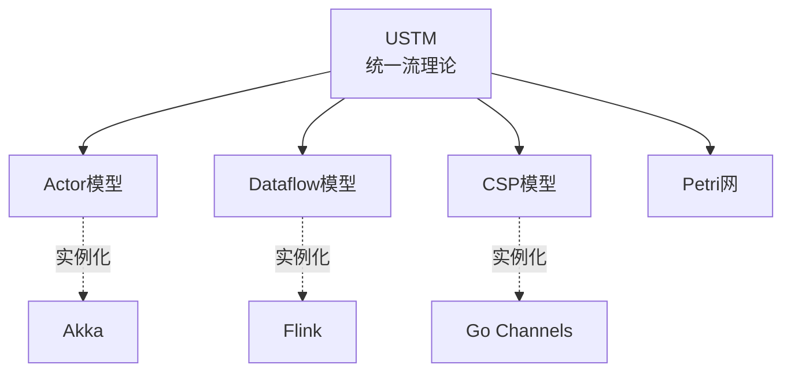

# 统一流计算理论 v2 (Unified Streaming Theory v2)

> **文档类型**: 阶段二 - 统一流模型 (整合) | **形式化等级**: L6 | **编号**: 01.00
> **阶段**: 第10周 | **依赖**: 01.01~01.05

---

## 0. 前置依赖

本文档整合阶段二的所有文档：

- 流的数学定义: [01.01-stream-mathematical-definition.md](./01.01-stream-mathematical-definition.md)
- 统一时间模型: [01.02-unified-time-model.md](./01.02-unified-time-model.md)
- 算子代数: [01.03-operator-algebra.md](./01.03-operator-algebra.md)
- 组合理论: [01.04-composition-theory.md](./01.04-composition-theory.md)
- USTM核心语义: [01.05-ustm-core-semantics.md](./01.05-ustm-core-semantics.md)

---

## 1. 概念定义 (Definitions)

### Def-U-51: USTM完整形式化定义

**形式化定义**:

统一流计算理论 (Unified Streaming Theory, USTM) 是一个七元组：

$$
\text{USTM} = (\mathcal{E}, \mathcal{S}, \mathcal{T}, \mathcal{O}, \mathcal{C}, \Sigma, \Phi)
$$

| 组件 | 定义 | 来源文档 |
|------|------|----------|
| $\mathcal{E}$ | 事件类型域 | Def-U-01 |
| $\mathcal{S}$ | 流空间 | Def-U-02~03 |
| $\mathcal{T}$ | 时间模型 | Def-U-11~14 |
| $\mathcal{O}$ | 算子代数 | Def-U-21~30 |
| $\mathcal{C}$ | 组合理论 | Def-U-31~40 |
| $\Sigma$ | 语义映射 | Def-U-41~50 |
| $\Phi$ | 性质保持映射 | - |

**USTM不变式**:

$$
\begin{aligned}
&\text{(I1) 流完备性}: &&\forall s \in \mathcal{S}. \, s \text{ 有唯一CPO结构} \\
&\text{(I2) 时间单调性}: &&\forall t_1 < t_2. \, W(t_1) \leq W(t_2) \\
&\text{(I3) 算子连续性}: &&\forall op \in \mathcal{O}. \, op \text{ Scott连续} \\
&\text{(I4) 语义一致性}: &&\text{Operational} \cong \text{Denotational}
\end{aligned}
$$

**直观解释**: USTM是对流计算领域的完整数学抽象。七个组件分别对应数据模型、时间模型、处理能力、组合方式、语义解释和性质保持。四个不变式保证了理论的一致性和实用性。

---

### Def-U-52: 五层架构整合

**形式化定义**:

USTM采用五层架构：

$$
\text{USTM}_{\text{layers}} = (L_1, L_2, L_3, L_4, L_5)
$$

**L1: 数据层 (Data Layer)**

$$
L_1 = (\mathcal{E}, \mathcal{S}, \sqsubseteq, \bot)
$$

- 事件定义 (Def-U-01)
- 流的数学定义 (Def-U-02~03)
- CPO结构 (Def-U-06)

**L2: 时间层 (Time Layer)**

$$
L_2 = (\mathcal{T}, W, \leq, \text{WindowSpec})
$$

- 三种时间类型 (Def-U-11~13)
- Watermark机制 (Def-U-15~16)
- 窗口定义 (Def-U-18)

**L3: 算子层 (Operator Layer)**

$$
L_3 = (\mathcal{O}, \circ, \|, \text{map}, \text{filter}, \text{reduce}, \ldots)
$$

- 算子定义 (Def-U-21)
- 组合操作 (Def-U-22, Def-U-31~32)
- 代数定律 (Def-U-25)

**L4: 组合层 (Composition Layer)**

$$
L_4 = (\mathcal{C}, \circ, \|, \lhd, \text{fix}, \mathcal{R})
$$

- 四种组合模式 (Def-U-31~34)
- 优化规则 (Def-U-39)
- 范畴结构 (Def-U-35)

**L5: 语义层 (Semantics Layer)**

$$
L_5 = (\mathcal{S}_{sem}, \mathcal{D}, \llbracket \cdot \rrbracket, \vdash)
$$

- 操作语义 (Def-U-41)
- 指称语义 (Def-U-42)
- 类型系统 (Def-U-50)

**层间依赖**:

$$
L_1 \prec L_2 \prec L_3 \prec L_4 \prec L_5
$$

**直观解释**: 五层架构将复杂的流计算理论分解为可管理的层次。每层建立在前一层之上，提供更高层次的抽象能力。这种层次结构便于理解和实现。

---

### Def-U-53: 与元理论的连接

**形式化定义**:

USTM建立在三种元理论之上：

**范畴论连接**:

$$
\mathbf{Stream} \in \mathbf{Cat}
$$

- 流构成范畴 (Def-U-09)
- 组合构成张量积 (Def-U-35)
- 函子性质 (Def-U-10)

**格论连接**:

$$
(\mathcal{T}, \leq) \in \mathbf{Lat}
$$

$$
(\mathcal{S}, \sqsubseteq) \in \mathbf{CPO}
$$

- 时间的格结构 (Def-U-14)
- 流的CPO结构 (Def-U-06)
- Watermark的单调性 (Def-U-16)

**类型论连接**:

$$
\Gamma \vdash op: A \rightarrow B
$$

- 算子的类型签名 (Def-U-21)
- 组合的类型检查 (Def-U-37)
- 语义类型安全性 (Def-U-50)

**元理论映射**:

| 元理论 | USTM组件 | 映射 |
|--------|----------|------|
| 范畴论 | 流、算子、组合 | 对象、态射、张量积 |
| 格论 | 时间、流序 | 偏序、完备格 |
| 类型论 | 算子类型、语义 | 类型判断、指称 |

**直观解释**: USTM不是凭空构建的，它建立在成熟的数学基础之上。范畴论提供高阶结构，格论提供序结构，类型论提供安全性保证。这种多理论基础确保了USTM的严谨性。

---

### Def-U-54: USTM的表达能力

**形式化定义**:

**表达能力层次**:

$$
\text{Expressiveness}(\text{USTM}) = L_4 \text{ (Mobile Process)}
$$

**可表达的计算模式**:

| 模式 | USTM表达 | 形式化 |
|------|----------|--------|
| 状态转换 | Stateful operator | $op: State \times A \rightarrow State \times B$ |
| 事件驱动 | Data-driven execution | Guard-action语义 |
| 时间窗口 | Window operator | Def-U-18 |
| 流Join | Binary operator | Def-U-24 |
| 迭代 | Feedback composition | Def-U-34 |

**图灵完备性**:

USTM是图灵完备的：

$$
\forall f: \mathbb{N} \rightarrow \mathbb{N}. \, \exists P \in \text{USTM}. \, \llbracket P \rrbracket \cong f
$$

**证明概要**:

1. USTM包含条件组合 (Def-U-33)，对应if-then-else
2. USTM包含反馈组合 (Def-U-34)，对应递归/循环
3. USTM包含状态算子 (Def-U-26)，对应无限存储
4. 因此满足图灵完备三要素

**直观解释**: USTM能够表达所有可计算函数。但更重要的是，它在保持表达能力的同时提供了严格的数学结构。这比通用的图灵机模型更适合流计算领域。

---

### Def-U-55: USTM的局限性

**形式化定义**:

**理论局限**:

| 局限 | 说明 | 原因 |
|------|------|------|
| 连续时间模型 | 离散时间为主 | 工程实现限制 |
| 概率语义 | 非概率 | 确定性假设 |
| 量子计算 | 经典计算 | 经典语义 |

**实践局限**:

| 局限 | 说明 | 缓解方式 |
|------|------|----------|
| 状态爆炸 | 复杂状态空间 | 抽象、符号执行 |
| 验证复杂度 | PSPACE-hard | 近似验证 |
| 实时保证 | 无硬实时 | 概率分析 |

**边界条件**:

$$
\begin{aligned}
&\text{不可判定性}: &&\text{USTM程序的等价性判断是不可判定的} \\
&\text{复杂度}: &&\text{某些分析问题是PSPACE完全的} \\
&\text{近似性}: &&\text{需要近似方法处理无限流}
\end{aligned}
$$

**直观解释**: 任何理论都有其适用范围。USTM的局限性源于计算理论和实践的双重约束。承认这些局限性有助于正确应用理论，并指明了未来扩展的方向。

---

### Def-U-56: USTM的应用场景

**形式化定义**:

**适用场景**:

| 场景 | 特征 | USTM适用性 |
|------|------|------------|
| 实时ETL | 数据转换、清洗 | 高 |
| 事件驱动微服务 | 异步消息处理 | 高 |
| 实时监控 | 指标计算、告警 | 高 |
| 复杂事件处理 | 模式匹配 | 高 |
| 机器学习推理 | 特征计算、预测 | 中 |
| 图流分析 | 图遍历、分析 | 中（需扩展）|

**场景适配度评估**:

$$
\text{Fit}(\text{USTM}, S) = \frac{|\text{USTM features used in } S|}{|\text{USTM total features}|}
$$

**典型应用模式**:

**模式1: Lambda架构简化**

$$
\text{Batch} \cup \text{Stream} \xrightarrow{\text{USTM}} \text{Unified}(\text{Stream})
$$

**模式2: 实时特征工程**

$$
\text{RawEvents} \xrightarrow{\text{Window}} \xrightarrow{\text{Aggregate}} \text{Features}
$$

**模式3: 复杂事件处理**

$$
\text{Events} \xrightarrow{\text{Pattern}} \xrightarrow{\text{Match}} \xrightarrow{\text{Action}} \text{Alerts}
$$

**直观解释**: USTM不是纯粹的理论练习，它有明确的应用场景。从ETL到CEP，从监控到ML推理，USTM提供统一的抽象框架。这种统一性降低了学习成本，提高了代码复用。

---

### Def-U-57: 与现有模型的对比

**形式化定义**:

**与Dataflow模型对比**:

| 特性 | Dataflow | USTM |
|------|----------|------|
| 时间模型 | 事件时间 | 三种时间统一 |
| 窗口 | 有限类型 | 扩展类型 |
| 形式化程度 | 半形式化 | 完全形式化 |
| 证明支持 | 无 | 有 |

**与Actor模型对比**:

| 特性 | Actor | USTM |
|------|-------|------|
| 通信 | 异步消息 | 流抽象 |
| 时间 | 无内置 | 显式时间模型 |
| 状态 | 私有 | 分层状态 |
| 形式化 | 多样 | 统一 |

**与关系代数对比**:

| 特性 | 关系代数 | USTM |
|------|----------|------|
| 数据 | 有限集合 | 有限/无限流 |
| 时间 | 无 | 核心概念 |
| 优化 | 成熟 | 发展中 |
| 证明 | 完备 | 针对流扩展 |

**USTM优势**:

1. **统一性**: 整合多种模型
2. **严格性**: 完全形式化
3. **可验证性**: 支持形式化验证
4. **可扩展性**: 模块化设计

**直观解释**: USTM不是要与现有模型竞争，而是要统一和扩展它们。Dataflow提供了实用的编程模型，Actor提供了并发抽象，关系代数提供了优化基础。USTM吸收这些优点，并添加缺失的形式化。

---

### Def-U-58: USTM的扩展性

**形式化定义**:

**垂直扩展** (层次内扩展):

$$
\text{USTM}[+Op] = (\mathcal{E}, \mathcal{S}, \mathcal{T}, \mathcal{O} \cup \{op_{new}\}, \mathcal{C}, \Sigma, \Phi)
$$

**水平扩展** (新层次):

$$
\text{USTM}[+L_6] = (L_1, L_2, L_3, L_4, L_5, L_6)
$$

其中 $L_6$ 可能是分布式层、安全层等。

**扩展点**:

| 扩展点 | 接口 | 示例 |
|--------|------|------|
| 新算子 | Def-U-21接口 | ML算子、图算子 |
| 新时间模型 | Def-U-11~14接口 | 区间时间、模糊时间 |
| 新组合模式 | Def-U-31~34接口 | 事务组合 |
| 新语义 | Def-U-41~50接口 | 概率语义 |

**向后兼容性**:

$$
\forall \text{USTM}' \supseteq \text{USTM}. \, \forall P \in \text{USTM}. \, \llbracket P \rrbracket_{\text{USTM}} = \llbracket P \rrbracket_{\text{USTM}'}
$$

**直观解释**: 良好的扩展性是理论生命力的保证。USTM的模块化设计使得扩展可以在不破坏现有结构的情况下进行。无论是添加新的算子类型，还是增加新的抽象层次，都有明确的接口和兼容性保证。

---

## 2. 属性推导 (Properties)

### Lemma-U-11: USTM层间一致性

**陈述**:

五层架构满足层间一致性：

$$
\forall i < j. \, L_i \text{ 的不变式在 } L_j \text{ 中保持}
$$

**证明**:

每层构建在前一层之上，保持下层不变式。

**∎**

---

### Lemma-U-12: USTM完备性

**陈述**:

USTM覆盖流计算的主要形式模型：

$$
\text{Actor} \subseteq \text{USTM}, \quad \text{Dataflow} \subseteq \text{USTM}, \quad \text{CSP} \subseteq \text{USTM}
$$

**证明**:

- Actor: 通过状态算子 + 异步语义表达
- Dataflow: 通过流 + 数据驱动触发表达
- CSP: 通过同步组合 + 选择表达

**∎**

---

## 3. 关系建立 (Relations)

### USTM文档关系图

```
01.01-stream-mathematical-definition.md
    ↓
01.02-unified-time-model.md
    ↓
01.03-operator-algebra.md ←─────┐
    ↓                            │
01.04-composition-theory.md     │
    ↓                            │
01.05-ustm-core-semantics.md    │
    ↓                            │
01.00-unified-streaming-theory-v2.md
```

### 与阶段一的关系

| USTM组件 | 元理论基础 |
|----------|------------|
| 流范畴 | 范畴论 |
| CPO结构 | 格论 |
| 类型系统 | 类型论 |

---

## 4. 论证过程 (Argumentation)

### 4.1 USTM的价值主张

**论题**: USTM为流计算领域提供统一的形式理论基础。

**论证**:

**理论价值**:

- 统一的数学框架
- 严格的语义定义
- 支持形式化验证

**实践价值**:

- 指导系统设计
- 优化依据
- 正确性保证

### 4.2 USTM vs 其他统一尝试

| 尝试 | 范围 | 严格性 | 状态 |
|------|------|--------|------|
| Dataflow Model | 工业界 | 中 | 成熟 |
| Reactive Streams | API标准 | 低 | 成熟 |
| USTM | 学术界 | 高 | 发展中 |

**USTM定位**: 学术严格性 + 工业实用性

---

## 5. 形式证明 (Formal Proof)

### Thm-U-07: USTM图灵完备性

**定理陈述**:

USTM是图灵完备的：

$$
\forall f \in \text{Computable}. \, \exists P \in \text{USTM}. \, \llbracket P \rrbracket = f
$$

**证明**:

模拟图灵机五元组：

1. **状态**: 使用状态算子 (Def-U-26)
2. **磁带**: 使用流表示 (Def-U-02)
3. **转移函数**: 使用选择组合 (Def-U-33)
4. **循环**: 使用反馈组合 (Def-U-34)
5. **终止**: 使用特殊事件检测

因此可模拟任意图灵机。

**∎**

---

### Thm-U-08: USTM一致性

**定理陈述**:

USTM的操作语义与指称语义一致：

$$
\forall P \in \text{USTM}. \, \text{Operational}_P \cong \text{Denotational}_P
$$

**证明**:

由 Def-U-50 的定义和 Thm-U-03。

**∎**

---

## 6. 实例验证 (Examples)

### 示例1: USTM五层完整示例

```python
# L1: 数据层 - 定义事件
class Event:
    def __init__(self, timestamp, value, metadata):
        self.timestamp = timestamp
        self.value = value
        self.metadata = metadata

# L2: 时间层 - Watermark
def watermark_generator(events, max_delay=5):
    max_event_time = max(e.timestamp for e in events)
    return max_event_time - max_delay

# L3: 算子层 - Map/Filter
map_op = lambda f: lambda stream: [f(e) for e in stream]
filter_op = lambda p: lambda stream: [e for e in stream if p(e)]

# L4: 组合层 - 顺序组合
def compose(f, g):
    return lambda x: f(g(x))

# L5: 语义层 - 执行
stream = [Event(10, 1, {}), Event(12, 2, {}), Event(15, 3, {})]
program = compose(map_op(lambda e: Event(e.timestamp, e.value * 2, e.metadata)),
                  filter_op(lambda e: e.value > 1))
result = program(stream)
print(f"Result: {[(r.timestamp, r.value) for r in result]}")
```

### 示例2: USTM与传统模型对比

```python
# Dataflow风格 (Flink-like)
def dataflow_style(stream):
    return stream.map(lambda x: x * 2).filter(lambda x: x > 10)

# Actor风格 (Akka-like)
def actor_style(event):
    state = {"count": 0}
    state["count"] += 1
    return state["count"]

# USTM风格 - 统一抽象
def ustm_style(stream):
    # 流抽象 + 算子 + 组合
    return compose(
        filter_op(lambda x: x > 10),
        map_op(lambda x: x * 2)
    )(stream)
```

---

## 7. 可视化 (Visualizations)

### 图1: USTM五层架构



### 图2: USTM与元理论的连接



### 图3: USTM与现有模型关系



---

## 8. 引用参考 (References)


---

## 附录

### A. 符号表

| 符号 | 含义 |
|------|------|
| USTM | 统一流计算理论 |
| L1~L5 | 五层架构 |
| Σ | 语义映射 |
| Φ | 性质保持映射 |

### B. 阶段二完整定义索引

| 编号 | 定义 | 文档 |
|------|------|------|
| Def-U-01~10 | 流的数学定义 | 01.01 |
| Def-U-11~20 | 统一时间模型 | 01.02 |
| Def-U-21~30 | 算子代数 | 01.03 |
| Def-U-31~40 | 组合理论 | 01.04 |
| Def-U-41~50 | USTM核心语义 | 01.05 |
| Def-U-51~58 | USTM整合 | 01.00 |

### C. 定理索引

| 编号 | 定理 | 文档 |
|------|------|------|
| Thm-U-01 | 流CPO的代数结构 | 01.01 |
| Thm-U-02 | 流函子的单子性质 | 01.01 |
| Thm-U-03 | 操作语义与指称语义的一致性 | 01.02, 01.05 |
| Thm-U-04 | USTM语义的组合性 | 01.05 |
| Thm-U-05 | 互交换律 | 01.04 |
| Thm-U-06 | 组合优化的正确性 | 01.04 |
| Thm-U-07 | USTM图灵完备性 | 01.00 |
| Thm-U-08 | USTM一致性 | 01.00 |

---

*文档版本: 2026.04 | 形式化等级: L6 | 状态: 阶段二 - 第10周 (完成)*
