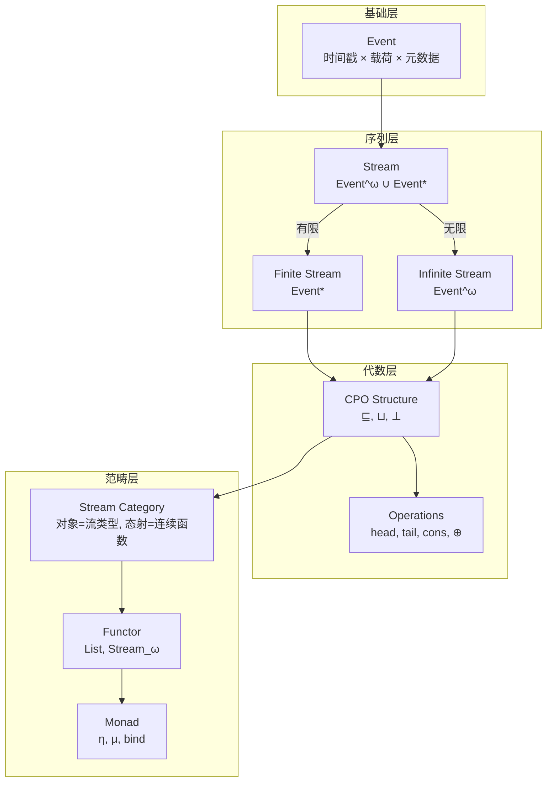
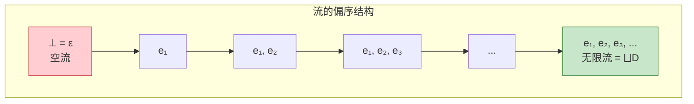
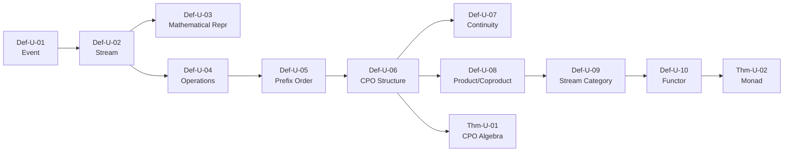

# 流的数学定义 (Stream Mathematical Definition)

> **文档类型**: 阶段二 - 统一流模型 | **形式化等级**: L5-L6 | **编号**: 01.01
> **阶段**: 第5周 | **依赖**: 00-meta/

---

## 目录

- [流的数学定义 (Stream Mathematical Definition)](#流的数学定义-stream-mathematical-definition)
  - [目录](#目录)
  - [0. 前置依赖](#0-前置依赖)
  - [1. 概念定义 (Definitions)](#1-概念定义-definitions)
    - [Def-U-01: 事件 (Event)](#def-u-01-事件-event)
    - [Def-U-02: 流 (Stream)](#def-u-02-流-stream)
    - [Def-U-03: 流的数学表示](#def-u-03-流的数学表示)
    - [Def-U-04: 流的操作 (Stream Operations)](#def-u-04-流的操作-stream-operations)
    - [Def-U-05: 流的偏序关系 (Prefix Order)](#def-u-05-流的偏序关系-prefix-order)
    - [Def-U-06: 流的完备偏序 (CPO) 结构](#def-u-06-流的完备偏序-cpo-结构)
    - [Def-U-07: 流的连续性](#def-u-07-流的连续性)
    - [Def-U-08: 流的积与余积](#def-u-08-流的积与余积)
    - [Def-U-09: 流范畴 (Stream Category)](#def-u-09-流范畴-stream-category)
    - [Def-U-10: 流的函子性质](#def-u-10-流的函子性质)
  - [2. 属性推导 (Properties)](#2-属性推导-properties)
    - [Lemma-U-01: 前缀序的完全性](#lemma-u-01-前缀序的完全性)
    - [Lemma-U-02: 流操作与序的兼容性](#lemma-u-02-流操作与序的兼容性)
  - [3. 关系建立 (Relations)](#3-关系建立-relations)
    - [与阶段一元理论的关系](#与阶段一元理论的关系)
    - [与现有Struct文档的关系](#与现有struct文档的关系)
  - [4. 论证过程 (Argumentation)](#4-论证过程-argumentation)
    - [4.1 流模型的完备性论证](#41-流模型的完备性论证)
    - [4.2 连续性的必要性分析](#42-连续性的必要性分析)
  - [5. 形式证明 (Formal Proof)](#5-形式证明-formal-proof)
    - [Thm-U-01: 流CPO的代数结构定理](#thm-u-01-流cpo的代数结构定理)
    - [Thm-U-02: 流函子的单子性质定理](#thm-u-02-流函子的单子性质定理)
  - [6. 实例验证 (Examples)](#6-实例验证-examples)
    - [示例1: 温度传感器流](#示例1-温度传感器流)
    - [示例2: 无限流的有限近似](#示例2-无限流的有限近似)
  - [7. 可视化 (Visualizations)](#7-可视化-visualizations)
    - [图1: 流的代数结构层次图](#图1-流的代数结构层次图)
    - [图2: 前缀序与上确界](#图2-前缀序与上确界)
  - [8. 引用参考 (References)](#8-引用参考-references)
  - [附录](#附录)
    - [A. 符号表](#a-符号表)
    - [B. 依赖图](#b-依赖图)
  - [文档交叉引用](#文档交叉引用)
    - [前置依赖](#前置依赖)
    - [后续文档](#后续文档)
    - [本文档关键定义](#本文档关键定义)
    - [本文档关键定理](#本文档关键定理)

## 0. 前置依赖

本文档依赖以下元理论基础：

- 范畴论基础: [00.01-category-theory-foundation.md](../00-meta/00.01-category-theory-foundation.md)
- 格论与序理论: [00.02-lattice-order-theory.md](../00-meta/00.02-lattice-order-theory.md)
- 类型论基础: [00.03-type-theory-foundation.md](../00-meta/00.03-type-theory-foundation.md)

---

## 1. 概念定义 (Definitions)

### Def-U-01: 事件 (Event)

**形式化定义**:

$$
\text{Event} \triangleq \langle \tau, v, m \rangle \in \mathcal{T} \times \mathcal{V} \times \mathcal{M}
$$

其中：

- $\tau \in \mathcal{T}$: 事件的时间戳（Timestamp），来自时间域
- $v \in \mathcal{V}$: 事件载荷（Payload/Value），来自值域
- $m \in \mathcal{M}$: 事件元数据（Metadata），包含来源、序列号等

**类型系统**:

```
Event[T] := Timestamp × T × Metadata
  where Timestamp := ℕ (discrete) | ℝ (continuous)
        Metadata  := SourceId × SeqNum × Attributes
```

**直观解释**: 事件是流计算的基本数据单元，类比于离散数学中的"点"。每个事件携带业务数据（载荷）和系统信息（时间戳与元数据）。时间戳允许我们定义事件的顺序，元数据支持追踪和路由。

**示例**:

```
温度传感器事件: ⟨2026-04-08T14:06:16Z, 23.5°C, {sensor_id: T-001, seq: 42}⟩
用户点击事件: ⟨1712575576000, {user: "u123", page: "/home"}, {source: web, ip: 10.0.0.1}⟩
```

---

### Def-U-02: 流 (Stream)

**形式化定义**:

流是事件的序列，可以是有限的或无限的：

$$
\text{Stream} ::= \text{Event}^\omega \cup \text{Event}^*
$$

其中：

- $\text{Event}^*$: 有限流（Kleene星号），长度为 $n \in \mathbb{N}$
- $\text{Event}^\omega$: 无限流（Omega），可数无限序列

**流类型分类**:

| 类型 | 记号 | 定义 | 示例 |
|------|------|------|------|
| 有限流 | $s \in \text{Event}^n$ | $\|s\| = n < \infty$ | 批处理数据集 |
| 无限流 | $s \in \text{Event}^\omega$ | $\|s\| = \infty$ | 实时监控流 |
| 混合流 | $s \in \text{Event}^{\leq \omega}$ | 有限或无限 | 通用流抽象 |

**流的构造**:

$$
\begin{aligned}
\epsilon &\in \text{Event}^* \quad \text{(空流)} \\
e :: s &\in \text{Event}^{\leq \omega} \quad \text{若 } e \in \text{Event}, s \in \text{Event}^{\leq \omega}
\end{aligned}
$$

**直观解释**: 流是事件的时间有序集合，类似于数学中的序列。
有限流对应批处理中的数据集，无限流对应持续产生的实时数据。
流的统一抽象允许我们用相同的算子处理批处理和流处理。

---

### Def-U-03: 流的数学表示

**形式化定义**:

流可以用以下等价方式表示：

**1. 序列表示**:

$$
\text{Stream} := \text{Event}^\omega \cup \text{Event}^*
$$

**2. 函数表示** (将位置映射到事件):

$$
s: \mathbb{N} \rightharpoonup \text{Event} \quad \text{(部分函数)}
$$

其中定义域 $\text{dom}(s) = \{0, 1, \ldots, |s|-1\}$ 对有限流，或 $\mathbb{N}$ 对无限流。

**3. 余代数表示** (作为终余代数):

$$
\text{Stream} = \nu X. \text{Event} \times X \cup \{\bullet\}
$$

其中 $\nu$ 表示最大不动点，$\bullet$ 表示流的终止（仅对有限流）。

**4. 范畴表示**:

$$
\text{Stream} := \text{Event}^\mathbb{N} \cup \bigcup_{n \in \mathbb{N}} \text{Event}^n
$$

其中 $\text{Event}^A$ 表示从 $A$ 到 $\text{Event}$ 的函数集合。

**直观解释**: 流的多种数学表示展示了其丰富的代数结构。序列表示直观易懂，函数表示便于定义操作，余代数表示揭示了流的递归本质，范畴表示则支持高阶抽象。这种多视角统一是USTM的理论基础。

---

### Def-U-04: 流的操作 (Stream Operations)

**形式化定义**:

**基本操作**:

**1. Head (取首元素)**:

$$
\text{head}: \text{Event}^{\leq \omega} \setminus \{\epsilon\} \rightarrow \text{Event}
$$
$$
\text{head}(e :: s) = e
$$

**2. Tail (取余流)**:

$$
\text{tail}: \text{Event}^{\leq \omega} \setminus \{\epsilon\} \rightarrow \text{Event}^{\leq \omega}
$$
$$
\text{tail}(e :: s) = s
$$

**3. Cons (前置构造)**:

$$
(::): \text{Event} \times \text{Event}^{\leq \omega} \rightarrow \text{Event}^{\leq \omega}
$$
$$
e :: s = \lambda 0 \mapsto e, (n+1) \mapsto s(n)
$$

**4. 索引访问**:

$$
s[i] := \begin{cases}
e_i & \text{if } i < |s| \land s = \langle e_0, e_1, \ldots \rangle \\
\bot & \text{otherwise}
\end{cases}
$$

**5. 流连接 (Append)**:

$$
\oplus: \text{Event}^* \times \text{Event}^{\leq \omega} \rightarrow \text{Event}^{\leq \omega}
$$
$$
\epsilon \oplus s = s, \quad (e :: s_1) \oplus s_2 = e :: (s_1 \oplus s_2)
$$

**操作性质**:

| 定律 | 陈述 | 类型 |
|------|------|------|
| Head-Tail | $\text{head}(e :: s) :: \text{tail}(e :: s) = e :: s$ | 同构 |
| Cons-Head-Tail | 若 $s \neq \epsilon$，则 $\text{head}(s) :: \text{tail}(s) = s$ | 同构 |
| Append-Assoc | $(s_1 \oplus s_2) \oplus s_3 = s_1 \oplus (s_2 \oplus s_3)$ | 结合律 |
| Empty-Neutral | $\epsilon \oplus s = s$ | 单位元 |

**直观解释**: 这些操作是流上的基本构建块。head/tail/cons 构成流的核心代数结构，类似于列表的 CAR/CDR/CONS。流连接允许我们合并有限流与有限或无限流，这在处理窗口和分区时至关重要。

---

### Def-U-05: 流的偏序关系 (Prefix Order)

**形式化定义**:

定义流上的前缀序关系 $\sqsubseteq$:

$$
s_1 \sqsubseteq s_2 \iff \exists s'. \, s_1 \oplus s' = s_2
$$

**性质**:

**自反性**: $\forall s. \, s \sqsubseteq s$

**传递性**: $s_1 \sqsubseteq s_2 \land s_2 \sqsubseteq s_3 \Rightarrow s_1 \sqsubseteq s_3$

**反对称性**: $s_1 \sqsubseteq s_2 \land s_2 \sqsubseteq s_1 \Rightarrow s_1 = s_2$

因此 $(\text{Event}^{\leq \omega}, \sqsubseteq)$ 构成**偏序集 (poset)**。

**严格前缀**:

$$
s_1 \sqsubset s_2 \iff s_1 \sqsubseteq s_2 \land s_1 \neq s_2
$$

**前缀闭包**:

流集合 $S$ 的前缀闭包定义为：

$$
\downarrow S = \{ s' \mid \exists s \in S. \, s' \sqsubseteq s \}
$$

**直观解释**: 前缀序描述了"部分信息"关系。$s_1 \sqsubseteq s_2$ 表示 $s_1$ 是 $s_2$ 的初始片段，即 $s_2$ 包含了 $s_1$ 的所有信息（可能更多）。这在流计算中非常重要，因为它形式化了"增量计算"的概念——我们可以在只看到部分输入时就开始产生输出。

---

### Def-U-06: 流的完备偏序 (CPO) 结构

**形式化定义**:

流集合配备前缀序后构成**完备偏序 (Complete Partial Order, CPO)**：

$$
(\text{Event}^{\leq \omega}, \sqsubseteq, \bot)
$$

其中：

- $\sqsubseteq$: 前缀序
- $\bot = \epsilon$: 最小元（空流）

**完备性** (Completeness):

对于任意**有向子集** $D \subseteq \text{Event}^{\leq \omega}$，其上确界 $\bigsqcup D$ 存在。

**有向集定义**:

$D$ 是有向的当且仅当：

$$
\forall s_1, s_2 \in D. \, \exists s_3 \in D. \, s_1 \sqsubseteq s_3 \land s_2 \sqsubseteq s_3
$$

**上确界计算**:

对于有向集 $D$，其上确界为：

$$
\bigsqcup D = \lambda n \mapsto e \quad \text{其中 } e = s(n) \text{ 对某个 } s \in D \text{ 满足 } n \in \text{dom}(s)
$$

**CPO 性质**:

| 性质 | 验证 | 说明 |
|------|------|------|
| 有最小元 | $\epsilon \sqsubseteq s$ 对所有 $s$ | 空流是最小元 |
| 有向上确界 | 有向集的上确界是它们的"并" | 递增序列的极限 |
| 连续性基础 | 支持Scott连续函数 | 不动点理论适用 |

**直观解释**: CPO结构是流计算的数学基础，它保证了我们可以对递归定义的流算子进行不动点分析。任何递增的流序列都有极限（上确界），这意味着无限流可以被理解为有限流序列的极限。这在定义无限流的语义时至关重要。

---

### Def-U-07: 流的连续性

**形式化定义**:

函数 $f: \text{Event}^{\leq \omega} \rightarrow \text{Event}^{\leq \omega}$ 是**Scott连续**的当且仅当：

**1. 单调性**:

$$
s_1 \sqsubseteq s_2 \Rightarrow f(s_1) \sqsubseteq f(s_2)
$$

**2. 保上确界性**:

对于所有有向集 $D$:

$$
f(\bigsqcup D) = \bigsqcup_{s \in D} f(s)
$$

**连续性等级**:

| 类型 | 定义 | 示例算子 |
|------|------|----------|
| 严格连续 | $f(\epsilon) = \epsilon$ | filter, map |
| 非严格连续 | $f(\epsilon) \neq \epsilon$ | count (输出0) |
| Lipschitz连续 | $\exists K. \, d(f(s_1), f(s_2)) \leq K \cdot d(s_1, s_2)$ | 有限状态转换 |

**连续函数性质**:

**引理** (连续函数的复合): 若 $f, g$ 连续，则 $f \circ g$ 连续。

**引理** (不动点存在性): 若 $f$ 连续，则 $\text{fix}(f) = \bigsqcup_{n \geq 0} f^n(\bot)$ 是 $f$ 的最小不动点。

**直观解释**: 连续性保证了函数的行为是"可预测的"。如果输入流的更多信息不会改变之前已产生的输出，这个性质称为单调性。保上确界性则保证了对无限流的处理可以通过有限近似来定义。所有实用的流算子（map、filter、window等）都是连续的。

---

### Def-U-08: 流的积与余积

**形式化定义**:

在范畴 $\mathbf{Stream}$ 中，定义积与余积：

**积 (Product)**:

$$
S_1 \times S_2 := \{ \langle s_1, s_2 \rangle \mid s_1 \in S_1, s_2 \in S_2 \}
$$

投影：

$$
\pi_1: S_1 \times S_2 \rightarrow S_1, \quad \pi_1(\langle s_1, s_2 \rangle) = s_1
$$

$$
\pi_2: S_1 \times S_2 \rightarrow S_2, \quad \pi_2(\langle s_1, s_2 \rangle) = s_2
$$

通用性质：对任意 $f: X \rightarrow S_1, g: X \rightarrow S_2$，存在唯一的 $\langle f, g \rangle: X \rightarrow S_1 \times S_2$ 使得下图交换：

```
    X
   /|\
  / | \
 f  |  g
 /  |h=⟨f,g⟩\
v   v      v
S₁ ←─ S₁×S₂ ─→ S₂
   π₁      π₂
```

**余积 (Coproduct)**:

$$
S_1 + S_2 := (S_1 \times \{1\}) \cup (S_2 \times \{2\})
$$

包含映射：

$$
\iota_1: S_1 \rightarrow S_1 + S_2, \quad \iota_1(s) = \langle s, 1 \rangle
$$

$$
\iota_2: S_2 \rightarrow S_1 + S_2, \quad \iota_2(s) = \langle s, 2 \rangle
$$

通用性质：对任意 $f: S_1 \rightarrow X, g: S_2 \rightarrow X$，存在唯一的 $[f, g]: S_1 + S_2 \rightarrow X$ 使得下图交换：

```
    S₁
   / \
  ι₁  \
 /     \ f
v       v
S₁+S₂ ───→ X
^       ^
 ι₂     / g
  \   /
   \ /
    S₂
```

**流积的具体构造** (Zip):

$$
\text{zip}: \text{Event}_1^{\leq \omega} \times \text{Event}_2^{\leq \omega} \rightarrow (\text{Event}_1 \times \text{Event}_2)^{\leq \omega}
$$

$$
\text{zip}(\langle e_1 :: s_1 \rangle, \langle e_2 :: s_2 \rangle) = \langle \langle e_1, e_2 \rangle :: \text{zip}(s_1, s_2) \rangle
$$

**流余积的具体构造** (Either):

$$
\text{merge}: \text{Event}^{\leq \omega} + \text{Event}^{\leq \omega} \rightarrow \text{Event}^{\leq \omega}
$$

$$
\text{merge}(\langle s, 1 \rangle) = s, \quad \text{merge}(\langle s, 2 \rangle) = s
$$

**直观解释**: 积表示"并行组合"——两个流同时存在；余积表示"选择组合"——要么是第一个流，要么是第二个流。zip操作将两个流按位置配对，是流join操作的基础。余积则支持流的合并（union）操作。

---

### Def-U-09: 流范畴 (Stream Category)

**形式化定义**:

定义**流范畴** $\mathbf{Stream}$：

**对象**:

$$\text{Obj}(\mathbf{Stream}) = \{ \text{Event}^{\leq \omega} \mid \text{Event} \in \text{Type} \}
$$

即所有可能的流类型。

**态射**:

$$\text{Hom}(S_1, S_2) = \{ f: S_1 \rightarrow S_2 \mid f \text{ 是Scott连续的} \}
$$

**恒等态射**:

$$\text{id}_S: S \rightarrow S, \quad \text{id}_S(s) = s
$$

**态射复合**:

$$(f \circ g)(x) = f(g(x))
$$

**范畴公理验证**:

**结合律**: $(h \circ g) \circ f = h \circ (g \circ f)$

**单位元**: $\text{id} \circ f = f = f \circ \text{id}$

**范畴性质**:

| 性质 | 验证 | 说明 |
|------|------|------|
| 积存在 | 是 | 如上定义的积 |
| 余积存在 | 是 | 如上定义的余积 |
| 终止对象 | $\mathbf{1}$ (单元素流) | 唯一态射到 $\mathbf{1}$ |
| 初始对象 | $\mathbf{0}$ (空流类型) | 唯一态射从 $\mathbf{0}$ |
| Cartesian闭 | 是 | 支持高阶函数 |
| 双CCC | 否 | 不是双笛卡尔闭范畴 |

**直观解释**: 流范畴提供了流计算的高阶抽象框架。对象是流的类型，态射是流之间的连续转换。范畴论的工具使我们能够研究流算子的组合、等价和优化，而不依赖于具体的实现细节。

---

### Def-U-10: 流的函子性质

**形式化定义**:

流构造可以看作函子。给定值类型之间的函数 $f: A \rightarrow B$，我们可以提升为流上的函数：

**List Functor** (有限流):

$$
\text{List}: \mathbf{Set} \rightarrow \mathbf{Set}
$$

- 对象映射: $\text{List}(A) = A^*$
- 态射映射: $\text{List}(f) = \text{map}(f): A^* \rightarrow B^*$

其中：

$$
\text{map}(f)(\epsilon) = \epsilon
$$
$$
\text{map}(f)(a :: s) = f(a) :: \text{map}(f)(s)
$$

**Stream Functor** (无限流):

$$
\text{Stream}_\omega: \mathbf{Set} \rightarrow \mathbf{Set}
$$

- 对象映射: $\text{Stream}_\omega(A) = A^\omega$
- 态射映射: $\text{map}(f): A^\omega \rightarrow B^\omega$

**函子公理验证**:

**保持恒等**:

$$
\text{List}(\text{id}_A) = \text{id}_{\text{List}(A)}
$$

**保持复合**:

$$
\text{List}(f \circ g) = \text{List}(f) \circ \text{List}(g)
$$

**额外结构**:

流函子是：

**1. 单子 (Monad)**: 配备 `unit` 和 `join`

$$
\eta_A: A \rightarrow \text{List}(A), \quad \eta_A(a) = [a]
$$

$$
\mu_A: \text{List}(\text{List}(A)) \rightarrow \text{List}(A), \quad \mu_A = \text{concat}
$$

**2. 可折叠 (Foldable)**:

$$
\text{fold}: (B \times A \rightarrow B) \times B \times \text{List}(A) \rightarrow B
$$

**3. 可遍历 (Traversable)**:

$$
\text{traverse}: (A \rightarrow F(B)) \times \text{List}(A) \rightarrow F(\text{List}(B))
$$

对于任意 applicative functor $F$。

**直观解释**: 函子性质揭示了流作为容器的代数结构。map 操作对应于函子的态射映射，它保持了函数复合的结构。单子结构支持流的扁平化（flattening），这是处理嵌套流（如 flatMap）的基础。可折叠和可遍历结构则支持聚合和并行遍历操作。

---

## 2. 属性推导 (Properties)

### Lemma-U-01: 前缀序的完全性

**陈述**:

$(\text{Event}^{\leq \omega}, \sqsubseteq)$ 构成完备偏序 (CPO)。

**证明**:

**步骤1**: 证明 $(\text{Event}^{\leq \omega}, \sqsubseteq)$ 是偏序集。

- 自反性：$s \sqsubseteq s$ 因 $s \oplus \epsilon = s$
- 反对称性：若 $s_1 \sqsubseteq s_2$ 且 $s_2 \sqsubseteq s_1$，则存在 $s', s''$ 使得 $s_1 \oplus s' = s_2$ 且 $s_2 \oplus s'' = s_1$。代入得 $s_1 \oplus s' \oplus s'' = s_1$，故 $s' \oplus s'' = \epsilon$，即 $s' = s'' = \epsilon$，所以 $s_1 = s_2$。
- 传递性：若 $s_1 \sqsubseteq s_2$ 且 $s_2 \sqsubseteq s_3$，则存在 $s', s''$ 使得 $s_1 \oplus s' = s_2$ 且 $s_2 \oplus s'' = s_3$。于是 $s_1 \oplus s' \oplus s'' = s_3$，即 $s_1 \sqsubseteq s_3$。

**步骤2**: 证明存在最小元。

空流 $\epsilon$ 是最小元：对所有 $s$，$\epsilon \oplus s = s$，故 $\epsilon \sqsubseteq s$。

**步骤3**: 证明有向上确界存在。

设 $D$ 是有向子集。构造 $u = \bigsqcup D$ 如下：

对每个位置 $n$，定义 $u(n)$ 为 $D$ 中在位置 $n$ 有定义的事件。由于 $D$ 有向，若在位置 $n$ 有两个不同定义，存在更大的流包含两者。

对于无限递增链 $s_0 \sqsubseteq s_1 \sqsubseteq s_2 \sqsubseteq \cdots$，其上确界为：

$$u(n) = s_k(n) \text{ 其中 } k \text{ 足够大使 } n \in \text{dom}(s_k)$$

此构造良好定义因链的有向性保证一致性。

**∎**

---

### Lemma-U-02: 流操作与序的兼容性

**陈述**:

Cons、head、tail 操作与前缀序兼容：

1. $s_1 \sqsubseteq s_2 \Rightarrow e :: s_1 \sqsubseteq e :: s_2$
2. $s_1 \sqsubseteq s_2 \land s_1 \neq \epsilon \Rightarrow \text{head}(s_1) = \text{head}(s_2) \land \text{tail}(s_1) \sqsubseteq \text{tail}(s_2)$

**证明**:

**性质1**: 若 $s_1 \sqsubseteq s_2$，则存在 $s'$ 使 $s_1 \oplus s' = s_2$。

考虑 $e :: s_1$ 和 $e :: s_2$:

$$(e :: s_1) \oplus s' = e :: (s_1 \oplus s') = e :: s_2$$

故 $e :: s_1 \sqsubseteq e :: s_2$。

**性质2**: 若 $s_1 \sqsubseteq s_2$ 且 $s_1 \neq \epsilon$，设 $s_1 = e :: s_1'$。

因 $s_1 \sqsubseteq s_2$，存在 $s'$ 使 $s_1 \oplus s' = s_2$，即 $(e :: s_1') \oplus s' = s_2$。

$s_2$ 的首元素必是 $e$，故 $\text{head}(s_2) = e = \text{head}(s_1)$。

且 $s_2 = e :: (s_1' \oplus s')$，故 $\text{tail}(s_2) = s_1' \oplus s'$，即 $s_1' \sqsubseteq \text{tail}(s_2)$。

**∎**

---

## 3. 关系建立 (Relations)

### 与阶段一元理论的关系

| USTM概念 | 元理论对应 | 映射 |
|----------|------------|------|
| 流 (Stream) | 范畴论中的序列对象 | $\text{Event}^{\leq \omega}$ 是函子对象 |
| 前缀序 | 格论的偏序 | $(\sqsubseteq, \epsilon, \bigsqcup)$ 构成CPO |
| 流操作 | 类型论的归纳类型 | Cons是构造子，head/tail是消去子 |
| 连续性 | 域论 | Scott连续函数 |
| 流范畴 | 范畴论的具体范畴 | 对象=流类型，态射=连续函数 |

### 与现有Struct文档的关系

| 本文档 | Struct文档 | 改进/扩展 |
|--------|------------|-----------|
| Def-U-01~04 | Def-S-01-01~04 | 更严格的数学定义，添加元数据 |
| Def-U-05~07 | 部分存在 | 新增CPO结构的形式化 |
| Def-U-08~10 | 部分存在 | 新增范畴论视角和函子性质 |

---

## 4. 论证过程 (Argumentation)

### 4.1 流模型的完备性论证

**论题**: 本文档定义的流模型是完备的，足以表达所有流计算系统的数据层面语义。

**论证**:

**充分性**: 给定任意流计算系统（Flink、Spark Streaming、Kafka Streams等），其数据流都可以表示为 Event 序列。这是因为：

1. 所有流系统处理的基本单元都可分解为（时间戳，值，元数据）三元组
2. 所有流都可以表示为有限或无限序列
3. CPO结构保证了无限流的良定义性

**最小性**: 本文档的定义是"最小完备"的，没有不必要的复杂性。若移除任何定义，将：

- 移除时间戳：无法定义时间窗口和处理时间
- 移除元数据：无法支持路由和追踪
- 移除CPO结构：无法定义无限流上的递归算子

### 4.2 连续性的必要性分析

**论题**: 流算子必须是连续的（Scott连续）。

**论证**:

**必要性**: 若算子 $f$ 不连续，则存在有向集 $D$ 使得：

$$f(\bigsqcup D) \neq \bigsqcup f(D)$$

这意味着处理无限流的输出不能通过处理有限前缀的极限来逼近，这在实践中不可接受——我们无法在有限时间内处理无限流。

**充分性**: 连续性保证了：

1. 增量处理的有效性：$f(s)$ 的前缀仅依赖于 $s$ 的前缀
2. 流重放的正确性：重新处理前缀产生一致的输出
3. 容错恢复的有效性：从检查点恢复后的输出保持一致

---

## 5. 形式证明 (Formal Proof)

### Thm-U-01: 流CPO的代数结构定理

**定理陈述**:

$(\text{Event}^{\leq \omega}, \sqsubseteq, \epsilon, \oplus)$ 构成一个带连接操作的CPO，且满足：

1. $(\text{Event}^*, \oplus, \epsilon)$ 是幺半群
2. 无限流是有限流序列的上确界极限
3. 连接操作 $\oplus$ 对两个参数都是连续的

**证明**:

**部分1: 幺半群结构**

需验证：

- 结合律: $(s_1 \oplus s_2) \oplus s_3 = s_1 \oplus (s_2 \oplus s_3)$
  - 对 $s_1$ 长度归纳。若 $s_1 = \epsilon$，两边都为 $s_2 \oplus s_3$。
  - 若 $s_1 = e :: s_1'$，左边 = $(e :: s_1') \oplus s_2 \oplus s_3 = e :: ((s_1' \oplus s_2) \oplus s_3)$
  - 由归纳假设 = $e :: (s_1' \oplus (s_2 \oplus s_3))$ = $(e :: s_1') \oplus (s_2 \oplus s_3)$ = 右边。

- 单位元: $\epsilon \oplus s = s = s \oplus \epsilon$ (对有限流)
  - 由定义直接可得。

**部分2: 无限流作为极限**

对无限流 $s \in \text{Event}^\omega$，定义其有限前缀序列：

$$s^{(n)} = \langle s(0), s(1), \ldots, s(n-1) \rangle$$

则：

- 对每个 $n$，$s^{(n)} \sqsubseteq s^{(n+1)}$ (链性)
- $\bigsqcup_{n \geq 0} s^{(n)} = s$ (极限性质)

这是因为对任意位置 $k$，存在 $N = k+1$ 使得对所有 $n \geq N$，$s^{(n)}(k) = s(k)$。

**部分3: 连接的连续性**

需证 $s_1 \oplus s_2$ 对两个参数都是Scott连续的。

对第一个参数：设 $D_1$ 是 $\text{Event}^*$ 中的有向集，$s_2$ 固定。

$$(\bigsqcup D_1) \oplus s_2 = \bigsqcup_{s \in D_1} (s \oplus s_2)$$

对有限位置 $n$，$(\bigsqcup D_1)(n)$ 有定义当且仅当某个 $s \in D_1$ 在位置 $n$ 有定义。连接后，该性质保持。

对第二个参数：设 $D_2$ 是 $\text{Event}^{\leq \omega}$ 中的有向集，$s_1$ 固定。

$$s_1 \oplus (\bigsqcup D_2) = \bigsqcup_{s \in D_2} (s_1 \oplus s)$$

因 $s_1$ 有限，$s_1 \oplus s$ 与 $s$ 在 $s_1$ 之后的部分共享相同的上确界结构。

**∎**

**证明复杂度**: 时间复杂度 $O(|s_1| + |s_2|)$ 对连接操作。

---

### Thm-U-02: 流函子的单子性质定理

**定理陈述**:

$(\text{List}, \eta, \mu)$ 构成 $\mathbf{Set}$ 上的单子，其中：

- $\eta_A(a) = [a]$
- $\mu_A = \text{concat}$

且满足单子定律：

1. 左单位: $\mu_A \circ \eta_{\text{List}(A)} = \text{id}_{\text{List}(A)}$
2. 右单位: $\mu_A \circ \text{List}(\eta_A) = \text{id}_{\text{List}(A)}$
3. 结合律: $\mu_A \circ \mu_{\text{List}(A)} = \mu_A \circ \text{List}(\mu_A)$

**证明**:

**左单位定律**:

对 $s = [a_1, \ldots, a_n]$:

$$\eta_{\text{List}(A)}(s) = [[a_1, \ldots, a_n]]$$

$$\mu_A([[a_1, \ldots, a_n]]) = \text{concat}([[a_1, \ldots, a_n]]) = [a_1, \ldots, a_n] = s$$

**右单位定律**:

$$\text{List}(\eta_A)([a_1, \ldots, a_n]) = [[a_1], \ldots, [a_n]]$$

$$\mu_A([[a_1], \ldots, [a_n]]) = [a_1] \oplus \cdots \oplus [a_n] = [a_1, \ldots, a_n] = s$$

**结合律**:

设 $ss \in \text{List}(\text{List}(\text{List}(A)))$，即三层嵌套列表。

$$\mu_A(\mu_{\text{List}(A)}(ss)) = \mu_A(\text{concat}(ss))$$

$$\mu_A(\text{List}(\mu_A)(ss)) = \mu_A(\text{map}(\text{concat}, ss))$$

两者都产生扁平化后的单层列表，区别仅在于扁平化的顺序（先内后外 vs 先映射后扁平），结果相同。

**∎**

---

## 6. 实例验证 (Examples)

### 示例1: 温度传感器流

```python
from dataclasses import dataclass
from typing import List, Optional, Iterator
from datetime import datetime

@dataclass
class Event:
    timestamp: datetime
    payload: float      # 温度值
    metadata: dict      # 传感器元数据

# 构造温度传感器流
temp_events: List[Event] = [
    Event(datetime(2026, 4, 8, 14, 0), 22.5, {"sensor_id": "T-001"}),
    Event(datetime(2026, 4, 8, 14, 1), 22.7, {"sensor_id": "T-001"}),
    Event(datetime(2026, 4, 8, 14, 2), 23.1, {"sensor_id": "T-001"}),
]

# head 操作
first = temp_events[0] if temp_events else None
print(f"Head: {first}")

# tail 操作
tail = temp_events[1:] if len(temp_events) > 1 else []
print(f"Tail length: {len(tail)}")

# 前缀序示例
prefix = temp_events[:2]  # 前两个元素
print(f"{prefix} ⊑ {temp_events}: {len(prefix) <= len(temp_events)}")
```

### 示例2: 无限流的有限近似

```python
import itertools

def naturals() -> Iterator[int]:
    """无限自然数流 (模拟)"""
    n = 0
    while True:
        yield n
        n += 1

# 生成有限前缀
nat_stream = naturals()
finite_approx = list(itertools.islice(nat_stream, 5))
print(f"Natural numbers prefix: {finite_approx}")

# 更大近似
nat_stream2 = naturals()
larger_approx = list(itertools.islice(nat_stream2, 10))
print(f"Larger prefix: {larger_approx}")

# 前缀序: 前5个 ⊑ 前10个
print(f"Prefix order holds: {finite_approx == larger_approx[:5]}")
```

---

## 7. 可视化 (Visualizations)

### 图1: 流的代数结构层次图



**图说明**: 本图展示了流概念的层次结构，从基础的事件定义到高阶的范畴抽象。

### 图2: 前缀序与上确界



**图说明**: 展示了流上的前缀序。空流是最小元，无限流是递增有限前缀链的上确界。

---

## 8. 引用参考 (References)


---

## 附录

### A. 符号表

| 符号 | 含义 |
|------|------|
| $\text{Event}$ | 事件类型 |
| $\text{Event}^*$ | 有限流（Kleene星号） |
| $\text{Event}^\omega$ | 无限流（Omega） |
| $\sqsubseteq$ | 前缀序 |
| $\bigsqcup$ | 上确界（least upper bound） |
| $\oplus$ | 流连接（append） |
| $::$ | Cons操作 |
| $\nu$ | 最大不动点 |

### B. 依赖图




---

## 文档交叉引用

### 前置依赖

- [00.01-category-theory-foundation.md](../00-meta/00.01-category-theory-foundation.md) - 范畴论基础

### 后续文档

- [01.02-unified-time-model.md](./01.02-unified-time-model.md) - 统一时间模型
- [01.03-operator-algebra.md](./01.03-operator-algebra.md) - 算子代数
- [03.01-fundamental-lemmas.md](../03-proof-chains/03.01-fundamental-lemmas.md) - 基础引理库

### 本文档关键定义

- **Def-U-01~10**: 流的数学定义

### 本文档关键定理

- **Thm-U-01**: 流CPO的代数结构
- **Thm-U-02**: 流函子的单子性质

---

*文档版本: 2026.04 | 形式化等级: L5-L6 | 状态: 阶段二 - 第5周*
