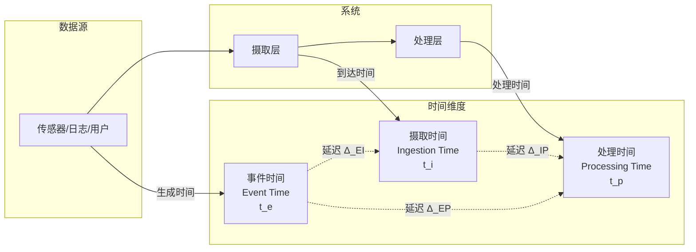
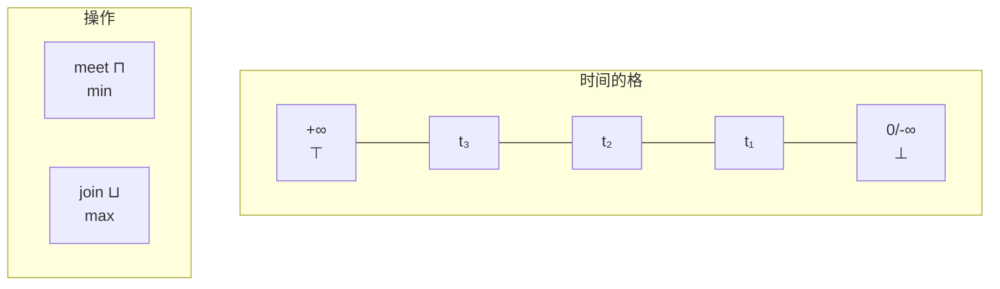
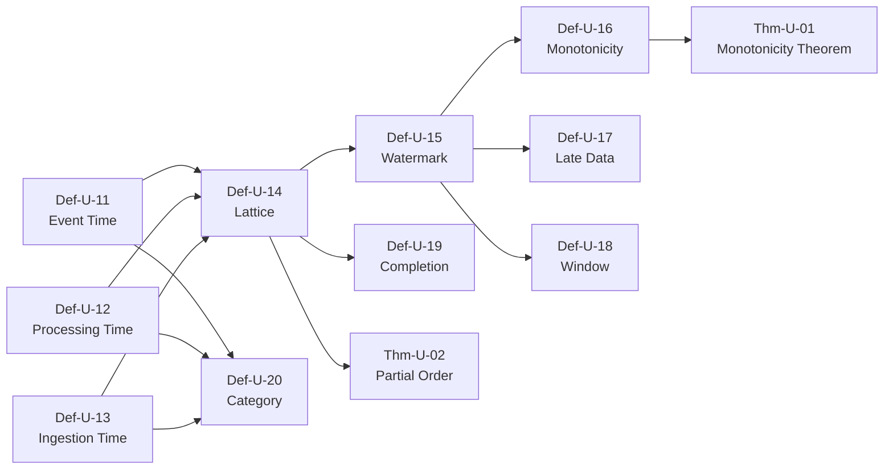

# 统一时间模型 (Unified Time Model)

> **文档类型**: 阶段二 - 统一流模型 | **形式化等级**: L5 | **编号**: 01.02
> **阶段**: 第6周 | **依赖**: 01.01-stream-mathematical-definition.md

---

## 目录

- [统一时间模型 (Unified Time Model)](#统一时间模型-unified-time-model)
  - [目录](#目录)
  - [0. 前置依赖](#0-前置依赖)
  - [1. 概念定义 (Definitions)](#1-概念定义-definitions)
    - [Def-U-11: 事件时间 (Event Time)](#def-u-11-事件时间-event-time)
    - [Def-U-12: 处理时间 (Processing Time)](#def-u-12-处理时间-processing-time)
    - [Def-U-13: 摄取时间 (Ingestion Time)](#def-u-13-摄取时间-ingestion-time)
    - [Def-U-14: 时间的格结构](#def-u-14-时间的格结构)
    - [Def-U-15: Watermark作为时间下界](#def-u-15-watermark作为时间下界)
    - [Def-U-16: Watermark的单调性](#def-u-16-watermark的单调性)
    - [Def-U-17: 迟到数据 (Late Data)](#def-u-17-迟到数据-late-data)
    - [Def-U-18: 时间窗口的形式化](#def-u-18-时间窗口的形式化)
    - [Def-U-19: 时间域的完备化](#def-u-19-时间域的完备化)
    - [Def-U-20: 时间模型的范畴表示](#def-u-20-时间模型的范畴表示)
  - [2. 属性推导 (Properties)](#2-属性推导-properties)
    - [Lemma-U-03: Watermark作为下闭集的特征函数](#lemma-u-03-watermark作为下闭集的特征函数)
    - [Lemma-U-04: 窗口分配函数的分配律](#lemma-u-04-窗口分配函数的分配律)
  - [3. 关系建立 (Relations)](#3-关系建立-relations)
    - [与流定义的关系](#与流定义的关系)
    - [三种时间类型的对比](#三种时间类型的对比)
  - [4. 论证过程 (Argumentation)](#4-论证过程-argumentation)
    - [4.1 为什么Watermark必须是单调的](#41-为什么watermark必须是单调的)
    - [4.2 时间窗口 vs 计数窗口](#42-时间窗口-vs-计数窗口)
  - [5. 形式证明 (Formal Proof)](#5-形式证明-formal-proof)
    - [Thm-U-01: Watermark单调性定理](#thm-u-01-watermark单调性定理)
    - [Thm-U-02: 事件时间与处理时间的偏序关系](#thm-u-02-事件时间与处理时间的偏序关系)
  - [6. 实例验证 (Examples)](#6-实例验证-examples)
    - [示例1: 三种时间类型的实际场景](#示例1-三种时间类型的实际场景)
    - [示例2: Watermark生成与迟到数据处理](#示例2-watermark生成与迟到数据处理)
  - [7. 可视化 (Visualizations)](#7-可视化-visualizations)
    - [图1: 三种时间类型关系图](#图1-三种时间类型关系图)
    - [图2: Watermark推进与窗口触发](#图2-watermark推进与窗口触发)
    - [图3: 时间模型的格结构](#图3-时间模型的格结构)
  - [8. 引用参考 (References)](#8-引用参考-references)
  - [附录](#附录)
    - [A. 符号表](#a-符号表)
    - [B. 依赖图](#b-依赖图)

## 0. 前置依赖

本文档依赖以下文档：

- 流的数学定义: [01.01-stream-mathematical-definition.md](./01.01-stream-mathematical-definition.md)
- 格论基础: [00.02-lattice-order-theory.md](../00-meta/00.02-lattice-order-theory.md)

---

## 1. 概念定义 (Definitions)

### Def-U-11: 事件时间 (Event Time)

**形式化定义**:

$$
\text{EventTime}: \text{Event} \rightarrow \mathcal{T}
$$

其中时间域 $\mathcal{T}$ 可以定义为：

**离散时间**:

$$
\mathcal{T}_\mathbb{N} = \mathbb{N} \quad \text{(自然数，如毫秒级时间戳)}
$$

**连续时间**:

$$
\mathcal{T}_\mathbb{R} = \mathbb{R}^+ \cup \{0\} \quad \text{(非负实数)}
$$

**时间戳表示**:

$$
t_e(e) = \pi_1(e) \in \mathcal{T}
$$

其中 $\pi_1$ 是事件三元组的第一投影。

**性质**:

- 事件时间由数据源产生，反映业务逻辑发生的实际时间
- 事件时间在单条流上通常递增，但跨流无序
- 事件时间是不可靠的（可能乱序、延迟）

**示例**:

```
传感器读数: 2026-04-08T14:06:16.123Z
用户点击事件: 1712575576123 (Unix毫秒)
日志条目: 1712575576 (Unix秒)
```

**直观解释**: 事件时间是流计算中最重要的概念之一。它代表了数据所描述的现实世界事件发生的时间，而不是数据被系统处理的时间。例如，一个温度传感器在14:06:16测量的温度，这个14:06:16就是事件时间，即使这个数据可能因为网络延迟在14:06:20才被系统接收。

---

### Def-U-12: 处理时间 (Processing Time)

**形式化定义**:

$$
\text{ProcessingTime}: () \rightarrow \mathcal{T}
$$

处理时间是系统当前时间的函数：

$$
t_p = \text{now}() \in \mathcal{T}
$$

**特性**:

| 特性 | 说明 | 影响 |
|------|------|------|
| 单调递增 | $\forall t_1 < t_2. \, \text{now}(t_1) \leq \text{now}(t_2)$ | 保证因果性 |
| 全局可用 | 任何算子都可访问 | 实现简单 |
| 不可靠的延迟 | 不反映数据产生时间 | 结果可能不精确 |

**与事件时间的关系**:

对于任意事件 $e$，定义**处理延迟**：

$$
\Delta(e) = t_p(\text{process}(e)) - t_e(e)
$$

**延迟分类**:

$$
\Delta(e) \begin{cases}
< 0 & \text{不可能（违反因果）} \\
\approx 0 & \text{理想情况（实时处理）} \\
\text{small} & \text{正常延迟（毫秒~秒）} \\
\text{large} & \text{迟到数据（需特殊处理）}
\end{cases}
$$

**直观解释**: 处理时间是系统 wall-clock 时间，即代码实际执行时的时间。它最简单、最可靠（单调递增），但可能不反映业务时间。例如，如果我们处理昨天的日志文件，处理时间是"现在"，但事件时间是"昨天"。

---

### Def-U-13: 摄取时间 (Ingestion Time)

**形式化定义**:

$$
\text{IngestionTime}: \text{Event} \times \text{SystemState} \rightarrow \mathcal{T}
$$

$$
t_i(e) = \text{now}() \text{ when } e \text{ enters the system}
$$

**性质**:

**单调性**: 若 $e_1$ 在 $e_2$ 之前进入系统，则 $t_i(e_1) \leq t_i(e_2)$

**与事件时间的关系**:

对于任意事件 $e$:

$$
t_e(e) \leq t_i(e) \leq t_p(\text{process}(e))
$$

**适用场景**:

| 场景 | 推荐时间类型 | 原因 |
|------|-------------|------|
| 乱序数据 | 事件时间 | 保证顺序正确性 |
| 低延迟要求 | 处理时间 | 无需等待迟到数据 |
| 源无时间戳 | 摄取时间 | 退而求其次的选择 |

**直观解释**: 摄取时间是数据进入流处理系统的时间。它介于事件时间和处理时间之间——比事件时间可靠（不会乱序），比处理时间更有意义（反映数据到达时间）。当源数据没有时间戳时，摄取时间是最佳选择。

---

### Def-U-14: 时间的格结构

**形式化定义**:

定义时间上的偏序关系：

**事件时间偏序**:

对事件 $e_1, e_2$:

$$
e_1 \leq_e e_2 \iff t_e(e_1) \leq t_e(e_2)
$$

**处理时间全序**:

$$
t_1 \leq_p t_2 \iff t_1 \leq t_2 \text{ (标准序)}
$$

**格结构**:

$(\mathcal{T}, \leq)$ 构成**全序集**（chain），因此也是格：

**交 (Meet)**:

$$
t_1 \sqcap t_2 = \min(t_1, t_2)
$$

**并 (Join)**:

$$
t_1 \sqcup t_2 = \max(t_1, t_2)
$$

**完备格**:

若 $\mathcal{T}$ 是扩展实数 $\mathbb{R} \cup \{\pm\infty\}$，则 $(\mathcal{T}, \leq)$ 是完备格。

**时间戳格**:

对事件集合 $E$，定义**时间戳投影格**：

$$
\mathcal{L}_E = (\{ t_e(e) \mid e \in E \}, \leq)
$$

**直观解释**: 时间的格结构为窗口操作和Watermark提供了数学基础。join和meet操作对应于时间范围的交集和并集。完备格保证任意时间集合都有最小上界和最大下界，这在定义无限时间窗口时非常重要。

---

### Def-U-15: Watermark作为时间下界

**形式化定义**:

**Watermark** 是一个单调递增的时间戳，表示所有事件时间小于该Watermark的事件都已到达（或判定为迟到）：

$$
\text{Watermark}: \mathcal{T} \rightarrow \mathcal{T}
$$

$$
W(t) \in \mathcal{T}, \quad \frac{dW}{dt} \geq 0 \text{ (单调非减)}
$$

**Watermark语义**:

对于Watermark值 $w$:

$$
\forall e. \, t_e(e) < w \Rightarrow e \text{ 已到达或已判定为迟到}
$$

等价表述：

$$
\{ e \mid t_e(e) < w \} \subseteq \text{Arrived}(t) \cup \text{Late}(t)
$$

**Watermark生成策略**:

| 策略 | 定义 | 特点 |
|------|------|------|
| Periodic | $W(t) = \max_{e \in \text{last}(t-\delta, t)} t_e(e) - \epsilon$ | 周期性推进 |
| Punctuated | 由特定事件触发 | 精确但依赖源数据 |
| Idle | 对空闲源注入虚拟Watermark | 避免全局停滞 |

**直观解释**: Watermark是流处理系统的"进度指示器"。它告诉系统："我已经看到了所有时间戳小于X的数据（除了那些确定会迟到的）"。这使得系统可以安全地触发时间窗口的计算，而不必无限期等待迟到数据。

---

### Def-U-16: Watermark的单调性

**形式化定义**:

Watermark必须满足**单调非减**性质：

$$
\forall t_1 < t_2. \, W(t_1) \leq W(t_2)
$$

**严格单调性** (理想情况):

$$
\exists \delta > 0. \, W(t + \delta) > W(t)
$$

**推进机制**:

$$
W_{new} = \begin{cases}
\max(W_{old}, W_{incoming}) & \text{收到新Watermark} \\
W_{old} + \Delta & \text{周期性推进（可选）} \\
W_{old} & \text{其他情况}
\end{cases}
$$

**单调性保证**:

$$
W_{new} \geq W_{old}
$$

**直观解释**: Watermark的单调性至关重要，因为一旦Watermark向前推进，我们就不能再"回退"——否则已经触发计算的窗口可能需要重新计算，导致结果不一致。单调性保证了系统的因果性和结果的正确性。

---

### Def-U-17: 迟到数据 (Late Data)

**形式化定义**:

事件 $e$ 是**迟到**的当且仅当：

$$
t_e(e) < W(t_{current}) \land e \text{ 在当前Watermark之后才到达}
$$

**迟到度量**:

**迟到程度**:

$$
\text{lateness}(e) = W(t_{arrival}(e)) - t_e(e)
$$

**迟到分类**:

$$
\text{lateness}(e) \begin{cases}
\leq 0 & \text{准时到达} \\
(0, \text{allowedDelay}) & \text{可接受迟到} \\
> \text{allowedDelay} & \text{严重迟到（通常丢弃）}
\end{cases}
$$

**迟到处理策略**:

| 策略 | 语义 | 适用场景 |
|------|------|----------|
| Drop | 丢弃 | 低精度要求，高吞吐 |
| Update | 更新已触发结果 | 精确要求 |
| SideOutput | 输出到侧流 | 审计、分析 |

**迟到数据比率**:

$$
R_{late} = \frac{|\{ e \mid \text{late}(e) \}|}{|\{ e \}|}
$$

**直观解释**: 迟到数据是流处理的固有问题。由于网络延迟、时钟偏移等原因，事件时间较早的数据可能在Watermark推进之后才到达。系统必须决定如何处理这些数据——丢弃、更新结果，或者单独处理。这体现了延迟与正确性的权衡。

---

### Def-U-18: 时间窗口的形式化

**形式化定义**:

**窗口**是时间的区间：

$$
\text{Window} = [t_{start}, t_{end}) \subseteq \mathcal{T}
$$

**窗口分配函数**:

$$
\text{assign}: \text{Event} \rightarrow \mathcal{P}(\text{Window})
$$

**窗口类型**:

**1. 滚动窗口 (Tumbling Window)**:

$$
\text{Tumbling}(\delta) = \{ [n\delta, (n+1)\delta) \mid n \in \mathbb{Z} \}
$$

$$
\text{assign}(e) = [\lfloor t_e(e)/\delta \rfloor \cdot \delta, (\lfloor t_e(e)/\delta \rfloor + 1) \cdot \delta)
$$

**2. 滑动窗口 (Sliding Window)**:

$$
\text{Sliding}(\delta, \text{slide}) = \{ [n \cdot \text{slide}, n \cdot \text{slide} + \delta) \mid n \in \mathbb{Z} \}
$$

$$
\text{assign}(e) = \{ [n \cdot \text{slide}, n \cdot \text{slide} + \delta) \mid t_e(e) \in [n \cdot \text{slide}, n \cdot \text{slide} + \delta) \}
$$

**3. 会话窗口 (Session Window)**:

$$
\text{Session}(\text{gap}): \text{Event}^* \rightarrow \mathcal{P}(\text{Window})
$$

动态定义：事件 $e_i, e_{i+1}$ 属于同一会话当且仅当 $t_e(e_{i+1}) - t_e(e_i) < \text{gap}$。

**窗口触发条件**:

$$
\text{trigger}(w) = W(t) \geq t_{end}(w) + \text{allowedDelay}
$$

**直观解释**: 窗口是将无限流切分为有限块的主要机制。滚动窗口将时间划分为不重叠的等长区间；滑动窗口允许重叠，适用于移动平均等场景；会话窗口根据活动间隙动态分组，适用于用户行为分析。

---

### Def-U-19: 时间域的完备化

**形式化定义**:

原始时间域 $\mathcal{T}$（如 $\mathbb{R}^+$）通过添加极限点进行**完备化**：

$$
\overline{\mathcal{T}} = \mathcal{T} \cup \{\top, \bot\}
$$

其中：

- $\top = +\infty$: 最大元（未来极限）
- $\bot = 0$ 或 $-\infty$: 最小元（过去极限）

**完备格结构**:

$(\overline{\mathcal{T}}, \leq, \bot, \top)$ 构成完备格：

$$
\forall S \subseteq \overline{\mathcal{T}}. \, \exists \bigsqcup S, \exists \bigsqcap S
$$

**特殊时间值**:

| 符号 | 含义 | 使用场景 |
|------|------|----------|
| $\top$ | 正无穷 | 永不过期的Watermark |
| $\bot$ | 负无穷/零 | 初始Watermark值 |
| $W_{max}$ | 系统定义的最大值 | 有界时间域 |

**直观解释**: 时间域的完备化允许我们处理"无限"的概念。例如，我们可以定义一个Watermark永远不超过某个值（表示永远不认为窗口完整），或者定义事件时间可能无限延伸到未来。这在理论分析中非常重要。

---

### Def-U-20: 时间模型的范畴表示

**形式化定义**:

定义**时间范畴** $\mathbf{Time}$：

**对象**:

$$\text{Obj}(\mathbf{Time}) = \{ \mathcal{T}_E, \mathcal{T}_P, \mathcal{T}_I \}
$$

分别代表事件时间、处理时间、摄取时间的类型。

**态射**:

时间之间的转换映射：

$$
\begin{aligned}
\eta_{E \to I}: \mathcal{T}_E &\rightarrow \mathcal{T}_I, \quad t \mapsto t + \Delta_{EI}(t) \\
\eta_{I \to P}: \mathcal{T}_I &\rightarrow \mathcal{T}_P, \quad t \mapsto t + \Delta_{IP}(t) \\
\eta_{E \to P}: \mathcal{T}_E &\rightarrow \mathcal{T}_P, \quad t \mapsto t + \Delta_{EP}(t)
\end{aligned}
$$

其中 $\Delta$ 是延迟函数。

**延迟函数的性质**:

**非负性**: $\Delta(t) \geq 0$

**单调性**: 若 $t_1 \leq t_2$，则 $t_1 + \Delta(t_1) \leq t_2 + \Delta(t_2)$

**范畴交换图**:

```
    𝒯_E ──η_{E→I}──→ 𝒯_I
    │                  │
    │ η_{E→P}          │ η_{I→P}
    ↓                  ↓
    𝒯_P ←────id────── 𝒯_P
```

交换条件：$\eta_{E \to P} = \eta_{I \to P} \circ \eta_{E \to I}$

**即**: $\Delta_{EP}(t) = \Delta_{EI}(t) + \Delta_{IP}(t + \Delta_{EI}(t))$

**直观解释**: 时间范畴提供了时间模型的高阶抽象。对象是不同的"时间域"，态射是时间之间的转换。这允许我们形式化地分析不同时间类型之间的关系，以及延迟如何传播。

---

## 2. 属性推导 (Properties)

### Lemma-U-03: Watermark作为下闭集的特征函数

**陈述**:

Watermark $W(t)$ 刻画了事件时间的下闭集：

$$
\downarrow W(t) = \{ \tau \in \mathcal{T} \mid \tau \leq W(t) \}
$$

表示到时间 $t$ 为止"已处理"的事件时间集合。

**证明**:

由 Def-U-15，Watermark $W(t)$ 表示所有事件时间 $< W(t)$ 的事件都已到达或已判定为迟到。

因此，对于任意事件时间 $\tau \leq W(t)$，所有事件时间等于 $\tau$ 的事件都已处理。

集合 $\downarrow W(t)$ 正是下闭集的定义：包含所有小于等于 $W(t)$ 的元素。

单调性保证：若 $t_1 \leq t_2$，则 $\downarrow W(t_1) \subseteq \downarrow W(t_2)$。

**∎**

---

### Lemma-U-04: 窗口分配函数的分配律

**陈述**:

滚动窗口分配满足分配律：

$$
\text{assign}(e_1) = w \land \text{assign}(e_2) = w \Rightarrow \text{assign}(\text{combine}(e_1, e_2)) = w
$$

对于满足时间约束的组合操作。

**证明**:

对滚动窗口 $\text{Tumbling}(\delta)$：

若 $\text{assign}(e) = [n\delta, (n+1)\delta)$，则 $n\delta \leq t_e(e) < (n+1)\delta$。

组合操作 $\text{combine}(e_1, e_2)$ 的时间戳通常取 $t_e(e_1)$ 或 $t_e(e_2)$（或两者）。

若两者在同一窗口，组合后的事件时间仍在 $[n\delta, (n+1)\delta)$ 内。

**∎**

---

## 3. 关系建立 (Relations)

### 与流定义的关系

| 本文档 | 依赖文档 | 关系 |
|--------|----------|------|
| Def-U-11~13 | Def-U-01 | 事件时间是 Event 的第一个分量 |
| Def-U-14 | Def-U-06 | 时间的格结构与流的CPO结构兼容 |
| Def-U-15~17 | Def-U-02 | Watermark应用于 Stream 推进处理 |

### 三种时间类型的对比

```
时间轴:
─────────────────────────────────────────────────────────→
     │              │              │
   t_e(e)        t_i(e)        t_p(e)
  事件产生     进入系统        被处理
     │              │              │
     └──────────────┴──────────────┘
          延迟 Δ(e) = t_p(e) - t_e(e)
```

| 特性 | 事件时间 | 处理时间 | 摄取时间 |
|------|----------|----------|----------|
| 语义 | 业务时间 | 系统时间 | 到达时间 |
| 顺序保证 | 弱（可能乱序） | 强（单调） | 强（单调） |
| 结果确定性 | 确定 | 不确定 | 较确定 |
| 迟到数据 | 需要处理 | 无 | 无 |
| 适用场景 | 精确统计 | 低延迟 | 无时间戳源 |

---

## 4. 论证过程 (Argumentation)

### 4.1 为什么Watermark必须是单调的

**反证**: 假设Watermark $W$ 非单调，即存在 $t_1 < t_2$ 使得 $W(t_1) > W(t_2)$。

考虑窗口 $w = [W(t_2), W(t_1))$:

- 在时间 $t_1$，$W(t_1) > W(t_2)$，窗口 $w$ 可能已被触发
- 在时间 $t_2 < t_1$，$W(t_2) < W(t_1)$，但 $W$ 回退了

如果 $W$ 回退，意味着我们"撤销"了之前的进度声明。这会导致：

1. 已触发的窗口计算可能需要重新执行
2. 已经输出的结果可能需要修正
3. 下游系统收到不一致的数据

工程上，Flink 等系统通过严格推进Watermark来保证单调性。

### 4.2 时间窗口 vs 计数窗口

**计数窗口**基于元素数量：

$$
\text{CountWindow}(n) = \{ e_i, e_{i+1}, \ldots, e_{i+n-1} \}
$$

**对比**:

| 特性 | 时间窗口 | 计数窗口 |
|------|----------|----------|
| 语义 | 业务时间 | 处理顺序 |
| 结果确定 | 确定（基于事件时间） | 不确定（依赖处理顺序） |
| 延迟敏感 | 不敏感 | 敏感（处理速度影响窗口） |
| 适用场景 | 时间序列分析 | 批处理模拟 |

**结论**: 事件时间窗口是流处理的"正确"抽象，计数窗口仅适用于特定场景。

---

## 5. 形式证明 (Formal Proof)

### Thm-U-01: Watermark单调性定理

**定理陈述**:

在正确实现的流处理系统中，Watermark 满足单调非减性：

$$
\forall t_1, t_2 \in \mathcal{T}_P. \, t_1 < t_2 \Rightarrow W(t_1) \leq W(t_2)
$$

且推进机制保证：

$$
W(t + \Delta) = \max(W(t), \max_{e \in \text{arrived}(t, t+\Delta)} t_e(e) - \epsilon)
$$

**证明**:

**步骤1**: 定义Watermark的生成和传播规则。

**源算子**生成的Watermark：

$$
W_{source}(t) = \min_{\text{active sources}} (\max_{e \in \text{buffer}} t_e(e) - \epsilon)
$$

**传播规则**：

对于算子 $op$ 有 $n$ 个输入，接收Watermark $W_1, W_2, \ldots, W_n$：

$$
W_{out} = \min(W_1, W_2, \ldots, W_n)
$$

**步骤2**: 证明生成的Watermark单调。

对源算子，设 $t_1 < t_2$。

$$W_{source}(t_2) = \max_{e \in \text{buffer}(t_2)} t_e(e) - \epsilon$$

$$\text{buffer}(t_1) \subseteq \text{buffer}(t_2) \cup \text{processed}(t_1, t_2)$$

因此：

$$\max_{e \in \text{buffer}(t_1)} t_e(e) \leq \max_{e \in \text{buffer}(t_2)} t_e(e)$$

（因为已处理的事件事件时间 $\leq$ 仍在buffer中的最大事件时间）

故 $W_{source}(t_1) \leq W_{source}(t_2)$。

**步骤3**: 证明传播保持单调性。

若 $W_1(t_1) \leq W_1(t_2)$ 且 $W_2(t_1) \leq W_2(t_2)$，则：

$$\min(W_1(t_1), W_2(t_1)) \leq \min(W_1(t_2), W_2(t_2))$$

因为min函数是单调的。

**步骤4**: 归纳证明。

基础：源算子生成单调Watermark（步骤2）。

归纳：若上游算子的Watermark单调，则下游算子的Watermark也单调（步骤3）。

由算子图的拓扑排序，所有算子的Watermark都单调。

**∎**

**证明复杂度**: 时间复杂度 $O(|E|)$ 对每条边的Watermark传播。

---

### Thm-U-02: 事件时间与处理时间的偏序关系

**定理陈述**:

在流处理系统中，事件时间和处理时间满足：

1. **因果约束**: $\forall e. \, t_e(e) \leq t_p(\text{process}(e))$

2. **偏序兼容性**: 若 $e_1$ 因果先于 $e_2$（$e_1 \prec e_2$），则：

   $$t_e(e_1) < t_e(e_2) \lor (t_e(e_1) = t_e(e_2) \land t_p(e_1) \leq t_p(e_2))$$

3. **并发独立性**: 若 $e_1 \parallel e_2$（并发），则 $t_e(e_1)$ 和 $t_e(e_2)$ 无必然序关系。

**证明**:

**部分1: 因果约束**

由定义，处理时间是事件被处理时的系统时间。事件必须在产生后才能被处理，故：

$$t_e(e) \leq t_i(e) \leq t_p(\text{process}(e))$$

若违反，则意味着在事件产生前就处理，违反因果律。

**部分2: 偏序兼容性**

因果序 $e_1 \prec e_2$ 意味着 $e_1$ 影响 $e_2$ 的产生。

若 $t_e(e_1) > t_e(e_2)$，则 $e_2$ 在 $e_1$ 之前产生，但 $e_1$ 又影响 $e_2$，时间悖论。

故必须有 $t_e(e_1) \leq t_e(e_2)$。

若 $t_e(e_1) = t_e(e_2)$，则需处理时间保持顺序以保证确定性。

**部分3: 并发独立性**

并发事件无因果关系，故事件时间可以任意。

示例：两个独立传感器的读数可能同时产生，也可能先后产生，无必然序。

**∎**

---

## 6. 实例验证 (Examples)

### 示例1: 三种时间类型的实际场景

```python
from datetime import datetime, timedelta

# 模拟场景：传感器数据流
class SensorEvent:
    def __init__(self, event_time, value, sensor_id):
        self.event_time = event_time    # 传感器测量时间 (事件时间)
        self.ingestion_time = None       # 进入系统时间 (摄取时间)
        self.processing_time = None      # 处理时间 (处理时间)
        self.value = value
        self.sensor_id = sensor_id

# 场景：传感器在14:00:00测量，网络延迟3秒，系统14:00:05处理
sensor_time = datetime(2026, 4, 8, 14, 0, 0)
event = SensorEvent(sensor_time, 23.5, "T-001")

# 模拟网络传输（3秒延迟）
event.ingestion_time = sensor_time + timedelta(seconds=3)

# 模拟系统处理（再延迟2秒）
event.processing_time = event.ingestion_time + timedelta(seconds=2)

print(f"事件时间: {event.event_time}")
print(f"摄取时间: {event.ingestion_time}")
print(f"处理时间: {event.processing_time}")
print(f"端到端延迟: {event.processing_time - event.event_time}")
```

### 示例2: Watermark生成与迟到数据处理

```python
class WatermarkGenerator:
    def __init__(self, max_delay_seconds=5):
        self.max_delay = max_delay_seconds
        self.max_event_time = 0

    def process_event(self, event_time):
        """处理新事件，更新Watermark"""
        self.max_event_time = max(self.max_event_time, event_time)
        # Watermark = 最大事件时间 - 最大允许延迟
        return self.max_event_time - self.max_delay

    def is_late(self, event_time, current_watermark):
        """判断事件是否迟到"""
        return event_time < current_watermark

# 使用示例
generator = WatermarkGenerator(max_delay_seconds=5)

# 模拟事件到达
events = [
    (10, "e1"),   # 事件时间=10
    (12, "e2"),   # 事件时间=12
    (8, "e3"),    # 事件时间=8 (迟到！)
    (15, "e4"),   # 事件时间=15
]

for event_time, event_id in events:
    watermark = generator.process_event(event_time)
    is_late = generator.is_late(event_time, watermark)
    status = "LATE" if is_late else "OK"
    print(f"Event {event_id}(t={event_time}): Watermark={watermark}, Status={status}")
```

---

## 7. 可视化 (Visualizations)

### 图1: 三种时间类型关系图



**图说明**: 展示了三种时间类型在数据流中的产生位置，以及它们之间的延迟关系。

### 图2: Watermark推进与窗口触发

```mermaid
gantt
    title Watermark推进时间线
    dateFormat X
    axisFormat %s

    section 事件到达
    Event 1 (t=10)  :10, 11
    Event 2 (t=12)  :12, 13
    Event 3 (t=8, late) :crit, 15, 16
    Event 4 (t=15)  :18, 19
    Event 5 (t=20)  :22, 23

    section Watermark
    W=5  :10, 12
    W=7  :12, 15
    W=10 :15, 18
    W=13 :18, 22
    W=18 :22, 25

    section 窗口
    Window [0,10)   :done, 10, 15
    Window [10,20)  :active, 15, 25
    Window [20,30)  :25, 30
```



**图说明**: 展示了Watermark如何随事件到达而推进，以及窗口何时被触发（当Watermark超过窗口结束时间）。

### 图3: 时间模型的格结构



**图说明**: 展示了时间作为全序集（链）的格结构，以及meet和join操作。

---

## 8. 引用参考 (References)


---

## 附录

### A. 符号表

| 符号 | 含义 |
|------|------|
| $t_e$ | 事件时间 |
| $t_p$ | 处理时间 |
| $t_i$ | 摄取时间 |
| $W(t)$ | 时间 $t$ 时的Watermark值 |
| $\downarrow w$ | 时间 $w$ 的下闭集 |
| $\delta$ | 窗口大小 |
| $\epsilon$ | 延迟容忍（heuristic） |

### B. 依赖图



---

*文档版本: 2026.04 | 形式化等级: L5 | 状态: 阶段二 - 第6周*
